**Learning Objectives**

In this unit, the student is exposed to

- Kepler's laws for planetary motion
- Newton's law of gravitation
- connection between Kepler's laws and law of gravitation
- calculation of gravitational field and potential
- calculation of variation of acceleration due to gravity
- calculation of escape speed and energy of satellites
- concept of weightlessness
- advantage of heliocentric system over geocentric system
- measurement of the radius of Earth using Eratosthenes method
- recent developments in gravitation and astrophysics

# INTRODUCTION

We are amazed looking at the glittering sky; we wonder how the Sun rises in the East and sets in the West, why there are comets or why stars twinkle. The sky has been an object of curiosity for human beings from time immemorial. We have always wondered about the motion of stars, the Moon, and the planets. From Aristotle to Stephen Hawking, great minds have tried to understand the movement of celestial objects in space and what causes their motion.

The ‘Theory of Gravitation’ was developed by Newton in the late 17th century to explain the motion of celestial objects and terrestrial objects and answer most of the queries raised. In spite of the study of gravitation and its effect on celestial objects, spanning last three centuries, “gravitation” is still one of the active areas of research in physics today. In 2017, the Nobel Prize in Physics was given for the detection of ‘Gravitational waves’ which was theoretically predicted by Albert Einstein in the year 1915. Understanding planetary motion, the formation of stars and galaxies, and recently massive objects like black holes and their life cycle have remained the focus of study for the past few centuries in physics.

**Geocentric Model of Solar System** In the second century, Claudius Ptolemy, a famous Greco-Roman astronomer, developed a theory to explain the motion of celestial objects like the Sun, the Moon, Mars, Jupiter etc. This theory was called the geocentric model. According to the geocentric model, the Earth is at the center of the universe and all celestial objects including the Sun, the Moon, and other planets orbit the Earth. Ptolemy’s model closely matched with the observations of the sky with our naked eye. But later, astronomers found that even though Ptolemy’s model successfully explained the motion of the Sun and the Moon up to a certain level, the motion of Mars and Jupiter could not be explained effectively.

**Heliocentric Model of Nicholas Copernicus** In the 15th century, a Polish astronomer, Nicholas Copernicus (1473-1543) proposed a new model called the ‘Heliocentric model’ in which the Sun was considered to be at the center of the solar system and all planets including the Earth orbited the Sun in circular orbits. This model successfully explained the motion of all celestial objects.

Around the same time, Galileo, a famous Italian physicist discovered that all objects close to Earth were accelerated towards the Earth at the same rate. Meanwhile, a noble man called Tycho Brahe (1546-1601) spent his entire lifetime in recording the observations of the stellar and planetary positions with his naked eye. The data that he compiled were analyzed later by his assistant Johannes Kepler (1571–1630) and eventually the analysis led to the deduction of the laws of the planetary motion. These laws are termed as ‘Kepler’s laws of planetary motion’.  

## Kepler’s Laws of Planetary Motion

Kepler’s laws are stated as follows:

1. **Law of orbits:** Each planet moves around the Sun in an elliptical orbit with the Sun at one of the foci.

.\
**Figure 6.1** An ellipse traced out by a planet around the Sun.

The closest point of approach of the planet to the Sun ‘P’ is called perihelion and the farthest point ‘A’ is called aphelion (Figure 6.1). The semi-major axis is ‘a’ and semi-minor axis is ‘b’. In fact, both Copernicus and Ptolemy considered planetary orbits to be circular, but Kepler discovered that the actual orbits of the planets are elliptical.

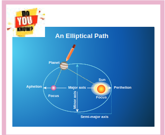

.\
**Figure 6.2** Motion of a planet around the Sun depicting ‘law of area’.

2. **Law of area:**

The radial vector (line joining the Sun to a planet) sweeps equal areas in equal intervals of time.

In Figure 6.2, the white shaded portion is the area DA swept in a small interval of time Dt, by a planet around the Sun. Since the Sun is not at the center of the ellipse, the planets travel faster when they are nearer to the Sun and slower when they are farther from it, to cover equal area in equal intervals of time. Kepler discovered the law of area by carefully noting the variation in the speed of planets.

3. **Law of period:**

The square of the time period of revolution of a planet around the Sun in its elliptical orbit is directly proportional to the cube of the semi-major axis of the ellipse. It can be written as:

\[
\begin{gathered}
T^{2} \propto a^{3} \\
\frac{T^{2}}{a^{3}}=\text { constant }
\end{gathered}
\]

where \(T\) is the time period of revolution for a planet and \(a\) is the semi-major axis. Physically this law implies that as the distance of the planet from the Sun increases, the time period also increases but not at the same rate.

In Table 6.1, the time period of revolution of planets around the Sun along with their semi-major axes are given. From column four, we can realize that \(\frac{T^{2}}{a^{3}}\) is nearly a constant endorsing Kepler's third law.

Table 6.1 The time period of revolution of the planets revolving around the Sun and their semi-major axes.

| Planet | a | T | \(T^{2}/a^{3}\) |
| :--- | :--- | :--- | :---: |
|  | \(\left(10^{10} \, \text{m}\right)\) | (years) |  |
| Mercury | 5.79 | 0.24 | 2.95 |
| Venus | 10.8 | 0.615 | 3.00 |
| Earth | 15.0 | 1 | 2.96 |
| Mars | 22.8 | 1.88 | 2.98 |
| Jupiter | 77.8 | 11.9 | 3.01 |
| Saturn | 143 | 29.5 | 2.98 |
| Uranus | 287 | 84 | 2.98 |
| Neptune | 450 | 165 | 2.99 |

| Points to Contemplate |  |  |  |  |
| :--- | :---: | :---: | :--- | :---: |
| DATA | PROBLEM |  |  |  |
| Planet | a | T | What is |  |
| A | 1 | 3 | the law |  |
| B | 2 | 6 | connecting |  |
| C | 4 | 18 | \(a\) and \(T\)? |  |
| Comment on the relation between \(a\) |  |  |  |  |
| and T for these imaginary planets |  |  |  |  |

**EXAMPLE 6.1**

Consider two point masses \(m_{1}\) and \(m_{2}\) which are separated by a distance of 10 meter as shown in the following figure. Calculate the force of attraction between them and draw the directions of forces on each of them. Take \(m_{1}=1 \, \text{kg}\) and \(m_{2}=2 \, \text{kg}\)

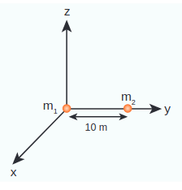

**Solution**

The force of attraction is given by

\[
\vec{F}=-\frac{G m_{1} m_{2}}{r^{2}} \hat{r}
\]

From the figure, \(r=10 \, \text{m}\).

First, we can calculate the magnitude of the force

\[
\begin{aligned}
F & =\frac{G m_{1} m_{2}}{r^{2}}=\frac{6.67 \times 10^{-11} \times 1 \times 2}{100} \\
& =13.34 \times 10^{-13} \, \text{N}
\end{aligned}
\]

It is to be noted that this force is very small. This is the reason we do not feel the gravitational force of attraction between each other. The small value of \(G\) plays a very crucial role in deciding the strength of the force.

The force of attraction \(\left(\vec{F}_{21}\right)\) experienced by the mass \(m_{2}\) due to \(m_{1}\) is in the negative ' \(y\) ' direction ie., \(\hat{r}=-\hat{j}\). According to Newton's third law, the mass \(m_{2}\) also exerts equal and opposite force on \(m_{1}\). So the force of attraction \(\left(\vec{F}_{12}\right)\) experienced by \(m_{1}\) due to \(m_{2}\) is in the direction of positive ' \(y\) ' axis ie., \(\hat{r}=\hat{j}\).

\[
\begin{aligned}
& \vec{F}_{21}=-13.34 \times 10^{-13} \hat{j} \\
& \vec{F}_{12}=13.34 \times 10^{-13} \hat{j}
\end{aligned}
\]

The direction of the force is shown in the figure,

Gravitational force of attraction between \(m_{1}\) and \(m_{2}\)

\(\vec{F}_{12}=-\vec{F}_{21}\) which confirms Newton's third law.

**Important features of gravitational force:**

- As the distance between two masses increases, the strength of the force tends to decrease because of inverse dependence on \(r^{2}\). Physically it implies that the planet Uranus experiences less gravitational force from the Sun than the Earth since Uranus is at larger distance from the Sun compared to the Earth.

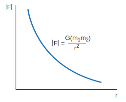

**Figure 6.4 Variation of gravitational force with distance** 

- The gravitational forces between two particles always constitute an actionreaction pair. It implies that the gravitational force exerted by the Sun on the Earth is always towards the Sun. The reaction-force is exerted by the Earth on the Sun. The direction of this reaction force is towards Earth.
- The torque experienced by the Earth due to the gravitational force of the Sun is given by

\[
\begin{gathered}
\vec{\tau}=\vec{r} \times \vec{F}=\vec{r} \times\left(-\frac{G M_{S} M_{E}}{r^{2}} \hat{r}\right)=0 \\
\text { Since } \vec{r}=r \hat{r},(\hat{r} \times \hat{r})=0
\end{gathered}
\]
So \(\vec{\tau}=\frac{d \vec{L}}{d t}=0\). It implies that angular momentum \(\vec{L}\) is a constant vector. The angular momentum of the Earth about the Sun is constant throughout the motion. It is true for all the planets. In fact, this constancy of angular momentum leads to the Kepler's second law.

- The expression \(\vec{F}=-\frac{G M_{1} M_{2}}{r^{2}} \hat{r}\) has one inherent assumption that both \(M_{1}\) and \(M_{2}\) are treated as point masses. When it is said that Earth orbits around the Sun due to Sun's gravitational force, we assumed Earth and Sun to be point masses. This assumption is a good approximation because the distance between the two bodies is very much larger than their diameters. For some irregular and extended objects separated by a small distance, we cannot directly use the equation (6.3). Instead, we have to invoke separate mathematical treatment which will be brought forth in higher classes.
- However, this assumption about point masses holds even for small distance for one special case. To calculate force of attraction between a hollow sphere of mass \(M\) with uniform density and point mass \(m\) kept outside the hollow sphere, we can replace the hollow sphere of mass \(M\) as equivalent to a point mass \(M\) located at the center of the hollow sphere. The force of attraction between the hollow sphere of mass \(M\) and point mass \(m\) can be calculated by treating the hollow sphere also as another point mass. Essentially the entire mass of the hollow sphere appears to be concentrated at the center of the hollow sphere. It is shown in the Figure 6.5(a).

- There is also another interesting result. Consider a hollow sphere of mass \(M\). If we place another object of mass ' \(m\) ' inside this hollow sphere as in Figure 6.5(b), the force experienced by this mass ' \(m\) ' will be zero. This calculation will be dealt with in higher classes.

However, this assumption about point masses holds even for small distance for one special case. To calculate force of attraction between a hollow sphere of mass M with uniform density and point mass m kept outside the hollow sphere, we can replace the hollow sphere of mass M as equivalent to a point mass M located at the center of the hollow sphere. The force of attraction between the hollow sphere of mass M and point mass m can be calculated by treating the hollow sphere also as another point mass. Essentially the entire mass of the hollow sphere appears to be concentrated at the center of the hollow sphere. It is shown in the Figure 6.5(a).

There is also another interesting result. Consider a hollow sphere of mass M. If we place another object of mass ‘m’ inside this hollow sphere as in Figure 6.5(b), the force experienced by this mass ‘m’ will be zero. This calculation will be dealt with in higher classes.

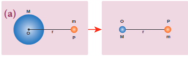

\
**Figure 6.5** A mass placed in a hollow sphere.

- The triumph of the law of gravitation is that it concludes that the mango that is falling down and the Moon orbiting the Earth are due to the same gravitational force.

Newton's inverse square Law:

Newton considered the orbits of the planets as circular. For circular orbit of radius \(r\), the centripetal acceleration towards the center is

\[
a=-\frac{v^{2}}{r}
\]

**Figure 6.6** Point mass orbiting in a circular orbit.

Here \(v\) is the velocity and \(r\), the distance of the planet from the center of the orbit (Figure 6.6).

The velocity in terms of known quantities \(r\) and \(T\), is

\[
v=\frac{2 \pi r}{T}
\]

Here \(T\) is the time period of revolution of the planet. Substituting this value of \(v\) in equation (6.4) we get,

\[
a=-\frac{\left(\frac{2 \pi r}{T}\right)^{2}}{r}=-\frac{4 \pi^{2} r}{T^{2}}
\]

Substituting the value of 'a' from (6.6) in Newton's second law, \(F=m a\), where ' \(m\) ' is the mass of the planet.

\[
F=-\frac{4 \pi^{2} m r}{T^{2}}
\]

From Kepler's third law,

\[
\frac{r^{3}}{T^{2}}=k(\text { constant })
\]

\[
\frac{r}{T^{2}}=\frac{k}{r^{2}}
\]

By substituting equation 6.9 in the force expression, we can arrive at the law of gravitation.

\[
F=-\frac{4 \pi^{2} m k}{r^{2}}
\]

Here negative sign implies that the force is attractive and it acts towards the center. In equation (6.10), mass of the planet ' \(m\) ' comes explicitly. But Newton strongly felt that according to his third law, if Earth is attracted by the Sun, then the Sun must also be attracted by the Earth with the same magnitude of force. So he felt that the Sun's mass (M) should also occur explicitly in the expression for force (6.10). From this insight, he equated the constant \(4 \pi^{2} k\) to GM which turned out to be the law of gravitation.

\[
F=-\frac{G M m}{r^{2}}
\]

Again the negative sign in the above equation implies that the gravitational force is attractive.

In the above discussion we assumed that the orbit of the planet to be circular which is not true as the orbit of the planet around the Sun is elliptical. But this circular orbit assumption is justifiable because planet's orbit is very close to being circular and there is only a very small deviation from the circular shape.

**Points to Contemplate**

If Kepler's third law was "\(r^{3} T^{2}=\) constant" instead of "\(\frac{r^{3}}{T^{2}}=\) constant" what would be the new law of gravitation? Would it still be an inverse square law? How would the gravitational force change with distance? In this new law of gravitation, will Neptune experience greater gravitational force or lesser gravitational force when compared to the Earth?

**EXAMPLE 6.2**

Moon and an apple are accelerated by the same gravitational force due to Earth. Compare the acceleration of the two.

The gravitational force experienced by the apple due to Earth
\[
F=-\frac{G M_{E} M_{A}}{R^{2}}
\]

Here \(M_{A}\) - Mass of the apple, \(M_{E}\) - Mass of the Earth and R - Radius of the Earth.

Equating the above equation with Newton's second law,

\[
M_{A} a_{A}=-\frac{G M_{E} M_{A}}{R^{2}}
\]

Simplifying the above equation we get,

\[
a_{A}=-\frac{G M_{E}}{R^{2}}
\]

Here \(a_{A}\) is the acceleration of apple that is equal to ' \(g\) '.

Similarly the force experienced by Moon due to Earth is given by

\[
F=-\frac{G M_{E} M_{m}}{R_{m}^{2}}
\]

Here \(R_{m}\) - distance of the Moon from the Earth, \(M_{m}\) - Mass of the Moon

The acceleration experienced by the Moon is given by

\[
a_{m}=-\frac{G M_{E}}{R_{m}^{2}}
\]

The ratio between the apple's acceleration to Moon's acceleration is given by

\[
\frac{a_{A}}{a_{m}}=\frac{R_{m}^{2}}{R^{2}}
\]

From the Hipparchrus measurement, the distance to the Moon is 60 times that of Earth radius. \(R_{m}=60 R\).

\[
a_{A} / a_{m}=\frac{(60 R)^{2}}{R^{2}}=3600 .
\]

The apple's acceleration is 3600 times the acceleration of the Moon.

The same result was obtained by Newton using his gravitational formula. The apple's acceleration is measured easily and it is \(9.8 \, \text{m} \, \text{s}^{-2}\). Moon orbits the Earth once in 27.3 days and by using the centripetal acceleration formula, (Refer unit 3).

\[
\frac{a_{A}}{a_{m}}=\frac{9.8}{0.00272}=3600
\]

which is exactly what he got through his law of gravitation.

**Note**
The above calculation depends on knowing the distance between the Earth and the Moon and the radius of the Earth. The radius of the Earth was measured by Greek librarian Eratosthenes and distance between the Earth and the Moon was measured by Greek astronomer Hipparchrus 2400 years ago. It is very interesting to note that in order to measure these distances he used only high school geometry and trigonometry. These details are discussed in the astronomy section (6.5)

## Gravitational Constant

In the law of gravitation, the value of gravitational constant \(G\) plays a very important role. The value of \(G\) explains why the gravitational force between the Earth and the Sun is so great while the same force between two small objects (for example between two human beings) is negligible.

The force experienced by a mass ' \(m\) ' which is on the surface of the Earth (Figure 6.7) is given by

\[
F=-\frac{G M_{E} m}{R_{E}^{2}}
\]

\(M_{E}\)-mass of the Earth, \(m\) - mass of the object, \(R_{E}\) - radius of the Earth.

Equating Newton's second law, \(F=-m g\), to equation (6.11) we get,

\[
\begin{aligned}
-m g & =-\frac{G M_{E} m}{R_{E}^{2}} \\
g & =\frac{G M_{E}}{R_{E}^{2}}
\end{aligned}
\]
Figure 6.7 Force experienced by a mass on the (i) surface of the Earth (ii) at a distance from the centre of the Earth

Now the force experienced by some other object of mass \(M\) at a distance \(r\) from the center of the Earth is given by,

\[
F=-\frac{G M_{E} M}{r^{2}}
\]

Using the value of \(g\) in equation (6.12), the force \(F\) will be,

\[
F=-g M \frac{R_{E}^{2}}{r^{2}}
\]

From this it is clear that the force can be calculated simply by knowing the value of \(g\). It is to be noted that in the above calculation \(G\) is not required.

In the year 1798, Henry Cavendish experimentally determined the value of gravitational constant ' \(G\) ' by using a torsion balance. He calculated the value of ' \(G\) ' to be equal to \(6.75 \times 10^{-11} \, \text{N} \, \text{m}^{2} \, \text{kg}^{-2}\). Using modern techniques a more accurate value of \(G\) could be measured. The currently accepted value of \(G\) is \(6.67259 \times 10^{-11} \, \text{N} \, \text{m}^{2} \, \text{kg}^{-2}\).

## Gravitational field

Force is basically due to the interaction between two particles. Depending upon the type of interaction we can have two kinds of forces: Contact forces and Non-contact forces (Figure 6.8).

\

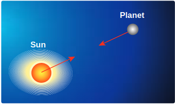

**Figure 6.8** Depiction of contact and non-contact forces

Contact forces are the forces applied where one object is in physical contact with the other. The movement of the object is caused by the physical force exerted through the contact between the object and the agent which exerts force.

Consider the case of Earth orbiting around the Sun. Though the Sun and the Earth are not physically in contact with each other, there exists an interaction between them. This is because of the fact that the Earth experiences the gravitational force of the Sun. This gravitational force is a noncontact force.

It sounds mysterious that the Sun attracts the Earth despite being very far from it and without touching it. For contact forces like push or pull, we can calculate the strength of the force since we can feel or see. But how do we calculate the strength of non-contact force at different distances? To understand and calculate the strength of non-contact forces, the concept of 'field' is introduced.

The gravitational force on a particle of mass ' \(m_{2}\) ' due to a particle of mass ' \(m_{1}\) ' is

\[
\vec{F}_{21}=-\frac{G m_{1} m_{2}}{r^{2}} \hat{r}
\]

where \(\hat{r}\) is a unit vector that points from \(m_{1}\) to \(m_{2}\) along the line joining the masses \(m_{1}\) and \(m_{2}\).

The gravitational field intensity \(\vec{E}_{1}\) (here after called as gravitational field) at a point which is at a distance \(r\) from \(m_{1}\) is defined as the gravitational force experienced by unit mass placed at that point. It is given by the ratio \(\frac{\vec{F}_{21}}{m_{2}}\) (where \(m_{2}\) is the mass of the object on which \(\vec{F}_{21}\) acts)

Using \(\vec{E}_{1}=\frac{\vec{F}_{21}}{m_{2}}\) in equation (6.14) we get,

\[
\vec{E}_{1}=-\frac{G m_{1}}{r^{2}} \hat{r}
\]

\(\vec{E}_{1}\) is a vector quantity that points towards the mass \(m_{1}\) and is independent of mass \(m_{2}\), Here \(m_{2}\) is taken to be of unit magnitude. The unit \(\hat{r}\) is along the line between \(m_{1}\) and the point in question. The field \(\vec{E}_{1}\) is due to the mass \(m_{1}\).

In general, the gravitational field intensity due to a mass \(M\) at a distance \(r\) is given by

\[
\vec{E}=-\frac{G M}{r^{2}} \hat{r}
\]

Now in the region of this gravitational field, a mass ' \(m\) ' is placed at a point \(P\) (Figure 6.9). Mass ' \(m\) ' interacts with the field \(\vec{E}\) and experiences an attractive force due to \(M\) as shown in Figure 6.9. The gravitational force experienced by ' \(m\) ' due to ' \(M\) ' is given by

**Figure 6.9** Gravitational Field intensity measured with an object of unit mass

\[
\vec{F}_{m}=m \vec{E}
\]

Now we can equate this with Newton's second law \(\vec{F}=m \vec{a}\)

\[
\begin{aligned}
m \vec{a} & =m \vec{E} \\
\vec{a} & =\vec{E}
\end{aligned}
\]

In other words, equation (6.18) implies that the gravitational field at a point is equivalent to the acceleration experienced by a particle at that point. However, it is to be noted that \(\vec{a}\) and \(\vec{E}\) are separate physical quantities that have the same magnitude and direction. The gravitational field \(\vec{E}\) is the property of the source and acceleration \(\vec{a}\) is the effect experienced by the test mass (unit mass) which is placed in the gravitational field \(\vec{E}\). The noncontact interaction between two masses can now be explained using the concept of "Gravitational field".

**Points to be noted:**

i) The strength of the gravitational field decreases as we move away from the mass \(M\) as depicted in the Figure 6.10. The magnitude of \(\vec{E}\) decreases as the distance \(r\) increases.

**Figure 6.10** Strength of the Gravitational field lines decreases with distance

Figure 6.10 shows that the strength of the gravitational field at points \(P, Q\) , and \(R\) is given by \(\left|\vec{E}_{P}\right|<\left|\vec{E}_{Q}\right|<\left|\vec{E}_{R}\right|\) . It can be understood by comparing the length of the vectors at points \(P, Q\) , and \(R\).

ii) The "field" concept was introduced as a mathematical tool to calculate gravitational interaction. Later it was found that field is a real physical quantity and it carries energy and momentum in space. The concept of field is inevitable in understanding the behavior of charges.

iii) The unit of gravitational field is Newton per kilogram \((\text{N}/\text{kg})\) or \(\text{m} \, \text{s}^{-2}\) .

## Superposition principle for Gravitational field

Consider ' \(n\) ' particles of masses \(m_{1}, m_{2}, \ldots . m_{n}\), distributed in space at positions \(\vec{r}_{1}, \vec{r}_{2}, \vec{r}_{3} \ldots\), etc, with respect to point \(P\). The total gravitational field at a point \(P\) due to all the masses is given by the vector sum of the gravitational field due to the individual masses (Figure 6.11). This principle is known as superposition of gravitational fields.

\[
\begin{aligned}
\vec{E}_{\text {total }} & =\vec{E}_{1}+\vec{E}_{2}+\ldots \vec{E}_{n} \\
& =-\frac{G m_{1}}{r_{1}^{2}} \hat{r}_{1}-\frac{G m_{2}}{r_{2}^{2}} \hat{r}_{2}-\ldots-\frac{G m_{n}}{r_{n}^{2}} \hat{r}_{n} \\
& =-\sum_{i=1}^{n} \frac{G m_{i}}{r_{i}^{2}} \hat{r}_{i} .
\end{aligned}
\]

**Figure 6.11** Superposition of two gravitational field intensities giving resultant field.

Instead of discrete masses, if we have continuous distribution of a total mass \(M\), then the gravitational field at a point \(P\) is calculated using the method of integration. 

**EXAMPLE 6.3**

(a) Two particles of masses \(m_{1}\) and \(m_{2}\) are placed along the \(x\) and \(y\) axes respectively at a distance 'a' from the origin. Calculate the gravitational field at a point \(P\) shown in figure below.

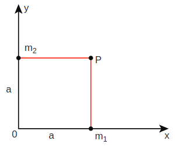

**Solution**

Gravitational field due to \(m_{1}\) at a point \(P\) is given by,

\[
\vec{E}_{1}=-\frac{G m_{1}}{a^{2}} \hat{j}
\]

Gravitational field due to \(m_{2}\) at the point \(p\) is given by,

\[
\begin{gathered}
\vec{E}_{2}=-\frac{G m_{2}}{a^{2}} \hat{i} \\
\vec{E}_{\text {total }}=-\frac{G m_{1}}{a^{2}} \hat{j}-\frac{G m_{2}}{a^{2}} \hat{i} \\
=-\frac{G}{a^{2}}\left(m_{1} \hat{j}+m_{2} \hat{i}\right)
\end{gathered}
\]

The direction of the total gravitational field is determined by the relative value of \(m_{1}\) and \(m_{2}\).

When \(m_{1}=m_{2}=m\)

\[
\vec{E}_{\text {total }}=-\frac{G m}{a^{2}}(\hat{i}+\hat{j})
\]

\((\hat{i}+\hat{j}=\hat{j}+\hat{i}\) as vectors obeys commutation law).

\(\vec{E}_{\text {total }}\) points towards the origin of the co-ordinate system and the magnitude of \(\vec{E}_{\text {total }}\) is \(\sqrt{2} \frac{G m}{a^{2}}\).

**EXAMPLE 6.4**

Qualitatively indicate the gravitational field of Sun on Mercury, Earth, and Jupiter shown in figure.

Since the gravitational field decreases as distance increases, Jupiter experiences a weak gravitational field due to the Sun. Since Mercury is the nearest to the Sun, it experiences the strongest gravitational field.

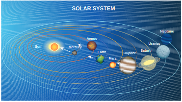

Solar System

## Gravitational Potential Energy

The concept of potential energy and its physical meaning were dealt in unit 4 . The gravitational force is a conservative force and hence we can define a gravitational potential energy associated with this conservative force field.

Two masses \(m_{1}\) and \(m_{2}\) are initially separated by a distance \(r^{\prime}\). Assuming \(m_{1}\) to be fixed in its position, work must be done on \(m_{2}\) to move the distance from \(r^{\prime}\) to \(r\) as shown in Figure 6.12(a)

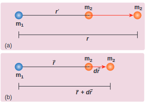

**Figure 6.12** Two distant masses changing the linear distance

To move the mass \(m_{2}\) through an infinitesimal displacement \(d \vec{r}\) from \(\vec{r}\) to \(\vec{r}+d \vec{r}\) (shown in the Figure 6.12(b)), work has to be done externally. This infinitesimal work is given by

\[
d W=\vec{F}_{e x t} \cdot d \vec{r}
\]

The work is done against the gravitational force, therefore,

\[
\left|\vec{F}_{e x t}\right|=\left|\vec{F}_{G}\right|=\frac{G m_{1} m_{2}}{r^{2}}
\]

Substituting Equation (6.22) in 6.21, we get

\[
d W=\frac{G m_{1} m_{2}}{r^{2}} \hat{r} \cdot d \vec{r}
\]

Also we know,

\[
\begin{aligned}
d \vec{r} & =d r \hat{r} \\
\Rightarrow d W & =\frac{G m_{1} m_{2}}{r^{2}} \hat{r} \cdot(d r \hat{r}) \\
\hat{r} \cdot \hat{r} & =1(\text { since both are unit vectors }) \\
\therefore \quad d W & =\frac{G m_{1} m_{2}}{r^{2}} d r
\end{aligned}
\]

Thus the total work done for displacing the particle from \(r^{\prime}\) to \(r\) is

\[
\begin{aligned}
& W=\int_{r^{\prime}}^{r} d W=\int_{r^{\prime}}^{r} \frac{G m_{1} m_{2}}{r^{2}} d r \\
& W=-\left(\frac{G m_{1} m_{2}}{r}\right)_{r^{\prime}}^{r} \\
& W=-\frac{G m_{1} m_{2}}{r}+\frac{G m_{1} m_{2}}{r^{\prime}} \\
& W=U(r)-U\left(r^{\prime}\right)
\end{aligned}
\]

where \(U(r)=\frac{-G m_{1} m_{2}}{r}\)

This work done \(W\) gives the gravitational potential energy difference of the system of masses \(m_{1}\) and \(m_{2}\) when the separation between them are \(r\) and \(r^{\prime}\) respectively.

**Case 1: If \(r<r^{\prime}\)**

Since gravitational force is attractive, \(m_{2}\) is attracted by \(m_{1}\). Then \(m_{2}\) can move from \(r^{\prime}\) to \(r\) without any external work (Figure 6.13(a)). Here work is done by the system spending its internal energy and hence the work done is said to be negative.

**Figure 6.13** Cases for calculation of work done by gravity

Case 2: If \(r>r^{\prime}\)

Work has to be done against gravity to move the object from \(r^{\prime}\) to \(r\) (Figure 6.13(b)). Therefore work is done on the body by external force and hence work done is positive.

It is to be noted that only potential energy difference has physical significance. Now gravitational potential energy can be discussed by choosing one point as the reference point.

Let us choose \(r^{\prime}=\infty\). Then the second term in the equation (6.28) becomes zero.

\[
W=-\frac{G m_{1} m_{2}}{r}+0
\]

Now we can define gravitational potential energy of a system of two masses \(m_{1}\) and \(m_{2}\) separated by a distance \(r\) as the amount of work done to take the mass \(m_{2}\) from a distance \(r\) to infinity assuming \(m_{1}\) to be fixed in its position and is written as \(U(r)=-\frac{G m_{1} m_{2}}{r}\). It is to be noted that the gravitational potential energy of the system consisting of two masses \(m_{1}\) and \(m_{2}\) separated by a distance \(r\), is the gravitational potential energy difference of the system when the masses are separated by an infinite distance and by distance r. \(U(r)=U(r)-U(\infty)\). Here we choose \(U(\infty)=0\) as the reference point. The gravitational potential energy \(U(r)\) is always negative because when two masses come together slowly from infinity, work is done by the system.

The unit of gravitational potential energy \(U(r)\) is Joule and it is a scalar quantity. The gravitational potential energy depends upon the two masses and the distance between them.

## Gravitational potential energy near the surface of the Earth

It is already discussed in chapter 4 that when an object of mass \(m\) is raised to a height \(h\), the potential energy stored in the object is mgh (Figure 6.14). This can be derived using the general expression for gravitational potential energy.

Figure 6.14 Mass placed at a distance \(r\) from the center of the Earth

Consider the Earth and mass system, with \(r\), the distance between the mass \(m\) and the Earth's centre. Then the gravitational potential energy,

\[
U=-\frac{G M_{e} m}{r}
\]

Here \(r=R_{e}+h\), where \(R_{e}\) is the radius of the Earth. \(h\) is the height above the Earth's surface

\[
U=-G \frac{M_{e} m}{\left(R_{e}+h\right)}
\]

If \(h \ll R_{e}\), equation (6.31) can be modified as

\[
\begin{aligned}
& U=-G \frac{M_{e} m}{R_{e}\left(1+h / R_{e}\right)} \\
& U=-G \frac{M_{e} m}{R_{e}}\left(1+h / R_{e}\right)^{-1}
\end{aligned}
\]

By using Binomial expansion and neglecting the higher order terms, we get

\[
U=-G \frac{M_{e} m}{R_{e}}\left(1-\frac{h}{R_{e}}\right)
\]

We know that, for a mass \(m\) on the Earth's surface,

\[
G \frac{M_{e} m}{R_{e}}=m g R_{e}
\]

Substituting equation (6.34) in (6.33) we get,

\[
U=-m g R_{e}+m g h
\]

It is clear that the first term in the above expression is independent of the height h. For example, if the object is taken from height \(h_{1}\) to \(h_{2}\), then the potential energy at \(h_{1}\) is

\[
U\left(h_{1}\right)=-m g R_{e}+m g h_{1}
\]

and the potential energy at \(h_{2}\) is

\[
U\left(h_{2}\right)=-m g R_{e}+m g h_{2}
\]

The potential energy difference between \(h_{1}\) and \(h_{2}\) is

\[
U\left(h_{2}\right)-U\left(h_{1}\right)=m g\left(h_{2}-h_{1}\right) .
\]

The term \(m g R_{e}\) in equations (6.36) and (6.37) plays no role in the result. Hence in the equation (6.35) the first term can be omitted or taken to zero. Thus it can be stated that The gravitational potential energy stored in the particle of mass \(m\) at a height \(h\) from the surface of the Earth is \(U=m g h\). On the surface of the Earth, \(U=0\), since h is zero.

It is to be noted that mgh is the work done on the particle when we take the mass \(m\) from the surface of the Earth to a height \(h\). This work done is stored as a gravitational potential energy in the mass \(m\). Even though \(m g h\) is gravitational potential energy of the system (Earth and mass \(m\) ), we can take \(m g h\) as the gravitational potential energy of the mass \(m\) since Earth is stationary when the mass moves to height \(h\).

## Gravitational potential \(V(r)\)

It is explained in the previous sections that the gravitational field \(\vec{E}\) depends only on the source mass which creates the field. It is a vector quantity. We can also define a scalar quantity called "gravitational potential" which depends only on the source mass.  

The gravitational potential at a distance \(r\) due to a mass is defined as the amount of work required to take unit mass from the distance \(r\) to infinity and it is denoted as \(V(r)\). In other words, the gravitational potential at distance \(r\) is equivalent to gravitational potential energy per unit mass at the same distance \(r\). It is a scalar quantity and its unit is \(\text{J} \, \text{kg}^{-1}\)

We can determine gravitational potential from gravitational potential energy. Consider two masses \(m_{1}\) and \(m_{2}\) separated by a distance \(r\) which has gravitational potential energy \(U(r)\) (Figure 6.15). The gravitational potential due to mass \(m_{1}\) at a point \(P\) which is at a distance \(r\) from \(m_{1}\) is obtained by making \(m_{2}\) equal to unity \((m_{2}=1 \, \text{kg})\). Thus the gravitational potential \(V(r)\) due to mass \(m_{1}\) at a distance \(r\) is

\[
V(r)=-\frac{G m_{1}}{r}
\]

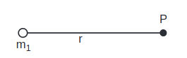

**Figure 6.15** Point mass placed at a distance

Gravitational field and gravitational force are vector quantities whereas the gravitational potential and gravitational potential energy are scalar quantities. The motion of particles can be easily analyzed using scalar quantities than vector quantities. Consider the example of a falling apple:

Figure 6.16 shows an apple which falls on Earth due to Earth's gravitational force. This can be explained using the concept of gravitational potential \(V(r)\) as follows.

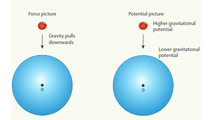

**Figure 6.16** Apple falling freely under gravity

The gravitational potential \(V(r)\) at a point of height \(h\) from the surface of the Earth is given by,

\[
V(r=R+h)=-\frac{G M_{e}}{(R+h)}
\]

The gravitational potential \(V(r)\) on the surface of Earth is given by,

\[
V(r=R)=-\frac{G M_{e}}{R}
\]

Thus we see that

\[
V(r=R)<V(r=R+h) .
\]

It is already discussed in the previous section that the gravitational potential energy near the surface of the Earth at height \(h\) is \(m g h\). The gravitational potential at this point is simply \(V(h)=U(h) / m=g h\). In fact, the gravitational potential on the surface of the Earth is zero since \(h\) is zero. So the apple falls from a region of a higher gravitational potential to a region of lower gravitational potential. In general, the mass will move from a region of higher gravitational potential to a region of lower gravitational potential.

**EXAMPLE 6.5**

Water falls from the top of a hill to the ground. Why?

This is because the top of the hill is a point of higher gravitational potential than the surface of the Earth i.e. \(V_{\text {hill }}>V_{\text {ground }}\)

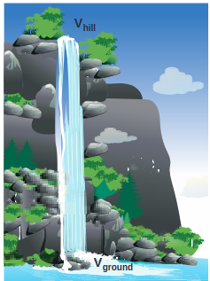

Water falling from hill top

The motion of particles can be analyzed more easily using scalars like \(U(r)\) or \(V(r)\) than vector quantities like \(\vec{F}\) or \(\vec{E}\). In modern theories of physics, the concept of potential plays a vital role.

**EXAMPLE 6.6**

Consider four masses \(m_{1}, m_{2}, m_{3}\), and \(m_{4}\) arranged on the circumference of a circle as shown in figure below

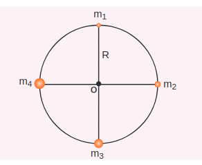

**Calculate**

(a) The gravitational potential energy of the system of 4 masses shown in figure.

(b) The gravitational potential at the point \(O\) due to all the 4 masses.

The gravitational potential energy \(U(r)\) can be calculated by finding the sum of gravitational potential energy of each pair of particles.

\[
\begin{aligned}
U= & -\frac{G m_{1} m_{2}}{r_{12}}-\frac{G m_{1} m_{3}}{r_{13}}-\frac{G m_{1} m_{4}}{r_{14}} \\
& -\frac{G m_{2} m_{3}}{r_{23}}-\frac{G m_{2} m_{4}}{r_{24}}-\frac{G m_{3} m_{4}}{r_{34}}
\end{aligned}
\]

Here \(r_{12}, r_{13} \ldots\) are distance between pair of particles

\[
\begin{aligned}
& r_{14}^{2}=R^{2}+R^{2}=2 R^{2} \\
& r_{14}=\sqrt{2} R=r_{12}=r_{23}=r_{34} \\
& r_{13}=r_{24}=2 R
\end{aligned}
\]

\[
\begin{aligned}
U= & -\frac{G m_{1} m_{2}}{\sqrt{2} R}-\frac{G m_{1} m_{3}}{2 R}-\frac{G m_{1} m_{4}}{\sqrt{2} R} \\
- & \frac{G m_{2} m_{3}}{\sqrt{2} R}-\frac{G m_{2} m_{4}}{2 R}-\frac{G m_{3} m_{4}}{\sqrt{2} R} \\
U=- & \frac{G}{R}\left[\frac{m_{1} m_{2}}{\sqrt{2}}+\frac{m_{1} m_{3}}{2}+\frac{m_{1} m_{4}}{\sqrt{2}}\right. \\
& \left.+\frac{m_{2} m_{3}}{\sqrt{2}}+\frac{m_{2} m_{4}}{2}+\frac{m_{3} m_{4}}{\sqrt{2}}\right]
\end{aligned}
\]

If all the masses are equal, then \(m_{1}=m_{2}=m_{3}=m_{4}=M\)

\[
\begin{aligned}
& U=-\frac{G M^{2}}{R}\left[\frac{1}{\sqrt{2}}+\frac{1}{2}+\frac{1}{\sqrt{2}}+\frac{1}{\sqrt{2}}+\frac{1}{2}+\frac{1}{\sqrt{2}}\right] \\
& U=-\frac{G M^{2}}{R}\left[1+\frac{4}{\sqrt{2}}\right]
\end{aligned}
\]

\[
U=-\frac{G M^{2}}{R}[1+2 \sqrt{2}]
\]

The gravitational potential \(V(r)\) at a point \(O\) is equal to the sum of the gravitational potentials due to individual mass. Since potential is a scalar, the net potential at point \(O\) is the algebraic sum of potentials due to each mass.

\[
\begin{aligned}
V_{O}(r) & =-\frac{G m_{1}}{R}-\frac{G m_{2}}{R}-\frac{G m_{3}}{R}-\frac{G m_{4}}{R} \\
\text { If } m_{1} & =m_{2}=m_{3}=m_{4}=M \\
V_{O}(r) & =-\frac{4 G M}{R}
\end{aligned}
\]