> All the laws of nature are written in the language of mathematics- Galileo

### INTRODUCTION

Physics is basically an experimental science and rests on two pillars- Experiments and mathematics. Two thousand three hundred years ago the Greek librarian Eratosthenes measured the radius of the Earth. The size of the atom was measured much later, only in the beginning of the 20th century. The central aspect in physics is motion. Motion is found at all levels- from microscopic level (within the atom) to macroscopic and galactic level (planetary system and beyond). In short the entire Universe is governed by various types of motion. The study of various types of motion is expressed using the language of mathematics.

How do objects move? How fast or slow do they move? For example, when ten athletes run in a race, all of them do not run in the same manner. Their performance cannot be qualitatively recorded by usage of words like 'fastest', 'faster', 'average', 'slower' or 'slowest'. It has to be quantified. Quantifying means assigning numbers to each athlete's motion. Comparing these numbers, one can analyse how fast or slow each athlete runs when compared to others. In this unit, the basic mathematics needed for analyzing motion in terms of its direction and magnitude is covered.

### CONCEPT OF REST AND MOTION

The concept of rest and motion can be well understood by the following elucidation (Figure 2.1). A person sitting in a moving bus is at rest with respect to a fellow passenger but is in motion with respect to a person outside the bus. The concepts of rest and motion have meaning only with respect to some reference frame. To understand rest or motion we need a convenient fixed reference frame.

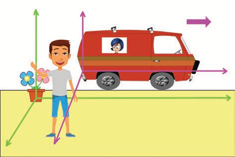

## Frame of Reference:

If we imagine a coordinate system and the position of an object is described relative to it, then such a coordinate system is called frame of reference.

At any given instant of time, the frame of reference with respect to which the position of the object is described in terms of position coordinates (x, y, z) (i.e., distances of the given position of an object along the x, y, and z- axes.) is called Cartesian coordinate system" as shown in Figure 2.2
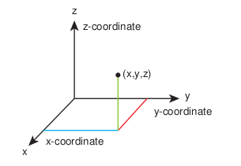

Figure 2.2 Cartesian coordinate system 

It is to be noted that if the \(x,y\) and \(z\) axes are drawn in anticlockwise direction then the coordinate system is called as "right- handed Cartesian coordinate system". Though other coordinate systems do exist, in physics we conventionally follow the right- handed coordinate system as shown in Figure 2.3.

Place your fingers in the direction of the positive x-axis and rotate them towards the direction of y-axis. Your thumb will point in the direction of positive z-axis 

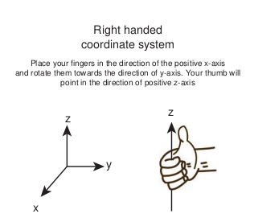

Figure 2.3 Right handed coordinate system 

The following Figure 2.4 illustrates the difference between left and right handed coordinate systems.

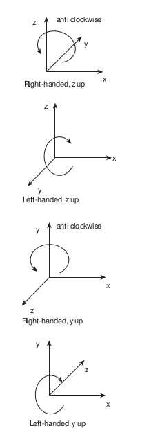

图2.4 Right and left handed coordinate systems

## Point mass

To explain the motion of an object which has finite mass, the concept of "point mass" is required and is very useful. Let the mass of any object be assumed to be concentrated at a point. Then this idealized mass is called "point mass". It has no internal structure like shape and size. Mathematically a point mass has finite mass with zero dimension. Even though in reality a point mass does not exist, it often simplifies our calculations. It is to be noted that the term "point mass" is a relative term. It has meaning only with respect to a reference frame and with respect to the kind of motion that we analyse.

## Examples

- To analyse the motion of Earth with respect to Sun, Earth can be treated as a point mass. This is because the distance between the Sun and Earth is very large compared to the size of the Earth. 

* If we throw an irregular object like a small stone in the air, to analyse its motion it is simpler to consider the stone as a point mass as it moves in space. The size of the stone is very much smaller than the distance through which it travels.

## Types of motion

In our day- to- day life the following kinds of motion are observed:

### a) Linear motion

An object is said to be in linear motion if it moves in a straight line.

### Examples

* An athlete running on a straight track.
-  A particle falling vertically downwards to the Earth.

### b) Circular motion

Circular motion is defined as a motion described by an object traversing a circular path.

### Examples

* The whirling motion of a stone attached to a string

- The motion of a satellite around the Earth.
   These two circular motions are shown in Figure 2.5

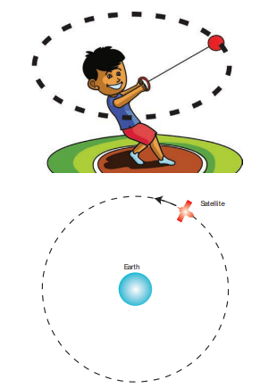

Figure 2.5 Examples of circular motion 

### c) Rotational motion

If any object moves in a rotational motion about an axis, the motion is called 'rotation'. During rotation every point in the object transverses a circular path about an axis, (except the points located on the axis).

### Examples

* Rotation of a disc about an axis through its centre.
- Spinning of the Earth about its own axis.

These two rotational motions are shown in Figure 2.6.

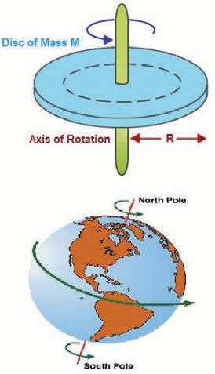

Figure 2.6 Examples of Rotational motion 

### d) Vibratory motion

If an object or particle executes a to- and- fro motion about a fixed point, it is said to be in vibratory motion. This is sometimes also called oscillatory motion.

### Examples

* Vibration of a string on a guitar.
- Movement of a swing

These motions are shown in Figure 2.7

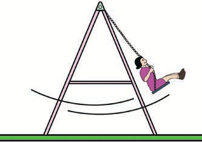

Figure 2.7 Examples of Vibratory motion 

Other types of motion like elliptical motion and helical motion are also possible.

Motion in One, Two and Three DimensionsLet the position of a particle in space be expressed in terms of rectangular coordinates x, y and z. When these coordinates change with time, then the particle is said to be in motion. However, it is not necessary that all the three coordinates should together change with time. Even if one or two coordinates change with time, the particle is said to be in motion. Then we have the following classification.

### (i) Motion in one dimension

One dimensional motion is the motion of a particle moving along a straight line.

This motion is sometimes known as rectilinear or linear motion.

In this motion, only one of the three rectangular coordinates specifying the position of the object changes with time.

For example, if a car moves from position A to position B along \(x\) - direction, as shown in Figure 2.8, then a variation in \(x\) - coordinate alone is noticed.

Figure 2.8 Motion of a particle along one dimension 

### Examples

* Motion of a train along a straight railway track.
- An object falling freely under gravity close to Earth.

### (ii) Motion in two dimensions

If a particle is moving along a curved path in a plane, then it is said to be in two dimensional motion.

In this motion, two of the three rectangular coordinates specifying the position of object change with time.

For instance, when a particle is moving in the \(y - z\) plane, \(x\) does not vary, but \(y\) and \(z\) vary as shown in Figure 2.9

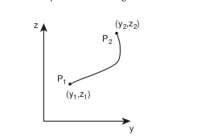

Figure 2.9 Motion of a particle along two dimensions 

### Examples

* Motion of a coin on a carrom board. 
- An insect crawling over the floor of a room.

### (iii) Motion in three dimensions

A particle moving in usual three dimensional space has three dimensional motion.

In this motion, all the three coordinates specifying the position of an object change with respect to time. When a particle moves in three dimensions, all the three coordinates \(x,y\) and \(z\) will vary.

### Examples

* A bird flying in the sky.
* Random motion of a gas molecule.
* Flying of a kite on a windy day.

## ELEMENTARY CONCEPTS OF VECTOR ALGEBRA

In physics, some quantities possess only magnitude and some quantities possess both magnitude and direction. To understand these physical quantities, it is very important to know the properties of vectors and scalars.

### Scalar

It is a property which can be described only by magnitude. In physics a number of quantities can be described by scalars.

### Examples

Distance, mass, temperature, speed and energy.

### Vector

It is a quantity which is described by both magnitude and direction. Geometrically a vector is a directed line segment which is shown in Figure 2.10. In physics certain quantities can be described only by vectors.

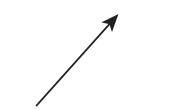

Figure 2.10 Geometrical representation of a vector 

### Examples

Force, velocity, displacement, position vector, acceleration, linear momentum and angular momentum.

## Magnitude of a Vector

The length of a vector is called magnitude of the vector. It is always a positive quantity. Sometimes the magnitude of a vector is also called 'norm' of the vector. For a vector \(\vec{A}\) , the magnitude or norm is denoted by \(\left|\vec{A}\right|\) or simply 'A' (Figure 2.11).

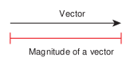

Figure 2.11 Magnitude of a vector 

### Different types of Vectors

1. **Equal vectors:** Two vectors \(\vec{A}\) and \(\vec{B}\) are said to be equal when they have equal magnitude and same direction and represent the same physical quantity (Figure 2.12).

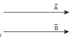

Figure 2.12 Geometrical representation of equal vectors 

(a) **Collinear vectors:** Collinear vectors are those which act along the same line. The angle between them can be \(0^{\circ}\) or \(180^{\circ}\) .

(i) **Parallel Vectors:** If two vectors \(\vec{A}\) and \(\vec{B}\) act in the same direction along the same line or on parallel lines, then the angle between them is \(0^{\circ}\) (Figure 2.13).

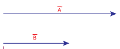

(ii) **Anti-parallel vectors:** Two vectors \(\vec{A}\) and \(\vec{B}\) are said to be anti-parallel when they are in the opposite direction along the same line are on parallel lines.Then the angle between them is \(180^{\circ}\) (Figure 2.14).

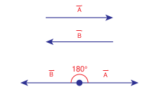

2. Unit vector: A vector divided by its magnitude is a unit vector. The unit vector for \(\vec{A}\) is denoted by \(\hat{A}\) (read as A cap or A hat). It has a magnitude equal to unity or one.

Since, $\hat{A}=\frac{\vec{A}}{A}$ we can write $\vec{A}=A\hat{A}$

Thus, we can say that the unit vector specifies only the direction of the vector quantity.

1. Orthogonal unit vectors: Let \(\hat{i}, \hat{j}\) and \(\hat{k}\) be three unit vectors which specify the directions along positive \(x\) -axis, positive

\(y\) - axis and positive \(z\) - axis respectively. These three unit vectors are directed perpendicular to each other, the angle between any two of them is \(90^{\circ}\) . \(\hat{i}, \hat{j}\) and \(\hat{k}\) are examples of orthogonal vectors. Two vectors which are perpendicular to each other are called orthogonal vectors as is shown in the Figure 2.15

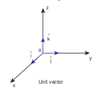

Figure 2.15 Orthogonal unit vectors 

## Addition of Vectors

Since vectors have both magnitude and direction they cannot be added by the method of ordinary algebra. Thus, vectors can be added geometrically or analytically using certain rules called 'vector algebra'. In order to find the sum (resultant) of two vectors, which are inclined to each other, we use (i) Triangular law of addition method or (ii) Parallelogram law of vectors.

### Triangular Law of addition method

Let us consider two vectors \(\vec{A}\) and \(\vec{B}\) as shown in Figure 2.16.

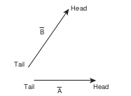

Figure 2.16 Head and tail of vectors 

1

To find the resultant of the two vectors we apply the triangular law of addition as follows:

Represent the vectors \(\vec{A}\) and \(\vec{B}\) by the two adjacent sides of a triangle taken in the same order. Then the resultant is given by the third side of the triangle taken in the reverse order as shown in Figure 2.17.

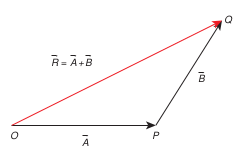

Figure 2.17 Triangle law of addition 

To explain further, the head of the first vector \(\vec{A}\) is connected to the tail of the second vector \(\vec{B}\) . Let \(\theta\) be the angle between \(\vec{A}\) and \(\vec{B}\) . Then \(\vec{R}\) is the resultant vector connecting the tail of the first vector \(\vec{A}\) to the head of the second vector \(\vec{B}\) . The magnitude of \(\vec{R}\) (resultant) is given geometrically by the length of \(\vec{R}\) (OQ) and the direction of the resultant vector is the angle between \(\vec{R}\) and \(\vec{A}\) . Thus we write \(\vec{R} = \vec{A} +\vec{B}\) .

\[\overline{OQ} = \overline{OP} +\overline{PQ}\]

### (1) Magnitude of resultant vector

The magnitude and angle of the resultant vector are determined as follows.

From Figure 2.18, consider the triangle ABN, which is obtained by extending the side OA to ON. ABN is a right angled triangle.

Figure 2.18 Resultant vector and its direction by triangle law of addition. 

From Figure 2.18

\[\cos \theta = \frac{AN}{B}\therefore AN = B\cos \theta \text{and}\] \[\sin \theta = \frac{BN}{B}\therefore BN = B\sin \theta\]

For \(\Delta OBN\) , we have \(OB^2 = ON^2 + BN^2\)

\[\Rightarrow R^2 = (A + B\cos \theta)^2 +(B\sin \theta)^2\] \[\Rightarrow R^2 = A^2 +B^2\cos^2\theta +2AB\cos \theta +B^2\sin^2\theta\] \[\Rightarrow R^2 = A^2 +B^2(\cos^2\theta +\sin^2\theta) + 2AB\cos \theta\] \[\Rightarrow R = \sqrt{A^2 + B^2 + 2AB\cos\theta}\]

which is the magnitude of the resultant of \(\vec{A}\) and \(\vec{B}\)

(2) Direction of resultant vectors: If \(\theta\) is the angle between \(\vec{A}\) and \(\vec{B}\) , then

\[\left|\vec{A} +\vec{B}\right| = \sqrt{A^2 + B^2 + 2AB\cos\theta} \quad (2.1)\]

If \(\vec{R}\) makes an angle \(\alpha\) with \(\vec{A}\) , then in \(\Delta OBN\)

\[\tan \alpha = \frac{BN}{ON} = \frac{BN}{OA + AN}\] \[\tan \alpha = \frac{B\sin\theta}{A + B\cos\theta}\] \[\Rightarrow \alpha = \tan^{-1}\left(\frac{B\sin\theta}{A + B\cos\theta}\right)\]

## Example 2.1

Two vectors \(\vec{A}\) and \(\vec{B}\) of magnitude 5 units
and 7 units respectively make an angle 60°
with each other as shown below. Find the
magnitude of the resultant vector and its
direction with respect to the vector \(\vec{A}\).

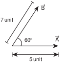

## Solution

By following the law of triangular addition, the resultant vector is given by

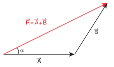~~~~

as illustrated below

The magnitude of the resultant vector \(\bar{R}\) is given by

\[R = \left|\vec{R}\right| = \sqrt{5^{2} + 7^{2} + 2\times 5\times 7\cos 60^{\circ}}\] \[R = \sqrt{25 + 49 + \frac{70\times 1}{2}} = \sqrt{109} \, \text{units}\]

The angle \(\alpha\) between \(\bar{R}\) and \(\bar{A}\) is given by

\[\tan \alpha = \frac{B\sin\theta}{A + B\cos\theta} \quad (2.2)\]

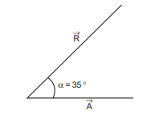

**Note:**

Another method to determine the resultant and angle of resultant of two vectors is the Parallelogram Law of vector addition method. It is given in appendix 2.1

### Subtraction of vectors

Since vectors have both magnitude and direction two vectors cannot be subtracted from each other by the method of ordinary algebra. Thus, this subtraction can be done either geometrically or analytically. We shall now discuss subtraction of two vectors geometrically using the Figure 2.19

For two non- zero vectors \(\bar{A}\) and \(\bar{B}\) which are inclined to each other at an angle \(\theta\) , the difference \(\bar{A} - \bar{B}\) is obtained as follows. First obtain \(-\bar{B}\) as in Figure 2.19. The angle between \(\bar{A}\) and \(-\bar{B}\) is \(180 - \theta\) .

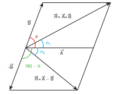

Figure 2.19 Subtraction of vectors 

The difference \(\vec{A} - \vec{B}\) is the same as the resultant of \(\vec{A}\) and \(- \vec{B}\) .

We can write \(\vec{A} - \vec{B} = \vec{A} + \left(-\vec{B}\right)\) and using the equation (2.1), we have

\[\left|\vec{A} -\vec{B}\right| = \sqrt{A^2 + B^2 + 2AB\cos(180 - \theta)} \quad (2.3)\]

Since, \(\cos \left(180 - \theta\right) = - \cos \theta\) , we get

\[\Rightarrow \left|\vec{A} -\vec{B}\right| = \sqrt{A^2 + B^2 - 2AB\cos\theta} \quad (2.4)\]

Again from the Figure 2.19, and using an equation similar to equation (2.2) we have

\[\tan \alpha_{2} = \frac{B\sin\left(180^{\circ} - \theta\right)}{A + B\cos\left(180^{\circ} - \theta\right)} \quad (2.5)\]

But \(\sin \left(180^{\circ} - \theta\right) = \sin \theta\) hence we get

\[\Rightarrow \tan \alpha_{2} = \frac{B\sin\theta}{A - B\cos\theta} \quad (2.6)\]

Thus the difference \(\vec{A} - \vec{B}\) is a vector with magnitude and direction given by equations 2.4 and 2.6 respectively.

## EXAMPLE 2.2

Two vectors \(\vec{A}\) and \(\vec{B}\) of magnitude 5 units and 7 units make an angle \(60^{\circ}\) with each other. Find the magnitude of the difference vector \(\vec{A} - \vec{B}\) and its direction with respect to the vector \(\vec{A}\) .

## Solution

Using the equation (2.4),

\[\left|\vec{A} -\vec{B}\right| = \sqrt{5^2 + 7^2 - 2\times 5\times 7\cos 60^{\circ}}\] \[= \sqrt{25 + 49 - 35} = \sqrt{39} \, \text{units}\]

The angle that \(\vec{A} - \vec{B}\) makes with the vector \(\vec{A}\) is given by

\[\tan \alpha_{2} = \frac{7\sin 60^{\circ}}{5 - 7\cos 60^{\circ}} = \frac{7\sqrt{3}}{10 - 7} = \frac{7}{\sqrt{3}} = 4.041\] \[\alpha_{2} = \tan^{-1}\left(4.041\right)\equiv 76^{\circ}\]

## COMPONENTS OF A VECTOR

In the Cartesian coordinate system any vector \(\vec{A}\) can be resolved into three components along \(x\) , \(y\) and \(z\) directions. This is shown in Figure 2.20.

Consider a 3- dimensional coordinate system. With respect to this a vector can be written in component form as

\[\vec{A} = A_{x}\hat{i} +A_{y}\hat{j} +A_{z}\hat{k}\]

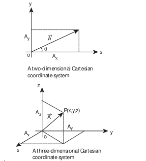

Figure 2.20 Components of a vector in 2 dimensions and 3 dimensions 

Here \(A_{x}\) is the \(x\) - component of \(\vec{A}\) , \(A_{y}\) is the \(y\) - component of \(\vec{A}\) and \(A_{z}\) is the \(z\) component of \(\vec{A}\) .

In a 2- dimensional Cartesian coordinate system (which is shown in the Figure 2.20) the vector \(\vec{A}\) is given by

\[\vec{A} = A_{x}\hat{i} +A_{y}\hat{j}\]

If \(\vec{A}\) makes an angle \(\theta\) with \(x\) axis, and \(A_{x}\) and \(A_{y}\) are the components of \(\vec{A}\) along \(x\) - axis and \(y\) - axis respectively, then as shown in Figure 2.21,

\[A_{x} = A\cos \theta ,\quad A_{y} = A\sin \theta\]

where \(A\) is the magnitude (length) of the vector \(\vec{A}\) , \(A = \sqrt{A_{x}^{2} + A_{y}^{2}}\)

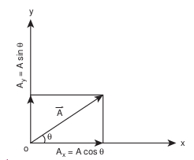

Figure 2.21 Resolution of a vector 

## EXAMPLE 2.3

What are the unit vectors along the negative \(x\) - direction, negative \(y\) - direction, and negative \(z\) - direction?

## Solution

The unit vectors along the negative directions can be shown as in the following figure.

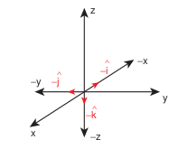

Then we have:

The unit vector along the negative \(x\) direction \(= - \hat{i}\)

The unit vector along the negative \(y\) direction \(= - \hat{j}\)

The unit vector along the negative \(z\) direction \(= - \hat{k}\)

### Vector addition using components

In the previous section we have learnt about addition and subtraction of two vectors using geometric methods. But once we choose a coordinate system, the addition and subtraction of vectors becomes much easier to perform.

The two vectors \(\vec{A}\) and \(\vec{B}\) in a Cartesian coordinate system can be expressed as

\[\vec{A} = A_{x}\hat{i} +A_{y}\hat{j} +A_{z}\hat{k}\] \[\vec{B} = B_{x}\hat{i} +B_{y}\hat{j} +B_{z}\hat{k}\]

Then the addition of two vectors is equivalent to adding their corresponding \(x\) , \(y\) and \(z\) components.

\[\vec{A} +\vec{B} = \left(A_{x} + B_{x}\right)\hat{i} +\left(A_{y} + B_{y}\right)\hat{j} +\left(A_{z} + B_{z}\right)\hat{k}\]

Similarly the subtraction of two vectors is equivalent to subtracting the corresponding \(x\) , \(y\) and \(z\) components.

The above rules form an analytical way of adding and subtracting two vectors.

## EXAMPLE 2.4

Two vectors \(\vec{A}\) and \(\vec{B}\) are given in the component form as \(\vec{A} = 5\vec{i} +7\vec{j} - 4\vec{k}\) and \(\vec{B} = 6\vec{i} +3\vec{j} +2\vec{k}\) . Find \(\vec{A} +\vec{B}\) , \(\vec{B} +\vec{A}\) , \(\vec{A} -\vec{B}\) , \(\vec{B} -\vec{A}\)

## Solution

\[\vec{A} +\vec{B} = (5\vec{i} +7\vec{j} -4\vec{k}) + (6\vec{i} +3\vec{j} +2\vec{k})\] \[= 11\vec{i} +10\vec{j} -2\vec{k}\] \[\vec{B} +\vec{A} = (6\vec{i} +3\vec{j} +2\vec{k}) + (5\vec{i} +7\vec{j} -4\vec{k})\] \[= (6 + 5)\vec{i} +(3 + 7)\vec{j} +(2 - 4)\vec{k}\] \[= 11\vec{i} +10\vec{j} -2\vec{k}\] \[\vec{A} -\vec{B} = (5\vec{i} +7\vec{j} -4\vec{k}) - (6\vec{i} +3\vec{j} +2\vec{k})\] \[= -\vec{i} +4\vec{j} -6\vec{k}\] \[\vec{B} -\vec{A} = \vec{i} -4\vec{j} +6\vec{k}\]

Note that the vectors \(\vec{A} +\vec{B}\) and \(\vec{B} +\vec{A}\) are same and the vectors \(\vec{A} -\vec{B}\) and \(\vec{B} -\vec{A}\) are opposite to each other.

**Note:**

The addition of two vectors using components depends on the choice of the coordinate system. But the geometric way of adding and subtracting two vectors is independent of the coordinate system used.

## MULTIPLICATION OF VECTOR BY A SCALAR

A vector \(\vec{A}\) multiplied by a scalar \(\lambda\) results in another vector, \(\lambda \vec{A}\) . If \(\lambda\) is a positive number then \(\lambda \vec{A}\) is also in the direction of \(\vec{A}\) . If \(\lambda\) is a negative number, \(\lambda \vec{A}\) is in the opposite direction to the vector \(\vec{A}\) .

### EXAMPLE 2.5

Given the vector \(\vec{A} = 2\vec{i} +3\vec{j}\) , what is \(3\vec{A}\) ?

### Solution

\[3\vec{A} = 3(2\vec{i} +3\vec{j}) = 6\vec{i} +9\vec{j}\]

The vector \(3\vec{A}\) is in the same direction as vector \(\vec{A}\) .

### EXAMPLE 2.6

A vector \(\vec{A}\) is given as in the following Figure. Find \(4\vec{A}\) and \(- 4\vec{A}\)

### Solution

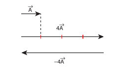

In physics, certain vector quantities can be defined as a scalar times another vector quantity.

### For example

1) Force \(\vec{F} = m\vec{a}\) . Here mass 'm' is a scalar, and \(\vec{a}\) is the acceleration. Since 'm' is always a positive scalar, the direction

2) Linear momentum \(\vec{P} = m\vec{v}\) . Here \(\vec{v}\) is the velocity. The direction of linear momentum is also in the direction of velocity.
3) Force \(\vec{F} = q\vec{E}\) , Here the electric charge \(q\) is a scalar, and \(\vec{E}\) is the electric field. Since charge can be positive or negative, the direction of force \(\vec{F}\) is correspondingly either in the direction of \(\vec{E}\) or opposite to the direction of \(\vec{E}\) .

### 2.5.1 Scalar Product of Two Vectors

## Definition

The scalar product (or dot product) of two vectors is defined as the product of the magnitudes of both the vectors and the cosine of the angle between them.

Thus if there are two vectors \(\vec{A}\) and \(\vec{B}\) having an angle \(\theta\) between them, then their scalar product is defined as \(\vec{A}\cdot \vec{B} = AB\cos \theta\) Here, \(A\) and \(B\) are magnitudes of \(\vec{A}\) and \(\vec{B}\)

## Properties

(i) The product quantity \(\vec{A}\cdot \vec{B}\) is always a scalar. It is positive if the angle between the vectors is acute (i.e., \(\theta < 90^{\circ}\) ) and negative if the angle between them is obtuse (i.e. \(90^{\circ}< \theta < 180^{\circ}\) ).

(ii) The scalar product is commutative, i.e. \(\vec{A}\cdot \vec{B} = \vec{B}\cdot \vec{A}\)

(iii) The vectors obey distributive law i.e. \(\vec{A}\cdot \left(\vec{B} +\vec{C}\right) = \vec{A}\cdot \vec{B} +\vec{A}\cdot \vec{C}\)

(iv) The angle between the vectors

\[\theta = \cos^{-1}\left[\frac{\vec{A}\cdot\vec{B}}{AB}\right]\]

(v) The scalar product of two vectors will be maximum when \(\cos \theta = 1\) , i.e. \(\theta = 0^{\circ}\) , i.e., when the vectors are parallel;

\[(\vec{A}\cdot \vec{B})_{\mathrm{max}} = AB\]

(vi) The scalar product of two vectors will be minimum, when \(\cos \theta = -1\) , i.e. \(\theta = 180^{\circ}\) \((\vec{A}\cdot \vec{B})_{\mathrm{min}} = -AB\) , when the vectors are anti- parallel.

(vii) If two vectors \(\vec{A}\) and \(\vec{B}\) are perpendicular to each other then their scalar product \(\vec{A}\cdot \vec{B} = 0\) , because \(\cos 90^{\circ} = 0\) . Then the vectors \(\vec{A}\) and \(\vec{B}\) are said to be mutually orthogonal.

(viii) The scalar product of a vector with itself is termed as self- dot product and is given by \((\vec{A})^{2} = \vec{A}\cdot \vec{A} = AA\cos \theta = A^{2}\) . Here angle \(\theta = 0^{\circ}\) . The magnitude or norm of the vector \(\vec{A}\) is \(\left|\vec{A}\right| = A = \sqrt{\vec{A}\cdot\vec{A}}\)

ix) In case of a unit vector \(\hat{\mathbf{n}}\) \(\hat{\mathbf{n}}\cdot \hat{\mathbf{n}} = 1\times 1\times \cos 0 = 1\) . For example, \(\hat{\mathbf{i}}\cdot \hat{\mathbf{i}} =\) \(\hat{\mathbf{j}}\cdot \hat{\mathbf{j}} = \hat{\mathbf{k}}\cdot \hat{\mathbf{k}} = 1\)

x) In the case of orthogonal unit vectors \(\hat{\mathbf{i}}\) \(\hat{\mathbf{j}}\) and \(\hat{\mathbf{k}}\)

\[\hat{\mathbf{i}}\cdot \hat{\mathbf{j}} = \hat{\mathbf{j}}\cdot \hat{\mathbf{k}} = \hat{\mathbf{k}}\cdot \hat{\mathbf{i}} = 1\cdot 1\cos 90^{\circ} = 0\]

(xi) In terms of components the scalar product of \(\vec{A}\) and \(\vec{B}\) can be written as

\[\vec{A}\cdot \vec{B} = (A_{x}\hat{i} +A_{y}\hat{j} +A_{z}\hat{k})\cdot \left(B_{x}\hat{i} +B_{y}\hat{j} +B_{z}\hat{k}\right)\] \[= A_{x}B_{x} + A_{y}B_{y} + A_{z}B_{z}, \text{ with all other terms zero.}\]

The magnitude of vector \(\left|\vec{A}\right|\) is given by

\[\left|\vec{A}\right| = A = \sqrt{A_{x}^{2} + A_{y}^{2} + A_{z}^{2}}\]

## EXAMPLE 2.7

Given two vectors \(\vec{A} = 2\vec{i} +4\vec{j} +5\vec{k}\) and \(\vec{B} =\) \(\vec{i} +3\vec{j} +6\vec{k}\) Find the product \(\vec{A}\cdot\vec{B}\) and the magnitudes of \(\vec{A}\) and \(\vec{B}\) .What is the angle between them?

## Solution

\[\vec{A}\cdot\vec{B} = 2 + 12 + 30 = 44\]

Magnitude \(A = \sqrt{4 + 16 + 25} = \sqrt{45}\) units

Magnitude \(B = \sqrt{1 + 9 + 36} = \sqrt{46}\) units

The angle between the two vectors is given by

\[\theta = \cos^{-1}\left(\frac{\vec{A}\cdot\vec{B}}{AB}\right)\] \[= \cos^{-1}\left(\frac{44}{\sqrt{45\times 46}}\right) = \cos^{-1}\left(\frac{44}{45.49}\right)\] \[= \cos^{-1}(0.967)\] \[\therefore \theta \cong 15^{\circ}\]

## EXAMPLE 2.8

Check whether the following vectors are orthogonal.

\[\text{i) }\vec{A} = 2\vec{i} +3\vec{j} \text{ and } \vec{B} = 4\vec{i} -5\vec{j}\] \[\text{ii) }\vec{C} = 5\vec{i} +2\vec{j} \text{ and } \vec{D} = 2\vec{i} -5\vec{j}\]

## Solution

\[\vec{A}\cdot\vec{B} = 8 - 15 = -7\neq 0\]

Hence \(\vec{A}\) and \(\vec{B}\) are not orthogonal to each other.

\[\vec{C}\cdot\vec{D} = 10 - 10 = 0\]

Hence, \(\vec{C}\) and \(\vec{D}\) are orthogonal to each other.

It is also possible to geometrically show that the vectors \(\vec{C}\) and \(\vec{D}\) are orthogonal to each other. This is shown in the following Figure.

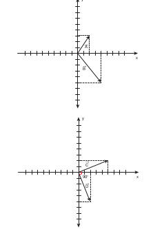

In physics, the work done by a force \(\vec{F}\) to move an object through a small displacement \(d\vec{r}\) is defined as,

\[W = \vec{F}\cdot d\vec{r}\] \[W = F \, dr \cos \theta\]

The work done is basically a scalar product between the force vector and the displacement vector. Apart from work done, there are other physical quantities which are also defined through scalar products.

### The Vector Product of Two Vectors

### Definition

The vector product or cross product of two vectors is defined as another vector having a magnitude equal to the product of the magnitudes of two vectors and the sine of the angle between them. The direction of the product vector is perpendicular to the plane containing the two vectors, in accordance with the right hand screw rule or right hand thumb rule (Figure 2.22).

Thus, if \(\bar{\mathbf{A}}\) and \(\bar{\mathbf{B}}\) are two vectors, then their vector product is written as \(\bar{\mathbf{A}}\times \bar{\mathbf{B}}\) which is a vector \(\bar{\mathbf{C}}\) defined by

\[\bar{\mathbf{C}} = \bar{\mathbf{A}}\times \bar{\mathbf{B}} = (AB\sin \theta)\hat{\mathbf{n}}\]

The direction \(\hat{\mathbf{n}}\) of \(\bar{\mathbf{A}}\times \bar{\mathbf{B}}\) i.e., \(\bar{\mathbf{C}}\) is perpendicular to the plane containing

the vectors \(\bar{\mathbf{A}}\) and \(\bar{\mathbf{B}}\) and is in the sense of advancement of a right handed screw rotated from \(\bar{\mathbf{A}}\) (first vector) to \(\bar{\mathbf{B}}\) (second vector) through the smaller angle between them. Thus, if a right- handed screw whose axis is perpendicular to the plane formed by \(\bar{\mathbf{A}}\) and \(\bar{\mathbf{B}}\) , is rotated from \(\bar{\mathbf{A}}\) to \(\bar{\mathbf{B}}\) through the smaller angle between them, then the direction of advancement of the screw gives the direction of \(\bar{\mathbf{A}}\times \bar{\mathbf{B}}\) i.e. \(\bar{\mathbf{C}}\) which is illustrated in Figure 2.22.

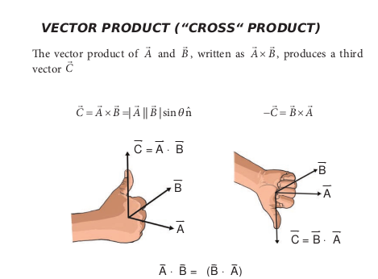

Figure 2.22 Vector product of two vectors

**Note:**

According to Right Hand Rule, if the curvature of the fingers of the right hand represents the sense of rotation of the object, then the thumb, held perpendicular to the curvature of the fingers, represents the direction of the resultant \(\bar{\mathbf{C}}\) .

## Properties of vector (cross) product.

(i) The vector product of any two vectors is always another vector whose direction is perpendicular to the plane containing these two vectors, i.e., orthogonal to both the vectors \(\vec{A}\) and \(\vec{B}\) , even though the vectors \(\vec{A}\) and \(\vec{B}\) may or may not be mutually orthogonal.

(ii) The vector product of two vectors is not commutative, i.e., \(\vec{A} \times \vec{B} \neq \vec{B} \times \vec{A}\) But, \(\vec{A} \times \vec{B} = - [\vec{B} \times \vec{A} ]\) Here it is worthwhile to note that \(|\vec{A} \times \vec{B}| = |\vec{B} \times \vec{A}| = AB \sin \theta\) i.e., in the case of the product vectors \(\vec{A} \times \vec{B}\) and \(\vec{B} \times \vec{A}\) , the magnitudes are equal but directions are opposite to each other.

(iii) The vector product of two vectors will have maximum magnitude when \(\sin \theta = 1\) , i.e., \(\theta = 90^{\circ}\) i.e., when the vectors \(\vec{A}\) and \(\vec{B}\) are orthogonal to each other.

\[(\vec{A} \times \vec{B})_{max} = AB\hat{n}\]

(iv) The vector product of two non- zero vectors will be minimum when \(|\sin \theta| = 0\) , i.e., \(\theta = 0^{\circ}\) or \(180^{\circ}\)

\[(\vec{A} \times \vec{B})_{min} = 0\]

i.e., the vector product of two non- zero vectors vanishes, if the vectors are either parallel or antiparallel.

(v) The self- cross product, i.e., product of a vector with itself is the null vector

\[\vec{A} \times \vec{A} = AA \sin 0^{\circ} \hat{n} = \vec{0}.\]

In physics the null vector \(\vec{0}\) is simply denoted as zero.

(vi) The self- vector products of unit vectors are thus zero.

\[\hat{i} \times \hat{i} = \hat{j} \times \hat{j} = \hat{k} \times \hat{k} = \vec{0}\]

(vii) In the case of orthogonal unit vectors, \(\hat{i}, \hat{j}, \hat{k}\) , in accordance with the right hand screw rule:

\[\hat{i} \times \hat{j} = \hat{k}, \quad \hat{j} \times \hat{k} = \hat{i}, \quad \hat{k} \times \hat{i} = \hat{j}\]

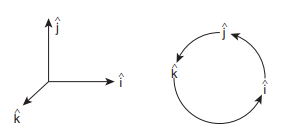

Also, since the cross product is not commutative,

\[\hat{j} \times \hat{i} = -\hat{k}, \quad \hat{k} \times \hat{j} = -\hat{i}\] \[\text{and} \quad \hat{i} \times \hat{k} = -\hat{j}\]

(viii) In terms of components, the vector product of two vectors \(\vec{A}\) and \(\vec{B}\) is

\[\vec{A} \times \vec{B} = (A_y B_z - A_z B_y)\hat{i} + (A_z B_x - A_x B_z)\hat{j} + (A_x B_y - A_y B_x)\hat{k}\]

Note that in the \(\hat{j}^{th}\) component the order of multiplication is different than \(\hat{i}^{th}\) and \(\hat{k}^{th}\) components.

(ix) If two vectors \(\vec{A}\) and \(\vec{B}\) form adjacent sides in a parallelogram, then the magnitude of \(\vec{A}\times \vec{B}\) will give the area of the parallelogram as represented graphically in Figure 2.23.

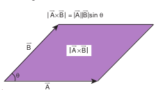

Figure 2.23 Area of parallelogram 

(x) Since we can divide a parallelogram into two equal triangles as shown in the Figure 2.24, the area of a triangle with \(\vec{A}\) and \(\vec{B}\) as sides is \(\frac{1}{2} |\vec{A}\times \vec{B}|\) . This is shown in the Figure 2.24. (This fact will be used when we study Kepler's laws in unit 6)

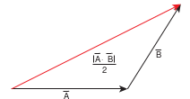

Figure 2.24 Area of triangle 

A number of quantities used in Physics are defined through vector products. Particularly physical quantities representing rotational effects like torque, angular momentum, are defined through vector products.

### Examples

(i) Torque \(\vec{\tau} = \vec{r}\times \vec{F}\) . where \(\vec{F}\) is Force and \(\vec{r}\) is position vector of a particle 

(ii) Angular momentum \(\vec{L} = \vec{r}\times \vec{p}\) where \(\vec{p}\) is the linear momentum 

(iii) Linear Velocity \(\vec{v} = \vec{\omega}\times \vec{r}\) where \(\vec{\omega}\) is angular velocity

## EXAMPLE 2.9

Two vectors are given as \(\vec{r} = 2\hat{i} +3\hat{j} +5\hat{k}\) and \(\vec{F} = 3\hat{i} - 2\hat{j} +4\hat{k}\) . Find the resultant vector \(\vec{\tau} = \vec{r}\times \vec{F}\)

## Solution

\[\vec{\tau} = \vec{r}\times \vec{F} = \begin{vmatrix} \hat{i} & \hat{j} & \hat{k}\\ 2 & 3 & 5\\ 3 & -2 & 4 \end{vmatrix}\] \[\vec{\tau} = (12 - (-10))\hat{i} + (15 - 8)\hat{j} + (-4 - 9)\hat{k}\] \[\vec{\tau} = 22\hat{i} +7\hat{j} -13\hat{k}\]

### Properties of the components of vectors

If two vectors \(\vec{A}\) and \(\vec{B}\) are equal, then their individual components are also equal.

\[\text{Let } \vec{A} = \vec{B}\] \[\text{Then } A_{x}\hat{i} +A_{y}\hat{j} +A_{z}\hat{k} = B_{x}\hat{i} +B_{y}\hat{j} +B_{z}\hat{k}\] \[\text{i.e., } A_{x} = B_{x},\quad A_{y} = B_{y},\quad A_{z} = B_{z}\]

## EXAMPLE 2.10

Compare the components for the following vector equations

a) \(\vec{F} = m\vec{a}\) Here m is positive number 

b) \(\vec{p} = 0\)

## Solution

Case (a):

\[\vec{F} = m\vec{a}\]

\[F_{x}\hat{i} +F_{y}\hat{j} +F_{z}\hat{k} = ma_{x}\hat{i} +ma_{y}\hat{j} +ma_{z}\hat{k}\]

By comparing the components, we get

\[F_{x} = ma_{x},\quad F_{y} = ma_{y},\quad F_{z} = ma_{z}\]

This implies that one vector equation is equivalent to three scalar equations.

Case (b)

\[\vec{p} = 0\] \[p_{x}\hat{i} +p_{y}\hat{j} +p_{z}\hat{k} = 0\hat{i} +0\hat{j} +0\hat{k}\]

By comparing the components, we get

\[p_{x} = 0,\quad p_{y} = 0,\quad p_{z} = 0\]

## EXAMPLE 2.11

Determine the value of the T from the given vector equation.

\[5\hat{j} - T\hat{j} = 6\hat{j} + 3T\hat{j}\]

## Solution

By comparing the components both sides,
we can write

\[
\begin{aligned}
5 - 6 &= 3T + T \\
-1 &= 4T \\
T &= -\frac{1}{4}
\end{aligned}
\]

## EXAMPLE 2.12

Compare the components of vector equation \(\vec{F}_{1} + \vec{F}_{2} + \vec{F}_{3} = \vec{F}_{4}\)

## Solution

We can resolve all the vectors in \(x,y\) and \(z\) components with respect to Cartesian coordinate system.

Once we resolve the components we can separately equate the \(x\) components on both sides, \(y\) components on both sides, and \(z\) components on both the sides of the equation, we then get

\[F_{1x} + F_{2x} + F_{3x} = F_{4x}\] \[F_{1y} + F_{2y} + F_{3y} = F_{4y}\] \[F_{1z} + F_{2z} + F_{3z} = F_{4z}\]

## POSITION VECTOR

It is a vector which denotes the position of a particle at any instant of time, with respect to some reference frame or coordinate system.

The position vector \(\vec{r}\) of the particle at a point P is given by

\[\vec{r} = x\hat{i} + y\hat{j} + z\hat{k}\]

where x, y and z are components of \(\vec{r}\) Figure 2.25 shows the position vector \(\vec{r}\) .

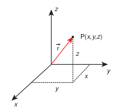

Figure 2.25 Position vector in Cartesian coordinate system 

## EXAMPLE 2.13

Determine the position vectors for the following particles which are located at points P, Q, R, S.

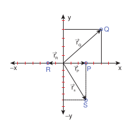

## Solution

The position vector for the point P is

\[\vec{r}_p = 3\vec{i}\]

The position vector for the point Q is

\[\vec{r}_Q = 5\vec{i} +4\vec{j}\]

The position vector for the point R is

\[\vec{r}_R = -2\vec{i}\]

The position vector for the point S is

\[\vec{r}_s = 3\vec{i} -6\vec{j}\]

## EXAMPLE 2.14

A person initially at rest starts to walk 2 m towards north, then 1 m towards east, then 5 m towards south and then 3 m towards west. What is the position vector of the person at the end of the trip?

## Solution

As shown in the Figure, the positive x axis is taken as east direction, positive y direction is taken as north.

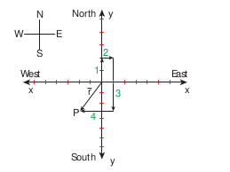

After the trip, the person reaches the point P whose position vector given by

\[\vec{r} = -2\vec{i} -3\vec{j}\]

The displacement direction is south west.

## 2.7 DISTANCE AND DISPLACEMENT

Distance is the actual path length travelled by an object in the given interval of time during the motion. It is a positive scalar quantity.

Displacement is the difference between the final and initial positions of the object in a given interval of time. It can also be defined as the shortest distance between these two positions of the object and its direction is from the initial to final position of the object, during the given interval of time. It is a vector quantity. Figure 2.26 illustrates the difference between displacement and distance.

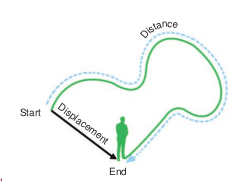

Figure 2.26 Distance and displacement 

## EXAMPLE 2.15

Assume your school is located \(2 \, \text{km}\) away from your home. In the morning you are going to school and in the evening you come back home. In this entire trip what is the distance travelled and the displacement covered?

## Solution

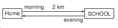

The displacement covered is zero. It is because your initial and final positions are the same.

But the distance travelled is \(4 \, \text{km}\)

## EXAMPLE 2.16

An athlete covers 3 rounds on a circular track of radius \(50 \, \text{m}\) . Calculate the total distance and displacement travelled by him.

## Solution

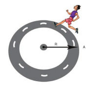

The total distance the athlete covered \(= 3 \times\) circumference of track

\[\text{Distance} = 3 \times 2\pi \times 50 \, \text{m}\] \[= 300\pi \, \text{m} \quad (\text{or})\] \[\text{Distance} \approx 300 \times 3.14 \approx 942 \, \text{m}\]

The displacement is zero, since the athlete reaches the same point A after three rounds from where he started.

### Displacement Vector in Cartesian Coordinate System

In terms of position vector, the displacement vector is given as follows. Let us consider a particle moving from a point \(\mathrm{P}_{1}\) having position vector \(\vec{r}_{1} = x_{1}\hat{i} +y_{1}\hat{j} +z_{1}\hat{k}\) to a

point \(\mathrm{P}_{2}\) where its position vector is \(\vec{r}_{2} = x_{2}\hat{i} +y_{2}\hat{j} +z_{2}\hat{k}.\)

The displacement vector is given by

\[\Delta \vec{r} = \vec{r}_{2} - \vec{r}_{1}\] \[= (x_{2} - x_{1})\hat{i} + (y_{2} - y_{1})\hat{j} + (z_{2} - z_{1})\hat{k}.\]

This displacement is also shown in Figure 2.27.

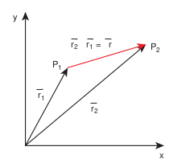

Figure 2.27 Displacement vector 

## EXAMPLE 2.17

Calculate the displacement vector for a particle moving from a point \(\mathrm{P}\) to \(\mathrm{Q}\) as shown below. Calculate the magnitude of displacement.

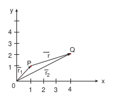

## Solution

The displacement vector \(\Delta \vec{r} = \vec{r}_{2} - \vec{r}_{1}\) , with

\[\vec{r}_{1} = \hat{i} +\hat{j} \text{ and } \vec{r}_{2} = 4\hat{i} +2\hat{j}\] \[\therefore \Delta \vec{r} = \vec{r}_{2} - \vec{r}_{1} = (4\hat{i} +2\hat{j}) - (\hat{i} +\hat{j})\] \[= (4 - 1)\hat{i} + (2 - 1)\hat{j}\] \[\therefore \Delta \vec{r} = 3\hat{i} +\hat{j}\]

The magnitude of the displacement vector \(\Delta r = \sqrt{3^{2} + 1^{2}} = \sqrt{10}\) unit.

**Note:**

(1) The Distance travelled by an object in motion in a given time is never negative or zero, it is always positive.

(2) The displacement of an object, in a given time can be positive, zero or negative.

(3) The displacement of an object can be equal or less than the distance travelled but never greater than distance travelled.

(4) The distance covered by an object between two positions can have many values, but the displacement between them has only one value (in magnitude).

## DIFFERENTIAL CALCULUS

### The Concept of a function

1) Any physical quantity is represented by a "function" in mathematics. Take the example of temperature T. We know that the temperature of the surroundings is changing throughout the day. It increases till noon and decreases in the evening. At any time "t" the temperature T has a unique value. Mathematically this variation can be represented by the notation 'T(t)' and it should be called "temperature as a function of time". It implies that if the value of 't' is given, then the function "T(t)" will give the value of the temperature at that time 't'. Similarly, the position of a bus in motion along the x direction can be represented by x(t) and this is called 'x' as a function of time. Here 'x' denotes the x coordinate.

## Example

Consider a function \(f(x) = x^2\) . Sometimes it is also represented as \(y = x^2\) . Here y is called the dependent variable and x is called independent variable. It means as x changes, y also changes. Once a physical quantity is represented by a function, one can study the variation of the function over time or over the independent variable on which the quantity depends. Calculus is the branch of mathematics used to analyse the change of any quantity.

If a function is represented by \(y = f(x)\) then \(dy/dx\) represents the derivative of y with respect to x. Mathematically this represents the variation of y with respect to change in x, for various continuous values of x.

Mathematically the derivative \(dy/dx\) is defined as follows

\[\frac{dy}{dx} = \lim_{\Delta x\to 0}\frac{y(x + \Delta x) - y(x)}{\Delta x}\] \[= \lim_{\Delta x\to 0}\frac{\Delta y}{\Delta x}\]

\(\frac{dy}{dx}\) represents the limit that the quantity \(\frac{\Delta y}{\Delta x}\) attains, as \(\Delta x\) tends to zero.

Graphically this is represented as shown in Figure 2.28.

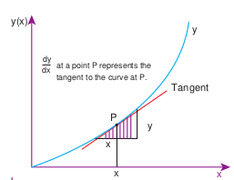

Figure 2.28 Derivative of a function 

## EXAMPLE 2.18

Consider the function \(y = x^2\) . Calculate the derivative \(\frac{dy}{dx}\) using the concept of limit, at the point \(x = 2\) .

## Solution

Let us take two points given by

\[x_1 = 2 \text{ and } x_2 = 3, \text{ then } y_1 = 4 \text{ and } y_2 = 9\] \[\text{Here } \Delta x = 1 \text{ and } \Delta y = 5\]

Then

\[\frac{\Delta y}{\Delta x} = \frac{9 - 4}{3 - 2} = 5\]

If we take \(x_1 = 2\) and \(x_2 = 2.5\) , then \(y_1 = 4\) and \(y_2 = (2.5)^2 = 6.25\)

\[\text{Here } \Delta x = 0.5 = \frac{1}{2} \text{ and } \Delta y = 2.25\]

Then

\[\frac{\Delta y}{\Delta x} = \frac{6.25 - 4}{0.5} = 4.5\]

1

If we take \(x_1 = 2\) and \(x_2 = 2.25\) , then \(y_1 = 4\) and \(y_2 = 5.0625\)

\[\text{Here } \Delta x = 0.25 = \frac{1}{4}, \quad \Delta y = 1.0625\]

\[\frac{\Delta y}{\Delta x} = \frac{5.0625 - 4}{0.25} = \frac{(5.0625 - 4)}{\frac{1}{4}}\] \[= 4(5.0625 - 4) = 4.25\]

If we take \(x_1 = 2\) and \(x_2 = 2.1\) , then \(y_1 = 4\) and \(y_2 = 4.41\)

\[\text{Here } \Delta x = 0.1 = \frac{1}{10} \text{ and}\] \[\frac{\Delta y}{\Delta x} = \frac{(4.41 - 4)}{\frac{1}{10}} = 10(4.41 - 4) = 4.1\]

These results are tabulated as shown below:

| \(x_1\) | \(x_2\) | \(\Delta x\) | \(y_1\) | \(y_2\) | \(\Delta y/\Delta x\) |
|--------|--------|-----------|-------|-------|-------------------|
| 2 | 2.25 | 0.25 | 4 | 5.0625 | 4.25 |
| 2 | 2.1 | 0.1 | 4 | 4.41 | 4.1 |
| 2 | 2.01 | 0.01 | 4 | 4.0401 | 4.01 |
| 2 | 2.001 | 0.001 | 4 | 4.004001 | 4.001 |
| 2 | 2.0001 | 0.0001 | 4 | 4.00040001 | 4.0001 |

From the above table, the following inferences can be made.

* As \(\Delta x\) tends to zero, \(\frac{\Delta y}{\Delta x}\) approaches the limit given by the number 4.
* At a point \(x = 2\) , the derivative \(\frac{dy}{dx} = 4\).
* It should also be mentioned here that \(\Delta x \rightarrow 0\) does not mean that \(\Delta x = 0\) .

This is because, if we substitute \(\Delta x = 0\) , \(\frac{\Delta y}{\Delta x}\) becomes indeterminate.

In general, we can obtain the derivative of the function \(y = x^2\) , as follows:

\[\frac{\Delta y}{\Delta x} = \frac{(x + \Delta x)^2 - x^2}{\Delta x} = \frac{x^2 + 2x\Delta x + \Delta x^2 - x^2}{\Delta x}\] \[= \frac{2x\Delta x + \Delta x^2}{\Delta x} = 2x + \Delta x\] \[\frac{dy}{dx} = \lim_{\Delta x \to 0} (2x + \Delta x) = 2x\]

The table below shows the derivatives of some common functions used in physics

| Function | Derivative |
|----------|------------|
| \(y = x\) | \(dy/dx = 1\) |
| \(y = x^2\) | \(dy/dx = 2x\) |
| \(y = x^3\) | \(dy/dx = 3x^2\) |
| \(y = x^n\) | \(dy/dx = nx^{n-1}\) |
| \(y = \sin x\) | \(dy/dx = \cos x\) |
| \(y = \cos x\) | \(dy/dx = -\sin x\) |
| \(y = \text{constant}\) | \(dy/dx = 0\) |
| \(y=AB\)| \(dy/dx = A(dB/dx) + (dA/dx)B\)|

In physics, velocity, speed and acceleration are all derivatives with respect to time 't'. This will be dealt with in the next section.

## EXAMPLE 2.19

Find the derivative with respect to t, of the function \(x = A_0 + A_1 t + A_2 t^2\) where \(A_0, A_1\) and \(A_2\) are constants.

## Solution

Note that here the independent variable is 't' and the dependent variable is 'x'

\[\frac{dx}{dt} = A_1 + 2A_2 t\]

The required derivative is \( \frac{dx}{dt} = A_1 + 2A_2 t \)

The second derivative is \( \frac{d^2x}{dt^2} = 2A_2 \)

## INTEGRAL CALCULUS

Integration is an area finding process. For certain geometric shapes we can directly find the area. But for irregular shapes the process of integration is used. Consider for example the areas of a rectangle and an irregularly shaped curve, as shown in Figure 2.29.

The area of the rectangle is simply given by \(A = \text{length} \times \text{breadth} = (b - a)c\)

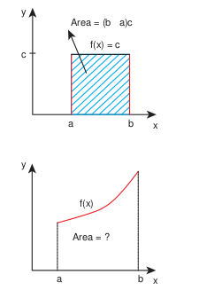

Figure 2.29 Area of rectangular and irregular shape 

But to find the area of the irregular shaped curve given by \(f(x)\) , we divide the area into rectangular strips as shown in the Figure 2.30.

The area under the curve is approximately equal to sum of areas of each rectangular strip.

This is given by \(A \approx f(a)\Delta x + f(x_1)\Delta x + f(x_2)\Delta x + f(x_3)\Delta x\)

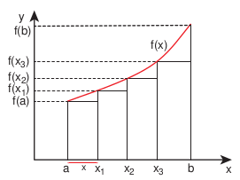

Figure 2.30 Area under the curve using rectangular strip 

Where \(f(a)\) is the value of the function \(f(x)\) at \(x = a\) \(f(x_1)\) is the value of \(f(x)\) for \(x = x_1\) and so on.

As we increase the number of strips, the area evaluated becomes more accurate. If the area under the curve is divided into N strips, the area under the curve is given by 

\(A = \sum_{m=1}^{N} f(x_m) \Delta x\)

As the number of strips goes to infinity, \(N \rightarrow \infty\) , the sum becomes an integral,

\[A = \int_{a}^{b} f(x) \, dx\] \[(\text{Note: As } N \rightarrow \infty , \Delta x \rightarrow 0)\]

The integration will give the total area under the curve f(x). This is shown in Figure 2.31.

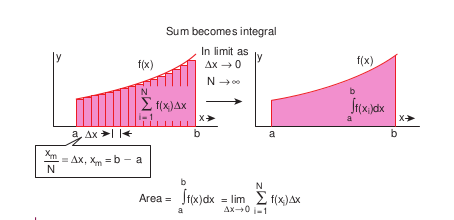

figure 2.31 Relation between summation and integration

## Examples

In physics the work done by a force \(F(x)\) on an object to move it from point \(a\) to point \(b\) in one dimension is given by

\[W = \int_{a}^{b} F(x) \, dx\]

(No scalar products is required here, since motion here is in one dimension)

1) The work done is the area under the force displacement graph as shown in Figure 2.32

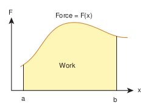

Figure 2.32 Work done by the force 

2) The impulse given by the force in an interval of time is calculated between

the interval from time \(t = 0\) to time \(t = t_1\) as

\[\text{Impulse } I = \int_{0}^{t_1} F \, dt\]

The impulse is the area under the force function \(F(t)\) - t graph as shown in Figure 2.33.

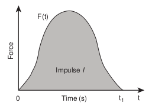

Figure 2.33 Impulse of a force 

### Average velocity

Consider a particle located initially at point \(\mathrm{P}\) having position vector \(\vec{r}_1\) . In a time interval \(\Delta t\) the particle is moved to the point \(\mathrm{Q}\) having position vector \(\vec{r}_2\) . The displacement vector is \(\Delta \vec{r} = \vec{r}_2 - \vec{r}_1\) . This is shown in Figure 2.34.

The average velocity is defined as ratio of the displacement vector to the corresponding time interval

\[\vec{v}_{avg} = \frac{\Delta \vec{r}}{\Delta t}.\]

It is a vector quantity. The direction of average velocity is in the direction of the displacement vector \((\Delta \vec{r})\) .

This is also shown in Figure 2.34.

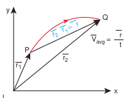

Figure 2.34 Average velocity 

### Average speed

The average speed is defined as the ratio of total path length travelled by the particle in a time interval.

##### 
Average speed = total path length / total time

## EXAMPLE 2.20

Consider an object travelling in a semicircular path from point O to point P in 5 second, as shown in the Figure given below. Calculate the average velocity and average speed.

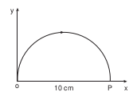

## Solution

Average velocity 

#### 
\(\vec{v}_{avg} = \frac{\vec{r}_p - \vec{r}_o}{\Delta t}\)

\[\text{Here } \Delta t = 5 \, \text{s}\]

\[\vec{r}_o = 0, \quad \vec{r}_p = 10\hat{i}\]

\[\vec{v}_{avg} = \frac{10\hat{i} \, \text{cm}}{5 \, \text{s}} = 2\hat{i} \, \text{cm} \, \text{s}^{-1}.\]

The average velocity is in the positive x direction.

The average speed = total path length / time taken (the path is semi-circular)

\[= \frac{5\pi \, \text{cm}}{5 \, \text{s}} = \pi \, \text{cm} \, \text{s}^{-1} \approx 3.14 \, \text{cm} \, \text{s}^{-1}\]

Note that the average speed is greater than the magnitude of the average velocity.

### Instantaneous velocity or velocity

The instantaneous velocity at an instant \(t\) or simply 'velocity' at an instant \(t\) is defined as limiting value of the average velocity as \(\Delta t \rightarrow 0\) evaluated at time \(t\)

In other words, velocity is equal to rate of change of position vector with respect to time. Velocity is a vector quantity.

\[\vec{v} = \lim_{\Delta t \to 0} \frac{\Delta \vec{r}}{\Delta t} = \frac{d\vec{r}}{dt}\]

In component form, this velocity is

\[\vec{v} = \frac{d\vec{r}}{dt} = \frac{d}{dt} (x\hat{i} + y\hat{j} + z\hat{k})\] \[= \frac{dx}{dt} \hat{i} + \frac{dy}{dt} \hat{j} + \frac{dz}{dt} \hat{k}.\]

Here 
\[\frac{dx}{dt} = v_x = x- \text{component of velocity}\]

\[\frac{dy}{dt} = v_y = y - \text{component of velocity}\] 
\[\frac{dz}{dt} = v_z = z - \text{component of velocity}\]

The magnitude of velocity \(v\) is called speed and is given by

\[v = \sqrt{v_x^2 + v_y^2 + v_z^2}.\]

Speed is always a positive scalar. The unit of speed is also meter per second.

## EXAMPLE 2.21

The position vector of a particle is given \(\vec{r} = 2t\hat{i} + 3t^2 \hat{j} - 5\hat{k}\) .

a) Calculate the velocity and speed of the particle at any instant \(t\) 

b) Calculate the velocity and speed of the particle at time \(t = 2 \, \text{s}\)

## Solution

The velocity \(\vec{v} = \frac{d\vec{r}}{dt} = 2\hat{i} + 6t\hat{j}\)

The speed \(v(t) = \sqrt{2^2 + (6t)^2} \, \text{m} \, \text{s}^{-1}\)

The velocity of the particle at \(t = 2 \, \text{ s}\)

\[\vec{v} (2 \, \text{sec}) = 2\hat{i} + 12\hat{j}\]

The speed of the particle at \(t = 2 \, \text{ s}\)

\[v(2 s) = \sqrt{2^2 + 12^2} = \sqrt{4 + 144} = \sqrt{148} \approx 12.17 \, \text{m} \, \text{s}^{-1}\]

Note that the particle has velocity components along \(x\) and \(y\) direction. Along the \(z\) direction the position has constant value \((-5)\) which is independent of time. Hence there is no \(z\) - component for the velocity.

## EXAMPLE 2.22

The velocity of three particles A, B, C are given below. Which particle travels at the greatest speed?

\[\vec{v_A} = 3\hat{i} -5\hat{j} +2\hat{k}\] \[\vec{v_B} = \hat{i} +2\hat{j} +3\hat{k}\] \[\vec{v_C} = 5\hat{i} +3\hat{j} +4\hat{k}\]

## Solution

We know that speed is the magnitude of the velocity vector. Hence,

\[\text{Speed of A} = |\vec{v_A}| = \sqrt{(3)^2 + (-5)^2 + (2)^2}\] \[= \sqrt{9 + 25 + 4} = \sqrt{38} \, \text{m} \, \text{s}^{-1}\]

\[\text{Speed of B} = |\vec{v_B}| = \sqrt{(1)^2 + (2)^2 + (3)^2}\] \[= \sqrt{1 + 4 + 9} = \sqrt{14} \, \text{m} \, \text{s}^{-1}\]

\[\text{Speed of C} = |\vec{v_C}| = \sqrt{(5)^2 + (3)^2 + (4)^2}\] \[= \sqrt{25 + 9 + 16} = \sqrt{50} \, \text{m} \, \text{s}^{-1}\]

The particle C has the greatest speed.

\[\sqrt{50} > \sqrt{38} > \sqrt{14}\]

## EXAMPLE 2.23

Two cars are travelling with respective velocities \(\vec{v}_1 = 10 \, \text{m} \, \text{s}^{-1}\) along east and \(\vec{v}_2 = 10 \, \text{m} \, \text{s}^{-1}\) along west. What are the speeds of the cars?

## Solution

Both cars have the same magnitude of velocity. This implies that both cars travel at the same speed even though they have velocities in different directions. Speed will not give the direction of motion.

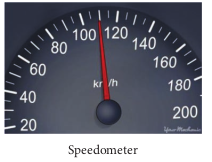

### Momentum

The linear momentum or simply momentum of a particle is defined as product of mass with velocity. It is denoted as '\(\vec{p}\) ' . Momentum is also a vector quantity.

\[\vec{p} = m\vec{v}.\]

The direction of momentum is also in the direction of velocity, and the magnitude of momentum is equal to product of mass and speed of the particle.

\[p = mv\]

In component form the momentum can be written as

\[p_x \hat{i} + p_y \hat{j} + p_z \hat{k} = m v_x \hat{i} + m v_y \hat{j} + m v_z \hat{k}\]

Here \(p_x = x\) component of momentum and is equal to \(m v_x\)

\(p_y = y\) component of momentum and is equal to \(m v_y\)

\(p_z = z\) component of momentum and is equal to \(m v_z\)

The momentum of the particle plays a very important role in Newton's laws. The physical significance of momentum can be well understood by the following example.

Consider a butterfly and a stone, both moving towards you with the same velocity \(5 \, \text{m} \, \text{s}^{-1}\) . If both hit your body, the effects will not be the same. The effects not only depend upon the velocity, but also on the mass. The stone has greater mass compared to the butterfly. The momentum of the stone is thus greater than the momentum of the butterfly. It is the momentum which plays a major role in explaining the 'state' of motion of the object.

The unit of the momentum is \(\text{kg} \, \text{m} \, \text{s}^{-1}\)

## EXAMPLE 2.24

Consider two masses of \(10 \, \text{g}\) and \(1 \, \text{kg}\) moving with the same speed \(10 \, \text{m} \, \text{s}^{-1}\) . Calculate the magnitude of the momentum.

## Solution

We use \(p = mv\)

For the mass of \(10 \, \text{g}\) \(m = 0.01 \, \text{kg}\)

\[p = 0.01 \times 10 = 0.1 \, \text{kg} \, \text{m} \, \text{s}^{-1}\]

For the mass of \(1 \, \text{kg}\)

\[p = 1 \times 10 = 10 \, \text{kg} \, \text{m} \, \text{s}^{-1}\]

Thus even though both the masses have the same speed, the momentum of the heavier mass is 100 times greater than that of the lighter mass.

## MOTION ALONG ONE DIMENSION

### Average velocity

If a particle moves in one dimension, say for example along the \(x\) direction, then

\[\text{The average velocity} = \frac{\Delta x}{\Delta t} = \frac{x_2 - x_1}{t_2 - t_1}.\]

The average velocity is also a vector quantity. But in one dimension we have only two directions (positive and negative \(x\) direction), hence we use positive and negative signs to denote the direction.

The instantaneous velocity or velocity is defined as 

\(\quad v = \lim_{\Delta t \to 0} \frac{\Delta x}{\Delta t} = \frac{dx}{dt}\)

Graphically the slope of the position- time graph will give the velocity of the particle. At the same time, if velocity time graph is given, the distance and displacement are determined by calculating the area under the curve. This is explained below.

We know that velocity is given by \(\frac{dx}{dt} = v\)

Therefore, we can write \(dx = v \, dt\)

By integrating both sides, we get \(\int_{x_1}^{x_2} dx = \int_{t_1}^{t_2} v \, dt\).

As already seen, integration is equivalent to area under the given curve. So the term \(\int_{t_1}^{t_2} v \, dt\) represents the area under the curve \(v\) as a function of time.

Since the left hand side of the integration represents the displacement travelled by the particle from time \(t_1\) to \(t_2\) , the area under the

velocity time graph will give the displacement of the particle. If the area is negative, it means that displacement is negative, so the particle has travelled in the negative direction. This is shown in the Figure 2.35 below.

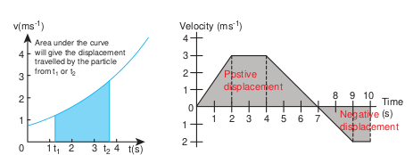

Figure 2.35 Displacement in the velocity-time graph 

## EXAMPLE 2.25

A particle moves along the \(x\) - axis in such a way that its coordinates \(x\) varies with time 't' according to the equation \(x = 2 - 5t + 6t^2\) . What is the initial velocity of the particle?

## Solution

\[x = 2 - 5t + 6t^2\] \[\text{Velocity}, v = \frac{dx}{dt} = \frac{d}{dt} (2 - 5t + 6t^2)\] \[\text{or } v = -5 + 12t\] \[\text{For initial velocity}, t = 0\] \[\therefore \text{Initial velocity} = -5 \, \text{m} \, \text{s}^{-1}\]

The negative sign implies that at \(t = 0\) the velocity of the particle is along negative \(x\) direction.

> #### Average speed = total path length / total time period

### Relative Velocity in One and Two Dimensional Motion

When two objects A and B are moving with different velocities, then the velocity of one object A with respect to another object B is called relative velocity of object A with respect to B.

#### Case 1

Consider two objects A and B moving with uniform velocities \(\vec{V}_A\) and \(\vec{V}_B\) as shown, along straight tracks in the same direction \(\vec{V}_A\) \(\vec{V}_B\) with respect to ground.

The relative velocity of object A with respect to object B is \(\vec{V}_{AB} = \vec{V}_A - \vec{V}_B\)

The relative velocity of object B with respect to object A is \(\vec{V}_{BA} = \vec{V}_B - \vec{V}_A\)

Thus, if two objects are moving in the same direction, the magnitude of relative velocity of one object with respect to another is equal to the difference in magnitude of two velocities.

## EXAMPLE 2.26

Suppose two cars A and B are moving with uniform velocities with respect to ground along parallel tracks and in the same direction. Let the velocities of A and B be \(35 \, \text{km} \, \text{h}^{-1}\) due east and \(40 \, \text{km} \, \text{h}^{-1}\) due east respectively. What is the relative velocity of car B with respect to A?

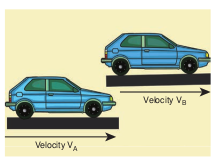

## Solution

The relative velocity of B with respect to A, \(\vec{v}_{BA} = \vec{v}_B - \vec{v}_A = 5 \, \text{km} \, \text{h}^{-1}\) due east

Similarly, the relative velocity of A with respect to B i.e., \(\vec{v}_{AB} = \vec{v}_A - \vec{v}_B = 5 \, \text{km} \, \text{h}^{-1}\) due west.

To a passenger in the car A, the car B will appear to be moving east with a velocity \(5 \, \text{km} \, \text{h}^{-1}\) . To a passenger in car B, the car A will appear to move westwards with a velocity of \(5 \, \text{km} \, \text{h}^{-1}\)

#### Case 2

Consider two objects A and B moving with uniform velocities \(\vec{V}_A\) and \(\vec{V}_B\) along the same straight tracks but opposite in direction

image[[526, 410, 867, 452]]

The relative velocity of object A with respect to object B is

\[\vec{V}_{AB} = \vec{V}_A - (-\vec{V}_B) = \vec{V}_A + \vec{V}_B\]

The relative velocity of object B with respect to object A is

\[\vec{V}_{BA} = -\vec{V}_B - \vec{V}_A = -(\vec{V}_A + \vec{V}_B)\]

Thus, if two objects are moving in opposite directions, the magnitude of relative velocity of one object with respect to other is equal to the sum of magnitude of their velocities.

#### Case 3

Consider the velocities \(\vec{v}_A\) and \(\vec{v}_B\) at an angle \(\theta\) between their directions.

The relative velocity of A with respect to B, \(\vec{v}_{AB} = \vec{v}_A - \vec{v}_B\)

Then, the magnitude and direction of \(\vec{v}_{AB}\) is given by \(v_{AB} = \sqrt{v_A^2 + v_B^2 - 2 v_A v_B \cos \theta}\) and \(\tan \beta = \frac{v_B \sin \theta}{v_A - v_B \cos \theta}\) (Here \(\beta\) is angle between \(\vec{v}_{AB}\) and \(\vec{v}_B\))

(i) When \(\theta = 0^{\circ}\) , the bodies move along parallel straight lines in the same direction,

We have \(v_{AB} = (v_A - v_B)\) in the direction of \(\vec{v}_A\) . Obviously \(v_{BA} = (v_B - v_A)\) in the direction of \(\vec{v}_B\) .

(ii) When \(\theta = 180^{\circ}\) , the bodies move along parallel straight lines in opposite directions, We have \(v_{AB} = (v_A + v_B)\) in the direction of \(\vec{v}_A\) .

Similarly, \(v_{BA} = (v_B + v_A)\) in the direction of \(\vec{v}_B\) .

(iii) If the two bodies are moving at right angles to each other, then \(\theta = 90^{\circ}\) . The magnitude of the relative velocity of A with respect to \(B = v_{AB} = \sqrt{v_A^2 + v_B^2}\) .

(iv) Consider a person moving horizontally with velocity \(\vec{v}_M\) . Let rain fall vertically with velocity \(\vec{v}_R\) . An umbrella is held to avoid the rain. Then the relative velocity of the rain with respect to the person is, (Figure 2.36)

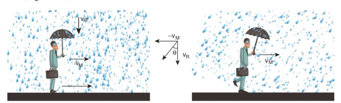

Figure 2.36 Angle of umbrella with respect to rain 

\[\vec{V}_{RM} = \vec{V}_R - \vec{V}_M\]

which has magnitude

\[V_{RM} = \sqrt{V_R^2 + V_M^2}\]

and direction \(\theta = \tan^{-1}\left(\frac{V_M}{V_R}\right)\) with the vertical as shown in Figure. 2.36

In order to save himself from the rain, he should hold an umbrella at an angle \(\theta\) with the vertical.

## EXAMPLE 2.27

Suppose two trains A and B are moving with uniform velocities along parallel tracks but in opposite directions. Let the velocity of train A be \(40 \, \text{km} \, \text{h}^{-1}\) due east and that of train B be \(40 \, \text{km} \, \text{h}^{-1}\) due west. Calculate the relative velocities of the trains

## Solution

Relative velocity of A with respect to B, \(v_{AB} = 80 \, \text{km} \, \text{h}^{-1}\) due east

Thus to a passenger in train B, the train A will appear to move east with a velocity of \(80 \, \text{km} \, \text{h}^{-1}\)

1 The relative velocity of B with respect to A, \(v_{BA} = 8`  `` ` \, \text{km} \, \text{h}^{-1}\) due west

To a passenger in train A, the train B will appear to move westwards with a velocity of \(80 \, \text{km} \, \text{h}^{-1}\)

## EXAMPLE 2.28

Consider two trains A and B moving along parallel tracks with the same velocity in the same direction. Let the velocity of each train be \(50 \, \text{km} \, \text{h}^{-1}\) due east. Calculate the relative velocities of the trains.

## Solution

Relative velocity of B with respect to A, \(v_{BA} = v_B - v_A\) \(= 50 \, \text{km} \, \text{h}^{-1} + (-50) \, \text{km} \, \text{h}^{-1}\) \(= 0 \, \text{km} \, \text{h}^{-1}\)

Similarly, relative velocity of A with respect to B i.e., \(v_{AB}\) is also zero.

Thus each train will appear to be at rest with respect to the other.

## EXAMPLE 2.29

How long will a boy sitting near the window of a train travelling at \(36 \, \text{km} \, \text{h}^{-1}\) see a train passing by in the opposite direction with a speed of \(18 \, \text{km} \, \text{h}^{-1}\) . The length of the slow- moving train is \(90 \, \text{m}\) .

## Solution

The relative velocity of the slow- moving train with respect to the boy is \(= (36 + 18) \, \text{km} \, \text{h}^{-1} = 54 \, \text{km} \, \text{h}^{-1} = 54 \times \frac{5}{18} \, \text{m} \, \text{s}^{-1} = 15 \, \text{m} \, \text{s}^{-1}\)

Since the boy will watch the full length of the other train, to find the time taken to watch the full train:

We have, \(15 = \frac{90}{t}\) or \(t = \frac{90}{15} = 6 \, \text{s}\)

## EXAMPLE 2.30

A swimmer's speed in the direction of flow of a river is \(12 \, \text{km} \, \text{h}^{-1}\) . Against the direction of flow of the river the swimmer's speed is \(6 \, \text{km} \, \text{h}^{-1}\) . Calculate the swimmer's speed in still water and the velocity of the river flow.

## Solution

Let \(v_s\) and \(v_r\) , represent the velocities of the swimmer and river respectively with respect to ground.

\[\begin{array}{r} v_s + v_r = 12 \\ v_s - v_r = 6 \end{array} \quad (1)\]

Adding the both equations (1) and (2)

\[2v_s = 12 + 6 = 18 \, \text{km} \, \text{h}^{-1} \text{ or}\] \[v_s = 9 \, \text{km} \, \text{h}^{-1}\]

From Equation (1),

\[9 + v_r = 12 \text{ or}\] \[v_r = 3 \, \text{km} \, \text{h}^{-1}\]

When the river flow and swimmer move in the same direction, the net velocity of swimmer is \(12 \, \text{km} \, \text{h}^{-1}\) .

### Accelerated Motion

During non- uniform motion of an object, the velocity of the object changes from instant to instant i.e., the velocity of the object is no more constant but changes

1) In accelerated motion, if the change in velocity of an object per unit time is same (constant) then the object is said to be moving with uniformly accelerated motion. ii) On the other hand, if the change in velocity per unit time is different at different times, then the object is said to be moving with non- uniform accelerated motion.

### Average acceleration

If an object changes its velocity from \(\vec{v}_1\) to \(\vec{v}_2\) in a time interval \(\Delta t = t_2 - t_1\) , then the average acceleration is defined as the ratio of change in velocity over the time interval \(\Delta t = t_2 - t_1\)

\[\vec{a}_{avg} = \frac{\vec{v}_2 - \vec{v}_1}{t_2 - t_1} = \frac{\Delta \vec{v}}{\Delta t}\]

Average acceleration is a vector quantity in the same direction as the vector \(\Delta \vec{v}\) .

### Instantaneous acceleration

Usually, the average acceleration will give the change in velocity only over the entire time interval. It will not give value of the acceleration at any instant time t.

Instantaneous acceleration or acceleration of a particle at time t is given by the ratio of change in velocity over \(\Delta t\) as \(\Delta t\) approaches zero.

\[\text{Acceleration } \vec{a} = \lim_{\Delta t \to 0} \frac{\Delta \vec{v}}{\Delta t} = \frac{d \vec{v}}{d t}\]

In other words, the acceleration of the particle at an instant t is equal to rate of change of velocity.

(i) Acceleration is a vector quantity. Its SI unit is \(\text{m} \, \text{s}^{-2}\) and its dimensional formula is \(M^0 L^1 T^{-2}\) (ii) Acceleration is positive if its velocity is increasing, and is negative if the velocity is decreasing. The negative acceleration is called retardation or deceleration.

In terms of components, we can write

\[\vec{a} = \frac{d v_x}{dt} \hat{i} + \frac{d v_y}{dt} \hat{j} + \frac{d v_z}{dt} \hat{k} = \frac{d \vec{v}}{dt}\]

Thus \(a_x = \frac{d v_x}{dt}, \quad a_y = \frac{d v_y}{dt}, \quad a_z = \frac{d v_z}{dt}\) are the components of instantaneous acceleration.

Since each component of velocity is the derivative of the corresponding coordinate, we can express the components \(a_x, a_y\) and \(a_z\) as

\[a_x = \frac{d^2 x}{dt^2}, \quad a_y = \frac{d^2 y}{dt^2}, \quad a_z = \frac{d^2 z}{dt^2}\]

Then the acceleration vector \(\vec{a}\) itself is

\[\vec{a} = \frac{d^2 x}{dt^2} \hat{i} + \frac{d^2 y}{dt^2} \hat{j} + \frac{d^2 z}{dt^2} \hat{k} = \frac{d^2 \vec{r}}{dt^2}\]

Thus acceleration is the second derivative of position vector with respect to time.

Graphically the acceleration is the slope in the velocity- time graph. At the same time if the acceleration- time graph is given, then the velocity can be found from the area under the acceleration- time graph.

From \(\frac{dv}{dt} = a\) , we have \(dv = a \, dt\) ; hence

\[v = \int_{t_1}^{t_2} a \, dt\]

For an initial time \(t_1\) and final time \(t_2\)

## EXAMPLE 2.31

A velocity- time graph is given for a particle moving in \(x\) direction, as below

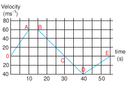

a) Describe the motion qualitatively in the interval 0 to 55 s.

b) Find the distance and displacement travelled from 0 s to 40 s.

c) Find the acceleration at \(t = 5\) s and at \(t = 20\) s

## Solution

a) **From O to A: (0 s to 10 s)**

At \(t = 0\) s the particle has zero velocity. At \(t > 0\) , particle has positive velocity and moves in the positive \(x\) direction. From 0 s to 10 s the slope \(\left(\frac{dv}{dt}\right)\) is positive, implying the particle is accelerating. Thus the velocity increases during this time interval.

**From A to B: (10 s to 15 s)**

From 10 s to 15 s the velocity stays constant at \(60 \, \text{m} \, \text{s}^{-1}\) . The acceleration is 0 during this period. But the particle continues to travel in the positive \(x\) - direction.

**From B to C: (15 s to 30 s)**

From the 15 s to 30 s the slope is negative, implying the velocity is decreasing. But the particle is moving in the positive \(x\) direction. At \(t = 30\) s the velocity becomes zero, and the particle comes to rest momentarily at \(t = 30\) s.

**From C to D: (30 s to 40 s)**

From 30 s to 40 s the velocity is negative. It implies that the particle starts to move in the negative \(x\) direction. The magnitude of velocity increases to a maximum \(40 \, \text{m} \, \text{s}^{-1}\)

**From D to E: (40 s to 55 s)**

From 40 s to 55 s the velocity is still negative, but starts increasing from \(-40 \, \text{m} \, \text{s}^{-1}\) At \(t = 55\) s the velocity of the particle is zero and particle comes to rest.

(b) The total area under the curve from 0 s to 40 s will give the displacement. Here the area from O to C represents motion along positive \(x\)-direction and the area under the graph from C to D represents the particle's motion along negative \(x\)-direction.

The displacement travelled by the particle from 0 s to 10 s \(= \frac{1}{2} \times 10 \times 60 = 300 \, \text{m}\)

The displacement travelled from 10 s to \(15 \, \text{s} = 60 \times 5 = 300 \, \text{m}\)

The displacement travelled from 15 s to \(30 \, \text{s} = \frac{1}{2} \times 15 \times 60 = 450 \, \text{m}\)

The displacement travelled from \(30 \, \text{s}\) to \(40 \, \text{s} = \frac{1}{2} \times 10 \times (-40) = -200 \, \text{m}\) Here the negative sign implies that the particle travels \(200 \, \text{m}\) in the negative \(x\) direction.

The total displacement from 0 s to 40 s is given by

\[300 \, \text{m} + 300 \, \text{m} + 450 \, \text{m} - 200 \, \text{m}\] \[= +850 \, \text{m}.\]

Thus the particle's net displacement is along the positive x- direction.

The total distance travelled by the particle from 0 s to \(40 \, \text{s} = 300 + 300 + 450 + 200 = 1250 \, \text{m}\)

(c) The acceleration is given by the slope in the velocity-time graph. In the first 10 seconds the velocity has constant slope (constant acceleration). It implies that the acceleration a is from \(v_1 = 0\) to \(v_2 = 60 \, \text{m} \, \text{s}^{-1}\)

\[\text{Hence } a = \frac{v_2 - v_1}{t_2 - t_1} \text{ gives }\] \[a = \frac{60 - 0}{10 - 0} = 6 \, \text{m} \, \text{s}^{-2}\]

Next, the particle has constant negative slope from 15 s to 30 s. In this case \(v_2 = 0\) and \(v_1 = 60 \, \text{m} \, \text{s}^{-1}\) . Thus the acceleration at \(t = 20 \, \text{s}\) is given by \(a = \frac{0 - 60}{30 - 15} = -4 \, \text{m} \, \text{s}^{-2}\) . Here the negative sign implies that the particle has negative acceleration.

## EXAMPLE 2.32

If the position vector of the particle is given by \(\vec{r} = 3t^2 \hat{i} + 5t \hat{j} + 4 \hat{k}\) , Find the

a) The velocity of the particle at \(t = 3 \, \text{s}\) b) Speed of the particle at \(t = 3 \, \text{s}\) c) acceleration of the particle at time \(t = 3 \, \text{s}\)

### Solution

(a) The velocity \(\vec{v} = \frac{d\vec{r}}{dt} = \frac{dx}{dt} \hat{i} + \frac{dy}{dt} \hat{j} + \frac{dz}{dt} \hat{k}\)

We obtain, \(\vec{v}(t) = 6t \hat{i} + 5 \hat{j}\)

The velocity has only two components \(v_x = 6t\) , depending on time t and \(v_y = 5\) which is independent of time.

The velocity at \(t = 3 \, \text{s}\) is \(\vec{v}(3) = 18 \hat{i} + 5 \hat{j}\)

(b) The speed at \(t = 3 \, \text{s}\) is \(v = \sqrt{18^2 + 5^2} = \sqrt{349} \approx 18.68 \, \text{m} \, \text{s}^{-1}\)

(c) The acceleration \(\vec{a}\) is, \(\vec{a} = \frac{d^2 \vec{r}}{dt^2} = 6 \hat{i}\)

The acceleration has only the \(x\) - component. Note that acceleration here is independent of t, which means \(\vec{a}\) is constant. Even at \(t = 3 \, \text{s}\) it has same value \(\vec{a} = 6 \hat{i}\) . The velocity is non- uniform, but the acceleration is uniform (constant) in this case.

## EXAMPLE 2.33

An object is thrown vertically downward. What is the acceleration experienced by the object?

###  Solution

We know that when the object falls towards the Earth, it experiences acceleration due to gravity \(g = 9.8 \, \text{m} \, \text{s}^{-2}\) downward. We can choose the coordinate system as shown in the figure.

2.10.3 Equations of Uniformly Accelerated Motion by Calculus Method

The acceleration is along the negative y direction.

\[\vec{a} = g(-\vec{j}) = -\vec{g}\]

**Note:**

For convenience, sometimes we take the downward direction as positive Y- axis. As a vertically falling body accelerates downwards, g is taken as positive in this direction. \((a = g)\)

### Equations of Uniformly Accelerated Motion by Calculus Method

Consider an object moving in a straight line with uniform or constant acceleration a.

Let u be the velocity of the object at time \(t = 0\) and v be velocity of the body at a later time t.

### Velocity-time relation

(i) The acceleration of the body at any instant is given by the first derivative of the velocity with respect to time,

\[a = \frac{dv}{dt} \text{ or } dv = a \, dt\]

Integrating both sides with the condition that as time changes from 0 to t, the velocity changes from u to v. For the constant acceleration,

\[\int_{u}^{v} dv = \int_{0}^{t} a \, dt = a \int_{0}^{t} dt \Rightarrow [v]_{u}^{v} = a [t]_{0}^{t}\] \[v - u = at \quad (\text{or}) \quad v = u + at \quad \longrightarrow (2.7)\]

If a is dependent on time t, a cannot be brought outside the time integral.

### Displacement-time relation

(ii) The velocity of the body is given by the first derivative of the displacement with respect to time.

\[v = \frac{ds}{dt} \text{ or } ds = v \, dt\]

and since \(v = u + at\)

\[\text{We get } ds = (u + at) \, dt\]

Assume that initially at time \(t = 0\) the particle started from the origin. At a later time t, the particle displacement is s. Further assuming that acceleration is time- independent, we have

\[\int_{0}^{s} ds = \int_{0}^{t} u \, dt + \int_{0}^{t} at \, dt \quad (\text{or}) \quad s = ut + \frac{1}{2} at^2 \quad (2.8)\]

### Velocity-displacement relation

(iii) The acceleration is given by the first derivative of velocity with respect to time.

\[a = \frac{dv}{dt} = \frac{dv}{ds} \frac{ds}{dt} = \frac{dv}{ds} v\] \[[\text{since } ds/dt = v] \text{ where } s \text{ is displacement traversed.}\]

\[a \, ds = v \, dv = \frac{1}{2} d(v^2)\]

\[\text{or } ds = \frac{1}{2a} d(v^2)\]

Integrating the above equation, using the fact when the velocity changes from u to v, displacement changes from 0 to s, we get

\[\int_{0}^{s} ds = \int_{u}^{v} \frac{1}{2a} d(v^2)\]

1. \(s = \frac{1}{2a} (v^2 - u^2)\) \(\therefore v^2 = u^2 + 2as\) (2.9)

We can also derive the displacement s in terms of initial velocity u and final velocity v.

From the equation (2.7) we can write,

\[at = v - u\]

Substitute this in equation (2.8), we get

\[s = ut + \frac{1}{2} (v - u)t\] \[s = \frac{(u + v)t}{2}\]

The equations (2.7), (2.8), (2.9) and (2.10) are called kinematic equations of motion, and have a wide variety of practical applications.

### Kinematic equations

\[v = u + at\] \[s = ut + \frac{1}{2} at^2\] \[v^2 = u^2 + 2as\] \[s = \frac{(u+v)t}{2}\]

It is to be noted that all these kinematic equations are valid only if the motion is in a straight line with constant acceleration. For circular motion and oscillatory motion these equations are not applicable.

## Equations of motion under gravity

A practical example of a straight line motion with constant acceleration is the motion of an object near the surface of the Earth. We know that near the surface of the Earth, the acceleration due to gravity 'g' is constant. All straight line motions under this acceleration can be well understood using the kinematic equations given earlier.

Case (i): A body falling from a height h

Figure 2.37 An object in free fall 

Consider an object of mass m falling from a height h. Assume there is no air resistance. For convenience, let us choose the downward direction as positive y- axis as shown in the Figure 2.37. The object experiences acceleration 'g' due to gravity which is constant near the surface of the Earth. We can use kinematic equations to explain its motion. We have

The acceleration \(\vec{a} = \vec{g}\)

By comparing the components, we get

\[a_x = 0, \quad a_z = 0, \quad a_y = g\]

Let us take for simplicity, \(a_y = a = g\)

If the particle is thrown with initial velocity 'u' downward which is in negative y axis, then velocity and position at of the particle any time t is given by

\[\begin{aligned} v &= u + gt  \quad \quad (2.11)\\ y &= ut + \frac{1}{2} gt^2 \quad (2.12) \end{aligned} \]

The square of the speed of the particle when it is at a distance y from the hill- top, is

\[v^2 = u^2 + 2gy \quad (2.13)\]

Suppose the particle starts from rest.

Then \(u = 0\)

Then the velocity v, the position of the particle and \(v^2\) at any time t are given by (for a point y from the hill- top)

\[\begin{aligned} v &= gt \quad (2.14)\\ y &= \frac{1}{2} gt^2 \quad (2.15)\\ v^2 &= 2gy \quad (2.16) \end{aligned} \]

The time \((t = T)\) taken by the particle to reach the ground (for which \(y = h\) ), is given by using equation (2.15),

\[\begin{aligned} h &= \frac{1}{2} gT^2 \quad (2.17) \\ T &= \sqrt{\frac{2h}{g}} \quad (2.18)\end{aligned}\]

The equation (2.18) implies that greater the height \((h)\) , particle takes more time \((T)\) to reach the ground. For lesser height \((h)\) , it takes lesser time to reach the ground.

The speed of the particle when it reaches the ground (y = h) can be found using equation (2.16), we get

\[v_{\text{ground}} = \sqrt{2gh} \quad (2.19)\]

The above equation implies that the body falling from greater height \((h)\) will have higher velocity when it reaches the ground.

The motion of a body falling towards the Earth from a small altitude \((h \ll R)\) , purely under the force of gravity is called free fall. (Here R is radius of the Earth)

## EXAMPLE 2.34

An iron ball and a feather are both falling from a height of \(10 \, \text{m}\) .

a) What are the time taken by the iron ball and feather to reach the ground?

b) What are the velocities of iron ball and feather when they reach the ground? (Ignore air resistance and take \(g = 10 \, \text{m} \, \text{s}^{-2}\) )

### Solution

Since kinematic equations are independent of mass of the object, according to equation (2.8) the time taken by both iron ball and feather to reach the ground are the same. This is given by

\[T = \sqrt{\frac{2h}{g}} = \sqrt{\frac{2 \times 10}{10}} = \sqrt{2} \, \text{s} \approx 1.414 \, \text{s}\]

Thus, both feather and iron ball reach ground at the same time.

By following equation (2.19) both iron ball and feather reach the Earth with the same speed. It is given by

\[v = \sqrt{2gh} = \sqrt{2 \times 10 \times 10}\] \[= \sqrt{200} \, \text{m} \, \text{s}^{-1} \approx 14.14 \, \text{m} \, \text{s}^{-1}\]

Galileo concluded that in vacuum all objects fall with the same acceleration \(g\) and reach the ground at the same time.

https://www.youtube.com/watch?v=E43- CfukEgs&t=5s

## EXAMPLE 2.35

Is it possible to measure the depth of a well using kinematic equations?

Consider a well without water, of some depth \(d\) . Take a small object (for example lemon) and a stopwatch. When you drop the lemon, start the stop watch. As soon as the lemon touches the bottom of the well, stop the watch. Note the time taken by the lemon to reach the bottom and denote the time as \(t\) .

Since the initial velocity of lemon \(u = 0\) and the acceleration due to gravity \(g\) is constant over the well, we can use the equations of motion for constant acceleration.

\[s = ut + \frac{1}{2} at^2\]

Since \(u = 0, s = d, a = g\) (Since we choose the y axis downwards), Then

\[d = \frac{1}{2} gt^2\]

Substituting \(g = 9.8 \, \text{m} \, \text{s}^{-2}\) we get the depth of the well.

To estimate the error in our calculation we can use another method to measure the depth of the well. Take a long rope and hang the rope inside the well till it touches the bottom. Measure the length of the rope which is the correct depth of the well \((d_{\text{correct}})\) . Then

\[\text{error} = d_{\text{correct}} - d\]

\[\text{relative error} = \frac{d_{\text{correct}} - d}{d_{\text{correct}}}\]

percentage of relative error

\[= \frac{d_{\text{correct}} - d}{d_{\text{correct}}} \times 100\]

What would be the reason for an error, if any?

Repeat the experiment for different masses and compare the result with \(d_{\text{correct}}\) every time.

**Note:**

If there is water in the well, this method can be used to measure depth of the well till the surface of the water.

### Case (ii): A body thrown vertically upwards

Consider an object of mass \(m\) thrown vertically upwards with an initial velocity \(u\) . Let us neglect the air friction. In this case we choose the vertical direction as positive \(y\) axis as shown in the Figure 2.38, then the acceleration \(a = -g\) (neglect air friction) and \(g\) points towards the negative \(y\) axis. The kinematic equations for this motion are,

Figure 2.38. An object thrown vertically 

The velocity and position of the object at any time t are,

\[\begin{aligned} v &= u - gt \\ s &= ut - \frac{1}{2} gt^2 \end{aligned} \quad (2.21)\]

The velocity of the object at any position \(y\) (from the point where the object is thrown) is

\[v^2 = u^2 - 2gy \quad (2.22)\]
.

## EXAMPLE 2.36

A train was moving at the rate of \(54 \, \text{km} \, \text{h}^{-1}\) when brakes were applied. It came to rest within a distance of \(225 \, \text{m}\) . Calculate the retardation produced in the train.

### Solution

The final velocity of the particle \(v = 0\) The initial velocity of the particle

\[u = 54 \times \frac{5}{18} \, \text{m} \, \text{s}^{-1} = 15 \, \text{m} \, \text{s}^{-1}\]

\[S = 225 \, \text{m}\]

Retardation is always against the velocity of the particle.

\[v^2 = u^2 - 2aS\] \[0 = (15)^2 - 2a(225)\] \[450a = 225\] \[a = \frac{225}{450} \, \text{m} \, \text{s}^{-2} = 0.5 \, \text{m} \, \text{s}^{-2}\]

Hence, retardation \(= 0.5 \, \text{m} \, \text{s}^{-2}\)

## PROJECTILE MOTION

### Introduction

When an object is thrown in the air with some initial velocity (NOT just upwards), and then allowed to move under the action of gravity alone, the object is known as a projectile. The path followed by the particle is called its trajectory.

#### Examples of projectile are

1. An object dropped from window of a moving train.
2. A bullet fired from a rifle. 
3. A ball thrown in any direction. 
4. A javelin or shot put thrown by an athlete.
5. A jet of water issuing from a hole near the bottom of a water tank

It is found that a projectile moves under the combined effect of two velocities.

i) A uniform velocity in the horizontal direction, which will not change provided there is no air resistance. 

ii) A uniformly changing velocity (i.e., increasing or decreasing) in the vertical direction.

There are two types of projectile motion:

(i) Projectile given an initial velocity in the horizontal direction (horizontal projection) (ii) Projectile given an initial velocity at an angle to the horizontal (angular projection)

To study the motion of a projectile, let us assume that,

i) Air resistance is neglected. 

ii) The effect due to rotation of Earth and curvature of Earth is negligible.

 iii) The acceleration due to gravity is constant in magnitude and direction at all points of the motion of the projectile.
### Projectile in horizontal projection

Consider a projectile, say a ball, thrown horizontally with an initial velocity \(\vec{u}\) from the top of a tower of height \(h\) (Figure 2.39).

Figure 2.39 Horizontal Projection. 

As the ball moves, it covers a horizontal distance due to its uniform horizontal
velocity \(u\) and a vertical downward distance because of constant acceleration due to gravity \(g\) . Thus, under the combined effect the ball moves along the path OPA. The motion is in a 2- dimensional plane. Let the ball take time \(t\) to reach the ground at point A, Then the horizontal distance travelled by the ball is \(x(t) = x\) and the vertical distance travelled is \(y(t) = y\)

We can apply the kinematic equations along the \(x\) direction and \(y\) direction separately. Since this is two- dimensional motion, the velocity will have both horizontal component \(u_x\) and vertical component \(u_y\) .

### Motion along horizontal direction

The particle has zero acceleration along \(x\) direction. So, the initial velocity \(u_x\) remains constant throughout the motion.

The distance traveled by the projectile at a time \(t\) is given by the equation \(x = u_x t + \frac{1}{2} a t^2\) . Since \(a = 0\) along \(x\) direction, we have

\[x = u_x t \quad (2.23)\]

### Motion along downward direction

Here \(u_y = 0\) (initial velocity has no downward component), \(a = g\) (we choose the \(+\)ve y- axis in downward direction), and distance \(y\) at time t

From equation, \(y = u_y t + \frac{1}{2} a t^2\) , we get

\[y = \frac{1}{2} g t^2 \quad (2.24)\]

Substituting the value of t from equation (2.23) in equation (2.24) we have

\[y = \frac{1}{2} g \frac{x^2}{u_x^2} = \left(\frac{g}{2u_x^2}\right) x^2\]

\[y = K x^2 \quad (2.25)\]

where \(K = \frac{g}{2u_x^2}\) is constant

Equation (2.25) is the equation of a parabola. Thus, the path followed by the projectile is a parabola (curve OPA in the Figure 2.39).

(1) **Time of Flight:** The time taken for the projectile to complete its trajectory or time taken by the projectile to hit the ground is called time of flight.

Consider the example of a tower and projectile. Let h be the height of a tower. Let T be the time taken by the projectile to hit the ground, after being thrown horizontally from the tower.

We know that \(s_y = u_y t + \frac{1}{2} a t^2\) for vertical 
motion. Here \(s_y = h\), \(t = T\), \(u_y = 0\) (i.e., no 
initial vertical velocity). Then

\(h = \frac{1}{2} g T^2\)
or
\(T = \sqrt{\frac{2h}{g}}\)

Thus, the time of flight for projectile motion depends on the height of the tower, 
but is independent of the horizontal velocity of projection. If one ball falls vertically and another ball is projected horizontally with 
some velocity, both the balls will reach the bottom at the same time. This is illustrated in the Figure 2.40.

Figure 2.40 Vertical distance covered by 
the two particles is same in equal intervals.

(2)** Horizontal range: **The horizontal 
distance covered by the projectile from the foot 
of the tower to the point where the projectile 
hits the ground is called horizontal range.
For horizontal motion, we have 
 
>
\(s_x = u_x t + \frac{1}{2} a t^2\).

Here, \(s_x = R\) (range), \(u_x = u\), \(a = 0\) (no 
horizontal acceleration) T is time of flight. 
Then horizontal range = uT.
Since the time of flight \(T = \sqrt{\frac{2h}{g}}\), we 
substitute this and we get the horizontal 
range of the particle as \(R = u \sqrt{\frac{2h}{g}}\)
The above equation implies that the 
range R is directly proportional to the initial 
velocity u and inversely proportional to 
acceleration due to gravity g.

(3) Resultant Velocity (Velocity of 
projectile at any time): At any instant t, the 
projectile has velocity components along 
both x-axis and y-axis. The resultant of 
these two components gives the velocity of 
the projectile at that instant t, as shown in 
Figure 2.41.

Figure 2.41. Velocity 
resolved into two components

The velocity component at any t along 
horizontal (x-axis) is \(v_x = u_x + a_x t\)

Since, \(u_x = u\), \(a_x = 0\), we get
 

\(v_x = u\) 
→ (2.26)

The component of velocity along vertical direction \((y\) - axis) is \(v_y = u_y + a_y t\)

Since, \(u_y = 0\), \(a_y = g\), we get

\[v_y = g t \qquad \Rightarrow (2.27)\]

Hence the velocity of the particle at any instant is

\[\bar{v} = u \hat{i} + g t \hat{j}\]

The speed of the particle at any instant \(t\) is given by

\[v = \sqrt{v^2_x + v^2_y}\]

\[v = \sqrt{u^2 + g^2 t^2}\]

(4) Speed of the projectile when it hits the ground: When the projectile hits the ground after initially thrown horizontally from the top of tower of height h, the time of flight is

\[T = \sqrt{\frac{2h}{g}}\]

The horizontal component velocity of the projectile remains the same i.e \(v_x = u\)

The vertical component velocity of the projectile at time \(T\) is

\[v_y = g T = g \sqrt{\frac{2h}{g}} = \sqrt{2gh}\]

The speed of the particle when it reaches the ground is

\[v = \sqrt{u^2 + 2gh}\]

#### Projectile under an angular projection

This projectile motion takes place when the initial velocity is not horizontal, but at some angle with the vertical, as shown in Figure 2.42.

(Oblique projectile)

Examples:

* Water ejected out of a hose pipe held obliquely.
- Cannon fired in a battle ground.

(a) Water is ejected out of a pipe held obliquely 

Figure 2.42. Projectile motion 

Consider an object thrown with initial velocity \(\vec{u}\) at an angle \(\theta\) with the horizontal. Refer Figures 2.42 and 2.43.

Then,

\[\vec{u} = u_x \hat{i} + u_y \hat{j}\]

where \(u_x = u \cos \theta\) is the horizontal component and \(u_y = u \sin \theta\) the vertical component of velocity.

Since the acceleration due to gravity is in the direction opposite to the direction of vertical component \(u_y\) , this component will gradually reduce to zero at the maximum height of the projectile. At this maximum height, the same gravitational force will push the projectile to move downward and fall to the ground. There is no acceleration along the \(x\) direction throughout the motion. So, the horizontal component of the velocity \((u_x = u \cos \theta)\) remains the same till the object reaches the ground.

Hence after the time t, the velocity along horizontal motion \(v_x = u_x + a_x t = u_x = u \cos \theta\)

The horizontal distance travelled by projectile in time t is \(s_x = u_x t + \frac{1}{2} a_x t^2\)

Here, \(s_x = x\), \(u_x = u \cos \theta\), \(a_x = 0\)

Figure 2.43. Initial velocity resolved into components 

\[\text{Thus}, \quad x = u \cos \theta \cdot t \quad \text{or} \quad t = \frac{x}{u \cos \theta} \quad (2.28)\]

Next, for the vertical motion \(v_y = u_y + a_y t\)

Here \(u_y = u \sin \theta\), \(a_y = -g\) (acceleration due to gravity acts opposite to the motion). Thus

\[v_y = u \sin \theta - g t \quad (2.29)\]

The vertical distance travelled by the projectile in the same time \(t\) is \(s_y = u_y t + \frac{1}{2} a_y t^2\) Here, \(s_y = y\), \(u_y = u \sin \theta\), \(a_y = -g\) . Then

\[y = u \sin \theta \, t - \frac{1}{2} g t^2 \quad (2.30)\]

Substitute the value of \(t\) from equation (2.28) in equation (2.30), we have

\[y = u \sin \theta \cdot \frac{x}{u \cos \theta} - \frac{1}{2} g \frac{x^2}{u^2 \cos^2 \theta}\] \[y = x \tan \theta - \frac{1}{2} g \frac{x^2}{u^2 \cos^2 \theta}\]

Thus the path followed by the projectile is an inverted parabola.

#### Maximum height \((h_{\text{max}})\)

The maximum vertical distance travelled by the projectile during its journey is called maximum height. This is determined as follows:

For the vertical part of the motion,

\[v_y^2 = u_y^2 + 2 a_y s\]

Here, \(u_y = u \sin \theta\), \(a_y = -g\), \(s = h_{\text{max}}\) and at the maximum height \(v_y = 0\)

\[0 = u^2 \sin^2 \theta - 2 g h_{\text{max}} \quad \text{Or} \quad h_{\text{max}} = \frac{u^2 \sin^2 \theta}{2g}\]

#### Time of flight \((T_f)\)

The total time taken by the projectile from the point of projection till it hits the horizontal plane is called time of flight.

This time of flight is the time taken by the projectile to go from point O to B via point A (Figure 2.43)

We know that \(s_y = u_y t + \frac{1}{2} a_y t^2\)

Here, \(s_y = y = 0\) (net displacement in \(y\) - direction is zero), \(u_y = u \sin \theta\), \(a_y = -g\), \(t = T_f\) Then

\[0 = u \sin \theta \, T_f - \frac{1}{2} g T_f^2\]

\[T_f = \frac{2u \sin \theta}{g}\]

#### Horizontal range (R)

The maximum horizontal distance between the point of projection and the point on the horizontal plane where the projectile hits the ground is called horizontal range (R). This is found easily since the horizontal component of initial velocity remains the same. We can write

Range \(R =\) Horizontal component of velocity \(\times\) time of flight \(= u \cos \theta \times T_f\)

\[R = u \cos \theta \times \frac{2u \sin \theta}{g} = \frac{2u^2 \sin \theta \cos \theta}{g}\] \[\therefore R = \frac{u^2 \sin 2\theta}{g}\]

The horizontal range directly depends on the initial speed (u) and the sine of angle of projection \((\theta)\) . It inversely depends on acceleration due to gravity 'g'

For a given initial speed u, the maximum possible range is reached when \(\sin 2\theta\) is maximum, \(\sin 2\theta = 1\) . This implies \(2\theta = \pi/2\)

\[\text{or} \qquad \theta = \frac{\pi}{4}\]

This means that if the particle is projected at 45 degrees with respect to horizontal, it attains maximum range, given by.

\[R_{\text{max}} = \frac{u^2}{g} \quad (2.34)\]

In Tamil Nadu there is an interesting traditional game 'kitti pull'. When the 'pull' is hit by the kitti, the path followed by the pull is 'parabolic'.

https://elearn.tnschools.gov.in/etb/GLN42

### EXAMPLE 2.37

Suppose an object is thrown with initial speed \(10 \, \text{m} \, \text{s}^{-1}\) at an angle \(\pi/4\) with the horizontal, what is the range covered? Suppose the same object is thrown similarly in the Moon, will there be any change in the range? If yes, what is the change? (The acceleration due to gravity in the Moon \(g_{\text{moon}} = \frac{1}{6} g\) )

### Solution

In projectile motion, the range of particle is given by,

\[R = \frac{u^2 \sin 2\theta}{g}\] \[\theta = \pi/4, \quad u = v_0 = 10 \, \text{m} \, \text{s}^{-1}\] \[\therefore R_{\text{earth}} = \frac{(10)^2 \sin (\pi/2)}{9.8} = \frac{100}{9.8}\] \[R_{\text{earth}} = 10.20 \, \text{m} \quad (\text{Approximately } 10 \, \text{m})\]

If the same object is thrown in the Moon, the range will increase because in the Moon, the acceleration due to gravity is smaller than g on Earth,

\[g_{\text{moon}} = \frac{g}{6}\] \[R_{\text{moon}} = \frac{u^2 \sin 2\theta}{g_{\text{moon}}} = \frac{v_0^2 \sin 2\theta}{g/6}\] \[\therefore R_{\text{moon}} = 6 R_{\text{earth}}\] \[R_{\text{moon}} = 6 \times 10.20 = 61.20 \, \text{m}\] \[(\text{Approximately } 60 \, \text{m})\]

The range attained on the Moon is approximately six times that on Earth.

### EXAMPLE 2.38

In the cricket game, a batsman strikes the ball such that it moves with the speed \(30 \, \text{m} \, \text{s}^{-1}\) at an angle \(30^{\circ}\) with the horizontal as shown in the figure. The boundary line of the cricket ground is located at a distance of \(75 \, \text{m}\) from the batsman? Will the ball go for a six? (Neglect the air resistance and take acceleration due to gravity \(g = 10 \, \text{m} \, \text{s}^{-2}\) ).

### Solution

The motion of the cricket ball in air is essentially a projectile motion. As we have already seen, the range (horizontal distance) of the projectile motion is given by

\[R = \frac{u^2 \sin 2\theta}{g}\]

The initial speed \(u = 30 \, \text{m} \, \text{s}^{-1}\) The projection angle \(\theta = 30^{\circ}\)

The horizontal distance travelled by the cricket ball

\[R = \frac{(30)^2 \times \sin 60^\circ}{10} = \frac{900 \times \frac{\sqrt{3}}{2}}{10} = 77.94 \, \text{m}\]

This distance is greater than the distance of the boundary line. Hence the ball will cross this line and go for a six.

### Introduction to Degrees and Radians

In measuring angles, there are several possible units used, but the most common units are degrees and radians. Radians are used in measuring area, volume, and circumference of circles and surface area of spheres.

Radian describes the planar angle subtended by a circular arc at the centre of a circle. It is defined as the length of the arc divided by the radius of the arc. One radian is the angle subtended at the centre of a circle by an arc that is equal in length to the radius of the circle. This is shown in the Figure 2.44.

Figure 2.44 One radian (shown in yellow color) 

Degree is the unit of measurement which is used to determine the size of an angle. When an angle goes all the way around in

a circle, the total angle covered is equivalent to \(360^{\circ}\) . Thus, a circle has \(360^{\circ}\) . In terms of radians, the full circle has \(2\pi\) radian.

Hence we write \(360^{\circ} = 2\pi\) radians or 1 radians \(= \frac{180}{\pi}\) degrees which means 1 rad \(\cong 57.27^{\circ}\)

### EXAMPLE 2.39

Calculate the angle \(\theta\) subtended by the two adjacent wooden spokes of a bullock cart wheel is shown in the figure. Express the angle in both radian and degree.

### Solution

The full wheel subtends \(2\pi\) radians at the centre of the wheel. The wheel is divided into 12 parts (arcs).

So one part subtends an angle \(\theta = \frac{2\pi}{12} = \frac{\pi}{6}\) radian at the centre

Since, \(\pi\) rad \(= 180^{\circ}\) \(\frac{\pi}{6}\) radian is equal to 30 degree.

The angle subtended by two adjacent wooden spokes is 30 degree at the centre.

**Note:**

The number π plays a very
important role in both
physics and mathematics. It
is an irrational number which cannot
be expressed in finite decimal form.
However, we can approximate π as ≈ 3.14
or
22/
7
. But we should not forget that
3.14 or 22/7
is only an approximation to π
and not equal to π.

### Angular displacement

Consider a particle revolving around a point O in a circle of radius r (Figure 2.45). Let the position of the particle at time \(t = 0\) be A and after time \(t\) , its position is B.

Figure 2.45 Angular displacement 

Then,

The angle described by the particle about the axis of rotation (or centre O) in a given time is called angular displacement.

i.e., angular displacement \(= \angle AOB = \theta\)

The unit of angular displacement is radian.

The angular displacement \((\theta)\) in radian is related to arc length S (AB) and radius r as

\[\theta = \frac{S}{r}, \quad \text{or} \quad S = r \theta\]

### Angular velocity \((\bar{\omega})\)

The rate of change of angular displacement is called angular velocity.

If \(\theta\) is the angular displacement in time t, then the angular velocity \(\omega\) is

\[\omega = \lim_{\Delta t \to 0} \frac{\Delta \theta}{\Delta t} = \frac{d\theta}{dt}\]

The unit of angular velocity is radian per second (rad \(\text{s}^{-1}\) ). The direction of angular velocity is along the axis of rotation following the right hand rule. This is shown in Figure 2.46.

Figure 2.46 Direction of angular velocity 

**i) Angular acceleration (\(\alpha\))**

 The rate of change of angular velocity is called angular acceleration.

\[\bar{\alpha} = \frac{d\bar{\omega}}{dt}\]

The angular acceleration is also a vector quantity which need not be in the same direction as angular velocity.

**Tangential acceleration**

Consider an object moving along a circle of radius r. In a time \(\Delta t\) , the object travels an arc distance \(\Delta s\) as shown in Figure 2.47. The corresponding angle subtended is \(\Delta \theta\)

Figure 2.47 Circular motion 

The \(\Delta s\) can be written in terms of \(\Delta \theta\) as,

\[\Delta s = r \Delta \theta \quad (2.35)\]

In a time \(\Delta t\) , we have

\[\frac{\Delta s}{\Delta t} = r \frac{\Delta \theta}{\Delta t} \quad (2.36)\]

In the limit \(\Delta t \to 0\) , the above equation becomes

\[\frac{ds}{dt} = r \omega \quad (2.37)\]

Here \(\frac{ds}{dt}\) is linear speed \((v)\) which is tangential to the circle and \(\omega\) is angular speed. So equation (2.37) becomes

\[v = r \omega \quad (2.38)\]

which gives the relation between linear speed and angular speed.

**Note:**

The direction of linear
velocity \(\vec{v}\) is tangential to the
circle, whereas the direction
of angular velocity \(\vec{ω}\) is along the axis of
rotation. The radius is also represented
as a vector \(\vec{r}\) directed radially from the
centre of the circle.

Equation (2.38) is true only for circular motion. In general the relation between linear and angular velocity is given by

\[\vec{v} = \vec{\omega} \times \vec{r} \quad (2.39)\]

For circular motion equation (2.39) reduces to equation (2.38) since \(\bar{\omega}\) and \(\bar{r}\) are perpendicular to each other.

Differentiating the equation (2.38) with respect to time, we get (since r is constant)

\[\frac{dv}{dt} = \frac{r d\omega}{dt} = r \alpha \quad (2.40)\]

Here \(\frac{dv}{dt}\) is the tangential acceleration and is denoted as \(a_t\) . \(\frac{d\omega}{dt}\) is the angular acceleration \(\alpha\) . Then eqn. (2.39) becomes

\[a_t = r \alpha \quad (2.41)\]

The tangential acceleration \(a_t\) experienced by an object in circular motion is shown in Figure 2.48.

图2.48 Tangential acceleration

Note that the tangential acceleration is in the direction of linear velocity.

### Circular Motion

When a point object is moving on a circular path with a constant speed, it covers equal distances on the circumference of the circle in equal intervals of time. Then the object is said to be in uniform circular motion. This is shown in Figure 2.49.

Figure 2.49 Uniform circular motion 

In uniform circular motion, the velocity is always changing but speed remains the same. Physically it implies that magnitude of velocity vector remains constant and only the direction changes continuously.

If the velocity changes in both speed and direction during the circular motion, we get non uniform circular motion.

###  Centripetal acceleration

As seen already, in uniform circular motion the velocity vector turns continuously without changing its magnitude (speed), as shown in Figure 2.50.

Figure 2.50 Velocity in uniform circular motion 

Note that the length of the velocity vector (blue) is not changed during the motion, implying that the speed remains constant. Even though the velocity is tangential at every point in the circle, the acceleration is acting towards the centre of the circle. This is called centripetal acceleration. It always points towards the centre of the circle. This is shown in the Figure 2.51.

Figure 2.51 Centripetal acceleration 

The centripetal acceleration is derived from a simple geometrical relationship between position and velocity vectors (Figure 2.48 or Figure 2.52)

Figure 2.52 Geometrical relationship between the position and velocity vectors 

Let the directions of position and velocity vectors shift through the same angle \(\theta\) in a small interval of time \(\Delta t\) , as shown in Figure 2.52. For uniform circular motion, \(r = |\vec{r}_1| = |\vec{r}_2|\) and \(v = |\vec{v}_1| = |\vec{v}_2|\) . If the particle moves from position vector \(\vec{r}_1\) to \(\vec{r}_2\) , the displacement is given by \(\Delta \vec{r} = \vec{r}_2 - \vec{r}_1\) and the change in velocity from \(\vec{v}_1\) to \(\vec{v}_2\) is given by \(\Delta \vec{v} = \vec{v}_2 - \vec{v}_1\) . The magnitudes of the displacement \(\Delta r\) and of \(\Delta v\) satisfy the following relation

\[\frac{\Delta r}{r} = -\frac{\Delta v}{v} = \theta\]

Here the negative sign implies that \(\Delta v\) points radially inward, towards the centre of the circle.

\[\Delta v = -v \left(\frac{\Delta r}{r}\right)\]

\[\text{Then}, \quad a = \frac{\Delta v}{\Delta t} = -\frac{v}{r} \left(\frac{\Delta r}{\Delta t}\right) = -\frac{v^2}{r}\]

For uniform circular motion \(v = \omega r\) where \(\omega\) is the angular velocity of the particle about the centre. Then the centripetal acceleration can be written as

\[a = -\omega^2 r\]

**Note:**
The magnitude of centripetal
acceleration is constant for
uniform circular motion. But
centripetal acceleration is not constant,
but takes different directions during the
motion.

### Non uniform circular motion

If the speed of the object in circular motion is not constant, then we have non- uniform circular motion. For example, when the bob attached to a string moves in vertical circle, the speed of the bob is not the same at all time. Whenever the speed is not same in circular motion, the particle will have both centripetal and tangential acceleration as shown in the Figure 2.53.

Figure 2.53 Resultant acceleration \((a_R)\) in non uniform circular motion 

The resultant acceleration is obtained by vector sum of centripetal and tangential acceleration.

Since centripetal acceleration is \(\frac{v^2}{r}\) , the magnitude of this resultant acceleration is given by \(a_R = \sqrt{a_t^2 + \left(\frac{v^2}{r}\right)^2}\) .

This resultant acceleration makes an angle \(\theta\) with the radius vector as shown in Figure 2.53.

This angle is given by \(\tan \theta = \frac{a_t}{(v^2/r)}\) .

### EXAMPLE 2.40

A particle moves in a circle of radius \(10 \, \text{m}\) . Its linear speed is given by \(v = 3t\) where t is in second and v is in \(\text{m} \, \text{s}^{-1}\) .

(a) Find the centripetal and tangential acceleration at \(t = 2 \, \text{s}\) .

(b) Calculate the angle between the resultant acceleration and the radius vector.

### Solution

The linear speed at \(t = 2 \, \text{s}\)

\[v = 3t = 6 \, \text{m} \, \text{s}^{-1}\]

The centripetal acceleration at \(t = 2 \, \text{s}\) is

\[a_c = \frac{v^2}{r} = \frac{(6)^2}{10} = 3.6 \, \text{m} \, \text{s}^{-2}\]

The tangential acceleration is \(a_t = \frac{dv}{dt} = 3 \, \text{m} \, \text{s}^{-2}\)

The angle between the radius vector with resultant acceleration is given by

\[\tan \theta = \frac{a_t}{a_c} = \frac{3}{3.6} = 0.833\]

\[\theta = \tan^{-1}(0.833) = 0.69 \, \text{radian}\]

In terms of degree \(\theta = 0.69 \times 57.27^{\circ} \approx 40^{\circ}\)

### Are we moving with the same speed both day and night with respect to Sun?

Earth orbits the Sun in an elliptical orbit. Let us specify the velocity of the centre of Earth with respect to Sun as \(\vec{v}_c\) . This \(\vec{v}_c\) is due to the elliptical motion of the Earth around the Sun. We know that at the same time Earth is also spinning on its own axis. Due to this spinning, all objects on the surface of the Earth undergo circular motion with velocity \((\vec{v}_s)\) with respect to the axis of rotation of the Earth. At night both \(\vec{v}_c\) and \(\vec{v}_s\) are either in the same direction or at an acute angle with each other. So, the velocity of an object on the surface of Earth with respect to Sun at night time is \(\vec{v}_{\text{night}} = \vec{v}_c + \vec{v}_s\) . During the day \(\vec{v}_c\) and \(\vec{v}_s\) are either in opposite directions or at an obtuse angle with each other. So, the velocity of the object with respect to Sun at day time \(\vec{v}_{\text{day}} = \vec{v}_c - \vec{v}_s\) . From this, we can conclude that any object on the surface of the Earth travels faster with respect to Sun during night than during day time. This happens due to the rotation of the Earth.

### Kinematic Equations of circular motion

If an object is in circular motion with constant angular acceleration \(\alpha\) , we can derive kinematic equations for this motion, analogous to those for linear motion.

Let us consider a particle executing circular motion with initial angular velocity \(\omega_0\) . After a time interval \(t\) it attains a final angular velocity \(\omega\) . During this time, it covers an angular displacement \(\theta\) . Because of the change in angular velocity there is an angular acceleration \(\alpha\)

The kinematic equations for circular motion are easily written by following the kinematic equations for linear motion in section 2.4.3

The linear displacement (s) is replaced by the angular displacement \((\theta)\)

The velocity (v) is replaced by angular velocity \((\omega)\)

The acceleration (a) is replaced by angular acceleration \((\alpha)\)

The initial velocity (u) is replaced by the initial angular velocity \((\omega_0)\)

By following this convention, kinematic equations for circular motion are as in the table given below.

| Kinematic equations for linear motion | Kinematic equations for angular motion |
|---------------------------------------|----------------------------------------|
| \(v = u + at\) | \(\omega = \omega_0 + \alpha t\) |
| \(s = ut + \frac{1}{2} at^2\) | \(\theta = \omega_0 t + \frac{1}{2} \alpha t^2\) |
| \(v^2 = u^2 + 2as\) | \(\omega^2 = \omega_0^2 + 2\alpha \theta\) |
| \(s = \frac{(v + u)t}{2}\) | \(\theta = \frac{(\omega_0 + \omega)t}{2}\) |

**Note:** 

Kinematic equations for linear motion are applicable for only constant acceleration. Similarly kinematic equations for angular motion are applicable to only constant angular acceleration.

### EXAMPLE 2.41

A particle is in circular motion with an acceleration \(\alpha = 0.2 \, \text{rad} \, \text{s}^{-2}\)

(a) What is the angular displacement made by the particle after 5 s?
(b) What is the angular velocity at \(t = 5 \, \text{s}\)? Assume the initial angular velocity is zero.

### Solution

Since the initial angular velocity is zero \((\omega_0 = 0)\)

The angular displacement made by the particle is given by

\[\theta = \omega_0 t + \frac{1}{2} \alpha t^2\]

\[\theta = \frac{1}{2} \times 0.2 \times 25 = 2.5 \, \text{rad}\]

In terms of degree

\[\theta = 2.5 \times 57.27^{\circ} \approx 143^{\circ}\]

## SUMMARY

* A state of rest or of motion is defined with respect to a frame of reference.
- In Physics, we conventionally follow a right handed Cartesian coordinate system to explain the motion of objects
* To explain linear motion the concept of point mass is used.
- A vector is a quantity which has both magnitude and direction. A scalar has only magnitude.
* The length of a vector is called magnitude or norm of the vector
- In a Cartesian coordinate system the unit vectors are orthogonal to each other.
* Vectors can be added using either the triangular law of addition or the parallelogram law of addition.
- Any vector can be resolved into three components with respect to a Cartesian coordinate system
* The magnitude or norm of a vector \(\vec{A} = A_x \hat{i} + A_y \hat{j} + A_z \hat{k}\) is given by \(A = \sqrt{A_x^2 + A_y^2 + A_z^2}\)
- If two vectors are equal, then their corresponding individual components should be separately equal.
* The position vector of a particle with respect to a Cartesian coordinate system is given by \(\vec{r} = x \hat{i} + y \hat{j} + z \hat{k}\)
- The scalar product of two vectors is defined by \(\vec{A} \cdot \vec{B} = AB \cos \theta\) (\(\theta\) is the angle between \(\vec{A}\) and \(\vec{B}\))
* The vector product of two vectors is defined by \(\vec{A} \times \vec{B} = AB \sin \theta \hat{n}\). The direction of \(\hat{n}\) can be found using right hand thumb rule or right hand cork screw rule.
- In physics, scalar and vector products are used to describe various concepts.
* Distance is the total path length travelled by the particle and displacement is the difference between final and initial positions. Distance is a scalar quantity and displacement is a vector
- Average velocity is defined as \(\vec{v}_{avg} = \frac{\Delta \vec{r}}{\Delta t}\) and instantaneous velocity is defined as \(\vec{v} = \lim_{\Delta t \to 0} \frac{\Delta \vec{r}}{\Delta t} = \frac{d\vec{r}}{dt}\). Both average velocity and instantaneous velocity are vector quantities.
* Momentum is defined as \(\vec{p} = m \vec{v}\).
- The average acceleration is defined as \(\vec{a}_{\text{avg}} = \frac{\vec{v}_2 - \vec{v}_1}{t_2 - t_1} = \frac{\Delta \vec{v}}{\Delta t}\) and instantaneous acceleration is defined as \(\vec{a} = \lim_{\Delta t \to 0} \frac{\Delta \vec{v}}{\Delta t} = \frac{d\vec{v}}{dt}\) For constant acceleration, kinematic equations can be used to analyse motion of a particle. In projectile motion for which acceleration is uniform, the path traced by the particle is a parabola. The maximum height and range of the particle in projectile motion depend inversely on acceleration due to gravity g. The angular displacement of the particle is defined by \(\theta = \frac{s}{r}\) and angular velocity \(\vec{\omega} = \frac{d\vec{\theta}}{dt}\) The relation between the linear velocity and angular velocity is given by \(\vec{v} = \vec{\omega} \times \vec{r}\) The centripetal acceleration is given by \(a_c = -\frac{v^2}{r}\) or \(-\omega^2 r\) and is always directed towards the centre of the circle.

1. Which one of the following Cartesian coordinate systems is not followed in physics?

image[[184, 232, 421, 404]]

2. Identify the unit vector in the following.

\[\text{(a) } \hat{i} + \hat{j} \qquad \text{(b) } \frac{\hat{i}}{\sqrt{2}}\] \[\text{(c) } \hat{k} - \frac{\hat{j}}{\sqrt{2}} \qquad \text{(d) } \frac{\hat{i} + \hat{j}}{\sqrt{2}}\]

3. Which one of the following physical quantities cannot be represented by a scalar?

(a) Mass
(b) length
(c) momentum
(d) magnitude of acceleration

4. Two objects of masses \(m_1\) and \(m_2\) fall from the heights \(h_1\) and \(h_2\) respectively. The ratio of the magnitude of their momenta when they hit the ground is (AIPMT 2012)

\[\text{(a) } \sqrt{\frac{h_1}{h_2}} \qquad \text{(b) } \sqrt{\frac{m_1 h_1}{m_2 h_2}}\] \[\text{(c) } \frac{m_1}{m_2} \sqrt{\frac{h_1}{h_2}} \qquad \text{(d) } \frac{m_1}{m_2}\]

5. If a particle has negative velocity and negative acceleration, its speed

(a) increases
(b) decreases
(c) remains same
(d) zero

6. If the velocity is \(\vec{v} = 2\hat{i} + t^2 \hat{j} - 9\hat{k}\) , then the magnitude of acceleration at \(t = 0.5\) s is

(a) \(1 \, \text{m} \, \text{s}^{-2}\) (b) \(2 \, \text{m} \, \text{s}^{-2}\) (c) zero
(d) \(-1 \, \text{m} \, \text{s}^{-2}\)

7. If an object is dropped from the top of a building and it reaches the ground at \(t = 4 \, \text{s}\) , then the height of the building is (ignoring air resistance) \((g = 9.8 \, \text{m} \, \text{s}^{-2})\)

(a) \(77.3 \, \text{m}\) (b) \(78.4 \, \text{m}\) (c) \(80.5 \, \text{m}\) (d) \(79.2 \, \text{m}\)

8. A ball is projected vertically upwards with a velocity v. It comes back to ground in time t. Which v-t graph shows the motion correctly? (NSEP 00-01)

image[[450, 572, 804, 771]]

9. If one object is dropped vertically downward and another object is thrown horizontally from the same height, then the ratio of vertical distance covered by both objects at any instant t is

10. A ball is dropped from some height towards the ground. Which one of the following represents the correct motion of the ball?

image[[169, 219, 436, 430]]

11. If a particle executes uniform circular motion in the xy plane in clock wise direction, then the angular velocity is in

(a) \(+y\) direction
(b) \(+z\) direction
(c) \(-z\) direction
(d) \(-x\) direction

12. If a particle executes uniform circular motion, choose the correct statement (NEET 2016)

(a) The velocity and speed are constant.
(b) The acceleration and speed are constant.
(c) The velocity and acceleration are constant.
(d) The speed and magnitude of acceleration are constant.

## II. Short Answer Questions

1. Explain what is meant by Cartesian coordinate system?

2. Define a vector. Give examples

13. If an object is thrown vertically up with the initial speed \(u\) from the ground, then the time taken by the object to return back to ground is

\[\text{(a) } \frac{u^2}{2g} \qquad \text{(b) } \frac{u^2}{g}\] \[\text{(c) } \frac{u}{2g} \qquad \text{(d) } \frac{2u}{g}\]

14. Two objects are projected at angles \(30^{\circ}\) and \(60^{\circ}\) respectively with respect to the horizontal direction. The range of two objects are denoted as \(R_{30^{\circ}}\) and \(R_{60^{\circ}}\) . Choose the correct relation from the following

\[\text{(a) } R_{30^{\circ}} = R_{60^{\circ}}\] \[\text{(b) } R_{30^{\circ}} = 4R_{60^{\circ}}\] \[\text{(c) } R_{30^{\circ}} = \frac{R_{60^{\circ}}}{2}\] \[\text{(d) } R_{30^{\circ}} = 2R_{60^{\circ}}\]

15. An object is dropped in an unknown planet from height \(50 \, \text{m}\) , it reaches the ground in \(2 \, \text{s}\) . The acceleration due to gravity in this unknown planet is

\[\text{(a) } g = 20 \, \text{m} \, \text{s}^{-2} \quad \text{(b) } g = 25 \, \text{m} \, \text{s}^{-2}\] \[\text{(c) } g = 15 \, \text{m} \, \text{s}^{-2} \quad \text{(d) } g = 30 \, \text{m} \, \text{s}^{-2}\]

## Answers

1) d
2) d
3) c
4) c
5) a
6) a
7) b
8) c
9) a
10) a
11) c
12) d
13) d
14) a
15) b

3. Define a scalar. Give examples
4. Write a short note on the scalar product between two vectors.

5. Write a short note on vector product between two vectors.
6. How do you deduce that two vectors are perpendicular?
7. Define displacement and distance.
8. Define velocity and speed.
9. Define acceleration.
10. What is the difference between velocity and average velocity.

11. Define a radian.
12. Define angular displacement and angular velocity.
13. What is non uniform circular motion?
14. Write down the kinematic equations for angular motion.
15. Write down the expression for angle made by resultant acceleration and radius vector in the non uniform circular motion.

## III. Long Answer Questions

1. Explain in detail the triangle law of addition.
2. Discuss the properties of scalar and vector products.
3. Derive the kinematic equations of motion for constant acceleration.
4. Derive the equations of motion for a particle (a) falling vertically (b) projected vertically

5. Derive the equation of motion, range and maximum height reached by the particle thrown at an oblique angle \(\theta\) with respect to the horizontal direction.
6. Derive the expression for centripetal acceleration.
7. Derive the expression for total acceleration in the non uniform circular motion.

## IV. Exercises

1. The position vectors particle has length 1m and makes \(30^{\circ}\) with the \(x\) -axis. What are the lengths of the \(x\) and \(y\) components of the position vector?

\[\left[\text{Ans: } l_x = \frac{\sqrt{3}}{2}, \quad l_y = 0.5\right]\]

2. A particle has its position moved from \(\vec{r}_1 = 3\hat{i} + 4\hat{j}\) to \(\vec{r}_2 = \hat{i} + 2\hat{j}\) . Calculate the displacement vector \(\left(\Delta \vec{r}\right)\) and draw the \(\vec{r}_1, \vec{r}_2\) and \(\Delta \vec{r}\) vector in a two dimensional Cartesian coordinate system.

\[\left[\text{Ans: } \Delta \vec{r} = -2\hat{i} - 2\hat{j}\right]\]

3. Calculate the average velocity of the particle whose position vector changes from \(\vec{r}_1 = 5\hat{i} + 6\hat{j}\) to \(\vec{r}_2 = 2\hat{i} + 3\hat{j}\) in a time 5 second.

\[\left[\text{Ans: } \vec{v}_{avg} = -\frac{3}{5}(\hat{i} + \hat{j})\right]\]

4. Convert the vector \(\vec{r} = 3\hat{i} + 2\hat{j}\) into a unit vector.

\[\left[\text{Ans: } \hat{r} = \frac{(3\hat{i} + 2\hat{j})}{\sqrt{13}}\right]\]

5. What are the resultants of the vector product of two given vectors given by

\[\vec{A} = 4\hat{i} - 2\hat{j} + \hat{k} \text{ and } \vec{B} = 5\hat{i} + 3\hat{j} - 4\hat{k}?\]

\[\left[\text{Ans: } 5\hat{i} + 21\hat{j} + 22\hat{k}\right]\]

6. An object at an angle such that the horizontal range is 4 times of the

maximum height. What is the angle of projection of the object?

[Ans: \(\theta = 45^{\circ}\) ]

7. The following graphs represent velocity - time graph. Identify what kind of motion a particle undergoes in each graph.

image[[124, 245, 484, 333]]

[Ans: (a) \(\vec{a} =\) constant (b) \(\vec{v} =\) constant (c) \(\vec{a} =\) constant but greater than first graph (d) \(\vec{a}\) is variable]

8. The following velocity-time graph represents a particle moving in the positive \(x\) -direction. Analyse its motion from 0 to 7 s. Calculate the displacement covered and distance travelled by the particle from 0 to 2 s.

image[[131, 543, 476, 702]]

[Ans: distance \(= 1.75 \, \text{m}\) , displacement \(= -1.25 \, \text{m}\) ]

9. A particle is projected at an angle of \(\theta\) with respect to the horizontal direction. Match the following for the above motion.

(a) \(v_x\) - decreases and increases
(b) \(v_y\) - remains constant
(c) Acceleration - varies

(d) Position vector- remains downward

[Ans: \(v_x =\) remains constant, \(v_y =\) decreases and increases, \(a =\) remains downward, \(r =\) varies]

10. A water fountain on the ground sprinkles water all around it. If the speed of the water coming out of the fountain is \(v\) . Calculate the total area around the fountain that gets wet.

\[\left[\text{Ans: } \text{Area} = \frac{\pi v^4}{g^2}\right]\]

11. The following table gives the range of a particle when thrown on different planets. All the particles are thrown at the same angle with the horizontal and with the same initial speed. Arrange the planets in ascending order according to their acceleration due to gravity, (g value).

| Planet | Range |
|--------|-------|
| Jupiter | 50 m |
| Earth | 75 m |
| Mars | 90 m |
| Mercury | 95 m |

[Ans: \(g_{\text{Jupiter}}\) is greater, \(g_{\text{mercury}}\) is smaller]

12. The resultant of two vectors A and B is perpendicular to vector A and its magnitude is equal to half of the magnitude of vector B. Then the angle between A and B is

a) \(30^{\circ}\) b) \(45^{\circ}\) c) \(150^{\circ}\) d) \(120^{\circ}\)

[Ans: \(\theta = 150^{\circ}\) ]

13. Compare the components for the following vector equations

1. Calculate the area of the triangle for which two of its sides are given by the vectors \(\vec{A} = 5\vec{i} - 3\vec{j}\), \(\vec{B} = 4\vec{i} + 6\vec{j}\) [Ans: Area = 21 squared units]

15. If Earth completes one revolution in 24 hours, what is the angular displacement made by Earth in one hour. Express your answer in both radian and degree.

\[\left[\text{Ans: } \theta = 15^{\circ} \text{ or } \frac{\pi}{12}\right]\]

16. A object is thrown with initial speed \(5 \, \text{m} \, \text{s}^{-1}\) with an angle of projection \(30^{\circ}\) What is the height and range reached by the particle?

[Ans: height \(= 0.318 \, \text{m}\), Range \(= 2.21 \, \text{m}\) ]

17. A foot-ball player hits the ball with speed \(20 \, \text{m} \, \text{s}^{-1}\) with angle \(30^{\circ}\) with respect to horizontal direction as shown in the figure. The goal post is at distance of \(40 \, \text{m}\) from him. Find out whether ball reaches the goal post?

image[[133, 611, 455, 776]]

[Ans: Ball will not reach the goal post. The range \(= 35.3 \, \text{m}\) ]

18. If an object is thrown horizontally with an initial speed \(10 \, \text{m} \, \text{s}^{-1}\) from the top of a building of height \(100 \, \text{m}\) . what is the horizontal distance covered by the particle?

[Ans: \(R = 45 \, \text{m}\) ]

19. An object is executing uniform circular motion with an angular speed of \(\frac{\pi}{12}\) radian per second. At \(t = 0\) the object starts at an angle \(\theta = 0\) What is the angular displacement of the particle after \(4 \, \text{s}\) ?

[Ans: \(60^{\circ}\) ]

20. Consider the \(x\) axis as representing east, the \(y\) -axis as north and \(z\) -axis as vertically upwards. Give the vector representing each of the following points.

a) \(5 \, \text{m}\) north east and \(2 \, \text{m}\) up b) \(4 \, \text{m}\) south east and \(3 \, \text{m}\) up c) \(2 \, \text{m}\) north west and \(4 \, \text{m}\) up

\[\left[\text{Ans: (a) } \frac{5(\hat{i} + \hat{j})}{\sqrt{2}} + 2\hat{k} \quad \text{(b) } \frac{4(\hat{i} - \hat{j})}{\sqrt{2}} + 3\hat{k}\right.\] \[\left.\text{(c) } (-\hat{i} + \hat{j})\sqrt{2} + 4\hat{k}\right]\]

21. The Moon is orbiting the Earth approximately once in 27 days, what is the angle transversed by the Moon per day?

[Ans: \(13^{\circ}3^{\prime}\) ]

22. An object of mass m has angular acceleration \(\alpha = 0.2 \, \text{rad} \, \text{s}^{-2}\) . What is the angular displacement covered by the object after 3 second? (Assume that the object started with angle zero with zero angular velocity).

[Ans: \(0.9 \, \text{rad}\) or \(51^{\circ}\) ]

1. Charles Kittel, Walter Knight, Malvin Ruderman, Carl Helmholtz and Moyer, Mechanics, \(2^{\text{nd}}\) edition, Mc Graw Hill Pvt Ltd,2. A.P.French, Newtonian Mechanics, Viva- Norton Student edition3. Somnath Datta, Mechanics, Pearson Publication4. H.C.Verma, Concepts of physics volume 1 and Volume 2, Bharati Bhawan Publishers5. Serway and Jewett, Physics for scientist and Engineers with modern physics, Brook/Cooler publishers, Eighth edition6. Halliday, Resnick & Walker, Fundamentals of Physics, Wiley Publishers, \(10^{\text{th}}\) edition

# ICT CORNER

# Projectile motion

image[[417, 195, 532, 226]]

HIT THE TARGET

Through this activity you will be able to understand the velocity variation and Different angles of projection and range

image[[564, 202, 821, 315]]

## STEPS:

- Type the given URL (or) Scan the QR Code. You can see "Projectile Motion" PhET simulation page. Click 'Intro' to initiate the activity.- Click the red coloured shoot button. Blast a ball out of a cannon, and challenge yourself to hit the target.- Drag 'up & down' button to change the height of the cylinder. Click left and right button to change the speed of the cannon ball.- Drag the target box and fix the target to measure time, range and height. Drag the Meter tape to measure the length from cannon. On the right side top, mark in the corresponding boxes to know the velocity vectors and acceleration vectors.

image[[231, 516, 763, 760]]

## Timeline Project's URL:

https://phet.colorado.edu/sims/html/projectile- motion/latest/ projectile- motion_en.html \* Pictures are indicative only. \* If browser requires, allow Flash Player or Java Script to load the page.