**UNIT 3**
**LAWS OF MOTION**

# LAWS OF MOTION

"In the beginning there was a mechanics"-Von Laue

## LEARNING OBJECTIVES

## In this unit, the student is exposed to

■ Newton's laws

■ logical connection between laws of Newton

■ free body diagram and related problems

■ law of conservation of momentum

■ role of frictional forces

■ centripetal and centrifugal forces

■origin of centrifugal force

## 3.1 INTRODUCTION
Each and every object in the universe interacts with every other object. The cool breeze interacts with the tree. The tree interacts with the Earth. In fact, all species interact with nature. But, what is the difference between a human's interaction with nature and that of an animal's. Human's interaction has one extra quality. We not only interact with nature but also try to understand and explain natural phenomena scientifically.

In the history of mankind, the most curiosity driven scientific question asked was about motion of objects-"How things move?" and "Why things move?" Surprisingly, these simple questions have paved the way for development from early civilization to the modern technological era of the \(21^{\mathrm{st}}\) century.

Objects move because something pushes or pulls them. For example, if a book is at rest, it will not move unless a force is applied on it. In other words, to move an object a force must be applied on it. About 2500 years ago, the famous philosopher, Aristotle, said that 'Force causes motion'. This statement is based on common sense. But any scientific answer cannot be based on common sense. It must be endorsed with quantitative experimental proof.

In the \(15^{\mathrm{th}}\) century, Galileo challenged Aristotle's idea by doing a series of experiments. He said force is not required to maintain motion.

Galileo demonstrated his own idea using the following simple experiment. When a ball rolls from the top of an inclined plane to its bottom, after reaching the ground it moves some distance and continues to move on to another inclined plane of same angle of inclination as shown in the Figure 3.1(a). By increasing the smoothness of both the inclined planes, the ball reach almost the same height(h) from where it was released (L1) in the second plane (L2) (Figure 3.1(b)). The motion of the ball is then observed by varying the angle of inclination of the second plane keeping the same smoothness. If the angle of inclination is reduced, the ball travels longer distance in the second plane to reach the same height (Figure 3.1(c)). When the angle of inclination is made zero, the ball moves forever in the horizontal direction (Figure 3.1(d)). If the Aristotelian idea were true, the ball would not have moved in the second plane even if its smoothness is made maximum since no

Figure 3.1 Galileo's experiment with the second plane (a) at same inclination angle as the first (b) with increased smoothness (c) with reduced angle of inclination (d) with zero angle of inclination 

force acted on it in the horizontal direction. From this simple experiment, Galileo proved that force is not required to maintain motion. An object can be in motion even without a force acting on it.

In essence, Aristotle coupled the motion with force while Galileo decoupled the motion and force.

### 3.2 NEWTON'S LAWS

Newton analysed the views of Galileo, and other scientist like Kepler and Copernicus on motion and provided much deeper insights in the form of three laws.

#### 3.2.1 Newton's First Law

**Every object continues to be in the state of rest or of uniform motion (constant velocity) unless there is external force acting on it.**

This inability of objects to move on its own or change its state of motion is called inertia. Inertia means resistance to change its state. Depending on the circumstances, there can be three types of inertia.

1. **Inertia of rest:** When a stationary bus starts to move, the passengers experience a sudden backward push. Due to inertia, the body (of a passenger) will try to

Figure 3.2 Passengers experience a backward push due to inertia of rest 

continue in the state of rest, while the bus moves forward. This appears as a backward push as shown in Figure 3.2. The inability of an object to change its state of rest is called inertia of rest.

2. **Inertia of motion:** When the bus is in motion, and if the brake is applied suddenly, passengers move forward and hit against the front seat. In this case, the bus comes to a stop, while the body (of a passenger) continues to move forward due to the property of inertia as shown in Figure 3.3. The inability of an object to change its state of uniform speed (constant speed) on its own is called inertia of motion.

3. **Inertia of direction:** When a stone attached to a string is in whirling

Figure 3.3 Passengers experience a forward push due to inertia of motion 

motion, and if the string is cut suddenly, the stone will not continue to move in circular motion but moves tangential to the circle as illustrated in Figure 3.4. This is because the body cannot change its direction of motion without any force acting on it. The inability of an object to change its direction of motion on its own is called inertia of direction.

When we say that an object is at rest or in motion with constant velocity, it has a meaning only if it is specified with respect to some reference frames. In physics, any motion has to be stated with respect to a reference frame. It is to be noted that Newton's first law is valid only in certain special reference frames called inertial frames. In fact, Newton's first law defines an inertial frame.

Figure 3.4 A stone moves tangential to circle due to inertia of direction 

#### Inertial Frames
If an object is free from all forces, then itmoves with constant velocity or remains atrest when seen from inertial frames. Thus,there exists some special set of frames inwhich, if an object experiences no force, itmoves with constant velocity or remains atrest. But how do we know whether an objectis experiencing a force or not? All the objectsin the Earth experience Earth’s gravitationalforce. In the ideal case, if an object is in deepspace (very far away from any other object),then Newton’s first law will be certainly valid.Such deep space can be treated as an inertialframe. But practically it is not possible to reachsuch deep space and verify Newton’s first law.

For all practical purposes, we can treatEarth as an inertial frame because an object onthe table in the laboratory appears to be at restalways. This object never picks up accelerationin the horizontal direction since no force acts on it in the horizontal direction. So the laboratory can be taken as an inertial frame for all physics experiments and calculations. For making these conclusions, we analyse only the horizontal motion of the object as there is no horizontal force that acts on it. We should not analyse the motion in vertical direction as the two forces (gravitational force in the downward direction and normal force in upward direction) that act on it makes the net force is zero in vertical direction. Newton’s first law deals with the motion of objects in the absence of any force and not the motion under zero net force. Suppose a train is moving with constant velocity with respect to an inertial frame, then an object at rest in the inertial frame (outside the train) appears to move with constant velocity with respect to the train (viewed from within the train). So the train can be treated as an inertial frame. All inertial frames are moving with constant velocity relative to each other. If an object appears to be at rest in one inertial frame, it may appear to move with constant velocity with respect to another inertial frame.

For example, in Figure 3.5, the car is moving with uniform velocity v with respect to a person standing (at rest) on the ground. As the car is moving with constant velocity with respect to the person at rest on the ground, both frames (with respect to the car and to the ground) are inertial frames.

 Figure 3.5 The person and
vehicle are inertial frames

Suppose an object remains at rest on asmooth table kept inside the train, and if the train suddenly accelerates (which we maynot sense), the object appears to accelerate backwards even without any force acting onit. It is a clear violation of Newton’s first law as the object gets accelerated without being acted upon by a force. It implies that the train is not an inertial frame when it is accelerated.

For example, Figure 3.6 shows that car 2 is a non-inertial frame since it moves with acceleration  $\bar{a}$ with respect to the ground.

Figure 3.6 Car 2 is a non-inertial
frame

These kinds of accelerated frames are called non-inertial frames. A rotating frame is also a non inertial frame since rotation requires acceleration. In this sense, Earth is not really an inertial frame since it has self-rotation and orbital motion. But these rotational effects of Earth can be ignored for the motion involved in our day-to-day life. For example, when an object is thrown, or the time period of a simple pendulum is measured in the physics laboratory, the Earth’s self-rotation has very negligible effect on it. In this sense, Earth can be treated as an inertial frame. But at the same time, to analyse the motion of satellites and wind patterns around the Earth, we cannot treat Earth as an inertial frame since its self-rotation has a strong influence on wind patterns and satellite motion.

### 3.2.2 Newton's Second Law

This law states that

The force acting on an object is equal to the rate of change of its momentum

\[\vec{F} = \frac{d\vec{p}}{dt} \quad (3.1)\]

In simple words, whenever the momentum of the body changes, there must be a force acting on it. The momentum of the object is defined as \(\vec{p} = m\vec{v}\) . In most cases, the mass of the object remains constant during the motion. In such cases, the above equation gets modified into a simpler form

\[\vec{F} = \frac{d(m\vec{v})}{dt} = m\frac{d\vec{v}}{dt} = m\vec{a}.\]

\[\vec{F} = m\vec{a}. \quad (3.2)\]

The above equation conveys the fact that if there is an acceleration \(\vec{a}\) on the body, then there must be a force acting on it. This implies that if there is a change in velocity, then there must be a force acting on the body. The force and acceleration are always in the same direction. Newton's second law was a paradigm shift from Aristotle's idea of motion. According to Newton, the force need not cause the motion but only a change in motion. It is to be noted that Newton's second law is valid only in inertial frames. In non- inertial frames Newton's second law cannot be used in this form. It requires some modification.

In the SI system of units, the unit of force is measured in newtons and it is denoted by symbol 'N'.

One Newton is defined as the force which acts on 1 kg of mass to give an acceleration \(1 \, \text{m} \, \text{s}^{-2}\) in the direction of the force.

## Aristotle vs. Newton's approach on sliding object

Newton's second law gives the correct explanation for the experiment on the inclined plane that was discussed in section 3.1. In normal cases, where friction is not negligible, once the object reaches the bottom of the inclined plane (Figure 3.1), it travels some distance and stops. Note that it stops because there is a frictional force acting in the direction opposite to its velocity. It is this frictional force that reduces the velocity of the object to zero and brings it to rest. As per Aristotle's idea, as soon as the body reaches the bottom of the plane, it can travel only a small distance and stops because there is no force acting on the object. Essentially, he did not consider the frictional force acting on the object.

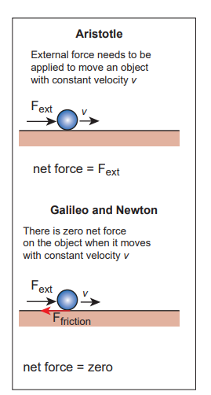

Figure 3.7 Aristotle, Galileo and Newton's approach 

#### 3.2.3 Newton's Third Law

Consider Figure 3.8(a) whenever an object 1 exerts a force on the object 2 \((\vec{F}_{21})\) then object 2 must also exert equal and opposite force on the object 1 \((\vec{F}_{12})\) . These forces must lie along the line joining the two objects.

\[\vec{F}_{12} = -\vec{F}_{21}\]

Newton's third law assures that the forces occur as equal and opposite pairs. An isolated force or a single force cannot exist in nature. Newton's third law states that for every action there is an equal and opposite reaction. Here, action and reaction pair of forces do not act on the same body but on two different bodies. Any one of the forces can be called as an action force and the other the reaction force. Newton's third law is valid in both inertial and non- inertial frames.

These action- reaction forces are not cause and effect forces. It means that when the object 1 exerts force on the object 2, the object 2 exerts equal and opposite force on the body 1 at the same instant.

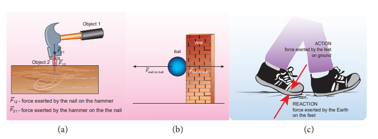

Figure 3.8 Demonstration of Newton's third law (a) Hammer and the nail (b) Ball bouncing off the wall (c) Walking on the floor with friction 

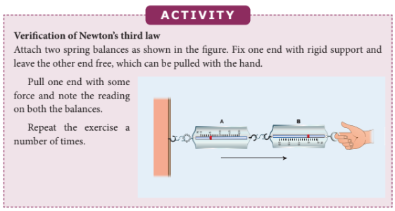

**Note**

The reading in the spring balance A is due to the force given by spring balance B. The reading in the spring balance B is due to the reaction force given by spring balance A. Note that according to Newton's third law, both readings (force) are equal.

### 3.2.4 Discussion on Newton's Laws

1. Newton's laws are vector laws. The equation \(\vec{F} = m\vec{a}\) is a vector equation and essentially it is equivalent to three scalar equations. In Cartesian coordinates, this equation can be written as \(F_{x}\hat{i} + F_{y}\hat{j} + F_{z}\hat{k} = ma_{x}\hat{i} + ma_{y}\hat{j} + ma_{z}\hat{k}.\) By comparing both sides, the three scalar equations are

\(F_{x} = ma_{x}\) The acceleration along the x direction depends only on the component of force acting along the x- direction.

\(F_{y} = ma_{y}\) The acceleration along the y direction depends only on the component of force acting along the y- direction.

\(F_{z} = ma_{z}\) The acceleration along the z direction depends only on the component of force acting along the z- direction.

From the above equations, we can infer that the force acting along y direction cannot alter the acceleration along x direction. In the same way, \(F_{z}\) cannot affect \(a_{y}\) and \(a_{x}\) . This understanding is essential for solving problems.

2. The acceleration experienced by the body at time t depends on the force which acts on the body at that instant of time. It does not depend on the force which acted on the body before the time t. This can be expressed as

3. In general, the direction of a force may be different from the direction of motion. Though in some cases, the object may move in the same direction as the direction of the force, it is not always true. A few examples are given below.

### Case 1: Force and motion in the same direction

When an apple falls towards the Earth, the direction of motion (direction of velocity) of the apple and that of force are in the same downward direction as shown in the Figure 3.9 (a).

Figure 3.9 (a) Force and motion in the same direction 

### Case 2: Force and motion not in the same direction

The Moon experiences a force towards the Earth. But it actually moves in elliptical orbit. In this case, the direction of the force is different from the direction of motion as shown in Figure 3.9 (b).

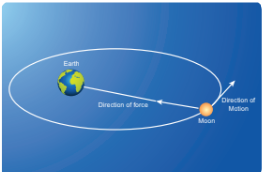

Figure 3.9 (b) Moon orbiting in elliptical orbit around the Earth 

### Case 3: Force and motion in opposite direction

If an object is thrown vertically upward, the direction of motion is upward, but gravitational force is downward as shown in the Figure 3.9 (c).
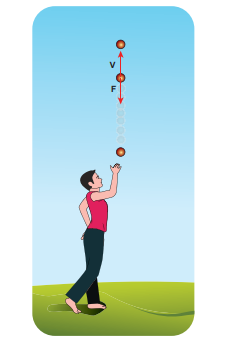

Figure 3.9 (c) Force and direction of motion are in opposite directions 

### Case 4: Zero net force, but there is motion

When a raindrop gets detached from the cloud it experiences both downward gravitational force and upward air drag force. As it descends towards the Earth, the upward air drag force increases and after a certain time, the upward air drag force cancels the downward gravity. From then on the raindrop moves at constant velocity till it touches the surface of the Earth. Hence the raindrop comes with zero net force, therefore with zero acceleration but with non- zero terminal velocity. It is shown in the Figure 3.9 (d).
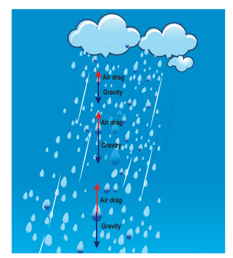

Figure 3.9 (d) Zero net force and non zero terminal velocity 

4. If multiple forces \(\vec{F}_1, \vec{F}_2, \vec{F}_3, \ldots , \vec{F}_n\) act on the same body, then the total force \((\vec{F}_{net})\) is equivalent to the vectorial sum of the individual forces. Their net force provides the acceleration.

\[\vec{F}_{net} = \vec{F}_1 + \vec{F}_2 + \vec{F}_3 + \ldots +\vec{F}_n\]

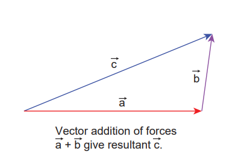

Figure 3.10 Vector addition of forces 

Newton's second law for this case is

\[\vec{F}_{net} = m\vec{a}\]

In this case the direction of acceleration is in the direction of net force.

## Example

Bow and arrow
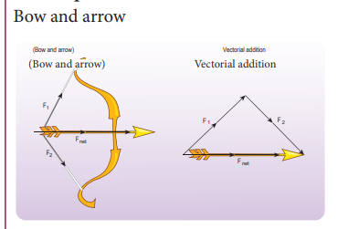

Figure 3.11 Bow and arrow - Net force is on the arrow 

5. Newton's second law can also be written in the following form.
Since the acceleration is the second derivative of position vector of the body \(\vec{a} = \frac{d^2\vec{r}}{dt^2}\) , the force on the body is

\[\vec{F} = m\frac{d^2\vec{r}}{dt^2}.\]

From this expression, we can infer that Newton's second law is basically a second order ordinary differential equation and whenever the second derivative of position vector is not zero, there must be a force acting on the body.

6. If no force acts on the body then Newton's second law, \(m\frac{d\vec{v}}{dt} = 0\) .

It implies that \(\vec{v} =\) constant. It is essentially Newton's first law. It implies that the second law is consistent with the first law. However, it should not be thought of as the reduction of second law to the first when no force acts on the object. Newton's first and second laws are independent laws. They can internally be consistent with each other but cannot be derived from each other.

7. Newton's second law is cause and effect relation. Force is the cause and acceleration is the effect. Conventionally, the effect should be written on the left and cause on the right hand side of the equation. So the correct way of writing Newton's second law is \(m\vec{a} = \vec{F}\) or \(\frac{d\vec{p}}{dt} = \vec{F}\)

### 3.3 APPLICATION OF NEWTON'S LAWS

### 3.3.1 Free Body Diagram

Free body diagram is a simple tool to analyse the motion of the object using Newton's laws.

The following systematic steps are followed for developing the free body diagram:

1. Identify the forces acting on the object.
2. Represent the object as a point.
3. Draw the vectors representing the forces acting on the object.

When we draw the free body diagram for an object or a system, the forces exerted by the object should not be included in the free body diagram.

## EXAMPLE 3.1

A book of mass m is at rest on the table. (1) What are the forces acting on the book? (2) What are the forces exerted by the book? (3) Draw the free body diagram for the book.

## Solution

(1) There are two forces acting on the book.

(i) Gravitational force (mg) acting downwards on the book

 (ii) Normal contact force (N) exerted by the surface of the table on the book. It acts upwards as shown in the figure.

**Note**
In the free body diagram, as the magnitudes of the normal force and the gravitational force are same, the lengths of both these vectors are also same.

(2) According to Newton's third law, there are two reaction forces exerted by the book.

(i) The book exerts an equal and opposite force (mg) on the Earth which acts upwards. 

(ii) The book exerts a force which is equal and opposite to normal force on the surface of the table (N) acting downwards.

**Note**
It is to be emphasized that while applying Newton's third law it is wrong to conclude that the book on the table is at rest due to the downward gravitational force exerted by the Earth and the equal and opposite reacting normal force exerted by the table on the book. Action and reaction forces never act on the same body.

(3) The free body diagram of the book is shown in the figure.

## EXAMPLE 3.2

If two objects of masses \(2.5\mathrm{kg}\) and \(100\mathrm{kg}\) experience the same force \(5\mathrm{N}\) , what is the acceleration experienced by each of them?

## Solution

From Newton's second law (in magnitude form), \(\mathrm{F} = \mathrm{ma}\)

For the object of mass \(2.5\mathrm{kg}\) , the acceleration is \(a = \frac{F}{m} = \frac{5}{2.5} = 2 \, \text{m} \, \text{s}^{-2}\) For the object of mass \(100\mathrm{kg}\) , the acceleration is \(a = \frac{F}{m} = \frac{5}{100} = 0.05 \, \text{m} \, \text{s}^{-2}\)

**Note**
Even though the force applied on both the objects is the same, acceleration experienced by each object differs. The acceleration is inversely proportional to mass. For the same force, the heavier mass experiences lesser acceleration and the lighter mass experiences greater acceleration.

When an apple falls, it experiences Earth's gravitational force. According to Newton's third law, the apple exerts equal and opposite force on the Earth. Even though both the apple and Earth experience the same force, their acceleration is different. The mass of Earth is enormous compared to that of an apple. So an apple experiences larger acceleration and the Earth experiences almost negligible acceleration. Due to the negligible acceleration, Earth appears to be stationary when an apple falls.

## EXAMPLE 3.3

Which is the greatest force among the three force \(\vec{F}_1,\vec{F}_2,\vec{F}_3\) shown below

## Solution

Force is a vector and magnitude of the vector is represented by the length of the vector. Here \(\vec{F}_1\) has greater length compared to other two. So \(\vec{F}_1\) is largest of the three.

## EXAMPLE 3.4

Apply Newton’s second law to a mango hanging from a tree. (Mass of the mango is \(400\mathrm{gm}\))

## Solution

Note: Before applying Newton’s laws, the following steps have to be followed:

1) Choose a suitable inertial coordinate system to analyse the problem. For most of the cases we can take Earth as an inertial coordinate system.
2) Identify the system to which Newton's laws need to be applied. The system can be a single object or more than one object.
3) Draw the free body diagram.
4) Once the forces acting on the system are identified, and the free body diagram is drawn, apply Newton's second law. In the left hand side of the equation, write the forces acting on the system in vector notation and equate it to the right hand side of the equation which is the product of mass and acceleration. Here, acceleration should also be in vector notation.
5) If acceleration is given, the force can be calculated. If the force is given, acceleration can be calculated.

By following the above steps:

We fix the inertial coordinate system on the ground as shown in the figure.

The forces acting on the mango are

i) Gravitational force exerted by the Earth on the mango acting downward along negative y axis ii) Tension (in the cord attached to the mango) acts upward along positive y axis.

The free body diagram for the mango is shown in the figure

\[\vec{F}_{g} = mg(-\hat{j}) = -mg\hat{j}\]

Here, mg is the magnitude of the gravitational force and \((-\hat{j})\) represents the unit vector in negative y direction

\[\vec{T} = T\hat{j}\]

Here T is the magnitude of the tension force and \((\hat{j})\) represents the unit vector in positive y direction

\[\vec{F}_{net} = \vec{F}_g + \vec{T} = -mg\hat{j} + T\hat{j} = (T - mg)\hat{j}\]

From Newton's second law \(\vec{F}_{net} = m\vec{a}\)

Since the mango is at rest with respect to us (inertial coordinate system) the acceleration is zero \((\vec{a} = 0)\) .

\[\mathrm{So} \ \vec{F}_{net} = m\vec{a} = 0\]

\[(T - mg)\hat{j} = 0\]

By comparing the components on both sides of the above equation, we get \(T - mg = 0\)

So the tension force acting on the mango is given by \(T = mg\)

Mass of the mango \(m = 400g = 0.4kg\) and \(g = 9.8 \, \text{m} \, \text{s}^{-2}\)

Tension acting on the mango is \(T = 0.4 \times 9.8 = 3.92 \, \text{N}\)

## EXAMPLE 3.5

A person rides a bike with a constant velocity \(\vec{v}\) with respect to ground and another biker accelerates with acceleration \(\vec{a}\) with respect to ground. Who can apply Newton's second law with respect to a stationary observer on the ground?

## Solution

Second biker cannot apply Newton's second law, because he is moving with acceleration \(\vec{a}\) with respect to Earth (he is not in inertial frame). But the first biker can apply Newton's second law because he is moving at constant velocity with respect to Earth (he is in inertial frame).

## EXAMPLE 3.6

The position vector of a particle is given by \(\vec{r} = 3t\hat{i} + 5t^{2}\hat{j} + 7\hat{k}\) . Find the direction in which the particle experiences net force?

## Solution

Velocity of the particle,

\[\vec{v} = \frac{d\vec{r}}{dt} = \frac{d}{dt}(3t)\hat{i} + \frac{d}{dt}(5t^{2})\hat{j} + \frac{d}{dt}(7)\hat{k}\]

\[\frac{d\vec{r}}{dt} = 3\hat{i} + 10t\hat{j}\]

Acceleration of the particle

\[\vec{a} = \frac{d\vec{v}}{dt} = \frac{d^{2}\vec{r}}{dt^{2}} = 10\hat{j}\]

Here, the particle has acceleration only along positive y direction. According to Newton's second law, net force must also act along positive y direction. In addition, the particle has constant velocity in positive x direction and no velocity in z direction. Hence, there are no net force along x or z direction.

## EXAMPLE 3.7

Consider a bob attached to a string, hanging from a stand. It oscillates as shown in the figure.

a) Identify the forces that act on the bob?

b) What is the acceleration experienced by the bob?

## Solution

Two forces act on the bob.

(i) Gravitational force (mg) acting downwards 

(ii) Tension (T) exerted by the string on the bob, whose position determines the direction of T as shown in figure.

The bob is moving in a circular arc as shown in the above figure. Hence it has centripetal acceleration. At a point A and C, the bob comes to rest momentarily and then its velocity increases when it moves towards point B. Hence, there is a tangential acceleration along the arc. The gravitational force can be resolved into two components (mg cosθ, mg sinθ) as shown below

**Note**
Note that the bob does not move in the direction of the resultant force. At the points A and C, tension \(\mathrm{T} = \mathrm{mg}\) cosθ. At all other points, tension T is greater than mg cosθ, since it has non zero centripetal acceleration. At point B, the resultant force acts upward along the string. It is an example of a non uniform circular motion because the bob has both the centripetal and tangential accelerations.

## EXAMPLE 3.8

The velocity of a particle moving in a plane is given by the following diagram. Find out the direction of force acting on the particle?

## Solution

The velocity of the particle is \(\vec{v} = \nu_{x}\hat{i} + \nu_{y}\hat{j} + \nu_{z}\hat{k}\) . As shown in the figure, the particle is moving in the xy plane, there is no motion in the z direction. So velocity in the z direction is zero \((\nu_{z} = 0)\) . The velocity of the particle has x component \((\nu_{x})\) and y component \((\nu_{y})\) . From figure, as time increases from \(t = 0\) sec to \(t = 3\) sec, the length of the vector in y direction is changing (increasing). It means y component of velocity \((\nu_{y})\) is increasing with respect to time. According to Newton's second law, if velocity changes with respect to time then there must be acceleration. In this case, the particle has acceleration in the y direction since the y component of velocity changes. So the particle experiences force in the y direction. The length of the vector in x direction does not change. It means that the particle has constant velocity in the x direction. So no force or zero net force acts in the x direction.

## EXAMPLE 3.9

Apply Newton's second law for an object at rest on Earth and analyse the result.

## Solution

The object is at rest with respect to Earth (inertial coordinate system). There are two forces that act on the object.

1) Gravity acting downward (negative y-direction) 

ii) Normal force by the surface of the Earth acting upward (positive y-direction)

 The free body diagram for this object is

\[\vec{F}_{g} = -mg\hat{j}\] \[\vec{N} = N\hat{j}\]

Net force \(\vec{F}_{net} = -mg\hat{j} + N\hat{j}\)

But there is no acceleration on the object. So \(\vec{a} = 0\) . By applying Newton's second law \((\vec{F}_{net} = m\vec{a})\)

\[\mathrm{Since} \ \vec{a} = 0, \ \vec{F}_{net} = -mg\hat{j} + N\hat{j} = 0\]

\[(-mg + N)\hat{j} = 0\]

By comparing the components on both sides of the equation, we get

\[-mg + N = 0 \quad \text{or} \quad N = mg\]

We can conclude that if the object is at rest, the magnitude of normal force is exactly equal to the magnitude of gravity.

## EXAMPLE 3.10

A particle of mass \(2\mathrm{kg}\) experiences two forces, \(\vec{F}_{1} = 5\hat{i} + 8\hat{j} + 7\hat{k}\) and \(\vec{F}_{2} = 3\hat{i} - 4\hat{j} + 3\hat{k}\) . What is the acceleration of the particle?

## Solution

We use Newton's second law, \(\vec{F}_{net} = m\vec{a}\) where \(\vec{F}_{net} = \vec{F}_1 + \vec{F}_2\) . From the above equations the acceleration is \(\vec{a} = \frac{\vec{F}_{net}}{m}\) , where

\[\vec{F}_{net} = (5 + 3)\hat{i} + (8 - 4)\hat{j} + (7 + 3)\hat{k}\] \[\vec{F}_{net} = 8\hat{i} + 4\hat{j} + 10\hat{k}\] \[\vec{a} = \left(\frac{8}{2}\right)\hat{i} + \left(\frac{4}{2}\right)\hat{j} + \left(\frac{10}{2}\right)\hat{k}\] \[\vec{a} = 4\hat{i} + 2\hat{j} + 5\hat{k}\]

## EXAMPLE 3.11

Identify the forces acting on blocks A, B and C shown in the figure.

## Solution

## Forces on block A:

(i) Downward gravitational force exerted by the Earth \((m_{A}g)\) 

(ii) Upward normal force exerted by block B \((N_{B})\)

The free body diagram for block A is as shown in the following picture.

## Forces on block B:

(i) Downward gravitational force exerted by Earth \((m_{B}g)\)

 (ii) Downward force exerted by block A \((N_{A})\) 
 
 (iii) Upward normal force exerted by block C \((N_{C})\)

## Forces on block C:

(i) Downward gravitational force exerted by Earth \((m_{C}g)\) 

(ii) Downward force exerted by block B \((N_{B})\)

 (iii) Upward force exerted by the table \((N_{\mathrm{table}})\)

## EXAMPLE 3.12

Consider a horse attached to the cart which is initially at rest. If the horse starts walking forward, the cart also accelerates in the forward direction. If the horse pulls the cart with force \(F_{h}\) in forward direction, then according to Newton's third law, the cart also pulls the horse by equivalent opposite force \(F_{c} = F_{h}\) in backward direction. Then total force on 'cart+horse' is zero. Why is it then the 'cart+horse' accelerates and moves forward?

## Solution

This paradox arises due to wrong application of Newton's second and third laws. Before applying Newton's laws, we should decide 'what is the system?'. Once we identify the 'system', then it is possible to identify all the forces acting on the system. We should not consider the force exerted by the system. If there is an unbalanced force acting on the system, then it should have acceleration in the direction of the resultant force. By following these steps we will analyse the horse and cart motion.

If we decide on the cart+horse as a 'system', then we should not consider the force exerted by the horse on the cart or the force exerted by cart on the horse. Both are internal forces acting on each other. According to Newton's third law, total internal force acting on the system is zero and it cannot accelerate the system. The acceleration of the system is caused by some external force. In this case, the force exerted by the road on the system is the external force acting on the system. It is wrong to conclude that the total force acting on the system (cart+horse) is zero without including all the forces acting on the system. The road is pushing the horse and cart forward with acceleration. As there is an external force acting on the system, Newton's second law has to be applied and not Newton's third law.

The following figures illustrates this.

If we consider the horse as the system, then there are three forces acting on the horse.

(i) Downward gravitational force \((m_{h}g)\) 

(ii) Force exerted by the road \((F_{r})\) 

(iii) Backward force exerted by the cart \((F_{c})\)

It is shown in the following figure.

\(\mathbf{F}_{r}\) - Force exerted by the road on the horse 

\(\mathbf{F}_{c}\) - Force exerted by the cart on the horse 

\(\mathbf{F}_{r}^{\perp}\) - Perpendicular component of \(\mathbf{F}_{r} = \mathbf{N}\) 

\(\mathbf{F}_{r}^{\parallel}\) - Parallel component of \(\mathbf{F}_{r}\) which is reason for forward movement

The force exerted by the road can be resolved into parallel and perpendicular components. The perpendicular component balances the downward gravitational force. There is parallel component along the forward direction. It is greater than the backward force \((F_{c})\) . So there is net force along the forward direction which causes the forward movement of the horse.

If we take the cart as the system, then there are three forces acting on the cart.

(i) Downward gravitational force \((m_{c}g)\) 

(ii) Force exerted by the road \((F_{r}')\) 

(iii) Force exerted by the horse \((F_{h})\)

It is shown in the figure

Force on the cart 

The force exerted by the road \((\overline{F_{r}^{\prime}})\) can be resolved into parallel and perpendicular components. The perpendicular component cancels the downward gravity \((m_{c}g)\) . Parallel component acts backwards and the force exerted by the horse \((\overline{F_{h}})\) acts forward. Force \((\overline{F_{h}})\) is greater than the parallel component acting in the opposite direction. So there is an overall unbalanced force in the forward direction which causes the cart to accelerate forward.

If we take the cart+horse as a system, then there are two forces acting on the system.

(i) Downward gravitational force \((m_{h} + m_{c})g\) 

(ii) The force exerted by the road \((F_{r})\) on the system.

It is shown in the following figure.

(iii) In this case the force exerted by the road \((F_{r})\) on the system (cart+horse) is resolved into parallel and perpendicular components. The perpendicular component is the normal force which cancels the downward gravitational force \((m_{h} + m_{c})g\) . The parallel component of the force is not balanced, hence the system (cart+horse) accelerates and moves forward due to this force.

## EXAMPLE 3.13

The position of the particle is represented by \(y = ut - \frac{1}{2} gt^{2}\) .

a) What is the force acting on the particle?

b) What is the momentum of the particle?

## Solution

To find the force, we need to find the acceleration experienced by the particle.

The acceleration is given by \(a = \frac{d^{2}y}{dt^{2}}\)

\[a = \frac{dv}{dt}\]

Here

\(v =\) velocity of the particle in y direction

\[v = \frac{dy}{dt} = u - gt\]

The momentum of the particle \(= mv = m(u - gt)\).

\[a = \frac{dv}{dt} = -g\]

The force acting on the object is given by \(F = ma = -mg\)

The negative sign implies that the force is acting on the negative y direction. This is exactly the force that acts on the object in projectile motion.

# 3.3.2 Particle Moving in an Inclined Plane

When an object of mass m slides on a frictionless surface inclined at an angle \(\theta\) as shown in the Figure 3.12, the forces acting on it decides the

a) acceleration of the object

b) speed of the object when it reaches the bottom

The force acting on the object is

(i) Downward gravitational force (mg)

(ii) Normal force perpendicular to inclined surface (N)

Figure 3.12 Object moving in an inclined plane 

To draw the free body diagram, the block is assumed to be a point mass (Figure 3.13 (a)). Since the motion is on the inclined surface, we have to choose the coordinate system parallel to the inclined surface as shown in Figure 3.13 (b).

The gravitational force mg is resolved into parallel component mg sin \(\theta\) along the inclined plane and perpendicular component mg cos \(\theta\) perpendicular to the inclined surface (Figure 3.13 (b)).

Note that the angle made by the gravitational force (mg) with the perpendicular to the surface is equal to the angle of inclination \(\theta\) as shown in Figure 3.13 (c).

There is no motion (acceleration) along the y axis. Applying Newton's second law in the y direction

\[-mg\cos \theta \hat{j} + N\hat{j} = 0 \ (\text{No acceleration})\]

By comparing the components on both sides, \(N - mg\cos \theta = 0\)

\[N = mg\cos \theta\]

The magnitude of normal force (N) exerted by the surface is equivalent to mg cos \(\theta\) .

The object slides (with an acceleration) along the x direction. Applying Newton's second law in the x direction

\[mg\sin \theta \hat{i} = ma\hat{i}\]

By comparing the components on both sides, we can equate

\[mg\sin \theta = ma\]

The acceleration of the sliding object is

\[a = g \sin \theta\]

Figure 3.13 (a) Free body diagram, (b) mg resolved into parallel and perpendicular components (c) The angle \(\theta_{2}\) is equal to \(\theta\) 

Note that the acceleration depends on the angle of inclination \(\theta\) . If the angle \(\theta\) is 90 degree, the block will move vertically with acceleration \(a = g\) .

Newton's kinematic equation is used to find the speed of the object when it reaches the bottom. The acceleration is constant throughout the motion.

\[v^{2} = u^{2} + 2as \text{ along the x direction} \quad (3.3)\]

The acceleration is a equal to \(g\) sin \(\theta\) . The initial speed (u) is equal to zero as it starts from rest. Here s is the length of the inclined surface.

The speed (v) when it reaches the bottom is (using equation (3.3))

\[v = \sqrt{2sg\sin\theta} \quad (3.4)\]

### 3.3.3 Two Bodies in Contact on a Horizontal Surface

Consider two blocks of masses \(m_{1}\) and \(m_{2}\) (\(m_{1} > m_{2}\)) kept in contact with each other on a smooth, horizontal frictionless surface as shown in Figure 3.14.

Figure 3.14 (a) Two blocks of masses \(m_{1}\) and \(m_{2}\) (\(m_{1} > m_{2}\)) kept in contact with each other on a smooth, horizontal frictionless surface 

By the application of a horizontal force F, both the blocks are set into motion with acceleration a simultaneously in the direction of the force F.

To find the acceleration \(\vec{a}\) , Newton's second law has to be applied to the system (combined mass \(m = m_{1} + m_{2}\))

\[\vec{F} = m\vec{a}\]

If we choose the motion of the two masses along the positive x direction,

\[F\hat{i} = ma\hat{i}\]

By comparing components on both sides of the above equation

\[F = ma \quad \text{where} \ m = m_{1} + m_{2}\]

The acceleration of the system is given by

\[\therefore a = \frac{F}{m_{1} + m_{2}} \quad (3.5)\]

The force exerted by the block \(m_{1}\) on \(m_{2}\) due to its motion is called force of contact \((\vec{f}_{21})\) . According to Newton's third law, the block \(m_{2}\) will exert an equivalent opposite reaction force \((\vec{f}_{12})\) on block \(m_{1}\) .

Figure 3.14 (b) shows the free body diagram of block \(m_{1}\) .

Figure 3.14 (b) Free body diagram of block of mass \(m_{1}\) 

\[\therefore F\hat{i} - f_{12}\hat{i} = m_{1}a\hat{i}\]

By comparing the components on both sides of the above equation, we get

\[\begin{array}{l}F - f_{12} = m_{1}a\\ f_{12} = F - m_{1}a \end{array} \quad (3.6)\]

Substituting the value of acceleration from equation (3.5) in (3.6) we get

\[f_{12} = F - m_{1}\left(\frac{F}{m_{1} + m_{2}}\right)\] \[f_{12} = F\left[1 - \frac{m_{1}}{m_{1} + m_{2}}\right]\] \[f_{12} = \frac{Fm_{2}}{m_{1} + m_{2}} \quad (3.7)\]

Equation (3.7) shows that the magnitude of contact force depends on mass \(m_{2}\) which provides the reaction force. Note that this force is acting along the negative x direction.

In vector notation, the reaction force on mass \(m_{1}\) is given by \(\vec{f}_{12} = -\frac{Fm_{2}}{m_{1} + m_{2}}\hat{i}\)

For mass \(m_{2}\) there is only one force acting on it in the x direction and it is denoted by \(\vec{f}_{21}\) . This force is exerted by mass \(m_{1}\) . The free body diagram for mass \(m_{2}\) is shown in Figure 3.14 (c).

Figure 3.14 (c) Free body diagram of block of mass \(m_{2}\) 

Applying Newton's second law for mass \(m_{2}\) \(f_{21}\hat{i} = m_{2}a\hat{i}\)

By comparing the components on both sides of the above equation

\[f_{21} = m_{2}a \quad (3.8)\]

Substituting for acceleration from equation (3.5) in equation (3.8), we get \(f_{21} = \frac{Fm_{2}}{m_{1} + m_{2}}\)

In this case the magnitude of the contact force is

\[f_{21} = \frac{Fm_{2}}{m_{1} + m_{2}}\] The direction of this force is along the positive x direction.

In vector notation, the force acting on mass \(m_{2}\) exerted by mass \(m_{1}\) is \(\vec{f}_{21} = \frac{Fm_{2}}{m_{1} + m_{2}}\hat{i}\).

Note \(\vec{f}_{12} = -\vec{f}_{21}\) which confirms Newton's third law.

#### 3.3.4 Motion of Connected Bodies

When objects are connected by strings and a force F is applied either vertically or horizontally or along an inclined plane, it produces a tension T in the string, which affects the acceleration to an extent. Let us discuss various cases for the same.

**Case 1: Vertical motion**

Consider two blocks of masses \(m_{1}\) and \(m_{2}\) (\(m_{1} > m_{2}\)) connected by a light and inextensible string that passes over a pulley as shown in Figure 3.15.

Figure 3.15 Two blocks connected by a string over a pulley 

Let the tension in the string be \(T\) and acceleration \(a\) . When the system is released, both the blocks start moving, \(m_{2}\) vertically upward and \(m_{1}\) downward with same acceleration a. The gravitational force \(m_{1}g\) on mass \(m_{1}\) is used in lifting the mass \(m_{2}\) .

The upward direction is chosen as y direction. The free body diagrams of both masses are shown in Figure 3.16.

Figure 3.16 Free body diagrams of masses \(m_{1}\) and \(m_{2}\) 

Applying Newton's second law for mass \(m_{2}\)

\[T\hat{j} - m_{2}g\hat{j} = m_{2}a\hat{j}\]

The left hand side of the above equation is the total force that acts on \(m_{2}\) and the right hand side is the product of mass and acceleration of \(m_{2}\) in y direction.

By comparing the components on both sides, we get

\[T - m_{2}g = m_{2}a \quad (3.9)\]

Similarly, applying Newton's second law for mass \(m_{1}\)

\[T\hat{j} - m_{1}g\hat{j} = -m_{1}a\hat{j}\]

As mass \(m_{1}\) moves downward \((- \hat{j})\) , its acceleration is along \((- \hat{j})\)

By comparing the components on both sides, we get

\[\begin{array}{c}T - m_{1}g = -m_{1}a\\ m_{1}g - T = m_{1}a \end{array} \quad (3.10)\]

Adding equations (3.9) and (3.10), we get

\[\begin{array}{c}m_{1}g - m_{2}g = m_{1}a + m_{2}a\\ (m_{1} - m_{2})g = (m_{1} + m_{2})a \end{array} \quad (3.11)\]

From equation (3.11), the acceleration of both the masses is

\[a = \left(\frac{m_{1} - m_{2}}{m_{1} + m_{2}}\right)g \quad (3.12)\]

If both the masses are equal \((m_{1} = m_{2})\) , from equation (3.12)

\[a = 0\]

This shows that if the masses are equal, there is no acceleration and the system as a whole will be at rest.

To find the tension acting on the string, substitute the acceleration from the equation (3.12) into the equation (3.9).

\[\begin{array}{c}T - m_{2}g = m_{2}\left(\frac{m_{1} - m_{2}}{m_{1} + m_{2}}\right)g\\ T = m_{2}g + m_{2}\left(\frac{m_{1} - m_{2}}{m_{1} + m_{2}}\right)g \end{array} \quad (3.13)\]

By taking \(m_{2}g\) common in the RHS of equation (3.13)

\[T = m_{2}g\left(1 + \frac{m_{1} - m_{2}}{m_{1} + m_{2}}\right)\] \[T = m_{2}g\left(\frac{m_{1} + m_{2} + m_{1} - m_{2}}{m_{1} + m_{2}}\right)\] \[T = \left(\frac{2m_{1}m_{2}}{m_{1} + m_{2}}\right)g\]

Equation (3.12) gives only magnitude of acceleration.

For mass \(m_{1}\) , the acceleration vector is given by \(\vec{a} = -\left(\frac{m_{1} - m_{2}}{m_{1} + m_{2}}\right)g\hat{j}\)

For mass \(m_{2}\) , the acceleration vector is given by \(\vec{a} = \left(\frac{m_{1} - m_{2}}{m_{1} + m_{2}}\right)g\hat{j}\)

**Case 2: Horizontal motion**

In this case, mass \(m_{2}\) is kept on a horizontal table and mass \(m_{1}\) is hanging through a small pulley as shown in Figure 3.17. Assume that there is no friction on the surface.

Figure 3.17 Blocks in horizontal motion 

As both the blocks are connected to the unstretchable string, if \(m_{1}\) moves with an acceleration \(a\) downward then \(m_{2}\) also moves with the same acceleration \(a\) horizontally.

The forces acting on mass \(m_{2}\) are

(i) Downward gravitational force \((m_{2}g)\) 

(ii) Upward normal force (N) exerted by the surface

 (iii) Horizontal tension (T) exerted by the string

The forces acting on mass \(m_{1}\) are

(i) Downward gravitational force \((m_{1}g)\) 

(ii) Tension (T) acting upwards

The free body diagrams for both the masses is shown in Figure 3.18.

Figure 3.18 Free body diagrams of masses \(m_{1}\) and \(m_{2}\) 

Applying Newton's second law for \(m_{1}\)

\[T\hat{j} - m_{1}g\hat{j} = -m_{1}a\hat{j} \ (\text{along y direction})\]

By comparing the components on both sides of the above equation,

\[T - m_{1}g = -m_{1}a \quad (3.14)\]

Applying Newton's second law for \(m_{2}\)

\[T\hat{i} = m_{2}a\hat{i} \ (\text{along x direction})\]

By comparing the components on both sides of above equation,

\[T = m_{2}a \quad (3.15)\]

There is no acceleration along y direction for \(m_{2}\)

\[N\hat{j} - m_{2}g\hat{j} = 0\]

By comparing the components on both sides of the above equation

\[\begin{array}{r}N - m_{2}g = 0\\ N = m_{2}g \end{array} \quad (3.16)\]

By substituting equation (3.15) in equation (3.14), we can find the tension T

\[\begin{array}{l}m_{2}a - m_{1}g = -m_{1}a\\ m_{2}a + m_{1}a = m_{1}g\\ a = \frac{m_{1}}{m_{1} + m_{2}} g \end{array} \quad (3.17)\]

Tension in the string can be obtained by substituting equation (3.17) in equation (3.15)

\[T = \frac{m_{1}m_{2}}{m_{1} + m_{2}} g \quad (3.18)\]

Comparing motion in both cases, it is clear that the tension in the string for horizontal motion is half of the tension for vertical motion for same set of masses and strings.

This result has an important application in industries. The ropes used in conveyor belts (horizontal motion) work for longer duration than those of cranes and lifts (vertical motion).

#### 3.3.5 Concurrent Forces and Lami's Theorem

A collection of forces is said to be concurrent, if the lines of forces act at a common point. Figure 3.19 illustrates concurrent forces.

Concurrent forces need not be in the same plane. If they are in the same plane, they are concurrent as well as coplanar forces.

Figure 3.19 Concurrent forces 

### 3.4 LAMI'S THEOREM

If a system of three concurrent and coplanar forces is in equilibrium, then Lami's theorem states that the magnitude of each force of the system is proportional to sine of the angle between the other two forces. The constant of proportionality is same for all three forces.

Let us consider three coplanar and concurrent forces \(\vec{F}_1,\vec{F}_2\) and \(\vec{F}_3\) which act at a common point O as shown in Figure 3.20. If the point is at equilibrium, then according to Lami's theorem

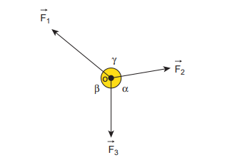

Figure 3.20 Three coplanar and concurrent forces \(\vec{F}_1,\vec{F}_2\) and \(\vec{F}_3\) acting at O 

\[|\vec{F}_1| \propto \sin \alpha\] \[|\vec{F}_2| \propto \sin \beta\] \[|\vec{F}_3| \propto \sin \gamma\]

Therefore, \(\frac{|\vec{F}_1|}{\sin\alpha} = \frac{|\vec{F}_2|}{\sin\beta} = \frac{|\vec{F}_3|}{\sin\gamma}\) (3.19)

Lami's theorem is useful to analyse the forces acting on objects which are in static equilibrium.

## Application of Lami's Theorem

## EXAMPLE 3.14

A baby is playing in a swing which is hanging with the help of two identical chains is at rest. Identify the forces acting on the baby. Apply Lami's theorem and find out the tension acting on the chain.

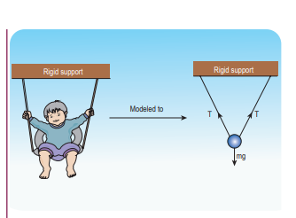

## Solution

The baby and the chains are modeled as a particle hung by two strings as shown in the figure. There are three forces acting on the baby.

i) Downward gravitational force along negative y direction \((mg)\)

 ii) Tension (T) along the two strings

These three forces are coplanar as well as concurrent as shown in the following figure.

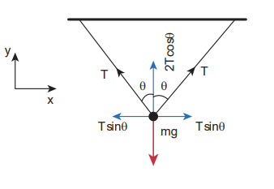

By using Lami's theorem

\[\frac{T}{\sin(180 - \theta)} = \frac{T}{\sin(180 - \theta)} = \frac{mg}{\sin(2\theta)}\]

Since \(\sin (180 - \theta) = \sin \theta\) and \(\sin (2\theta) = 2\sin \theta \cos \theta\)

We get \(\frac{T}{\sin\theta} = \frac{mg}{2\sin\theta\cos\theta}\)

From this, the tension on each string is
\[T = \frac{mg}{2\cos\theta}\]

**Note**

When  \[\theta = 0^\circ\], the strings are vertical and the tension on each string is \[T = \frac{mg}{2}\]

### 3.5 LAW OF CONSERVATION OF TOTAL LINEAR MOMENTUM

In nature, conservation laws play a very important role. The dynamics of motion of bodies can be analysed very effectively using conservation laws. There are three conservation laws in mechanics. Conservation of total energy, conservation of total linear momentum, and conservation of angular momentum. By combining Newton's second and third laws, we can derive the law of conservation of total linear momentum.

When two particles interact with each other, they exert equal and opposite forces on each other. The particle 1 exerts force \(\vec{F}_{21}\) on particle 2 and particle 2 exerts an exactly equal and opposite force \(\vec{F}_{12}\) on particle 1, according to Newton's third law.

\[\vec{F}_{21} = -\vec{F}_{12} \quad (3.20)\]

In terms of momentum of particles, the force on each particle (Newton's second law) can be written as

\[\vec{F}_{12} = \frac{d\vec{p}_1}{dt} \quad \text{and} \quad \vec{F}_{21} = \frac{d\vec{p}_2}{dt}. \quad (3.21)\]

Here \(\vec{p}_{1}\) is the momentum of particle 1 which changes due to the force \(\vec{F}_{12}\) exerted by particle 2. Further \(\vec{p}_{2}\) is the momentum of particle 2. This changes due to \(\vec{F}_{21}\) exerted by particle 1.

Substitute equation (3.21) in equation (3.20)

\[\frac{d\vec{p}_1}{dt} = -\frac{d\vec{p}_2}{dt}\quad (3.21)\]

\[\frac{d\vec{p}_1}{dt} + \frac{d\vec{p}_2}{dt} = 0  \quad (3.22)\]

$$\frac{d}{dt}(\vec{p}_1 + \vec{p}_2) = 0 \quad $$

It implies that \(\vec{p}_{1} + \vec{p}_{2} =\) constant vector (always).

\(\vec{p}_{1} + \vec{p}_{2}\) is the total linear momentum of the two particles \((\vec{p}_{tot} = \vec{p}_{1} + \vec{p}_{2})\) . It is also called as total linear momentum of the system. Here, the two particles constitute the system. From this result, the law of conservation of linear momentum can be stated as follows.

If there are no external forces acting on the system, then the total linear momentum of the system \((\vec{p}_{tot})\) is always a constant vector. In other words, the total linear momentum of the system is conserved in time. Here the word 'conserve' means that \(\vec{p}_{1}\) and \(\vec{p}_{2}\) can vary, in such a way that \(\vec{p}_{1} + \vec{p}_{2}\) is a constant vector.

The forces \(\vec{F}_{12}\) and \(\vec{F}_{21}\) are called the internal forces of the system, because they act only between the two particles. There is no external force acting on the two particles from outside. In such a case the total linear momentum of the system is a constant vector or is conserved.

## EXAMPLE 3.15

Identify the internal and external forces acting on the following systems.

a) Earth alone as a system

b) Earth and Sun as a system

c) Our body as a system while walking

d) Our body + Earth as a system

## Solution

a) Earth alone as a system
Earth orbits the Sun due to gravitational attraction of the Sun. If we consider Earth as a system, then Sun's gravitational force is an external force. If we take the Moon into account, it also exerts an external force on Earth.

b) (Earth + Sun) as a system
In this case, there are two internal forces which form an action and reaction pair: the gravitational force exerted by the Sun on Earth and gravitational force exerted by the Earth on the Sun.

c) Our body as a system
While walking, we exert a force on the Earth and Earth exerts an equal and opposite force on our body. If our body alone is considered as a system, then the force exerted by the Earth on our body is external.

d) (Our body + Earth) as a system
In this case, there are two internal forces present in the system. One is the force exerted by our body on the Earth and the other is the equal and opposite force exerted by the Earth on our body.

Our body + Earth as a system

**Meaning of law of conservation of momentum**

1) The Law of conservation of linear momentum is a vector law. It implies that both the magnitude and direction of total linear momentum are constant. In some cases, this total momentum can also be zero.
2) To analyse the motion of a particle, we can either use Newton's second law or the law of conservation of linear momentum. Newton's second law requires us to specify the forces involved in the process. This is difficult to specify in real situations. But conservation of linear momentum does not require any force involved in the process. It is convenient and hence important.

For example, when two particles collide, the forces exerted by these two particles on each other is difficult to specify. But it is easier to apply conservation of linear momentum during the collision process.

## Examples

Consider the firing of a gun. Here the system is Gun+bullet. Initially the gun and bullet are at rest, hence the total linear momentum of the system is zero. Let \(\vec{p}_{1}\) be the momentum of the bullet and \(\vec{p}_{2}\) the momentum of the gun before firing. Since initially both are at rest,

\[\vec{p}_1 = 0,\ \vec{p}_2 = 0.\]

Total momentum before firing the gun is zero, \(\vec{p}_1 + \vec{p}_2 = 0\) .

According to the law of conservation of linear momentum, total linear momentum has to be zero after the firing also.

When the gun is fired, a force is exerted by the gun on the bullet in forward direction. Now the momentum of the bullet changes from \(\vec{p}_1\) to \(\vec{p}_1^{\prime}\) . To conserve the total linear momentum of the system, the momentum of the gun must also change from \(\vec{p}_2\) to \(\vec{p}_2^{\prime}\) . Due to the conservation of linear momentum, \(\vec{p}_1^{\prime} + \vec{p}_2^{\prime} = 0\) . It implies that \(\vec{p}_1^{\prime} = -\vec{p}_2^{\prime}\) , the momentum of the gun is exactly equal, but in the opposite direction to the momentum of the bullet. This is the reason after firing, the gun suddenly moves backward with the momentum \((-\vec{p}_1^{\prime})\) . It is called 'recoil momentum'. This is an example of conservation of total linear momentum.

Consider two particles. One is at rest and the other moves towards the first particle (which is at rest). They collide and after collision move in some arbitrary directions. In this case, before collision, the total linear momentum of the system is equal to the initial linear momentum of the moving particle. According to conservation of momentum, the total linear momentum after collision also has to be in the forward direction. The following figure explains this.

A more accurate calculation is covered in section 4.4. It is to be noted that the total momentum vector before and after collision points in the same direction. This simply means that the total linear momentum is constant before and after the collision. At the time of collision, each particle exerts a force on the other. As the two particles are considered as a system, these forces are only internal, and the total linear momentum cannot be altered by internal forces.

#### 3.5.1 Impulse

If a very large force acts on an object for a very short duration, then the force is called impulsive force or impulse.

If a force (F) acts on the object in a very short interval of time \((\Delta t)\) , from Newton's second law in magnitude form

\[F dt = dp\]

Integrating over time from an initial time \(t_i\) to a final time \(t_f\) , we get

\[\int_{t_i}^{t_f} dp = \int_{t_i}^{t_f} F dt\]

\[p_f - p_i = \int_{t_i}^{t_f} F dt\]

\(p_i =\) initial momentum of the object at time \(t_i\)

 \(p_f =\) final momentum of the object at time \(t_f\)

\(p_{f} - p_{i} = \Delta p =\) change in momentum of the object during the time interval \(t_{f} - t_{i} = \Delta t\) .

The integral \(\int_{t_i}^{t_f} F dt = J\) is called the impulse and it is equal to change in momentum of the object.

If the force is constant over the time interval, then

\[\int_{t_i}^{t_f} F dt = F \int_{t_i}^{t_f} dt = F (t_f - t_i) = F \Delta t\] \[F \Delta t = \Delta p\]

Equation (3.24) is called the 'impulse-momentum equation'.

For a constant force, the impulse is denoted as \(J = F \Delta t\) and it is also equal to change in momentum \((\Delta p)\) of the object over the time interval \(\Delta t\) .

Impulse is a vector quantity and its unit is Ns.

The average force acted on the object over the short interval of time is defined by

\[F_{\mathrm{avg}} = \frac{\Delta p}{\Delta t} \quad (3.25)\]

From equation (3.25), the average force that act on the object is greater if \(\Delta t\) is smaller. Whenever the momentum of the body changes very quickly, the average force becomes larger.

The impulse can also be written in terms of the average force. Since \(\Delta p\) is change in momentum of the object and is equal to impulse (J), we have

\[J = F_{\mathrm{avg}} \Delta t \quad (3.26)\]

The graphical representation of constant force impulse and variable force impulse is given in Figure 3.21.

Figure 3.21 Constant force impulse and variable force impulse 

## Illustration

1. When a cricket player catches the ball, he pulls his hands gradually in the direction of the ball's motion. Why?

If he stops his hands soon after catching the    ball, the ball comes to rest very quickly. It means that the momentum of the ball is brought to rest very quickly. So the average force acting on the body will be very large. Due to this large average force, the hands will get hurt. To avoid getting hurt, the player brings the ball to rest slowly.

2. When a car meets with an accident, its momentum reduces drastically in a very short time. This is very dangerous for the passengers inside the car since they will experience a large force. To prevent this fatal shock, cars are designed with air bags in such a way that when the car meets with an accident, the momentum of the passengers will reduce slowly so that the average force acting on them will be smaller.

3. The shock absorbers in two wheelers play the same role as airbags in the car. When there is a bump on the road, a sudden force is transferred to the vehicle. The shock absorber prolongs the period of transfer of force on to the body of the rider. Vehicles without shock absorbers will harm the body due to this reason.

4. Jumping on a concrete cemented floor is more dangerous than jumping on the sand. Sand brings the body to rest slowly than the concrete floor, so that the average force experienced by the body will be lesser.

Impulse

If an egg is thrown, can you catch the egg safely without breaking it? How?

## EXAMPLE 3.16

An object of mass \(10\mathrm{kg}\) moving with a speed of \(15 \, \text{m} \, \text{s}^{-1}\) hits the wall and comes to rest within

a) 0.03 second b) 10 second

Calculate the impulse and average force acting on the object in both the cases.

## Solution

Initial momentum of the object \(p_{i} = 10 \times 15 = 150 \, \text{kg} \, \text{m} \, \text{s}^{-1}\)

Final momentum of the object \(p_{f} = 0\)

\[\Delta p = 150 - 0 = 150 \, \text{kg} \, \text{m} \, \text{s}^{-1}\]

(a) Impulse \(J = \Delta p = 150 \, \text{N} \, \text{s}\).

(b) Impulse \(J = \Delta p = 150 \, \text{N} \, \text{s}\)

(a) Average force \(F_{avg} = \frac{\Delta p}{\Delta t} = \frac{150}{0.03} = 5000 \, \text{N}\)

(b) Average force \(F_{avg} = \frac{150}{10} = 15 \, \text{N}\)

We see that impulse is the same in both cases, but the average force is different.

### 3.5 LAW OF CONSERVATION OF TOTAL LINEAR MOMENTUM

In nature, conservation laws play a very important role. The dynamics of motion of bodies can be analysed very effectively using conservation laws. There are three conservation laws in mechanics. Conservation of total energy, conservation of total linear momentum, and conservation of angular momentum. By combining Newton's second and third laws, we can derive the law of conservation of total linear momentum.

When two particles interact with each other, they exert equal and opposite forces on each other. The particle 1 exerts force \(\vec{F}_{21}\) on particle 2 and particle 2 exerts an exactly equal and opposite force \(\vec{F}_{12}\) on particle 1, according to Newton's third law.

\[\vec{F}_{21} = -\vec{F}_{12} \quad (3.20)\]

In terms of momentum of particles, the force on each particle (Newton's second law) can be written as

\[\vec{F}_{12} = \frac{d\vec{p}_1}{dt} \quad \text{and} \quad \vec{F}_{21} = \frac{d\vec{p}_2}{dt}. \quad (3.21)\]

Here \(\vec{p}_{1}\) is the momentum of particle 1 which changes due to the force \(\vec{F}_{12}\) exerted by particle 2. Further \(\vec{p}_{2}\) is the momentum of particle 2. This changes due to \(\vec{F}_{21}\) exerted by particle 1.

Substitute equation (3.21) in equation (3.20)

\[\frac{d\vec{p}_1}{dt} = -\frac{d\vec{p}_2}{dt}\quad (3.21)\]

\[\frac{d\vec{p}_1}{dt} + \frac{d\vec{p}_2}{dt} = 0  \quad (3.22)\]

$$\frac{d}{dt}(\vec{p}_1 + \vec{p}_2) = 0 \quad $$

It implies that \(\vec{p}_{1} + \vec{p}_{2} =\) constant vector (always).

\(\vec{p}_{1} + \vec{p}_{2}\) is the total linear momentum of the two particles \((\vec{p}_{tot} = \vec{p}_{1} + \vec{p}_{2})\) . It is also called as total linear momentum of the system. Here, the two particles constitute the system. From this result, the law of conservation of linear momentum can be stated as follows.

If there are no external forces acting on the system, then the total linear momentum of the system \((\vec{p}_{tot})\) is always a constant vector. In other words, the total linear momentum of the system is conserved in time. Here the word 'conserve' means that \(\vec{p}_{1}\) and \(\vec{p}_{2}\) can vary, in such a way that \(\vec{p}_{1} + \vec{p}_{2}\) is a constant vector.

The forces \(\vec{F}_{12}\) and \(\vec{F}_{21}\) are called the internal forces of the system, because they act only between the two particles. There is no external force acting on the two particles from outside. In such a case the total linear momentum of the system is a constant vector or is conserved.

## EXAMPLE 3.15

Identify the internal and external forces acting on the following systems.

a) Earth alone as a system

b) Earth and Sun as a system

c) Our body as a system while walking

d) Our body + Earth as a system

## Solution

a) Earth alone as a system
Earth orbits the Sun due to gravitational attraction of the Sun. If we consider Earth as a system, then Sun's gravitational force is an external force. If we take the Moon into account, it also exerts an external force on Earth.

b) (Earth + Sun) as a system
In this case, there are two internal forces which form an action and reaction pair: the gravitational force exerted by the Sun on Earth and gravitational force exerted by the Earth on the Sun.

c) Our body as a system
While walking, we exert a force on the Earth and Earth exerts an equal and opposite force on our body. If our body alone is considered as a system, then the force exerted by the Earth on our body is external.

d) (Our body + Earth) as a system
In this case, there are two internal forces present in the system. One is the force exerted by our body on the Earth and the other is the equal and opposite force exerted by the Earth on our body.

Our body + Earth as a system

**Meaning of law of conservation of momentum**

1) The Law of conservation of linear momentum is a vector law. It implies that both the magnitude and direction of total linear momentum are constant. In some cases, this total momentum can also be zero.
2) To analyse the motion of a particle, we can either use Newton's second law or the law of conservation of linear momentum. Newton's second law requires us to specify the forces involved in the process. This is difficult to specify in real situations. But conservation of linear momentum does not require any force involved in the process. It is convenient and hence important.

For example, when two particles collide, the forces exerted by these two particles on each other is difficult to specify. But it is easier to apply conservation of linear momentum during the collision process.

## Examples

Consider the firing of a gun. Here the system is Gun+bullet. Initially the gun and bullet are at rest, hence the total linear momentum of the system is zero. Let \(\vec{p}_{1}\) be the momentum of the bullet and \(\vec{p}_{2}\) the momentum of the gun before firing. Since initially both are at rest,

\[\vec{p}_1 = 0,\ \vec{p}_2 = 0.\]

Total momentum before firing the gun is zero, \(\vec{p}_1 + \vec{p}_2 = 0\) .

According to the law of conservation of linear momentum, total linear momentum has to be zero after the firing also.

When the gun is fired, a force is exerted by the gun on the bullet in forward direction. Now the momentum of the bullet changes from \(\vec{p}_1\) to \(\vec{p}_1^{\prime}\) . To conserve the total linear momentum of the system, the momentum of the gun must also change from \(\vec{p}_2\) to \(\vec{p}_2^{\prime}\) . Due to the conservation of linear momentum, \(\vec{p}_1^{\prime} + \vec{p}_2^{\prime} = 0\) . It implies that \(\vec{p}_1^{\prime} = -\vec{p}_2^{\prime}\) , the momentum of the gun is exactly equal, but in the opposite direction to the momentum of the bullet. This is the reason after firing, the gun suddenly moves backward with the momentum \((-\vec{p}_1^{\prime})\) . It is called 'recoil momentum'. This is an example of conservation of total linear momentum.

Consider two particles. One is at rest and the other moves towards the first particle (which is at rest). They collide and after collision move in some arbitrary directions. In this case, before collision, the total linear momentum of the system is equal to the initial linear momentum of the moving particle. According to conservation of momentum, the total linear momentum after collision also has to be in the forward direction. The following figure explains this.

A more accurate calculation is covered in section 4.4. It is to be noted that the total momentum vector before and after collision points in the same direction. This simply means that the total linear momentum is constant before and after the collision. At the time of collision, each particle exerts a force on the other. As the two particles are considered as a system, these forces are only internal, and the total linear momentum cannot be altered by internal forces.

#### 3.5.1 Impulse

If a very large force acts on an object for a very short duration, then the force is called impulsive force or impulse.

If a force (F) acts on the object in a very short interval of time \((\Delta t)\) , from Newton's second law in magnitude form

\[F dt = dp\]

Integrating over time from an initial time \(t_i\) to a final time \(t_f\) , we get

\[\int_{t_i}^{t_f} dp = \int_{t_i}^{t_f} F dt\]

\[p_f - p_i = \int_{t_i}^{t_f} F dt\]

\(p_i =\) initial momentum of the object at time \(t_i\)

 \(p_f =\) final momentum of the object at time \(t_f\)

\(p_{f} - p_{i} = \Delta p =\) change in momentum of the object during the time interval \(t_{f} - t_{i} = \Delta t\) .

The integral \(\int_{t_i}^{t_f} F dt = J\) is called the impulse and it is equal to change in momentum of the object.

If the force is constant over the time interval, then

\[\int_{t_i}^{t_f} F dt = F \int_{t_i}^{t_f} dt = F (t_f - t_i) = F \Delta t\] \[F \Delta t = \Delta p\]

Equation (3.24) is called the 'impulse-momentum equation'.

For a constant force, the impulse is denoted as \(J = F \Delta t\) and it is also equal to change in momentum \((\Delta p)\) of the object over the time interval \(\Delta t\) .

Impulse is a vector quantity and its unit is Ns.

The average force acted on the object over the short interval of time is defined by

\[F_{\mathrm{avg}} = \frac{\Delta p}{\Delta t} \quad (3.25)\]

From equation (3.25), the average force that act on the object is greater if \(\Delta t\) is smaller. Whenever the momentum of the body changes very quickly, the average force becomes larger.

The impulse can also be written in terms of the average force. Since \(\Delta p\) is change in momentum of the object and is equal to impulse (J), we have

\[J = F_{\mathrm{avg}} \Delta t \quad (3.26)\]

The graphical representation of constant force impulse and variable force impulse is given in Figure 3.21.

Figure 3.21 Constant force impulse and variable force impulse 

## Illustration

1. When a cricket player catches the ball, he pulls his hands gradually in the direction of the ball's motion. Why?

If he stops his hands soon after catching the    ball, the ball comes to rest very quickly. It means that the momentum of the ball is brought to rest very quickly. So the average force acting on the body will be very large. Due to this large average force, the hands will get hurt. To avoid getting hurt, the player brings the ball to rest slowly.

2. When a car meets with an accident, its momentum reduces drastically in a very short time. This is very dangerous for the passengers inside the car since they will experience a large force. To prevent this fatal shock, cars are designed with air bags in such a way that when the car meets with an accident, the momentum of the passengers will reduce slowly so that the average force acting on them will be smaller.

3. The shock absorbers in two wheelers play the same role as airbags in the car. When there is a bump on the road, a sudden force is transferred to the vehicle. The shock absorber prolongs the period of transfer of force on to the body of the rider. Vehicles without shock absorbers will harm the body due to this reason.

4. Jumping on a concrete cemented floor is more dangerous than jumping on the sand. Sand brings the body to rest slowly than the concrete floor, so that the average force experienced by the body will be lesser.

Impulse

If an egg is thrown, can you catch the egg safely without breaking it? How?

## EXAMPLE 3.16

An object of mass \(10\mathrm{kg}\) moving with a speed of \(15 \, \text{m} \, \text{s}^{-1}\) hits the wall and comes to rest within

a) 0.03 second b) 10 second

Calculate the impulse and average force acting on the object in both the cases.

## Solution

Initial momentum of the object \(p_{i} = 10 \times 15 = 150 \, \text{kg} \, \text{m} \, \text{s}^{-1}\)

Final momentum of the object \(p_{f} = 0\)

\[\Delta p = 150 - 0 = 150 \, \text{kg} \, \text{m} \, \text{s}^{-1}\]

(a) Impulse \(J = \Delta p = 150 \, \text{N} \, \text{s}\).

(b) Impulse \(J = \Delta p = 150 \, \text{N} \, \text{s}\)

(a) Average force \(F_{avg} = \frac{\Delta p}{\Delta t} = \frac{150}{0.03} = 5000 \, \text{N}\)

(b) Average force \(F_{avg} = \frac{150}{10} = 15 \, \text{N}\)

We see that impulse is the same in both cases, but the average force is different.

### 3.7 DYNAMICS OF CIRCULAR MOTION

In the previous sections we have studied how to analyse linear motion using Newton's laws. It is also important to know how to apply Newton's laws to circular motion, since circular motion is one of the very common types of motion that we come across in our daily life. A particle can be in linear motion with or without any external force. But when circular motion occurs there must necessarily be some force acting on the object. There is no Newton's first law for circular motion. In other words without a force, circular motion cannot occur in nature. A force can change the velocity of a particle in three different ways.

1. The magnitude of the velocity can be changed without changing the direction of the velocity. In this case the particle will move in the same direction but with acceleration.
2. The direction of motion alone can be changed without changing the magnitude (speed). If this happens continuously then we call it 'uniform circular motion'.
3. Both the direction and magnitude (speed) of velocity can be changed. If this happens non circular motion occurs. For example oscillation of a swing or simple pendulum, elliptical motion of planets around the Sun.

In this section we will deal with uniform circular motion and non- uniform circular motion.

### 3.7.1 Centripetal force

If a particle is in uniform circular motion, there must be centripetal acceleration towards the centre of the circle. If there is acceleration then there must be some force acting on it with respect to an inertial frame. This force is called centripetal force.

As we have seen in chapter 2, the centripetal acceleration of a particle in the circular motion is given by \(a = \frac{\nu^{2}}{r}\) and it acts towards centre of the circle. According to Newton's second law, the centripetal force is given by

\[F_{cp} = ma_{cp} = \frac{mv^{2}}{r}\]

The word Centripetal force means centre seeking force.

\[\mathrm{In~vector~notation} \quad \vec{F}_{cp} = -\frac{mv^{2}}{r}\hat{r}\]

For uniform circular motion \(\vec{F}_{cp} = - m\omega^{2} r \hat{r}\)

The direction \(- \hat{r}\) points towards the centre of the circle which is the direction of centripetal force as shown in Figure 3.38.
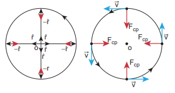

Figure 3.38 Centripetal force 

It should be noted that 'centripetal force' is not other forces like gravitational force or spring force. It can be said as 'force towards centre'. The origin of the centripetal force can be gravitational force, tension in the string, frictional force, Coulomb force etc. Any of these forces can act as a centripetal force.

1. In the case of whirling motion of a stone tied to a string, the centripetal force on the particle is provided by the tensional force on the string. In circular motion in an amusement park, the centripetal force is provided by the tension in the iron ropes.

2. In motion of satellites around the Earth, the centripetal force is given by Earth's gravitational force on the satellites. Newton's second law for satellite motion is

\[F = \mathrm{earth's~gravitational~force} = \frac{mv^{2}}{r}\]

Where \(r\) - distance of the planet from the centre of the Earth.

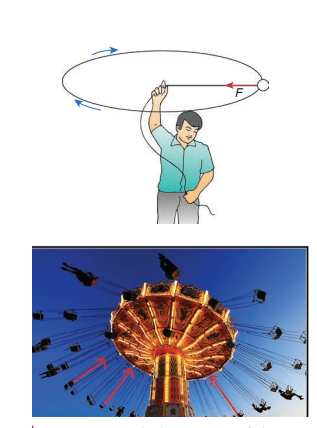

Figure 3.39 Whirling motion of objects 

m- mass of the satellite

 v- speed of the satellite

3. When a car is moving on a circular track the centripetal force is given by the frictional force between the road and the tyres.

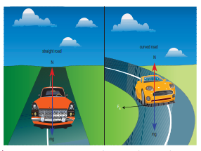

Figure 3.40 Car in the circular track 

Newton's second law for this case is

\[F_{\mathrm{critical force}} = \frac{mv^{2}}{r}\]

m- mass of the car

v- speed of the car

r- radius of curvature of track

Even when the car moves on a curved track, the car experiences the centripetal force which is provided by frictional force between the surface and the tyre of the car. This is shown in the Figure 3.41.
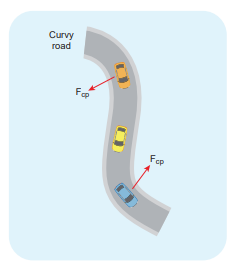

Figure 3.41 Centripetal force due to frictional force between the road and tyre 

4. When the planets orbit around the Sun, they experience centripetal force towards the centre of the Sun. Here gravitational force of the Sun acts as centripetal force on the planets as shown in Figure 3.42

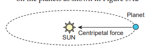

Figure 3.42 Centripetal force on the orbiting planet due Sun's gravity 

Newton's second law for this motion: Gravitational force of Sun on the planet \(= \frac{mv^{2}}{r}\)

## EXAMPLE 3.22

If a stone of mass \(0.25\mathrm{kg}\) tied to a string executes uniform circular motion with a speed of \(2 \, \text{m} \, \text{s}^{-1}\) of radius \(3\mathrm{m}\) , what is the magnitude of tensional force acting on the stone?

## Solution

\[F_{cp} = \frac{mv^{2}}{r} = \frac{0.25 \times 4}{3} = \frac{1}{3} = 0.333 \, \text{N}.\]

## EXAMPLE 3.23

The Moon orbits the Earth once in 27.3 days in an almost circular orbit. Calculate the centripetal acceleration experienced by the Moon? (Radius of the Earth is \(6.4 \times 10^{6} \, \text{m}\) )

## Solution

The centripetal acceleration is given by \(a = \frac{v^{2}}{r}\) . This expression explicitly depends on Moon's speed which is non trivial. We can work with the formula

\[\omega^{2} R_{m} = a_{m}\]

\(a_{m}\) is centripetal acceleration of the Moon due to Earth's gravity.

\(\omega\) is angular velocity.

\(R_{m}\) is the distance between Earth and the Moon, which is 60 times the radius of the Earth.

\[R_{m} = 60R = 60 \times 6.4 \times 10^{6} = 3.84 \times 10^{8} \, \text{m}\]

As we know the angular velocity \(\omega = \frac{2\pi}{T}\) and \(T = 27.3\) days \(= 27.3 \times 24 \times 60 \times 60\) second \(= 2.358 \times 10^{6}\) sec By substituting these values in the formula for acceleration

\[a_{m} = \frac{(4\pi^{2})(3.84 \times 10^{8})}{(2.358 \times 10^{6})^{2}} = 0.00272 \, \text{m} \, \text{s}^{-2}\]

The centripetal acceleration of Moon towards the Earth is \(0.00272 \, \text{m} \, \text{s}^{-2}\)

**Note:** This result was calculated by Newton himself. In unit 6 we will use this result.

### 3.7.2 Vehicle on a leveled circular road

When a vehicle travels in a curved path, there must be a centripetal force acting on it. This centripetal force is provided by the frictional force between tyre and surface of the road. Consider a vehicle of mass 'm' moving at a speed 'v' in the circular track of radius 'r'. There are three forces acting on the vehicle when it moves as shown in the Figure 3.43

1. Gravitational force (mg) acting downwards
2. Normal force (N) acting upwards
3. Frictional force \((F_{s})\) acting horizontally inwards along the road

Figure 3.43 Forces acting on the vehicle on a leveled circular road

Suppose the road is horizontal then the normal force and gravitational force are exactly equal and opposite. The centripetal force is provided by the force of static friction \(F_{s}\) between the tyre and surface of the road which acts towards the centre of the circular track,

\[\frac{mv^{2}}{r} = F_{s}\]

As we have already seen in the previous section, the static friction can increase from zero to a maximum value

\[F_{s} \leq \mu_{s} mg.\]

There are two conditions possible:

\[\mathrm{a)} \ \text{If} \ \frac{mv^{2}}{r} \leq \mu_{s} mg, \ \text{or} \ \mu_{s} \geq \frac{v^{2}}{rg} \ \text{or} \ \sqrt{\mu_{s} r g} \geq v \quad (\text{Safe turn})\]

The static friction would be able to provide necessary centripetal force to bend the car on the road. So the coefficient of static friction between the tyre and the surface of the road determines what maximum speed the car can have for safe turn.

\[\mathrm{b)} \ \text{If} \ \frac{mv^{2}}{r} > \mu_{s} mg, \ \text{or} \ \mu_{s} < \frac{v^{2}}{rg} \quad (\text{skid})\]

If the static friction is not able to provide enough centripetal force to turn, the vehicle will start to skid.

## EXAMPLE 3.24

Consider a circular leveled road of radius \(10\mathrm{m}\) having coefficient of static friction 0.81. Three cars (A, B and C) are travelling with speed \(7 \, \text{m} \, \text{s}^{-1}\), \(8 \, \text{m} \, \text{s}^{-1}\) and \(10 \, \text{m} \, \text{s}^{-1}\) respectively. Which car will skid when it moves in the circular level road? \((g = 10 \, \text{m} \, \text{s}^{-2})\)

## Solution

From the safe turn condition the speed of the vehicle \((v)\) must be less than or equal to \(\sqrt{\mu_{s} r g}\)

\[v \leq \sqrt{\mu_{s} r g}\] \[\sqrt{\mu_{s} r g} = \sqrt{0.81 \times 10 \times 10} = 9 \, \text{m} \, \text{s}^{-1}\]

For Car C, \(\sqrt{\mu_{s} r g}\) is less than \(v\)

The speed of car A, B and C are \(7 \, \text{m} \, \text{s}^{-1}\), \(8 \, \text{m} \, \text{s}^{-1}\) and \(10 \, \text{m} \, \text{s}^{-1}\) respectively. The cars A and B will have safe turns. But the car C has speed \(10 \, \text{m} \, \text{s}^{-1}\) while it turns which exceeds the safe turning speed. Hence, the car C will skid.

### 3.7.3 Banking of Tracks

In a leveled circular road, skidding mainly depends on the coefficient of static friction \(\mu_{s}\). The coefficient of static friction depends on the nature of the surface which has a maximum limiting value. To avoid this problem, usually the outer edge of the road is slightly raised compared to inner edge as shown in the Figure 3.44. This is called banking of roads or tracks. This introduces an inclination, and the angle is called banking angle.
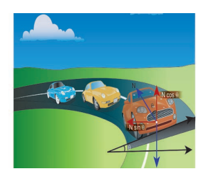

Figure 3.44 Outer edge of the road is slightly raised to avoid skidding 

Let the surface of the road make angle \(\theta\) with horizontal surface. Then the normal force makes the same angle \(\theta\) with the vertical. When the car takes a turn, there are two forces acting on the car:

a) Gravitational force mg (downwards)
b) Normal force N (perpendicular to surface)

We can resolve the normal force into two components. \(N\cos \theta\) and \(N\sin \theta\) as shown in Figure 3.46. The component \(N\cos \theta\) balances the downward gravitational force mg and component \(N\sin \theta\) will provide the necessary centripetal acceleration. By using Newton second law

\[N\cos \theta = mg\]

\[N\sin \theta = \frac{mv^{2}}{r}\]

By dividing the equations we get \(\tan \theta = \frac{v^{2}}{rg}\)

\[v = \sqrt{rg \tan \theta}\]

The banking angle \(\theta\) and radius of curvature of the road or track determines the safe speed of the car at the turning. If the speed of car exceeds this safe speed, then it starts to skid outward but frictional force comes into effect and provides an additional centripetal force to prevent the outward skidding. At the same time, if the speed of the car is little lesser than safe speed, it starts to skid inward and frictional force comes into effect, which reduces centripetal force to prevent inward skidding. However if the speed of the vehicle is sufficiently greater than the correct speed, then frictional force cannot stop the car from skidding.

**EXAMPLE 3.25**

Consider a circular road of radius $20\text{ meter}$ banked at an angle of $15\text{ degree}$. With what speed a car has to move on the turn so that it will have safe turn?

**Solution**

$$\begin{aligned}
v = \sqrt{(rg \tan\theta)} &= \sqrt{20 \times 9.8 \times \tan 15^{\circ}} \\
&= \sqrt{20 \times 9.8 \times 0.26} = 7.1\text{ m s}^{-1}
\end{aligned}$$

The safe speed for the car on this road is $7.1\text{ m s}^{-1}$

### 3.7.4 Centrifugal Force

Circular motion can be analysed from two different frames of reference. One is the inertial frame (which is either at rest or in uniform motion) where Newton's laws are obeyed. The other is the rotating frame of reference which is a non- inertial frame of reference as it is accelerating. When we examine the circular motion from these frames of reference the situations are entirely different. To use Newton's first and second laws in the rotational frame of reference, we need to include a pseudo force called 'centrifugal force'. This 'centrifugal force' appears to act on the object with respect to rotating frames. To understand the concept of centrifugal force, we can take a specific case and discuss as done below.

Consider the case of a whirling motion of a stone tied to a string. Assume that the stone has angular velocity \(\omega\) in the inertial frame (at rest). If the motion of the stone is observed from a frame which is also rotating along with the stone with same angular velocity \(\omega\) then, the stone appears to be at rest. This implies that in addition to the inward centripetal force \(- m\omega^{2} r\) there must be an equal and opposite force that acts on the stone outward with value \(+ m\omega^{2} r\) . So the total force acting on the stone in a rotating frame is equal to zero \((- m\omega^{2} r + m\omega^{2} r = 0)\) . This outward force \(+ m\omega^{2} r\) is called the centrifugal force. The word 'centrifugal' means 'flee from centre'. Note that the 'centrifugal force' appears to act on the particle, only when we analyse the motion from a rotating frame. With respect to an inertial frame there is only centripetal force which is given by the tension in the string. For this reason centrifugal force is called as a 'pseudo force'. A pseudo force has no origin. It arises due to the non inertial nature of the frame considered. When circular motion problems are solved from a rotating frame of reference, while drawing free body diagram of a particle, the centrifugal force should necessarily be included as shown in the Figure 3.45.

### 3.7.5 Effects of Centrifugal Force

Although centrifugal force is a pseudo force, its effects are real. When a car takes a turn in a curved road, person inside the car feels an outward force which pushes the person away. This outward force is also called centrifugal force. If there is sufficient friction between the person and the seat, it will prevent the person from moving outwards. When a car moving in a straight line suddenly takes a turn, the objects not fixed to the car try to continue in linear motion due to their inertia of direction. While observing this motion from an inertial frame, it appears as a straight line as shown in Figure 3.46. But, when it is observed from the rotating frame it appears to move outwards.
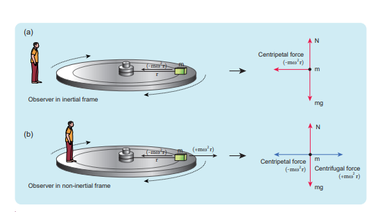
Figure 3.45 Free body diagram of a particle including the centrifugal force
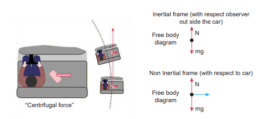

Figure 3.46 Effects of centrifugal force 

A person standing on a rotating platform feels an outward centrifugal force and is likely to be pushed away from the platform. Many a time the frictional force between the platform and the person is not sufficient to overcome outward push. To avoid this, usually the outer edge of the platform is little inclined upwards which exerts a normal force on the person which prevents the person from falling as illustrated in Figures 3.47.
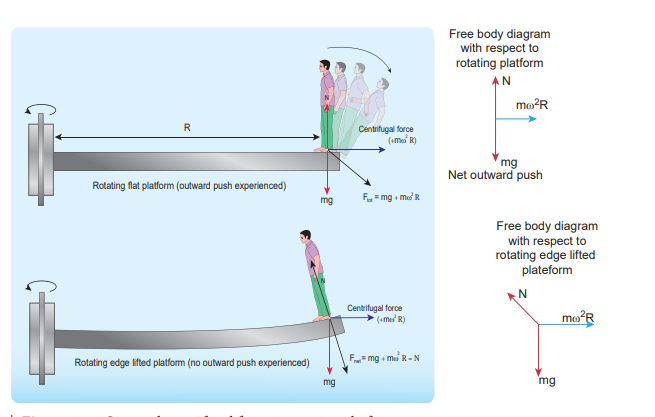

Figure 3.47 Outward centrifugal force in rotating platform

## Caution!

It is dangerous to stand near the open door (or) steps while travelling in the bus. When the bus takes a sudden turn in a curved road, due to centrifugal force the person is pushed away from the bus. Even though centrifugal force is a pseudo force, its effects are real.

### 3.7.6 Centrifugal Force due to Rotation of the Earth

Even though Earth is treated as an inertial frame, it is actually not so. Earth spins about its own axis with an angular velocity \(\omega\) . Any object on the surface of Earth (rotational frame) experiences a centrifugal force. The centrifugal force appears to act exactly in opposite direction from the axis of rotation. It is shown in the Figure 3.48.

The centrifugal force on a man standing on the surface of the Earth is \(F_{cf} = m\omega^{2} r\)

where \(r\) is perpendicular distance of the man from the axis of rotation. By using right angle triangle as shown in the Figure 3.48, the distance \(r = R \cos \theta\)

Here \(R =\) radius of the Earth and \(\theta =\) latitude of the Earth where the man is standing.
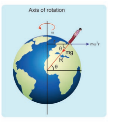

Figure 3.48 Centrifugal force acting on a man on the surface of Earth 

## EXAMPLE 3.26

Calculate the centrifugal force experienced by a man of \(60 \, \mathrm{kg}\) standing at Chennai? (Given: Latitude of Chennai is \(13^{\circ}\))

## Solution

The centrifugal force is given by \(F_{c} = m\omega^{2} R \cos \theta\)

The angular velocity \((\omega)\) of Earth \(= \frac{2\pi}{T}\) where T is time period of the Earth (24 hours)

\[\omega = \frac{2\pi}{24 \times 60 \times 60} = \frac{2\pi}{86400} = 7.268 \times 10^{-5} \, \text{rad} \, \text{s}^{-1}\]

The radius of the Earth \(R = 6400 \, \text{Km} = 6400 \times 10^{3} \, \text{m}\)

Latitude of Chennai \(= 13^{\circ}\)

\[F_{cf} = 60 \times (7.268 \times 10^{-5})^{2} \times 6400 \times 10^{3} \times \cos(13^{\circ})\] \[F_{cf} \approx 1.9678 \, \text{N}\]

A \(60 \, \text{kg}\) man experiences centrifugal force of approximately 2 Newton. But due to Earth's gravity a man of \(60 \, \text{kg}\) experiences a force \(= mg = 60 \times 9.8 = 588 \, \text{N}\) . This force is very much larger than the centrifugal force.

# 3.7.7 Centripetal Force Versus Centrifugal Force

Salient features of centripetal and centrifugal forces are compared in Table 3.4.

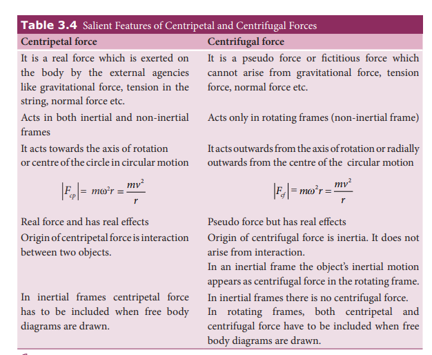

## SUMMARY

- Aristotle's idea of motion: To maintain motion, a force is required
- Galileo's idea of motion: To maintain motion, a force is not required
- Mass is a measure of inertia of the body
- Newton's first law states that under no external force, the object continues its state of motion or state of rest.
- Newton's second law states that to change the momentum of the body, external force is required
- Mathematically it is defined as \(\vec{F} = \frac{d\vec{p}}{dt}\)
- Both Newton's first and second laws are valid only in inertial frames
- Inertial frame is the one in which if there is no force on the object, the object moves at constant velocity.
- Newton's third law states that for every force there is an equivalent and opposite force and such a pair of forces is called action and reaction pair.
- To draw a free body diagram for an object,
  - Isolate the object from other objects and identify the forces acting on it
  - The force exerted by that object should not be taken into account
  - Draw the direction of each force with relative magnitude
  - Apply Newton's second law in each direction
- If no net external force acts on a collection of particles (system), then the total momentum of the collection of particles (system) is a constant vector.
- Internal forces acting in the system cannot change the total momentum of the system.
- Lami's theorem states that if an object is in equilibrium under the concurrent forces, then the ratio of each force with the sine of corresponding opposite angle is same.
- An impulse acting on a body is equal to the change in momentum of the body. Whenever a force acts on the object for a very short time, it is difficult to calculate the force. But impulse can be calculated.
- Static friction is the force which always opposes the movement of the object from rest. It can take values from zero to \(\mu_{s} N\) . If an external force is greater than \(\mu_{s} N\) then object begins to move.
- If the object begins to move, kinetic friction comes into effect. To move an object with constant velocity, the external force must be applied to overcome the kinetic friction. The kinetic friction is \(\mu_{k} N\) .
- Rolling friction is much smaller than static and kinetic friction. This is the reason that to move an object roller coaster is fixed in the bottom of the object. Example: Rolling suitcase

## SUMMARY (cont)

- The origin of friction is electromagnetic interaction between the atoms of two surfaces which are touching each other.
- Whenever there is a motion along a curve, there must be a centripetal force that acts towards the centre of the curve. In uniform circular motion the centripetal force acts at the centre of the circle.
- The centripetal force is not a separate natural force. Any natural force can behave as centripetal force. In planetary motion, Sun's gravitational force acts as centripetal force. In the whirling motion of a stone attached to a string, the centripetal force is given by the string. When Moon orbits the Earth, it experiences Earth's gravitational force as centripetal force.
- Centrifugal force arises whenever the motion is analysed from rotating frame. It is a pseudo force. The inertial motion of the object appears as centrifugal force in the rotating frame.
- The magnitude of centrifugal and centripetal force is \(m\omega^{2} r\) . But centripetal force acts towards centre of the circular motion and centrifugal force appears to acts in the opposite direction to centripetal force.

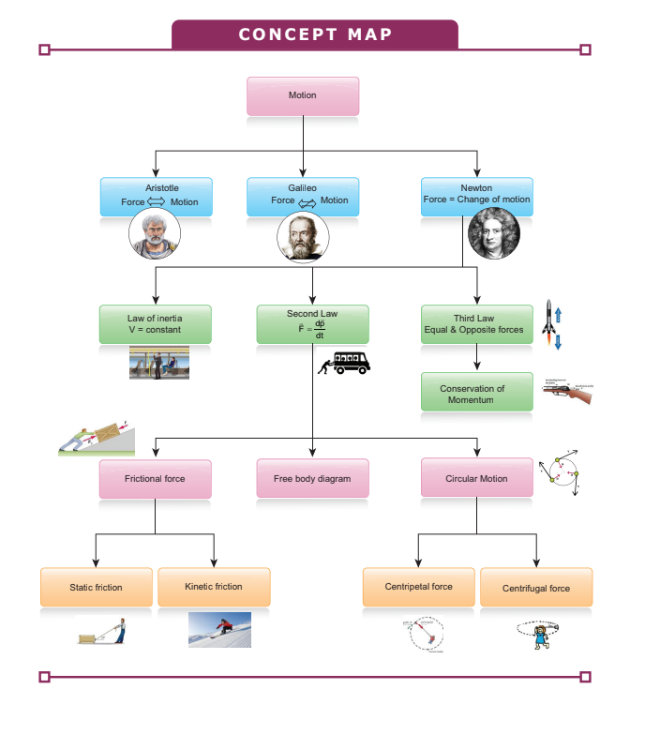