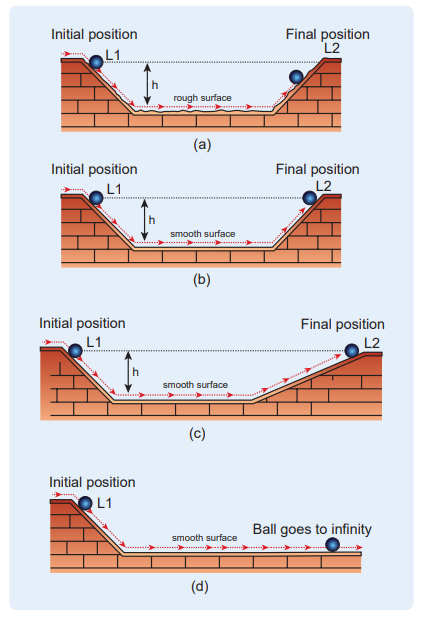
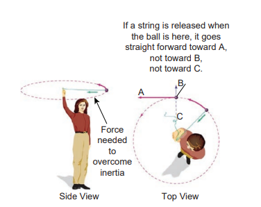
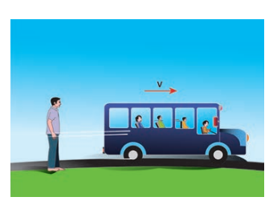
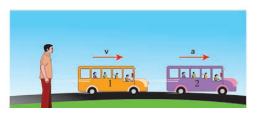

## 3.1 INTRODUCTION
Each and every object in the universe interacts with every other object. The cool breeze interacts with the tree. The tree interacts with the Earth. In fact, all species interact with nature. But, what is the difference between a human's interaction with nature and that of an animal's. Human's interaction has one extra quality. We not only interact with nature but also try to understand and explain natural phenomena scientifically.

In the history of mankind, the most curiosity driven scientific question asked was about motion of objects-"How things move?" and "Why things move?" Surprisingly, these simple questions have paved the way for development from early civilization to the modern technological era of the \(21^{\mathrm{st}}\) century.

Objects move because something pushes or pulls them. For example, if a book is at rest, it will not move unless a force is applied on it. In other words, to move an object a force must be applied on it. About 2500 years ago, the famous philosopher, Aristotle, said that 'Force causes motion'. This statement is based on common sense. But any scientific answer cannot be based on common sense. It must be endorsed with quantitative experimental proof.

In the \(15^{\mathrm{th}}\) century, Galileo challenged Aristotle's idea by doing a series of experiments. He said force is not required to maintain motion.

Galileo demonstrated his own idea using the following simple experiment. When a ball rolls from the top of an inclined plane to its bottom, after reaching the ground it moves some distance and continues to move on to another inclined plane of same angle of inclination as shown in the Figure 3.1(a). By increasing the smoothness of both the inclined planes, the ball reach almost the same height(h) from where it was released (L1) in the second plane (L2) (Figure 3.1(b)). The motion of the ball is then observed by varying the angle of inclination of the second plane keeping the same smoothness. If the angle of inclination is reduced, the ball travels longer distance in the second plane to reach the same height (Figure 3.1(c)). When the angle of inclination is made zero, the ball moves forever in the horizontal direction (Figure 3.1(d)). If the Aristotelian idea were true, the ball would not have moved in the second plane even if its smoothness is made maximum since no

Figure 3.1 Galileo's experiment with the second plane (a) at same inclination angle as the first (b) with increased smoothness (c) with reduced angle of inclination (d) with zero angle of inclination 

force acted on it in the horizontal direction. From this simple experiment, Galileo proved that force is not required to maintain motion. An object can be in motion even without a force acting on it.

In essence, Aristotle coupled the motion with force while Galileo decoupled the motion and force.

### 3.2 NEWTON'S LAWS

Newton analysed the views of Galileo, and other scientist like Kepler and Copernicus on motion and provided much deeper insights in the form of three laws.

#### 3.2.1 Newton's First Law

**Every object continues to be in the state of rest or of uniform motion (constant velocity) unless there is external force acting on it.**

This inability of objects to move on its own or change its state of motion is called inertia. Inertia means resistance to change its state. Depending on the circumstances, there can be three types of inertia.

1. **Inertia of rest:** When a stationary bus starts to move, the passengers experience a sudden backward push. Due to inertia, the body (of a passenger) will try to

Figure 3.2 Passengers experience a backward push due to inertia of rest 

continue in the state of rest, while the bus moves forward. This appears as a backward push as shown in Figure 3.2. The inability of an object to change its state of rest is called inertia of rest.

2. **Inertia of motion:** When the bus is in motion, and if the brake is applied suddenly, passengers move forward and hit against the front seat. In this case, the bus comes to a stop, while the body (of a passenger) continues to move forward due to the property of inertia as shown in Figure 3.3. The inability of an object to change its state of uniform speed (constant speed) on its own is called inertia of motion.

3. **Inertia of direction:** When a stone attached to a string is in whirling

Figure 3.3 Passengers experience a forward push due to inertia of motion 

motion, and if the string is cut suddenly, the stone will not continue to move in circular motion but moves tangential to the circle as illustrated in Figure 3.4. This is because the body cannot change its direction of motion without any force acting on it. The inability of an object to change its direction of motion on its own is called inertia of direction.

When we say that an object is at rest or in motion with constant velocity, it has a meaning only if it is specified with respect to some reference frames. In physics, any motion has to be stated with respect to a reference frame. It is to be noted that Newton's first law is valid only in certain special reference frames called inertial frames. In fact, Newton's first law defines an inertial frame.

Figure 3.4 A stone moves tangential to circle due to inertia of direction 

#### Inertial Frames
If an object is free from all forces, then itmoves with constant velocity or remains atrest when seen from inertial frames. Thus,there exists some special set of frames inwhich, if an object experiences no force, itmoves with constant velocity or remains atrest. But how do we know whether an objectis experiencing a force or not? All the objectsin the Earth experience Earth’s gravitationalforce. In the ideal case, if an object is in deepspace (very far away from any other object),then Newton’s first law will be certainly valid.Such deep space can be treated as an inertialframe. But practically it is not possible to reachsuch deep space and verify Newton’s first law.

For all practical purposes, we can treatEarth as an inertial frame because an object onthe table in the laboratory appears to be at restalways. This object never picks up accelerationin the horizontal direction since no force acts on it in the horizontal direction. So the laboratory can be taken as an inertial frame for all physics experiments and calculations. For making these conclusions, we analyse only the horizontal motion of the object as there is no horizontal force that acts on it. We should not analyse the motion in vertical direction as the two forces (gravitational force in the downward direction and normal force in upward direction) that act on it makes the net force is zero in vertical direction. Newton’s first law deals with the motion of objects in the absence of any force and not the motion under zero net force. Suppose a train is moving with constant velocity with respect to an inertial frame, then an object at rest in the inertial frame (outside the train) appears to move with constant velocity with respect to the train (viewed from within the train). So the train can be treated as an inertial frame. All inertial frames are moving with constant velocity relative to each other. If an object appears to be at rest in one inertial frame, it may appear to move with constant velocity with respect to another inertial frame.

For example, in Figure 3.5, the car is moving with uniform velocity v with respect to a person standing (at rest) on the ground. As the car is moving with constant velocity with respect to the person at rest on the ground, both frames (with respect to the car and to the ground) are inertial frames.

 Figure 3.5 The person and
vehicle are inertial frames

Suppose an object remains at rest on asmooth table kept inside the train, and if the train suddenly accelerates (which we maynot sense), the object appears to accelerate backwards even without any force acting onit. It is a clear violation of Newton’s first law as the object gets accelerated without being acted upon by a force. It implies that the train is not an inertial frame when it is accelerated.

For example, Figure 3.6 shows that car 2 is a non-inertial frame since it moves with acceleration  $\bar{a}$ with respect to the ground.

Figure 3.6 Car 2 is a non-inertial
frame

These kinds of accelerated frames are called non-inertial frames. A rotating frame is also a non inertial frame since rotation requires acceleration. In this sense, Earth is not really an inertial frame since it has self-rotation and orbital motion. But these rotational effects of Earth can be ignored for the motion involved in our day-to-day life. For example, when an object is thrown, or the time period of a simple pendulum is measured in the physics laboratory, the Earth’s self-rotation has very negligible effect on it. In this sense, Earth can be treated as an inertial frame. But at the same time, to analyse the motion of satellites and wind patterns around the Earth, we cannot treat Earth as an inertial frame since its self-rotation has a strong influence on wind patterns and satellite motion.