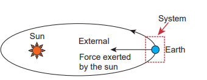
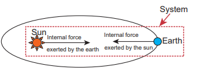
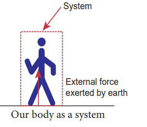
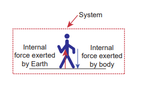
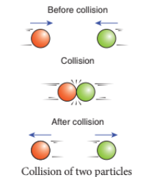
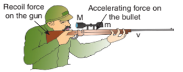
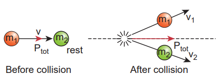
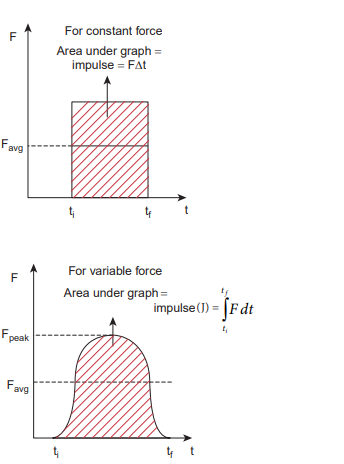
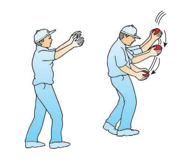
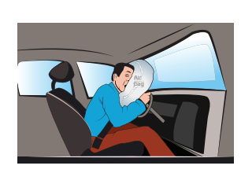

### 3.5 LAW OF CONSERVATION OF TOTAL LINEAR MOMENTUM

In nature, conservation laws play a very important role. The dynamics of motion of bodies can be analysed very effectively using conservation laws. There are three conservation laws in mechanics. Conservation of total energy, conservation of total linear momentum, and conservation of angular momentum. By combining Newton's second and third laws, we can derive the law of conservation of total linear momentum.

When two particles interact with each other, they exert equal and opposite forces on each other. The particle 1 exerts force \(\vec{F}_{21}\) on particle 2 and particle 2 exerts an exactly equal and opposite force \(\vec{F}_{12}\) on particle 1, according to Newton's third law.

\[\vec{F}_{21} = -\vec{F}_{12} \quad (3.20)\]

In terms of momentum of particles, the force on each particle (Newton's second law) can be written as

\[\vec{F}_{12} = \frac{d\vec{p}_1}{dt} \quad \text{and} \quad \vec{F}_{21} = \frac{d\vec{p}_2}{dt}. \quad (3.21)\]

Here \(\vec{p}_{1}\) is the momentum of particle 1 which changes due to the force \(\vec{F}_{12}\) exerted by particle 2. Further \(\vec{p}_{2}\) is the momentum of particle 2. This changes due to \(\vec{F}_{21}\) exerted by particle 1.

Substitute equation (3.21) in equation (3.20)

\[\frac{d\vec{p}_1}{dt} = -\frac{d\vec{p}_2}{dt}\quad (3.21)\]

\[\frac{d\vec{p}_1}{dt} + \frac{d\vec{p}_2}{dt} = 0  \quad (3.22)\]

$$\frac{d}{dt}(\vec{p}_1 + \vec{p}_2) = 0 \quad $$

It implies that \(\vec{p}_{1} + \vec{p}_{2} =\) constant vector (always).

\(\vec{p}_{1} + \vec{p}_{2}\) is the total linear momentum of the two particles \((\vec{p}_{tot} = \vec{p}_{1} + \vec{p}_{2})\) . It is also called as total linear momentum of the system. Here, the two particles constitute the system. From this result, the law of conservation of linear momentum can be stated as follows.

If there are no external forces acting on the system, then the total linear momentum of the system \((\vec{p}_{tot})\) is always a constant vector. In other words, the total linear momentum of the system is conserved in time. Here the word 'conserve' means that \(\vec{p}_{1}\) and \(\vec{p}_{2}\) can vary, in such a way that \(\vec{p}_{1} + \vec{p}_{2}\) is a constant vector.

The forces \(\vec{F}_{12}\) and \(\vec{F}_{21}\) are called the internal forces of the system, because they act only between the two particles. There is no external force acting on the two particles from outside. In such a case the total linear momentum of the system is a constant vector or is conserved.

## EXAMPLE 3.15

Identify the internal and external forces acting on the following systems.

a) Earth alone as a system

b) Earth and Sun as a system

c) Our body as a system while walking

d) Our body + Earth as a system

## Solution

a) Earth alone as a system
Earth orbits the Sun due to gravitational attraction of the Sun. If we consider Earth as a system, then Sun's gravitational force is an external force. If we take the Moon into account, it also exerts an external force on Earth.

b) (Earth + Sun) as a system
In this case, there are two internal forces which form an action and reaction pair: the gravitational force exerted by the Sun on Earth and gravitational force exerted by the Earth on the Sun.

c) Our body as a system
While walking, we exert a force on the Earth and Earth exerts an equal and opposite force on our body. If our body alone is considered as a system, then the force exerted by the Earth on our body is external.

d) (Our body + Earth) as a system
In this case, there are two internal forces present in the system. One is the force exerted by our body on the Earth and the other is the equal and opposite force exerted by the Earth on our body.

Our body + Earth as a system

**Meaning of law of conservation of momentum**

1) The Law of conservation of linear momentum is a vector law. It implies that both the magnitude and direction of total linear momentum are constant. In some cases, this total momentum can also be zero.
2) To analyse the motion of a particle, we can either use Newton's second law or the law of conservation of linear momentum. Newton's second law requires us to specify the forces involved in the process. This is difficult to specify in real situations. But conservation of linear momentum does not require any force involved in the process. It is convenient and hence important.

For example, when two particles collide, the forces exerted by these two particles on each other is difficult to specify. But it is easier to apply conservation of linear momentum during the collision process.

## Examples

Consider the firing of a gun. Here the system is Gun+bullet. Initially the gun and bullet are at rest, hence the total linear momentum of the system is zero. Let \(\vec{p}_{1}\) be the momentum of the bullet and \(\vec{p}_{2}\) the momentum of the gun before firing. Since initially both are at rest,

\[\vec{p}_1 = 0,\ \vec{p}_2 = 0.\]

Total momentum before firing the gun is zero, \(\vec{p}_1 + \vec{p}_2 = 0\) .

According to the law of conservation of linear momentum, total linear momentum has to be zero after the firing also.

When the gun is fired, a force is exerted by the gun on the bullet in forward direction. Now the momentum of the bullet changes from \(\vec{p}_1\) to \(\vec{p}_1^{\prime}\) . To conserve the total linear momentum of the system, the momentum of the gun must also change from \(\vec{p}_2\) to \(\vec{p}_2^{\prime}\) . Due to the conservation of linear momentum, \(\vec{p}_1^{\prime} + \vec{p}_2^{\prime} = 0\) . It implies that \(\vec{p}_1^{\prime} = -\vec{p}_2^{\prime}\) , the momentum of the gun is exactly equal, but in the opposite direction to the momentum of the bullet. This is the reason after firing, the gun suddenly moves backward with the momentum \((-\vec{p}_1^{\prime})\) . It is called 'recoil momentum'. This is an example of conservation of total linear momentum.

Consider two particles. One is at rest and the other moves towards the first particle (which is at rest). They collide and after collision move in some arbitrary directions. In this case, before collision, the total linear momentum of the system is equal to the initial linear momentum of the moving particle. According to conservation of momentum, the total linear momentum after collision also has to be in the forward direction. The following figure explains this.

A more accurate calculation is covered in section 4.4. It is to be noted that the total momentum vector before and after collision points in the same direction. This simply means that the total linear momentum is constant before and after the collision. At the time of collision, each particle exerts a force on the other. As the two particles are considered as a system, these forces are only internal, and the total linear momentum cannot be altered by internal forces.

#### 3.5.1 Impulse

If a very large force acts on an object for a very short duration, then the force is called impulsive force or impulse.

If a force (F) acts on the object in a very short interval of time \((\Delta t)\) , from Newton's second law in magnitude form

\[F dt = dp\]

Integrating over time from an initial time \(t_i\) to a final time \(t_f\) , we get

\[\int_{t_i}^{t_f} dp = \int_{t_i}^{t_f} F dt\]

\[p_f - p_i = \int_{t_i}^{t_f} F dt\]

\(p_i =\) initial momentum of the object at time \(t_i\)

 \(p_f =\) final momentum of the object at time \(t_f\)

\(p_{f} - p_{i} = \Delta p =\) change in momentum of the object during the time interval \(t_{f} - t_{i} = \Delta t\) .

The integral \(\int_{t_i}^{t_f} F dt = J\) is called the impulse and it is equal to change in momentum of the object.

If the force is constant over the time interval, then

\[\int_{t_i}^{t_f} F dt = F \int_{t_i}^{t_f} dt = F (t_f - t_i) = F \Delta t\] \[F \Delta t = \Delta p\]

Equation (3.24) is called the 'impulse-momentum equation'.

For a constant force, the impulse is denoted as \(J = F \Delta t\) and it is also equal to change in momentum \((\Delta p)\) of the object over the time interval \(\Delta t\) .

Impulse is a vector quantity and its unit is Ns.

The average force acted on the object over the short interval of time is defined by

\[F_{\mathrm{avg}} = \frac{\Delta p}{\Delta t} \quad (3.25)\]

From equation (3.25), the average force that act on the object is greater if \(\Delta t\) is smaller. Whenever the momentum of the body changes very quickly, the average force becomes larger.

The impulse can also be written in terms of the average force. Since \(\Delta p\) is change in momentum of the object and is equal to impulse (J), we have

\[J = F_{\mathrm{avg}} \Delta t \quad (3.26)\]

The graphical representation of constant force impulse and variable force impulse is given in Figure 3.21.

Figure 3.21 Constant force impulse and variable force impulse 

## Illustration

1. When a cricket player catches the ball, he pulls his hands gradually in the direction of the ball's motion. Why?

If he stops his hands soon after catching the    ball, the ball comes to rest very quickly. It means that the momentum of the ball is brought to rest very quickly. So the average force acting on the body will be very large. Due to this large average force, the hands will get hurt. To avoid getting hurt, the player brings the ball to rest slowly.

2. When a car meets with an accident, its momentum reduces drastically in a very short time. This is very dangerous for the passengers inside the car since they will experience a large force. To prevent this fatal shock, cars are designed with air bags in such a way that when the car meets with an accident, the momentum of the passengers will reduce slowly so that the average force acting on them will be smaller.

3. The shock absorbers in two wheelers play the same role as airbags in the car. When there is a bump on the road, a sudden force is transferred to the vehicle. The shock absorber prolongs the period of transfer of force on to the body of the rider. Vehicles without shock absorbers will harm the body due to this reason.

4. Jumping on a concrete cemented floor is more dangerous than jumping on the sand. Sand brings the body to rest slowly than the concrete floor, so that the average force experienced by the body will be lesser.

Impulse

If an egg is thrown, can you catch the egg safely without breaking it? How?

## EXAMPLE 3.16

An object of mass \(10\mathrm{kg}\) moving with a speed of \(15 \, \text{m} \, \text{s}^{-1}\) hits the wall and comes to rest within

a) 0.03 second b) 10 second

Calculate the impulse and average force acting on the object in both the cases.

## Solution

Initial momentum of the object \(p_{i} = 10 \times 15 = 150 \, \text{kg} \, \text{m} \, \text{s}^{-1}\)

Final momentum of the object \(p_{f} = 0\)

\[\Delta p = 150 - 0 = 150 \, \text{kg} \, \text{m} \, \text{s}^{-1}\]

(a) Impulse \(J = \Delta p = 150 \, \text{N} \, \text{s}\).

(b) Impulse \(J = \Delta p = 150 \, \text{N} \, \text{s}\)

(a) Average force \(F_{avg} = \frac{\Delta p}{\Delta t} = \frac{150}{0.03} = 5000 \, \text{N}\)

(b) Average force \(F_{avg} = \frac{150}{10} = 15 \, \text{N}\)

We see that impulse is the same in both cases, but the average force is different.

