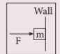
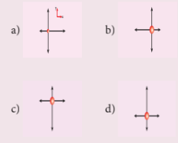
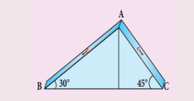
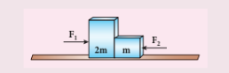
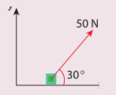
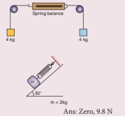
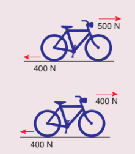
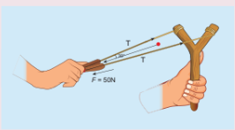
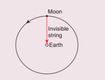
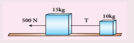

## Multiple Choice Questions

1. When a car takes a sudden left turn in the curved road, passengers are pushed towards the right due to 

    (a) inertia of direction

    (b) inertia of motion
 
    (c) inertia of rest
  
    (d) absence of inertia

2. An object of mass m held against a vertical wall by applying horizontal force F as shown in the figure. The minimum value of the force F is (IIT JEE 1994)

    (a) Less than mg

    (b) Equal to mg

    (c) Greater than mg

    (d) Cannot determine

3. A vehicle is moving along the positive x direction, if sudden brake is applied, then

    (a) frictional force acting on the vehicle is along negative x direction

    (b) frictional force acting on the vehicle is along positive x direction

    (c) no frictional force acts on the vehicle

    (d) frictional force acts in downward direction

4. A book is at rest on the table which exerts a normal force on the book. If this force is considered as reaction force, what is the action force according to Newton's third law?

    (a) Gravitational force exerted by Earth on the book

    (b) Gravitational force exerted by the book on Earth

    (c) Normal force exerted by the book on the table

    (d) None of the above

5. Two masses \(m_{1}\) and \(m_{2}\) are experiencing the same force where \(m_{1} < m_{2}\) . The ratio of their acceleration \(\frac{a_{1}}{a_{2}}\) is

    (a) 1

    (b) less than 1

    (c) greater than 1

    (d) all the three cases

6. Choose appropriate free body diagram for the particle experiencing net acceleration along negative y direction. (Each arrow mark represents the force acting on the system).

7. A particle of mass m sliding on the smooth double inclined plane (shown in figure) will experience

    (a) greater acceleration along the path AB

    (b) greater acceleration along the path AC

    (c) same acceleration in both the paths

    (d) no acceleration in both the paths.

8. Two blocks of masses m and 2m are placed on a smooth horizontal surface as shown. In the first case only a force \(F_{1}\) is applied from the left. Later only a force \(F_{2}\) is applied from the right. If the force acting at the interface of the two blocks in the two cases is same, then \(F_{1}:F_{2}\) is

    (a) 1:1

    (b) 1:2

    (c) 2:1

    (d) 1:3

9. Force acting on the particle moving with constant speed is

    (a) always zero

    (b) need not be zero

    (c) always non zero

    (d) cannot be concluded

10. An object of mass m begins to move on the plane inclined at an angle \(\theta\) . The coefficient of static friction of inclined surface is \(\mu_{s}\) . The maximum static friction experienced by the mass is
    (a) mg 
    
    (b) \(\mu_{s} mg\) 
    
    (c) \(\mu_{s} mg \sin \theta\) 
    
    (d) \(\mu_{s} mg \cos \theta\)

11. When the object is moving at constant velocity on the rough surface,

    (a) net force on the object is zero
    
    (b) no force acts on the object
    
    (c) only external force acts on the object
    
    (d) only kinetic friction acts on the object

12. When an object is at rest on the inclined rough surface,

    (a) static and kinetic frictions acting on the object is zero
    
    (b) static friction is zero but kinetic friction is not zero
    
    (c) static friction is not zero and kinetic friction is zero
    
    (d) static and kinetic frictions are not zero

13. The centrifugal force appears to exist

    (a) only in inertial frames
    
    (b) only in rotating frames

    (c) in any accelerated frame 

    (d) both in inertial and non-inertial frames

14. Choose the correct statement from the following 
    (a) Centrifugal and centripetal forces are action reaction pairs 

    (b) Centripetal forces is a natural force 

    (c) Centrifugal force arises from gravitational force 

    (d) Centripetal force acts towards the centre and centrifugal force appears to act away from the centre in a circular motion

15. If a person moving from pole to equator, the centrifugal force acting on him

    (a) increases

    (b) decreases

    (c) remains the same

    (d) increases and then decreases

## Answers

1) a
2) c
3) a
4) c
5) c
6) c
7) b
8) c
9) b
10) d
11) a
12) c
13) b
14) d
15) a

## II. Short Answer Questions

1. Explain the concept of inertia. Write two examples each for inertia of motion, inertia of rest and inertia of direction.
2. State Newton's second law.
3. Define one newton.
4. Show that impulse is the change of momentum.
5. Using free body diagram, show that it is easy to pull an object than to push it.
6. Explain various types of friction. Suggest a few methods to reduce friction.
7. What is the meaning by 'pseudo force'?
8. State the empirical laws of static and kinetic friction.
9. State Newton's third law.
10. What are inertial frames?
11. Under what condition will a car skid on a leveled circular road?
12. State Newton's three laws and discuss their significance.
13. Explain the similarities and differences of centripetal and centrifugal forces.
14. Briefly explain 'centrifugal force' with suitable examples.
15. Briefly explain 'rolling friction'.
16. Describe the method of measuring angle of repose.
17. Explain the need for banking of tracks.
18. Calculate the centripetal acceleration of Moon towards the Earth.

## III. Long Answer Questions

1. Prove the law of conservation of linear momentum. Use it to find the recoil velocity of a gun when a bullet is fired from it.
2. What are concurrent forces? State Lami's theorem.
3. Explain the motion of blocks connected by a string in i) Vertical motion ii) Horizontal motion.
4. Briefly explain the origin of friction. Show that in an inclined plane, angle of friction is equal to angle of repose.
5. State Newton's three laws and discuss their significance.
6. Explain the similarities and differences of centripetal and centrifugal forces.
7. Briefly explain 'centrifugal force' with suitable examples.
8. Briefly explain 'rolling friction'.
9. Describe the method of measuring angle of repose.
10. Explain the need for banking of tracks.
11. Calculate the centripetal acceleration of Moon towards the Earth.

## IV. Exercises

1. A force of \(50 \, \text{N}\) act on the object of mass \(20 \, \text{kg}\) shown in the figure. Calculate the acceleration of the object in x and y directions.

Ans: \(a_{x} = 2.165 \, \text{m} \, \text{s}^{-2};\ a_{y} = 1.25 \, \text{m} \, \text{s}^{-2}\)

2. A spider of mass \(50 \, \text{g}\) is hanging on a string of a cob web as shown in the figure. What is the tension in the string? Ans: \(T = 0.49 \, \text{N}\)

3. What is the reading shown in spring balance? Ans: Zero, 9.8 N

4. The physics books are stacked on each other in the sequence: +1 volumes 1 and 2; +2 volumes 1 and 2 on a table.

a) Identify the forces acting on each book and draw the free body diagram.
b) Identify the forces exerted by each book on the other.

5. A bob attached to the string oscillates back and forth. Resolve the forces acting on the bob into components. What is the acceleration experienced by the bob at an angle \(\theta\) .

Ans: Tangential acceleration \(= g \sin \theta\) ; centripetal acceleration \(= \frac{(T - mg \cos \theta)}{m}\) .

6. Two masses \(m_{1}\) and \(m_{2}\) are connected with a string passing over a frictionless pulley fixed at the corner of the table as shown in the figure. The coefficient of static friction of mass \(m_{1}\) with the table is \(\mu_{s}\) . Calculate the minimum mass \(m_{3}\) that may be placed on \(m_{1}\) to prevent it from sliding. Check if \(m_{1} = 15 \, \text{kg}\), \(m_{2} = 10 \, \text{kg}\), \(m_{3} = 25 \, \text{kg}\) and \(\mu_{s} = 0.2\)

Ans: \(m_{3} = \frac{m_{2}}{\mu_{s}} - m_{1}\), the combined masses \(m_{1} + m_{3}\) will slide.

7. Calculate the acceleration of the bicycle of mass \(25 \, \text{kg}\) as shown in Figures 1 and 2.

 Ans: \(a = 4 \, \text{m} \, \text{s}^{-2}\), zero

8. Apply Lami's theorem on sling shot and calculate the tension in each string ?

 Ans: \(T = 28.868 \, \text{N}\)

9. A football player kicks a \(0.8 \, \text{kg}\) ball and imparts it a velocity \(12 \, \text{m} \, \text{s}^{-1}\) . The contact between the foot and ball is only for one-sixtieth of a second. Find the average kicking force.

 Ans: \(576 \, \text{N}\)

10. A stone of mass \(2 \, \text{kg}\) is attached to a string of length 1 meter. The string can withstand maximum tension \(200 \, \text{N}\) . What is the maximum speed that stone can have during the whirling motion?

 Ans: \(\nu_{max} = 10 \, \text{m} \, \text{s}^{-1}\)

11. Imagine that the gravitational force between Earth and Moon is provided by an invisible string that exists between the Moon and Earth. What is the tension that exists in this invisible string due to Earth's centripetal force? (Mass of the Moon \(= 7.34 \times 10^{22} \, \text{kg}\), Distance between Moon and Earth \(= 3.84 \times 10^{8} \, \text{m}\))

 Ans: \(T \approx 2 \times 10^{20} \, \text{N}\)

12. Two bodies of masses \(15 \, \text{kg}\) and \(10 \, \text{kg}\) are connected with light string kept on a smooth surface. A horizontal force \(F = 500 \, \text{N}\) is applied to a \(15 \, \text{kg}\) as shown in the figure. Calculate the tension acting in the string.

 Ans: \(T = 200 \, \text{N}\)

13. People often say "For every action there is an equivalent opposite reaction". Here they meant 'action of a human'. Is it correct to apply Newton's third law to human actions? What is mean by 'action' in Newton third law? Give your arguments based on Newton's laws.

Ans: Newton's third law is applicable to only human's actions which involves physical force. Third law is not applicable to human's psychological actions or thoughts.

14. A car takes a turn with velocity 50 m s⁻¹ on the circular road of radius of curvature \(10 \, \text{m}\) . Calculate the centrifugal force experienced by a person of mass \(60 \, \text{kg}\) inside the car?

 Ans: 15,000 N

15. A long stick rests on the surface. A person standing \(10 \, \text{m}\) away from the stick. With what minimum speed an object of mass \(0.5 \, \text{kg}\) should he thrown so that it hits the stick. (Assume the coefficient of kinetic friction is 0.7). 

Ans: 11.71 m s⁻¹

## BOOKS FOR REFERENCE

1. Charles Kittel, Walter Knight, Malvin Ruderman, Carl Helmholtz and Moyer, Mechanics, \(2^{\mathrm{nd}}\) edition, Mc Graw Hill Pvt Ltd,
2. A.P.French, Newtonian Mechanics, Viva-Norton Student edition
3. Somnath Datta, Mechanics, Pearson Publication
4. H.C.Verma, Concepts of physics volume 1 and Volume 2, Bharati Bhawan Publishers
5. Serway and Jewett, Physics for scientist and Engineers with modern physics, Brook/Cooler publishers, Eighth edition
6. Halliday, Resnick & Walker, Fundamentals of Physics, Wiley Publishers, \(10^{\mathrm{th}}\) edition
