# Unit 5: Motion of System of Particles and Rigid Bodies

In nature, we have to deal not with material points but with material bodies ... - Max Planck

## Learning Objectives

In this unit, the student is exposed to:
- relevance of the centre of mass in various systems of particles
- torque and angular momentum in rotational motion
- types of equilibria with appropriate examples
- moment of inertia of different rigid bodies
- dynamics of rotation of rigid bodies
- distinguishing translational motion from rotational motion
- rolling motion, slipping and sliding motions.

## 5.1 Introduction

Most of the objects that we come across in our day to day life consist of large number of particles. In the previous Units, we studied the motion of bodies without considering their size and shape. So far we have treated even the bulk bodies as only point objects. In this section, we will give importance to the size and shape of the bodies. These bodies are actually made up of a large number of particles. When such a body moves, we consider it as the motion of collection of particles as a whole. We define the concept of centre of mass to deal with such a system of particles.

The forces acting on these bulk bodies are classified into internal and external forces. Internal forces are the forces acting among the particles within a system that constitute the body. External forces are the forces acting on the particles of a system from outside. In this unit, we deal with such system of particles which make different rigid bodies. A rigid body is the one which maintains its definite and fixed shape even when an external force acts on it. This means that, the interatomic distances do not change in a rigid body when an external force is applied. However, in real life situation, we have bodies which are not ideally rigid, because the shape and size of the body change when forces act on them. For the rigid bodies we study here, we assume that such deformations are negligible. The deformations produced on non-rigid bodies are studied separately in Unit 7 under elasticity of solids.

### 5.1.1 Centre of Mass

When a rigid body moves, all particles that constitute the body need not take the same path. Depending on the type of motion, different particles of the body may take different paths. For example, when a wheel rolls on a surface, the path of the centre point of the wheel and the paths of other points of the wheel are different. In this Unit, we study about the translation, rotation and the combination of these motions of rigid bodies in detail.

#### 5.1.2 Centre of Mass of a Rigid Body

When a bulk object (say a bat) is thrown at an angle in air as shown in Figure 5.1; do all the points of the body take a parabolic path? Actually, only one point takes the parabolic path and all the other points take different paths.

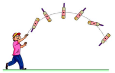

**Figure 5.1 Centre of mass tracing the path of a parabola**

The one point that takes the parabolic path is a very special point called centre of mass (CM) of the body. Its motion is like the motion of a single point that is thrown. The centre of mass of a body is defined as a point where the entire mass of the body appears to be concentrated. Therefore, this point can represent the entire body.

For bodies of regular shape and uniform mass distribution, the centre of mass is at the geometric centre of the body. As examples, for a circle and sphere, the centre of mass is at their centres; for square and rectangle, at the point their diagonals meet; for cube and cuboid, it is at the point where their body diagonals meet. For other bodies, the centre of mass has to be determined using some methods. The centre of mass could be well within the body and in some cases outside the body as well.

#### 5.1.3 Centre of Mass for Distributed Point Masses

A point mass is a hypothetical point particle which has nonzero mass and no size or shape. To find the centre of mass for a collection of n point masses, say, \( \mathbf{m}_1,\mathbf{m}_2,\mathbf{m}_3\ldots \mathbf{m}_n \) we have to first choose an origin and an appropriate coordinate system as shown in Figure 5.2. Let, \( \mathbf{x}_1,\mathbf{x}_2,\mathbf{x}_3\ldots \mathbf{x}_n \) be the X-coordinates of the positions of these point masses in the X direction from the origin.

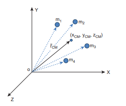

**Figure 5.2 Centre of mass for distributed point masses**

The equation for the \( \mathbf{x} \) coordinate of the centre of mass is,

\[
\mathbf{x}_{\mathrm{CM}} = \frac{\sum \mathbf{m}_i \mathbf{x}_i}{\sum \mathbf{m}_i}
\]

where, \( \sum \mathbf{m}_i \) is the total mass \( M \) of all the particles, \( \left( \sum \mathbf{m}_i = \mathbf{M} \right) \). Hence,

\[
\mathbf{x}_{\mathrm{CM}} = \frac{\sum \mathbf{m}_i \mathbf{x}_i}{\mathbf{M}}  \quad \text{(5.1)}
\]

Similarly, we can also find y and z coordinates of the centre of mass for these distributed point masses as indicated in Figure (5.2).

\[
\mathbf{y}_{\mathrm{CM}} = \frac{\sum \mathbf{m}_i \mathbf{y}_i}{\mathbf{M}}  \quad \text{(5.2)}, 
\mathbf{z}_{\mathrm{CM}} = \frac{\sum \mathbf{m}_i \mathbf{z}_i}{\mathbf{M}} \quad \text{(5.3)}
\]

Hence, the position of centre of mass of these point masses in a Cartesian coordinate system is \( \left( \mathbf{x}_{\mathrm{CM}}, \mathbf{y}_{\mathrm{CM}}, \mathbf{z}_{\mathrm{CM}} \right) \). In general, the position of centre of mass can be written in a vector form as,

\[
\vec{\mathbf{r}}_{\mathrm{CM}} = \frac{\sum \mathbf{m}_i \vec{\mathbf{r}}_i}{\mathbf{M}} \quad \text{(5.4)}
\]

where, \( \vec{\mathbf{r}}_{\mathrm{CM}} = \mathbf{x}_{\mathrm{CM}} \hat{\mathbf{i}} + \mathbf{y}_{\mathrm{CM}} \hat{\mathbf{j}} + \mathbf{z}_{\mathrm{CM}} \hat{\mathbf{k}} \) is the position vector of the centre of mass and \( \vec{\mathbf{r}}_i = \mathbf{x}_i \hat{\mathbf{i}} + \mathbf{y}_i \hat{\mathbf{j}} + \mathbf{z}_i \hat{\mathbf{k}} \) is the position vector of the distributed point mass; where, \( \hat{\mathbf{i}} \), \( \hat{\mathbf{j}} \) and \( \hat{\mathbf{k}} \) are the unit vectors along \( X \), \( Y \) and \( Z \)-axes respectively.

### 5.1.4 Centre of Mass of Two Point Masses

With the equations for centre of mass, let us find the centre of mass of two point masses \( \mathbf{m}_1 \) and \( \mathbf{m}_2 \), which are at positions \( \mathbf{x}_1 \) and \( \mathbf{x}_2 \) respectively on the \( X \)-axis. For this case, we can express the position of centre of mass in the following three ways based on the choice of the coordinate system.

(i) **When the masses are on positive \( X \)-axis:** The origin is taken arbitrarily so that the masses \( \mathbf{m}_1 \) and \( \mathbf{m}_2 \) are at positions \( \mathbf{x}_1 \) and \( \mathbf{x}_2 \) on the positive \( X \)-axis as shown in Figure 5.3(a). The centre of mass will also be on the positive \( X \)-axis at \( \mathbf{x}_{\mathrm{CM}} \) as given by the equation,

\[
\mathbf{x}_{\mathrm{CM}} = \frac{\mathbf{m}_1 \mathbf{x}_1 + \mathbf{m}_2 \mathbf{x}_2}{\mathbf{m}_1 + \mathbf{m}_2}
\]

(ii) **When the origin coincides with any one of the masses:** The calculation could be minimised if the origin of the coordinate system is made to coincide with any one of the masses as shown in Figure 5.3(b). When the origin coincides with the point mass \( \mathbf{m}_1 \), its position \( \mathbf{x}_1 \) is zero, (i.e. \( \mathbf{x}_1 = 0 \)). Then,

\[
\mathbf{x}_{\mathrm{CM}} = \frac{\mathbf{m}_1(0) + \mathbf{m}_2 \mathbf{x}_2}{\mathbf{m}_1 + \mathbf{m}_2} = \frac{\mathbf{m}_2 \mathbf{x}_2}{\mathbf{m}_1 + \mathbf{m}_2}
\]

(iii) **When the origin coincides with the centre of mass itself:** If the origin of the coordinate system is made to coincide with the centre of mass, then, \( x_{\mathrm{CM}} = 0 \) and the mass \( \mathbf{m}_1 \) is found to be on the negative X-axis as shown in Figure 5.3(c). Hence, its position \( x_1 \) is negative, (i.e. \( -x_1 \)).

\[
0 = \frac{\mathbf{m}_1(- \mathbf{x}_1) + \mathbf{m}_2 \mathbf{x}_2}{\mathbf{m}_1 + \mathbf{m}_2}
\]
\[
0 = \mathbf{m}_1(- \mathbf{x}_1) + \mathbf{m}_2 \mathbf{x}_2
\]
\[
\mathbf{m}_1 \mathbf{x}_1 = \mathbf{m}_2 \mathbf{x}_2
\]

The equation given above is known as principle of moments. We will learn more about this in Section 5.3.3.

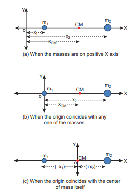
**Figure 5.3 Centre of mass of two point masses determined by shifting the origin**

**EXAMPLE 5.1**

Two point masses \( 3 \, \text{kg} \) and \( 5 \, \text{kg} \) are at \( 4 \, \text{m} \) and \( 8 \, \text{m} \) from the origin on X-axis. Locate the position of centre of mass of the two point masses (i) from the origin and (ii) from \( 3 \, \text{kg} \) mass.

**Solution**

Let us take, \( \mathbf{m}_1 = 3 \, \text{kg} \) and \( \mathbf{m}_2 = 5 \, \text{kg} \)

(i) **To find centre of mass from the origin:** The point masses are at positions, \( x_1 = 4 \, \text{m} \), \( x_2 = 8 \, \text{m} \) from the origin along X axis.

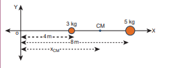
The centre of mass \( x_{\mathrm{CM}} \) can be obtained using the equation 5.4.

\[
x_{\mathrm{CM}} = \frac{\mathbf{m}_1 \mathbf{x}_1 + \mathbf{m}_2 \mathbf{x}_2}{\mathbf{m}_1 + \mathbf{m}_2} = \frac{(3 \times 4) + (5 \times 8)}{3 + 5} = \frac{12 + 40}{8} = \frac{52}{8} = 6.5 \, \text{m}
\]

The centre of mass is located \( 6.5 \, \text{m} \) from the origin on X-axis.

(ii) **To find the centre of mass from \( 3 \, \text{kg} \) mass:** The origin is shifted to \( 3 \, \text{kg} \) mass along X-axis. The position of \( 3 \, \text{kg} \) point mass is zero \( (x_1 = 0) \) and the position of \( 5 \, \text{kg} \) point mass is \( 4 \, \text{m} \) from the shifted origin \( (x_2 = 4 \, \text{m}) \).
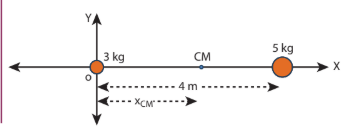
\[
x_{\mathrm{CM}} = \frac{(3 \times 0) + (5 \times 4)}{3 + 5} = \frac{0 + 20}{8} = \frac{20}{8} = 2.5 \, \text{m}
\]

The centre of mass is located \( 2.5 \, \text{m} \) from \( 3 \, \text{kg} \) point mass (and \( 1.5 \, \text{m} \) from the \( 5 \, \text{kg} \) point mass) on X-axis.

This result shows that the centre of mass is located closer to larger mass.

If the origin is shifted to the centre of mass, then the principle of moments holds good. \( m_1 x_1 = m_2 x_2 \); \( 3 \times 2.5 = 5 \times 1.5 \); \( 7.5 = 7.5 \).

When we compare case (i) with case (ii), the \( x_{\mathrm{CM}} = 2.5 \, \text{m} \) from \( 3 \, \text{kg} \) mass could also be obtained by subtracting \( 4 \, \text{m} \) (the position of \( 3 \, \text{kg} \) mass) from \( 6.5 \, \text{m} \), where the centre of mass was located in case (i).

**EXAMPLE 5.2**

From a uniform disc of radius R, a small disc of radius \( \frac{R}{2} \) is cut and removed as shown in the diagram. Find the centre of mass of the remaining portion of the disc.

**Solution**

Let us consider the mass of the uncut full disc be M. Its centre of mass would be at the geometric centre of the disc on which the origin coincides.

Let the mass of the small disc cut and removed be m and its centre of mass is at a position \( \frac{R}{2} \) to the right of the origin as shown in the figure.
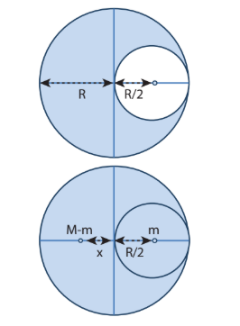
Hence, the remaining portion of the disc should have its centre of mass to the left of the origin; say, at a distance x. We can write from the principle of moments,

\[
(M - m) x = m \left( \frac{R}{2} \right)
\]
\[
x = \frac{m}{M - m} \left( \frac{R}{2} \right)
\]

If \( \sigma \) is the surface mass density (i.e. mass per unit surface area), \( \sigma = \frac{M}{\pi R^2} \); then, the mass m of small disc is,

\[
m = \text{surface mass density} \times \text{surface area} = \sigma \times \pi \left( \frac{R}{2} \right)^2
\]
\[
m = \frac{M}{\pi R^2} \times \pi \frac{R^2}{4} = \frac{M}{4}
\]

Substituting m in the expression for x,

\[
x = \frac{\frac{M}{4}}{M - \frac{M}{4}} \times \frac{R}{2} = \frac{\frac{M}{4}}{\frac{3M}{4}} \times \frac{R}{2} = \frac{1}{3} \times \frac{R}{2} = \frac{R}{6}
\]

The centre of mass of the remaining portion is at a distance \( \frac{\mathrm{R}}{6} \) to the left from the centre of the disc.

If the small disc is removed concentrically from the large disc, what will be the position of the centre of mass of the remaining portion of disc?

**EXAMPLE 5.3**

The position vectors of two point masses \( 10 \, \text{kg} \) and \( 5 \, \text{kg} \) are \( (-3\hat{i} + 2\hat{j} + 4\hat{k}) \, \text{m} \) and \( (3\hat{i} + 6\hat{j} + 5\hat{k}) \, \text{m} \) respectively. Locate the position of centre of mass.

**Solution**

\[
m_1 = 10 \, \text{kg}, \quad m_2 = 5 \, \text{kg}
\]
\[
\vec{r}_1 = (-3\hat{i} + 2\hat{j} + 4\hat{k}) \, \text{m}, \quad \vec{r}_2 = (3\hat{i} + 6\hat{j} + 5\hat{k}) \, \text{m}
\]
\[
\vec{r} = \frac{m_1 \vec{r}_1 + m_2 \vec{r}_2}{m_1 + m_2} = \frac{10(-3\hat{i} + 2\hat{j} + 4\hat{k}) + 5(3\hat{i} + 6\hat{j} + 5\hat{k})}{10 + 5}
\]
\[
= \frac{-30\hat{i} + 20\hat{j} + 40\hat{k} + 15\hat{i} + 30\hat{j} + 25\hat{k}}{15} = \frac{-15\hat{i} + 50\hat{j} + 65\hat{k}}{15}
\]
\[
= \left( -\hat{i} + \frac{10}{3} \hat{j} + \frac{13}{3} \hat{k} \right) \, \text{m}
\]

The centre of mass is located at position \( \vec{r} \).

#### 5.1.5 Centre of mass for uniform distribution of mass

If the mass is uniformly distributed in a bulk object, then a small mass \( (\Delta m) \) of the body can be treated as a point mass and the summations can be done to obtain the expressions for the coordinates of centre of mass.

\[
x_{\mathrm{CM}} = \frac{\sum (\Delta m_i) x_i}{\sum \Delta m_i}, \quad
y_{\mathrm{CM}} = \frac{\sum (\Delta m_i) y_i}{\sum \Delta m_i},  \quad 
z_{\mathrm{CM}} = \frac{\sum (\Delta m_i) z_i}{\sum \Delta m_i}  \quad \text{(5.5)}
\] 

On the other hand, if the small mass taken is infinitesimally* small (dm) then, the summations can be replaced by integrations as given below.

\[
x_{\mathrm{cm}} = \frac{\int x \, dm}{\int dm}, \quad
y_{\mathrm{cm}} = \frac{\int y \, dm}{\int dm},  \quad 
z_{\mathrm{cm}} = \frac{\int z \, dm}{\int dm} \quad \text{(5.6)}
\]

**EXAMPLE 5.4**

Locate the centre of mass of a uniform rod of mass M and length \( \ell \).

**Solution**

Consider a uniform rod of mass M and length \( \ell \) whose one end coincides with the origin as shown in Figure. The rod is kept along the x axis. To find the centre of mass
∗Infinitesimal quantity is an extremely small quantity.
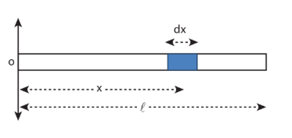
of this rod, we choose an infinitesimally small mass dm of elemental length dx at a distance x from the origin.

Let \( \lambda \) be the linear mass density (i.e. mass per unit length) of the rod. \( \lambda = \frac{M}{\ell} \)

The mass of small element (dm) is, \( dm = \lambda \, dx = \frac{M}{\ell} dx \)

Now, we can write the centre of mass equation for this mass distribution as,

\[
x_{CM} = \frac{\int x \, dm}{\int dm} = \frac{\int_0^{\ell} x \left( \frac{M}{\ell} dx \right)}{M} = \frac{1}{\ell} \int_0^{\ell} x \, dx = \frac{1}{\ell} \left[ \frac{x^2}{2} \right]_0^{\ell} = \frac{1}{\ell} \cdot \frac{\ell^2}{2} = \frac{\ell}{2}
\]

As the position \( \frac{\ell}{2} \) is the geometric centre of the rod, it is concluded that the centre of mass of the uniform rod is located at its geometric centre itself.

#### 5.1.6 Motion of Centre of Mass

When a rigid body moves, its centre of mass will also move along with the body. For kinematic quantities like velocity \( V_{CM} \) and acceleration \( a_{CM} \) of the centre of mass, we can differentiate the expression for position of centre of mass with respect to time once and twice respectively.

For simplicity, let us take the motion along X direction only.
$$\vec{v}_{\text{CM}} = \frac{d\vec{x}_{\text{CM}}}{dt} = \frac{\sum m_i \left(\frac{d\vec{x}_i}{dt}\right)}{\sum m_i}$$

$$\vec{v}_{\text{CM}} = \frac{\sum m_i \vec{v}_i}{\sum m_i} \quad \text{(5.7)}$$

$$\vec{a}_{\text{CM}} = \frac{d}{dt}\left(\frac{d\vec{x}_{\text{CM}}}{dt}\right) = \left(\frac{d\vec{v}_{\text{CM}}}{dt}\right) = \frac{\sum m_i \left(\frac{d\vec{v}_i}{dt}\right)}{\sum m_i}$$

$$\vec{a}_{\text{CM}} = \frac{\sum m_i \vec{a}_i}{\sum m_i} \quad \text{(5.8)}$$

In the absence of external force, i.e. \( \vec{F}_{ext} = 0 \), the individual rigid bodies of a system can move or shift only due to the internal forces. This will not affect the position of the centre of mass. This means that the centre of mass will be in a state of rest or uniform motion. Hence, \( \vec{v}_{CM} \) will be zero when centre of mass is at rest and constant when centre of mass has uniform motion \( (\vec{v}_{CM} = 0 \text{ or } \vec{v}_{CM} = \text{constant}) \). There will be no acceleration of centre of mass, \( \vec{a}_{CM} = 0 \).

From equation, \( \vec{v}_{CM} = \frac{\sum m_i \vec{v}_i}{\sum m_i} = 0 \text{ (or) } \vec{v}_{CM} = \text{constant} \).
It implies
$$\vec{a}_{CM} = \frac{\sum m_i \vec{a}_i}{\sum m_i} = 0$$
Here, the individual particles may still move with their respective velocities and accelerations due to internal forces.

In the presence of external force, (i.e. \( \vec{F}_{\mathrm{ext}} \neq 0 \)), the centre of mass of the system will accelerate as given by the following equation.

\[
\vec{F}_{\mathrm{ext}} = \left( \sum \mathrm{m}_i \right) \vec{a}_{\mathrm{CM}}, \quad \vec{F}_{\mathrm{ext}} = \mathrm{M} \vec{a}_{\mathrm{CM}}, \quad \vec{a}_{\mathrm{CM}} = \frac{\vec{F}_{\mathrm{ext}}}{\mathrm{M}}
\]

**EXAMPLE 5.5**

A man of mass \( 50 \, \text{kg} \) is standing at one end of a boat of mass \( 300 \, \text{kg} \) floating on still water. He walks towards the other end of the boat with a constant velocity of \( 2 \, \text{m} \, \text{s}^{-1} \) with respect to a stationary observer on land. What will be the velocity of the boat, (a) with respect to the stationary observer on land? (b) with respect to the man walking in the boat?
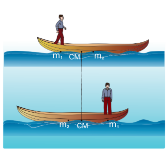
[Given: There is friction between the man and the boat and no friction between the boat and water.]

**Solution**

Mass of the man \( (\mathrm{m}_1) \) is, \( \mathrm{m}_1 = 50 \, \text{kg} \). Mass of the boat \( (\mathrm{m}_2) \) is, \( \mathrm{m}_2 = 300 \, \text{kg} \).

With respect to a stationary observer: The man moves with a velocity \( \mathrm{v}_1 = 2 \, \text{m} \, \text{s}^{-1} \) and the boat moves with a velocity \( \mathrm{v}_2 \) (which is to be found).

(i) **To determine the velocity of the boat with respect to a stationary observer on land:** As there is no external force acting on the system, the man and boat move due to the friction, which is an internal force in the boat-man system. Hence, the velocity of the centre of mass is zero \( (\mathrm{v}_{\mathrm{CM}} = 0) \).

Using the velocity equation 5.7,

$$0 = \frac{\sum m_i v_i}{\sum m_i} = \frac{m_1 v_1 + m_2 v_2}{m_1 + m_2}$$

\[
0 = m_1 v_1 + m_2 v_2
\]
\[
-m_2 v_2 = m_1 v_1
\]
\[
v_2 = -\frac{m_1}{m_2} v_1 = -\frac{50}{300} \times 2 = -\frac{100}{300} = -0.33 \, \text{m} \, \text{s}^{-1}
\]

The negative sign in the answer implies that the boat moves in a direction opposite to that of the walking man on the boat to a stationary observer on land.

(ii) **To determine the velocity of the boat with respect to the walking man:** We can find the relative velocity as,
where, \(v_{21}\) is the relative velocity of the boat
with respect to the walking man.
\[
v_{21} = v_2 - v_1 = (-0.33) - (2) = -2.33 \, \text{m} \, \text{s}^{-1}
\]

The negative sign in the answer implies that the boat appears to move in the opposite direction to the man walking in the boat.

The magnitude of the relative velocity of the boat with respect to the walking man is greater than the magnitude of the relative velocity of the boat with respect to the stationary observer.

The negative signs in the two answers indicate the opposite direction of the boat with respect to the stationary observer and the walking man on the boat.

**Centre of mass in explosions:** Many a times rigid bodies are broken in to fragments. If an explosion is caused by the internal forces in a body which is at rest or in motion, the state of the centre of mass is not affected. It continues to be in the same state of rest or motion. But, the kinematic quantities of the fragments get affected. If the explosion is caused by an external agency, then the kinematic quantities of the centre of mass as well as the fragments get affected.

**EXAMPLE 5.6**

A projectile of mass \( 5 \, \text{kg} \), in its course of motion explodes on its own into two fragments. One fragment of mass \( 3 \, \text{kg} \) falls at three fourth of the range R of the projectile. Where will the other fragment fall?

**Solution**

It is an explosion of its own without any external influence. After the explosion, the centre of mass of the projectile will continue to complete the parabolic path even though the fragments are not following the same parabolic path. After the fragments have fallen on the ground, the centre of mass rests at a distance R (the range) from the point of projection as shown in the diagram.
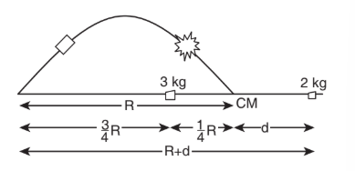
If the origin is fixed to the final position of the centre of mass, the principle of moments holds good.

\[
m_1 x_1 = m_2 x_2
\]

where, \( m_1 = 3 \, \text{kg} \), \( m_2 = 2 \, \text{kg} \), \( x_1 = \frac{1}{4} R \). The value of \( x_2 = d \).

\[
3 \times \frac{1}{4} R = 2 \times d; \quad d = \frac{3}{8} R
\]

The distance between the point of launching and the position of \( 2 \, \text{kg} \) mass is \( R + d \).

\[
R + d = R + \frac{3}{8} R = \frac{11}{8} R = 1.375 R
\]

The other fragment falls at a distance of \( 1.375 R \) from the point of launching. (Here R is the range of the projectile.)

## 5.2 Torque and Angular Momentum

When a net force acts on a body, it produces linear motion in the direction of the applied force. If the body is fixed to a point or an axis, such a force rotates the body depending on the point of application of the force on the body. This ability of the force to produce rotational motion in a body is called torque or moment of force. Examples for such motion are plenty in day to day life. To mention a few; the opening and closing of a door about the hinges and turning of a nut using a wrench.

The extent of the rotation depends on the magnitude of the force, its direction and the distance between the fixed point and the point of application. When torque produces rotational motion in a body, its angular momentum changes with respect to time. In this Section we will learn about the torque and its effect on rigid bodies.

#### 5.2.1 Definition of Torque

Torque is defined as the moment of the external applied force about a point or axis of rotation. The expression for torque is,

\[
\vec{\tau} = \vec{\mathbf{r}} \times \vec{\mathbf{F}}
\]

where, \( \vec{\mathbf{r}} \) is the position vector of the point where the force \( \vec{\mathbf{F}} \) is acting on the body as shown in Figure 5.4.
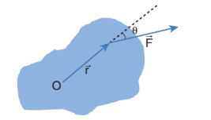
**Figure 5.4 Torque on a rigid body**

Here, the product of \( \vec{\mathbf{r}} \) and \( \vec{\mathbf{F}} \) is called the vector product or cross product. The vector product of two vectors results in another vector that is perpendicular to both the vectors. Hence, torque \( (\vec{\tau}) \) is a vector quantity.

Torque has a magnitude \( rF \sin \theta \) and direction perpendicular to \( \vec{\mathbf{r}} \) and \( \vec{\mathbf{F}} \). Its unit is N m.

$$\vec{\tau} = (rF \sin\theta)\hat{n} \quad \text{(5.10)}$$

Here, \( \theta \) is the angle between \( \vec{\mathbf{r}} \) and \( \vec{\mathbf{F}} \), and \( \hat{\mathbf{n}} \) is the unit vector in the direction of \( \vec{\tau} \). Torque \( (\vec{\tau}) \) is sometimes called as a pseudo vector as it needs the other two vectors \( \vec{\mathbf{r}} \) and \( \vec{\mathbf{F}} \) for its existence.

The direction of torque is found using right hand rule. This rule says that if fingers of right hand are kept along the position vector with palm facing the direction of the force and when the fingers are curled the thumb points to the direction of the torque. This is shown in Figure 5.5.

The direction of torque helps us to find the type of rotation caused by the torque. For example, if the direction of torque is out of the paper, then the rotation produced by the torque is anticlockwise. On the other hand, if the direction of the torque is into the paper, then the rotation is clockwise as shown in Figure 5.6.
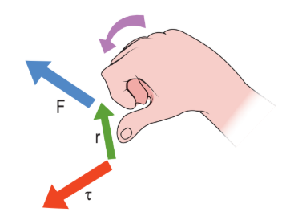
**Figure 5.5 Direction of torque using right hand rule**
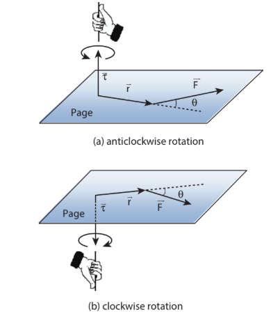
**Figure 5.6 Direction of torque and the type of rotation**

In many cases, the direction and magnitude of the torque are found separately. For direction, we use the vector rule or right hand rule. For magnitude, we use scalar form as,

\[
\tau = r F \sin \theta  \quad \text{(5.11)}
\]

The expression for the magnitude of torque can be written in two different ways by associating \( \sin \theta \) either with \( r \) or \( F \) in the following manner.

\[
\tau = r (F \sin \theta) = r \times (F_{\perp}) \quad \text{(5.12)}
\]
\[
\tau = (r \sin \theta) F = (r_{\perp}) \times F \quad \text{(5.13)}
\]

Here, \( (F \sin \theta) \) is the component of \( \vec{\mathrm{F}} \) perpendicular to \( \vec{\mathrm{r}} \). Similarly, \( (r \sin \theta) \) is the component of \( \vec{\mathrm{r}} \) perpendicular to \( \vec{\mathrm{F}} \). The two cases are shown in Figure 5.7.
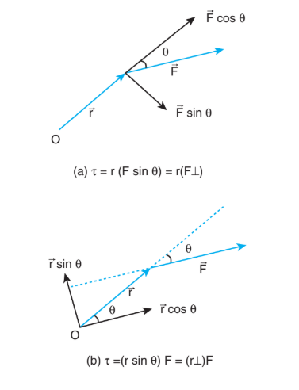
**Figure 5.7 Two ways of calculating the torque**

Based on the angle \( \theta \) between \( \vec{\mathbf{r}} \) and \( \vec{\mathbf{F}} \) the torque takes different values.

The torque is maximum when \( \vec{\mathbf{r}} \) and \( \vec{\mathbf{F}} \) are perpendicular to each other. That is when \( \theta = 90^{\circ} \) and \( \sin 90^{\circ} = 1 \). Hence, \( \tau_{\mathrm{max}} = rF \).

The torque is zero when \( \vec{\mathbf{r}} \) and \( \vec{\mathbf{F}} \) are parallel or antiparallel. If parallel, then \( \theta = 0^{\circ} \) and \( \sin 0^{\circ} = 0 \). If antiparallel, then \( \theta = 180^{\circ} \) and \( \sin 180^{\circ} = 0 \). Hence, \( \tau = 0 \).

The torque is zero if the force acts at the reference point. i.e. as \( \vec{\mathbf{r}} = 0 \), \( \tau = 0 \). The different cases discussed are shown in Table 5.1.
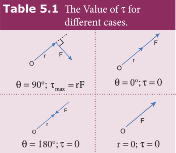
**EXAMPLE 5.7**

If the force applied is perpendicular to the handle of the spanner as shown in the diagram, find the (i) torque exerted by the force about the centre of the nut, (ii) direction of torque and (iii) type of rotation caused by the torque about the nut.
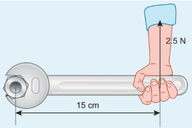
**Solution**

Arm length of the spanner, \( \mathrm{r} = 15 \, \text{cm} = 15 \times 10^{-2} \, \text{m} \)

Force, \( \mathrm{F} = 2.5 \, \text{N} \)

Angle between \( \mathbf{r} \) and \( \mathrm{F} \), \( \theta = 90^{\circ} \)

(i) Torque, \( \tau = rF \sin \theta = 15 \times 10^{-2} \times 2.5 \times \sin 90^{\circ} = 37.5 \times 10^{-2} \, \text{N m} \)

(ii) As per the right hand rule, the direction of torque is out of the page.

(iii) The type of rotation caused by the torque is anticlockwise.

**EXAMPLE 5.8**

A force of \( (4 \hat{\mathbf{i}} - 3 \hat{\mathbf{j}} + 5 \hat{\mathbf{k}}) \, \text{N} \) is applied at a point whose position vector is \( (7 \hat{\mathbf{i}} + 4 \hat{\mathbf{j}} - 2 \hat{\mathbf{k}}) \, \text{m} \). Find the torque of force about the origin.

**Solution**

\[
\bar{\mathbf{r}} = 7 \hat{\mathbf{i}} + 4 \hat{\mathbf{j}} - 2 \hat{\mathbf{k}}, \quad \bar{\mathbf{F}} = 4 \hat{\mathbf{i}} - 3 \hat{\mathbf{j}} + 5 \hat{\mathbf{k}}
\]
\[
\bar{\tau} = \bar{\mathbf{r}} \times \bar{\mathbf{F}} = \begin{vmatrix} \hat{\mathbf{i}} & \hat{\mathbf{j}} & \hat{\mathbf{k}} \\ 7 & 4 & -2 \\ 4 & -3 & 5 \end{vmatrix}
\]
\[
\bar{\tau} = \hat{\mathbf{i}} (20 - 6) - \hat{\mathbf{j}} (35 + 8) + \hat{\mathbf{k}} (-21 - 16) = (14 \hat{\mathbf{i}} - 43 \hat{\mathbf{j}} - 37 \hat{\mathbf{k}}) \, \text{N m}
\]

**EXAMPLE 5.9**

A crane has an arm length of \( 20 \, \text{m} \) inclined at \( 30^{\circ} \) with the vertical. It carries a container of mass of 2 ton suspended from the top end of the arm. Find the torque produced by the gravitational force on the container about the point where the arm is fixed to the crane. [Given: \( 1 \, \text{ton} = 1000 \, \text{kg} \); neglect the weight of the arm. \( \mathrm{g} = 10 \, \text{m} \, \text{s}^{-2} \)]
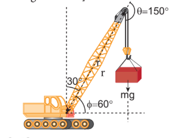
**Solution**

In many problems, the angle \( \theta \) between \( \vec{\mathrm{r}} \) and \( \vec{\mathrm{F}} \) will not be directly given. Thus, the students must get accustomed to identify and denote always the angle between the \( \vec{\mathrm{r}} \) and \( \vec{\mathrm{F}} \) as \( \theta \). The other angles in the arrangement may be denoted as \( \alpha, \beta, \phi \) etc.

The force \( \mathrm{F} \) at the point of suspension is due to the weight of the hanging mass.

\[
\mathrm{F} = \mathrm{mg} = 2 \times 1000 \times 10 = 20000 \, \text{N}
\]
The arm length, \( \mathrm{r} = 20 \, \text{m} \)

We can solve this problem by three different methods.

**Method-I:** The angle \( (\theta) \) between the arm length (r) and the force (F) is, \( \theta = 150^{\circ} \)

\[
\tau = rF \sin \theta = 20 \times 20000 \times \sin 150^{\circ} = 400000 \times \sin (90^{\circ} + 60^{\circ})
\]
\[
= 400000 \times \cos 60^{\circ} = 400000 \times \frac{1}{2} = 200000 \, \text{N m} = 2 \times 10^{5} \, \text{N m}
\]

**Method-II:** Let us take the force and perpendicular distance from the point where the arm is fixed to the crane.
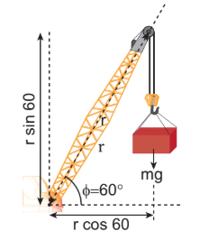
$$\tau = (r_\perp)F$$
$$\tau = r \cos \phi \text{ } mg$$
$$\tau = 20 \times \cos 60^\circ \times 20000$$
$$= 20 \times \frac{1}{2} \times 20000$$
$$\tau = 2 \times 10^5 \text{ Nm}$$

**Method-III:** Let us take the distance from the fixed point and perpendicular force.
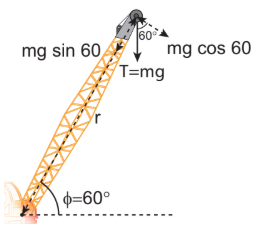
$$\tau = r(F_\perp)$$
$$\tau = r \text{ } mg \cos \phi$$
$$\tau = 20 \times 20000 \times \cos 60^\circ$$
$$= 20 \times 20000 \times \frac{1}{2}$$
$$= 200000 \text{ Nm}$$
$$\tau = 2 \times 10^5 \text{ Nm}$$

All the three methods give the same answer.

**Figure 5.8 Torque about an axis**

#### 5.2.2 Torque about an Axis

In the earlier sections, we have dealt with the torque about a point. In this section we will deal with the torque about an axis. Let us consider a rigid body capable of rotating about an axis AB as shown in Figure 5.8. Let the force F act at a point P on the rigid body. The force F may not be on the plane ABP. We can take the origin O at any random point on the axis AB.
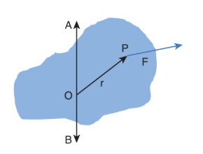

Figure 5.8 Torque about an axis

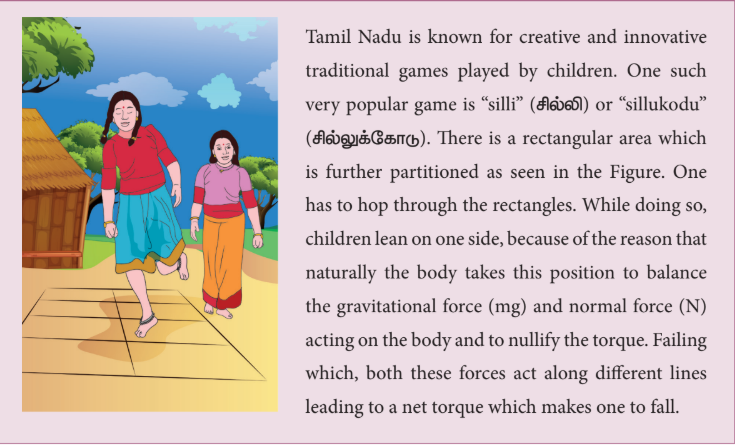
The torque of the force \( \bar{\mathbf{F}} \) about O is, \( \bar{\tau} = \bar{\mathbf{r}} \times \bar{\mathbf{F}} \). The component of the torque \( \bar{\tau} \) along the axis is the torque about the axis. To find it, we should first find the vector \( \bar{\tau} = \bar{\mathbf{r}} \times \bar{\mathbf{F}} \) and then find the angle \( \Phi \) between \( \bar{\tau} \) and the axis AB. (Remember here, the force \( \bar{\mathbf{F}} \) is not on the plane ABP). The torque about the axis AB is the parallel component of the torque along the axis AB, which is \( |\bar{\mathbf{r}} \times \bar{\mathbf{F}}| \cos \Phi \). The torque perpendicular to the axis AB is \( |\bar{\mathbf{r}} \times \bar{\mathbf{F}}| \sin \Phi \).

The torque about the axis will rotate the object about the axis and the torque perpendicular to the axis will turn or tilt the axis of rotation itself. When both components exist simultaneously on a rigid body, the body will have a precession. One can witness the precessional motion in a spinning top when it is about to come to rest as shown in Figure 5.9.
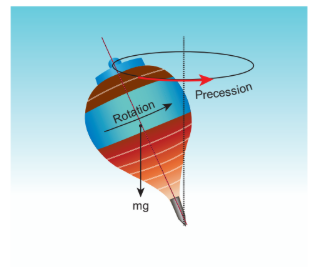
**Figure 5.9 Precession of a spinning top**

Study of precession is beyond the scope of the present course of study. Hence, it is assumed that there are constraints to cancel the effect of the perpendicular components of the torques, so that the fixed position of the axis is maintained. Therefore, perpendicular components of the torque need not be taken into account.

For the rest of the lesson, we consider rotation about only fixed axis. For this we shall,

1. Consider forces that lie only on planes perpendicular to the axis (without intersecting in the axis).
2. Consider position vectors that are only perpendicular to the axis.

Forces parallel to the axis will give torques perpendicular to the axis of rotation and need not be taken into account. Forces that intersect (pass through) the axis cannot produce torque as \( r = 0 \). Position vectors along the axis will result in torques perpendicular to the axis and need not be taken into account.

**EXAMPLE 5.10**

Two mutually perpendicular beams AB, CD, are joined at O to form a structure which is fixed to the ground firmly as shown in the Figure. A string is tied to the point D and its free end E is pulled with a force \( \bar{\mathbf{F}} \). Find the magnitude and direction of the torque produced by the force,

(i) about the points E, D, O and B,
(ii) about the axes DE, CD, AB and BG.
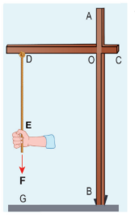
**Solution**

(i) Torque about point E is zero (as \( \bar{\mathrm{F}} \) passes through E). Torque about point D is zero (as \( \bar{\mathrm{F}} \) passes through D). Torque about point O is \( (\overrightarrow{\mathrm{OE}}) \times \overrightarrow{\mathrm{F}} \) which is perpendicular to axes AB and CD. Torque about point B is \( (\overrightarrow{\mathrm{BE}}) \times \overrightarrow{\mathrm{F}} \) which is perpendicular to axes AB and CD.

(ii) Torque about axis DE is zero (as \( \bar{\mathrm{F}} \) is parallel to DE). Torque about axis CD is zero (as \( \bar{\mathrm{F}} \) intersects CD). Torque about axis AB is zero (as \( \bar{\mathrm{F}} \) is parallel to AB). Torque about axis BG is zero (as \( \bar{\mathrm{F}} \) intersects BG).

The torque of a force about an axis is independent of the choice of the origin as long as it is chosen on that axis itself. This can be shown as below.

Let O be the origin on the axis AB, which is the rotational axis of a rigid body. F is the force acting at the point P. Now, choose another point O' anywhere on the axis as shown in Figure 5.10.
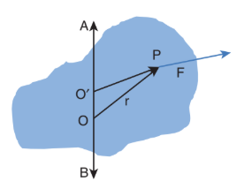
**Figure 5.10 Torque about an axis is independent of origin**

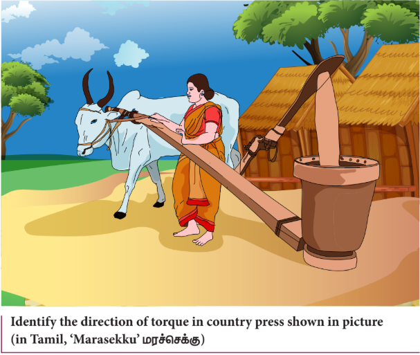
The torque of F about 'O' is,

\[
\overrightarrow{\mathrm{O}^{\prime} \mathrm{P}} \times \vec{\mathrm{F}} = \left( \overrightarrow{\mathrm{O}^{\prime} \mathrm{O}} + \overrightarrow{\mathrm{OP}} \right) \times \vec{\mathrm{F}} = \left( \overrightarrow{\mathrm{O}^{\prime} \mathrm{O}} \times \vec{\mathrm{F}} \right) + \left( \overrightarrow{\mathrm{OP}} \times \vec{\mathrm{F}} \right)
\]

As \( \overrightarrow{\mathrm{O}^{\prime} \mathrm{O}} \times \vec{\mathrm{F}} \) is perpendicular to \( \overrightarrow{\mathrm{O}^{\prime} \mathrm{O}} \), this term will not have a component along AB. Thus, the component of \( \overrightarrow{\mathrm{O}^{\prime} \mathrm{P}} \times \vec{\mathrm{F}} \) is equal to that of \( \overrightarrow{\mathrm{OP}} \times \vec{\mathrm{F}} \).

#### 5.2.3 Torque and Angular Acceleration

Let us consider a rigid body rotating about a fixed axis. A point mass m in the body will execute a circular motion about a fixed axis as shown in Figure 5.11. A tangential force \( \vec{\mathrm{F}} \) acting on the point mass produces the necessary torque for this rotation. This force \( \vec{\mathrm{F}} \) is perpendicular to the position vector \( \vec{\mathrm{r}} \) of the point mass.
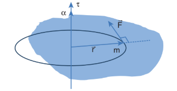
**Figure 5.11 Torque and Angular acceleration**

The torque produced by the force on the point mass m about the axis can be written as,

\[
\tau = rF \sin 90^{\circ} = rF \quad (\because \sin 90^{\circ} = 1)
\]
\[
\tau = r m a \quad (\because F = ma)
\]
\[
\tau = r m r \alpha = m r^{2} \alpha \quad (\because a = r \alpha)
\]
\[
\tau = (m r^{2}) \alpha \quad \text{(5.14)}
\]

Hence, the torque of the force acting on the point mass produces an angular acceleration \( (\alpha) \) in the point mass about the axis of rotation.

In vector notation,

\[
\vec{\tau} = (m r^{2}) \vec{\alpha} \quad \text{(5.15)}
\]

The directions of \( \tau \) and \( \alpha \) are along the axis of rotation. If the direction of \( \tau \) is in the direction of \( \alpha \), it produces angular acceleration. On the other hand if, \( \tau \) is opposite to \( \alpha \), angular deceleration or retardation is produced on the point mass.

The term \( m r^{2} \) in the equations 5.14 and 5.15 is called moment of inertia (I) of the point mass. A rigid body is made up of many such point masses. Hence, the moment of inertia of a rigid body is the sum of moments of inertia of all such individual point masses that constitute the body \( \left( \mathrm{I} = \sum m_i r_i^{2} \right) \). Hence, torque for the rigid body can be written as,

$$\vec{\tau} = \left(\sum m_i r_i^2\right)\vec{\alpha} \quad \text{(5.16)}$$
$$\vec{\tau} = I\vec{\alpha} \quad \text{(5.17)}$$

We will learn more about the moment of inertia and its significance for bodies with different shapes in section 5.4.

#### 5.2.4 Angular Momentum

The angular momentum in rotational motion is equivalent to linear momentum in translational motion. The angular momentum of a point mass is defined as the moment of its linear momentum. In other words, the angular momentum L of a point mass having a linear momentum p at a position r with respect to a point or axis is mathematically written as,

\[
\vec{L} = \vec{r} \times \vec{p}  \quad \text{(5.18)}
\]

The magnitude of angular momentum could be written as,

\[
L = r p \sin \theta  \quad \text{(5.19)}
\]

where, \( \theta \) is the angle between \( \vec{\mathbf{r}} \) and \( \vec{\mathbf{p}} \). \( \vec{\mathbf{L}} \) is perpendicular to the plane containing \( \vec{\mathbf{r}} \) and \( \vec{\mathbf{p}} \). As we have written in the case of torque, here also we can associate \( \sin \theta \) with either \( \vec{\mathbf{r}} \) or \( \vec{\mathbf{p}} \).

\[
L = r (p \sin \theta) = r (p_{\perp}) \quad \text{(5.20)}
\]
\[
L = (r \sin \theta) p = (r_{\perp}) p \quad \text{(5.21)}
\]

where, \( p_{\perp} \) is the component of linear momentum p perpendicular to r, and \( r_{\perp} \) is the component of position r perpendicular to p.

The angular momentum is zero \( (L = 0) \) if the linear momentum is zero \( (p = 0) \) or if the particle is at the origin \( (\vec{\mathbf{r}} = 0) \) or if \( \vec{\mathbf{r}} \) and \( \vec{\mathbf{p}} \) are parallel or antiparallel to each other (\( \theta = 0^{\circ} \) or \( 180^{\circ} \)).

There is a misconception that the angular momentum is a quantity that is associated only with rotational motion. It is not true. The angular momentum is also associated with bodies in the linear motion. Let us understand the same with the following example.

**EXAMPLE 5.11**

A particle of mass (m) is moving with constant velocity (v). Show that its angular momentum about any point remains constant throughout the motion.
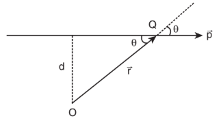
**Solution**

Let the particle of mass m move with constant velocity \( \vec{\mathbf{v}} \). As it is moving with constant velocity, its path is a straight line. Its momentum \( \left( \vec{\mathbf{p}} = \mathbf{m} \vec{\mathbf{v}} \right) \) is also directed along the same path. Let us fix an origin (O) at a perpendicular distance (d) from the path. At a particular instant, we can connect the particle which is at position Q with a position vector \( \left( \vec{\mathbf{r}} = \overline{\mathbf{OQ}} \right) \).

Take the angle between the \( \vec{\mathbf{r}} \) and \( \vec{\mathbf{p}} \) as \( \theta \). The magnitude of angular momentum of that particle at that instant is,

\[
L = OQ \, p \sin \theta = OQ \, m v \sin \theta = m v (OQ \sin \theta)
\]

The term \( (OQ \sin \theta) \) is the perpendicular distance (d) between the origin and line along which the mass is moving. Hence, the angular momentum of the particle about the origin is,

\[
L = m v d
\]

The above expression for angular momentum L does not have the angle \( \theta \). As the momentum \( (p = mv) \) and the perpendicular distance (d) are constants, the angular momentum of the particle is also
constant. Hence, the angular momentum is associated with bodies with linear motion also. If the straight path of the particle passes through the origin, then the angular momentum is zero, which is also a constant.

#### 5.2.5 Angular Momentum and Angular Velocity

Let us consider a rigid body rotating about a fixed axis. A point mass m in the body will execute a circular motion about the fixed axis as shown in Figure 5.12.
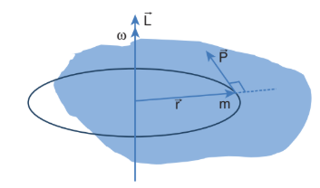
**Figure 5.12 Angular momentum and angular velocity**

The point mass m is at a distance r from the axis of rotation. Its linear momentum at any instant is tangential to the circular path. Then the angular momentum \( \vec{L} \) is perpendicular to \( \vec{\mathbf{r}} \) and \( \vec{\mathbf{p}} \). Hence, it is directed along the axis of rotation. The angle \( \theta \) between \( \vec{\mathbf{r}} \) and \( \vec{\mathbf{p}} \) in this case is \( 90^{\circ} \). The magnitude of the angular momentum L could be written as,

\[
L = r m v \sin 90^{\circ} = r m v
\]

where, \( v \) is the linear velocity. The relation between linear velocity v and angular velocity \( \omega \) in a circular motion is, \( v = r \omega \). Hence,

\[
L = r m r \omega = (m r^{2}) \omega   \quad \text{(5.22)}
\]

The directions of L and \( \omega \) are along the axis of rotation. The above expression can be written in the vector notation as,

\[
\vec{\mathrm{L}} = (m r^{2}) \vec{\omega}   \quad \text{(5.23)}
\]

As discussed earlier, the term \( mr^{2} \) in equations 5.22 and 5.23 is called moment of inertia (I) of the point mass. A rigid body is made up of many such point masses. Hence, the moment of inertia of a rigid body is the sum of moments of inertia of all such individual point masses that constitute the body \( \left( \mathrm{I} = \sum m_i r_i^{2} \right) \). Hence, the angular momentum of the rigid body can be written as,

\[
\vec{\mathrm{L}} = \left( \sum m_i r_i^{2} \right) \quad \text{(5.24)} \vec{\omega} = I \vec{\omega} \quad \text{(5.25)}
\]

The study about moment of inertia (I) is reserved for Section 5.4.

#### 5.2.6 Torque and Angular Momentum

We have the expression for magnitude of angular momentum of a rigid body as, \( L = I \omega \). The expression for magnitude of torque on a rigid body is, \( \tau = I \alpha \).

We can further write the expression for torque as,

\[
\tau = I \frac{d\omega}{dt} \quad \left( \because \alpha = \frac{d\omega}{dt} \right) \quad \text{(5.26)}
\]

Where, ω is angular velocity and \(alpha\) is angular acceleration. We can also write equation 5.26 as,

\[
\tau = \frac{d(I \omega)}{dt} = \frac{dL}{dt} \quad \text{(5.27)}
\]

The above expression says that an external torque on a rigid body fixed to an axis produces rate of change of angular momentum in the body about that axis.

This is the Newton's second law in rotational motion as it is in the form of \( \mathrm{F} = \frac{d\mathrm{p}}{dt} \) which holds good for translational motion.

**Conservation of angular momentum:** From the above expression we could conclude that in the absence of external torque, the angular momentum of the rigid body or system of particles is conserved.

\[
\text{if } \tau = 0 \text{ then}, \frac{dL}{dt} = 0, \quad L = \text{constant}
\]

The above expression is known as law of conservation of angular momentum. We will learn about this law further in section 5.5.

## 5.3 Equilibrium of Rigid Bodies

When a body is at rest without any motion on a table, we say that there is no force acting on the body. Actually it is wrong because, there is gravitational force acting on the body downward and also the normal force exerted by table on the body upward. These two forces cancel each other and thus there is no net force acting on the body. There is a lot of difference between the terms "no force" and "no net force" acting on a body. The same argument holds good for rotational conditions in terms of torque or moment of force.

A rigid body is said to be in mechanical equilibrium when both its linear momentum and angular momentum remain constant.

When the linear momentum remains constant, the net force acting on the body is zero.

\[
\vec{\mathrm{F}}_{\mathrm{net}} = 0  \quad \text{(5.28)}
\]

In this condition, the body is said to be in translational equilibrium. This implies that the vector sum of different forces \( \bar{\mathrm{F}}_1, \bar{\mathrm{F}}_2, \bar{\mathrm{F}}_3 \dots \) acting in different directions on the body is zero.

\[
\vec{\mathrm{F}}_1 + \vec{\mathrm{F}}_2 + \vec{\mathrm{F}}_3 + \dots + \vec{\mathrm{F}}_n = 0  \quad \text{(5.29)}
\]

If the forces \( \vec{\mathrm{F}}_1, \vec{\mathrm{F}}_2, \vec{\mathrm{F}}_3 \dots \) act in different directions on the body, we can resolve them into horizontal and vertical components and then take the resultant in the respective directions. In this case there will be horizontal as well as vertical equilibria possible.

Similarly, when the angular momentum remains constant, the net torque acting on the body is zero.

\[
\vec{\tau}_{\mathrm{net}} = 0  \quad \text{(5.30)}
\]

Under this condition, the body is said to be in rotational equilibrium. The vector sum of different torques \( \vec{\tau}_1, \vec{\tau}_2, \vec{\tau}_3 \dots \) producing different senses of rotation on the body is zero.

\( \vec{\tau}_1 + \vec{\tau}_2 + \vec{\tau}_3 + \dots + \vec{\tau}_n  = 0 \quad \text{(5.31)}\)

Thus, we can also conclude that a rigid body is in mechanical equilibrium when the net force and net torque acts on the body is zero.

\(\vec{\mathrm{F}}_{net} = 0  \text{and}  \vec{\tau}_{net}  = 0   \quad \text{(5.32)}\)

As the forces and torques are vector quantities, the directions are to be taken with proper sign conventions.

#### 5.3.1 Types of Equilibrium

Based on the above discussions, we come to a conclusion that different types of equilibrium are possible based on the different conditions. They are consolidated in Table 5.2.

**Table 5.2 Different types of Equilibrium and their Conditions**

| Type of equilibrium | Conditions |
|---|---|
| Translational equilibrium | · Linear momentum is constant. · Net force is zero. |
| Rotational equilibrium | · Angular momentum is constant. · Net torque is zero. |
| Static equilibrium | · Linear momentum and angular momentum are zero. · Net force and net torque are zero. |
| Dynamic equilibrium | · Linear momentum and angular momentum are constant. · Net force and net torque are zero. |
| Stable equilibrium | · Linear momentum and angular momentum are zero. · The body tries to come back to equilibrium if slightly disturbed and released. · The centre of mass of the body shifts slightly higher if disturbed from equilibrium. · Potential energy of the body is minimum and it increases if disturbed. |
| Unstable equilibrium | · Linear momentum and angular momentum are zero. · The body cannot come back to equilibrium if slightly disturbed and released. · The centre of mass of the body shifts slightly lower if disturbed from equilibrium. · Potential energy of the body is not minimum and it decreases if disturbed. |
| Neutral equilibrium | · Linear momentum and angular momentum are zero. · The body remains at the same equilibrium if slightly disturbed and released. · The centre of mass of the body does not shift higher or lower if disturbed from equilibrium. · Potential energy remains same even if disturbed. |

## EXAMPLE 5.12
Arun and Babu carry a wooden log of mass $28\text{ kg}$ and length $10\text{ m}$ which has almost uniform thickness. They hold it at $1\text{ m}$ and $2\text{ m}$ from the ends respectively. Who will bear more weight of the log? $[g = 10\text{ ms}^{-2}]$

**Solution**

Let us consider the log is in mechanical equilibrium. Hence, the net force and net torque on the log must be zero. The gravitational force acts at the centre of mass of the log downwards. It is cancelled by the normal reaction forces $R_A$ and $R_B$ applied upwards by Arun and Babu at points A and B respectively. These reaction forces are the weights borne by them.

The total weight, $W = mg = 28 \times 10 = 280\text{ N}$, has to be borne by them together. The reaction forces are the weights borne by each of them separately. Let us show all the forces acting on the log by drawing a free body diagram of the log.

For translational equilibrium:

The net force acting on the log must be zero.

$$R_A + (-mg) + R_B = 0$$

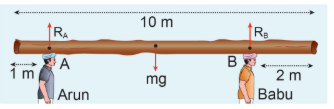

Here, the forces $R_A$ and $R_B$ are taken positive as they act upward. The gravitational force acting downward is taken negative.

$$R_A + R_B = mg $$
For rotational equilibrium:

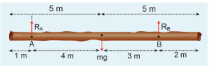

The net torque acting on the log must be zero. For ease of calculation, we can take the torque caused by all the forces about the point A on the log. The forces are perpendicular to the distances. Hence,
$$(0R_A) + (-4mg) + (7R_B) = 0.$$

Here, the reaction force $R_A$ cannot produce any torque as the reaction forces pass through the point of reference A. The torque of force $mg$ produces a clockwise turn about the point A which is taken negative and torque of force $R_B$ causes anticlockwise turn about A which is taken positive.

$$7R_B = 4mg$$
$$R_B = \frac{4}{7}mg$$
$$R_B = \frac{4}{7} \times 28 \times 10 = 160\text{ N}$$
By substituting for $R_B$ we get,
$$R_A = mg - R_B$$
$$R_A = 280 - 160 = 120\text{ N}$$

As $R_B$ is greater than $R_A$, it is concluded that Babu bears more weight than Arun. The one closer to centre of mass of the log bears more weight.

#### 5.3.2 Couple

Consider a thin uniform rod AB. Its centre of mass is at its midpoint C. Let two forces which are equal in magnitude and opposite in direction be applied at the two ends A and B of the rod perpendicular to it. The two forces are separated by a distance of \( 2\pi \) as shown in Figure 5.13.
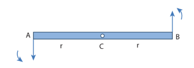
**Figure 5.13 Couple**

As the two equal forces are opposite in direction, they cancel each other and the net force acting on the rod is zero. Now the rod is in translational equilibrium. But, the rod is not in rotational equilibrium. Let us see how it is not in rotational equilibrium. The moment of the force applied at the end A taken with respect to the centre point C, produces an anticlockwise rotation. Similarly, the moment of the force applied at the end B also produces an anticlockwise rotation. The moments of both the forces cause the same sense of rotation in the rod. Thus, the rod undergoes a rotational motion or turning even though the rod is in translational equilibrium.
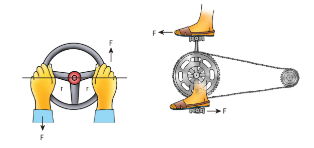

Figure 5.14 Turning effect of Couple

A pair of forces which are equal in magnitude but opposite in direction and separated by a perpendicular distance so that their lines of action do not coincide that causes a turning effect is called a couple. We come across couple in many of our daily activities as shown in Figure 5.14.

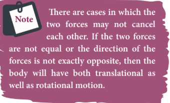

#### 5.3.3 Principle of Moments

Consider a light rod of negligible mass which is pivoted at a point along its length. Let two parallel forces \( \mathrm{F}_{1} \) and \( \mathrm{F}_{2} \) act at the two ends at distances \( \mathrm{d}_{1} \) and \( \mathrm{d}_{2} \) from the point of pivot and the normal reaction force N at the point of pivot as shown in Figure 5.15. If the rod has to remain stationary in horizontal position, it should be in translational and rotational equilibrium. Then, both the net force and net torque must be zero.
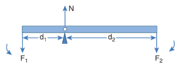
**Figure 5.15 Principle of Moments**

For translational equilibrium, net force has to be zero,
\[
-\mathrm{F}_{1} + \mathrm{N} - \mathrm{F}_{2} = 0, \quad \mathrm{N} = \mathrm{F}_{1} + \mathrm{F}_{2}
\]

For rotational equilibrium, net torque has to be zero,
\[
\mathrm{d}_{1} \mathrm{F}_{1} - \mathrm{d}_{2} \mathrm{F}_{2} = 0, \quad \mathrm{d}_{1} \mathrm{F}_{1} = \mathrm{d}_{2} \mathrm{F}_{2}   \quad \text{(5.33)}
\]

The above equation represents the principle of moments. This forms the principle for beam balance used for weighing goods with the condition \( \mathrm{d}_{1} = \mathrm{d}_{2}, \mathrm{F}_{1} = \mathrm{F}_{2} \). We can rewrite the equation as 5.33,

\[
\frac{\mathrm{F}_{1}}{\mathrm{F}_{2}} = \frac{\mathrm{d}_{2}}{\mathrm{d}_{1}} \quad \text{(5.34)}
\]

If \( \mathrm{F}_{1} \) is the load and \( \mathrm{F}_{2} \) is our effort, we get advantage when \( \mathrm{d}_{1} < \mathrm{d}_{2} \). This implies that \( \mathrm{F}_{1} > \mathrm{F}_{2} \). Hence, we could lift a large load with small effort. The ratio \( \left( \frac{\mathrm{d}_{2}}{\mathrm{d}_{1}} \right) \) is called mechanical advantage of the simple lever. The pivoted point is called fulcrum.

\[
\text{Mechanical Advantage (MA)} = \frac{\mathrm{d}_{2}}{\mathrm{d}_{1}} \quad \text{(5.35)}
\]

There are many simple machines that work on the above mentioned principle.

#### 5.3.4 Centre of Gravity

Each rigid body is made up of several point masses. Such point masses experience gravitational force towards the centre of Earth. As the size of Earth is very large compared to any practical rigid body we come across in daily life, these forces appear to be acting parallelly downwards as shown in Figure 5.16.
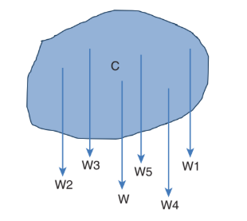
**Figure 5.16 Centre of gravity**

The resultant of these parallel forces always acts through a point. This point is called centre of gravity of the body (with respect to Earth). The centre of gravity of a body is the point at which the entire weight of the body acts irrespective of the position and orientation of the body. The centre of gravity and centre of mass of a rigid body coincide when the gravitational field is uniform across the body. The concept of gravitational field is dealt in Unit 6.

We can also determine the centre of gravity of a uniform lamina of even an irregular shape by pivoting it at various points by trial and error. The lamina remains horizontal when pivoted at the point where the net gravitational force acts, which is the centre of gravity as shown in Figure 5.17. When a body is supported at the centre of gravity, the sum of the torques acting on all the point masses of the rigid body becomes zero. Moreover the weight is compensated by the normal reaction force exerted by the pivot. The body is in static equilibrium and hence it remains horizontal.
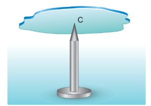
**Figure 5.17 Determination of centre of gravity of plane lamina by pivoting**

There is also another way to determine the centre of gravity of an irregular lamina. If we suspend the lamina from different points like P, Q, R as shown in Figure 5.18, the vertical lines PP', QQ', RR' all pass through the centre of gravity. Here, reaction force acting at the point of suspension and the gravitational force acting at the centre of gravity cancel each other and the torques caused by them also cancel each other.
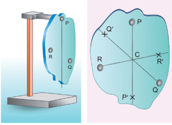
**Figure 5.18 Determination of centre of gravity of plane lamina by suspending**

#### 5.3.5 Bending of Cyclist in Curves

Let us consider a cyclist negotiating a circular level road (not banked) of radius r with a speed v. The cycle and the cyclist are considered as one system with mass m. The centre gravity of the system is C and it goes in a circle of radius r with centre at O. Let us choose the line OC as X-axis and the vertical line through O as Z-axis as shown in Figure 5.19.
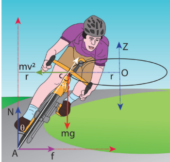
**Figure 5.19 Bending of cyclist**

The system as a frame is rotating about Z-axis. The system is at rest in this rotating frame. To solve problems in rotating frame of reference, we have to apply a centrifugal force (pseudo force) on the system which will be \( \frac{m v^{2}}{r} \). This force will act through the centre of gravity. The forces acting on the system are, (i) gravitational force (mg), (ii) normal force (N), (iii) frictional force (f) and (iv) centrifugal force \( \left( \frac{m v^{2}}{r} \right) \). As the system is in equilibrium in the rotational frame of reference, the net external force and net external torque must be zero. Let us consider all torques about the point A in Figure 5.20.
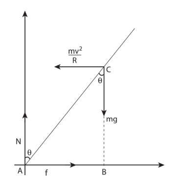
**Figure 5.20 Force diagrams for the cyclist in turns**

For rotational equilibrium, \( \vec{\tau}_{\mathrm{net}} = 0 \).

The torque due to the gravitational force about point A is \( (mg \cdot AB) \) which causes a clockwise turn that is taken as negative. The torque due to the centrifugal force is \( \left( \frac{m v^{2}}{r} \cdot BC \right) \) which causes an anticlockwise turn that is taken as positive.

\[
-mg \cdot AB + \frac{m v^{2}}{r} \cdot BC = 0
\]
\[
mg \cdot AB = \frac{m v^{2}}{r} \cdot BC
\]

From \( \Delta \) ABC, \( AB = AC \sin \theta \) and \( BC = AC \cos \theta \)

\[
mg \cdot AC \sin \theta = \frac{m v^{2}}{r} \cdot AC \cos \theta
\]
\[
\tan \theta = \frac{v^{2}}{r g}
\]
\[
\theta = \tan^{-1} \left( \frac{v^{2}}{r g} \right) \quad \text{(5.36)}
\]

While negotiating a circular level road of radius r at velocity v, a cyclist has to bend by an angle \( \theta \) from vertical given by the above expression to stay in equilibrium (i.e. to avoid a fall).

**EXAMPLE 5.13**

A cyclist while negotiating a circular path with speed \( 20 \, \text{m} \, \text{s}^{-1} \) is found to bend an angle by \( 30^{\circ} \) with vertical. What is the radius of the circular path? (given, \( \mathrm{g} = 10 \, \text{m} \, \text{s}^{-2} \))

**Solution**

Speed of the cyclist ($v$): $20\text{ m s}^{-1}$

Angle of bending with vertical ($\theta$):$30^\circ$

Equation for the angle of bending: $$\tan\theta = \frac{v^2}{rg}$$

Rewriting the equation to solve for the radius ($r$):$$r = \frac{v^2}{\tan\theta \cdot g}$$

Substituting,

$$r = \frac{(20)^2}{(\tan 30^\circ) \times 10} = \frac{20 \times 20}{(\tan 30^\circ) \times 10}$$

$$r = \frac{400}{\left(\frac{1}{\sqrt{3}}\right) \times 10}$$

$$r = (\sqrt{3}) \times 40 = 1.732 \times 40$$

$$r = 69.28\text{ m}$$

## 5.4 Moment of Inertia

In the expressions for torque and angular momentum for rigid bodies (which are considered as bulk objects), we have come across a term \( \sum m_i r_i^{2} \). This quantity is called moment of inertia (I) of the bulk object. For point mass \( m_i \) at a distance \( r_i \) from the fixed axis, the moment of inertia is given as, \( m_i r_i^{2} \).

Moment of inertia for point mass: \( \mathrm{I} = m_i r_i^{2} \)  $\quad \text{(5.37)}$

Moment of inertia for bulk object: \( \mathrm{I} = \sum m_i r_i^{2} \)   $\quad \text{(5.38)}$

In translational motion, mass is a measure of inertia; in the same way, for rotational motion, moment of inertia is a measure of rotational inertia. The unit of moment of inertia is \( \text{kg m}^{2} \). Its dimension is \( \mathrm{ML}^{2} \). In general, mass is an invariable quantity of matter (except for motion comparable to that of light). But, the moment of inertia of a body is not an invariable quantity. It depends not only on the mass of the body, but also on the way the mass is distributed around the axis of rotation.

To find the moment of inertia of a uniformly distributed mass; we have to consider an infinitesimally small mass (dm) as a point mass and take its position (r) with respect to an axis. The moment of inertia of this point mass can now be written as,

\[
dI = (dm) r^{2}  \quad \text{(5.39)}
\]

We get the moment of inertia of the entire bulk object by integrating the above expression.

\[
I = \int dI = \int (dm) r^{2} = \int r^{2} dm  \quad \text{(5.40)}
\]

We can use the above expression for determining the moment of inertia of some of the common bulk objects of interest like rod, ring, disc, sphere etc.

### 5.4.1 Moment of Inertia of a Uniform Rod

Let us consider a uniform rod of mass (M) and length \( (\ell) \) as shown in Figure 5.21. Let us find an expression for moment of inertia of this rod about an axis that passes through the centre of mass and perpendicular to the rod.
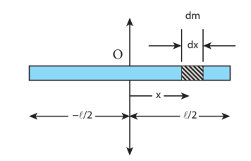
**Figure 5.21 Moment of inertia of uniform rod**

First an origin is to be fixed for the coordinate system so that it coincides with the centre of mass, which is also the geometric centre of the rod. The rod is now along the x axis. We take an infinitesimally small mass (dm) at a distance \( (x) \) from the origin. The moment of inertia (dI) of this mass (dm) about the axis is,

\[
dI = (dm) x^{2}
\]

As the mass is uniformly distributed, the mass per unit length \( (\lambda) \) of the rod is, \( \lambda = \frac{M}{\ell} \).

The dm mass of the infinitesimally small length is, \( dm = \lambda dx = \frac{M}{\ell} dx \).

The moment of inertia (I) of the entire rod can be found by integrating dI,

\[
I = \int dI = \int (dm) x^{2} = \int \left( \frac{M}{\ell} dx \right) x^{2} = \frac{M}{\ell} \int x^{2} dx
\]

As the mass is distributed on either side of the origin, the limits for integration are taken from \( -\ell/2 \) to \( \ell/2 \).

\[
I = \frac{M}{\ell} \int_{-\ell/2}^{\ell/2} x^{2} dx = \frac{M}{\ell} \left[ \frac{x^{3}}{3} \right]_{-\ell/2}^{\ell/2}
\]
\[
I = \frac{M}{\ell} \left[ \frac{\ell^{3}}{24} - \left( -\frac{\ell^{3}}{24} \right) \right] = \frac{M}{\ell} \left[ \frac{\ell^{3}}{24} + \frac{\ell^{3}}{24} \right] = \frac{M}{\ell} \left[ 2 \left( \frac{\ell^{3}}{24} \right) \right] = \frac{1}{12} M \ell^{2}  \quad \text{(5.41)}
\]

**EXAMPLE 5.14**

Find the moment of inertia of a uniform rod about an axis which is perpendicular to the rod and touches any one end of the rod.

**Solution**

The concepts to form the integrand to find the moment of inertia could be borrowed from the earlier derivation. Now, the origin is fixed to the left end of the rod and the limits are to be taken from 0 to \( \ell \).
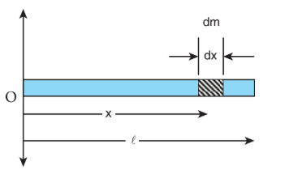
\[
I = \frac{M}{\ell} \int_{0}^{\ell} x^{2} dx = \frac{M}{\ell} \left[ \frac{x^{3}}{3} \right]_{0}^{\ell} = \frac{M}{\ell} \cdot \frac{\ell^{3}}{3} = \frac{1}{3} M \ell^{2}
\]

**Note**
The moment of inertia of the same uniform rod is different about different axes of reference. The reference axes could be even outside the object. We have two useful theorems to calculate the moments of inertia about different axes. We shall see these theorems in Section 5.4.5.

### 5.4.2 Moment of Inertia of a Uniform Ring

Let us consider a uniform ring of mass M and radius R. To find the moment of inertia of the ring about an axis passing through its centre and perpendicular to the plane, let us take an infinitesimally small mass (dm) of length (dx) of the ring. This (dm) is located at a distance R, which is the radius of the ring from the axis as shown in Figure 5.22.
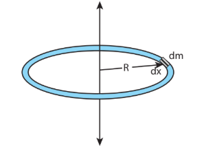
**Figure 5.22 Moment of inertia of a uniform ring**

The moment of inertia (dI) of this small mass (dm) is,

\[
dI = (dm) R^{2}
\]

The length of the ring is its circumference \( (2\pi R) \). As the mass is uniformly distributed, the mass per unit length \( (\lambda) \) is,

\[
\lambda = \frac{\text{mass}}{\text{length}} = \frac{M}{2\pi R}
\]

The mass (dm) of the infinitesimally small length is, \( dm = \lambda dx = \frac{M}{2\pi R} dx \).

Now, the moment of inertia (I) of the entire ring is,

\[
I = \int dI = \int (dm) R^{2} = \int \left( \frac{M}{2\pi R} dx \right) R^{2} = \frac{MR}{2\pi} \int dx
\]

To cover the entire length of the ring, the limits of integration are taken from 0 to \( 2\pi R \).

\[
I = \frac{MR}{2\pi} \int_{0}^{2\pi R} dx = \frac{MR}{2\pi} [x]_{0}^{2\pi R} = \frac{MR}{2\pi} (2\pi R - 0) = MR^{2}  \quad \text{(5.42)}
\] 

### 5.4.3 Moment of Inertia of a Uniform Disc

Consider a disc of mass M and radius R. This disc is made up of many infinitesimally small rings as shown in Figure 5.23. Consider one such ring of mass (dm) and thickness (dr) and radius (r). The moment of inertia (dI) of this small ring is,

\[
dI = (dm) r^{2}
\]

As the mass is uniformly distributed, the mass per unit area \( (\sigma) \) is, \( \sigma = \frac{\text{mass}}{\text{area}} = \frac{M}{\pi R^{2}} \).
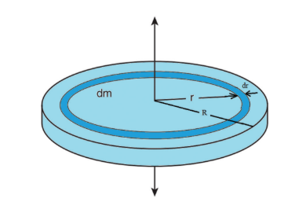
**Figure 5.23 Moment of inertia of a uniform disc**

The mass of the infinitesimally small ring is,

\[
dm = \sigma \cdot 2\pi r \, dr = \frac{M}{\pi R^{2}} \cdot 2\pi r \, dr = \frac{2M}{R^{2}} r \, dr
\]

where, the term \( (2\pi r \, dr) \) is the area of this elemental ring (\( 2\pi r \) is the length and dr is the thickness).

\[
dI = \frac{2M}{R^{2}} r^{3} dr
\]

The moment of inertia (I) of the entire disc is,

\[
I = \int dI = \int_{0}^{R} \frac{2M}{R^{2}} r^{3} dr = \frac{2M}{R^{2}} \int_{0}^{R} r^{3} dr = \frac{2M}{R^{2}} \left[ \frac{r^{4}}{4} \right]_{0}^{R} = \frac{2M}{R^{2}} \cdot \frac{R^{4}}{4} = \frac{1}{2} MR^{2}
\]

### 5.4.4 Radius of Gyration

For bulk objects of regular shape with uniform mass distribution, the expression for moment of inertia about an axis involves their total mass and geometrical features like radius, length, breadth, which take care of the shape and the size of the objects. But, we need an expression for the moment of inertia which could take care of not only the mass, shape and size of objects, but also its orientation to the axis of rotation. Such an expression should be general so that it is applicable even for objects of irregular shape and non-uniform distribution of mass. The general expression for moment of inertia is given as,

\[
I = M K^{2}  \quad \text{(5.44)}
\]

where, M is the total mass of the object and K is called the radius of gyration.

The radius of gyration of an object is the perpendicular distance from the axis of rotation to an equivalent point mass, which would have the same mass as well as the same moment of inertia of the object.

As the radius of gyration is distance, its unit is m. Its dimension is [L].

A rotating rigid body with respect to any axis, is considered to be made up of point masses \( m_1, m_2, m_3, \ldots, m_n \) at perpendicular distances (or positions) \( r_1, r_2, r_3, \ldots, r_n \) respectively as shown in Figure 5.24.

The moment of inertia of that object can be written as,

\[
I = \sum_{i=1}^{n} m_i r_i^{2} = m_1 r_1^{2} + m_2 r_2^{2} + m_3 r_3^{2} + \dots + m_n r_n^{2}
\]

If we take all the n number of individual masses to be equal, 
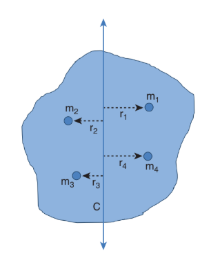
**
Figure 5.24 Radius of gyration
**
\( m = m_1 = m_2 = m_3 = \ldots = m_n \), then,

\[
I = m(r_1^{2} + r_2^{2} + r_3^{2} + \dots + r_n^{2}) = nm \left( \frac{r_1^{2} + r_2^{2} + r_3^{2} + \dots + r_n^{2}}{n} \right) = M K^{2}  
\]

where, nm is the total mass M of the body and K is the radius of gyration.

\[
K = \sqrt{ \frac{r_1^{2} + r_2^{2} + r_3^{2} + \dots + r_n^{2}}{n} }  \quad \text{(5.45)}
\]

The expression for radius of gyration indicates that it is the root mean square (rms) distance of the particles of the body from the axis of rotation.

In fact, the moment of inertia of any object could be expressed in the form, \( I = M K^{2} \).

For example, let us take the moment of inertia of a uniform rod of mass M and length \( \ell \). Its moment of inertia with respect to a perpendicular axis passing through the centre of mass is, \( I = \frac{1}{12} M \ell^{2} \).

In terms of radius of gyration, \( I = M K^{2} \), \( K = \frac{1}{\sqrt{12}} \ell \) or \( K = \frac{1}{2\sqrt{3}} \ell \) or \( K = (0.289) \ell \).

**EXAMPLE 5.15**

Find the radius of gyration of a disc of mass M and radius R rotating about an axis passing through the centre of mass and perpendicular to the plane of the disc.

**Solution**

The moment of inertia of a disc about an axis passing through the centre of mass and perpendicular to the disc is, \( I = \frac{1}{2} M R^{2} \).

In terms of radius of gyration, \( I = M K^{2} \), \( K = \frac{1}{\sqrt{2}} R \) or \( K = \frac{1}{1.414} R \) or \( K = (0.707) R \).

From the case of a rod and also a disc, we can conclude that the radius of gyration of the rigid body is always a geometrical feature like length, breadth, radius or their combinations with a positive numerical value multiplied to it.
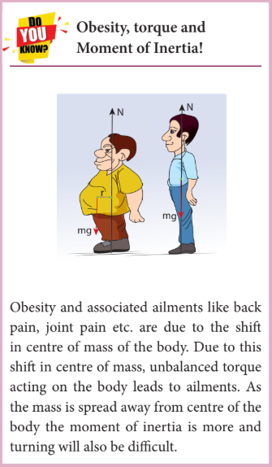
### 5.4.5 Theorems of Moment of Inertia

As the moment of inertia depends on the axis of rotation and also the orientation of the body about that axis, it is different for the same body with different axes of rotation. We have two important theorems to handle the case of shifting the axis of rotation.

**(i) Parallel axis theorem:** Parallel axis theorem states that the moment of inertia of a body about any axis is equal to the sum of its moment of inertia about a parallel axis through its centre of mass and the product of the mass of the body and the square of the perpendicular distance between the two axes.

If \( I_c \) is the moment of inertia of the body of mass M about an axis passing through the centre of mass, then the moment of inertia I about a parallel axis at a distance d from it is given by the relation,

\[
I = I_c + M d^{2}  \quad \text{(5.46)}
\]

Let us consider a rigid body as shown in Figure 5.25. Its moment of inertia about an axis AB passing through the centre of mass is \( I_c \). DE is another axis parallel to AB at a perpendicular distance d from AB. The moment of inertia of the body about DE is I. We attempt to get an expression for I in terms of \( I_c \). For this, let us consider a point mass m on the body at position x from its centre of mass.
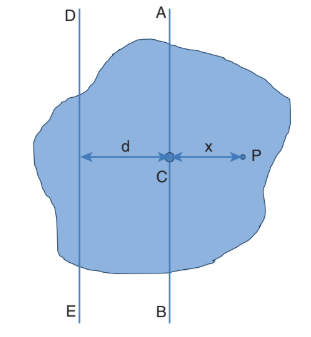
**Figure 5.25 Parallel axis theorem**

The moment of inertia of the point mass about the axis DE is, \( m (x + d)^{2} \).

The moment of inertia I of the whole body about DE is the summation of the above expression.

\[
I = \sum m (x + d)^{2} = \sum m (x^{2} + d^{2} + 2xd) = \sum m x^{2} + \sum m d^{2} + 2d \sum m x
\]

Here, \( \sum m x^{2} \) is the moment of inertia of the body about the centre of mass. Hence, \( I_C = \sum m x^{2} \).

The term \( \sum m x = 0 \) because x can take positive and negative values with respect to the axis AB. The summation \( \sum m x \) will be zero.

Thus,
\[
I = I_C + \sum m d^{2} = I_C + \left( \sum m \right) d^{2} = I_C + M d^{2}
\]
Here, $\sum m$ is the entire mass $M$ of the object $\left(\sum m = M\right)$
Hence, the parallel axis theorem is proved.

**(ii) Perpendicular axis theorem:** This perpendicular axis theorem holds good only for plane laminar objects.

The theorem states that the moment of inertia of a plane laminar body about an axis perpendicular to its plane is equal to the sum of moments of inertia about two perpendicular axes lying in the plane of the body such that all the three axes are mutually perpendicular and have a common point.

Let the X and Y-axes lie in the plane and Z-axis perpendicular to the plane of the laminar object. If the moments of inertia of the body about X and Y-axes are \( I_X \) and \( I_Y \) respectively and \( I_Z \) is the moment of inertia about Z-axis, then the perpendicular axis theorem could be expressed as,

\[
I_Z = I_X + I_Y  \quad \text{(5.47)}
\]

To prove this theorem, let us consider a plane laminar object of negligible thickness on which lies the origin (O). The X and Y-axes lie on the plane and Z-axis is perpendicular to it as shown in Figure 5.26. The lamina is considered to be made up of a large number of particles of mass m. Let us choose one such particle at a point P which has coordinates (x, y) at a distance r from O.
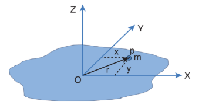
**Figure 5.26 Perpendicular axis theorem**

The moment of inertia of the particle about Z-axis is, \( m r^{2} \). The summation of the above expression gives the moment of inertia of the entire lamina about Z-axis as, \( I_Z = \sum m r^{2} \).

Here, \( r^{2} = x^{2} + y^{2} \). Then,
\[
I_Z = \sum m (x^{2} + y^{2}) = \sum m x^{2} + \sum m y^{2}
\]

In the above expression, the term \( \sum m x^{2} \) is the moment of inertia of the body about the y-axis and similarly the term \( \sum m y^{2} \) is the moment of inertia about X-axis. Thus,
\[
I_X = \sum m y^{2} \quad \text{and} \quad I_Y = \sum m x^{2}
\]

Substituting in the equation for \( I_Z \) gives,
\[
I_Z = I_X + I_Y
\]

Thus, the perpendicular axis theorem is proved.

**EXAMPLE 5.16**

Find the moment of inertia of a disc of mass \( 3 \, \text{kg} \) and radius \( 50 \, \text{cm} \) about the following axes.
(i) axis passing through the centre and perpendicular to the plane of the disc,
(ii) axis touching the edge and perpendicular to the plane of the disc,
(iii) axis passing through the centre and lying on the plane of the disc.

**Solution**

The mass, \( M = 3 \, \text{kg} \), radius \( R = 50 \, \text{cm} = 50 \times 10^{-2} \, \text{m} = 0.5 \, \text{m} \)

(i) The moment of inertia (I) about an axis passing through the centre and perpendicular to the plane of the disc is,
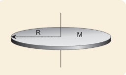
\[
I = \frac{1}{2} M R^{2} = \frac{1}{2} \times 3 \times (0.5)^{2} = 0.5 \times 3 \times 0.5 \times 0.5 = 0.375 \, \text{kg m}^{2}
\]

(ii) The moment of inertia (I) about an axis touching the edge and perpendicular to the plane of the disc by parallel axis theorem is,
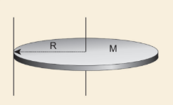
\[
I = I_C + M d^{2}
\]
where \( I_C = \frac{1}{2} M R^{2} \) and \( d = R \).
\[
I = \frac{1}{2} M R^{2} + M R^{2} = \frac{3}{2} M R^{2} = \frac{3}{2} \times 3 \times (0.5)^{2} = 1.5 \times 3 \times 0.5 \times 0.5 = 1.125 \, \text{kg m}^{2}
\]

(iii) The moment of inertia (I) about an axis passing through the centre and lying on the plane of the disc is,
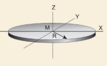
\[
I_Z = I_X + I_Y
\]
where \( I_X = I_Y = I \) and \( I_Z = \frac{1}{2} M R^{2} \).
\[
I_Z = 2I, \quad I = \frac{1}{2} I_Z = \frac{1}{2} \times \frac{1}{2} M R^{2} = \frac{1}{4} M R^{2}
\]
\[
I = \frac{1}{4} \times 3 \times (0.5)^{2} = 0.25 \times 3 \times 0.5 \times 0.5 = 0.1875 \, \text{kg m}^{2}
\]

About which of the above axis it is easier to rotate the disc? It is easier to rotate the disc about an axis about which the moment of inertia is the least. Hence, it is case (iii).

**EXAMPLE 5.17**

Find the moment of inertia about the geometric centre of the given structure made up of one thin rod connecting two similar solid spheres as shown in Figure.
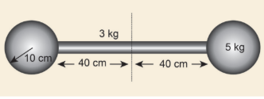
**Solution**

The structure is made up of three objects; one thin rod and two solid spheres.

The mass of the rod, \( M = 3 \, \text{kg} \) and the total length of the rod, \( \ell = 80 \, \text{cm} = 0.8 \, \text{m} \)

The moment of inertia of the rod about its centre of mass is, \( I_{\text{rod}} = \frac{1}{12} M \ell^{2} \)
\[
I_{\text{rod}} = \frac{1}{12} \times 3 \times (0.8)^{2} = \frac{1}{4} \times 0.64 = 0.16 \, \text{kg m}^{2}
\]

The mass of the sphere, \( M = 5 \, \text{kg} \) and the radius of the sphere, \( R = 10 \, \text{cm} = 0.1 \, \text{m} \)

The moment of inertia of the sphere about its centre of mass is, \( I_C = \frac{2}{5} M R^{2} \).

The moment of inertia of the sphere about geometric centre of the structure is, \( I_{\text{sph}} = I_C + M d^{2} \), where \( d = 40 \, \text{cm} + 10 \, \text{cm} = 50 \, \text{cm} = 0.5 \, \text{m} \).

\[
I_{\text{sph}} = \frac{2}{5} \times 5 \times (0.1)^{2} + 5 \times (0.5)^{2} = (2 \times 0.01) + (5 \times 0.25) = 0.02 + 1.25 = 1.27 \, \text{kg m}^{2}
\]

As there are one rod and two similar solid spheres we can write the total moment of inertia (I) of the given geometric structure as,
\[
I = I_{\text{rod}} + (2 \times I_{\text{sph}}) = 0.16 + (2 \times 1.27) = 0.16 + 2.54 = 2.7 \, \text{kg m}^{2}
\]

#### 5.4.6 Moment of Inertia of Different Rigid Bodies

The moment of inertia of different objects about different axes is given in the Table 5.3.

## 5.5 Rotational Dynamics

The relations among torque, angular acceleration, angular momentum, angular velocity and moment of inertia were seen in Section 5.2. In continuation to that, in this section, we will learn the relations among the other dynamical quantities like work, kinetic energy in rotational motion of rigid bodies. Finally a comparison between the translational and rotational quantities is made with a tabulation.

### 5.5.1 Effect of Torque on Rigid Bodies

A rigid body which has non zero external torque \( (\tau) \) about the axis of rotation would have an angular acceleration \( (\alpha) \) about that axis. The scalar relation between the torque and angular acceleration is,

\[
\tau = I \alpha  \quad \text{(5.48)}
\]

where, I is the moment of inertia of the rigid body. The torque in rotational motion is equivalent to the force in linear motion.

**EXAMPLE 5.18**

A disc of mass \( 500 \, \text{g} \) and radius \( 10 \, \text{cm} \) can freely rotate about a fixed axis as shown in figure. A light and inextensible string is wound several turns around it and \( 100 \, \text{g} \) body is suspended at its free end. Find the acceleration of this mass. [Given: The string makes the disc to rotate and does not slip over it. \( \mathrm{g} = 10 \, \text{m} \, \text{s}^{-2} \).]

**Solution**

Let the mass of the disc be \( m_1 \) and its radius R. The mass of the suspended body is \( m_2 \).

\[
m_1 = 500 \, \text{g} = 500 \times 10^{-3} \, \text{kg} = 0.5 \, \text{kg}
\]
\[
m_2 = 100 \, \text{g} = 100 \times 10^{-3} \, \text{kg} = 0.1 \, \text{kg}
\]
\[
R = 10 \, \text{cm} = 10 \times 10^{-2} \, \text{m} = 0.1 \, \text{m}
\]

As the light inextensible string is wound around the disc several times it makes the disc rotate without slipping over it. The translational acceleration of \( m_2 \) and tangential acceleration of \( m_1 \) will be the same. Let us draw the free body diagram (FBD) of \( m_1 \) and \( m_2 \) separately.

**FBD of the disc:** 

Its gravitational force \( (m_1 g) \) acts downward and normal force N exerted by the fixed support at the centre acts upward. The tension T acts downward at the edge. The gravitational force \( (m_1 g) \) and the normal force (N) cancel each other. \( m_1 g = N \).

The tension T produces a torque (R T), which produces a rotational motion in the disc with angular acceleration \( \left( \alpha = \frac{a}{R} \right) \). Here, a is the linear acceleration of a point at the edge of the disc. If the moment of inertia of the disc is I and its radius of gyration is K, then

\[
RT = I \alpha, \quad RT = (m_1 K^{2}) \frac{a}{R}
\]
\[
T = (m_1 K^{2}) \frac{a}{R^{2}}
\]

**FBD of the body:** Its gravitational force \( (m_2 g) \) acts downward and the tension T acts upward. As \( (T < m_2 g) \), there is a resultant force \( (m_2 a) \) acting on it downward.

\[
m_2 g - T = m_2 a
\]

Substituting for T from the equation for disc,

\[
m_2 g - (m_1 K^{2}) \frac{a}{R^{2}} = m_2 a
\]
\[
m_2 g = \left( m_1 \frac{K^{2}}{R^{2}} + m_2 \right) a
\]
\[
a = \frac{m_2}{\left( m_1 \frac{K^{2}}{R^{2}} + m_2 \right)} g
\]

The expression \( \left( \frac{K^{2}}{R^{2}} \right) \) for a disc rotating about an axis passing through the centre and perpendicular to the plane is, \( \frac{K^{2}}{R^{2}} = \frac{1}{2} \) (Ref Table 5.3). Now the expression for acceleration further simplifies as,

\[
a = \frac{m_2}{\left( \frac{m_1}{2} + m_2 \right)} g = \frac{2 m_2}{(m_1 + 2 m_2)} g
\]

Substituting the values,

\[
a = \frac{2 \times 0.1}{(0.5 + 0.2)} \times 10 = \frac{0.2}{0.7} \times 10 = 2.857 \, \text{m s}^{-2}
\]

### 5.5.2 Conservation of Angular Momentum

When no external torque acts on the body, the net angular momentum of a rotating rigid body remains constant. This is known as law of conservation of angular momentum.

\[
\tau = \frac{dL}{dt}, \quad \text{if } \tau = 0 \text{ then, } L = \text{constant}  \quad \text{(5.49)}
\]

As the angular momentum is \( L = I \omega \), the conservation of angular momentum could further be written for initial and final situations as,

\[
I_i \omega_i = I_f \omega_f \quad \text{(or)} \quad I \omega = \text{constant}  \quad \text{(5.50)}
\]

The above equations say that if I increases \( \omega \) will decrease and vice-versa to keep the angular momentum constant.

There are several situations where the principle of conservation of angular momentum is applicable. One striking example is an ice dancer as shown in Figure 5.27. The dancer spins slowly when the hands are stretched out and spins faster when the hands are brought close to the body. Stretching of hands away from body increases moment of inertia, thus the angular velocity decreases resulting in slower spin. When the hands are brought close to the body, the moment of inertia decreases, and thus the angular velocity increases resulting in faster spin.

**Figure 5.27 Conservation of angular momentum for ice dancer**

A diver while in air as in Figure 5.28 curls the body close to decrease the moment of inertia, which in turn helps to increase the number of somersaults in air.

**Figure 5.28 Conservation of angular momentum for a diver**

**EXAMPLE 5.19**

A jester in a circus is standing with his arms extended on a turn table rotating with angular velocity \( \omega \). He brings his arms closer to his body so that his moment of inertia is reduced to one third of the original value. Find his new angular velocity. [Given: There is no external torque on the turn table in the given situation.]

**Solution**

Let the moment of inertia of the jester with his arms extended be I. As there is no external torque acting on the jester and the turn table, his total angular momentum is conserved. We can write the equation,

\[
I_i \omega_i = I_f \omega_f
\]
\[
I \omega_i = \frac{1}{3} I \omega_f \quad (\because I_f = \frac{1}{3} I_i)
\]
\[
\omega_f = 3 \omega_i
\]

The above result tells that the final angular velocity is three times that of initial angular velocity.

### 5.5.3 Work done by Torque

Let us consider a rigid body rotating about a fixed axis. Figure 5.29 shows a point P on the body rotating about an axis perpendicular to the plane of the page. A tangential force F is applied on the body. It produces a small displacement ds on the body. The work done (dw) by the force is,

\[
dw = F \, ds
\]

**Figure 5.29 Work done by torque**

As the distance ds, the angle of rotation \( d\theta \) and radius r are related by the expression, \( ds = r \, d\theta \).

The expression for work done now becomes,
\[
dw = F \, ds = F r \, d\theta
\]

The term (Fr) is the torque \( \tau \) produced by the force on the body.
\[
dw = \tau \, d\theta  \quad \text{(5.51)}
\]

This expression gives the work done by the external torque \( \tau \), which acts on the body rotating about a fixed axis through an angle \( d\theta \).

The corresponding expression for work done in translational motion is,
\[
dw = F \, ds
\]

### 5.5.4 Kinetic Energy in Rotation

Let us consider a rigid body rotating with angular velocity \( \omega \) about an axis as shown in Figure 5.30. Every particle of the body will have the same angular velocity \( \omega \) and different tangential velocities \( v \) based on its positions from the axis of rotation.

**Figure 5.30 Kinetic energy in rotation**

Let us choose a particle of mass \( m_i \) situated at distance \( r_i \) from the axis of rotation. It has a tangential velocity \( v_i \) given by the relation, \( v_i = r_i \omega \). The kinetic energy \( KE_i \) of the particle is,

\[
KE_i = \frac{1}{2} m_i v_i^{2}  
\]

Writing the expression with the angular velocity,
\[
KE_i = \frac{1}{2} m_i (r_i \omega)^{2} = \frac{1}{2} (m_i r_i^{2}) \omega^{2}
\]

For the kinetic energy of the whole body, which is made up of large number of such particles, the equation is written with summation as,

\[
KE = \frac{1}{2} \left( \sum m_i r_i^{2} \right) \omega^{2}
\]

where, the term \( \sum m_i r_i^{2} \) is the moment of inertia I of the whole body. \( I = \sum m_i r_i^{2} \).

Hence, the expression for KE of the rigid body in rotational motion is,
\[
KE = \frac{1}{2} I \omega^{2}  \quad \text{(5.52)}
\]

This is analogous to the expression for kinetic energy in translational motion.
\[
KE = \frac{1}{2} M v^{2}
\]

**Relation between rotational kinetic energy and angular momentum**

Let a rigid body of moment of inertia I rotate with angular velocity \( \omega \).

The angular momentum of a rigid body is, \( L = I \omega \).

The rotational kinetic energy of the rigid body is, \( KE = \frac{1}{2} I \omega^{2} \).

By multiplying the numerator and denominator of the above equation with I, we get a relation between L and KE as,

\[
KE = \frac{1}{2} \frac{I^{2} \omega^{2}}{I} = \frac{1}{2} \frac{(I \omega)^{2}}{I} = \frac{L^{2}}{2I} \quad \text{(5.53)}
\]

**EXAMPLE 5.20**

Find the rotational kinetic energy of a ring of mass \( 9 \, \text{kg} \) and radius \( 3 \, \text{m} \) rotating with \( 240 \, \text{rpm} \) about an axis passing through its centre and perpendicular to its plane. (rpm is a unit of speed of rotation which means revolutions per minute)

**Solution**

The rotational kinetic energy is, \( KE = \frac{1}{2} I \omega^{2} \).

The moment of inertia of the ring is, \( I = M R^{2} = 9 \times 3^{2} = 81 \, \text{kg m}^{2} \).

The angular speed of the ring is,
\[
\omega = 240 \, \text{rpm} = \frac{240 \times 2\pi}{60} \, \text{rad s}^{-1} = 8\pi \, \text{rad s}^{-1}
\]
\[
KE = \frac{1}{2} \times 81 \times (8\pi)^{2} = \frac{1}{2} \times 81 \times 64 \times \pi^{2} = 2592 \times \pi^{2} \, \text{J}
\]
Taking \( \pi^{2} \approx 10 \), \( KE = 25920 \, \text{J} = 25.920 \, \text{kJ} \).

### 5.5.5 Power Delivered by Torque

Power delivered is the work done per unit time. If we differentiate the expression for work done with respect to time, we get the instantaneous power (P).

\[
P = \frac{dw}{dt} = \tau \frac{d\theta}{dt} \quad (\because dw = \tau d\theta)
\]
\[
P = \tau \omega  \quad \text{(5.54)}
\]

The analogous expression for instantaneous power delivered in translational motion is,
\[
P = \bar{F} \cdot \bar{v}
\]

### 5.5.6 Comparison of Translational and Rotational Quantities

Many quantities in rotational motion have expressions similar to that of translational motion. The rotational terms are compared with the translational equivalents in Table 5.4.

**Table 5.4 Comparison of Translational and Rotational Quantities**

| S.No | Translational Motion | Rotational motion about a fixed axis |
|---|---|---|
| 1 | Displacement, x | Angular displacement, \( \theta \) |
| 2 | Time, t | Time, t |
| 3 | Velocity, \( v = dx/dt \) | Angular velocity, \( \omega = d\theta/dt \) |
| 4 | Acceleration, \( a = dv/dt \) | Angular acceleration, \( \alpha = d\omega/dt \) |
| 5 | Mass, m | Moment of inertia, I |
| 6 | Force, \( F = ma \) | Torque, \( \tau = I \alpha \) |
| 7 | Linear momentum, \( p = mv \) | Angular momentum, \( L = I \omega \) |
| 8 | Impulse, \( F \Delta t = \Delta p \) | Angular impulse, \( \tau \Delta t = \Delta L \) |
| 9 | Work done, \( w = F s \) | Work done, \( w = \tau \theta \) |
| 10 | Kinetic energy, \( KE = \frac{1}{2} mv^{2} \) | Kinetic energy, \( KE = \frac{1}{2} I \omega^{2} \) |
| 11 | Power, \( P = F v \) | Power, \( P = \tau \omega \) |

## 5.6 Rolling Motion

The rolling motion is the most commonly observed motion in daily life. The motion of wheel is an example of rolling motion. Round objects like ring, disc, sphere etc. are most suitable for rolling.

Let us study the rolling of a disc on a horizontal surface. Consider a point P on the edge of the disc. While rolling, the point undergoes translational motion along with its centre of mass and rotational motion with respect to its centre of mass.

### 5.6.1 Combination of Translation and Rotation

We will now see how these translational and rotational motions are related in rolling. If the radius of the rolling object is R, in one full rotation, the centre of mass is displaced by \( 2\pi R \) (its circumference). One would agree that not only the centre of mass, but all the points on the disc are displaced by the same \( 2\pi R \) after one full rotation. The only difference is that the centre of mass takes a straight path; but, all the other points undergo a path which has a combination of the translational and rotational motion. Especially the point on the edge undergoes a path of a cycloid as shown in the Figure 5.31.

**Figure 5.31 Rolling is combination of translation and rotation**

As the centre of mass takes only a straight line path, its velocity \( v_{CM} \) is only translational velocity \( v_{TRANS} \). \( v_{CM} = v_{TRANS} \). All the other points have two velocities. One is the translational velocity \( v_{TRANS} \) (which is also the velocity of centre of mass) and the other is the rotational velocity \( v_{ROT} = r \omega \). Here, \( r \) is the distance of the point from the centre of mass and \( \omega \) is the angular velocity. The rotational velocity \( v_{ROT} \) is perpendicular to the instantaneous position vector from the centre of mass as shown in Figure 5.32(a). The resultant of these two velocities is \( v \). This resultant velocity \( v \) is perpendicular to the position vector from the point of contact of the rolling object with the surface on which it is rolling as shown in Figure 5.32(b).

**Figure 5.32 Resultant velocity at a point**
(a) with respect to centre of mass
(b) with respect to point of contact

We shall now give importance to the point of contact. In pure rolling, the point of the rolling object which comes in contact with the surface is at momentary rest. This is the case with every point that is on the edge of the rolling object. As the rolling proceeds, all the points on the edge, one by one come in contact with the surface; remain at momentary rest at the time of contact and then take the path of the cycloid as already mentioned.

Hence, we can consider the pure rolling in two different ways.
(i) The combination of translational motion and rotational motion about the centre of mass.
(ii) The momentary rotational motion about the point of contact.

As the point of contact is at momentary rest in pure rolling, its resultant velocity \( v \) is zero (\( v = 0 \)). For example, in Figure 5.33, at the point of contact, \( v_{TRANS} \) is forward (to right) and \( v_{ROT} \) is backwards (to the left).

**Figure 5.33 In pure rolling, the point of contact is at rest**

That implies that, \( v_{TRANS} \) and \( v_{ROT} \) are equal in magnitude and opposite in direction (\( v = v_{TRANS} - v_{ROT} = 0 \)). Hence, we conclude that in pure rolling, for all the points on the edge, the magnitudes of \( v_{TRANS} \) and \( v_{ROT} \) are equal (\( v_{TRANS} = v_{ROT} \)). As \( v_{TRANS} = v_{CM} \) and \( v_{ROT} = R \omega \), in pure rolling we have,

\[
v_{CM} = R \omega  \quad \text{(5.55)}
\]

We should remember the special feature of this equation. In rotational motion, as per the relation \( v = r \omega \), the centre point will not have any velocity as r is zero. But in rolling motion, it suggests that the centre point has a velocity \( v_{CM} \) given by the equation.

For the topmost point, the two velocities \( v_{TRANS} \) and \( v_{ROT} \) are equal in magnitude and in the same direction (to the right). Thus, the resultant velocity \( v \) is the sum of these two velocities, \( v = v_{TRANS} + v_{ROT} \). In other form, \( v = 2 v_{CM} \) as shown in Figure 5.34.

**Figure 5.34 Velocity of different point in pure rolling**

### 5.6.2 Slipping and Sliding

When the round object moves, it always tends to roll on any surface which has a coefficient of friction any value greater than zero (\( \mu > 0 \)). The friction that enabling the rolling motion is called rolling friction. In pure rolling, there is no relative motion of the point of contact with the surface. When the rolling object speeds up or slows down, it must accelerate or decelerate respectively. If this suddenly happens it makes the rolling object to slip or slide.

**Sliding** is the case when \( v_{CM} > R \omega \) (or \( v_{TRANS} > v_{ROT} \)). The translation is more than the rotation. This kind of motion happens when sudden break is applied in a moving vehicles, or when the vehicle enters into a slippery road. In this case, the point of contact has more of \( v_{TRANS} \) than \( v_{ROT} \). Hence, it has a resultant velocity v in the forward direction as shown in Figure 5.35. The kinetic frictional force \( (f_k) \) opposes the relative motion. Hence, it acts in the opposite direction of the relative velocity. This frictional force reduces the translational velocity and increases the rotational velocity till they become equal and the object sets on pure rolling. Sliding is also referred as forward slipping.

**Figure 5.35 Sliding**

**Slipping** is the case when \( v_{CM} < R \omega \) (or \( v_{TRANS} < v_{ROT} \)). The rotation is more than the translation. This kind of motion happens when we suddenly start the vehicle from rest or the vehicle is stuck in mud. In this case, the point of contact has more of \( v_{ROT} \) than \( v_{TRANS} \). It has a resultant velocity v in the backward direction as shown in Figure 5.36. The kinetic frictional force \( (f_k) \) opposes the relative motion. Hence it acts in the opposite direction of the relative velocity. This frictional force reduces the rotational velocity and increases the translational velocity till they become equal and the object sets pure rolling. Slipping is sometimes emphasised as backward slipping.

**Figure 5.36 Slipping**

**EXAMPLE 5.21**

A rolling wheel has velocity of its centre of mass as \( 5 \, \text{m} \, \text{s}^{-1} \). If its radius is \( 1.5 \, \text{m} \) and angular velocity is \( 3 \, \text{rad} \, \text{s}^{-1} \), then check whether it is in pure rolling or not.

**Solution**

Translational velocity ($v_{\text{TRANS}}$) or velocity of centre of mass, $v_{\text{CM}} = 5\text{ m s}^{-1}$

The radius is, $R = 1.5\text{ m}$ and the angular velocity is, $\omega = 3\text{ rad s}^{-1}$

Rotational velocity, $v_{\text{ROT}} = R\omega$

$$v_{\text{ROT}} = 1.5 \times 3$$
$$v_{\text{ROT}} = 4.5\text{ m s}^{-1}$$

As $v_{\text{CM}} > R\omega$ (or) $v_{\text{TRANS}} > R\omega$, It is not in pure rolling, but sliding.

### 5.6.3 Kinetic Energy in Pure Rolling

In general pure rolling is the combination of translational and rotational motion, we can write the total kinetic energy (KE) as the sum of kinetic energy due to translational motion \( (KE_{TRANS}) \) and kinetic energy due to rotational motion \( (KE_{ROT}) \).

\[
KE = KE_{TRANS} + KE_{ROT}  \quad \text{(5.56)}
\]

If the mass of the rolling object is M, the velocity of centre of mass is \( v_{CM} \), its moment of inertia about centre of mass is \( I_{CM} \) and angular velocity is \( \omega \), then

\[
KE = \frac{1}{2} M v_{CM}^{2} + \frac{1}{2} I_{CM} \omega^{2}  \quad \text{(5.57)}
\]

**With centre of mass as reference:** The moment of inertia \( (I_{CM}) \) of a rolling object about the centre of mass is, \( I_{CM} = M K^{2} \) and \( v_{CM} = R \omega \). Here, \( K \) is radius of gyration.

$$\text{KE} = \frac{1}{2}Mv_{CM}^2 + \frac{1}{2}\left(MK^2\right)\frac{v_{CM}^2}{R^2}$$

$$\text{KE} = \frac{1}{2}Mv_{CM}^2 + \frac{1}{2}Mv_{CM}^2\left(\frac{K^2}{R^2}\right)  \quad \text{(5.58)}$$
$$\text{KE} = \frac{1}{2}Mv_{CM}^2\left(1 + \frac{K^2}{R^2}\right) \quad \text{(5.59)}$$

**With point of contact as reference:** We can also arrive at the same expression by taking the momentary rotation happening with respect to the point of contact (another approach to rolling). If we take the point of contact as O, then,

\[
KE = \frac{1}{2} I_O \omega^{2}
\]

Here, \( I_O \) is the moment of inertia of the object about the point of contact. By parallel axis theorem, \( I_O = I_{CM} + M R^{2} \). Further we can write, \( I_O = M K^{2} + M R^{2} \). With \( v_{CM} = R \omega \) or \( \omega = \frac{v_{CM}}{R} \),

\[
KE = \frac{1}{2} (M K^{2} + M R^{2}) \frac{v_{CM}^{2}}{R^{2}} = \frac{1}{2} M v_{CM}^{2} \left( 1 + \frac{K^{2}}{R^{2}} \right) \quad \text{(5.60)}
\]

As the two equations 5.59 and 5.60 are the same, it is once again confirmed that the pure rolling problems could be solved by considering the motion as any one of the following two cases.

(i) The combination of translational motion and rotational motion about the centre of mass.

(ii) The momentary rotational motion about the point of contact.

**EXAMPLE 5.22**

A solid sphere is undergoing pure rolling. What is the ratio of its translational kinetic energy to rotational kinetic energy?

**Solution**

The expression for total kinetic energy in pure rolling is,
\[
KE = KE_{TRANS} + KE_{ROT}
\]

For any object the total kinetic energy as per equation is,
\[
KE = \frac{1}{2} M v_{CM}^{2} + \frac{1}{2} M v_{CM}^{2} \left( \frac{K^{2}}{R^{2}} \right) = \frac{1}{2} M v_{CM}^{2} \left( 1 + \frac{K^{2}}{R^{2}} \right)
\]

Then,
\[
\frac{1}{2} M v_{CM}^{2} \left( 1 + \frac{K^{2}}{R^{2}} \right) = \frac{1}{2} M v_{CM}^{2} + \frac{1}{2} M v_{CM}^{2} \left( \frac{K^{2}}{R^{2}} \right)
\]

The above equation suggests that in pure rolling the ratio of total kinetic energy, translational kinetic energy and rotational kinetic energy is given as, \( KE : KE_{TRANS} : KE_{ROT} = \left( 1 + \frac{K^{2}}{R^{2}} \right) : 1 : \frac{K^{2}}{R^{2}} \).

For a solid sphere, \( \frac{K^{2}}{R^{2}} = \frac{2}{5} \) (Refer Table 5.3). Hence, the ratio becomes,
\[
KE : KE_{TRANS} : KE_{ROT} = \left( 1 + \frac{2}{5} \right) : 1 : \frac{2}{5} = \frac{7}{5} : 1 : \frac{2}{5} = 7 : 5 : 2
\]

Therefore, translational kinetic energy : rotational kinetic energy = 5 : 2.

### 5.6.4 Rolling on Inclined Plane

Let us assume a round object of mass m and radius R is rolling down an inclined plane without slipping as shown in Figure 5.37. There are two forces acting on the object along the inclined plane. One is the component of gravitational force (mg sinθ) and the other is the static frictional force (f). The other component of gravitation force (mg cosθ) is cancelled by the normal force (N) exerted by the plane. As the motion is happening along the incline, we shall write the equation for motion from the free body diagram (FBD) of the object.

**Figure 5.37 Rolling on inclined plane**

For translational motion, mg sinθ is the supporting force and f is the opposing force,
\[
mg \sin \theta - f = ma  \quad \text{(5.61)}
\]

For rotational motion, let us take the torque with respect to the centre of the object. Then mg sinθ cannot cause torque as it passes through it but the frictional force f can set torque of Rf.

\[
Rf = I \alpha
\]

By using the relation, \( a = r \alpha \), and moment of inertia \( I = m K^{2} \), we get,
\[
Rf = m K^{2} \frac{a}{R}, \quad f = ma \left( \frac{K^{2}}{R^{2}} \right)
\]

Now the translational equation becomes,
\[
mg \sin \theta - ma \left( \frac{K^{2}}{R^{2}} \right) = ma
\]
\[
mg \sin \theta = ma + ma \left( \frac{K^{2}}{R^{2}} \right) = ma \left( 1 + \frac{K^{2}}{R^{2}} \right)
\]
\[
a = \frac{g \sin \theta}{\left( 1 + \frac{K^{2}}{R^{2}} \right)}  \quad \text{(5.62)}
\]

We can also find the expression for final velocity of the rolling object by using third equation of motion for the inclined plane. \( v^{2} = u^{2} + 2as \). If the body starts rolling from rest, \( u = 0 \). When h is the vertical height of the incline, the length of the incline is s, \( s = \frac{h}{\sin \theta} \).

\[
v^{2} = 0 + 2 \cdot \frac{g \sin \theta}{\left( 1 + \frac{K^{2}}{R^{2}} \right)} \cdot \frac{h}{\sin \theta} = \frac{2gh}{\left( 1 + \frac{K^{2}}{R^{2}} \right)}
\]
\[
v = \sqrt{ \frac{2gh}{\left( 1 + \frac{K^{2}}{R^{2}} \right)} }  \quad \text{(5.63)}
\]

The time taken for rolling down the incline could also be written from first equation of motion as, \( v = u + at \). For the object which starts rolling from rest, \( u = 0 \). Then,
\[
t = \frac{v}{a} = \sqrt{ \frac{2gh}{\left( 1 + \frac{K^{2}}{R^{2}} \right)} } \cdot \frac{\left( 1 + \frac{K^{2}}{R^{2}} \right)}{g \sin \theta} = \sqrt{ \frac{2h \left( 1 + \frac{K^{2}}{R^{2}} \right)}{g \sin^{2} \theta} }  \quad \text{(5.64)}
\]

The equation suggests that for a given incline, the object with the least value of radius of gyration K will reach the bottom of the incline first.

**Example 5.23**
Four round objects namely a ring, a disc, a hollow sphere and a solid sphere with same radius R start to roll down an incline at the same time. Find out which object will reach the bottom first.

**Solution**

For all the four objects namely the ring, disc, hollow sphere and solid sphere, the radii of gyration $K$ are $R$, $\sqrt{\frac{1}{2}}R$, $\sqrt{\frac{2}{3}}R$, $\sqrt{\frac{2}{5}}R$ (ref Table (5.3)).  

With numerical values the radius of gyration $K$ are $1R$, $0.707R$, $0.816R$, $0.632R$ respectively. The expression for time taken for rolling has the radius of gyration $K$ in the numerator as per equation 5.63:  $$t = \sqrt{\frac{2h\left(1 + \frac{K^2}{R^2}\right)}{g \sin^2\theta}}$$
The one with least value of radius of gyration $K$ will take the shortest time to reach the bottom of the inclined plane.
The order of objects reaching the bottom is: 1. Solid sphere (first)
2. Disc (second)
3. Hollow sphere (third)
4. Ring (last)

## SUMMARY

A rigid body is the one in which the distances between different particles remain constant.  

For regular shaped bodies with uniform mass distribution, centre of mass always lies at the geometrical centre.  

Net torque produces turning motion in rigid object.  

A rigid body is in translational equilibrium if the total external force on it is zero. It is in rotational equilibrium if the total external torque on it is zero.  

The centre of gravity of an extended body is that point where the total gravitational torque on the body is zero.  

If the external torque acting on the body is zero, the component of angular momentum along the axis of rotation is constant.  

There are rotational equivalents for all the translational quantities.  

Rolling motion is the combination of translational and rotational motions.  

Rolling can also be treated as the momentary rotation about the point of contact.  

In pure rolling, the total kinetic energy is the sum of kinetic energies of translational and rotational motions.  

In sliding the translational motion is more than rotational motion.  

In slipping the rotational motion is more than translational motion.

## Multiple Choice Questions
1. The centre of mass of a system of particles does not depend upon,
   (a) position of particles
   (b) relative distance between particles
   (c) masses of particles
   (d) force acting on particle

   **Answer: d**

2. A couple produces,
   (a) pure rotation
   (b) pure translation
   (c) rotation and translation
   (d) no motion

   **Answer: a**

3. A particle is moving with a constant velocity along a line parallel to positive X-axis. The magnitude of its angular momentum with respect to the origin is,
   (a) zero
   (b) increasing with x
   (c) decreasing with x
   (d) remaining constant

   **Answer: d**

4. A rope is wound around a hollow cylinder of mass \( 3 \, \text{kg} \) and radius 40 cm. What is the angular acceleration of the cylinder if the rope is pulled with a force \( 30 \, \text{N} \)?
   (a) \( 0.25 \, \text{rad} \, \text{s}^{-2} \)
   (b) \( 25 \, \text{rad} \, \text{s}^{-2} \)
   (c) \( 5 \, \text{m} \, \text{s}^{-2} \)
   (d) \( 25 \, \text{m} \, \text{s}^{-2} \)

   **Answer: b**

5. A closed cylindrical container is partially filled with water. As the container rotates in a horizontal plane about a perpendicular bisector, its moment of inertia,
   (a) increases
   (b) decreases
   (c) remains constant
   (d) depends on direction of rotation.

   **Answer: a**

6. A rigid body rotates with an angular momentum L. If its kinetic energy is halved, the angular momentum becomes,
   (a) L
   (b) L/2
   (c) 2L
   (d) \( L/\sqrt{2} \)

   **Answer: d**

7. A particle undergoes uniform circular motion. The angular momentum of the particle remain conserved about,
   (a) the centre point of the circle.
   (b) the point on the circumference of the circle.
   (c) any point inside the circle.
   (d) any point outside the circle.

   **Answer: a**

8. When a mass is rotating in a plane about a fixed point, its angular momentum is directed along,
   (a) a line perpendicular to the plane of rotation
   (b) the line making an angle of \( 45^{\circ} \) to the plane of rotation
   (c) the radius
   (d) tangent to the path

   **Answer: a**

9. Two discs of same moment of inertia rotating about their regular axis passing through centre and perpendicular to the plane of disc with angular velocities \( \omega_1 \) and \( \omega_2 \). They are brought into contact face to face coinciding the axis of rotation. The expression for loss of energy during this process is,
   (a) \( \frac{1}{4} I (\omega_1 - \omega_2)^{2} \)
   (b) \( I (\omega_1 - \omega_2)^{2} \)
   (c) \( \frac{1}{8} I (\omega_1 - \omega_2)^{2} \)
   (d) \( \frac{1}{2} I (\omega_1 - \omega_2)^{2} \)

   **Answer: a**

10. A disc of moment of inertia \( I_a \) is rotating in a horizontal plane about its symmetry axis with a constant angular speed \( \omega \). Another disc initially at rest of moment of inertia \( I_b \) is dropped coaxially on to the rotating disc. Then, both the discs rotate with same constant angular speed. The loss of kinetic energy due to friction in this process is,
    \[
    \text{(a)} \ \frac{1}{2} \frac{I_b^{2}}{(I_a + I_b)} \omega^{2}, \quad
    \text{(b)} \ \frac{I_b^{2}}{(I_a + I_b)} \omega^{2}, \quad
    \text{(c)} \ \frac{(I_b - I_a)^{2}}{(I_a + I_b)} \omega^{2}, \quad
    \text{(d)} \ \frac{1}{2} \frac{I_a I_b}{(I_a + I_b)} \omega^{2}
    \]

    **Answer: d**

11. The ratio of the acceleration for a solid sphere (mass m and radius R) rolling down an incline of angle \( \theta \) without slipping and slipping down the incline without rolling is,
    (a) 5:7
    (b) 2:3
    (c) 2:5
    (d) 7:5

    **Answer: a**

12. From a disc of radius R a mass M, a circular hole of diameter R, whose rim passes through the centre is cut. What is the moment of inertia of the remaining part of the disc about a perpendicular axis passing through it?
    (a) \( \frac{15MR^{2}}{32} \)
    (b) \( \frac{13MR^{2}}{32} \)
    (c) \( \frac{11MR^{2}}{32} \)
    (d) \( \frac{9MR^{2}}{32} \)

    **Answer: b**

13. The speed of a solid sphere after rolling down from rest without sliding on an inclined plane of vertical height h is,
    \[
    \text{(a)} \ \sqrt{\frac{4}{3}gh}, \quad
    \text{(b)} \ \sqrt{\frac{10}{7}gh}, \quad
    \text{(c)} \ \sqrt{2gh}, \quad
    \text{(d)} \ \sqrt{\frac{1}{2}gh}
    \]

    **Answer: b**

14. The speed of the centre of a wheel rolling on a horizontal surface is \( v_o \). A point on the rim in level with the centre will be moving at a speed of,
    (a) zero
    (b) \( v_o \)
    (c) \( \sqrt{2} v_o \)
    (d) \( 2v_o \)

    **Answer: c**

15. A round object of mass M and radius R rolls down without slipping along an inclined plane. The frictional force,
    (a) dissipates kinetic energy as heat.
    (b) decreases the rotational motion.
    (c) decreases the rotational and transnational motion.
    (d) converts transnational energy into rotational energy.

    **Answer: d**

## Short Answer Questions

1. Define centre of mass.
2. Find out the centre of mass for the given geometrical structures. a) Equilateral triangle b) Cylinder c) Square
3. Define torque and mention its unit.
4. What are the conditions in which force can not produce torque?
5. Give any two examples of torque in day-to-day life.
6. What is the relation between torque and angular momentum?
7. What is equilibrium?
8. How do you distinguish between stable and unstable equilibrium?
9. Define couple.
10. State principle of moments.
11. Define centre of gravity.
12. Mention any two physical significance of moment of inertia.
13. What is radius of gyration?
14. State conservation of angular momentum.
15. What are the rotational equivalents for the physical quantities, (i) mass and (ii) force?
16. What is the condition for pure rolling?
17. What is the difference between sliding and slipping?

## Long Answer Questions

1. Explain the types of equilibrium with suitable examples.
2. Explain the method to find the centre of gravity of a irregularly shaped lamina.
3. Explain why a cyclist bends while negotiating a curve road? Arrive at the expression for angle of bending for a given velocity.
4. Derive the expression for moment of inertia of a rod about its centre and perpendicular to the rod.
5. Derive the expression for moment of inertia of a uniform ring about an axis passing through the centre and perpendicular to the plane.
6. Derive the expression for moment of inertia of a uniform disc about an axis passing through the centre and perpendicular to the plane.
7. Discuss conservation of angular momentum with example.
8. State and prove parallel axis theorem.
9. State and prove perpendicular axis theorem.
10. Discuss rolling on inclined plane and arrive at the expression for the acceleration.

## Numerical Problems

1. A uniform disc of mass \( 100 \, \text{g} \) has a diameter of \( 10 \, \text{cm} \). Calculate the total energy of the disc when rolling along a horizontal table with a velocity of \( 20 \, \text{cm} \, \text{s}^{-1} \) (take the surface of table as reference)

2. A particle of mass 5 units is moving with a uniform speed of \( v = 3\sqrt{2} \) units in the XOY plane along the line \( y = x + 4 \). Find the magnitude of angular momentum.

   **Ans: 60 units**

3. A fly wheel rotates with a uniform angular acceleration. If its angular velocity increases from \( 20\pi \) rad/s to \( 40\pi \) rad/s in 10 seconds. Find the number of rotations in that period.

   **Ans: 150 rotations**

4. A uniform rod of mass m and length \( \ell \) makes a constant angle \( \theta \) with an axis of rotation which passes through one end of the rod. Find the moment of inertia about this axis.

   **Ans: \( \frac{1}{3} M \ell^{2} \sin^{2} \theta \)**

5. Two particles P and Q of mass \( 1 \, \text{kg} \) and \( 3 \, \text{kg} \) respectively start moving towards each other from rest under mutual attraction. What is the velocity of their centre of mass?

   **Ans: Zero**

6. Find the moment of inertia of a hydrogen molecule about an axis passing through its centre of mass and perpendicular to the inter-atomic axis. Given: mass of hydrogen atom \( 1.7 \times 10^{-27} \, \text{kg} \) and inter atomic distance is equal to \( 4 \times 10^{-10} \, \text{m} \).

   **Ans: \( 1.36 \times 10^{-46} \, \text{kg m}^{2} \)**

## Books for Reference

1. Michael Nelkon and Philip Parker, Advanced Level Physics, \( 7^{\text{th}} \) Edition, CBS Publishers & Distributors Pvt. Ltd, (2006).
2. David Halliday, Robert Resnick and Jearl Walker, Fundamentals of Physics, \( 6^{\text{th}} \) Edition, John Wiley & Sons Inc., (2004).
3. H.C. Verma, Concepts of Physics [Part 1], \( 1^{\text{st}} \) Edition, BharathiBhawan Publishers & Distributors Pvt. Ltd., (2008).
4. Igor Irodov, Problems in General Physics, \( 3^{\text{rd}} \) Edition, Mir Publishers, Moscow, (2006).
5. Roger A. Freedman, Hugh D. Young, Sears and Zemansky's University Physics: Mechanics, \( 12^{\text{th}} \) Edition, Pearson, (2011).