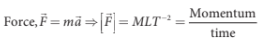
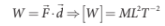
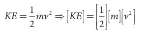
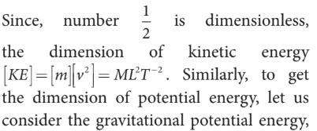
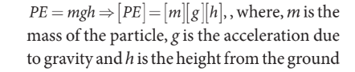

### 1.8.1 Dimension of Physical Quantities

In mechanics, we deal with the physical quantities like mass, time, length, velocity, acceleration, etc. which can be expressed in terms of three independent base quantities such as $M$, $L$ and $T$. So, the dimension of a physical quantity can be defined as 'any physical quantity which is expressed in terms of base quantities whose exponent (power) represents the dimension of the physical quantity'. The notation used to denote the dimension of a physical quantity is $[\text{physical quantity}]$. For an example, $[\text{length}]$ means dimension of length, $[\text{area}]$ means dimension of area, etc.

The dimension of length can be expressed in terms of base quantities as

$$
[\text{length}] = M^0 L T^0 = L
$$

Similarly,

$$
[\text{area}] = M^0 L^2 T^0 = L^2
$$

Similarly,

$$
[\text{volume}] = M^0 L^3 T^0 = L^3
$$

Note that in all the cases, the base quantity $L$ is same but exponent (power) are different, which means dimensions are different. For a pure number, exponent of base quantity is zero. For example, consider the number $2$, which has no dimension and can be expressed as

$$
[2] = M^0 L^0 T^0 \text{ (dimensionless)}
$$

Let us write down the dimensions of a few more physical quantities.

**Speed** $s = \frac{\text{distance}}{\text{time taken}}$, $\displaystyle [s] = \frac{L}{T} = LT^{-1}$

**Velocity** $\vec{v} = \frac{\text{displacement}}{\text{time taken}}$, $\displaystyle [\vec{v}] = \frac{L}{T} = LT^{-1}$

Note that speed is a scalar quantity and velocity is a vector quantity (scalar and vector will be discussed in Unit 2) but both of them have the same dimensional formula.

**Acceleration** $\vec{a} = \frac{\text{velocity}}{\text{time taken}}$, $\displaystyle [\vec{a}] = \frac{LT^{-1}}{T} = LT^{-2}$

Acceleration is velocity per time.

**Linear momentum or Momentum**, $\vec{p} = m\vec{v}$, $[\vec{p}] = MLT^{-1}$

This is true for any kind of force. There are only four types of forces that exist in nature viz strong force, electromagnetic force, weak force and gravitational force. Further, frictional force, centripetal force, centrifugal force, all have the dimension $MLT^{-2}$.

**Impulse** $\vec{I} = \vec{F}t$, $[\vec{I}] = MLT^{-1}$ (dimension of momentum)

**Angular momentum** is the moment of linear momentum (discussed in unit 5).

$$
\vec{L} = \vec{r} \times \vec{p}, \quad [\vec{L}] = ML^2 T^{-1}
$$

**Work done** 

**Kinetic energy** 

level.
Hence,
$$
PE = mgh, \quad [PE] = [m][g][h] = M \cdot LT^{-2} \cdot L = ML^2 T^{-2}
$$

Thus, for any kind of energy (such as for internal energy, total energy etc.), the dimension is

$$
[\text{Energy}] = ML^2 T^{-2}
$$

The moment of force is known as torque,

$$
\vec{\tau} = \vec{r} \times \vec{F}, \quad [\vec{\tau}] = ML^2 T^{-2}
$$

(Read the symbol $\tau$ as tau – Greek alphabet). Note that the dimension of torque and dimension of energy are identical but they are different physical quantities. Further one of them is a scalar (energy) and another one is a vector (torque). This means that the dimensionally same physical quantities need not be the same physical quantities.

> **Note 1:** We may come across dimensions in different situations in physics, so we often confuse with the term 'dimension'. For instance, we come across terms like 'dimension of energy', 'motion in one dimension' and 'dimension of atom'. It should be kept in mind that dimension of physical quantity means expressing physical quantity in terms of exponent of the base quantity. Motion in one dimension, two dimensions and three dimensions implies that it gives dimension of space. Dimension of atom implies the size of the atom. So, simply writing dimension is meaningless. Hence, the meaning should be taken with the context we write.

> **Note 2:** All the trigonometric functions like $\sin \theta$, $\cos \theta$ etc. are dimensionless ($\theta$ is dimensionless), exponential function $e^x$ and logarithm function $\ln x$ are dimensionless ($x$ must be dimensionless). Suppose we expand a function in series expansion (finite or infinite) which contain terms like $x^0$, $x^1$, $x^2$, ... then $x$ must be dimensionless quantity.

---
**Table 1.11 Dimensional Formula**

---
| Physical quantity | Expression | Dimensional formula |
|-------------------|------------|---------------------|
| Area (Rectangle) | length × breadth | $[L^2]$ |
| Volume | area × height | $[L^3]$ |
| Density | mass / volume | $[ML^{-3}]$ |
| Velocity | displacement/time | $[LT^{-1}]$ |
| Acceleration | velocity / time | $[LT^{-2}]$ |
| Momentum | mass × velocity | $[MLT^{-1}]$ |
| Force | mass × acceleration | $[MLT^{-2}]$ |
| Work | force × distance | $[ML^2 T^{-2}]$ |
| Power | work / time | $[ML^2 T^{-3}]$ |
| Energy | work | $[ML^2 T^{-2}]$ |
| Impulse | force × time | $[MLT^{-1}]$ |
| Radius of gyration | distance | $[L]$ |
| Pressure (or) stress | force / area | $[ML^{-1}T^{-2}]$ |
| Surface tension | force / length | $[MT^{-2}]$ |
| Frequency | 1 / time period | $[T^{-1}]$ |
| Moment of Inertia | mass × (distance)$^2$ | $[ML^2]$ |
| Moment of force (or torque) | force × distance | $[ML^2 T^{-2}]$ |
| Angular velocity | angular displacement / time | $[T^{-1}]$ |
| Angular acceleration | angular velocity / time | $[T^{-2}]$ |
| Angular momentum | linear momentum × distance | $[ML^2 T^{-1}]$ |
| Co-efficient of Elasticity | stress/strain | $[ML^{-1}T^{-2}]$ |
| Co-efficient of viscosity | (force × distance) / (area × velocity) | $[ML^{-1}T^{-1}]$ |
| Surface energy | work / area | $[MT^{-2}]$ |
| Heat capacity | heat energy / temperature | $[ML^2 T^{-2} K^{-1}]$ |
| Charge | current × time | $[AT]$ |
| Magnetic induction | force / (current × length) | $[MT^{-2}A^{-1}]$ |
| Force constant | force / displacement | $[MT^{-2}]$ |
| Gravitational constant | $[\text{force} \times (\text{distance})^2] / (\text{mass})^2$ | $[M^{-1}L^3 T^{-2}]$ |
| Planck's constant | energy / frequency | $[ML^2 T^{-1}]$ |
| Faraday constant | Avogadro constant × elementary charge | $[AT \text{ mol}^{-1}]$ |
| Boltzmann constant | energy / temperature | $[ML^2 T^{-2} K^{-1}]$ |
---

### 1.8.2 Dimensional Quantities, Dimensionless Quantities, Principle of Homogeneity

On the basis of dimension, we can classify quantities into four categories.

**(1) Dimensional variables** – Physical quantities which possess dimensions and have variable values are called dimensional variables. Examples are length, velocity, and acceleration etc.

**(2) Dimensionless variables** – Physical quantities which have no dimensions, but have variable values are called dimensionless variables. Examples are specific gravity, strain, refractive index etc.

**(3) Dimensional Constant** – Physical quantities which possess dimensions and have constant values are called dimensional constants. Examples are Gravitational constant, Planck's constant etc.

**(4) Dimensionless Constant** – Quantities which have constant values and also have no dimensions are called dimensionless constants. Examples are $\pi$, $e$ (Euler's number), numbers etc.

**Principle of homogeneity of dimensions**

The principle of homogeneity of dimensions states that the dimensions of all the terms in a physical expression should be the same. For example, in the physical expression $v^2 = u^2 + 2as$, the dimensions of $v^2$, $u^2$ and $2as$ are the same and equal to $[L^2 T^{-2}]$.

### 1.8.3 Application and Limitations of the Method of Dimensional Analysis

This method is used to

(i) Convert a physical quantity from one system of units to another.

(ii) Check the dimensional correctness of a given physical equation.

(iii) Establish relations among various physical quantities.

**(i) To convert a physical quantity from one system of units to another**

This is based on the fact that the product of the numerical values $(n)$ and its corresponding unit $(u)$ is a constant. i.e, $n [u] = \text{constant}$ (or) $n_1 [u_1] = n_2 [u_2]$.

Consider a physical quantity which has dimension 'a' in mass, 'b' in length and 'c' in time. If the fundamental units in one system are $M_1$, $L_1$ and $T_1$ and the other system are $M_2$, $L_2$ and $T_2$ respectively, then we can write,

$$
n_1 [M_1^a L_1^b T_1^c] = n_2 [M_2^a L_2^b T_2^c]
$$

We have thus converted the numerical value of physical quantity from one system of units into the other system.

---

**EXAMPLE 1.12**

Convert $76$ cm of mercury pressure into $\text{Nm}^{-2}$ using the method of dimensions.

**Solution**

In cgs system $76$ cm of mercury pressure $= 76 \times 13.6 \times 980$ dyne cm$^{-2}$

The dimensional formula of pressure $P$ is $[ML^{-1}T^{-2}]$

$$
P_1 [M_1^a L_1^b T_1^c] = P_2 [M_2^a L_2^b T_2^c]
$$

We have

$$
P_2 = P_1 \left[ \frac{M_1}{M_2} \right]^a \left[ \frac{L_1}{L_2} \right]^b \left[ \frac{T_1}{T_2} \right]^c
$$

$M_1 = 1$ g, $M_2 = 1$ kg, $L_1 = 1$ cm, $L_2 = 1$ m, $T_1 = 1$ s, $T_2 = 1$ s

As $a = 1$, $b = -1$, and $c = -2$

Then

$$
\begin{aligned}
P_2 &= 76 \times 13.6 \times 980 \left[ \frac{1 \text{ g}}{1 \text{ kg}} \right]^1 \left[ \frac{1 \text{ cm}}{1 \text{ m}} \right]^{-1} \left[ \frac{1 \text{ s}}{1 \text{ s}} \right]^{-2} \\
&= 76 \times 13.6 \times 980 \left[10^{-3}\right]^1 \left[10^{-2}\right]^{-1} \times 1 \\
&= 76 \times 13.6 \times 980 \times 10^{-3} \times 10^{2}
\end{aligned}
$$

$$
P_2 = 1.01 \times 10^5 \text{ Nm}^{-2}
$$

---

**EXAMPLE 1.13**

If the value of universal gravitational constant in SI is $6.6 \times 10^{-11} \text{ Nm}^2 \text{ kg}^{-2}$, then find its value in CGS System?

**Solution**

Let $G_{SI}$ be the gravitational constant in the SI system and $G_{cgs}$ in the cgs system. Then

$G_{SI} = 6.6 \times 10^{-11} \text{ Nm}^2 \text{ kg}^{-2}$, $G_{cgs} = ?$

$$
G_{cgs} = G_{SI} \left[ \frac{M_1}{M_2} \right]^a \left[ \frac{L_1}{L_2} \right]^b \left[ \frac{T_1}{T_2} \right]^c
$$

$M_1 = 1$ kg, $L_1 = 1$ m, $T_1 = 1$ s

$M_2 = 1$ g, $L_2 = 1$ cm, $T_2 = 1$ s

The dimensional formula for $G$ is $[M^{-1} L^3 T^{-2}]$

$a = -1$, $b = 3$, and $c = -2$

$$
\begin{aligned}
G_{cgs} &= 6.6 \times 10^{-11} \left[ \frac{1 \text{ kg}}{1 \text{ g}} \right]^{-1} \left[ \frac{1 \text{ m}}{1 \text{ cm}} \right]^{3} \left[ \frac{1 \text{ s}}{1 \text{ s}} \right]^{-2} \\
&= 6.6 \times 10^{-11} \left[10^3\right]^{-1} \left[10^2\right]^{3} \times 1 \\
&= 6.6 \times 10^{-11} \times 10^{-3} \times 10^{6}
\end{aligned}
$$

$$
G_{cgs} = 6.6 \times 10^{-8} \text{ dyne cm}^2 \text{ g}^{-2}
$$

---

**(ii) To check the dimensional correctness of a given physical equation**

Let us take the equation of motion

$v = u + at$

Apply dimensional formula on both sides

$[LT^{-1}] = [LT^{-1}] + [LT^{-2}][T]$

$[LT^{-1}] = [LT^{-1}] + [LT^{-1}]$

(Quantities of same dimension only can be added)

We see that the dimensions of both sides are same. Hence the equation is dimensionally correct.

---

**EXAMPLE 1.14**

Check the correctness of the equation $\frac{1}{2} mv^2 = mgh$ using dimensional analysis method.

**Solution**

Dimensional formula for $\frac{1}{2} mv^2 = [M][LT^{-1}]^2 = [ML^2 T^{-2}]$

Dimensional formula for $mgh = [M][LT^{-2}][L] = [ML^2 T^{-2}]$

$[ML^2 T^{-2}] = [ML^2 T^{-2}]$

Both sides are dimensionally the same, hence the equation $\frac{1}{2} mv^2 = mgh$ is dimensionally correct.

---

**(iii) To establish the relation among various physical quantities**

If the physical quantity $Q$ depends upon the quantities $Q_1$, $Q_2$ and $Q_3$ i.e. $Q$ is proportional to $Q_1$, $Q_2$ and $Q_3$. Then,

$$
Q \propto Q_1^a Q_2^b Q_3^c
$$

$$
Q = k Q_1^a Q_2^b Q_3^c
$$

where $k$ is a dimensionless constant. When the dimensional formula of $Q$, $Q_1$, $Q_2$ and $Q_3$ are substituted, then according to the principle of homogeneity, the powers of $M$, $L$, $T$ are made equal on both sides of the equation. From this, we get the values of $a$, $b$, $c$.

---

**EXAMPLE 1.15**

Obtain an expression for the time period $T$ of a simple pendulum. The time period $T$ depends on (i) mass $m$ of the bob (ii) length $l$ of the pendulum and (iii) acceleration due to gravity $g$ at the place where the pendulum is suspended. (Constant $k = 2\pi$)

**Solution**

$$
T \propto m^a l^b g^c
$$

$$
T = k m^a l^b g^c
$$

Here $k$ is the dimensionless constant. Rewriting the above equation with dimensions

$$
[T^1] = [M^a] [L^b] [LT^{-2}]^c
$$

$$
[M^0 L^0 T^1] = [M^a L^{b+c} T^{-2c}]
$$

Comparing the powers of $M$, $L$ and $T$ on both sides,

$a = 0$, $b + c = 0$, $-2c = 1$

Solving for $a$, $b$ and $c$: $a = 0$, $b = \frac{1}{2}$, and $c = -\frac{1}{2}$

From the above equation

$$
T = k m^0 l^{1/2} g^{-1/2} = k \sqrt{\frac{l}{g}}
$$

Experimentally $k = 2\pi$, hence

$$
T = 2\pi \sqrt{\frac{l}{g}}
$$

---

**Limitations of Dimensional analysis**

1. This method gives no information about the dimensionless constants in the formula like $1, 2, \ldots, \pi, e$ (Euler number), etc.

2. This method cannot decide whether the given quantity is a vector or a scalar.

3. This method is not suitable to derive relations involving trigonometric, exponential and logarithmic functions.

4. It cannot be applied to an equation involving more than three physical quantities.

5. It can only check on whether a physical relation is dimensionally correct but not the correctness of the relation. For example using dimensional analysis, $s = ut + \frac{1}{3} at^2$ is dimensionally correct whereas the correct relation is $s = ut + \frac{1}{2} at^2$.

---

## SUMMARY

- Physics is an experimental science in which measurements made must be expressed in units.
- All physical quantities have a magnitude (size) and a unit.
- The SI unit of length, mass, time, temperature, electric current, amount of substance and luminous intensity are metre, kilogram, second, kelvin, ampere, mole and candela respectively.
- Units of all mechanical, electrical, magnetic and thermal quantities are derived in terms of these base units.
- Screw gauge, vernier caliper methods are available for the measurement of length in the case of small distances.
- Parallax, RADAR methods are available for the measurement of length in the case of long distances.
- The uncertainty in a measurement is called error. The accuracy of a measurement is a measure of how close the measured value is to the true value of the quantity. Every accurate measurement is precise but every precise measurement need not be accurate.
- When two or more quantities are added or subtracted, the result can be as precise as the least of the individual precisions. When the quantities are multiplied or divided, the result has the same number of significant figures as the quantity with the smallest number of significant figures.
- Dimensional analysis is used to perform quick check on the validity of equations. Whenever the quantities are added, subtracted or equated, they must have the same dimension. A dimensionally correct equation may not be a true equation but every true equation is necessarily dimensionally correct.
