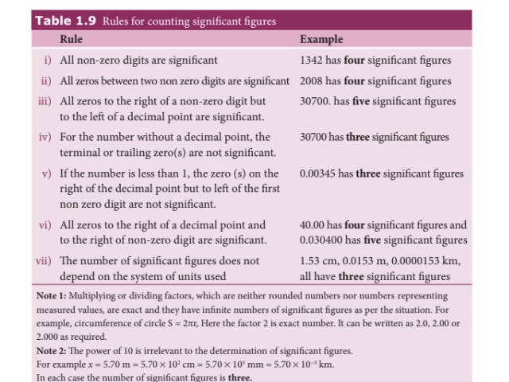
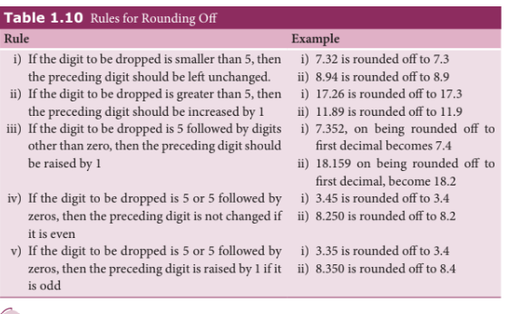

### 1.7.1 Definition and Rules of Significant Figures

Suppose we ask three students to measure the length of a stick using metre scale (the least count for metre scale is $1$ mm or $0.1$ cm). So, the result of the measurement (length of stick) can be any of the following, $7.20$ cm or $7.22$ cm or $7.23$ cm. Note that all the three students measured first two digits correctly (with confidence) but last digit varies from person to person. So, the number of meaningful digits is $3$ which communicate both measurement (quantitative) and also the precision of the instrument used. Therefore, significant number or significant digit is $3$. It is defined as the number of meaningful digits which contain numbers that are known reliably and first uncertain number.

**Examples:** The significant figure for the digit $121.23$ is $5$, significant figure for the digit $1.2$ is $2$, significant figure for the digit $0.123$ is $3$, significant digit for $0.1230$ is $4$, significant digit for $0.0123$ is $3$, significant digit for $1230$ is $3$, significant digit for $1230$ (with decimal) is $4$ and significant digit for $20000000$ is $1$ (because $20000000 = 2 \times 10^7$ has only one significant digit, that is, $2$).

In physical measurement, if the length of an object is $l = 1230$ m, then significant digit for $l$ is $4$.

The rules for counting significant figures are given in Table 1.9.

**EXAMPLE 1.10**

State the number of significant figures in the following:

i) $600800$ \quad ii) $400$ \quad iii) $0.007$ \quad iv) $5213.0$ \quad v) $2.65 \times 10^{24}$ m \quad vi) $0.0006032$

**Solution:** i) four \quad ii) one \quad iii) one \quad iv) five \quad v) three \quad vi) four

---

### 1.7.2 Rounding Off

Calculators are widely used now-a-days to do calculations. The result given by a calculator has too many figures. In no case should the result have more significant figures than the figures involved in the data used for calculation. The result of calculation with numbers containing more than one uncertain digit should be rounded off. The rules for rounding off are shown in Table 1.10.

---

**EXAMPLE 1.11**

Round off the following numbers as indicated:

i) $18.35$ up to $3$ digits 
ii) $19.45$ up to $3$ digits 
iii) $101.55 \times 10^6$ up to $4$ digits 
iv) $248337$ up to $3$ digits 
v) $12.653$ up to $3$ digits

**Solution:** i) $18.4$  ii) $19.4$  iii) $101.6 \times 10^6$  iv) $248000$  v) $12.7$

---

### 1.7.3 Arithmetical Operations with Significant Figures

**(i) Addition and subtraction**

In addition and subtraction, the final result should retain as many decimal places as there are in the number with the smallest number of decimal places.

**Example:**

1. $3.1 + 1.780 + 2.046 = 6.926$ \\
Here the least number of significant digits after the decimal is one. Hence the result will be $6.9$.

2. $12.637 - 2.42 = 10.217$ \\
Here the least number of significant digits after the decimal is two. Hence the result will be $10.22$.

**(ii) Multiplication and Division**

In multiplication or division, the final result should retain as many significant figures as there are in the original number with smallest number of significant figures.

**Example:**

1. $1.21 \times 36.72 = 44.4312 = 44.4$ \\
Here the least number of significant digits in the measured values is three. Hence the result when rounded off to three significant digits is $44.4$.

2. $36.72 \div 1.2 = 30.6 = 31$ \\
Here the least number of significant digits in the measured values is two. Hence the result when rounded off to significant digit becomes $31$.