---
We are slowed down sound and light waves, a walking bundle of frequencies tuned into the cosmos. We are souls dressed up in sacred biochemical garments and our bodies are the instruments through which our souls play their music – Albert Einstein

---

---
#### Learning Objectives

In this unit, the student is exposed to

- waves and their types (transverse and longitudinal)
- basic terms like wavelength, frequency, time period
- velocity of transverse waves and longitudinal waves
- velocity of sound waves
- reflection of sound waves from plane and curved surfaces
- progressive waves and their graphical representation
- superposition principle, interference of waves
- characteristics of stationary waves, sonometer
- fundamental frequency, harmonics and overtones
- intensity and loudness
- vibration of air column – closed organ pipe, open organ pipe
- Doppler effect and its applications
---

## INTRODUCTION

In the previous chapter, we have discussed the oscillation of a particle. Consider a medium which consists of a collection of particles. If the disturbance is created at one end, it propagates and reaches the other end. That is, the disturbance produced at the first mass point is transmitted to the next neighbouring mass point, and so on. Notice that here, only the disturbance is transmitted, not the mass points. Similarly, the speech we deliver is due to the vibration of our vocal chord inside the throat. This leads to the vibration of the surrounding air molecules and hence, the effect of speech (information) is transmitted from one point in space to another point in space without the medium carrying the particles. Thus, the disturbance which carries energy and momentum from one point in space to another point in space without the transfer of the medium is known as a wave.


Standing near a beach, one can observe waves in the ocean reaching the seashore with a similar wave pattern; hence they are called ocean waves. A rubber band when plucked vibrates like a wave which is an example of a standing wave. These are shown in Figure 11.2. Other examples of waves are light waves (electromagnetic waves), through which we see and enjoy the beauty of nature and sound waves using which we hear and enjoy pleasant melodious songs. Day to day applications of waves are numerous, such as mobile phone communication, laser surgery, etc.

### Ripples and wave formation on the water surface


Suppose we drop a stone in a trough of still water, we can see a disturbance produced at the place where the stone strikes the water surface as shown in Figure 11.3. We find that this disturbance spreads out (diverges out) in the form of concentric circles of ever increasing radii (ripples) and strike the boundary of the trough. This is because some of the kinetic energy of the stone is transmitted to the water molecules on the surface. Actually the particles of the water (medium) themselves do not move outward with the disturbance. This can be observed by keeping a paper strip on the water surface. The strip moves up and down when the disturbance (wave) passes on the water surface. This shows that the water molecules only undergo vibratory motion about their mean positions.

### Formation of waves on stretched string

Let us take a long string and tie one end of the string to the wall as shown in Figure 11.4 (a). If we give a quick jerk, a bump (like pulse) is produced in the string as shown in Figure 11.4 (b). Such a disturbance is sudden and it lasts for a short duration, hence it is known as a wave pulse. If jerks are given continuously then the waves produced are standing waves. Similar waves are produced by a plucked string in a guitar.


### Formation of waves in a tuning fork

When we strike a tuning fork on a rubber pad, the prongs of the tuning fork vibrate about their mean positions. The prong vibrating about a mean position means moving outward and inward, as indicated in the Figure 11.5. When a prong moves outward, it pushes the layer of air in its neighbourhood which means there is more accumulation of air molecules in this region. Hence, the density and also the pressure increase. These regions are known as compressed regions or compressions. This compressed air layer moves forward and compresses the next neighbouring layer in a similar manner. Thus a wave of compression advances or passes through air. When the prong moves inwards, the particles of the medium are moved to the right. In this region both density and pressure are low. It is known as a rarefaction or elongation.

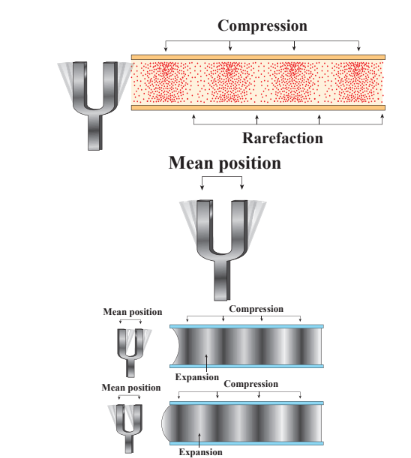

### Characteristics of wave motion

- For the propagation of the waves, the medium must possess both inertia and elasticity, which decide the velocity of the wave in that medium.
- In a given medium, the velocity of a wave is a constant whereas the constituent particles in that medium move with different velocities at different positions. Velocity is maximum at their mean position and zero at extreme positions.
- Waves undergo reflections, refraction, interference, diffraction and polarization.

| Point to ponder|
|------|
|The medium possesses both inertia and elasticity for propagation of waves.|
|Light is an electromagnetic wave. what is the medium for its transmission?|  

### Mechanical wave motion and its types

Wave motion can be classified into two types

a. **Mechanical wave** – Waves which require a medium for propagation are known as mechanical waves.

**Examples:** sound waves, ripples formed on the surface of water, etc.

b. **Non mechanical wave** – Waves which do not require any medium for propagation are known as non-mechanical waves.

**Example:** light waves, Infra red rays etc.

Further, waves can also be classified into two types

a. Transverse waves
b. Longitudinal waves

### Transverse wave motion


In transverse wave motion, the constituents of the medium oscillate or vibrate about their mean positions in a direction perpendicular to the direction of propagation (direction of energy transfer) of waves as shown in Figure 11.6.

**Example:** light (electromagnetic waves)

### Longitudinal wave motion

In longitudinal wave motion, the constituents of the medium oscillate or vibrate about their mean positions in a direction parallel to the direction of propagation (direction of energy transfer) of waves as shown in Figure 11.7.

**Example:** Sound waves travelling in air.

---
**Discuss with your Teacher** 
- Tsunami (pronounced soo-nah-mee in Japanese) means Harbour waves. 
- Tsunami is a series of huge and giant waves which come with great speed and huge force. What happened on 26th December 2004 in southern part of India? - Discuss
- Gravitational waves and LIGO (Laser lnterferometer Gravitational wave Observatory) experiment.
- Nobel Prize winners in Physics 2017 are Prof. Rainer Weiss, Prof. Barry C. Barish and Prof. Kip S. Thorne for decisive contributions to the LIGO detector and observation of gravitational forces.

---

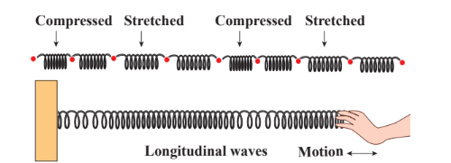

**Table 11.1: Comparison of transverse and longitudinal waves**
|S. No|Transverse waves|Longitudinal waves|
|---|---|---|
|1.|The direction of vibration of particles of the medium is perpendicular to the direction of propagation of waves.|The direction of vibration of particles of the medium is parallel to the direction of propagation of waves.|
|2.|The disturbances are in the form of crests and troughs.|The disturbances are in the form of compressions and rarefactions.|
|3.|Transverse waves are possible in elastic medium.|Longitudinal waves are possible in all types of media (solid, liquid and gas).|

**NOTE:**

1. Absence of medium is also known as vacuum. Only electromagnetic waves can travel through vacuum.
2. Rayleigh waves are considered to be mixture of transverse and longitudinal.

## TERMS AND DEFINITIONS USED IN WAVE MOTION


Suppose we have two waves as shown in Figure 11.8. Are these two waves identical? No. Though the two waves are both sinusoidal, there are many differences between them. Therefore, we have to define some basic terminologies to distinguish one wave from another.

Consider a wave produced in a stretched string as shown in Figure 11.9.

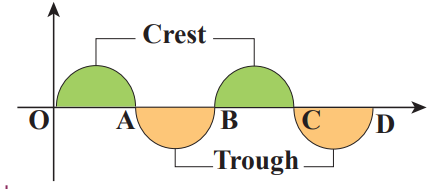

If we are interested in counting the number of waves created, let us put a reference level (mean position) as shown in Figure 11.9. Here the mean position is the horizontal line shown. The highest point in the shaded portion is called _crest_. With respect to the reference level, the lowest point on the un-shaded portion is called trough. This wave contains repetition of a section O to B and hence we define the length of the smallest section without repetition as one _wavelength_ as shown in Figure 11.10. In Figure 11.10 the length OB or length BD is one wavelength. A Greek letter lambda λ is used to denote one wavelength.


For transverse waves (as shown in Figure 11.11), the distance between two neighbouring crests or troughs is known as the _wavelength_. For longitudinal waves, (as shown in Figure 11.12) the distance between two neighbouring compressions or rarefactions is known as the wavelength. The SI unit of wavelength is _meter_.

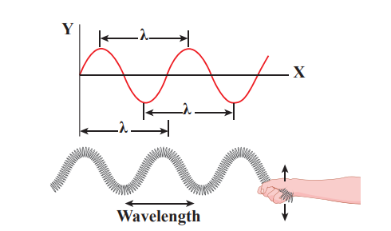

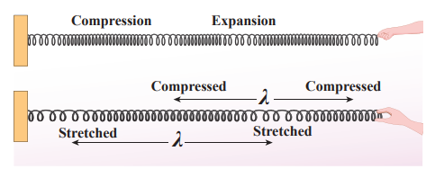

**EXAMPLE 11.1**

Which of the following has longer wavelength?


**Answer** is (c)

In order to understand frequency and time period, let us consider waves (made of three wavelengths) as shown in Figure 11.13 (a). At time \(t = 0\) s, the wave reaches the point A from left. After time \(t = 1\) s (shown in figure 11.13(b)), the number of waves which have crossed the point A is two. Therefore, the frequency is defined as the number of waves crossing a point per second. It is measured in _hertz_ whose symbol is _Hz_. In this example,

\[
f = 2 \, \text{Hz} \tag{11.1}
\]


If two waves take one second (time) to cross the point A then the time taken by one wave to cross the point A is half a second. This defines the time period \(T\) as

\[
T = \frac{1}{2} = 0.5 \, \text{s} \tag{11.2}
\]

From equation (11.1) and equation (11.2), _frequency and time period are inversely related_ i.e.,

\[
T = \frac{1}{f} \tag{11.3}
\]

_Time period is defined as the time taken by one wave to cross a point_.

---
**EXAMPLE 11.2**

Three waves are shown in the figure below.

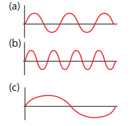

Write down

(a) the frequency in ascending order

(b) the wavelength in ascending order

**_Solution_**

(a) \(f_c < f_a < f_b\)

(b) \(\lambda_b < \lambda_a < \lambda_c\)

From example 11.2, we observe that the frequency is inversely related to the wavelength, \(f \propto \frac{1}{\lambda}\)

Then, \(f \lambda\) is equal to what? (i.e) \(f \lambda = ?\)

A simple dimensional argument will help us to determine this unknown physical quantity.

Dimension of wavelength is, \([\lambda] = L\)

Frequency \(f = \frac{1}{\text{Time period}}\), which implies that the dimension of frequency is,
\[
[f] = \frac{1}{[T]} = T^{-1}
\]
\[
\Rightarrow [\lambda f] = [\lambda][f] = L T^{-1} = [\text{velocity}]
\]

Therefore,
\[
\text{Velocity, } \lambda f = v \tag{11.4}
\]

where \(v\) is known as the _wave velocity_ or _phase velocity_. This is the velocity with which the wave propagates. _Wave velocity_ is the distance travelled by a wave in one second.

---

**Note:**

1. The number of cycles (or revolutions) per unit time is called _angular frequency_. _Angular frequency,_ \(\omega = \frac{2\pi}{T} = 2\pi f\) (unit is radians/second)

2. The number of cycles per unit distance or number of waves per unit distance is called _wave number_.

_wave number, \(k = \frac{2\pi}{\lambda}\)_ (unit is radians/ meter)

The velocity \(v\), angular frequency \(\omega\) and wave number \(k\) are related as:

\[
\text{velocity, } v = \lambda f = \frac{\lambda}{2\pi} \cdot 2\pi f = \frac{\omega}{k}
\]

---

**EXAMPLE 11.3**

The average range of frequencies at which human beings can hear sound waves varies from 20 Hz to 20 kHz. Calculate the wavelength of the sound wave in these limits. (Assume the speed of sound to be 340 m s\(^{-1}\).)

**_Solution_**

\[
\lambda_1 = \frac{v}{f_1} = \frac{340}{20} = 17 \, \text{m}
\]
\[
\lambda_2 = \frac{v}{f_2} = \frac{340}{20 \times 10^3} = 0.017 \, \text{m}
\]

Therefore, the audible wavelength region is from 0.017 m to 17 m when the velocity of sound in that region is 340 m s\(^{-1}\).

---

**EXAMPLE 11.4**

A man saw a toy duck on a wave in an ocean. He noticed that the duck moved up and down 15 times per minute. He roughly measured the wavelength of the ocean wave as 1.2 m. Calculate the time taken by the toy duck for going one time up and down and also the velocity of the ocean wave.


**_Solution_** 

Given that the number of times the toy duck moves up and down is 15 times per minute. This information gives us frequency (the number of times the toy duck moves up and down)

\[
f = \frac{15 \text{ times}}{1 \text{ minute}}
\]

But one minute is 60 second, therefore, expressing time in terms of second

\[
f = \frac{15}{60} = \frac{1}{4} = 0.25 \, \text{Hz}
\]

The time taken by the toy duck for going one time up and down is time period which is inverse of frequency

\[
T = \frac{1}{f} = \frac{1}{0.25} = 4 \, \text{s}
\]

The velocity of ocean wave is

\[
v = \lambda f = 1.2 \times 0.25 = 0.3 \, \text{m s}^{-1}
\]

---

## Amplitude of a wave

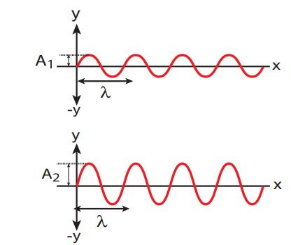

The waves shown in Figure 11.14 have same wavelength, same frequency and same time period and also move with same velocity. The only difference between two waves is the height of either crest or trough. This means, the height of the crest or trough also signifies a wave character. So we define a quantity called an amplitude of the wave, as the maximum displacement of the medium with respect to a reference axis (for example in this case x-axis). Here, it is denoted by A.

---

**EXAMPLE 11.5**

Consider a string whose one end is attached to a wall. Then compute the following in both situations given in figure (assume waves crosses the distance in one second)


(a) Wavelength, (b) Frequency and (c) Velocity 

**Solution**

| |First case|Second case|
|---|---|---|
|**(a)** Wavelength|\(\lambda = 6\) m|\(\lambda = 2\) m|
|**(b)** Frequency|\(f = 2\) Hz|\(f = 6\) Hz|
|**(c)** Velocity|\(v = 6 \times 2 = 12\) m s\(^{-1}\)|\(v = 2 \times 6 = 12\) m s\(^{-1}\)|

This means that the speed of the wave along a string is a constant. Higher the frequency, shorter the wavelength and vice versa, and their product is velocity which remains the same.

---

## VELOCITY OF WAVES IN DIFFERENT MEDIA

Suppose a hammer is struck on long rails at a distance and when a person keeps his ear near the rails at the other end he/she will hear two sounds, at different instants. The sound that is heard through the rails (solid medium) is faster than the sound we hear through the air (gaseous medium). This implies the velocity of sound is different in different media.

In this section, we shall derive the velocity of waves in two different cases:

1. The velocity of a transverse waves along a stretched string.

2. The velocity of a longitudinal waves in an elastic medium.

### Velocity of transverse waves in a stretched string

Let us compute the velocity of transverse travelling waves on a string. When a jerk is given at one end (left end) of the rope, the wave pulses move towards right end with a velocity \(v\) with respect to an observer who is at rest frame.

Consider an elemental segment in the string as shown in Figure 11.15. Let A and B be two points on the string at an instant of time. Let \(dl\) and \(dm\) be the length and mass of the elemental string, respectively. By definition, linear mass density, \(\mu\) is

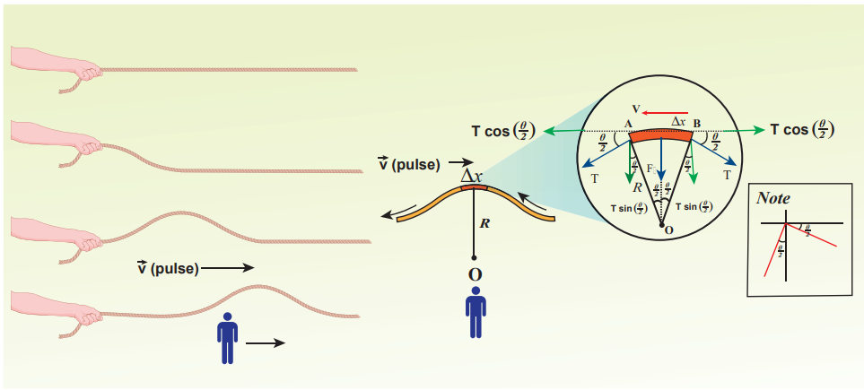

\[
\mu = \frac{dm}{dl} \tag{11.5}
\]
\[
dm = \mu \, dl \tag{11.6}
\]

The elemental string AB has a curvature which looks like an arc of a circle with centre at O, radius R and the arc subtending an angle \(\theta\) at the origin O as shown in Figure 11.15(b). The angle \(\theta\) can be written in terms of arc length and radius as \(\theta = \frac{dl}{R}\). The centripetal acceleration supplied by the tension in the string is

\[
a_{cp} = \frac{v^{2}}{R} \tag{11.7}
\]

Then, centripetal force is

\[
F_{cp} = (dm) \frac{v^{2}}{R} \tag{11.8}
\]

From eqn 11.6,

\[
(dm) \frac{v^{2}}{R} = \mu v^{2} \frac{dl}{R} \tag{11.9}
\]

The tension T acts along the tangent of the elemental segment of the string at A and B. Since the arc length is very small, variation in the tension force can be ignored. We can resolve T into horizontal component \(T \cos \frac{\theta}{2}\).

The horizontal components at A and B are equal in magnitude but opposite in direction; therefore, they cancel each other. Since the elemental arc length AB is taken to be very small, the vertical components at A and B appear to act vertical towards the centre of the arc and hence, they add up. The net radial force \(F_r\) is

\[
F_r = 2T \sin\left(\frac{\theta}{2}\right) \tag{11.10}
\]

Since the amplitude of the wave is very small when it is compared with the length of the string, \(\sin(\theta/2) \approx \theta/2\). Hence,

\[
F_r = 2T \times \frac{\theta}{2} = T\theta \tag{11.11}
\]

But \(\theta = \frac{dl}{R}\), we get

\[
F_r = \frac{T dl}{R} \tag{11.12}
\]

Applying Newton’s second law to the elemental string in the radial direction, under equilibrium, the radial component of the force is equal to the centripetal force. Hence equating equation (11.9) and equation (11.12), we have

\[
\frac{T dl}{R} = \mu v^{2} \frac{dl}{R}
\]
\[
v = \sqrt{\frac{T}{\mu}} \tag{11.13}
\]

**Observations:** 

- The velocity of the string is
  a. directly proportional to the square root of the tension force
  b. inversely proportional to the square root of linear mass density
  c. independent of shape of the waves.

---

**EXAMPLE 11.6**

Calculate the velocity of the travelling pulse as shown in the figure below. The linear mass density of pulse is 0.25 kg m\(^{-1}\). Further, compute the time taken by the travelling pulse to cover a distance of 30 cm on the string.


**Solution**

The tension in the string is \(T = m g = 1.2 \times 9.8 = 11.76\) N
The mass per unit length is \(\mu = 0.25\) kg m\(^{-1}\)

Therefore, velocity of the wave pulse is

\[
v = \sqrt{\frac{T}{\mu}} = \sqrt{\frac{11.76}{0.25}} = 6.858 \, \text{m s}^{-1} \approx 6.8 \, \text{m s}^{-1}
\]

The time taken by the pulse to cover the distance of 30 cm is

\[
t = \frac{d}{v} = \frac{30 \times 10^{-2}}{6.8} = 0.044 \, \text{s} = 44 \, \text{ms}
\]

Where, ms = milli second.

---

### Velocity of longitudinal waves in an elastic medium

Consider an elastic medium (here we assume air) having a fixed mass contained in a long tube (cylinder) whose cross sectional area is \(A\) and maintained under a pressure \(P\). One can generate longitudinal waves in the fluid either by displacing the fluid using a piston or by keeping a vibrating tuning fork at one end of the tube. Let us assume that the direction of propagation of waves coincides with the axis of the cylinder. Let \(\rho\) be the density of the fluid which is initially at rest. At \(t = 0\), the piston at left end of the tube is set in motion toward the right with a speed \(u\).


Let \(u\) be the velocity of the piston and \(v\) be the velocity of the elastic wave. In time interval \(\Delta t\), the distance moved by the piston \(\Delta d = u \Delta t\). Now, the distance moved by the elastic disturbance is \(\Delta x = v \Delta t\). Let \(\Delta m\) be the mass of the air that has attained a velocity \(v\) in a time \(\Delta t\). Therefore,

\[
\Delta m = \rho A \Delta x = \rho A (v \Delta t)
\]

Then, the momentum imparted due to motion of piston with velocity \(u\) is

\[
\Delta p = [\rho A (v \Delta t)] u
\]

But the change in momentum is impulse. The net impulse is

\[
I = (\Delta P A) \Delta t
\]

Or

\[
(\Delta P A) \Delta t = [\rho A (v \Delta t)] u
\]
\[
\Delta P = \rho v u \tag{11.14}
\]

When the sound wave passes through air, the small volume element \((\Delta V)\) of the air undergoes regular compressions and rarefactions. So, the change in pressure can also be written as

\[
\Delta P = K \frac{\Delta V}{V}
\]

where, \(V\) is original volume and \(K\) is known as bulk modulus of the elastic medium.

But \(V = A \Delta x = A v \Delta t\) and

\(\Delta V = A \Delta d = A u \Delta t\)

Therefore,

\[
\Delta P = K \frac{A u \Delta t}{A v \Delta t} = K \frac{u}{v} \tag{11.15}
\]

Comparing equation (11.14) and equation (11.15), we get

\[
\rho v u = K \frac{u}{v} \quad \text{or} \quad v^{2} = \frac{K}{\rho}
\]
\[
\Rightarrow v = \sqrt{\frac{K}{\rho}} \tag{11.16}
\]

In general, the velocity of a longitudinal wave in elastic medium is \(v = \sqrt{\frac{E}{\rho}}\), where \(E\) is the modulus of elasticity of the medium.

**Cases: For a solid :**

**(i) one dimensional rod (1D)**

\[
v = \sqrt{\frac{Y}{\rho}} \tag{11.17}
\]

where \(Y\) is the Young’s modulus of the material of the rod and \(\rho\) is the density of the rod. The 1D rod will have only Young’s modulus.

**(ii) Three dimensional rod (3D) The speed** of longitudinal wave in a solid is

\[
v = \sqrt{\frac{K + \frac{4}{3}\eta}{\rho}} \tag{11.18}
\]

where \(\eta\) is the modulus of rigidity, \(K\) is the bulk modulus and \(\rho\) is the density of the rod.

**Cases:** **For liquids:**

\[
v = \sqrt{\frac{K}{\rho}} \tag{11.19}
\]

where, \(K\) (or) \(B\) is the bulk modulus and \(\rho\) is the density of the rod.

---

**EXAMPLE 11.7**

Calculate the speed of sound in a steel rod whose Young’s modulus \(Y = 2 \times 10^{11}\) N m\(^{-2}\) and \(\rho = 7800\) kg m\(^{-3}\).

**Solution**

\[
v = \sqrt{\frac{Y}{\rho}} = \sqrt{\frac{2 \times 10^{11}}{7800}} = \sqrt{2.564 \times 10^{7}} \approx 5064 \, \text{m s}^{-1}
\]

Therefore, longitudinal waves travel faster in a solid than in a liquid or a gas. Now you may understand why a shepherd checks before crossing railway track by keeping his ears on the rails to safeguard his cattle.

---

**EXAMPLE 11.8**

An increase in pressure of 100 kPa causes a certain volume of water to decrease by 0.005% of its original volume.

(a) Calculate the bulk modulus of water?

(b) Compute the speed of sound (compressional waves) in water?

**_Solution_**

(a) Bulk modulus

\[
K = \frac{\Delta P}{\left( \frac{-\Delta V}{V} \right)} = \frac{100 \times 10^{3}}{0.005 \times 10^{-2}} = \frac{10^{5}}{5 \times 10^{-5}} = 2 \times 10^{9} \, \text{Pa}
\]

(MPa is mega pascal)

(b) Speed of sound in water is

\[
v = \sqrt{\frac{K}{\rho}} = \sqrt{\frac{2 \times 10^{9}}{10^{3}}} = \sqrt{2 \times 10^{6}} = 1.414 \times 10^{3} \, \text{m s}^{-1}
\]

---

**NOTE**

The velocities of both transverse waves and longitudinal waves depend on elastic property (like string tension T or bulk modulus K) and inertial property (like density or mass per unit length) i.e., \(v = \sqrt{\frac{\text{Elastic property}}{\text{inertial property}}}\).

---

**Table 11.2: Speed of sound in various media**

|S.No. | **Medium** | **Speed in m s\(^{-1}\)**| 
|---|---|---|
|Solids: 1.| Rubber | 600 |  
|2.| Gold | 3240 |
|3.| Brass| 4700|
|4.| Copper| 5010|
|5.| Iron |5950|
|6.| Aluminum |6420| 
|Liquids at 25°C: 1.| Kerosene |1324| 
|2.| Mercury |1450|
|3.| Water |1493|
|4.| Sea Water |1533|
|Gas (at 0°C) 1.| Oxygen |317 |
|2.| Air |331|
|3.| Helium |972|
|4.| Hydrogen |1286|
|Gas (at 20°C): 1.| Air |343 |

## PROPAGATION OF SOUND WAVES

We know that sound waves are longitudinal waves, and when they propagate compressions and rarefactions are formed. In the following section, we compute the speed of sound in air by Newton’s method and also discuss the Laplace correction and the factors affecting sound in air.

### Newton’s formula for speed of sound waves in air

Sir Isaac Newton assumed that when sound propagates in air, the formation of compression and rarefaction takes place in a very slow manner so that the process is isothermal in nature. That is, the heat produced during compression (pressure increases, volume decreases), and heat lost during rarefaction (pressure decreases, volume increases) occur over a period of time such that the temperature of the medium remains constant. Therefore, by treating the air molecules to form an ideal gas, the changes in pressure and volume obey Boyle’s law, Mathematically

\[
PV = \text{Constant} \tag{11.20}
\]

Differentiating equation (11.20), we get

\[
P \, dV + V \, dP = 0
\]

or,

\[
P = -\frac{V \, dP}{dV} = K_I \tag{11.21}
\]

where, \(K_I\) is an isothermal bulk modulus of air. Substituting equation (11.21) in equation (11.16), the speed of sound in air is

\[
v = \sqrt{\frac{K_I}{\rho}} = \sqrt{\frac{P}{\rho}} \tag{11.22}
\]

Since \(P\) is the pressure of air whose value at NTP (Normal Temperature and Pressure) is 76 cm of mercury, we have \(P = h \rho g\):

\[
P = (0.76 \times 13.6 \times 10^{3} \times 9.8) \, \text{N m}^{-2}
\]
\[
\rho = 1.293 \, \text{kg m}^{-3}
\]

Then the speed of sound in air at Normal Temperature and Pressure (NTP) is

\[
v = \sqrt{\frac{0.76 \times 13.6 \times 10^{3} \times 9.8}{1.293}} = 279.80 \, \text{m s}^{-1} \approx 280 \, \text{m s}^{-1} \text{ (theoretical value)}
\]

But the speed of sound in air at 0°C is experimentally observed as 332 m s\(^{-1}\) which is close up to 16% more than theoretical value (Percentage error is \(\frac{332-280}{280} \times 100 \approx 18.6\%\)). This error is not small.

### Laplace’s correction

In 1816, Laplace satisfactorily corrected this discrepancy by assuming that when the sound propagates through a medium, the particles oscillate very rapidly such that the compression and rarefaction occur very fast. Hence the exchange of heat produced due to compression and cooling effect due to rarefaction do not take place, because air (medium) is a bad conductor of heat. Since temperature is no longer considered as a constant here, sound propagation is an adiabatic process. By adiabatic considerations, the gas obeys Poisson’s law (not Boyle’s law as Newton assumed), which is

\[
P V^{\gamma} = \text{constant} \tag{11.23}
\]

where \(\gamma = \frac{C_p}{C_v}\), which is the ratio between specific heat at constant pressure and specific heat at constant volume. Differentiating equation (11.23) on both the sides, we get

\[
\gamma P V^{\gamma-1} dV + V^{\gamma} dP = 0
\]

or,

\[
\gamma P = -\frac{V dP}{dV} = K_A \tag{11.24}
\]

where, \(K_A\) is the adiabatic bulk modulus of air. Now, substituting equation (11.24) in equation (11.16), the speed of sound in air is

\[
v = \sqrt{\frac{K_A}{\rho}} = \sqrt{\frac{\gamma P}{\rho}} \tag{11.25}
\]

Since air contains mainly nitrogen, oxygen, hydrogen etc, (diatomic gas), we take \(\gamma = 1.4\). Hence, speed of sound in air is \(v_A = \sqrt{1.4} (280 \, \text{m s}^{-1}) = 331.30 \, \text{m s}^{-1}\), which is very much closer to experimental data.

### Factors affecting speed of sound in gases

Let us consider an ideal gas whose equation of state is 

\[
PV = \mu R T \tag{11.26}
\]

where, \(P\) is pressure, \(V\) is volume, \(T\) is temperature, \(\mu\) is number of moles and \(R\) is universal gas constant. For a given mass of a molecule, equation (11.26) can be written as

\[
\frac{PV}{T} = \text{Constant} \tag{11.27}
\]

For a fixed mass \(m\), density of the gas inversely varies with volume. i.e.,

\[
\rho = \frac{m}{V} \quad \Rightarrow \quad V = \frac{m}{\rho} \tag{11.28}
\]

Substituting equation (11.28) in equation (11.27), we get

\[
\frac{P}{\rho T} = \text{constant} \quad \Rightarrow \quad \frac{P}{\rho} = c T \tag{11.29}
\]

where \(c\) is constant.

The speed of sound in air given in equation (11.25) can be written as

\[
v = \sqrt{\gamma \frac{P}{\rho}} = \sqrt{\gamma c T} \tag{11.30}
\]

From the above relation we observe the following

**(a) Effect of pressure :**

For a fixed temperature, \(\frac{P}{\rho}\) becomes constant. This means that the speed of sound is independent of pressure for a fixed temperature. If the temperature remains same at the top and the bottom of a mountain then the speed of sound will remain same at these two points. But, in practice, the temperatures are not same at top and bottom of a mountain; hence, the speed of sound is different at different points.

**(b) Effect of temperature :**

Since \(v \propto \sqrt{T}\), the speed of sound varies directly to the square root of temperature in kelvin.

Let \(v_0\) be the speed of sound at temperature at 0°C or 273 K and \(v\) be the speed of sound at any arbitrary temperature \(T\) (in kelvin), then

\[
\frac{v}{v_0} = \sqrt{\frac{T}{273}} = \sqrt{1 + \frac{t}{273}} = 1 + \frac{1}{2} \frac{t}{273} \quad (\text{using binomial expansion})
\]

Since \(v_0 = 331 \, \text{m s}^{-1}\) at 0°C, \(v\) at any temperature in \(t\)°C is

\[
v = (331 + 0.61 t) \, \text{m s}^{-1}
\]

Thus the speed of sound in air increases by 0.61 m s\(^{-1}\) per degree Celsius rise in temperature. Note that when the temperature is increased, the molecules will vibrate faster due to gain in thermal energy and hence, speed of sound increases.

**(c) Effect of density :** Let us consider two gases with different densities having same temperature and pressure. Then the speed of sound in the two gases are

\[
v_1 = \sqrt{\frac{\gamma_1 P}{\rho_1}} \tag{11.31}
\]
and
\[
v_2 = \sqrt{\frac{\gamma_2 P}{\rho_2}} \tag{11.32}
\]

Taking ratio of equation (11.31) and equation (11.32), we get

\[
\frac{v_1}{v_2} = \sqrt{\frac{\gamma_1 \rho_2}{\gamma_2 \rho_1}}
\]

For gases having same value of \(\gamma\),

\[
\frac{v_1}{v_2} = \sqrt{\frac{\rho_2}{\rho_1}} \tag{11.33}
\]

Thus the velocity of sound in a gas is inversely proportional to the square root of the density of the gas.

**(d) Effect of moisture (humidity):**

We know that density of moist air is 0.625 of that of dry air, which means the presence of moisture in air (increase in humidity) decreases its density. Therefore, speed of sound increases with rise in humidity. From equation (11.30)

\[
\frac{v_1}{v_2} = \sqrt{\frac{\rho_2}{\rho_1}}
\]

Let \(\rho_1, v_1\) and \(\rho_2, v_2\) be the density and speeds of sound in dry air and moist air, respectively. Then \(\rho_2 < \rho_1\) if \(\gamma_1 = \gamma_2\). Since \(P\) is the total atmospheric pressure, according to Dalton’s law of partial pressure, it can be shown that

\[
\frac{\rho_2}{\rho_1} = \frac{P}{p_1 + p_2 \frac{M_v}{M_d}} = \frac{P}{p_1 + \left(\frac{5}{8}\right) p_2}
\]

where \(p_1\) and \(p_2\) are the partial pressures of dry air and water vapour respectively, and \(M_v\) and \(M_d\) are the molecular masses of water vapour and dry air. Then

\[
\frac{v_2}{v_1} = \sqrt{\frac{\rho_1}{\rho_2}} = \sqrt{1 + \left(\frac{3}{8}\right) \frac{p_2}{p_1}} \tag{11.34}
\]

**(e) Effect of wind:**

The speed of sound is also affected by blowing of wind. In the direction along the wind blowing, the speed of sound increases whereas in the direction opposite to wind blowing, the speed of sound decreases.

---

**EXAMPLE 11.9**

The ratio of the densities of oxygen and nitrogen is 16:14. Calculate the temperature when the speed of sound in nitrogen gas at 17°C is equal to the speed of sound in oxygen gas.

**_Solution_**

From equation (11.25), we have

\[
v = \sqrt{\frac{\gamma P}{\rho}}
\]

But \(\rho = \frac{M}{V}\). Therefore,

\[
v = \sqrt{\frac{\gamma R T}{M}} \quad ( \text{since } P = \frac{\rho R T}{M} )
\]

Using equation (11.26),

\[
P = \frac{\rho R T}{M} \quad \Rightarrow \quad \frac{P}{\rho} = \frac{R T}{M}
\]

Where, \(R\) is the universal gas constant and \(M\) is the molecular mass of the gas. The speed of sound in nitrogen gas at 17°C is

\[
v_{N_2} = \sqrt{\frac{\gamma R (273 + 17)}{M_{N_2}}} \tag{1}
\]

Similarly, the speed of sound in oxygen gas at temperature \(t\) is

\[
v_{O_2} = \sqrt{\frac{\gamma R (273 + t)}{M_{O_2}}} \tag{2}
\]

Given that the value of \(\gamma\) is same for both the gases, the two speeds must be equal. Hence, equating equation (1) and (2), we get

\[
\frac{M_{O_2}}{M_{N_2}} = \frac{273 + t}{273 + 17} \tag{3}
\]

Squaring on both sides and cancelling \(\gamma R\) term and rearranging, we get

\[
t = (273 + 17) \frac{M_{O_2}}{M_{N_2}} - 273 \tag{4}
\]

Since the densities of oxygen and nitrogen is 16:14,

\[
\frac{M_{O_2}}{M_{N_2}} = \frac{16}{14} = \frac{8}{7} \tag{5}
\]

Substituting equation (5) in equation (3), we get

\[
t = 290 \times \frac{8}{7} - 273 = 331.43 - 273 = 58.43°C \quad \Rightarrow \quad t \approx 58.4 \, \text{°C}
\]

## REFLECTION OF SOUND WAVES

When sound wave passes from one medium to another medium, the following things can happen

(a) **Reflection of sound:** If the medium is highly dense (highly rigid), the sound can be reflected completely (bounced back) to the original medium.

(b) **Refraction of sound:** When the sound waves propagate from one medium to another medium such that there can be some energy loss due to absorption by the second medium.

In this section, we will consider only the reflection of sound waves in a medium when it experiences a harder surface. Sound can also obey the laws of reflection, which state that

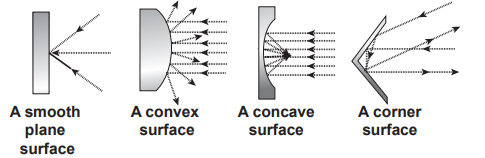

(i) The angle of incidence of sound is equal to the angle of reflection.

(ii) When the sound wave is reflected by a surface then the incident wave, reflected wave and the normal at the point of incidence all lie in the same plane.

Similar to reflection of light from a mirror, sound also reflects from a harder flat surface. This is called specular reflection.

Specular reflection is observed only when the wavelength of the source is smaller than dimensions of the reflecting surface, as well as smaller than surface irregularities.

### Reflection of sound through the plane surface

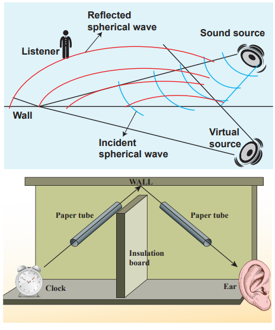

When the sound waves hit the plane wall, they bounce off in a manner similar to that of light. Suppose a loudspeaker is kept at an angle with respect to a wall (plane surface), then the waves coming from the source (assumed to be a point source) can be treated as spherical wave fronts (say, compressions moving like a spherical wave front). Therefore, the reflected wave front from the plane surface is also spherical, such that its centre of curvature (which lies on the other side of plane surface) can be treated as the image of the sound source (virtual or imaginary loud speaker). These are shown in Figures 11.18, 11.19.


### Reflection of sound through the curved surface

The behaviour of sound is different when it is reflected from different surfaces like convex or concave or plane. The sound reflected from a convex surface is spread out and so it is easily attenuated and weakened. Whereas, if it is reflected from the concave surface it will converge at a point and this can be easily amplified. The parabolic reflector (curved reflector) which is used to focus the sound precisely to a point is used in designing the parabolic mics which are known as high directional microphones.

We know that any surface (smooth or rough) can absorb sound. For example, the sound produced in a big hall or auditorium or theatre is absorbed by the walls, ceilings, floor, seats etc. To avoid such losses, a curved sound board (concave board) is kept in front of the speaker, so that the board reflects the sound waves of the speaker towards the audience. This method will minimize the spreading of sound waves in all possible directions in that hall and also enhances the uniform distribution of sound throughout the hall. That is why a person sitting at any position in that hall can hear the sound without any disturbance.

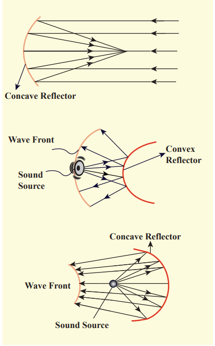


### Applications of reflection of sound waves

**(a) Stethoscope:** It works on the principle of multiple reflections.

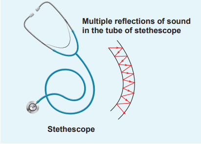

It consists of three main parts: (i) Chest piece (ii) Ear piece (iii) Rubber tube

**(i) Chest piece:** It consists of a small disc-shaped resonator (diaphragm) which is very sensitive to sound and amplifies the sound it detects.

**(ii) Ear piece:** It is made up of metal tubes which are used to hear sounds detected by the chest piece.

**(iii) Rubber tube:** This tube connects both chest piece and ear piece. It is used to transmit the sound signal detected by the diaphragm, to the ear piece. The sound of heart beats (or lungs) or any sound produced by internal organs can be detected, and it reaches the ear piece through this tube by multiple reflections.

Scientists have estimated that _we can hear two sounds properly if the time gap or time interval between each sound is \(\frac{1}{10}\) of a second (persistence of hearing) i.e., 0.1 s. Then,_

\[
\text{velocity} = \frac{\text{Distance travelled}}{\text{time taken}} = \frac{2d}{t}
\]
\[
2d = 344 \times 0.1 = 34.4 \, \text{m}
\]
\[
d = 17.2 \, \text{m}
\]

The minimum distance from a sound reflecting wall to hear an echo at 20°C is 17.2 meter.

**Note**

**(b) Echo:** An echo is a repetition of sound produced by the reflection of sound waves from a wall, mountain or other obstructing surfaces. The speed of sound in air at 20°C is 344 m s\(^{-1}\). If we shout at a wall which is at 344 m away, then the sound will take 1 second to reach the wall. After reflection, the sound will take one more second to reach us. Therefore, we hear the echo after two seconds.

**(c) SONAR:** **SO**_und_ **NA**_vigation_ and **R**_anging_. Sonar systems make use of reflections of sound waves in water to locate the position or motion of an object. Similarly, dolphins and bats use the sonar principle to find their way in the darkness.

**(d) Reverberation:** In a closed room the sound is repeatedly reflected from the walls and it is even heard long after the sound source ceases to function. The residual sound remaining in an enclosure and the phenomenon of multiple reflections of sound is called reverberation. The duration for which the sound persists is called reverberation time. It should be noted that the reverberation time greatly affects the quality of sound heard in a hall. Therefore, halls are constructed with some optimum reverberation time.

---

**EXAMPLE 11.10**

Suppose a man stands at a distance from a cliff and claps his hands. He receives an echo from the cliff after 4 second. Calculate the distance between the man and the cliff. Assume the speed of sound to be 343 m s\(^{-1}\).

**_Solution_** The time taken by the sound to come back as echo is \(2t = 4 \Rightarrow t = 2\) s. Therefore, the distance is \(d = v t = (343 \, \text{m s}^{-1})(2 \, \text{s}) = 686 \, \text{m}\).

---

**Note: Classification of sound waves:** Sound waves can be classified in three groups according to their range of frequencies:

**(1) _Infrasonic waves:_** Sound waves having frequencies below 20 Hz are called infrasonic waves. These waves are produced during earthquakes. Human beings cannot hear these frequencies. Snakes can hear these frequencies.

**(2) _Audible waves:_** Sound waves having frequencies between 20 Hz to 20,000 Hz (20 kHz) are called audible waves. Human beings can hear these frequencies.

**(3) _Ultrasonic waves:_** Sound waves having frequencies greater than 20 kHz are known as ultrasonic waves. Human beings cannot hear these frequencies. Bats can produce and hear these frequencies.

(1) Supersonic speed: An object moving with a speed greater than the speed of sound is said to move with a supersonic speed.

(2) Mach number: It is the ratio of the velocity of source to the velocity of sound.

## PROGRESSIVE WAVES (OR) TRAVELLING WAVES

If a wave that propagates in a medium is continuous then it is known as progressive wave or travelling wave.

### Characteristics of progressive waves

1. Particles in the medium vibrate about their mean positions with the same amplitude.
2. The phase of every particle ranges from 0 to \(2\pi\).
3. No particle remains at rest permanently. During wave propagation, particles come to the rest position only twice at the extreme points.
4. Transverse progressive waves are characterized by crests and troughs whereas longitudinal progressive waves are characterized by compressions and rarefactions.
5. When the particles pass through the mean position they always move with the same maximum velocity.
6. The displacement, velocity and acceleration of particles separated from each other by \(n\lambda\) are the same, where \(n\) is an integer, and \(\lambda\) is the wavelength.

### Equation of a plane progressive wave


Suppose we give a jerk on a stretched string at time \(t = 0\) s. Let us assume that the wave pulse created during this disturbance moves along positive \(x\) direction with constant speed \(v\) as shown in Figure 11.23 (a).

We can represent the shape of the wave pulse mathematically as \(y = y(x, 0) = f(x)\) at time \(t = 0\) s. Assume that the shape of the wave pulse remains the same during the propagation. After some time \(t\), the pulse moving towards the right and any point on it can be represented by \(x'\) (read it as \(x\) prime) as shown in Figure 11.23 (b). Then,

\[
y(x, t) = f(x') = f(x - vt) \tag{11.35}
\]

Similarly, if the wave pulse moves towards left with constant speed \(v\), then \(y = f(x + vt)\). Both waves \(y = f(x + vt)\) and \(y = f(x - vt)\) will satisfy the following one dimensional differential equation known as the wave equation

\[
\frac{\partial^{2} y}{\partial x^{2}} = \frac{1}{v^{2}} \frac{\partial^{2} y}{\partial t^{2}} \tag{11.36}
\]

where the symbol \(\partial\) represents partial derivative (read \(\partial y / \partial x\) as partial \(y\) by partial \(x\)). Not all the solutions satisfying this differential equation can represent waves, because any physically acceptable wave must take finite values for all values of \(x\) and \(t\). But if the function represents a wave then it must satisfy the differential equation. Since, in one dimension (one independent variable), the partial derivative with respect to \(x\) is the same as total derivative in coordinate \(x\), we write

\[
\frac{d^{2} y}{d x^{2}} = \frac{1}{v^{2}} \frac{d^{2} y}{d t^{2}} \tag{11.37}
\]

This can be extended to more than one dimension (two, three, etc.). Here, for simplicity, we focus only on the one dimensional wave equation.

---

**EXAMPLE 11.11**

Sketch \(y = x - a\) for different values of \(a\).

**_Solution_**

This implies, when increasing the value of \(a\), the line shifts towards right side. For \(a = vt\), \(y = x - vt\) satisfies the differential equation. Though this function satisfies the differential equation, it is not finite for all values of \(x\) and \(t\). Hence, it does not represent a wave.


---

**EXAMPLE 11.12**

How does the wave \(y = \sin(x - a)\) for \(a = 0\), \(a = \frac{\pi}{2}\), \(a = \frac{3\pi}{2}\) and \(a = \pi\) look like? Sketch this wave.

**_Solution_**


From the above picture we observe that \(y = \sin(x - a)\) for \(a = 0\), \(a = \frac{\pi}{2}\), \(a = \frac{3\pi}{2}\) and \(a = \pi\), the function \(y = \sin(x - a)\) shifts towards right. Further, we can take \(a = vt\) and \(v = \frac{\pi}{4}\), and sketching for different times \(t = 0\) s, \(t = 1\) s, \(t = 2\) s etc., we once again observe that \(y = \sin(x - vt)\) moves towards the right. Hence, \(y = \sin(x - vt)\) is a travelling (or progressive) wave moving towards the right. If \(y = \sin(x + vt)\) then the travelling (or progressive) wave moves towards the left. Thus, any arbitrary function of type \(y = f(x - vt)\) characterizing the wave must move towards right and similarly, any arbitrary function of type \(y = f(x + vt)\) characterizing the wave must move towards left.

---

**EXAMPLE 11.13**

Check the dimension of the wave \(y = \sin(x - vt)\). If it is dimensionally wrong, write the above equation in the correct form.

**_Solution_** Dimensionally it is not correct. We know that \(y = \sin(x - vt)\) must be a dimensionless quantity but \(x - vt\) has dimension. The correct equation is \(y = \sin(kx - \omega t)\), where \(k\) and \(\omega\) have the dimensions of inverse of length and inverse of time respectively. The sine functions and cosine functions are periodic functions with period \(2\pi\). Therefore, the correct expression is

\[
y = \sin\left( \frac{2\pi}{\lambda} x - \frac{2\pi}{T} t \right)
\]

where \(\lambda\) and \(T\) are wavelength and time period, respectively. In general,

\[
y(x, t) = A \sin(kx - \omega t)
\]

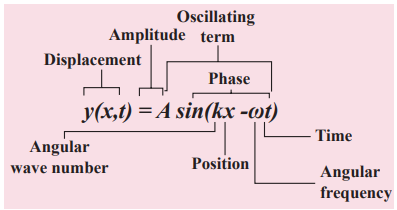

---

### Graphical representation of the wave

Let us graphically represent the two forms of the wave variation

**(a)** Space (or Spatial) variation graph **(b)** Time (or Temporal) variation graph

**(a) Space variation graph**


By keeping the time fixed, the change in displacement with respect to \(x\) is plotted. Let us consider a sinusoidal graph, \(y = A \sin(kx)\) as shown in Figure 11.24, where \(k\) is a constant. Since the wavelength \(\lambda\) denotes the distance between any two points in the same state of motion, the displacement \(y\) is the same at both the ends \(y = x\) and \(y = x + \lambda\), i.e.,

\[
y = A \sin(kx) = A \sin(k(x + \lambda)) = A \sin(kx + k\lambda) \tag{11.38}
\]

The sine function is a periodic function with period \(2\pi\). Hence,

\[
y = A \sin(kx + 2\pi) = A \sin(kx) \tag{11.39}
\]

Comparing equation (11.38) and equation (11.39), we get

\[
kx + k\lambda = kx + 2\pi
\]

This implies

\[
k = \frac{2\pi}{\lambda} \, \text{rad m}^{-1} \tag{11.40}
\]

where \(k\) is called wave number. This measures how many wavelengths are present in \(2\pi\) radians.

The spatial periodicity of the wave is \(\lambda\) in m. Then, at \(t = 0\) s, \(y(x, 0) = y(x + \lambda, 0)\) and at any time \(t\), \(y(x, t) = y(x + \lambda, t)\).

---

**EXAMPLE 11.14**

The wavelength of two sine waves are \(\lambda_1 = 1\) m and \(\lambda_2 = 6\) m. Calculate the corresponding wave numbers.

**_Solution_**

\[
k_1 = \frac{2\pi}{1} = 6.28 \, \text{rad m}^{-1}
\]
\[
k_2 = \frac{2\pi}{6} = 1.05 \, \text{rad m}^{-1}
\]

---

**(b) Time variation graph**


By keeping the position fixed, the change in displacement with respect to time is plotted. Let us consider a sinusoidal graph, \(y = A \sin(\omega t)\) as shown in Figure 11.25, where \(\omega\) is angular frequency of the wave which measures how quickly wave oscillates in time or number of cycles per second.

The temporal periodicity or time period is \(T = \frac{2\pi}{\omega}\) seconds.

The angular frequency is related to frequency \(f\) by the expression \(\omega = 2\pi f\), where the frequency \(f\) is defined as the number of oscillations made by the medium particle per second. Since inverse of frequency is time period, we have,

\[
T = \frac{1}{f} \, \text{in seconds}
\]

This is the time taken by a medium particle to complete one oscillation. Hence, we can define the speed of a wave (wave speed, \(v\)) as the distance traversed by the wave per second which is the same relation as we obtained in equation (11.4).

### Particle velocity and wave velocity

In a plane progressive harmonic wave, the constituent particles in the medium oscillate simple harmonically about their equilibrium positions. When a particle is in motion, the rate of change of displacement at any instant of time is defined as velocity of the particle at that instant of time. This is known as particle velocity.

\[
v_P = \frac{dy}{dt} \, \text{m s}^{-1} \tag{11.41}
\]

But

\[
y(x, t) = A \sin(kx - \omega t) \tag{11.42}
\]

Therefore,

\[
\frac{dy}{dt} = -\omega A \cos(kx - \omega t) \tag{11.43}
\]

Similarly, we can define velocity (here speed) for the travelling wave (or progressive wave). In order to determine the velocity of a progressive wave, let us consider a progressive wave (shown in Figure 11.23) moving towards right. This can be mathematically represented as a sinusoidal wave. Let \(P\) be any point on the phase of the wave and \(y_P\) be its displacement with respect to the mean position. The displacement of the wave at an instant \(t\) is

\[
y = y(x, t) = A \sin(kx - \omega t)
\]

At the next instant of time \(t' = t + \Delta t\) the position of the point \(P\) is \(x' = x + \Delta x\). Hence, the displacement of the wave at this instant is

\[
y = y(x', t') = y(x + \Delta x, t + \Delta t) = A \sin[k(x + \Delta x) - \omega(t + \Delta t)] \tag{11.44}
\]

Since the shape of the wave remains the same, this means that the phase of the wave remains constant (i.e., the \(y\)-displacement of the point is a constant). Therefore, equating equation (11.42) and equation (11.44), we get \(y(x', t') = y(x, t)\), which implies

\[
A \sin[k(x + \Delta x) - \omega(t + \Delta t)] = A \sin(kx - \omega t)
\]

Or

\[
k(x + \Delta x) - \omega(t + \Delta t) = kx - \omega t = \text{constant} \tag{11.45}
\]

On simplification of equation (11.45), we get

\[
v = \frac{\Delta x}{\Delta t} = \frac{\omega}{k} = v_p \tag{11.46}
\]

where \(v_p\) is called wave velocity or phase velocity.

By expressing the angular frequency and wave number in terms of frequency and wavelength, we obtain \(v = f\lambda\).

---

**EXAMPLE 11.15**

A mobile phone tower transmits a wave signal of frequency 900 MHz. Calculate the length of the waves transmitted from the mobile phone tower.

**_Solution_**

Frequency, \(f = 900 \, \text{MHz} = 900 \times 10^{6} \, \text{Hz}\)

The speed of wave is \(c = 3 \times 10^{8} \, \text{m s}^{-1}\)

\[
\lambda = \frac{c}{f} = \frac{3 \times 10^{8}}{900 \times 10^{6}} = \frac{1}{3} \, \text{m} = 0.33 \, \text{m}
\]

---

## SUPERPOSITION PRINCIPLE

When a jerk is given to a stretched string which is tied at one end, a wave pulse is produced and the pulse travels along the string. Suppose two persons holding the stretched string on either side give a jerk simultaneously, then these two wave pulses move towards each other, meet at some point and move away from each other with their original identity. Their behaviour is very different only at the crossing/meeting points; this behaviour depends on whether the two pulses have the same or different shape as shown in Figure 11.26.

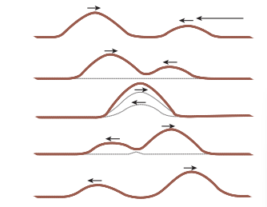

When the pulses have the same shape, at the crossing, the total displacement is the algebraic sum of their individual displacements and hence its net amplitude is higher than the amplitudes of the individual pulses. Whereas, if the two pulses have same amplitude but shapes are 180° out of phase at the crossing point, the net amplitude vanishes at that point and the pulses will recover their identities after crossing. Only waves can possess such a peculiar property and it is called superposition of waves. This means that the principle of superposition explains the net behaviour of the waves when they overlap.

Generalizing to any number of waves i.e., if two or more waves in a medium move simultaneously, when they overlap, their total displacement is the vector sum of the individual displacements. We know that the waves satisfy the wave equation which is a linear second order homogeneous partial differential equation in both space coordinates and time. Hence, their linear combination (often called as linear superposition of waves) will also satisfy the same differential equation.

To understand mathematically, let us consider two functions which characterize the displacement of the waves, for example,

\[
y_1 = A_1 \sin(kx - \omega t)
\]
and
\[
y_2 = A_2 \cos(kx - \omega t)
\]

Since both \(y_1\) and \(y_2\) satisfy the wave equation (solutions of wave equation) then their algebraic sum

\[
y = y_1 + y_2
\]

also satisfies the wave equation. This means the displacements are additive. Suppose we multiply \(y_1\) and \(y_2\) with some constant then their amplitude is scaled by that constant. Further, if \(C_1\) and \(C_2\) are used to multiply the displacements \(y_1\) and \(y_2\), respectively, then their net displacement \(y\) is \(y = C_1 y_1 + C_2 y_2\).

This can be generalized to any number of waves. In the case of \(n\) such waves in more than one dimension the displacements are written using vector notation.

Here, the net displacement \(y\) is

\[
\vec{y} = \sum_{i=1}^{n} \vec{y}_i
\]

The principle of superposition can explain the following:

(a) Space (or spatial) Interference (also known as Interference)

(b) Time (or Temporal) Interference (also known as Beats)

(c) Concept of stationary waves

Waves that obey principle of superposition are called linear waves (amplitude is much smaller than their wavelengths). In general, if the amplitude of the wave is not small then they are called non-linear waves. These violate the linear superposition principle, e.g., laser. In this chapter, we will focus our attention only on linear waves.

We will discuss the following in different subsections:

### Interference of waves


**Interference** is a phenomenon in which two waves superimpose to form a resultant wave of greater, lower or the same amplitude.


Consider two harmonic waves having identical frequencies, constant phase difference \(\phi\) and same wave form (can be treated as coherent source), but having amplitudes \(A_1\) and \(A_2\), then

\[
y_1 = A_1 \sin(kx - \omega t) \tag{11.47}
\]
\[
y_2 = A_2 \sin(kx - \omega t + \phi) \tag{11.48}
\]

Suppose they move simultaneously in a particular direction, then interference occurs (i.e., overlap of these two waves). Mathematically

\[
y = y_1 + y_2 \tag{11.49}
\]

Therefore, substituting equation (11.47) and equation (11.48) in equation (11.49), we get

\[
y = A_1 \sin(kx - \omega t) + A_2 \sin(kx - \omega t + \phi)
\]

Using trigonometric identity \(\sin(\alpha + \beta) = \sin\alpha \cos\beta + \cos\alpha \sin\beta\), we get

\[
y = A_1 \sin(kx - \omega t) + A_2 [\sin(kx - \omega t) \cos\phi + \cos(kx - \omega t) \sin\phi]
\]
\[
y = \sin(kx - \omega t)(A_1 + A_2 \cos\phi) + A_2 \sin\phi \cos(kx - \omega t) \tag{11.50}
\]

Let us re-define

\[
A \cos\theta = (A_1 + A_2 \cos\phi) \tag{11.51}
\]
and
\[
A \sin\theta = A_2 \sin\phi \tag{11.52}
\]

then equation (11.50) can be rewritten as

\[
y = A \sin(kx - \omega t) \cos\theta + A \cos(kx - \omega t) \sin\theta
\]
\[
y = A (\sin(kx - \omega t) \cos\theta + \sin\theta \cos(kx - \omega t))
\]
\[
y = A \sin(kx - \omega t + \theta) \tag{11.53}
\]

By squaring and adding equation (11.51) and equation (11.52), we get

\[
A^2 = A_1^2 + A_2^2 + 2A_1 A_2 \cos\phi \tag{11.54}
\]

Since intensity is square of the amplitude (\(I = A^2\)), we have

\[
I = I_1 + I_2 + 2\sqrt{I_1 I_2} \cos\phi \tag{11.55}
\]

This means the resultant intensity at any point depends on the phase difference at that point.

**(a) For constructive interference:**

When crests of one wave overlap with crests of another wave, their amplitudes will add up and we get constructive interference. The resultant wave has a larger amplitude than the individual waves as shown in Figure 11.29 (a). The constructive interference at a point occurs if there is maximum intensity at that point, which means

\[
\cos\phi = +1 \Rightarrow \phi = 0, 2\pi, 4\pi, \ldots = 2n\pi, \text{ where } n = 0, 1, 2, \ldots
\]

This is the phase difference in which two waves overlap to give constructive interference.

Therefore, for this resultant wave,

\[
A = A_1 + A_2
\]
\[
I_{\text{max}} = I_1 + I_2 + 2\sqrt{I_1 I_2} = (\sqrt{I_1} + \sqrt{I_2})^2
\]

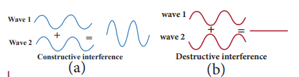

**(b) For destructive interference:** When the trough of one wave overlaps with the crest of another wave, their amplitudes “cancel” each other and we get destructive interference as shown in Figure 11.29 (b). The resultant amplitude is nearly zero. The destructive interference occurs if there is minimum intensity at that point, which means

\[
\cos\phi = -1 \Rightarrow \phi = \pi, 3\pi, 5\pi, \ldots = (2n-1)\pi, \text{ where } n = 0, 1, 2, \ldots
\]

This is the phase difference in which two waves overlap to give destructive interference. Therefore,

\[
A = |A_1 - A_2|
\]
\[
I_{\text{min}} = I_1 + I_2 - 2\sqrt{I_1 I_2} = (\sqrt{I_1} - \sqrt{I_2})^2
\]

Let us consider a simple instrument to demonstrate the interference of sound waves as shown in Figure 11.30.

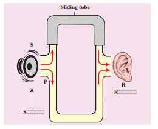

A sound wave from a loudspeaker S is sent through the tube P. This looks like a T-shaped junction. In this case, half of the sound energy is sent in one direction and the remaining half is sent in the opposite direction. Therefore, the sound waves that reach the receiver R can travel along either of two paths. The distance covered by the sound wave along any path from the speaker to receiver is called the path length. From Figure 11.30, we notice that the lower path length is fixed but the upper path length can be varied by sliding the upper tube i.e., \(r_2\) is varied. The difference in path length is known as path difference,

\[
\Delta r = |r_2 - r_1|
\]

Suppose the path difference is allowed to be either zero or some integer (or integral) multiple of wavelength \(\lambda\). Mathematically, we have

\[
\Delta r = n\lambda \quad \text{where, } n = 0, 1, 2, 3, \ldots
\]

Then the two waves arriving from the paths \(r_1\) and \(r_2\) reach the receiver at any instant are in phase (the phase difference is 0° or \(2\pi\)) and interfere constructively as shown in Figure 11.31.

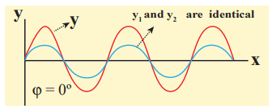

Therefore, in this case, maximum sound intensity is detected by the receiver. If the path difference is some half-odd-integer (or half-integral) multiple of wavelength \(\lambda\),

mathematically,
\[
\Delta r = n \frac{\lambda}{2}, \text{ where } n = 1, 3, 5, \ldots (n \text{ is odd})
\]

then the two waves arriving from the paths \(r_1\) and \(r_2\) and reaching the receiver at any instant are out of phase (phase difference of \(\pi\) or 180°). They interfere destructively as shown in Figure 11.32. They will cancel each other.


Therefore, the amplitude is minimum or zero amplitude which means no sound. No sound intensity is detected by the receiver in this case. The relation between path difference and phase difference is

\[
\text{phase difference} = \frac{2\pi}{\lambda} (\text{path difference}) \tag{11.56}
\]

i.e.,
\[
\Delta\phi = \frac{2\pi}{\lambda} \Delta r
\]

---

**EXAMPLE 11.16**

Consider two sources A and B as shown in the figure below. Let the two sources emit simple harmonic waves of same frequency but of different amplitudes, and both are in phase (same phase). Let O be any point equidistant from A and B as shown in the figure. Calculate the intensity at points O, Y and X. (X and Y are not equidistant from A & B)


**_Solution_**

The distance between OA and OB are the same and hence, the waves starting from A and B reach O after covering equal distances (equal path lengths). Thus, the path difference between two waves at O is zero.

\(OA - OB = 0\)

Since the waves are in the same phase, at the point O, the phase difference between two waves is also zero. Thus, the resultant intensity at the point O is maximum. Consider a point Y, such that the path difference between two waves is \(\lambda\). Then the phase difference at Y is

\[
\Delta\phi = \frac{2\pi}{\lambda} \times \lambda = 2\pi
\]

Therefore, at the point Y, the two waves from A and B are in phase, hence, the intensity will be maximum. Consider a point X, and let the path difference between the two waves be \(\frac{\lambda}{2}\). Then the phase difference at X is

\[
\Delta\phi = \frac{2\pi}{\lambda} \times \frac{\lambda}{2} = \pi
\]

Therefore, at the point X, the waves meet and are out of phase. Hence, due to destructive interference, the intensity will be minimum.

---

**EXAMPLE 11.17**

Two speakers C and E are placed 5 m apart and are driven by the same source. Let a man stand at A which is 10 m away from the mid point O of C and E. The man walks towards the point O which is at 1 m (parallel to OC) as shown in the figure. He receives the first minimum in sound intensity at B. Then calculate the frequency of the source. (Assume speed of sound = 343 m s\(^{-1}\))


**_Solution_**


The first minimum occurs when the two waves reaching the point B are 180° (out of phase). The path difference \(\Delta x = \frac{\lambda}{2}\).

In order to calculate the path difference, we have to find the path lengths \(x_1\) and \(x_2\). In a right triangle BDC,

\(DB = 10\) m and \(OC = \frac{1}{2}(5) = 2.5\) m

\(CD = OC - 1 = (2.5 \, \text{m}) - 1 \, \text{m} = 1.5\) m

In a right triangle BEC,

\(BE = 10\) m and \(OE = \frac{1}{2}(5) = 2.5\) m = FA

\(FB = FA + AB = (2.5 \, \text{m}) + 1 \, \text{m} = 3.5\) m

Now,
\[
x_2 = \sqrt{(10)^2 + (1.5)^2} = \sqrt{100 + 2.25} = 10.1 \, \text{m}
\]
\[
x_1 = \sqrt{(10)^2 + (3.5)^2} = \sqrt{100 + 12.25} = 10.6 \, \text{m}
\]

The path difference \(\Delta x = x_2 - x_1 = 10.6 \, \text{m} - 10.1 \, \text{m} = 0.5 \, \text{m}\). Required that this path difference \(= \frac{\lambda}{2} = 0.5 \Rightarrow \lambda = 1.0\) m.

To obtain the frequency of source, we use

\[
v = \lambda f \Rightarrow f = \frac{v}{\lambda} = \frac{343}{1} = 343 \, \text{Hz} = 0.3 \, \text{kHz}
\]

---

**Note**  

If the speakers were connected such that already the path difference is \(\frac{\lambda}{2}\). Now the path difference combines with a path difference of \(\frac{\lambda}{2}\). This gives a total path difference of \(\lambda\) which means the waves are in phase and there is a maximum intensity at point B.

---


### Formation of beats

When two or more waves superimpose with slightly different frequencies, then a sound of periodically varying amplitude at a point is observed. This phenomenon is known as beats. The number of amplitude maxima per second is called beat frequency. If we have two sources, then their difference in frequency gives the beat frequency. Number of beats per second
\[
n = |f_1 - f_2|
\]

---

**EXAMPLE 11.18**

Consider two sound waves with wavelengths 5 m and 6 m. If these two waves propagate in a gas with velocity 330 m s\(^{-1}\), calculate the number of beats per second.

**_Solution_**

Given \(\lambda_1 = 5\) m and \(\lambda_2 = 6\) m. Velocity of sound waves in a gas is \(v = 330\) m s\(^{-1}\).

The relation between wavelength and velocity is \(v = \lambda f \Rightarrow f = \frac{v}{\lambda}\).

The frequency corresponding to wavelength \(\lambda_1\) is
\[
f_1 = \frac{v}{\lambda_1} = \frac{330}{5} = 66 \, \text{Hz}
\]

The frequency corresponding to wavelength \(\lambda_2\) is
\[
f_2 = \frac{v}{\lambda_2} = \frac{330}{6} = 55 \, \text{Hz}
\]

The number of beats per second is
\[
|f_1 - f_2| = |66 - 55| = 11
\]

---

**EXAMPLE 11.19**

Two vibrating tuning forks produce waves whose equation is given by \(y_1 = 5 \sin(240\pi t)\) and \(y_2 = 4 \sin(244\pi t)\). Compute the number of beats per second.

**_Solution_**

Given \(y_1 = 5 \sin(240\pi t)\) and \(y_2 = 4 \sin(244\pi t)\).

Comparing with \(y = A \sin(2\pi f_1 t)\), we get

\(2\pi f_1 = 240\pi \Rightarrow f_1 = 120\) Hz

\(2\pi f_2 = 244\pi \Rightarrow f_2 = 122\) Hz

The number of beats produced is \(|f_1 - f_2| = |120 - 122| = |-2| = 2\) beats per second.

---

## STANDING WAVES

### Explanation of stationary waves

When the wave hits the rigid boundary it bounces back to the original medium and can interfere with the original waves. A pattern is formed, which are known as standing waves or stationary waves. Consider two harmonic progressive waves (formed by strings) that have the same amplitude and same velocity but move in opposite directions. Then the displacement of the first wave (incident wave) is

\[
y_1 = A \sin(kx - \omega t) \tag{11.59}
\]

(waves move toward right)

and the displacement of the second wave (reflected wave) is

\[
y_2 = A \sin(kx + \omega t) \tag{11.60}
\]

(waves move toward left)

both will interfere with each other by the principle of superposition, the net displacement is

\[
y = y_1 + y_2 \tag{11.61}
\]

Substituting equation (11.59) and equation (11.60) in equation (11.61), we get

\[
y = A \sin(kx - \omega t) + A \sin(kx + \omega t) \tag{11.62}
\]

Using trigonometric identity, we rewrite equation (11.62) as

\[
y(x, t) = 2A \cos(\omega t) \sin(kx) \tag{11.63}
\]

This represents a stationary wave or standing wave, which means that this wave does not move either forward or backward, whereas progressive or travelling waves will move forward or backward. Further, the displacement of the particle in equation (11.63) can be written in more compact form,

\[
y(x, t) = A' \cos(\omega t)
\]

where \(A' = 2A \sin(kx)\), implying that the particular element of the string executes simple harmonic motion with amplitude equal to \(A'\). The maximum of this amplitude occurs at positions for which

\[
\sin(kx) = 1 \Rightarrow kx = \frac{\pi}{2}, \frac{3\pi}{2}, \frac{5\pi}{2}, \ldots = (2m+1)\frac{\pi}{2}
\]

where \(m\) takes half integer or half integral values. The position of maximum amplitude is known as _antinode_. Expressing wave number in terms of wavelength, we can represent the anti-nodal positions as

\[
x = (2m+1)\frac{\lambda}{4}, \text{ where } m = 0, 1, 2, \ldots \tag{11.64}
\]

For \(m = 0\) we have maximum at \(x_0 = \frac{\lambda}{4}\).

For \(m = 1\) we have maximum at \(x_1 = \frac{3\lambda}{4}\).

For \(m = 2\) we have maximum at \(x_2 = \frac{5\lambda}{4}\).

and so on.

The distance between two successive anti-nodes can be computed by
\[
x_{m+1} - x_m = \frac{(2(m+1)+1)\lambda}{4} - \frac{(2m+1)\lambda}{4} = \frac{(2m+3)\lambda}{4} - \frac{(2m+1)\lambda}{4} = \frac{\lambda}{2}
\]

Similarly, the minimum of the amplitude \(A'\) also occurs at some points in the space, and these points can be determined by setting

\[
\sin(kx) = 0 \Rightarrow kx = 0, \pi, 2\pi, 3\pi, \ldots = n\pi
\]

where \(n\) takes integer or integral values. Note that the elements at these points do not vibrate (not move), and the points are called _nodes_. The \(n\)th nodal positions is given by

\[
x = n\frac{\lambda}{2}, \text{ where } n = 0, 1, 2, \ldots \tag{11.65}
\]

For \(n = 0\) we have minimum at \(x_0 = 0\).

For \(n = 1\) we have minimum at \(x_1 = \frac{\lambda}{2}\). For \(n = 2\) we have maximum at \(x_2 = \lambda\) and so on.

The distance between any two successive nodes can be calculated as
\[
x_n - x_{n-1} = n\frac{\lambda}{2} - (n-1)\frac{\lambda}{2} = \frac{\lambda}{2}
\]

---

**EXAMPLE 11.20**

Compute the distance between anti-node and neighbouring node.

**_Solution_**

For \(n\)th mode, the distance between anti-node and neighbouring node is
\[
\Delta x_n = \frac{(2n+1)\lambda}{4} - n\frac{\lambda}{2} = \frac{(2n+1)\lambda - 2n\lambda}{4} = \frac{\lambda}{4}
\]

---

### Characteristics of stationary waves

**(1)** Stationary waves are characterized by the confinement of a wave disturbance between two rigid boundaries. This means, the wave does not move forward or backward in a medium (does not advance), it remains steady at its place. Therefore, they are called “stationary waves or standing waves”.

**(2)** Certain points in the region in which the wave exists have _maximum amplitude, called as anti-nodes_ and at certain points the _amplitude is minimum or zero, called as nodes_.

**(3)** The distance between two consecutive nodes (or) anti-nodes is \(\frac{\lambda}{2}\).

**(4)** The distance between a node and its neighbouring anti-node is \(\frac{\lambda}{4}\).

**(5)** The transfer of energy along the standing wave is zero.

**Table 11.3:** Comparison between progressive and stationary waves

| S.No. | Progressive waves | Stationary waves |
|---|---|---|
| 1. | Crests and troughs are formed in transverse progressive waves, and compression and rarefaction are formed in longitudinal progressive waves. These waves move forward or backward in a medium i.e., they will advance in medium with a definite velocity. | Crests and troughs are formed in transverse stationary waves, and compression and rarefaction are formed in longitudinal stationary waves. These waves neither move forward nor backward in a medium i.e., they will not advance in a medium. |
| 2. | All the particles in the medium vibrate such that the amplitude of vibration for all particles is same. | Except at nodes, all other particles of the medium vibrate such that amplitude of vibration is different for different particles. The amplitude is minimum or zero at nodes and maximum at anti-nodes. |
| 3. | These waves carry energy while propagating. | These waves do not transport energy. |


### Stationary waves in sonometer

**Sono** means _sound_ related, and sonometer implies sound-related measurements. It is a device for demonstrating the relationship between the frequency of the sound produced in the transverse standing wave in a string, and the tension, length and mass per unit length of the string. Therefore, using this device, we can determine the following quantities:

(a) the _frequency_ of the tuning fork or frequency of alternating current

(b) the _tension_ in the string

(c) the unknown hanging _mass_

**Construction:**

The sonometer is made up of a hollow box which is one meter long with a uniform metallic thin string attached to it. One end of the string is connected to a hook and the other end is connected to a weight hanger through a pulley as shown in Figure 11.34. Since only one string is used, it is also known as monochord. The weights are added to the free end of the wire to increase the tension of the wire. Two adjustable wooden knives are put over the board, and their positions are adjusted to change the vibrating length of the stretched wire.

**Working :**

A transverse stationary or standing wave is produced and hence, at the knife edges P and Q, nodes are formed. In between the knife edges, anti-nodes are formed.

If the length of the vibrating element is \(l\) then
\[
\lambda = 2l
\]

Let \(f\) be the frequency of the vibrating element, \(T\) the tension in the string and \(\mu\) the mass per unit length of the string. Then using equation (11.13), we get
\[
v = \sqrt{\frac{T}{\mu}}
\]
But \(v = f\lambda = f(2l)\)
\[
f = \frac{1}{2l} \sqrt{\frac{T}{\mu}} \tag{11.66}
\]

Let \(\rho\) be the density of the material of the string and \(d\) be the diameter of the string. Then the mass per unit length \(\mu\),
\[
\mu = \text{Area} \times \text{density} = \pi r^2 \rho = \frac{\pi \rho d^2}{4}
\]
\[
\text{frequency } f = \frac{1}{2l} \sqrt{\frac{4T}{\pi \rho d^2}} = \frac{1}{ld} \sqrt{\frac{T}{\pi \rho}} \tag{11.67}
\]

---

**EXAMPLE 11.21**

Let \(f\) be the fundamental frequency of the string. If the string is divided into three segments \(l_1, l_2\) and \(l_3\) such that the fundamental frequencies of each segment are \(f_1, f_2\) and \(f_3\), respectively. Show that
\[
\frac{1}{f} = \frac{1}{f_1} + \frac{1}{f_2} + \frac{1}{f_3}
\]

**_Solution_**

For a fixed tension \(T\) and mass density \(\mu\), frequency is inversely proportional to the string length i.e.,
\[
f \propto \frac{1}{l}
\]
\[
\Rightarrow f l = \text{constant}
\]

For the first length segment,
\[
f_1 l_1 = \text{constant} = k \Rightarrow l_1 = \frac{k}{f_1}
\]

For the second length segment,
\[
f_2 l_2 = k \Rightarrow l_2 = \frac{k}{f_2}
\]

For the third length segment,
\[
f_3 l_3 = k \Rightarrow l_3 = \frac{k}{f_3}
\]

Therefore, the total length
\[
l = l_1 + l_2 + l_3 = k \left( \frac{1}{f_1} + \frac{1}{f_2} + \frac{1}{f_3} \right)
\]
But \(f l = k\) and \(l = k/f\), hence
\[
\frac{k}{f} = k \left( \frac{1}{f_1} + \frac{1}{f_2} + \frac{1}{f_3} \right)
\]
\[
\frac{1}{f} = \frac{1}{f_1} + \frac{1}{f_2} + \frac{1}{f_3}
\]

---

### Fundamental frequency and overtones

Let us now keep the rigid boundaries at \(x = 0\) and \(x = L\) and produce a standing wave by wiggling the string (as in plucking strings in a guitar). Standing waves with a specific wavelength are produced. Since the amplitude must vanish at the boundaries, therefore, the displacement at the boundary must satisfy the following conditions

\[
y(x = 0, t) = 0 \quad \text{and} \quad y(x = L, t) = 0 \tag{11.68}
\]

Since the nodes formed are at a distance \(\frac{\lambda_n}{2}\) apart, we have \(n \frac{\lambda_n}{2} = L\), where \(n\) is an integer, \(L\) is the length between the two boundaries and \(\lambda_n\) is the specific wavelength that satisfy the specified boundary conditions. Hence,

\[
\lambda_n = \frac{2L}{n} \tag{11.69}
\]

_What will happen to wavelength if \(n\) is taken as zero? Why is this not permitted?_

Therefore, not all wavelengths are allowed. The (allowed) wavelengths should fit with the specified boundary conditions, i.e., for \(n = 1\), the first mode of vibration has specific wavelength \(\lambda_1 = 2L\). Similarly for \(n = 2\), the second mode of vibration has specific wavelength \(\lambda_2 = L\). For \(n = 3\), the third mode of vibration has specific wavelength \(\lambda_3 = \frac{2L}{3}\) and so on. The frequency of each mode of vibration (called natural frequency) can be calculated.

We have,
\[
f_n = \frac{v}{\lambda_n} = \frac{v}{2L} n = n \frac{v}{2L} \tag{11.70}
\]

The lowest natural frequency is called the _fundamental frequency_.
\[
f_1 = \frac{v}{2L} \tag{11.71}
\]

The second natural frequency is called the _first overtone_.
\[
f_2 = \frac{v}{L} = 2f_1
\]

The third natural frequency is called the _second overtone_.
\[
f_3 = \frac{3v}{2L} = 3f_1
\]

and so on. Therefore, the \(n\)th natural frequency can be computed as integer multiple of fundamental frequency, i.e.,
\[
f_n = n f_1, \text{ where } n \text{ is an integer} \tag{11.72}
\]

_If natural frequencies are written as integer multiples of fundamental frequencies, then the frequencies are called harmonics. Thus, the_ first harmonic is \(f_1 = f_1\) (the fundamental frequency is called first harmonic), the second harmonic is \(f_2 = 2f_1\), the third harmonic is \(f_3 = 3f_1\) etc.

---

**EXAMPLE 11.22**

Consider a string in a guitar whose length is 80 cm and a mass of 0.32 g with tension 80 N is plucked. Compute the first four lowest frequencies produced when it is plucked.

**_Solution_**

The velocity of the wave
\[
v = \sqrt{\frac{T}{\mu}}
\]

The length of the string, \(L = 80\) cm = 0.8 m. The mass of the string, \(m = 0.32\) g = \(0.32 \times 10^{-3}\) kg. Therefore, the linear mass density,
\[
\mu = \frac{m}{L} = \frac{0.32 \times 10^{-3}}{0.8} = 0.4 \times 10^{-3} \, \text{kg m}^{-1}
\]

The tension in the string, \(T = 80\) N

\[
v = \sqrt{\frac{80}{0.4 \times 10^{-3}}} = \sqrt{2 \times 10^{5}} = 447.2 \, \text{m s}^{-1}
\]

The wavelength corresponding to the fundamental frequency \(f_1\) is \(\lambda_1 = 2L = 2 \times 0.8 = 1.6\) m. The fundamental frequency \(f_1\) corresponding to the wavelength \(\lambda_1\)

\[
f_1 = \frac{v}{\lambda_1} = \frac{447.2}{1.6} = 279.5 \, \text{Hz}
\]

Similarly, the frequency corresponding to the second harmonics, third harmonics and fourth harmonics are

\(f_2 = 2f_1 = 559\) Hz

\(f_3 = 3f_1 = 838.5\) Hz

\(f_4 = 4f_1 = 1118\) Hz

---

### Laws of transverse vibrations in stretched strings

There are three laws of transverse vibrations of stretched strings which are given as follows:

**(i) The law of length :**

For a given wire with tension \(T\) (which is fixed) and mass per unit length \(\mu\) (fixed) the frequency varies inversely with the vibrating length. Therefore,
\[
f \propto \frac{1}{l} \Rightarrow \frac{1}{l} = \frac{1}{l} \Rightarrow l \times f = C, \text{ where } C \text{ is a constant}
\]

**(ii) The law of tension:**

For a given vibrating length \(l\) (fixed) and mass per unit length \(\mu\) (fixed) the frequency varies directly with the square root of the tension \(T\),
\[
f \propto \sqrt{T} \Rightarrow f = A \sqrt{T}, \text{ where } A \text{ is a constant}
\]

**(iii) The law of mass:**

For a given vibrating length \(l\) (fixed) and tension \(T\) (fixed) the frequency varies inversely with the square root of the mass per unit length \(\mu\),
\[
f \propto \frac{1}{\sqrt{\mu}} \Rightarrow f = \frac{B}{\sqrt{\mu}}, \text{ where } B \text{ is a constant}
\]

## INTENSITY AND LOUDNESS

Consider a source and two observers (listeners). The source emits sound waves which carry energy. The sound energy emitted by the source is same regardless of whoever measures it, i.e., it is independent of any observer standing in that region. But the sound received by the two observers may be different; this is due to some factors like sensitivity of ears, etc. To quantify such thing, we define two different quantities known as intensity and loudness of sound.

### Intensity of sound

When a sound wave is emitted by a source, the energy is carried to all possible surrounding points. The average sound energy emitted or transmitted per unit time or per second is called sound power. Therefore, the intensity _of sound is defined as “the sound power transmitted per unit area taken normal to the propagation of the sound wave”_.


For a particular source (fixed source), the sound intensity is inversely proportional to the square of the distance from the source.

\[
I \propto \frac{1}{r^{2}}
\]

This is known as inverse square law of sound intensity.

---

**EXAMPLE 11.23**

A baby cries on seeing a dog and the cry is detected at a distance of 3.0 m such that the intensity of sound at this distance is \(10^{-2}\) W m\(^{-2}\). Calculate the intensity of the baby’s cry at a distance 6.0 m.

**_Solution_** \(I_1\) is the intensity of sound detected at a distance 3.0 m and it is given as \(10^{-2}\) W m\(^{-2}\).

Let \(I_2\) be the intensity of sound detected at a distance 6.0 m. Then, \(r_1 = 3.0\) m, \(r_2 = 6.0\) m and since \(I \propto \frac{1}{r^2}\) (the power output does not depend on the observer and depends on the baby),

\[
\frac{I_2}{I_1} = \frac{r_1^2}{r_2^2}
\]
\[
I_2 = I_1 \frac{r_1^2}{r_2^2} = 10^{-2} \times \left( \frac{3}{6} \right)^{2} = 10^{-2} \times \frac{1}{4} = 0.25 \times 10^{-2} \, \text{W m}^{-2}
\]

---

### Loudness of sound

Two sounds with same intensities need not have the same loudness. For example, the sound heard during the explosion of balloons in a silent closed room is very loud when compared to the same explosion happening in a noisy market. Though the intensity of the sound is the same, the loudness is not. If the intensity of sound is increased then loudness also increases. But additionally, not only does intensity matter, the internal and subjective experience of “how loud a sound is” i.e., the sensitivity of the listener also matters here. This is often called loudness. That is, loudness depends on both intensity of sound wave and sensitivity of the ear (It is purely observer dependent quantity which varies from person to person) whereas the intensity of sound does not depend on the observer. The loudness of sound is defined as _“the degree of sensation of sound produced in the ear or the perception of sound by the listener”_.

### Intensity and loudness of sound

Our ear can detect the sound with intensity level ranges from \(10^{-12}\) W m\(^{-2}\) to \(10^2\) W m\(^{-2}\). According to Weber-Fechner’s law, “loudness (L) is proportional to the logarithm of the actual intensity (I) measured with an accurate non-human instrument”. This means that

\[
L = k \ln I
\]

where \(k\) is a constant, which depends on the unit of measurement. The difference between two loudnesses, \(L_1\) and \(L_0\) measures the relative loudness between two precisely measured intensities and is called as sound intensity level. Mathematically, sound intensity level is

\[
\Delta L = L_1 - L_0 = k \ln I_1 - k \ln I_0 = k \ln \frac{I_1}{I_0}
\]

If \(k = 1\) bel, \(k = 10\) decibel, then sound intensity level is measured in bel, in honour of Alexander Graham Bell. Therefore,

\[
\Delta L = \log_{10} \frac{I_1}{I_0} \, \text{bel}
\]

However, this is practically a bigger unit, so we use a convenient smaller unit, called decibel. Thus, \(1\) decibel \(= \frac{1}{10}\) bel. Therefore, by multiplying and dividing by 10, we get \(\ln\) decibel with \(k = 10\). For practical purposes, we use logarithm to base 10 instead of natural logarithm,

\[
\Delta L = 10 \log_{10} \frac{I}{I_0} \, \text{decibel} \tag{11.73}
\]

---

**EXAMPLE 11.24** The sound level from a musical instrument playing is 50 dB. If three identical musical instruments are played together then compute the total intensity. Calculate the intensity of the sound from each instrument as the threshold of hearing is \(10^{-12}\) W m\(^{-2}\).

**_Solution_**

\[
\Delta L = 10 \log_{10} \frac{I_1}{I_0} = 50
\]
\[
\log_{10} \frac{I_1}{I_0} = 5 \Rightarrow \frac{I_1}{I_0} = 10^{5} \Rightarrow I_1 = 10^{5} I_0 = 10^{5} \times 10^{-12} \, \text{W m}^{-2}
\]
\[
I_1 = 10^{-7} \, \text{W m}^{-2}
\]

Since three musical instruments are played together, therefore, \(I_{\text{total}} = 3I_1 = 3 \times 10^{-7} \, \text{W m}^{-2}\).

---

## VIBRATIONS OF AIR COLUMN

Musical instruments like flute, clarinet, nathaswaram, etc. are known as wind instruments. They work on the principle of vibrations of air columns. The simplest form of a wind instrument is the organ pipe. It is made up of a wooden or metal pipe which produces the musical sound. For example, flute, clarinet and nathaswaram are organ pipe instruments. Organ pipe instruments are classified into two types:

**(a) Closed organ pipes:**


Look at the picture of a clarinet, shown in Figure 11.36. It is a pipe with one end closed and the other end open. If one end of a pipe is closed, the wave reflected at this closed end is 180° out of phase with the incoming wave. Thus there is no displacement of the particles at the closed end. Therefore, nodes are formed at the closed end and anti-nodes are formed at open end.

Let us consider the simplest mode of vibration of the air column called the fundamental mode. Anti-node is formed at the open end and node at closed end. From Figure 11.37, let \(L\) be the length of the tube and the wavelength of the wave produced. For the fundamental mode of vibration, we have,

\[
L = \frac{\lambda}{4} \Rightarrow \lambda = 4L \tag{11.74}
\]

The frequency of the note emitted is

\[
f = \frac{v}{\lambda} = \frac{v}{4L} \tag{11.75}
\]

which is called the fundamental note.

_The frequencies higher than fundamental frequency can be produced by blowing air strongly at open end. Such frequencies are called overtones._

The Figure 11.38 shows the second mode of vibration having two nodes and two anti-nodes.

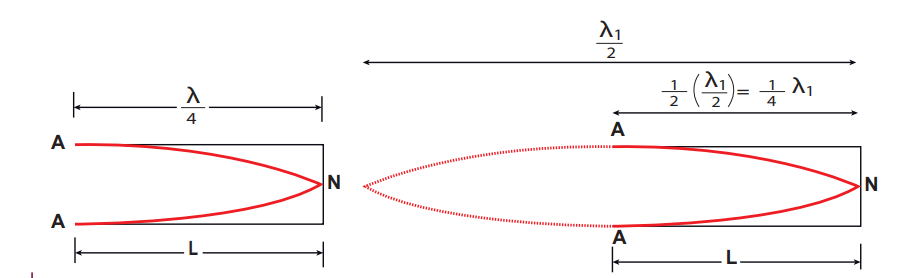


The frequency for this is
\[
L = \frac{3\lambda}{4} \Rightarrow \lambda = \frac{4L}{3}
\]
\[
f_2 = \frac{v}{\lambda} = \frac{3v}{4L} = 3f_1
\]

This is called first overtone, since here the frequency is three times the fundamental frequency it is called _third harmonic_. The Figure 11.39 shows third mode of vibration having three nodes and three anti-nodes.

\[
L = \frac{5\lambda}{4} \Rightarrow \lambda = \frac{4L}{5}
\]
\[
f_3 = \frac{v}{\lambda} = \frac{5v}{4L} = 5f_1
\]

This is called _second overtone_, and since \(n = 5\) here, this is called fifth harmonic. Hence, the _closed organ pipe has only odd harmonics and frequency of the \(n\)th harmonic is \(f_n = (2n+1)f_1\). Therefore, the frequencies of harmonics are in the ratio_

\[
f_1 : f_2 : f_3 : f_4 : \ldots = 1 : 3 : 5 : 7 : \ldots \tag{11.76}
\]

**(b) Open organ pipes:**


Consider the picture of a flute, shown in Figure 11.40. It is a pipe with both the ends open. At both open ends, anti-nodes are formed. Let us consider the simplest mode of vibration of the air column called fundamental mode. Since anti-nodes are formed at the open end, a node is formed at the mid-point of the pipe.


From Figure 11.41, if \(L\) be the length of the tube, the wavelength of the wave produced is given by
\[
L = \frac{\lambda}{2} \Rightarrow \lambda = 2L \tag{11.77}
\]

The frequency of the note emitted is
\[
f = \frac{v}{\lambda} = \frac{v}{2L} \tag{11.78}
\]

which is called the _fundamental note_.

The frequencies higher than fundamental frequency can be produced by blowing air strongly at one of the open ends. Such frequencies are called overtones.

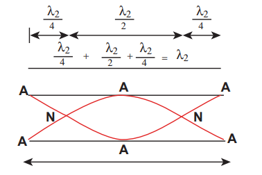

Figure 11.42 shows the second mode of vibration in open pipes. It has two nodes and three anti-nodes, and therefore,
\[
L = \lambda \Rightarrow \lambda = L
\]
\[
f_2 = \frac{v}{L} = 2f_1
\]

This is called first overtone. Since \(n = 2\) here, it is called the **_second harmonic_**.


Figure 11.43 above shows the third mode of vibration having three nodes and four anti-nodes.
\[
L = \frac{3\lambda}{2} \Rightarrow \lambda = \frac{2L}{3}
\]
\[
f_3 = \frac{v}{\lambda} = \frac{3v}{2L} = 3f_1
\]

This is called _second overtone_. Since \(n = 3\) here, it is called the _third harmonic_.

Hence, the open organ pipe has all the harmonics and frequency of \(n\)th harmonic is \(f_n = n f_1\). Therefore, the frequencies of harmonics are in the ratio
\[
f_1 : f_2 : f_3 : f_4 : \ldots = 1 : 2 : 3 : 4 : \ldots \tag{11.79}
\]

---

**EXAMPLE 11.25**

If a flute sounds a note with 450 Hz, what are the frequencies of the second, third, and fourth harmonics of this pitch? If the clarinet sounds with a same note as 450 Hz, then what are the frequencies of the lowest three harmonics produced?

**_Solution_**

For a flute which is an open pipe, we have
Second harmonic \(f_2 = 2f_1 = 900\) Hz
Third harmonic \(f_3 = 3f_1 = 1350\) Hz
Fourth harmonic \(f_4 = 4f_1 = 1800\) Hz

For a clarinet which is a closed pipe, we have
Second harmonic \(f_2 = 3f_1 = 1350\) Hz
Third harmonic \(f_3 = 5f_1 = 2250\) Hz
Fourth harmonic \(f_4 = 7f_1 = 3150\) Hz

---

**EXAMPLE 11.26**

If the third harmonic of a closed organ pipe is equal to the fundamental frequency of an open organ pipe, compute the length of the open organ pipe if the length of the closed organ pipe is 30 cm.

**_Solution_**

Let \(l_2\) be the length of the open organ pipe, with \(l_1 = 30\) cm the length of the closed organ pipe. It is given that the third harmonic of closed organ pipe is equal to the fundamental frequency of open organ pipe. The third harmonic of a closed organ pipe is
\[
f_3 = \frac{3v}{4l_1}
\]

The fundamental frequency of open organ pipe is
\[
f_1 = \frac{v}{2l_2}
\]

Therefore,
\[
\frac{3v}{4l_1} = \frac{v}{2l_2} \Rightarrow \frac{3}{4l_1} = \frac{1}{2l_2} \Rightarrow l_2 = \frac{2l_1}{3} = \frac{2 \times 30}{3} = 20 \, \text{cm}
\]

---

### 11.10.1 Resonance air column apparatus


The resonance air column apparatus is one of the simplest techniques to measure the speed of sound in air at room temperature. It consists of a cylindrical glass tube of one meter length whose one end A is open and another end B is connected to the water reservoir R through a rubber tube as shown in Figure 11.44. This cylindrical glass tube is mounted on a vertical stand with a scale attached to it. The tube is partially filled with water and the water level can be adjusted by raising or lowering the water in the reservoir R. The surface of the water will act as a closed end and the other as the open end. Therefore, it behaves like a closed organ pipe, forming nodes at the surface of water and antinodes at the open end. When a vibrating tuning fork is brought near the open end of the tube, longitudinal waves are formed inside the air column. These waves move downward as shown in Figure 11.44, and reach the surfaces of water and get reflected and produce standing waves. The length of the air column is varied by changing the water level until a loud sound is produced in the air column. At this particular length the frequency of waves in the air column resonates with the frequency of the tuning fork (natural frequency of the tuning fork). At resonance, the frequency of sound waves produced is equal to the frequency of the tuning fork. This will occur only when the length of air column is proportional to \(\frac{1}{4}\) of the wavelength of the sound waves produced. Let the first resonance occur at length \(L_1\), then

\[
\frac{\lambda}{4} = L_1 \tag{11.80}
\]

But since the antinodes are not exactly formed at the open end, we have to include a correction, called end correction \(e\), by assuming that the antinode is formed at some small distance above the open end. Including this end correction, the first resonance is

\[
\frac{\lambda}{4} = L_1 + e \tag{11.81}
\]

Now the length of the air column is increased to get the second resonance. Let \(L_2\) be the length at which the second resonance occurs. Again taking end correction into account, we have

\[
\frac{3\lambda}{4} = L_2 + e \tag{11.82}
\]

The speed of sound in air at room temperature can be computed by using the formula \(v = f\lambda = 2f \Delta L\). Further, to compute the end correction, we use equation (11.81) and equation (11.82), we get

\[
e = \frac{L_2 - 3L_1}{2}
\]

---

**EXAMPLE 11.27**

A frequency generator with fixed frequency of 343 Hz is allowed to vibrate above a 1.0 m high tube. A pump is switched on to fill the water slowly in the tube. In order to get resonance, what must be the minimum height of the water? (speed of sound in air is 343 m s\(^{-1}\))

**_Solution_**

The wavelength, \(\lambda = \frac{c}{f} = \frac{343}{343} = 1.0\) m.

Let the lengths of the resonant columns be \(L_1, L_2\) and \(L_3\). The first resonance occurs at length \(L_1 = \frac{\lambda}{4} = 0.25\) m.

The second resonance occurs at length \(L_2 = \frac{3\lambda}{4} = 0.75\) m.

The third resonance occurs at length \(L_3 = \frac{5\lambda}{4} = 1.25\) m.

and so on. Since total length of the tube is 1.0 m, the third and other higher resonances do not occur. Therefore, the minimum height of water \(H_{\text{min}}\) for resonance is,

\(H_{\text{min}} = 1.0 \, \text{m} - 0.75 \, \text{m} = 0.25 \, \text{m}\)

---

**EXAMPLE 11.28**

A student performed an experiment to determine the speed of sound in air using the resonance column method. The length of the air column that resonates in the fundamental mode with a tuning fork is 0.2 m. If the length is varied such that the same tuning fork resonates with the first overtone at 0.7 m. Calculate the end correction.

**_Solution_**

End correction
\[
e = \frac{L_2 - 3L_1}{2} = \frac{0.7 - 3 \times 0.2}{2} = \frac{0.7 - 0.6}{2} = \frac{0.1}{2} = 0.05 \, \text{m}
\]

---

**EXAMPLE 11.29**

Consider a tuning fork which is used to produce resonance in an air column. A resonance air column is a glass tube whose length can be adjusted by a variable piston. At room temperature, the two successive resonances observed are at 20 cm and 85 cm of the column length. If the frequency of the tuning fork is 256 Hz, compute the velocity of the sound in air at room temperature.

**_Solution_**

Given two successive length (resonance) to be \(L_1 = 20\) cm and \(L_2 = 85\) cm.

The frequency is \(f = 256\) Hz

\[
v = f\lambda = 2f \Delta L = 2f (L_2 - L_1) = 2 \times 256 \times (85 - 20) \times 10^{-2} \, \text{m s}^{-1}
\]
\[
v = 332.8 \, \text{m s}^{-1}
\]

---

## DOPPLER EFFECT

Imagine that you are standing on a railway platform and listening to the blowing whistle of a train moving past you, the pitch (or frequency) of the sound you listen as the train approaches you is higher than the pitch you listen as it moves away from you. This is an example of Doppler effect.

This effect occurs due to the relative motion between the source of sound and its listener. This motion-related frequency change was first observed and studied by Johann Christian Doppler (1803–1853), an Austrian Mathematician and Physicist.

**Whenever there is a relative motion between the source of sound and the listener, the frequency of the sound observed by the listener is different from the frequency produced by the source. This is known as Doppler effect.**

The Doppler effect is a wave phenomenon. Therefore, it occurs not only for sound waves but for any wave such as light and other electromagnetic waves. Here, we will discuss different cases of Doppler effect for sound and derive the expression for the frequency observed by the listener.

**i) Observed frequency: Stationary source and Moving listener**

Consider a point source S of sound at rest with respect to the medium (air) in which it is kept. The medium is assumed to be uniform and is also at rest. The source emits sound waves of frequency \(f\) and wavelength \(\lambda\).

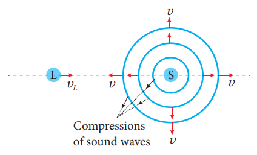

Sound waves travel with the same speed \(v\) in all directions radially away from the source in the form of spherical waves. The compressions (or wavefronts) of sound waves are represented by concentric circles in Figure 11.45. The distance between two successive compressions is equal to its wavelength \(\lambda\) and the frequency of the wave is given by

\[
f = \frac{v}{\lambda} \tag{11.83}
\]

When the listener L is stationary, there is no relative motion between the source and the listener. Since \(v\) and \(\lambda\) remain unchanged, the frequency of sound observed by the listener is the same as the source frequency \(f\).

**_Stationary observer_ and _stationary source_ means the observer and source are both at rest with respect to medium respectively.**

Now the listener moves directly toward the stationary source (Figure 11.45). If \(v_L\) is the speed of the listener, then the relative speed of sound with respect to the listener becomes \(v' = v + v_L\). Since the wavelength remains unchanged (because the source is stationary), the frequency of sound observed by the listener is changed and the observed frequency \(f'\) is given by

\[
f' = \frac{v'}{\lambda} = \frac{v + v_L}{\lambda} = f \left( \frac{v + v_L}{v} \right)
\]

Using equation (11.83),

\[
f' = f \left( 1 + \frac{v_L}{v} \right) \tag{11.84}
\]

(listener moving toward the source) Thus, the observed frequency is greater than the source frequency when the listener moves toward the stationary source. If the listener is moving away from the stationary source, the observed frequency can be obtained from equation (11.84) by taking negative value for \(v_L\). It is given by

\[
f' = f \left( 1 - \frac{v_L}{v} \right) \tag{11.85}
\]

(listener moving away from the source) Thus, the observed frequency is less than the source frequency when the listener is moving away from the stationary source.

**ii) Observed frequency: Moving source and stationary listener**

Assume that both the source S and the listener L are at rest as shown in Figure 11.46a. Two successive compressions are also shown and are represented by two concentric circles. The second compression has just been emitted and is still near the source. The distance between two successive compressions is the wavelength \(\lambda\) of the sound. Since \(f\) is the frequency of the source, then the time between emissions of compressions is \(T = \frac{1}{f}\).

(a) Source at rest


(b) Source moving

Now the listener is stationary and the source moves directly toward the listener (Figure 11.46(b)). Let the speed of the source be \(v_S\) which is less than the speed of sound \(v\).

In a time \(T\), the first compression travels a distance \(vT = \lambda\) and the source moves a distance \(v_S T\). As a result, the distance between two successive compressions is decreased from \(\lambda\) to \(\lambda' = \lambda - v_S T\). Therefore, the wavelength observed by the listener is given by

\[
\lambda' = \lambda - v_S T = \lambda - \frac{v_S}{f} = \frac{v}{f} - \frac{v_S}{f} = \frac{v - v_S}{f}
\]

The observed frequency is then given by

\[
f' = \frac{v}{\lambda'} = \frac{v}{\frac{v - v_S}{f}} = f \left( \frac{v}{v - v_S} \right) \tag{11.86}
\]

(source moving toward the listener) Thus, whenever the source moves toward the stationary listener, the observed frequency is greater than the source frequency.

If the source is moving away from the stationary listener, the observed frequency can be obtained from equation (11.86) by taking negative value for \(v_S\). It is given by

\[
f' = f \left( \frac{v}{v + v_S} \right) \tag{11.87}
\]

(source moving away from the listener) Thus, the observed frequency is less than the source frequency when the source is moving away from the stationary listener.

**iii) Observed frequency: Both source and listener moving**

When both source and listener are moving, the observed frequency is obtained by combining equations (11.84) and (11.86).

\[
f' = f \left( \frac{v + v_L}{v - v_S} \right) \tag{11.88}
\]

The sign convention we used here is that both \(v_S\) and \(v_L\) take positive values if the source or the listener moves toward the other. Likewise, they are negative when the source or the listener moves away from the other.

The observed frequency for different situations of relative motion between the source and the listener is consolidated in Table 11.4.

It is important to note that the change in frequency occurs either due to the change in speed of sound (when the listener moves and source at rest) or due to the change in wavelength of sound (when the source moves and observer at rest).

If both source and listener move, the change in frequency occurs due to both the change in speed of sound and the change in wavelength of sound wave.

**Note**

Suppose the source moves faster than sound (that is, the source is supersonic), the equations (11.84) and (11.86) for observed frequency will become invalid and a stationary listener in front of the source hears no sound as the sound waves are at the rear of the source. At such speeds, the newly produced waves and the old waves interfere constructively which leads to very large amplitude of sound, called a ‘sonic boom’ or ‘shock wave’.

**Doppler effect in sound is asymmetric while that in light is symmetric.**

The observed frequency of sound when the source moves toward stationary listener and the observed frequency when the listener moves toward stationary source with the same speed are not equal. Although the relative speed is same in both the cases, observed frequency is different. Hence, we say that the Doppler effect in sound is asymmetric. The reason is that sound wave requires a medium for its propagation and it has its speed with respect to that medium.

But in the case of light and other electromagnetic radiations, the observed frequency is the same in both above said cases. Therefore, Doppler effect in light and other electromagnetic waves is symmetric because the propagation of light is independent of the medium.

---

**EXAMPLE 11.30**

A sound of frequency 1500 Hz is emitted by a source which moves away from an observer and moves towards a cliff at a speed of 6 m s\(^{-1}\).

(a) Calculate the frequency of the sound which is coming directly from the source.

(b) Compute the frequency of sound heard by the observer reflected off the cliff. Assume the speed of sound in air is 330 m s\(^{-1}\).

**_Solution_**

(a) Source is moving away and observer is stationary, therefore, the frequency of sound heard directly from source is

\[
f' = f \left( \frac{v}{v + v_S} \right) = 1500 \times \frac{330}{330 + 6} = 1500 \times \frac{330}{336} = 1473 \, \text{Hz}
\]

(b) Sound is reflected from the cliff and reaches observer, therefore,

\[
f'' = f \left( \frac{v}{v - v_S} \right) = 1500 \times \frac{330}{330 - 6} = 1500 \times \frac{330}{324} = 1527.8 \, \text{Hz}
\]

---

**EXAMPLE 11.31**

An observer observes two moving trains, one reaching the station and other leaving the station with equal speeds of 8 m s\(^{-1}\). If each train sounds its whistles with frequency 240 Hz, then calculate the number of beats heard by the observer.

**_Solution:_**

Observer is stationary.

(i) Source (train) is moving towards an observer: The observed frequency due to train arriving station is

\[
f_{\text{in}} = f \left( \frac{v}{v - v_S} \right) = 240 \times \frac{330}{330 - 8} = 240 \times \frac{330}{322} = 246 \, \text{Hz}
\]

(ii) Source (train) is moving away from an observer: The observed frequency due to train leaving station is

\[
f_{\text{out}} = f \left( \frac{v}{v + v_S} \right) = 240 \times \frac{330}{330 + 8} = 240 \times \frac{330}{338} = 234 \, \text{Hz}
\]

So the number of beats = \(|f_{\text{in}} - f_{\text{out}}| = |246 - 234| = 12\) beats per second.
```