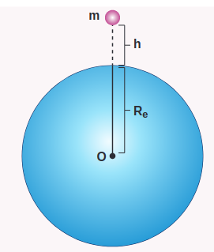
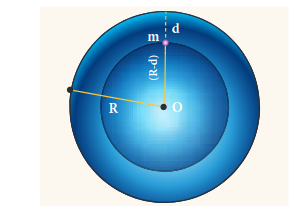
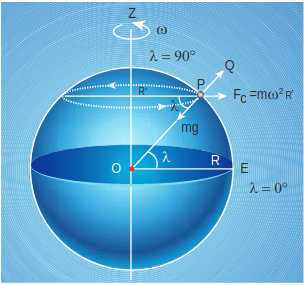

**6.3 ACCELERATION DUE TO GRAVITY OF THE EARTH**

When objects fall on the Earth, the acceleration of the object is towards the Earth. From Newton's second law, an object is accelerated only under the action of a force. In the case of Earth, this force is the gravitational pull of Earth. This force produces a constant acceleration near the Earth's surface in all bodies, irrespective of their masses. The gravitational force exerted by Earth on the mass m near the surface of the Earth is given by


\vec{F}=-\frac{G m M_{e}}{R_{e}^{2}} \hat{r}


Now equating Gravitational force to Newton's second law,


m \vec{a}=-\frac{G m M_{e}}{R_{e}^{2}} \hat{r}


hence, acceleration is,


\vec{a}=-\frac{G M_{e}}{R_{e}^{2}} \hat{r}


The acceleration experienced by the object near the surface of the Earth due to its gravity is called acceleration due to gravity. It is denoted by the symbol \mathrm{g}. The magnitude of acceleration due to gravity is


|g|=\frac{G M_{e}}{R_{e}^{2}}


It is to be noted that the acceleration experienced by any object is independent of its mass. The value of g  depends only on the mass and radius of the Earth. Infact, Galileo arrived at the same conclusion 400 years ago that all objects fall towards the Earth with the same acceleration through various quantitative experiments. The acceleration due to gravity \mathrm{g} is found to be 9.8 \mathrm{~m} \mathrm{~s}^{-2} on the surface of the Earth near the equator.

**6.3.1 Variation of g with altitude, depth and latitude**

Consider an object of mass \mathrm{m} at a height \mathrm{h} from the surface of the Earth. Acceleration experienced by the object due to Earth is


g^{\prime}=\frac{G M}{\left(R_{e}+h\right)^{2}}


**Figure 6.17(a) Mass at a height h from the center of the Earth**


\begin{gathered}
g^{\prime}=\frac{G M}{R_{e}^{2}\left(1+\frac{h}{R_{e}}\right)^{2}} \\
g^{\prime}=\frac{G M}{R_{e}^{2}}\left(1+\frac{h}{R_{e}}\right)^{-2}
\end{gathered}


If h \ll R_{e}

We can use Binomial expansion. Taking the terms upto first order


\begin{aligned}
& g^{\prime}=\frac{G M}{R_{e}^{2}}\left(1-2 \frac{h}{R_{e}}\right) \\
& g^{\prime}=g\left(1-2 \frac{h}{R_{e}}\right)
\end{aligned}


We find that $g^{\prime}<g$. This means that as altitude \mathrm{h} increases the acceleration due to gravity g decreases.

**EXAMPLE 6.7**

1. Calculate the value of g in the following two cases:

(a) If a mango of mass 1 / 2 \mathrm{~kg} falls from a tree from a height of 15 meters, what is the acceleration due to gravity when it begins to fall?

**Solution**


\begin{aligned}
& g^{\prime}=g\left(1-2 \frac{h}{R_{e}}\right) \\
& g^{\prime}=9.8\left(1-\frac{2 \times 15}{6400 \times 10^{3}}\right) \\
& g^{\prime}=9.8\left(1-0.469 \times 10^{-5}\right)
\end{aligned}


But \quad 1-0.00000469 \cong 1

Therefore g^{\prime}=g

(b) Consider a satellite orbiting the Earth in a circular orbit of radius 1600 \mathrm{~km} above the surface of the Earth. What is the acceleration experienced by the satellite due to Earth's gravitational force?

**Solution**


\begin{aligned}
& g^{\prime}=g\left(1-2 \frac{h}{R_{e}}\right) \\
& g^{\prime}=g\left(1-\frac{2 \times 1600 \times 10^{3}}{6400 \times 10^{3}}\right) \\
& g^{\prime}=g\left(1-\frac{2}{4}\right) \\
& g^{\prime}=g\left(1-\frac{1}{2}\right)=g / 2
\end{aligned}


The above two examples show that the acceleration due to gravity is a constant near the surface of the Earth.

**Variation of g with depth:**

Consider a particle of mass m which is in a deep mine on the Earth. (Example: coal mines in Neyveli). Assume the depth of the mine as d. To calculate g^{\prime} at a depth \mathrm{d}, consider the following points.

The part of the Earth which is above the radius \left(R_{e}-d\right) do not contribute to the acceleration. The result is proved earlier and is given as


g^{\prime}=\frac{G M^{\prime}}{\left(R_{e}-d\right)^{2}}


Here M^{\prime} ' is the mass of the Earth of radius \left(R_{e}-d\right)

Assuming the density of Earth \rho to be constant,


\rho=\frac{M}{V}


where M is the mass of the Earth and \mathrm{V} its volume, Thus,


\begin{aligned}
\rho & =\frac{M^{\prime}}{V^{\prime}} \\
\frac{M^{\prime}}{V^{\prime}} & =\frac{M}{V} \text { and } M^{\prime}=\frac{M}{V} V^{\prime} \\
M^{\prime} & =\left(\frac{M}{\frac{4}{3} \pi R_{e}^{3}}\right)\left(\frac{4}{3} \pi\left(R_{e}-d\right)^{3}\right) \\
M^{\prime} & =\frac{M}{R_{e}^{3}}\left(R_{e}-d\right)^{3}
\end{aligned}


Substituting equation (6.49) in equation (6.47)


\begin{aligned}
& g^{\prime}=G \frac{M}{R_{e}^{3}}\left(R_{e}-d\right)^{3} \cdot \frac{1}{\left(R_{e}-d\right)^{2}} \\
& g^{\prime}=G M \frac{R_{e}\left(1-\frac{d}{R_{e}}\right)}{R_{e}^{3}} \\
& g^{\prime}=G M \frac{\left(1-\frac{d}{R_{e}}\right)}{R_{e}^{2}}
\end{aligned}

Thus


g^{\prime}=g\left(1-\frac{d}{R_{e}}\right)


Here also $g^{\prime}<g$. As depth increases, g^{\prime} decreases. It is very interesting to know that acceleration due to gravity is maximum on the surface of the Earth but decreases when we go either upward or downward.

**Variation of g with latitude:**

Whenever we analyze the motion of objects in rotating frames [explained in chapter 3 ] we must take into account the centrifugal force. Even though we treat the Earth as an inertial frame, it is not exactly correct because the Earth spins about its own axis. So when an object is on the surface of the Earth, it experiences a centrifugal force that depends on the latitude of the object on Earth. If the Earth were not spinning, the force on the object would have been m g. However, the object experiences an additional centrifugal force due to spinning of the Earth.

**Figure 6.18 Variation of g with latitude**

This centrifugal force is given by m \omega^{2} R^{\prime}.


R^{\prime}=R \cos \lambda


where \lambda is the latitude. The component of centrifugal acceleration experienced by the object in the direction opposite to g is


\begin{gathered}
a_{P Q}=\omega^{2} R^{\prime} \cos \lambda=\omega^{2} R \cos ^{2} \lambda \\
\text { since } R^{\prime}=R \cos \lambda
\end{gathered}


Therefore,


g^{\prime}=g-\omega^{2} R \cos ^{2} \lambda


From the expression (6.52), we can infer that at equator, \lambda=0 ; g^{\prime}=g-\omega^{2} R. The acceleration due to gravity is minimum. At poles \lambda=90^{\circ} ; g^{\prime}=g, it is maximum. At the equator, g^{\prime} is minimum.

**EXAMPLE 6.8**
Find out the value of g^{\prime} in your school laboratory?

**Solution**

Calculate the latitude of the city or village where the school is located. The information is available in Google search. For example, the latitude of Chennai is approximately 13 degree.


g^{\prime}=g-\omega^{2} R \cos ^{2} \lambda


Here \omega^{2} R=(2 \times 3.14 / 86400)^{2} \times\left(6400 \times 10^{3}\right)= 3.4 \times 10^{-2} \mathrm{~m} \mathrm{~s}^{-2}.

It is to be noted that the value of \lambda should be in radian and not in degree. 13 degree is equivalent to 0.2268 \mathrm{rad}.


\begin{aligned}
& g^{\prime}=9.8-\left(3.4 \times 10^{-2}\right) \times(\cos 0.2268)^{2} \\
& g^{\prime}=9.7677 \mathrm{~m} \mathrm{~s}^{-2}
\end{aligned}


**Points to Contemplate**

Suppose you move towards east-west along the same latitude. Will the value of g^{\prime} change?$
