**6.5 ELEMENTARY IDEAS OF ASTRONOMY**

Astronomy is one of the oldest sciences in the history of mankind. In the olden days, astronomy was an inseparable part of physical science. It contributed a lot to the development of physics in the $16^{\text {th }}$ century. In fact Kepler's laws and Newton's theory of gravitation were formulated and verified using astronomical observations and data accumulated over the centuries by famous astronomers like Hippachrus, Aristachrus, Ptolemy, Copernicus and Tycho Brahe. Without Tycho Brahe's astronomical observations, Kepler's laws would not have emerged. Without Kepler's laws, Newton's theory of gravitation would not have been formulated.

It was mentioned in the beginning of this chapter that Ptolemy's geocentric model was replaced by Copernicus' heliocentric model. It is important to analyze and explain the shortcoming of the geocentric model over heliocentric model.

**6.5.1 Heliocentric system over geocentric system**

When the motion of the planets are observed in the night sky by naked eyes over a period of a few months, it can be seen that the planets move eastwards and reverse their motion for a while and return to eastward motion again. This is called "retrograde motion" of planets.

Figure 6.25 shows the retrograde motion of the planet Mars. Careful observation for a period of a year clearly shows that Mars initially moves eastwards (February to June), then reverses its path and moves backwards (July, August, September). It changes its direction of motion once again and continues its forward motion (October onwards). In olden days, astronomers recorded the retrograde motion of all

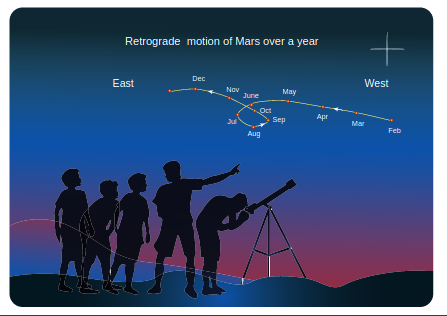

**Figure 6.25 Retrograde motion of planets**

visible planets and tried to explain the motion. According to Aristotle, the other planets and the Sun move around the Earth in the circular orbits. If it was really a circular orbit it was not known how the planet could reverse its motion for a brief interval. To explain this retrograde motion, Ptolemy introduced the concept of "epicycle" in his geocentric model. According to this theory, while the planet orbited the Earth, it also underwent another circular motion termed as "epicycle". A combination of epicycle and circular motion around the Earth gave rise to retrograde motion of the planets with respect to Earth (Figure 6.26). Essentially Ptolemy retained the Earth centric idea of Aristotle and added the epicycle motion to it.

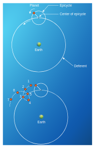

 **Figure 6.26 “Epicycle” motion of planetary objects around Earth, depicted with respect to months of observation.**

But Ptolemy's model became more and more complex as every planet was found to undergo retrograde motion. In the $15^{\text {th }}$ century, the Polish astronomer Copernicus proposed the heliocentric model to explain this problem in a simpler manner. According to this model, the Sun is at the center of the solar system and all planets orbited the Sun. The retrograde motion of planets with respect to Earth is because of the relative motion of the planet with respect to Earth. The retrograde motion from the heliocentric point of view is shown in Figure 6.27.

Figure 6.27 shows that the Earth orbits around the Sun faster than Mars. Because of the relative motion between Mars and Earth, Mars appears to move backwards from July to October. In the same way the retrograde motion of all other planets was explained successfully by the Copernicus model. It was because of its simplicity, the heliocentric model slowly replaced the geocentric model. Historically, if any natural phenomenon has one or more explanations, the simplest one is usually accepted. Though this was not the only reason to disqualify the geocentric model, a detailed discussion on correctness of the Copernicus model over to Ptolemy's model can be found in astronomy books.

**Activity**

Students are encouraged to observe the motion of the planet Mars by naked eye and identify its retrograde motion. As mentioned above, to observe the retrograde motion six to seven months are required. So students may start their observation of Mars from the month of
June and continue till April next year. Mars is the little bright planet with reddish color. The position of the planet Mars in the sky can be easily taken
from ‘Google’.

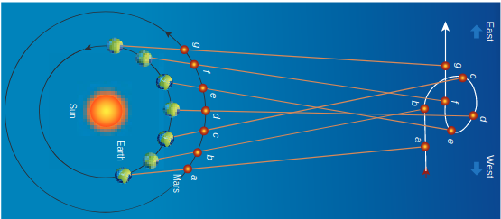

**Figure 6.27 ‘Retrograde motion’ in heliocentric model**

**6.5.2 Kepler’s Third Law and The Astronomical Distance**

When Kepler derived his three laws, he strongly relied on Tycho Brahe's astronomical observation. In his third law, he formulated the relation between the distance of a planet from the Sun to the time period of revolution of the planet. Astronomers cleverly used geometry and trigonometry to calculate the distance of a planet from the Sun in terms of the distance between Earth and Sun. Here we can see how the distance of Mercury and Venus from the Sun were measured. The Venus and Mercury, being inner planets with respect to Earth, the maximum angular distance they can subtend at a point on Earth with respect to the Sun is 46 degree for Venus and 22.5 degree for Mercury. It is shown in the Figure 6.28

Figure 6.29 shows that when Venus is at maximum elongation (i.e., 46 degree) with respect to Earth, Venus makes 90 degree to Sun. This allows us to find the distance between Venus and Sun. The distance between Earth and Sun is taken as one Astronomical unit (1 AU).

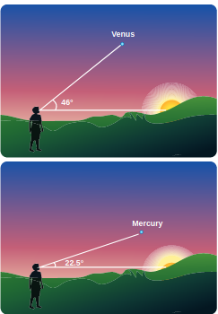

**Figure 6.28 Angle of elevation for Venus and Mercury from horizon**

The trigonometric relation satisfied by this right angled triangle is shown in Figure 6.29.

$$
\sin \theta=\frac{r}{R}
$$

where $\mathrm{R}=1 \mathrm{AU}$.

$$
r=R \sin \theta=(1 A U)\left(\sin 46^{\circ}\right)
$$

**Figure 6.29 Angle of elevation for Mercury from horizon**

Here $\sin 46^{\circ}=0.72$. Hence Venus is at a distance of $0.72 \mathrm{AU}$ from Sun. Similarly, the distance between Mercury ( $\theta$ is 22.5 degree) and Sun is calculated as $0.38 \mathrm{AU}$. To find the distance of exterior planets like Mars and Jupiter, a slightly different method is used. The distances of planets from the Sun is given in the table below.

**Table $6.2 \mathrm{a}^{3} / \mathrm{T}^{2}$ for different planets**

| Planet | semi major   axis of the   orbit(a) | Period T   (days) | $\mathbf{a}^{3} / \mathrm{T}^{2}$ |
| :--- | :--- | ---: | :--- |
| Mercury | $0.389 \mathrm{AU}$ | 87.77 | 7.64 |
| Venus | $0.724 \mathrm{AU}$ | 224.70 | 7.52 |
| Earth | $1.000 \mathrm{AU}$ | 365.25 | 7.50 |
| Mars | $1.524 \mathrm{AU}$ | 686.98 | 7.50 |
| Jupiter | $5.200 \mathrm{AU}$ | 4332.62 | 7.49 |
| Saturn | $9.510 \mathrm{AU}$ | $10,759.20$ | 7.40 |

It is to be noted that to verify the Kepler's law we need only high school level geometry and trigonometry.

**Activity**

Venus can be observed with the naked eye. We can see Venus during sunrise or sunset. Students are encouraged to observe the motion of Venus and verify that the maximum elevation is at 46 degree and calculate the distance of Venus from the Sun. As pointed out already Google or Stellarium will be helpful in locating the position of Venus in the sky.

**6.5.3 Measurement of radius of the Earth**
Around 225 B.C a Greek librarian "Eratosthenes" who lived at Alexandria measured the radius of the Earth with a small error when compared with results using modern measurements. The technique he used involves lower school geometry and

**Figure 6.30 Measuring radius of The Earth**

brilliant insight. He observed that during noon time of summer solstice the Sun's rays cast no shadow in the city Syne which was located 500 miles away from Alexandria. At the same day and same time he found that in Alexandria the Sun's rays made 7.2 degree with local vertical as shown in the Figure 6.30. He realized that this difference of 7.2 degree was due to the curvature of the Earth.

The angle 7.2 degree is equivalent to $\frac{1}{8}$ radian. So $\theta=\frac{1}{8} \mathrm{rad}$;

If $S$ is the length of the arc between the cities of Syne and Alexandria, and if $\mathrm{R}$ is radius of Earth, then

$$
S=R \theta=500 \text { miles, }
$$

so radius of the Earth

$$
\begin{aligned}
R & =\frac{500}{\theta} \text { miles } \\
R & =\frac{500}{\left(\frac{1}{8}\right)} \text { miles } \\
\mathrm{R} & =4000 \text { miles }
\end{aligned}
$$

1 mile is equal to $1.609 \mathrm{~km}$. So, he measured the radius of the Earth to be equal to $\mathrm{R}=$ $6436 \mathrm{~km}$, which is amazingly close to the correct value of $6378 \mathrm{~km}$.

The distance of the Moon from Earth was measured by a famous Greek astronomer Hipparchus in the $3^{\text {rd }}$ century BC.

**Activity**

To measure the radius of the Earth, choose two different places (schools) that are separated by at least $500 \mathrm{~km}$. It is important to note that these two places have to be along the same longitude of the Earth (For example Hosur and Kanyakumariliealong the samelongitude of $77.82^{\circ} \mathrm{E}$ ). Take poles of known length (h) and fix them vertically in the ground (it may be in the school playgrounds) at both the places. At exactly noon in both the places the length of the shadow (L) cast by each pole has to be noted down. Draw the picture like in Figure 6.30. By using the equation $\tan \theta=\frac{L}{h}$, the angle in radian can be found at each place. The difference in angle $\left(\theta^{\prime}\right)$ is due to the curvature of the Earth. Now the distance between the two schools can be obtained from 'Google maps'. Divide the distance with the angle $\left(\theta^{\prime}\right.$ in radians) which will give the radius of the Earth.

**6.5.4 Interesting Astronomical Facts**
1. On January 31, 2018 there was a total lunar eclipse which was observed from various places including Tamil Nadu. It is possible to measure the radius of shadow of the Earth at the point where the Moon crosses. Figure 6.31 illustrates this.

When the Moon is inside the umbra shadow, it appears red in color. As soon as the Moon exits from the umbra

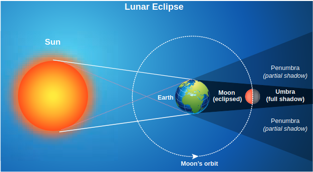

**Figure 6.31 Total lunar eclipse**

shadow, it appears in crescent shape. Figure 6.32 is the photograph taken by digital camera during Moon's exit from the umbra shadow.

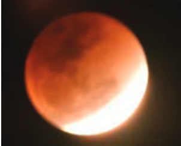

**Figure 6.32 Image of the Moon when it exits from umbra shadow**

By finding the apparent radii of the Earth's umbra shadow and the Moon, the ratio of the these radii can be calculated. This is shown in Figures 6.33 and 6.34.

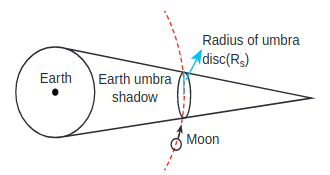

**Figure 6.33 Schematic diagram of umbra disk radius**

The apparent radius of Earth's umbra shadow $=\mathrm{R}_{\mathrm{s}}=13.2 \mathrm{~cm}$

The apparent radius of the Moon $=\mathrm{R}_{\mathrm{m}}=$ $5.15 \mathrm{~cm}$

The ratio $\frac{R_{s}}{R_{m}} \approx 2.56$

The radius of the Earth's umbra shadow is $R_{s}=2.56 \times R_{m}$

The radius of Moon $R_{m}=1737 \mathrm{~km}$

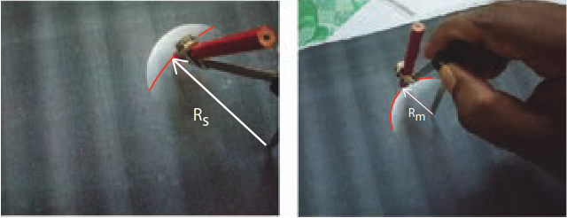

**Figure 6.34 Calculation of umbra radius**

The radius of the Earth's umbra shadow is $R_{s}=2.56 \times 1737 \mathrm{~km} \cong 4446 \mathrm{~km}$.

The correct radius is $4610 \mathrm{~km}$.

The percentage of error in the calculation

$=\frac{4610-4446}{4610} \times 100=3.5 \%$.

The error will reduce if the pictures taken using a high quality telescope are used. It is to be noted that this calculation is done using very simple mathematics.

Early astronomers proved that Earth is spherical in shape by looking at the shape of the shadow cast by Earth on the Moon during lunar eclipse.

2. Why there are no lunar eclipse and solar eclipse every month?

If the orbits of the Moon and Earth lie on the same plane, during full Moon of every month, we can observe lunar eclipse. If this is so during new Moon we can observe solar eclipse. But Moon's orbit is tilted $5^{\circ}$ with respect to Earth's orbit. Due to this $5^{\circ}$ tilt, only during certain periods of the year, the Sun, Earth and Moon align in straight line leading to either lunar eclipse or solar eclipse depending on the alignment. This is shown in Figure 6.35

**3. Why do we have seasons on Earth?**

The common misconception is that 'Earth revolves around the Sun, so when the Earth is very far away, it is winter and when the Earth is nearer, it is summer'. Actually, the seasons in the Earth arise due to the rotation of Earth around the Sun with $23.5^{\circ}$ tilt. This is shown in Figure 6.36

Due to this $23.5^{\circ}$ tilt, when the northern part of Earth is farther to the Sun, the southern part is nearer to the Sun. So when it is summer in the northern hemisphere, the southern hemisphere experience winter.

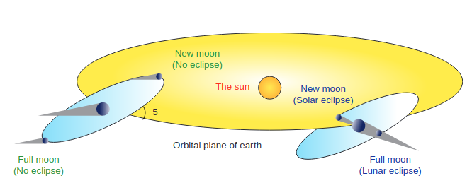

**Figure 6.35 Orbital tilt of the Moon**

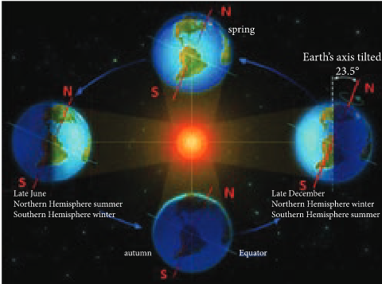

**Figure 6.36 Seasons on Earth**

**4. Star’s apparent motion and spinning of the Earth**

The Earth's spinning motion can be proved by observing star's position over a night. Due to Earth's spinning motion, the stars in sky appear to move in circular motion about the pole star as shown in Figure 6.37

**Note**
Pole star is a star located exactly above the Earth’s axis of rotation, hence it appears to be stationary. The Star Polaris is our pole star.

**Point to ponder**
Using Sun rays and shadows, How will you prove that the Earth’s tilt is 23.5° ?

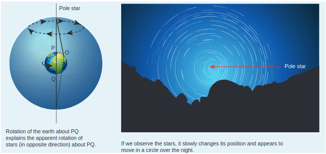

**Figure 6.37 Star’s apparent circular motion due to Earth’s rotation**

**6.5.5 Recent developments of astronomy and gravitation**

Till the $19^{\text {th }}$ century astronomy mainly depended upon either observation with the naked eye or telescopic observation. After the discovery of the electromagnetic spectrum at the end of the $19^{\text {th }}$ century, our understanding of the universe increased enormously. Because of this development in the late $19^{\text {th }}$ century it was found that Newton's law of gravitation could not explain certain phenomena and showed some discrepancies. Albert Einstein formulated his 'General theory of relativity' which was one of the most successful theories of $20^{\text {th }}$ century in the field of gravitation.

In the twentieth century both astronomy and gravitation merged together and have grown in manifold. The birth and death of stars were more clearly understood. Many Indian physicists made very important contributions to the field of astrophysics and gravitation.
Subramanian Chandrasekar formulated the theory of black holes and explained the life of stars. These studies brought him the Nobel prize in the year 1983. Another very notable Indian astrophysicist Meghnad Saha discovered the ionization formula which was useful in classifying stars. This formula is now known as "Saha ionization formula". In the field of gravitation Amal Kumar Raychaudhuri solved an equation now known as "Raychaudhuri equation" which was a very important contribution. Another notable Indian Astrophysicist Jayant V Narlikar made pioneering contribution in the field of astrophysics and has written interesting books on astronomy and astrophysics. IUCAA (Inter University Center for Astronomy and Astrophysics) is one of the important Indian research institutes where active research in astrophysics and gravitation are conducted. The institute was founded by Prof. J.V. Narlikar. Students are encouraged to read more about the recent developments in these fields.

**SUMMARY**

- The motion of planets can be explained using Kepler's laws.
- Kepler's first law: All the planets in the solar system orbit the Sun in elliptical orbits with the Sun at one of the foci.
- Kepler's second law: The radial vector line joining the Sun to a planet sweeps equal areas in equal intervals of time.
- Kepler's third law: The ratio of the square of the time period of planet to the cubic power of semi major axis is constant for all the planets in the solar system.
- Newton's law of gravitation states that the gravitational force between two masses is directly proportional to product of masses and inversely proportional to square of the distance between the masses. In vector form it is given by $\overrightarrow{\mathrm{F}}=-\frac{G m_{1} m_{2}}{r^{2}} \hat{r}$
- Gravitational force is a central force.
- Kepler's laws can be derived from Newton's law of gravitation.
- The gravitational field due to a mass $m$ at a point which is at a distance $r$ from mass $\mathrm{m}$ is given by $\overrightarrow{\mathrm{E}}=-\frac{\mathrm{Gm}}{\mathrm{r}^{2}} \hat{\mathrm{r}}$. It is a vector quantity.
- The gravitational potential energy of two masses is given by $U=-\frac{G m_{1} m_{2}}{r}$. It is a scalar quantity.
- The gravitational potential at a point which is at a distance $r$ from mass $m$ is given by $\mathrm{V}=-\frac{\mathrm{Gm}}{\mathrm{r}}$. It is a scalar quantity.
- The acceleration due to Earth's gravity decreases as altitude increases and as depth increases.
- Due to rotation of the Earth, the acceleration due to gravity is maximum at poles and minimum at Earth's equator.
- The (escape) speed of any object required to escape from the Earth's gravitational field is $\mathrm{v}_{\mathrm{e}}=\sqrt{2 \mathrm{gR}_{\mathrm{e}}}$. It is independent of mass of the object.
- The energy of the satellite is negative. It implies that the satellite is bound to Earth's gravitational force.
- Copernicus model explained that retrograde motion is due to relative motion between planets. This explanation is simpler than Ptolemy's epicycle explanation which is complicated
- Copernicus and Kepler measured the distance between a planet and the Sun using simple geometry and trigonometry.
- 2400 years ago, Eratosthenes measured the radius of the Earth using simple geometry and trigonometry.

**CONCEPT MAP**

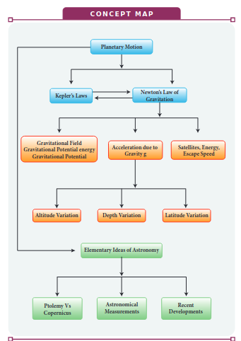

**I. Multiple Choice Questions**

1. The linear momentum and position vector of the planet is perpendicular to each other at

(a) perihelion and aphelion

(b) at all points

(c) only at perihelion

(d) no point

2. If the masses of the Earth and Sun suddenly double, the gravitational force between them will

(a) remain the same

(b) increase 2 times

(c) increase 4 times

(d) decrease 2 times

3. A planet moving along an elliptical orbit is closest to the Sun at distance $r_{1}$ and farthest away at a distance of $r_{2}$. If $\mathrm{v}_{1}$ and $\mathrm{v}_{2}$ are linear speeds at these points respectively. Then the ratio $\frac{v_{1}}{v_{2}}$ is

(NEET 2016)
(a) $\frac{r_{2}}{r_{1}}$
(b) $\left(\frac{r_{2}}{r_{1}}\right)^{2}$
(c) $\frac{r_{1}}{r_{2}}$
(d) $\left(\frac{r_{1}}{r_{2}}\right)^{2}$

4. The time period of a satellite orbiting Earth in a cirular orbit is independent of .

(a) Radius of the orbit

(b) The mass of the satellite

(c) Both the mass and radius of the orbit (d) Neither the mass nor the radius of its orbit

5. If the distance between the Earth and Sun were to be doubled from its present value, the number of days in a year would be
(a) 64.5
(b) 1032
(c) 182.5
(d) 730
6. According to Kepler's second law, the radial vector to a planet from the Sun sweeps out equal areas in equal intervals of time. This law is a consequence of

(a) conservation of linear momentum

(b) conservation of angular momentum

(c) conservation of energy

(d) conservation of kinetic energy

7. The gravitational potential energy of the Moon with respect to Earth is

(a) always positive

(b) always negative

(c) can be positive or negative

(d) always zero

8. The kinetic energies of a planet in an elliptical orbit about the Sun, at positions $A, B$ and $C$ are $K_{A}, K_{B}$ and $K_{C}$ respectively. $A C$ is the major axis and $\mathrm{SB}$ is perpendicular to $\mathrm{AC}$ at the position of the Sun $S$ as shown in the figure. Then

(NEET 2018)

(a) $\mathrm{K}_{\mathrm{A}}>\mathrm{K}_{\mathrm{B}}>\mathrm{K}_{\mathrm{C}}$

(b) $\mathrm{K}_{\mathrm{B}}<\mathrm{K}_{\mathrm{A}}<\mathrm{K}_{\mathrm{C}}$

(c) $\mathrm{K}_{\mathrm{A}}<\mathrm{K}_{\mathrm{B}}<\mathrm{K}_{\mathrm{C}}$

(d) $\mathrm{K}_{\mathrm{B}}>\mathrm{K}_{\mathrm{A}}>\mathrm{K}_{\mathrm{C}}$

9. The work done by the Sun's gravitational force on the Earth is

(a) always zero

(b) always positive

(c) can be positive or negative

(d) always negative

10. If the mass and radius of the Earth are both doubled, then the acceleration due to gravity g'
(a) remains same
(b) $\frac{g}{2}$
(c) $2 \mathrm{~g}$
(d) $4 \mathrm{~g}$
11. The magnitude of the Sun's gravitational field as experienced by Earth is

(a) same over the year

(b) decreases in the month of January and increases in the month of July

(c) decreases in the month of July and increases in the month of January

(d) increases during day time and decreases during night time.

12. If a person moves from Chennai to Trichy, his weight

(a) increases

(b) decreases

(c) remains same

(d) increases and then decreases

13. An object of mass $10 \mathrm{~kg}$ is hanging on a spring scale which is attached to the roof of a lift. If the lift is in free fall, the reading in the spring scale is
(a) $98 \mathrm{~N}$
(b) zero
(c) $49 \mathrm{~N}$
(d) $9.8 \mathrm{~N}$

14. If the acceleration due to gravity becomes 4 times its original value, then escape speed

(a) remains same

(b) 2 times of original value (c) becomes halved

(d) 4 times of original value

15. The kinetic energy of the satellite orbiting around the Earth is

(a) equal to potential energy

(b) less than potential energy

(c) greater than kinetic energy

(d) zero

**Answers**

| 1) $\mathrm{a}$ | 2) $\mathrm{c}$ | 3) $\mathrm{a}$ | 4) $\mathrm{b}$ | 5) $\mathrm{b}$ |
| ---: | ---: | ---: | ---: | ---: |
| 6) $\mathrm{b}$ | 7) $\mathrm{b}$ | 8) $\mathrm{a}$ | 9) $\mathrm{c}$ | 10) $\mathrm{b}$ |
| 11) $\mathrm{c}$ | 12) $\mathrm{b}$ | 13) $\mathrm{b}$ | 14) $\mathrm{b}$ | 15) $\mathrm{b}$ |

**II . Short Answer Questions**

1. State Kepler's three laws.
2. State Newton's Universal law of gravitation.
3. Will the angular momentum of a planet be conserved? Justify your answer.
4. Define the gravitational field. Give its unit.
5. What is meant by superposition of gravitational field?
6. Define gravitational potential energy.
7. Is potential energy the property of a single object? Justify.
8. Define gravitational potential.
9. What is the difference between gravitational potential and gravitational potential energy?
10. What is meant by escape speed in the case of the Earth?
11. Why is the energy of a satellite (or any other planet) negative?
12. What are geostationary and polar satellites?
13. Define weight
14. Why is there no lunar eclipse and solar eclipse every month?
15. How will you prove that Earth itself is spinning?

**II I. Long Answer Questions**

1. Discuss the important features of the law of gravitation.
2. Explain how Newton arrived at his law of gravitation from Kepler's third law.
3. Explain how Newton verified his law of gravitation.
4. Derive the expression for gravitational potential energy.
5. Prove that at points near the surface of the Earth, the gravitational potential energy of the object is $U=m g h$
6. Explain in detail the idea of weightlessness using lift as an example.
7. Derive an expression for escape speed.
8. Explain the variation of $g$ with lattitude.
9. Explain the variation of $g$ with altitude.
10. Explain the variation of $g$ with depth from the Earth's surface.
11. Derive the time period of satellite orbiting the Earth.
12. Derive an expression for energy of satellite.
13. Explain in detail the geostationary and polar satellites.
14. Explain how geocentric theory is replaced by heliocentric theory using the idea of retrograde motion of planets.
15. Explain in detail the Eratosthenes method of finding the radius of Earth.
16. Describe the measurement of Earth's shadow (umbra) radius during total lunar eclipse

**IV. Exercises**

1. An unknown planet orbits the Sun with distance twice the semi major axis distance of the Earth's orbit. If the Earth's time period is $T_{1}$, what is the time period of this unknown planet?

Ans: $T_{2}=2 \sqrt{2} T_{1}$

2. Assume that you are in another solar system and provided with the set of data given below consisting of the planets' semi major axes and time periods. Can you infer the relation connecting semi major axis and time period?

| Planet   (imaginary) | Time   period(T)   (in year) | Semi major   axis (a)   (in AU) |
| :--- | :---: | :---: |
| Kurinji | 2 | 8 |
| Mullai | 3 | 18 |
| Marutham | 4 | 32 |
| Neithal | 5 | 50 |
| Paalai | 6 | 72 |

3. If the masses and mutual distance between the two objects are doubled, what is the change in the gravitational force between them?

Ans: No change

4. Two bodies of masses $\mathrm{m}$ and $4 \mathrm{~m}$ are placed at a distance $\mathrm{r}$. Calculate the gravitational potential at a point on the line joining them where the gravitional field is zero.

$$
\text { Ans: } V=-\frac{9 G m}{r}
$$

5. If the ratio of the orbital distance of two planets $\frac{\mathrm{d}_{1}}{\mathrm{~d}_{2}}=2$, what is the ratio of gravitational field experienced by these two planets?

$$
\text { Ans: } \mathrm{E}_{2}=4 \mathrm{E}_{1}
$$

6. The Moon Io orbits Jupiter once in 1.769 days. The orbital radius of the Moon Io is $421700 \mathrm{~km}$. Calculate the mass of Jupiter?

Ans: $1.898 \times 10^{27} \mathrm{~kg}$

7. If the angular momentum of a planet is given by $\overrightarrow{\mathrm{L}}=5 \mathrm{t}^{2} \hat{\mathrm{i}}-6 \mathrm{t} \hat{\mathrm{j}}+3 \hat{\mathrm{k}}$ What is the torque experienced by the planet? Will the torque be in the same direction as that of the angular momentum?

$$
\text { Ans: } \vec{\tau}=10 t \hat{i}-6 \hat{j}
$$

8. Four particles, each of mass $M$ and equidistant from each other, move along a circle of radius $\mathrm{R}$ under the action of their mutual gravitational attraction. Calculate the speed of each particle

$$
\text { Ans: } \frac{1}{2} \sqrt{\frac{G M}{R}(1+2 \sqrt{2})}
$$

9. Suppose unknowingly you wrote the universal gravitational constant value as $G=6.67 \times 10^{11}$ instead of the correct value $G=6.67 \times 10^{-11}$, what is the acceleration due to gravity g' for this incorrect G? According to this new acceleration due to gravity, what will be your weight W'?

$$
\text { Ans: } g^{\prime}=10^{22} g, W^{\prime}=10^{22} \mathrm{~W}
$$

10. Calculate the gravitational field at point $\mathrm{O}$ due to three masses $\mathrm{m}_{1}, \mathrm{~m}_{2}$ and $\mathrm{m}_{3}$ whose positions are given by the following figure. If the masses $m_{1}$ and $\mathrm{m}_{2}$ are equal what is the change in gravitational field at the point $\mathrm{O}$ ?

$$
\begin{aligned}
& \text { Ans: } \vec{E}=\frac{G}{a^{2}}\left[\left(m_{1}-m_{2}\right) i+m_{3} j\right] \\
& \quad \text { if } m_{1}=m_{2}, \vec{E}=\frac{G}{a^{2}}\left[m_{3} \hat{j}\right]
\end{aligned}
$$

11. What is the gravitational potential energy of the Earth and Sun? The Earth to Sun distance is around 150 million $\mathrm{km}$. The mass of the Earth is $5.9 \times 10^{24} \mathrm{~kg}$ and mass of the Sun is $1.9 \times 10^{30} \mathrm{~kg}$.

Ans: $\mathrm{U}=-49.84 \times 10^{32}$ Joule

12. Earth revolves around the Sun at 30 $\mathrm{km} \mathrm{s}^{-1}$. Calculate the kinetic energy of the Earth. In the previous example you calculated the potential energy of the Earth. What is the total energy of the Earth in that case? Is the total energy positive? Give reasons.

$$
\begin{array}{r}
\text { Ans: } \mathrm{K} . \mathrm{E}=26.5 \times 10^{32} \mathrm{~J} \\
\qquad \mathrm{E}=-23.29 \times 10^{32} \mathrm{~J}
\end{array}
$$

(-) ve implies that Earth is bounded with Sun

13. An object is thrown from Earth in such a way that it reaches a point at infinity with non-zero kinetic energy
$\left[\mathrm{K} . \mathrm{E}(\mathrm{r}=\infty)=\frac{1}{2} \mathrm{Mv}_{\infty}{ }^{2}\right]$, with what velocity should the object be thrown from Earth?

$$
\text { Ans: } v_{e}=\sqrt{v_{\infty}^{2}+2 g R_{E}}
$$

14. Suppose we go $200 \mathrm{~km}$ above and below the surface of the Earth, what are the $g$ values at these two points? In which case, is the value of $g$ small?

$$
\text { Ans: } \begin{aligned}
\mathrm{g}_{\text {down }} & =0.96 \mathrm{~g} \\
\mathrm{~g}_{\text {up }} & =0.94 \mathrm{~g}
\end{aligned}
$$

15. Calculate the change in $g$ value in your district of Tamil nadu. (Hint: Get the latitude of your district of Tamil nadu from the Google). What is the difference in $g$ values at Chennai and Kanyakumari?

$$
\begin{aligned}
\text { Ans: } \mathrm{g}_{\text {chennai }} & =9.7677 \mathrm{~m} \mathrm{~s}^{-2} \\
\mathrm{~g}_{\text {Kanyakumari }} & =9.7667 \mathrm{~m} \mathrm{~s}^{-2} \\
\Delta \mathrm{g} & =0.001 \mathrm{~m} \mathrm{~s}^{-2}
\end{aligned}
$$

**V. Conceptual Questions**

1. In the following, what are the quantities which that are conserved?

a) Linear momentum of planet

b) Angular momentum of planet

c) Total energy of planet

d) Potential energy of a planet

2. The work done by Sun on Earth in one year will be
a) Zero
b) Non zero
c) positive
d) negative

3\. The work done by Sun on Earth at any finite interval of time is  

a) positive, negative or zero b) Strictly positive c) Strictly negative d) It is always zero

3. The work done by Sun on Earth at any finite interval of time is a) positive, negative or zero

b) Strictly positive

c) Strictly negative

d) It is always zero

4. If a comet suddenly hits the Moon and imparts energy which is more than the total energy of the Moon, what will happen?
5. If the Earth's pull on the Moon suddenly disappears, what will happen to the Moon?
6. If the Earth has no tilt, what happens to the seasons of the Earth?

7. A student was asked a question 'why are there summer and winter for us? He replied as 'since Earth is orbiting in an elliptical orbit, when the Earth is very far away from the Sun(aphelion) there will be winter, when the Earth is nearer to the Sun(perihelion) there will be winter'. Is this answer correct? If not, what is the correct explanation for the occurrence of summer and winter?
8. The following photographs are taken from the recent lunar eclipse which occurred on January 31, 2018. Is it possible to prove that Earth is a sphere from these photographs?

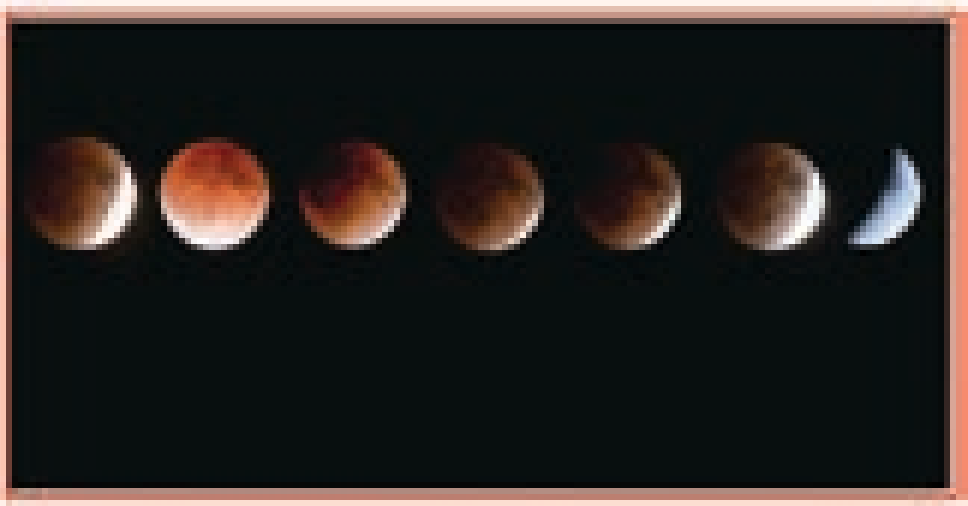

**BOOKS FOR REFERENCE**

1. Mechanics by Charles Kittel, Walter Knight, Malvin Ruderman, Carl Helmholtz and Moyer
2. Newtonian Mechanics by A.P. French
3. Introduction to Mechanics by Daniel Kepler and Robert Kolenkow
4. Mechanics by Somnath Datta
5. Concepts of Physics volume 1 and Volume 2 by H.C. Verma
6. Physics for Scientist and Engineers with Modern physics by Serway and Jewett
7. Physics for Scientist and Engineers by Paul Tipler and Gene Mosca
8. Physics for the Inquiring Mind by Eric Rogers
9. Fundamental laws of Mechanics by Irodov.
10. Question and Problems in School Physics by Tarasov and Tarasova  

**ICT CORNER**

**Gravitation**

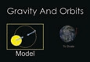

**Gravit**

Through this activity you will be able to learn about the gravitational force and
orbital paths.

**STEPS:** • Click the URL or scan the QR code to launch

“Model” to start the activity.

• In the activity window, a diagram of sun and motion of earth.

• We can change the objects by selecting objects

• The path of the gravity, velocity and the obj relevant boxes given in the table.

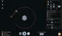  

  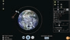

**URL:** https://phet.colorado.edu/sims/html/gravity-and-orbit and-orbits\_en.html

\* Pictures are indicative only. \* If browser requires, allow **Flash Player** or **Java Scr**

**ICT CORNER**

**Step1**

**Step3**  

**ation**

the activity page. Click on the box labelled earth is given. Click the play icon to see the
from the table given in the right side window. ect in motion can be viewed. Check on the
s/latest/gravity-

**ipt** to load the page.

**Step4**

**Step2**

