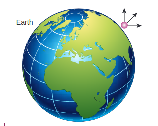
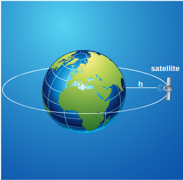
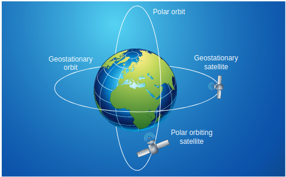
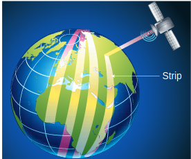
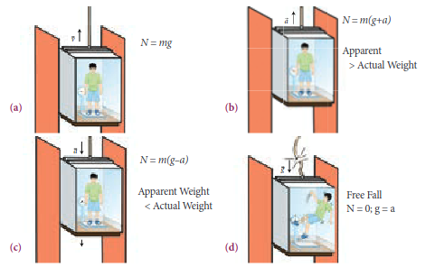

**6.4 ESCAPE SPEED AND ORBITAL SPEED**

Hydrogen and helium are the most abundant elements in the universe but Earth's atmosphere consists mainly of nitrogen and oxygen. The following discussion brings forth the reason why hydrogen and helium are not found in abundance on the Earth's atmosphere. When an object is thrown up with some initial speed it will reach a certain height after which it will fall back to Earth. If the same object is thrown again with a higher speed, it reaches a greater height than the previous one and falls back to Earth. This leads to the question of what should be the speed of an object thrown vertically up such that it escapes the Earth's gravity and would never come back. This speed is called "Escape speed" and it is defined as "the minimum speed required for a body to escape from the earth's gravitational pull”.

Consider an object of mass M on the surface of the Earth. When it is thrown up with an initial speed v_{i}, the initial total energy of the object is


E_{i}=\frac{1}{2} M v_{i}^{2}-\frac{G M M_{E}}{R_{E}}


where, M_{E} is the mass of the Earth and R_{E}{ }^{-} the radius of the Earth. The term -\frac{G M M_{E}}{R_{E}} is the potential energy of the mass M.

When the object reaches a height far away from Earth and hence treated as approaching infinity, the gravitational potential energy becomes zero [U(\infty)=0] and the kinetic energy becomes zero as well. Therefore the final total energy of the
object becomes zero. This is for minimum energy and for minimum speed to escape. Otherwise Kinetic energy can be nonzero.


E_{f}=0


According to the law of energy conservation,


E_{i}=E_{f}


Substituting (6.53) in (6.54) we get,


\begin{aligned}
& \frac{1}{2} M v_{i}^{2}-\frac{G M M_{E}}{R_{E}}=0 \\
& \frac{1}{2} M v_{i}^{2}=\frac{G M M_{E}}{R_{E}}
\end{aligned}


Consider the escape speed, the minimum speed required by an object to escape Earth's gravitational field, hence replace v_{i} with v_{e}. i.e,


\begin{aligned}
\frac{1}{2} M v_{e}^{2} & =\frac{G M M_{E}}{R_{E}} \\
v_{e}^{2} & =\frac{G M M_{E}}{R_{E}} \cdot \frac{2}{M} \\
v_{e}^{2} & =\frac{2 G M_{E}}{R_{E}}
\end{aligned}


Using g=\frac{G M_{E}}{R_{E}^{2}},


\begin{aligned}
v_{e}^{2} & =2 g R_{E} \\
v_{e} & =\sqrt{2 g R_{E}}
\end{aligned}


From equation (6.56) the escape speed depends on two factors: acceleration due to gravity and radius of the Earth. It is completely independent of the mass of the object. By substituting the values of g \left(9.8 \mathrm{~m} \mathrm{~s}^{-2}\right) and \mathrm{R}_{\mathrm{e}}=6400 \mathrm{~km}, the escape speed of the Earth is \mathrm{v}_{\mathrm{e}}=11.2 \mathrm{~km} \mathrm{~s}^{-1}. The escape speed is independent of the direction in which the object is thrown. Irrespective of whether the object is thrown vertically up, radially outwards or tangentially it requires the same initial speed to escape Earth's gravity. It is shown in Figure 6.19

**Figure 6.19 Escape speed independent of angle**

Lighter molecules such as hydrogen and helium have enough speed to escape from the Earth, unlike the heavier ones such as nitrogen and oxygen. (The average speed of hydrogen and helium atoms compaired with the escape speed of the Earth,is presented in the kinetic theory of gases, unit 9).

**6.4.1 Satellites, orbital speed and time period**

We are living in a modern world with sophisticated technological gadgets and are able to communicate to any place on Earth. This advancement was made possible because of our understanding of solar system. Communication mainly depends on the satellites that orbit the Earth (Figure 6.20). Satellites revolve around the Earth just like the planets revolve around the Sun. Kepler's laws are applicable to man made satellites also.

For a satellite of mass M to move in a circular orbit, centripetal force must be acting on the satellite. This centripetal force is provided by the Earth's gravitational force.

**Figure 6.20 Satellite revolving around the Earth.**

\begin{aligned}
\frac{M v^{2}}{\left(R_{E}+h\right)} & =\frac{G M M_{E}}{\left(R_{E}+h\right)^{2}} \\
v^{2} & =\frac{G M_{E}}{\left(R_{E}+h\right)} \\
v^{2} & =\sqrt{\frac{G M_{E}}{\left(R_{E}+h\right)}}
\end{aligned}


As h increases, the speed of the satellite decreases.

**Time period of the satellite:**

The distance covered by the satellite during one rotation in its orbit is equal to 2 \pi\left(R_{E}+h\right) and time taken for it is the time period, \mathrm{T}. Then


\text { Speed } v=\frac{\text { Distance travelled }}{\text { Time taken }}=\frac{2 \pi\left(R_{E}+h\right)}{T}


From equation (6.58)


\begin{aligned}
\sqrt{\frac{G M_{E}}{\left(R_{E}+h\right)}} & =\frac{2 \pi\left(R_{E}+h\right)}{T} \\
T & =\frac{2 \pi}{\sqrt{G M_{E}}}\left(R_{E}+h\right)^{3 / 2}
\end{aligned}


Squaring both sides of the equation (6.60), we get


\begin{aligned}
T^{2} & =\frac{4 \pi^{2}}{G M_{E}}\left(R_{E}+h\right)^{3} \\
\frac{4 \pi^{2}}{G M_{E}} & =\text { constant say } c \\
T^{2} & =c\left(R_{E}+h\right)^{3}
\end{aligned}


Equation (6.61) implies that a satellite orbiting the Earth has the same relation between time and distance as that of Kepler's law of planetary motion. For a satellite orbiting near the surface of the Earth, h is negligible compared to the radius of the Earth R_{E}. Then,


T^{2}=\frac{4 \pi^{2}}{G M_{E}} R_{E}^{3}



\begin{aligned}
T^{2} & =\frac{4 \pi^{2}}{G M_{E} / R_{E}^{2}} R_{E} \\
T^{2} & =\frac{4 \pi^{2}}{g} R_{E}
\end{aligned}


since G M_{E} / R_{E}{ }^{2}=g


T=2 \pi \sqrt{\frac{R_{E}}{g}}


By substituting the values of R_{E}=6.4 \times 10^{6} \mathrm{~m} and \mathrm{g}=9.8 \mathrm{~m} \mathrm{~s}^{-2}, the orbital time period is obtained as \mathrm{T} \cong 85 minutes.

**EXAMPLE 6.9**
Moon is the natural satellite of Earth and it takes 27 days to go once around its orbit. Calculate the distance of the Moon from the surface of the Earth assuming the orbit of the Moon as circular.

**Solution**
We can use Kepler's third law,


\begin{aligned}
& T^{2}=c\left(R_{E}+h\right)^{3} \\
&\left(\frac{T^{2}}{c}\right)^{1 / 3}=c^{1 / 3}\left(R_{E}+h\right) \\
&\left(\frac{T^{2} G M_{E}}{4 \pi^{2}}\right)^{\frac{1}{3}}=\left(R_{E}+h\right) ; \\
& c=\frac{4 \pi^{2}}{G M_{E}} \\
& h=\left(\frac{T^{2} G M_{E}}{4 \pi^{2}}\right)^{1 / 3}-R_{E}
\end{aligned}


Here h is the distance of the Moon from the surface of the Earth. Here,


R_{E}-\text { radius of the Earth }=6.4 \times 10^{6} \mathrm{~m}


M_{E} - mass of the Earth =6.02 \times 10^{24} \mathrm{~kg}

G - Universal gravitational


\text { constant }=6.67 \times 10^{-11} \frac{\mathrm{Nm}^{2}}{\mathrm{~kg}^{2}}


By substituting these values, the distance to the Moon from the surface of the Earth is calculated to be 3.77 \times 10^{5} \mathrm{~km}.

**6.4.2 Energy of an Orbiting Satellite**

The total energy of a satellite orbiting the Earth at a distance $h$ from the surface of Earth is calculated as follows; The total energy of the satellite is the sum of its kinetic energy and the gravitational potential energy. The potential energy of the satellite is,


U=-\frac{G M_{s} M_{E}}{\left(R_{E}+h\right)}


Here M_{s} - mass of the satellite, M_{E} - mass of the Earth, R_{E} - radius of the Earth.

The Kinetic energy of the satellite is


K . E=\frac{1}{2} M_{s} v^{2}


Here v is the orbital speed of the satellite and is equal to


v=\sqrt{\frac{G M_{E}}{\left(R_{E}+h\right)}}


Substituting the value of $v$ in (6.64), the kinetic energy of the satellite becomes,


K . E=\frac{1}{2} \frac{G M_{E} M_{s}}{\left(R_{E}+h\right)}


Therefore the total energy of the satellite is


\begin{aligned}
& E=\frac{1}{2} \frac{G M_{E} M_{s}}{\left(R_{E}+h\right)}-\frac{G M_{s} M_{E}}{\left(R_{E}+h\right)} \\
& E=-\frac{G M_{s} M_{E}}{2\left(R_{E}+h\right)}
\end{aligned}


The negative sign in the total energy implies that the satellite is bound to the Earth and it cannot escape from the Earth.

As h approaches \infty, the total energy tends to zero. Its physical meaning is that the satellite is completely free from the influence of Earth's gravity and is not bound to Earth at large distances.

**EXAMPLE 6.10**

Calculate the energy of the (i) Moon orbiting the Earth and (ii) Earth orbiting the Sun.

**Solution**

Assuming the orbit of the Moon to be circular, the energy of Moon is given by,


E_{m}=-\frac{G M_{E} M_{m}}{2 R_{m}}


where M_{E} is the mass of Earth 6.02 \times 10^{24} \mathrm{~kg} ; M_{m} is the mass of Moon 7.35 \times 10^{22} \mathrm{~kg}; and R_{m} is the distance between the Moon and the center of the Earth 3.84 \times 10^{5} \mathrm{~km}


G=6.67 \times 10^{-11} \mathrm{~N} \mathrm{~m}^{2} \mathrm{~kg}^{-2}



\begin{gathered}
E_{m}=-\frac{6.67 \times 10^{-11} \times 6.02 \times 10^{24} \times 7.35 \times 10^{22}}{2 \times 3.84 \times 10^{5} \times 10^{3}} \\
E_{m}=-38.42 \times 10^{-19} \times 10^{46} \\
E_{m}=-38.42 \times 10^{27} \text { Joule }
\end{gathered}


The negative energy implies that the Moon is bound to the Earth.

Same method can be used to prove that the energy of the Earth is also negative.

**6.4.3 Geo-stationary and polar satellite**

The satellites orbiting the Earth have different time periods corresponding to different orbital radii. Can we calculate the orbital radius of a satellite if its time period is 24 hours?

Kepler's third law is used to find the radius of the orbit.


\begin{aligned}
& T^{2}=\frac{4 \pi^{2}}{G M_{E}}\left(R_{E}+h\right)^{3} \\
& \left(R_{E}+h\right)^{3}=\frac{G M_{E} T^{2}}{4 \pi^{2}} \\
& R_{E}+h=\left(\frac{G M_{E} T^{2}}{4 \pi^{2}}\right)^{1 / 3}
\end{aligned}


Substituting for the time period (24 hrs =86400 seconds), mass, and radius of the Earth, h turns out to be 36,000 \mathrm{~km}. Such satellites are called "geo-stationary satellites", since they appear to be stationary when seen from Earth.

India uses the INSAT group of satellites that are basically geo-stationary satellites for the purpose of telecommunication. Another type of satellite which is placed at a distance

**Figure 6.21 Polar orbit and geostationary satellite**

of 500 to 800 \mathrm{~km} from the surface of the Earth orbits the Earth from north to south direction. This type of satellite that orbits Earth from North Pole to South Pole is called a polar satellite. The time period of a polar satellite is nearly 100 minutes and the satellite completes many revolutions in a day. A Polar satellite covers a small strip of area from pole to pole during one revolution. In the next revolution it covers a different strip of area since the Earth would have moved by a small angle. In this way polar satellites cover the entire surface area of the Earth.

**Figure 6.22 Strip of communication region, covered by a polar satellite**

**6.4.4 Weightlessness Weight of an object**

Objects on Earth experience the gravitational force of Earth. The gravitational force acting on an object of mass \mathrm{m} is \mathrm{mg}. This force always acts downwards towards the center of the Earth. When we stand on the floor, there are two forces acting on us. One is the gravitational force, acting downwards and the other is the normal force exerted by the floor upwards on us to keep us at rest. The weight of an object \vec{W} is defined as the downward force whose magnitude \mathrm{W} is equal to that of upward force that must be applied to the object to hold it at rest or at constant velocity relative to the earth. The direction of weight is in the direction of gravitational force. So the magnitude of
weight of an object is denoted as, \mathrm{W}=\mathrm{N}=\mathrm{mg}. Note that even though magnitude of weight is equal to \mathrm{mg}, it is not same as gravitational force acting on the object.

**Apparent weight in elevators**

Everyone who used an elevator would have felt a jerk when the elevator takes off or stops. Why does it happen? Understanding the concept of weight is crucial for explaining this effect. Let us consider a man inside an elevator in the following scenarios.

When a man is standing in the elevator, there are two forces acting on him.

1. Gravitational force which acts downward. If we take the vertical direction as positive \mathrm{y} direction, the gravitational force acting on the man is \vec{F}_{G}=-m g \hat{j}
2. The normal force exerted by floor on the man which acts vertically upward, \vec{N}=N \hat{j}

**Case (i) When the elevator is at rest**

The acceleration of the man is zero. Therefore the net force acting on the man is zero. With respect to inertial frame (ground), applying Newton's second law on the man,


\begin{array}{r}
\vec{F}_{G}+\vec{N}=0 \\
-m g \hat{j}+N \hat{j}=0
\end{array}


By comparing the components, we can write


\mathrm{N}-\mathrm{mg}=0 \text { (or) } \mathrm{N}=\mathrm{mg}


Since weight, \mathrm{W}=\mathrm{N}, the apparent weight of the man is equal to his actual weight.

Case (ii) When the elevator is moving uniformly in the upward or downward direction

In uniform motion (constant velocity), the net force acting on the man is still zero.
Hence, in this case also the apparent weight of the man is equal to his actual weight. It is shown in Figure 6.23(a)

Case (iii) When the elevator is accelerating upwards

If an elevator is moving with upward acceleration (\vec{a}=a \hat{j}) with respect to inertial frame (ground), applying Newton's second law on the man,


\vec{F}_{G}+\vec{N}=m \vec{a}


Writing the above equation in terms of unit vector in the vertical direction,


-m g \hat{j}+N \hat{j}=m a \hat{j}


By comparing the components,


N=m(g+a)


Therefore, apparent weight of the man is greater than his actual weight. It is shown in Figure 6.23(b)

Case (iv) When the elevator is accelerating downwards

If the elevator is moving with downward acceleration \quad(\vec{a}=-a \hat{j}), by applying Newton's second law on the man, we can write


\vec{F}_{G}+\vec{N}=m \vec{a}


Writing the above equation in terms of unit vector in the vertical direction,


-m g \hat{j}+N \hat{j}=-m a \hat{j}


By comparing the components,


\mathrm{N}=\mathrm{m}(\mathrm{g}-\mathrm{a})


Therefore, apparent weight \mathrm{W}=\mathrm{N}=\mathrm{m}(\mathrm{g}-\mathrm{a}) of the man is lesser than his actual weight. It is shown in Figure 6.23(c)

**Weightlessness of freely falling bodies**

Freely falling objects experience only gravitational force. As they fall freely, they are not in contact with any surface (by neglecting air friction). The normal force acting on the object is zero. The downward acceleration is equal to the acceleration due to the gravity of the Earth. i.e (\mathrm{a}=\mathrm{g}). From equation (6.69) we get.


a=g \quad \therefore N=m(g-g)=0 .


This is called the state of weightlessness. When the lift falls (when the lift wire cuts) with downward acceleration \mathrm{a}=\mathrm{g}, the person inside the elevator is in the state of weightlessness or free fall. It is shown in Figure 6.23(d)

When the apple was falling from the tree it was weightless.As soon as it hit Newton's head, it gained weight! and Newton gained physics!

**Weightlessness in satellites:**

There is a wrong notion that the astronauts in satellites experience no gravitational force because they are far away from the Earth. Actually the Earth satellites that orbit very close to Earth experience only gravitational force. The astronauts inside the satellite also experience the same gravitational force. Because of this, they cannot exert any force on the floor of the satellite. Thus, the floor of the satellite also cannot exert any normal force on the astronaut. Therefore, the astronauts inside a satellite are in the state of weightlessness. Not only the astronauts, but all the objects in the satellite will be in the state of weightlessness which is similar to that of a free fall. It is shown in the Figure 6.24.

**Figure 6.23 Apparent weight in the lift**

Figure 6.24 The well known scientist Stephen Hawking in the state of weightlessness. https://www.youtube.com/watch?v=OCsuHvv_D0s