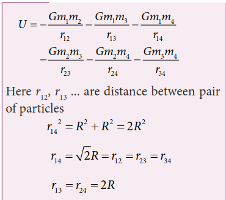
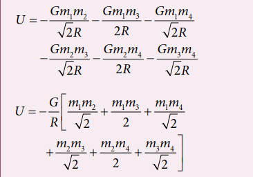

# 6.2 GRAVITATIONAL FIELD AND GRAVITATIONAL POTENTIAL

## 6.2.1 Gravitational field

Force is basically due to the interaction between two particles. Depending upon the type of interaction we can have two kinds of forces: Contact forces and Non-contact forces (Figure 6.8).

\

**Figure 6.8** Depiction of contact and non-contact forces

Contact forces are the forces applied where one object is in physical contact with the other. The movement of the object is caused by the physical force exerted through the contact between the object and the agent which exerts force.

Consider the case of Earth orbiting around the Sun. Though the Sun and the  

Earth are not physically in contact with each other, there exists an interaction between them. This is because of the fact that the Earth experiences the gravitational force of the Sun. This gravitational force is a non- contact force.

It sounds mysterious that the Sun attracts the Earth despite being very far from it and without touching it. For contact forces like push or pull, we can calculate the strength of the force since we can feel or see. But how do we calculate the strength of non-contact force at different distances? To understand and calculate the strength of non-contact forces, the concept of ‘field’ is introduced.

The gravitational force on a particle of mass ‘m2’ due to a particle of mass ‘m1’ is

where is a unit vector that points from _m_1 to _m_2 along the line joining the masses _m_1 and _m_2.

The gravitational field intensity  _E_1 (here after called as gravitational field) at a point which is at a distance r from m1 is defined as the gravitational force experienced by unit mass placed at that point. It is given by the

ratio 

_F m_

21

2

(where _m_2 is the mass of the object

on which 
_F_21 acts)
Using 

_E F m_1
21
2
\= in equation (6.14) we get

E_1 is a vector quantity that points towards the mass _m_1 and is independent of mass _m_2, Here _m2 is taken to be of unit magnitude . The unit_ is along the line between _m_1 and the point in

question. The field 

_E_1 is due to the mass _m_1\. In general, the gravitational field intensity

due to a mass M at a distance r is given by



_E GM r_

_r_\=− 2 (6.16)

Now in the region of this gravitational field, a mass ‘m’ is placed at a point P (Figure 6.9). Mass ‘m’ interacts with the field



_E_ and experiences an attractive force due to M as shown in Figure 6.9. The gravitational force experienced by ‘m’ due to ‘M’ is given by

**Figure 6.9** Gravitational Field intensity measured with an object of unit mass

 

_F mEm_ \= (6.17)

Now we can equate this with Newton’s second law



_F ma_\=

_ma mE_



\= (6.18)





_a E_\= (6.19)

In other words, equation (6.18) implies that the gravitational field at a point is equivalent to the acceleration experienced  

by a particle at that point. However, it is to be noted that _a_ and



_E_ are separate physical quantities that have the same magnitude and direction. The gravitational field



_E_ is the property of the source and acceleration a is the effect experienced by the test mass (unit mass) which is placed in the gravitational field



_E_ . The non- contact interaction between two masses can now be explained using the concept of “Gravitational field”.

**Points to be noted:**

i) The strength of the gravitational field decreases as we move away from the mass M as depicted in the Figure 6.10. The magnitude of  _E_ decreases as the distance r increases.

**Figure 6.10** Strength of the Gravitational field lines decreases with distance

Figure 6.10 shows that the strength of the gravitational field at points P, Q, and R is given by

  

_E E EP Q R_< < . It can be understood by comparing the length of the vectors at points P, Q, and R.

ii) The “field” concept was introduced as a mathematical tool to calculate gravitational interaction. Later it was found that field is a real physical quantity and it carries energy and momentum in space. The concept of field is inevitable in understanding the behavior of charges.

iii) The unit of gravitational field is Newton per kilogram (N/kg) or m s-2.

## 6.2.2 Superposition principle for Gravitational field

Consider ‘n’ particles of masses _m m mn_1 2, , . , distributed in space at positions   …_r r r_1 2 3, , etc, with respect to point P. The total gravitational field at a point P due to all the masses is given by the vector sum of the gravitational field due to the individual masses (Figure 6.11). This principle is known as superposition of gravitational fields.

   

_E E E Etotal n_  1 2

\= - - - - _Gm r_

_r Gm r_

_r Gm r_

_rn_

_n n_

1

1 2 1

2

2 2 2 2

\=− = ∑ _i_

_n i_

_i i_

_Gm r_

_r_ 1

2 . (6.20)

**Figure 6.11** Superposition of two gravitational field intensities giving resultant field.

Instead of discrete masses, if we have continuous distribution of a total mass M, then the gravitational field at a point P is calculated using the method of integration. 

**EXAMPLE 6.3**

(a) Two particles of masses _m and m_1 2 are placed along the x and y axes respectively at a distance ‘a’ from the origin. Calculate the gravitational field at a point P shown in figure below.

**_Solution_**

Gravitational field due to m1 at a point P is given by,



_E Gm a_

_j_1 1

2=−

Gravitational field due to m2 at the point p is given by,



_E Gm a_

_i_2 2

2=−



_E Gm a_

_j Gm a_

_itotal_ \=− −1 2

2 2

\=− +( )_G a_

_m mj i_2 1 2

The direction of the total gravitational field is determined by the relative value of _m_1 and _m_2.

| mP2 |
|------|------|

| E |
|------|
|  |
  

When _m m m_1 2= =



_E Gm a_

_i jtotal_ \=− +( )2

( _i j j i_\+ = + as vectors obeys commutation law).

E1

Etot

E2



_Etotal_ points towards the origin of the co-ordinate system and the magnitude of 

_Etotal_ is 2 2

_Gm a_

**EXAMPLE 6.4**

Qualitatively indicate the gravitational field of Sun on Mercury, Earth, and Jupiter shown in figure.

Since the gravitational field decreases as distance increases, Jupiter experiences a weak gravitational field due to the Sun. Since Mercury is the nearest to the Sun, it experiences the strongest gravitational field.

Solar System

## 6.2.3 Gravitational Potential Energy

The concept of potential energy and its physical meaning were dealt in unit 4. The gravitational force is a conservative force and hence we can define a gravitational potential energy associated with this conservative force field.

Two masses m1 and m2 are initially separated by a distance ′_r_ . Assuming m1 to be fixed in its position, work must be done on m2 to move the distance from ′_r_ to _r_ as shown in Figure 6.12(a)

**Figure 6.12** Two distant masses changing the linear distance

To move the mass m2 through an infinitesimal displacement _dr_ from   _r to r dr_ + (shown in the Figure 6.12(b)), work has to be done externally. This infinitesimal work is given by

_dW F drext_\= 
. (6.21)

The work is done against the gravitational force, therefore,

 

_F F Gm m rext G_\= = 1 2

2 (6.22)

Substituting Equation (6.22) in 6.21, we get

_dW Gm m r_

_r dr_\= 1 2 2 .  (6.23)

Also we know

_dr dr r_

\= (6.24)

⇒ _dW Gm m r_

_r dr r_\= ( )1 2 2 . (6.25)

_r r since both are unit vectors_. = ( )1

∴ _dW Gm m_

_r dr_\= 1 2

2 (6.26)

Thus the total work done for displacing the particle from ′_r_ to _r_ is

_W dW Gm m_

_r dr_

_r_

_r_

_r_

_r_

\= =∫ ∫ ’ ’

1 2 2

(6.27)

_W Gm m r r_

_r_

   

  

1 2

’

_W Gm m r_

_Gm m r_

   

1 2 1 2 (6.28)

_W U r U r_     

where _U r Gm m r_

    1 2

This work done W gives the gravitational potential energy difference of the system of masses m1 and m2 when the separation between them are _r_ and ′_r_ respectively.

**Case 1: If _r r_**  Since gravitational force is attractive, m2 is attracted by m1.Then m2 can move from ′_r_ to _r_ without any external work (Figure 6.13(a)). Here work is done by the system spending its internal energy and hence the work done is said to be negative.  

m1

m2r

r′

m2

(a)

m1 m2

r

r′ m2

(b)

**Figure 6.13** Cases for calculation of work done by gravity

**Case 2: If** _r r_\> ′ Work has to be done against gravity to move the object from ′_r_ to r (Figure 6.13(b)). Therefore work is done on the body by external force and hence work done is positive.

It is to be noted that only potential energy difference has physical significance. Now gravitational potential energy can be discussed by choosing one point as the reference point.

Let us choose   _r_ . Then the second term in the equation (6.28) becomes zero.

_W Gm m r_

  1 2 0 (6.29)

Now we can define gravitational potential energy of a system of two masses m1 and m2 separated by a distance r as the amount of work done to take the mass m2

from a distance r to infinity assuming m1 to be fixed in its position and is written

as _U r Gm m r_

    1 2 . It is to be noted that

the gravitational potential energy of the system consisting of two masses m1 and m2 separated by a distance r, is the gravitational potential energy difference of the system when the masses are

separated by an infinite distance and by distance r. _U r U r U_       . Here we choose _U_   = 0 as the reference point. The gravitational potential energy U _r_  is always negative because when two masses come together slowly from infinity, work is done by the system.

The unit of gravitational potential energy _U r_  is Joule and it is a scalar quantity. The gravitational potential energy depends upon the two masses and the distance between them.

## 6.2.4 Gravitational potential energy near the surface of the Earth

It is already discussed in chapter 4 that when an object of mass m is raised to a height h, the potential energy stored in the object is mgh (Figure 6.14). This can be derived using the general expression for gravitational potential energy.

**Figure 6.14** Mass placed at a distance r from the center of the Earth

Consider the Earth and mass system, with _r_, the distance between the mass m and the Earth’s centre. Then the gravitational potential energy, _U GM m r_

_e_  (6.30)

Here r = Re+h, where Re is the radius of the Earth. h is the height above the Earth’s surface

_U G M m R h_

_e_

_e_

   

(6.31)

If h << Re, equation (6.31) can be modified as

_U G M m R h R_

_e_

_e e_

   1 /

_U G M m R_

_h Re_

_e e_   1 1/ (6.32)

By using Binomial expansion and neglecting the higher order terms, we get

_U G M m_

_R h R_

_e_

_e e_ \= − −

  

1 . (6.33)

We know that, for a mass m on the Earth’s surface,

_G M m R_

_mgRe_

_e e_\= (6.34)

Substituting equation (6.34) in (6.33) we get,

_U mgR mghe_   (6.35)

It is clear that the first term in the above expression is independent of the height h. For example, if the object is taken from

height h1 to h2,then the potential energy at h1 is

_U h mgR mghe_1 1     (6.36)

and the potential energy at h2 is

_U h mgR mghe_2 2     (6.37)

The potential energy difference between h1 and h2 is

_U h U h mg h h_2 1 2 1( ) − ( ) = −( ). (6.38)

The term mgRe in equations (6.36) and (6.37) plays no role in the result. Hence in the equation (6.35) the first term can be omitted or taken to zero. Thus it can be stated that The gravitational potential energy stored in the particle of mass m at a height h from the surface of the Earth is _U mgh_\= . On the surface of the Earth, _U_ \= 0, since h is zero.

It is to be noted that mgh is the work done on the particle when we take the mass m from the surface of the Earth to a height h. This work done is stored as a gravitational potential energy in the mass m. Even though mgh is gravitational potential energy of the system (Earth and mass m), we can take mgh as the gravitational potential energy of the mass m since Earth is stationary when the mass moves to height h.

## 6.2.5 Gravitational potential V(r)

It is explained in the previous sections that the gravitational field  _E_ depends only on the source mass which creates the field. It is a vector quantity. We can also define a scalar quantity called “gravitational potential” which depends only on the source mass.  

The gravitational potential at a distance r due to a mass is defined as the amount of work required to take unit mass from the distance r to infinity and it is denoted as V(r). In other words, the gravitational potential at distance r is equivalent to gravitational potential energy per unit mass at the same distance r. It is a scalar quantity and its unit is J kg-1

We can determine gravitational potential from gravitational potential energy. Consider two masses m1 and m2 separated by a distance r which has gravitational potential energy _U r_  (Figure 6.15). The gravitational potential due to mass m1 at a point P which is at a distance r from m1 is obtained by making m2 equal to unity (m2 = 1kg). Thus the gravitational potential V _r_  due to mass _m_1 at a distance r is

_V r Gm r_

    1 (6.39)

m1 r

P

**Figure 6.15** Point mass placed at a distance

Gravitational field and gravitational force are vector quantities whereas the gravitational potential and gravitational potential energy are scalar quantities. The motion of particles can be easily analyzed using scalar quantities than vector quantities. Consider the example of a falling apple:

Figure 6.16 shows an apple which falls on Earth due to Earth’s gravitational force. This can be explained using the concept of gravitational potential _V r_  as follows.

**Figure 6.16** Apple falling freely under gravity

The gravitational potential V _r_  at a point of height h from the surface of the Earth is given by,

_V r R h GM R h_

_e_      

(6.40)

The gravitational potential V _r_  on the surface of Earth is given by,

_V r R GM R_

_e_    (6.41)

Thus we see that

_V r R V r R h_\=( ) < = +( ) . (6.42)

It is already discussed in the previous section that the gravitational potential energy near the surface of the Earth at height _h_ is _mgh_. The gravitational potential at this point is simply _V h U h m_    / = _gh_. In fact, the gravitational potential on the surface of the Earth is zero since _h_ is zero. So the apple falls from a region of a higher gravitational potential to a region of lower gravitational potential. In general, the mass will move from a region of higher gravitational potential to a region of lower gravitational potential.  

**EXAMPLE 6.5**

Water falls from the top of a hill to the ground. Why?

This is because the top of the hill is a point of higher gravitational potential than the surface of the Earth i.e._V Vhill ground_\>

Water falling from hill top

The motion of particles can be analyzed more easily using scalars like _U r or V r_   

than vector quantities like _F or E_  

. In modern theories of physics, the concept of potential plays a vital role.

**EXAMPLE 6.6**

Consider four masses m1, m2, m3, and m4 arranged on the circumference of a circle as shown in figure below

**Calculate**

(a) The gravitational potential energy of the system of 4 masses shown in figure.

(b) The gravitational potential at the point O due to all the 4 masses.

**_Solution_**

The gravitational potential energy U _r_  can be calculated by finding the sum of gravitational potential energy of each pair of particles.

\

If all the masses are equal, then _m m m m M_1 2 3 4= = = =

The gravitational potential V(r) at a point
O is equal to the sum of the gravitational
potentials due to individual mass. Since
potential is a scalar, the net potential at
point O is the algebraic sum of potentials
due to each mass.

