# 6.1 INTRODUCTION 
We are amazed looking at the glittering sky; we wonder how the Sun rises in the East and sets in the West, why there are comets or why stars twinkle. The sky has been an object of curiosity for human beings from time immemorial. We have always wondered about the motion of stars, the Moon, and the planets. From Aristotle to Stephen Hawking, great minds have tried to understand the movement of celestial objects in space and what causes their motion.

The ‘Theory of Gravitation’ was developed by Newton in the late 17th century to explain the motion of celestial objects and terrestrial objects and answer most of the queries raised. In spite of the study of gravitation and its effect on celestial objects, spanning last three centuries, “gravitation” is still one of the active areas of research in physics today. In 2017, the Nobel Prize in Physics was given for the detection of ‘Gravitational waves’ which was theoretically predicted by Albert Einstein in the year 1915. Understanding planetary motion, the formation of stars and galaxies, and recently massive objects like black holes and their life cycle have remained the focus of study for the past few centuries in physics.

**Geocentric Model of Solar System** In the second century, Claudius Ptolemy, a famous Greco-Roman astronomer, developed a theory to explain the motion of celestial objects like the Sun, the Moon, Mars, Jupiter etc. This theory was called the geocentric model. According to the geocentric model, the Earth is at the center of the universe and all celestial objects including the Sun, the Moon, and other planets orbit the Earth. Ptolemy’s model closely matched with the observations of the sky with our naked eye. But later, astronomers found that even though Ptolemy’s model successfully explained the motion of the Sun and the Moon up to a certain level, the motion of Mars and Jupiter could not be explained effectively.

**Heliocentric Model of Nicholas Copernicus** In the 15th century, a Polish astronomer, Nicholas Copernicus (1473-1543) proposed a new model called the ‘Heliocentric model’ in which the Sun was considered to be at the center of the solar system and all planets including the Earth orbited the Sun in circular orbits. This model successfully explained the motion of all celestial objects.

Around the same time, Galileo, a famous Italian physicist discovered that all objects close to Earth were accelerated towards the Earth at the same rate. Meanwhile, a noble man called Tycho Brahe (1546-1601) spent his entire lifetime in recording the observations of the stellar and planetary positions with his naked eye. The data that he compiled were analyzed later by his assistant Johannes Kepler (1571–1630) and eventually the analysis led to the deduction of the laws of the planetary motion. These laws are termed as ‘Kepler’s laws of planetary motion’.  

## 6.1.2 Kepler’s Laws of Planetary Motion
Kepler’s laws are stated as follows:

1\. **Law of orbits:** Each planet moves around the Sun in an elliptical orbit with the Sun at one of the foci.

.\
**Figure 6.1** An ellipse traced out by a planet around the Sun.

The closest point of approach of the planet to the Sun ‘P’ is called perihelion and the farthest point ‘A’ is called aphelion (Figure 6.1). The semi-major axis is ‘a’ and semi-minor axis is ‘b’. In fact, both Copernicus and Ptolemy considered planetary orbits to be circular, but Kepler discovered that the actual orbits of the planets are elliptical.

.\
**Figure 6.2** Motion of a planet around the Sun depicting ‘law of area’.

2\. **Law of area:**

The radial vector (line joining the Sun to a planet) sweeps equal areas in equal intervals of time.

In Figure 6.2, the white shaded portion is the area DA swept in a small interval of time Dt, by a planet around the Sun. Since the Sun is not at the center of the ellipse**_,_** _the planets travel faster when they are nearer to the Sun and slower when they are farther from it, to cover equal area in equal intervals of time._ Kepler discovered the law of area by carefully noting the variation in the speed of planets.

3\. **Law of period:**

The square of the time period of revolution of a planet around the Sun in its elliptical orbit is directly proportional to the cube of the semi-major axis of the ellipse. It can be written as:

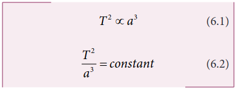

where, T is the time period of revolution for a planet and _a_ is the semi-major axis. Physically this law implies that as the distance of the planet from the Sun increases, the time period also increases but not at the same rate.

In Table 6.1, the time period of revolution of planets around the Sun along with their semi-major axes are given. From column four, we can realize

that _T a_ 2 3 is nearly a constant endorsing Kepler’s third law.

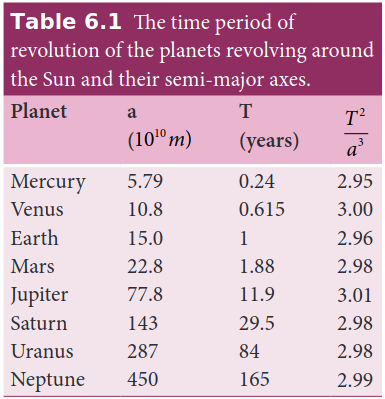

**Points to Contemplate**
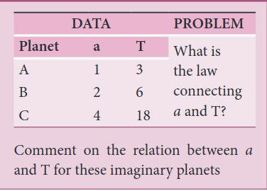

## 6.1.2 Universal Law of Gravitation
Even though Kepler’s laws were able to explain the planetary motion, they failed to explain the forces responsible for it. It was Isaac Newton who analyzed Kepler’s laws, Galileo’s observations and deduced the law of gravitation.

Newton’s law of gravitation states that a particle of mass _M_1 attracts any other particle of mass _M_2 in the universe with an attractive force. The strength of this force of attraction was found to be directly proportional to the product of their masses and is inversely proportional to the square of the distance between them. In mathematical form, it can be written as:

where _r_ is the unit vector from _M_1 towards _M_2 as shown in Figure 6.3, and G is the Gravitational constant that has the value of 6 67 10 11 2 2. × − −_N m kg_ , and _r_ is the distance between the two masses _M_1 and _M_2\. In Figure 6.3, the vector  _F_ denotes the gravitational force experienced by _M_2 due to _M_1\. Here the negative sign indicates that the gravitational force is always attractive in nature and the direction of the force is along the line joining the two masses.

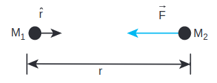\
**Figure 6.3** 
Attraction of two masses towards each other.

In cartesian coordinates, the square of the distance is expressed as _r x_2 2= ( + _y z_2 2 . This is dealt in unit 2.

**EXAMPLE 6.1**
Consider two point masses m1 and m2

which are separated by a distance of 10 meter as shown in the following figure. Calculate the force of attraction between them and draw the directions of forces on each of them. Take m1= 1 kg and m2 = 2 kg

**_Solution_**

The force of attraction is given by

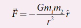

From the figure, r =10 m.

First, we can calculate the magnitude of the force

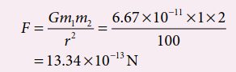

It is to be noted that this force is very small. This is the reason we do not feel the gravitational force of attraction between each other. The small value of G plays a very crucial role in deciding the strength of the force.
The force of attraction ( _F_21) experienced by the mass m2 due to m1 is in the negative ‘y’ direction ie., _r j_\=− . According to Newton’s third law, the mass m2 also exerts equal and opposite force on m1. So the force of attraction (  _F_12) experienced by m1 due to m2 is in the direction of positive ‘y’ axis ie., _r j_\= .

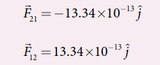

The direction of the force is shown in the figure, 

Gravitational force of attraction between m1 and m2 

_F_12 = − 

_F21 which confirms Newton’s third_ law.

**Important features of gravitational force:** 
As the distance between two masses increases, the strength of the force tends to decrease because of inverse dependence on _r_2\. Physically it implies that the planet Uranus experiences less gravitational force from the Sun than the Earth since Uranus is at larger distance from the Sun compared to the Earth.

**Figure 6.4 Variation of gravitational force with distance** 

The gravitational forces between two particles always constitute an action- reaction pair. It implies that the gravitational force exerted by the Sun on the Earth is always towards the Sun. The reaction-force is exerted by the Earth on the Sun. The direction of this reaction force is towards Earth.

The torque experienced by the Earth due to the gravitational force of the Sun is given by
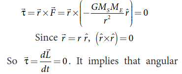

momentum  _L_ is a constant vector. The angular momentum of the Earth about the Sun is constant throughout the motion. It is true for all the planets. In fact, this constancy of angular momentum leads to the Kepler’s second law.

The expression  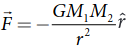  has one inherent assumption that both _M_1 and _M_2 are treated as point masses. When it is said that Earth orbits around the Sun due to Sun’s gravitational force, we assumed Earth and Sun to be point masses. This assumption is a good approximation because the distance between the two bodies is very much larger than their diameters. For some irregular and extended objects separated by a small distance, we cannot directly use the equation (6.3). Instead, we have to invoke separate mathematical treatment which will be brought forth in higher classes.

However, this assumption about point masses holds even for small distance for one special case. To calculate force of attraction between a hollow sphere of mass M with uniform density and point mass m kept outside the hollow sphere, we can replace the hollow sphere of mass M as equivalent to a point mass M located at the center of the hollow sphere. The force of attraction between the hollow sphere of mass M and point mass m can be calculated by treating the  hollow sphere also as another point mass. Essentially the entire mass of the hollow sphere appears to be concentrated at the center of the hollow sphere. It is shown in the Figure 6.5(a).

There is also another interesting result. Consider a hollow sphere of mass M. If we place another object of mass ‘m’ inside this hollow sphere as in Figure 6.5(b), the force experienced by this mass ‘m’ will be zero. This calculation will be dealt with in higher classes.

\
**Figure 6.5** A mass placed in a hollow sphere.

The triumph of the law of gravitation is that it concludes that the mango that is falling down and the Moon orbiting the Earth are due to the same gravitational force.

**Newton’s inverse square Law:** Newton considered the orbits of the planets as circular. For circular orbit of radius r, the centripetal acceleration towards the center is

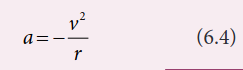

**Figure 6.6** Point mass orbiting in a circular orbit.

Here v is the velocity and r, the distance of the planet from the center of the orbit (Figure 6.6).

The velocity in terms of known quantities r and T, is

Here T is the time period of revolution of the planet. Substituting this value of v in equation (6.4) we get,

Substituting the value of ‘a’ from (6.6) in Newton’s second law, _F ma_\= , where ‘m’ is the mass of the planet.

From Kepler’s third law,

By substituting equation 6.9 in the force expression, we can arrive at the law of gravitation.

Here negative sign implies that the force is attractive and it acts towards the center. In equation (6.10), mass of the planet ‘m’ comes explicitly. But Newton strongly felt that according to his third law, if Earth is attracted by the Sun, then the Sun must also be attracted by the Earth with the same magnitude of force. So he felt that the Sun’s mass (M) should also occur explicitly in the expression for force (6.10). From this insight, he equated the constant 4 2π _k to GM_ which turned out to be the law of gravitation.

Again the negative sign in the above equation implies that the gravitational force is attractive.

In the above discussion we assumed that the orbit of the planet to be circular which is not true as the orbit of the planet around the Sun is elliptical. But this circular orbit assumption is justifiable because planet’s orbit is very close to being circular and there is only a very small deviation from the circular shape.

**EXAMPLE 6.2**

Moon and an apple are accelerated by the same gravitational force due to Earth. Compare the acceleration of the two.

The gravitational force experienced by the apple due to Earth

_F GM M R_

_E A_  2

Here MA– Mass of the apple, ME– Mass of the Earth and R – Radius of the Earth.

Equating the above equation with Newton’s second law,

_M a GM M RA A_

_E A_  2 .

Simplifying the above equation we get,

_a GM RA_

_E_  2

Here _aA_ is the acceleration of apple that is equal to ‘g’.

Similarly the force experienced by Moon due to Earth is given by

**Points to Contemplate**

If Kepler’s third law was “_r_3_T_2 = constant”

instead of “ _r T_

3

2 = constant” what would

be the new law of gravitation? Would it still be an inverse square law? How would the gravitational force change with distance? In this new law of gravitation, will Neptune experience greater gravitational force or lesser gravitational force when compared to the Earth?  

_F GM M R_

_E m_

_m_

  2 .

Here Rm- distance of the Moon from the Earth, Mm – Mass of the Moon

The acceleration experienced by the Moon is given by

_a GM Rm_

_E_

_m_

  2 .

The ratio between the apple’s acceleration to Moon’s acceleration is given by

_a a_

_R R_

_A_

_m_

_m_\= 2

2 .

From the Hipparchrus measurement, the distance to the Moon is 60 times that of Earth radius. Rm = 60R.

aA / am = 60

3600 2

2

_R R_

   .

The apple’s acceleration is 3600 times the acceleration of the Moon.

The same result was obtained by Newton using his gravitational formula. The apple’s acceleration is measured easily and it is 9.8 m s−2. Moon orbits the Earth once in 27.3 days and by using the centripetal acceleration formula, (Refer unit 3).

_a a_

_A_

_m_

\= 9 8

0 00272 3600.

. =

which is exactly what he got through his law of gravitation. 

The above calculation depends on knowing the distance between the Earth and the Moon and the radius of the Earth. The radius of the Earth was measured by Greek librarian Eratosthenes and distance between the Earth and the Moon was measured by Greek astronomer Hipparchrus 2400 years ago. It is very interesting to note that in order to measure these distances he used only high school geometry and trigonometry. These details are discussed in the astronomy section (6.5)

## 6.1.3 Gravitational Constant

In the law of gravitation, the value of gravitational constant G plays a very important role. The value of G explains why the gravitational force between the Earth and the Sun is so great while the same force between two small objects (for example between two human beings) is negligible.

The force experienced by a mass ‘m’ which is on the surface of the Earth (Figure 6.7) is given by

F GM m R_

_E_

_E_

  2 (6.11)

_ME_\-mass of the Earth, m - mass of the object, _RE_\- radius of the Earth.

Equating Newton’s second law, _F mg_\= − , to equation (6.11) we get,

− = −_mg GM m_

_R E_

_E_ 2

_g GM R_

_E_

_E_

\= 2 (6.12)  

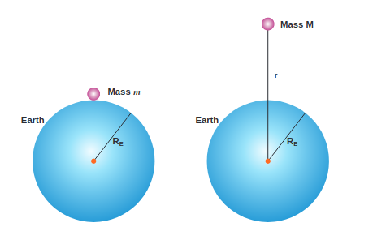
