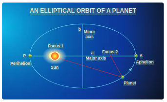
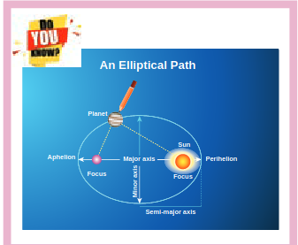
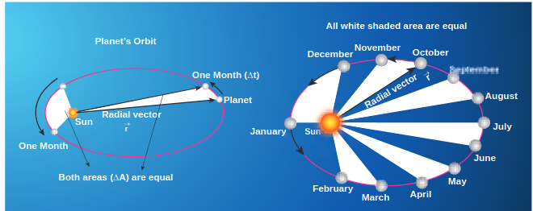
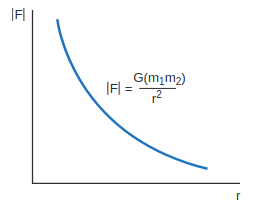
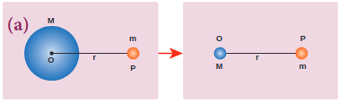
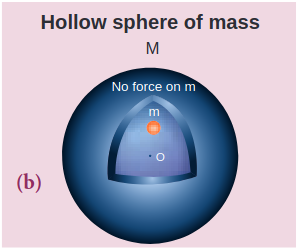
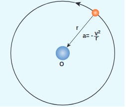

**U N I T 6** 

**GRAVITATION** 

 "The most remarkable discovery in all of astronomy is that the stars are made up of atoms of same kind as those in the Earth" - Richard Feynman

**Learning Objectives**

In this unit, the student is exposed to

- Kepler's laws for planetary motion
- Newton's law of gravitation
- connection between Kepler's laws and law of gravitation
- calculation of gravitational field and potential
- calculation of variation of acceleration due to gravity
- calculation of escape speed and energy of satellites
- concept of weightlessness
- advantage of heliocentric system over geocentric system
- measurement of the radius of Earth using Eratosthenes method
- recent developments in gravitation and astrophysics

**6.1 INTRODUCTION**

We are amazed looking at the glittering sky; we wonder how the Sun rises in the East and sets in the West, why there are comets or why stars twinkle. The sky has been an object of curiosity for human beings from time immemorial. We have always wondered about the motion of stars, the Moon, and the planets. From Aristotle to Stephen Hawking, great minds have tried to understand the movement of celestial objects in space and what causes their motion.

The ‘Theory of Gravitation’ was developed by Newton in the late 17th century to explain the motion of celestial objects and terrestrial objects and answer most of the queries raised. In spite of the study of gravitation and its effect on celestial objects, spanning last three centuries, “gravitation” is still one of the active areas of research in physics today. In 2017, the Nobel Prize in Physics was given for the detection of ‘Gravitational waves’ which was theoretically predicted by Albert Einstein in the year 1915. Understanding planetary motion, the formation of stars and galaxies, and recently massive objects like black holes and their life cycle have remained the focus of study for the past few centuries in physics.

**Geocentric Model of Solar System** In the second century, Claudius Ptolemy, a famous Greco-Roman astronomer, developed a theory to explain the motion of celestial objects like the Sun, the Moon, Mars, Jupiter etc. This theory was called the geocentric model. According to the geocentric model, the Earth is at the center of the universe and all celestial objects including the Sun, the Moon, and other planets orbit the Earth. Ptolemy’s model closely matched with the observations of the sky with our naked eye. But later, astronomers found that even though Ptolemy’s model successfully explained the motion of the Sun and the Moon up to a certain level, the motion of Mars and Jupiter could not be explained effectively.

**Heliocentric Model of Nicholas Copernicus** In the 15th century, a Polish astronomer, Nicholas Copernicus (1473-1543) proposed a new model called the ‘Heliocentric model’ in which the Sun was considered to be at the center of the solar system and all planets including the Earth orbited the Sun in circular orbits. This model successfully explained the motion of all celestial objects.

Around the same time, Galileo, a famous Italian physicist discovered that all objects close to Earth were accelerated towards the Earth at the same rate. Meanwhile, a noble man called Tycho Brahe (1546-1601) spent his entire lifetime in recording the observations of the stellar and planetary positions with his naked eye. The data that he compiled were analyzed later by his assistant Johannes Kepler (1571–1630) and eventually the analysis led to the deduction of the laws of the planetary motion. These laws are termed as ‘Kepler’s laws of planetary motion’.  

**6.1.2 Kepler’s Laws of Planetary Motion**

Kepler’s laws are stated as follows:

1\. **Law of orbits:** Each planet moves around the Sun in an elliptical orbit with the Sun at one of the foci.

.\
**Figure 6.1** An ellipse traced out by a planet around the Sun.

The closest point of approach of the planet to the Sun ‘P’ is called perihelion and the farthest point ‘A’ is called aphelion (Figure 6.1). The semi-major axis is ‘a’ and semi-minor axis is ‘b’. In fact, both Copernicus and Ptolemy considered planetary orbits to be circular, but Kepler discovered that the actual orbits of the planets are elliptical.

.\
**Figure 6.2** Motion of a planet around the Sun depicting ‘law of area’.

2\. **Law of area:**

The radial vector (line joining the Sun to a planet) sweeps equal areas in equal intervals of time.

In Figure 6.2, the white shaded portion is the area DA swept in a small interval of time Dt, by a planet around the Sun. Since the Sun is not at the center of the ellipse, the planets travel faster when they are nearer to the Sun and slower when they are farther from it, to cover equal area in equal intervals of time. Kepler discovered the law of area by carefully noting the variation in the speed of planets.

3\. **Law of period:**

The square of the time period of revolution of a planet around the Sun in its elliptical orbit is directly proportional to the cube of the semi-major axis of the ellipse. It can be written as:

\begin{gathered}
T^{2} \propto a^{3} \\
\frac{T^{2}}{a^{3}}=\text { constant }
\end{gathered}

where, \mathrm{T} is the time period of revolution for a planet and a is the semi-major axis. Physically this law implies that as the distance of the planet from the Sun increases, the time period also increases but not at the same rate.

In Table 6.1, the time period of revolution of planets around the Sun along with their semi-major axes are given. From column four, we can realize that \frac{T^{2}}{a^{3}} is nearly a constant endorsing Kepler's third law.

Table 6.1 The time period of revolution of the planets revolving around the Sun and their semi-major axes.

| Planet | a | T | T^{2} |
| :--- | :--- | :--- | :---: |
|  | \left(10^{10} \mathrm{~m}\right) | (years) | \frac{T^{3}}{a^{3}} |
| Mercury | 5.79 | 0.24 | 2.95 |
| Venus | 10.8 | 0.615 | 3.00 |
| Earth | 15.0 | 1 | 2.96 |
| Mars | 22.8 | 1.88 | 2.98 |
| Jupiter | 77.8 | 11.9 | 3.01 |
| Saturn | 143 | 29.5 | 2.98 |
| Uranus | 287 | 84 | 2.98 |
| Neptune | 450 | 165 | 2.99 |

| Points to Contemplate |  |  |  |  |
| :--- | :---: | :---: | :--- | :---: |
| DATA | PROBLEM |  |  |  |
| Planet | a | T | What is |  |
| A | 1 | 3 | the law |  |
| B | 2 | 6 | connecting |  |
| C | 4 | 18 | a and T? |  |
| Comment on the relation between a |  |  |  |  |
| and T for these imaginary planets |  |  |  |  |

**EXAMPLE 6.1**

Consider two point masses \mathrm{m}_{1} and \mathrm{m}_{2} which are separated by a distance of 10 meter as shown in the following figure. Calculate the force of attraction between them and draw the directions of forces on each of them. Take m_{1}=1 \mathrm{~kg} and \mathrm{m}_{2}=2 \mathrm{~kg}

**Solution**

The force of attraction is given by


\vec{F}=-\frac{G m_{1} m_{2}}{r^{2}} \hat{r}


From the figure, r=10 \mathrm{~m}.

First, we can calculate the magnitude of the force


\begin{aligned}
F & =\frac{G m_{1} m_{2}}{r^{2}}=\frac{6.67 \times 10^{-11} \times 1 \times 2}{100} \\
& =13.34 \times 10^{-13} \mathrm{~N}
\end{aligned}


It is to be noted that this force is very small. This is the reason we do not feel the gravitational force of attraction between each other. The small value of G plays a very crucial role in deciding the strength of the force.

The force of attraction \left(\vec{F}_{21}\right) experienced by the mass m_{2} due to m_{1} is in the negative ' y ' direction ie., \hat{r}=-\hat{j}. According to Newton's third law, the mass \mathrm{m}_{2} also exerts equal and opposite force on \mathrm{m}_{1}. So the force of attraction \left(\vec{F}_{12}\right) experienced by \mathrm{m}_{1} due to \mathrm{m}_{2} is in the direction of positive ' \mathrm{y} ' axis ie., \hat{r}=\hat{j}.


\begin{aligned}
& \vec{F}_{21}=-13.34 \times 10^{-13} \hat{j} \\
& \vec{F}_{12}=13.34 \times 10^{-13} \hat{j}
\end{aligned}


The direction of the force is shown in the figure,

Gravitational force of attraction between \mathrm{m}_{1} and \mathrm{m}_{2}

\vec{F}_{12}=-\vec{F}_{21} which confirms Newton's third law.

**Important features of gravitational force:**

- As the distance between two masses increases, the strength of the force tends to decrease because of inverse dependence on r^{2}. Physically it implies that the planet Uranus experiences less gravitational force from the Sun than the Earth since Uranus is at larger distance from the Sun compared to the Earth.

**Figure 6.4 Variation of gravitational force with distance** 

- The gravitational forces between two particles always constitute an actionreaction pair. It implies that the gravitational force exerted by the Sun on the Earth is always towards the Sun. The reaction-force is exerted by the Earth on the Sun. The direction of this reaction force is towards Earth.
- The torque experienced by the Earth due to the gravitational force of the Sun is given by


\begin{gathered}
\vec{\tau}=\vec{r} \times \vec{F}=\vec{r} \times\left(-\frac{G M_{S} M_{E}}{r^{2}} \hat{r}\right)=0 \\
\text { Since } \vec{r}=r \hat{r},(\hat{r} \times \hat{r})=0
\end{gathered}

So \vec{\tau}=\frac{d \vec{L}}{d t}=0. It implies that angular momentum \vec{L} is a constant vector. The angular momentum of the Earth about the Sun is constant throughout the motion. It is true for all the planets. In fact, this constancy of angular momentum leads to the Kepler's second law.

- The expression \vec{F}=-\frac{G M_{1} M_{2}}{r^{2}} \hat{r} has one inherent assumption that both M_{1} and M_{2} are treated as point masses. When it is said that Earth orbits around the Sun due to Sun's gravitational force, we assumed Earth and Sun to be point masses. This assumption is a good approximation because the distance between the two bodies is very much larger than their diameters. For some irregular and extended objects separated by a small distance, we cannot directly use the equation (6.3). Instead, we have to invoke separate mathematical treatment which will be brought forth in higher classes.
- However, this assumption about point masses holds even for small distance for one special case. To calculate force of attraction between a hollow sphere of mass M with uniform density and point mass m kept outside the hollow sphere, we can replace the hollow sphere of mass M as equivalent to a point mass M located at the center of the hollow sphere. The force of attraction between the hollow sphere of mass M and point mass \mathrm{m} can be calculated by treating the hollow sphere also as another point mass. Essentially the entire mass of the hollow sphere appears to be concentrated at the center of the hollow sphere. It is shown in the Figure 6.5(a).

- There is also another interesting result. Consider a hollow sphere of mass M. If we place another object of mass ' \mathrm{m} ' inside this hollow sphere as in Figure 6.5(b), the force experienced by this mass ' \mathrm{m} ' will be zero. This calculation will be dealt with in higher classes.

However, this assumption about point masses holds even for small distance for one special case. To calculate force of attraction between a hollow sphere of mass M with uniform density and point mass m kept outside the hollow sphere, we can replace the hollow sphere of mass M as equivalent to a point mass M located at the center of the hollow sphere. The force of attraction between the hollow sphere of mass M and point mass m can be calculated by treating the  hollow sphere also as another point mass. Essentially the entire mass of the hollow sphere appears to be concentrated at the center of the hollow sphere. It is shown in the Figure 6.5(a).

There is also another interesting result. Consider a hollow sphere of mass M. If we place another object of mass ‘m’ inside this hollow sphere as in Figure 6.5(b), the force experienced by this mass ‘m’ will be zero. This calculation will be dealt with in higher classes.

\
**Figure 6.5** A mass placed in a hollow sphere.

- The triumph of the law of gravitation is that it concludes that the mango that is falling down and the Moon orbiting the Earth are due to the same gravitational force.

Newton's inverse square Law:

Newton considered the orbits of the planets as circular. For circular orbit of radius r, the centripetal acceleration towards the center is


a=-\frac{v^{2}}{r}


**Figure 6.6** Point mass orbiting in a circular orbit.

Here \mathrm{v} is the velocity and \mathrm{r}, the distance of the planet from the center of the orbit (Figure 6.6).

The velocity in terms of known quantities \mathrm{r} and \mathrm{T}, is


v=\frac{2 \pi r}{T}


Here \mathrm{T} is the time period of revolution of the planet. Substituting this value of \mathrm{v} in equation (6.4) we get,


a=-\frac{\left(\frac{2 \pi r}{T}\right)^{2}}{r}=-\frac{4 \pi^{2} r}{T^{2}}


Substituting the value of 'a' from (6.6) in Newton's second law, F=m a, where ' m ' is the mass of the planet.


F=-\frac{4 \pi^{2} m r}{T^{2}}


From Kepler's third law,


\frac{r^{3}}{T^{2}}=k(\text { constant })



\frac{r}{T^{2}}=\frac{k}{r^{2}}


By substituting equation 6.9 in the force expression, we can arrive at the law of gravitation.


F=-\frac{4 \pi^{2} m k}{r^{2}}


Here negative sign implies that the force is attractive and it acts towards the center. In equation (6.10), mass of the planet ' \mathrm{m} ' comes explicitly. But Newton strongly felt that according to his third law, if Earth is attracted by the Sun, then the Sun must also be attracted by the Earth with the same magnitude of force. So he felt that the Sun's mass (M) should also occur explicitly in the expression for force (6.10). From this insight, he equated the constant 4 \pi^{2} k to GM which turned out tobethelaw of gravitation.


F=-\frac{G M m}{r^{2}}


Again the negative sign in the above equation implies that the gravitational force is attractive.

In the above discussion we assumed that the orbit of the planet to be circular which is not true as the orbit of the planet around the Sun is elliptical. But this circular orbit assumption is justifiable because planet's orbit is very close to being circular and there is only a very small deviation from the circular shape.

**Points to Contemplate**

If Kepler's third law was " r^{3} T^{2}= constant" instead of " \frac{r^{3}}{T^{2}}= constant" what would be the new law of gravitation? Would it still be an inverse square law? How would the gravitational force change with distance? In this new law of gravitation, will Neptune experience greater gravitational force or lesser gravitational force when compared to the Earth?

**EXAMPLE 6.2**

Moon and an apple are accelerated by the same gravitational force due to Earth. Compare the acceleration of the two.

The gravitational force experienced by the apple due to Earth

F=-\frac{G M_{E} M_{A}}{R^{2}}


Here M_{A} - Mass of the apple, M_{E}- Mass of the Earth and R - Radius of the Earth.

Equating the above equation with Newton's second law,


M_{A} a_{A}=-\frac{G M_{E} M_{A}}{R^{2}}


Simplifying the above equation we get,


a_{A}=-\frac{G M_{E}}{R^{2}}


Here a_{A} is the acceleration of apple that is equal to ' g '.

Similarly the force experienced by Moon due to Earth is given by


F=-\frac{G M_{E} M_{m}}{R_{m}^{2}}


Here \mathrm{R}_{\mathrm{m}} - distance of the Moon from the Earth, \mathrm{M}_{\mathrm{m}} - Mass of the Moon

The acceleration experienced by the Moon is given by


a_{m}=-\frac{G M_{E}}{R_{m}^{2}}


The ratio between the apple's acceleration to Moon's acceleration is given by


\frac{a_{A}}{a_{m}}=\frac{R_{m}^{2}}{R^{2}}


From the Hipparchrus measurement, the distance to the Moon is 60 times that of Earth radius. \mathrm{R}_{\mathrm{m}}=60 \mathrm{R}.


\mathrm{a}_{\mathrm{A}} / \mathrm{a}_{\mathrm{m}}=\frac{(60 R)^{2}}{R^{2}}=3600 .


The apple's acceleration is 3600 times the acceleration of the Moon.

The same result was obtained by Newton using his gravitational formula. The apple's acceleration is measured easily and it is 9.8 \mathrm{~m} \mathrm{~s}^{-2}. Moon orbits the Earth once in 27.3 days and by using the centripetal acceleration formula, (Refer unit 3).


\frac{a_{A}}{a_{m}}=\frac{9.8}{0.00272}=3600


which is exactly what he got through his law of gravitation.

**Note**
The above calculation depends on knowing the distance between the Earth and the Moon and the radius of the Earth. The radius of the Earth was measured by Greek librarian Eratosthenes and distance between the Earth and the Moon was measured by Greek astronomer Hipparchrus 2400 years ago. It is very interesting to note that in order to measure these distances he used only high school geometry and trigonometry. These details are discussed in the astronomy section (6.5)

***6.1.3 Gravitational Constant***

In the law of gravitation, the value of gravitational constant G plays a very important role. The value of \mathrm{G} explains why the gravitational force between the Earth and the Sun is so great while the same force between two small objects (for example between two human beings) is negligible.

The force experienced by a mass ' m ' which is on the surface of the Earth (Figure 6.7) is given by


F=-\frac{G M_{E} m}{R_{E}^{2}}


M_{E}-mass of the Earth, \mathrm{m} - mass of the object, R_{E} - radius of the Earth.

Equating Newton's second law, F=-m g, to equation (6.11) we get,


\begin{aligned}
-m g & =-\frac{G M_{E} m}{R_{E}^{2}} \\
g & =\frac{G M_{E}}{R_{E}^{2}}
\end{aligned}

Figure 6.7 Force experienced by a mass on the (i) surface of the Earth (ii) at a distance from the centre of the Earth

Now the force experienced by some other object of mass M at a distance r from the center of the Earth is given by,


F=-\frac{G M_{E} M}{r^{2}}


Using the value of g in equation (6.12), the force \mathrm{F} will be,


F=-g M \frac{R_{E}^{2}}{r^{2}}


From this it is clear that the force can be calculated simply by knowing the value of g. It is to be noted that in the above calculation \mathrm{G} is not required.

In the year 1798, Henry Cavendish experimentally determined the value of gravitational constant ' G ' by using a torsion balance. He calculated the value of ' G ' to be equal to 6.75 \times 10^{-11} \mathrm{~N} \mathrm{~m}^{2} \mathrm{~kg}^{-2}. Using modern techniques a more accurate value of \mathrm{G} could be measured. The currently accepted value of G is 6.67259 \times 10^{-11} \mathrm{~N} \mathrm{~m}^{2} \mathrm{~kg}^{-2}.
