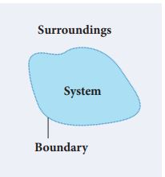
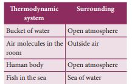
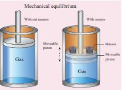

# THERMODYNAMICS:

## Introduction

In the previous sections we have studied about the heat, temperature and thermal properties of matter. Thermodynamics is
a branch of physics which describes the laws governing the process of conversion of work into heat and conversion of heat into work. The laws of thermodynamics are formulated over three centuries of experimental works of Boyle, Charles, Bernoulli, Joule, Clausius, Kelvin, Carnot and Helmholtz. In our day to day life, the functioning of everything around us and even our body is governed by the laws of thermodynamics. Therefore thermodynamics is one of the essential branches of physics.

**Thermodynamic system:** A thermodynamic system is a finite part of the universe. It is a collection of large number of particles (atoms and molecules) specified by certain parameters called pressure (P), Volume (V) and Temperature (T). The remaining part of the universe is called surrounding. Both are separated by a boundary. It is shown in Figure 8.15

<!--  -->

**Figure 8.15 Thermodynamic system**

Examples: A thermodynamic system can be liquid, solid, gas and radiation.

<!--  -->

We can classify thermodynamics system into three types: It is given in Figure 8.16

<!--  -->

**Figure 8.16 ** Different types of thermodynamic systems

## Thermal equilibrium

When a hot cup of coffee is kept in the room, heat flows from coffee to the surrounding air. After some time the coffee reaches the same temperature as the surrounding air and there will be no net heat flow from coffee to air or air to coffee. It implies that the coffee and surrounding air are in thermal equilibrium with each other.

Two systems are said to be in thermal equilibrium with each other if they are at the same temperature, which will not change with time.

**Mechanical equilibrium:** 
Consider a gas container with piston as shown in Figure 8.17. When some mass is placed on the piston, it will move downward due to downward gravitational force and after certain humps and jumps the piston will come to rest at a new position. When the downward gravitational force given by the piston is balanced by the upward force exerted by the gas, the system is said to be in mechanical equilibrium. A system is said to be in mechanical equilibrium if no unbalanced force acts on the thermo dynamic system or on the surrounding by thermodynamic system.

<!--  -->

**Figure 8.17** Mechanical equilibrium

**Chemical equilibrium:** If there is no net chemical reaction between two thermodynamic systems in contact with each other then it is said to be in chemical equilibrium.

**Thermodynamic equilibrium:** If two systems are set to be in thermodynamic equilibrium, then the systems are at thermal, mechanical and chemical equilibrium with  

each other. In a state of thermodynamic equilibrium the macroscopic variables such as pressure, volume and temperature will have fixed values and do not change with time.

## Thermodynamic state variables

In mechanics velocity, momentum and acceleration are used to explain the state of any moving object (which you would have realized in Volume 1). In thermodynamics, the state of a thermodynamic system is represented by a set of variables called thermodynamic variables. Examples: Pressure, temperature, volume and internal energy etc. The values of these variables completely describe the equilibrium state of a thermodynamic system. Heat and work are not state variables rather they are process variables. There are two types of thermodynamic variables: Extensive and Intensive Extensive variable depends on the size or mass of the system. 

**Example:** 
Volume, total mass, entropy, internal energy, heat capacity etc. Intensive variables do not depend on the size or mass of the system. 
**Example:** Temperature, pressure, specific heat capacity, density etc.

**Equation of state:** 
The equation which connects the state variables in a specific manner is called equation of state. A thermodynamic equilibrium is completely specified by these state variables by the equation of state. If the system is not in thermodynamic equilibrium then these equations cannot specify the state of the system.

