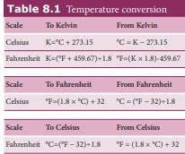
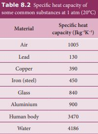
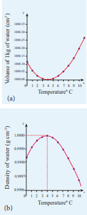
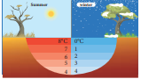

  

<!-- **8.1** -->

<!-- **Learning Objectives**

**In this unit, a student is exposed to** 
• meaning of heat, work and temperature • ideal gas laws • concept of specific heat capacity • thermal expansion of solids, liquids and gases • various states of matter • Newton’s law of cooling • Stefan’s law and Wien’s law • meaning of thermodynamic equilibrium • meaning of internal energy • zeroth and first laws of thermodynamics • various thermodynamic processes • work done in various thermodynamic processe • second law of thermodynamics • working of carnot engine and refrigerator -->

**8.1**
**HEAT AND TEMPERATURE**

## Introduction  
<!-- ## 8.1.1 Introduction -->

Temperature and heat play very important role in everyday life. All species can function properly only if its body is maintained at a particular temperature. In fact life on Earth is possible because the Sun maintains its temperature. Understanding the meaning of temperature and heat are very crucial to understand the nature. Thermodynamics is a branch of physics which explains the phenomena of temperature, heat etc. The concepts presented in this chapter will help us to understand the terms ‘hot’ and ‘cold’ and also differentiate heat from temperature. In thermodynamics, heat and temperature are two different but closely related parameters.

<!-- _Classical thermodynamics…. is the only physical t_  

s

ND THERMODYNAMICS

_heory of universal content which I am convinced… will never be overthrown. –_ Albert Einstein -->

<!-- is a branch of physics which explains the phenomena of temperature, heat etc. The concepts presented in this chapter will help us to understand the terms ‘hot’ and ‘cold’ and also differentiate heat from temperature. In thermodynamics, heat and temperature are two different but closely related parameters. -->

## Meaning of heat 
<!-- ## Meaning of heat -->

When an object at higher temperature is placed in contact with another object at lower temperature, there will be a spontaneous flow of energy from the object at higher temperature to the one at lower temperature. This energy is called heat. This process of energy transfer from higher temperature object to lower temperature object is called heating. Due to flow of heat sometimes the temperature of the body will increase or sometimes it may not increase.

There is a misconception that heat is a quantity of energy. People often talk ‘this

water has more heat or less heat’. These words are meaningless. Heat is not a quantity. Heat is an energy in transit which flows from higher temperature object to lower temperature object. Once the heating process is stopped we cannot use the word heat. When we use the word ‘heat’, it is the energy in transit but not energy stored in the body.
<blockquote style="background-color: pink; padding:10px; border-radius:5px;">
<!--  -->

**Note**
There is a misconception that heat is a quanity of energy. People oftens talk 'this water has more heat or less heat'. These words are meaningless. Heat is not a quanity. Heat is an energy in transit which flows from higher temperature object to lower temperature object.Once the heating process is stopped we cannot use the word heat. when we use the word 'heat', it is the energy in transit but not energy stored in the body.</blockquote>

**E X A M P L E  8.1** 
a. ‘A lake has more rain’. b. ‘A hot cup of coffee has more heat’.

What is wrong in these two statements?

**_Solution_**
a. When it rains, lake receives water

from the cloud. Once the rain stops, the lake will have more water than before raining. Here ‘raining’ is a process which brings water from the cloud. Rain is not a quantity rather it is water in transit. So the statement ‘lake has more rain’ is wrong, instead the ‘lake has more water’ will be appropriate.  

b. When heated, a cup of coffee receives heat from the stove. Once the coffee is taken from the stove, the cup of coffee has more internal energy than before. ‘Heat’ is the energy in transit and which flows from an object at higher temperature to an object at lower temperature. Heat is not a quantity. So the statement ‘A hot cup of coffee has more heat’ is wrong, instead ‘coffee is hot’ will be appropriate.

## Meaning of work

When you rub your hands against each other the temperature of the hands increases. You have done some work on your hands by rubbing. The temperature of the hands increases due to this work. Now if you place your hands on the chin, the temperature of the chin increases. This is because the hands are at higher temperature than the chin. In the above example, the temperature of hands is increased due to work and temperature of the chin is increased due to heat transfer from the hands to the chin. It is shown in the Figure 8.1

By doing work on the system, the temperature in the system will increase and sometimes may not. Like heat, work is also

Figure 8.1 Difference between work and heat

<!-- **A person rubbing his hands**

**Keeping the hands on chin** -->

  

not a quantity and through the work energy is transferred to the system . So we cannot use the word ‘the object contains more work’ or ‘less work’.

Either the system can transfer energy to the surrounding by doing work on surrounding or the surrounding may transfer energy to the system by doing work on the system. For the transfer of energy from one body to another body through the process of work, they need not be at different temperatures.

## Meaning of temperature
<!-- ## Meaning of temperature -->

Temperature is the degree of hotness or coolness of a body. Hotter the body higher is its temperature. The temperature will determine the direction of heat flow when two bodies are in thermal contact.

The SI unit of temperature is kelvin (K).

In our day to day applications, **_Celsius_** (˚C) and **_Fahrenheit_** (°F) scales are used.

Temperature is measured with a thermometer. The conversion of temperature from one scale to other scale is given in Table 8.1
<!--  -->

**Table 8.1** Temperature conversion Scale To Kelvin From Kelvin

<!-- Celsius K=°C + 273.15 °C = K − 273.15

Fahrenheit K=(°F + 459.67)÷1.8 °F=(K × 1.8)-459.67

Scale To Fahrenheit From Fahrenheit

Celsius °F=(1.8 × °C) + 32 °C = (°F − 32)÷1.8

Scale To Celsius From Celsius

Fahrenheit °C=(°F − 32)÷1.8 °F = (1.8 × °C) + 32   -->

<!-- **8.2** -->
# THERMAL PROPERTIES OF MATTER
<!-- # THERMAL PROPERTIES OF MATTER -->

<!-- ## 8.2.1 Boyle’s law, Charles’ law and ideal gas law -->
## Boyle’s law, Charles’ law and ideal gas law

For a given gas at low pressure (density) kept in a container of volume V, experiments revealed the following information.

� When the gas is kept at constant temperature, the pressure of the gas is inversely proportional to the volume.

_P V_

µ 1 . It was discovered by Robert Boyle

(1627-1691) and is known as Boyle’s law. � When the gas is kept at constant

pressure, the volume of the gas is directly proportional to absolute temperature. _V T_µ . It was discovered by Jacques Charles (1743-1823) and is known as Charles’ law.

� By combining these two equations we have

_PV_ = _CT._ Here C is a positive constant. We can infer that C is proportional to the number of particles in the gas container by considering the following argument. If we take two containers of same type of gas with same volume V, same pressure P and same temperature T, then the gas in each container obeys the above equation. _PV_ = _CT._ If the two containers of gas is considered as a single system, then the pressure and temperature of this combined system will be same but volume will be twice and number of particles will also be double as shown in Figure 8.2

<!--  -->

  

For this combined system, V becomes 2V, so C should also double to match with the ideal gas equation $ \frac{P(2V)}{T} = 2C $. It implies that C must depend on the number of particles in the gas and also should have the dimension of \[\begin{bmatrix}
\frac{PV}{T}  \end{bmatrix} = -JK_1
\]   So we can write the constant C as k times the number of particles N. 
Here k is the Boltzmann constant (1.381×10−23 JK−1) and it is found to be a universal constant. So the ideal gas law can be stated as follows

_PV_ \= _NkT_ (8.1)

The equation (8.1) can also be expressed in terms of mole.

_Mole is the practical unit to express the amount of gas. One mole of any substance is the amount of that substance which contains Avogadro number (NA) of particles (such as atoms or molecules). The Avogadro’s number NA is defined as the number of carbon atoms contained in exactly 12 g of 12C ._

Suppose if a gas contains μ mole of particles then the total number of particles can be written as

<!-- **Figure 8.2** Ideal gas law -->

<!-- **P,V,T,N P,V,T,N**

**Two Separate systems**  

_N_ \= μ _N_A (8.2) -->
N = μ NA

where NA is Avogadro number (6.023 × 1023 mol-1)

Substituting for N from equation (8.2), the equation (8.1) becomes 
_PV = μ NA kT_. Here   _NAk =R_ called universal gas constant and its value is 8.314 J /mol. K. So the ideal gas law can be written for μ mole of gas as\[ PV = \mu RT \]

This is called the equation of state for an ideal gas. It relates the pressure, volume and temperature of thermodynamic system at equilibrium.

**E X A M P L E  8.2**

A student comes to school by a bicycle whose tire is filled with air at a pressure 240 kPa at 27°C. She travels 8 km to reach the school and the temperature of the bicycle tire increases to 39°C. What is the change in pressure in the tire when the student reaches school?

<!-- **P,2V,T,2N**

**Single system** -->

  

<!-- _N PV kT_

\= = × × × × ×

−

− −

1 01 10 5 5 10

1 38 10 310

5 3

23 1

. .

.

Pa

JK K -->

<!--  -->

**_Solution_**

We can take air molecules in the tire as an ideal gas. The number of molecules and the volume of tire remain constant. So the air molecules at 27°C satisfies the ideal gas equation \( nP_1V_1 = NkT_1 \) and at 39°C it satisfies \( nP_2V_2 = NkT_2 \) 

But we know

V₁ = V₂ = V

PV = NkT _\[
\frac{P_1V}{P_2V} = \frac{NkT}{NkT}  \]_
\[\frac{P_1}{P_2} =\frac{T_1}{T_2} \]
\[
  P_2 = \frac{T_1}{T_2}P_1
\]
\[
  P_2 = \frac{312K}{300K}*240*10  Pa={249.6} kPa
\]
<!-- 103 -->

**EXAMPLE 8.3**

When a person breaths, his lungs can hold up to 5.5 Litre of air at body temperature 37°C and atmospheric pressure (1 atm =101 kPa). This Air contains 21% oxygen. Calculate the number of oxygen molecules in the lungs.  

<!-- **_V_ \= 5.5 L**

**_P_ = 101 kPa _T_ = 310 K** -->
<!--  -->

**_Solution_**

We can treat the air inside the lungs as an ideal gas. To find the number of molecules, we can use the ideal gas law.

_PV_ = _NkT_

Here volume is given in the Litre. 1 Litre is volume occupied by a cube of side 10 cm. 1Litre \= 10cm × 10cm × 10cm \= 10–3 m3

<!-- _N PV kT_ -->

<!-- \= = × × × × ×

\= × −

− −

1 01 10 5 5 10

1 38 10 310 1 29 10

5 3 3

23 1

23\. .

. .

Pa m

JK K

\= ×1 29 10

3

23 .

m Molecules -->

\[
N =\frac{PV}{kT} = \frac{1.01 \times 10^5 Pa\times 5.5\times 10^{-23}\times m^{3}}{1.38 \times 10^{-23} JK^{-23}\times 310K}
\]

Only 21% of N are oxygen. The total number of oxygen molecules
\(1.29 \times 10^{23} \times \frac{21}{100}\)

<!-- \= 1.29 × 1023 × 21 100 -->

Number of oxygen molecules = 2.7 × 1022 molecules

**EXAMPLE 8.4**

Calculate the volume of one mole of any gas at STP and at room temperature (300K) with the same pressure 1 atm.

  

**_Solution:_**

Here STP means standard temperature (T=273K or 0°C) and Pressure (P=1 atm or 101.3 kPa)

We can use ideal gas equation \[
\frac{\mu{RT}}{P} = V
\]

Here µ = 1 mol and R =8.314 J/mol.K.

By substituting the values

\=22.4 × 10–3 m3

We know that 1 Litre (L) = =10–3m3. So we can conclude that 1 mole of any ideal gas has volume 22.4 L.

By multiplying 22.4L by \[
\frac{300K}{273K}
\]

we get

the volume of one mole of gas at room temperature. It is 24.6 L.

**EXAMPLE 8.5**

Estimate the mass of air in your class room at NTP. Here NTP implies normal temperature (room temperature) and 1 atmospheric pressure.

<!--  -->

**_Solution_**

The average size of a class is 6m length, 5 m breadth and 4 m height. The volume of the room \[V = 6 × 5 × 4 = 120\text{m}^{-3}\]. We can  

determine the number of mole. At room temperature 300K, the volume of a gas occupied by any gas is equal to 24.6L.

The number of mole \[
\mu = \frac{120}{24} \times 10^{-3} \, \text{m}^{-3}=4878 mol
\]

Air is the mixture of about 20% oxygen, 79% nitrogen and remaining one percent are argon, hydrogen, helium, and xenon. The molar mass of air is \[29 gmol^{-1}\]. So the total mass of air in the room \[ m = 4878 \times 29 \times 10^{-3} = 141.4 \, \text{kg} \]

<!-- ## Heat capacity and specific heat capacity -->
## Heat capacity and specific heat capacity

Take equal amount of water and oil at temperature 27°C and heat both of them till they reach the temperature 50°C. Note down the time taken by the water and oil to reach the temperature 50°C. Obviously these times are not same. We can see that water takes more time to reach 50°C than oil. It implies that water requires more heat energy to raise its temperature than oil. Now take twice the amount of water at 27°C and heat it up to 50°C , note the time taken for this rise in temperature. The time taken by the water is now twice compared to the previous case.

We can define ‘heat capacity’ as the amount of heat energy required to raise the temperature of the given body from T to T + ∆T .

Heat capacity \[ S =
\frac{\Delta Q}{\Delta T}
\]

_Specific heat capacity of a substance is defined as the amount of heat energy required to raise the temperature of 1kg of a substance by 1 Kelvin or 1°C_

  

∆Q = m s∆T

Therefore,

\[ S =\frac{1}{m}[\frac{\Delta Q}{\Delta T}]
\]

Where s is known as specific heat capacity of a substance and its value depends only on the nature of the substance not amount of substance

ΔQ = Amount of heat energy

ΔT = Change in temperature

m = Mass of the substance

The SI unit for specific heat capacity is \(J \, \text{kg}^{-1} \, \text{K}^{-1}\). Heat capacity and specific heat capacity are always positive quantities.
<!--  -->

<!-- **Table 8.2 Specific heat capacity of** some common substances at 1 atm (20°C) -->

<!-- Material Specific heat

capacity (Jkg−lK−1)

Air 1005

Lead 130

Copper 390

Iron (steel) 450

Glass 840

Aluminium 900

Human body 3470

Water 4186 -->

From the table 8.2 it is clear that water has the highest value of specific heat capacity. For this reason it is used as a coolant in power stations and reactors.  

The term heat capacity or specific heat capacity does not mean that object

contains a certain amount of heat. Heat is energy transfer from the object at higher temperature to the object at lower temperature. The correct usage is ‘internal energy capacity’. But for historical reason the term ‘heat capacity’ or ‘specific heat capacity’ are retained.
<blockquote style="background-color:pink; padding:10px; border-radius:5px;">
**Note**
the term heat capacity or specific heat capacity does not mean that object contains a certain amount of heat.Heat is energy transfer from the object oat highe temperature to the object at lower temperature. The correct usage is 'internal enegy capacity'.But for historical reason the term heat capacity or specific heat capacity is retained.
</blockquote>
When two objects of same mass are _heated_ at equal rates, the object with smaller specific heat

_capacity_ will have a _faster temperature increase._ When two objects of same mass are left to cool down, the temperature of the object with smaller specific heat _capacity_ will _drop faster._

When we study properties of gases, it is more practical to use molar specific heat capacity. Molar specific heat capacity is defined as heat energy required to increase the temperature of one mole of substance by 1K or 1°C. It can be written as follows

<!-- C = 1 µ ∆ ∆



 



 

_Q T_ -->
\[ C =\frac{1}{\mu}[\frac{\Delta Q}{\Delta T}]
\]

Here C is known as molar specific heat _capacity_ of a substance and μ is number of moles in the substance.

The SI unit for molar specific heat capacity is J mol–1 K–1 . It is also a positive quantity.

  

<!-- ## Thermal expansion of solids, liquids and gases -->
## Thermal expansion of solids, liquids and gases

_Thermal expansion is the tendency of matter to change in shape, area, and volume due to a change in temperature._

All three states of matter (solid, liquid and gas) expand when heated. When a solid is heated, its atoms vibrate with higher amplitude about their fixed points. The relative change in the size of solids is small. Railway tracks are given small gaps so that in the summer, the tracks expand and do not buckle. Railroad tracks and bridges have expansion joints to allow them to expand and contract freely with temperature changes. It is shown in Figure 8.3

<!-- 
 -->

**Figure 8.3** Expansion joints for safety  

 

**Liquids**, have less intermolecular forces than solids and hence they expand more than solids. This is the principle behind the mercury thermometers.

In the case of **gas** molecules, the intermolecular forces are almost negligible and hence they expand much more than solids. For example in hot air balloons when gas particles get heated, they expand and take up more space.

The increase in dimension of a body due to the increase in its temperature is called thermal expansion.

The expansion in length is called linear **expansion**. Similarly the expansion in area is termed as **area expansion** and the
<!--  -->

**Figure 8.4 Thermal expansions**

  

expansion in volume is termed as **volume expansion**. It is shown in Figure 8.4

**Linear Expansion** In solids, for a small change in temperature

ΔT, the fractional change in length ∆

 



 

_L L_0

is directly proportional to ΔT.

D_L L_0

\= αLΔT

Therefore, αL = D D

_L L T_0

Where, αL = coefficient of linear expansion.

ΔL = Change in length

L0 = Original length

ΔT = Change in temperature.

•  When the lid of a glass bottle is tight, keep the lid near the hot water which makes it easier to

open. It is because the lid has higher thermal expansion than glass. •   When the hot boiled egg is dropped

in cold water, the egg shell can be removed easily. It is because of the different thermal expansions of the shell and egg.

**EXAMPLE 8.6**

Eiffel tower is made up of iron and its height is roughly 300 m. During winter season (January) in France the temperature is 2°C and in hot summer its average temperature 25°C. Calculate the change in height of Eiffel tower between summer and winter. The linear thermal expansion coefficient for iron α = 10 ×10−6 per °C 

<!--  -->

**_Solution_**

D_L L_0

\= αL ΔT

ΔL = αL L0∆T

ΔL = 10 × 10−6 × 300 × 23 = 0.069 m=69 mm

**Area Expansion** For a small change in temperature ΔT

the fractional change in area ∆

 



 

_A A_0

of a

substance is directly proportional to ΔT and it can be written as

D_A A_0

\= αAΔT

Therefore, αA = D D _A_

_A T_0

Where, αA = coefficient of area expansion.

ΔA = Change in area

A0 = Original area

ΔT = Change in temperature

**Volume Expansion** For a small change in temperature ΔT the

fractional change in volume ∆

 



 

_V V_0

of a

substance is directly proportional to ΔT.

D_V V_0

\= αV ΔT

Therefore, αV = ∆ ∆ _V_

_V T_0

  

Where, αV = coefficient of volume expansion.

ΔV = Change in volume

V0 = Original volume

ΔT = Change in temperature

Unit of coefficient of linear, area and volumetric expansion of solids is ̊ C-1 or K-1

For a given specimen,

\= αL ΔT (Linear expansion)

≈ 2 αL ΔT (Area expansion ≈ 2 × Linear expansion)

≈ 3 αL ΔT (Volume expansion ≈ 3 × Linear expansion)

**Note**

<!-- ## Anomalous expansion of water -->
## Anomalous expansion of water

Liquids expand on heating and contract on cooling at moderate temperatures. But water exhibits an anomalous behavior. It contracts on heating between 0˚C and 4˚C. The volume of the given amount of water decreases as it is cooled from room temperature, until it reach 4˚C . Below 4˚C the volume increases and so the density decreases. This means that the water has a maximum density at 4˚C . This behavior of water is called anomalous expansion of water. It is shown in the Figure 8.5

In cold countries during the winter season, the surface of the lakes will be at lower temperature than the bottom as shown in the Figure 8.6. Since the solid water (ice) has lower density than its liquid form, below 4°C, the frozen water will be

<!--  -->

**Figure 8.5** Anomalous Expansion of water
<!-- Temperatureº C 0 1 2 3 4 5 6 7 8

<!-- 1000.35

1000.30

1000.25

1000.20

1000.15

1000.10

1000.05

1000.00

y

Vo lu

m e

of 1

kg o

f w at

er (c

m 3 )

peratureº C   --> 

on the top surface above the liquid water (ice floats). This is due to the anomalous expansion of water. As the water in lakes and ponds freeze only at the top the species living in the lakes will be safe at the bottom.

<!--  -->

**Figure 8.6** Anomalous expansion of water in lakes

0°C 1 2 3 4

8°C 7 6 5 4

**Summer winter**

9 10 x

y

Temperatureº C 0 1 2 3 4 5 6 7 8 9 10

x

0.9999

1.0000

0.9998

0.9997

0.9996D en

si ty

o f w

at er

(g c

m -3 )

(b)

Temperatureº C 0 1 2 3 4 5 6 7 8 9 10

x

1000.35

1000.30

1000.25

1000.20

1000.15

1000.10

1000.05

1000.00

y y

Vo lu

m e

of 1

kg o

f w at

er (c

m 3 )

Temperaperatureº C 0 1 2 3 4 5

0.9999

1.0000

0.9998

0.9997

0.9996D en

si ty

o f w

at er

(g c

m -3 )

(a)

**Figure 8.5** Anomalous Expansion of water

  

## Change of state

All matter exists normally in three states as solids, liquids or gases. Matter can be changed from one state to another either by heating or cooling.

Examples: 1\. Melting (solid to liquid) 2. Evaporation (liquid to gas) 3. Sublimation (solid to gas) 4. Freezing / Solidification (liquid to solid) 5. Condensation (gas to liquid)

**Figure 8.7** Change of states of matter

LiquidSolid

Condensation

Evaporation

Gas

Su bli

mati on

Dep os

iti on

Melting

Solidification

**Latent heat capacity:** While boiling a pot of water, the temperature of the water increases until it reaches 100 ˚C which is the boiling point of water, and then the temperature remains constant until all the water changes from liquid to gas. During this process heat is continuously added to the water. But the temperature of water does not increase above its boiling point. This is the concept of latent heat capacity.

_Latent heat capacity of a substance is defined as the amount of heat energy required to change the state of a unit mass of the material._  

Q = m × L

Therefore, L = Q _m_

Where L = Latent heat capacity of the substance Q = Amount of heat m = mass of the substance The SI unit for Latent heat capacity is J kg–1.

**Figure 8.8** Temperature versus heat for water

Melting Vaporization

So lid

Li qu

id

G as

Te m

pe ra

tu re

Energy

When heat is added or removed during a change of state, the temperature

remains constant.

**Note**

•  The latent heat for a solid - liquid state change is called the latent heat of fusion (Lf)

•  The latent heat for a liquid - gas state change is called the latent heat of vaporization (Lv)

•  The latent heat for a solid - gas state change is called the latent heat of sublimation (Ls)

**Triple point** _The triple point of a substance is the temperature and pressure at which the three phases (gas, liquid and solid) of that substance coexist in thermodynamic equilibrium._ The triple point of water is at 273.1 K and a partial vapour pressure of 611.657 Pascal.

  

## Calorimetry

Calorimetry means the measurement of the amount of heat released or absorbed by thermodynamic system during the heating process. When a body at higher temperature is brought in contact with another body at lower temperature, the heat lost by the hot body is equal to the heat gained by the cold body. No heat is allowed to escape to the surroundings. It can be mathematically expressed as

_Q_gain = −_Q_lost

_Q_gain + _Q_lost= 0

Heat gained or lost is measured with a calorimeter. Usually the calorimeter is an insulated container of water as shown in Figure 8.9.

**Figure 8.9** Calorimeter

**ermometer Stirrer**

**Calorimeter cup**

**Water**

**Air (insulation)**

**Insulating wood**

A sample is heated at high temperature (_T_1) and immersed into water at room temperature (T2) in the calorimeter. After some time both sample and water reach a final equilibrium temperature Tf . Since the calorimeter is insulated, heat given by the hot sample is equal to heat gained by the water. It is shown in the Figure 8.10  

**Figure 8.10** Calorimeter with sample of block

**ermometer Stirrer**

**Calorimeter cup**

**Water**

**Air (insulation)**

**Insulating wood**

**Sample**

_Q_gain = −_Q_lost

Note the sign convention. The heat lost is denoted by negative sign and heat gained is denoted as positive. From the definition of specific heat capacity

_Q_gain =_m_2_s_2 (_T_f – _T_2)

_Q_lost= _m_1_s_1 (_T_f – _T_1)

Here s1 and s2 specific heat capacity of hot sample and water respectively. So we can write

_m_2_s_2 (_T_f – _T_2) = − _m_1_s_1 (_T_f – _T_1)

_m_2_s_2_T_f – _m_2_s_2_T_2= − _m_1_s_1_T_f + _m_1_s_1_T_1

_m_2_s_2_T_f + _m_1_s_1_T_f = _m_2_s_2_T_2 _\+ m_1_s_1_T_1

The final temperature

_T_f = _m s T m s T m s m s_ 1 1 1 2 2 2

1 1 2 2

\+ +

**EXAMPLE 8.7**

If 5 L of water at 50°C is mixed with 4L of water at 30°C, what will be the final temperature of water? Take the specific heat capacity of water as 4184 J kg-1 K-1.

  

**_Solution_**

We can use the equation

Tf = _m s T m s T m s m s_ 1 1 1 2 2 2

1 1 2 2

\+ +

m1 = 5_L_ \= 5kg and m2= 4_L_ \= 4kg, s1 = s2 and T1=50°C =323K and T2 _=_ 30°C_\=_303 K.

So

Tf \= _m T m T_

_m m_ 1 1 2 2

1 2

5 323 4 303 5 4

\+ +

\= × + ×

\+ =314.11 K

Tf = 314.11 K-273K ≈ 41°C. Suppose if we mix equal amount of water (m1 = m2) with 50°C and 30°C, then the final temperature is average of two temperatures.

Tf = _T T_1 2

2 323 303

2 + =

\+ = 313K = 40°C

Suppose if both the water are at 30°C then the final temperature will also 30°C. It implies that they are at equilibrium and no heat exchange takes place between each other.

It is important to note that the final equilibrium temperature of mixing of

gas or liquid depends on mass of the substances, their specific heat capacities and their temperatures. Only if we mix the same substances at equal amount, the final temperature will be an average of the individual temperatures.

**Note**

## Heat transfer

As we have seen already heat is a energy in transit which is transferred from one body to another body due to temperature difference. There are three modes of heat transfer: Conduction, Convection and Radiation.  

**Conduction** Conduction is the process of direct transfer of heat through matter due to temperature difference. When two objects are in direct contact with one another, heat will be transferred from the hotter object to the colder one. The objects which allow heat to travel easily through them are called conductors.

**Thermal conductivity** Thermal conductivity is the ability to conduct heat. _The quantity of heat transferred through a unit length of a material in a direction normal to unit surface area due to a unit temperature difference under steady state conditions is known as thermal conductivity of a material._

**Figure 8.11 Steady state heat flow by** conduction.

Material having thermal conductivity _K_

Area _A_

_T2 > T1_

**_T2 T1_** _d_

**Q**

In steady state, the rate of flow of heat Q is proportional to the temperature difference ΔT and the area of cross section A and is inversely proportional to the length L. So the rate of flow of heat is written as

_Q t_

_KA T L_

\= ∆

Where, K is known as the coefficient of **thermal conductivity.** (Not to be confused with Kelvin represented by upper case K)

The SI unit of thermal conductivity is

J s-1 m-1 K-1 or W m-1 K-1.

  

Steady state: The state at which

temperature attains constant value everywhere and there is no further transfer of heat anywhere is called steady state.

**Note**

Thermal conductivity depends on the nature of the material. For example silver and

**Sea breeze**

**Land warmer than water**

**Day**

**Sea breeze**

**Land warmer than water**

**Day**

**Land co than wa**

During the day, sun rays warm is because land has less specific above the land becomes less de air above the sea flows to land a

time the land gets cooled faster than sea due molecules above sea are warmer than air m above the sea are replaced by cooler air molec

**Table 8.3: Thermal conductivities (in W m**

Material **Thermal**

**Conductivity** Diamond 2300 Silver 420 Copper 380 Aluminum 200 Steel 40 Glass 0.84 Brick 0.84 Ice 2  

aluminum have high thermal conductivities. So they are used to make cooking vessels.

**Convection** Convection is the process in which heat transfer is by actual movement of molecules in fluids such as liquids and gases. In convection, molecules move freely from one place to another. It happens naturally or forcefully.

**Night**

**Land cooler than water**

**land breeze**

**Night**

**oler ter**

**land breeze**

up the land more quickly than sea water. It heat capacity than water. As a result the air nse and rises. At the same time the cooler nd it is called ‘sea breeze’. During the night

to the same reason (specific heat). The air olecules above the land. So air molecules ules from the land. It is called ‘land breeze’.

−1 K−1) of some materials at 1 _atm_

Material **Thermal**

**Conductivity** Water 0.56 Human tissue 0.2 Wood 0.17 Helium 0.152 Cork 0.042 Air 0.023

  

Boiling water in a cooking pot is an example of convection. Water at the bottom of the pot receives more heat. Due to heating, the water expands and the density of water decreases at the bottom. Due to this decrease in density, molecules rise to the top. At the same time the molecules at the top receive less heat and become denser and come to the bottom of the pot. This process goes on continuously. The back and forth movement of molecules is called convection current.

To keep the room warm, we use room heater. The air molecules near the heater will heat up and expand. As they expand, the density of air molecules will decrease and rise up while the higher density cold air will come down. This circulation of air molecules is called convection current.

**Radiation:** When we keep our hands near the hot stove we feel the heat even though our hands are not touching the hot stove. Here heat transferred from the hot stove to our hands is in the form of radiation. We receive energy from the sun in the form of radiations. These radiations travel through vacuum and reach the Earth. It is the peculiar character of radiation which requires no medium to transfer energy from one object to another. The conduction or convection requires medium to transfer the heat.

Radiation is a form of energy transfer from one body to another by electromagnetic waves.

Example: 1. Solar energy from the Sun. 2. Radiation from room heater.  

The parameter temperature is generally thought to be associated with matter (solid, liquid and gas).

But radiation is also considered as a thermodynamic system which has well defined temperature and pressure. The visible radiation coming from the Sun is at the temperature of 5700 K and the Earth re emits the radiation in the infrared range into space which is at a temperature of around 300K.

**Note**

## Newton’s law of cooling

_Newton’s law of cooling states that the rate of loss of heat of a object is directly proportional to the difference in the temperature between that object and its surroundings ._

_dQ dt_ ∝− −(T T )s (8.4)

The negative sign indicates that the quantity of heat lost by object goes on decreasing with time. Where, T = Temperature of the object Ts = Temperature of the surrounding

**Figure 8.12** Cooling of hot water with time

150120906030 180 210 240 270 300

10

20

30

40

50

60

70

80

90

100

0

**Time (seconds)**

**Te m**

**pe ra**

**tu re**

**(**° C

)

TS

t

T

From the graph in Figure 8.12 it is clear that the rate of cooling is high initially and decreases with falling temperature.

|------|------|------|------|------|------|------|

| TS |

  

Let us consider an object of mass m and specific heat capacity s at temperature T. Let _T_s be the temperature of the surroundings. If the temperature falls by a small amount dT in time dt, then the amount of heat lost is,

dQ = msdT (8.5)

Dividing both sides of equation (8.5) by dt

_dQ dt_

_msdT dt_

\= (8.6)

From Newton’s law of cooling

_dQ dt_

_T Ts_∝− −( )

_dQ dt_

_\=_ \- a (T -Ts) (8.7)

Where a is some positive constant. From equation (8.6) and (8.7)

\- a (T -Ts) = ms _dT dt_

_dT_

_T T a_

_mss_− =− _dt_ (8.8)

Integrating equation (8.8) on both sides, _dT_

_T T a_

_ms dt_

_s_− =−∫ ∫

ln (T -Ts) = − _a ms_

_t_ + _b_1

Where _b_1 is the constant of integration. taking exponential both sides, we get

_T_ = _T_s + _b_2 _e a_

_ms t_\- (8.9)

here _b_2 = _e_b1 = constant

**EXAMPLE 8.8**

A hot water cools from 92°C to 84°C in 3 minutes when the room temperature is 27°C. How long will it take for it to cool from 65°C to 60°C? The hot water cools 8°C in 3 minutes. The average temperature of 92°C and 84°C is 88°C. This average temperature is 61°C  

**8.3**

above room temperature. Using equation (8.8)

_dT T T_

_a ms_

_dt s_− =− or _dT_

_dt a_

_ms T Ts_\=− −( )

8 3

61 _o_

_oC a ms_

_C_ min

( )=−

Similarly the average temperature of 65°C and 60°C is 62.5°C. The average temperature is 35.5°C above the room temperature. Then we can write

5 35 5 _o_

_oC dt_

_a ms_

_C_\=− ( . )

By diving both the equation, we get

8 3

5

_o_

_o_

_C_

_C dt_

min = -

\-

_a ms_

_C a_

_ms C_

_o_

_o_

( )

( . )

61

35 5

8 3 5

61 35 5

× × =

_dt_ .

_dt_ \= × × = =

61 15 35 5 8

915 284

3 22 .

. min

**LAWS OF HEAT TRANSFER**

## Prevost theory of heat exchange

Every object emits heat radiations at all finite temperatures (except 0 K) as well as it absorbs radiations from the surroundings. For example, if you touch someone, they might feel your skin as either hot or cold.

A body at high temperature radiates more heat to the surroundings than it receives from it. Similarly, a body at a lower temperature receives more heat from the surroundings than it loses to it.

| dQdtdQdt |
|------|

  

Prevost applied the idea of ‘thermal equilibrium’ to radiation. He suggested that all bodies radiate energy but hot bodies radiate more heat than the cooler bodies. At one point of time the rate of exchange of heat from both the bodies will become the same. Now the bodies are said to be in ‘thermal equilibrium’.

Only at absolute zero temperature a body will stop emitting. Therefore Prevost theory _states that all bodies emit thermal radiation at all temperatures above absolute zero irrespective of the nature of the surroundings._

## Stefan Boltzmann law

Stefan Boltzmann law states that, _the total amount of heat radiated per second per unit area of a black body is directly proportional to the fourth power of its absolute temperature._

E ∝ T4 or E = σ T4 (8.10) Where, σ is known as Stefan’s constant. Its value is 5.67 × 10−8 W m−2 k−4

If a body is not a perfect black body, then

E = e σ T4 (8.11)

Where ‘e’ is emissivity of surface. _Emissivity is defined as the ratio of the energy radiated from a material’s surface to that radiated from a perfectly black body at the same temperature and wavelength._

**Note**

## Wien’s displacement law

In the universe every object emits radiation. The wavelengths of these radiations depend on the object’s absolute temperature. These  

radiations have different wavelengths and all the emitted wavelengths will not have equal intensity.

Wien’s law states that, _the wavelength of maximum intensity of emission of a black body radiation is inversely proportional to the absolute temperature of the black body._

λ λ_m mT or b_

_T_ ∝ =

1 ( ) (8.12)

Where, b is known as Wien’s constant. Its value is 2.898× 10-3 m K It implies that if temperature of the body increases, maximal intensity wavelength ( λ_m_ ) shifts towards lower wavelength (higher frequency) of electromagnetic spectrum. It is shown in Figure 8.13 **Graphical representation**

**Figure 8.13** Wien’s displacement law

**0 500 1000 1500 2000**

**5500 K**

**5000 K**

**4500 K**

**4000 K**

**3500 K**

**Wavelength (nm)**

2 x 107

4 x 107

6 x 107

8 x 107

**R ad**

**ia tio**

**n in**

**te ns**

**ity (J**

**m –3**

**H z–1**

**)**

From the graph it is clear that the peak of the wavelengths is inversely proportional to temperature. The curve is known as ‘black body radiation curve’.

**Wien’s law and Vision:** Why our eye is sensitive to only visible wavelength (in the range 400 nm to 700nm)?

  

The Sun is approximately taken as a black body. Since any object above 0 K will emit radiation, Sun also emits radiation. Its surface temperature is about 5700 K. By substituting this value in the equation (8.12),

λm = _b T_ \=

× ≈

−2 898 10 5700

508 3. _nm_

It is the wavelength at which maximum intensity is 508_nm_. Since the Sun’s temperature is around 5700K, the spectrum of radiations emitted by Sun lie between 400 nm to 700 nm which is the visible part of the spectrum. It is shown in Figure 8.14

**Figure 8.14** Wien’s law and Human’s vision

e sun 5700 K

**Wavelength (nm)** 400 500 600 7000

2 x 107

4 x 107

6 x 107

8 x 107

λ max

**R ad**

**ia tio**

**n in**

**te ns**

**ity (J**

**m –3**

**H z–1**

**)**

e sun 5700 K

**(nm)** 700

**400 nm 500 nm**

**600 nm 700 nm**

V ISIBLE SPEC

TRU M

**Visible light**

**0.0001 nm 0.01 nm**

**10 nm**

**X -rays**

**G am**

**m a rays**

**U ltra-**

**violet Infra red**

**1000 nm 0.01 cm**

**1 cm 1 m**

**100 m**

**Radio waves Radar**

**TV FM**

**A M**  

**8.4**

The humans evolved under the Sun by receiving its radiations. The human eye is sensitive only in the visible not in infrared or X-ray ranges in the spectrum. Suppose if humans had evolved in a planet near the star Sirius (9940K), then they would have had the ability to see the Ultraviolet rays!

**EXAMPLE 8.9**

The power radiated by a black body A is EA and the maximum energy radiated was at the wavelength λA. The power radiated by another black body B is EB = N EA and the radiated energy was at the maximum wavelength, 1

2 λA. What is the value of N?

According to Wien’s displacement law λmax T = constant for both object A and B

λA TA = λB TB. Here λB = 1 2

λA

_T T_

_B_

_A_

_A_

_B_

_A_

_A_

\= =      

\= λ λ

λ

λ1 2

2

TB = 2TA

From Stefan-Boltzmann law

_E E_

_T T_

_NB_

_A_

_B_

_A_

\= 

 



  =( ) = =

4 42 16

Object B has emitted at lower wavelength compared to A. So the object B would have emitted more energetic radiation than A.

**THERMODYNAMICS:**

## Introduction

In the previous sections we have studied about the heat, temperature and thermal properties of matter. Thermodynamics is

**400 nm 500 nm**

**600 nm 700 nm**

V ISIBLE SPEC

TRU M

**Visible light**

**0.0001 nm 0.01 nm**

**10 nm**

**X -rays**

**G am**

**m a rays**

**U ltra-**

**violet Infra red**

**1000 nm 0.01 cm**

**1 cm 1 m**

**100 m**

**Radio waves Radar**

**TV FM**

**A M**

  

a branch of physics which describes the laws governing the process of conversion of work into heat and conversion of heat into work. The laws of thermodynamics are formulated over three centuries of experimental works of Boyle, Charles, Bernoulli, Joule, Clausius, Kelvin, Carnot and Helmholtz. In our day to day life, the functioning of everything around us and even our body is governed by the laws of thermodynamics. Therefore thermodynamics is one of the essential branches of physics.

**Thermodynamic system:** A thermodynamic system is a finite part of the universe. It is a collection of large number of particles (atoms and molecules) specified by certain parameters called pressure (P), Volume (V) and Temperature (T). The remaining part of the universe is called surrounding. Both are separated by a boundary. It is shown in Figure 8.15

**Figure 8.15 Thermodynamic system**

**System**

**Boundary**

**Surroundings**  

Examples: A thermodynamic system can be liquid, solid, gas and radiation.

**Thermodynamic system**

**Surrounding**

Bucket of water Open atmosphere

Air molecules in the room

Outside air

Human body Open atmosphere

Fish in the sea Sea of water

We can classify thermodynamics system into three types: It is given in Figure 8.16

**Figure 8.16 Different types of** thermodynamic systems

**Open**

**Open system can exchange both matter and energy with the environment.**

**Closed system exchange energy but not matter with the environment.**

**Isolated system can exchange neither energy nor matter with the enviroment. Closed**

**Isolated**

**(a) Open (a) Closed (a) Isolated**

**Matter Matter Matter**

**Energy Energy Energy**

**Thermodynamic system**

## Thermal equilibrium

When a hot cup of coffee is kept in the room, heat flows from coffee to the surrounding air. After some time the coffee reaches the same temperature as the surrounding air and there will be no net heat flow from coffee to air or air to coffee. It implies that the coffee and surrounding air are in thermal equilibrium with each other.

  

Two systems are said to be in thermal equilibrium with each other if they are at the same temperature, which will not change with time.

**Mechanical equilibrium:** Consider a gas container with piston as shown in Figure 8.17. When some mass is placed on the piston, it will move downward due to downward gravitational force and after certain humps and jumps the piston will come to rest at a new position. When the downward gravitational force given by the piston is balanced by the upward force exerted by the gas, the system is said to be in mechanical equilibrium. A system is said to be in mechanical equilibrium if no unbalanced force acts on the thermo dynamic system or on the surrounding by thermodynamic system.

**Figure 8.17** Mechanical equilibrium

Gas

Moveable piston

Gas

Moveable piston

Masses

Mechanical equilibrium

With out masses With masses

**Chemical equilibrium:** If there is no net chemical reaction between two thermodynamic systems in contact with each other then it is said to be in chemical equilibrium.

**Thermodynamic equilibrium:** If two systems are set to be in thermodynamic equilibrium, then the systems are at thermal, mechanical and chemical equilibrium with  

each other. In a state of thermodynamic equilibrium the macroscopic variables such as pressure, volume and temperature will have fixed values and do not change with time.

## Thermodynamic state variables

In mechanics velocity, momentum and acceleration are used to explain the state of any moving object (which you would have realized in Volume 1). In thermodynamics, the state of a thermodynamic system is represented by a set of variables called thermodynamic variables. Examples: Pressure, temperature, volume and internal energy etc. The values of these variables completely describe the equilibrium state of a thermodynamic system. Heat and work are not state variables rather they are process variables. There are two types of thermodynamic variables: Extensive and Intensive Extensive variable depends on the size or mass of the system. **Example:** Volume, total mass, entropy, internal energy, heat capacity etc. Intensive variables do not depend on the size or mass of the system. **Example: Temperature, pressure, specific** heat capacity, density etc.

**Equation of state:** The equation which connects the state variables in a specific manner is called equation of state. A thermodynamic equilibrium is completely specified by these state variables by the equation of state. If the system is not in thermodynamic equilibrium then these equations cannot specify the state of the system.

  

**8.5**

An ideal gas obeys the equation PV = NkT at thermodynamic equilibrium. Since all four macroscopic variables (P,V,T and N) are connected by this equation, we cannot change one variable alone. For example, if we push the piston of a gas container, the volume of the gas will decrease but pressure will increase or if heat is supplied to the gas, its temperature will increase, pressure and volume of the gas may also increase.

There is another example of equation of state called van der Waals equation. Real gases obey this equation at thermodynamic equilibrium. The air molecules in the room truly obey van der Waals equation of state. But at room temperature with low density we can approximate it into an ideal gas.

**ZEROTH LAW OF THERMODYNAMICS**

The zeroth law of thermodynamics states that if two systems, _A_ and _B_, are in thermal equilibrium with a third system, _C_,

**Figure 8.18** (a) Two systems A and B in therm systems A and B are in thermal contact, they a other.

**A B**

**C**

(a)  

then _A_ and _B_ are in thermal equilibrium with each other. Consider three systems A, B and C which are initially at different temperatures. Assume that A and B are not in thermal contact with each other as shown in Figure 8.18 (a) but each of them is in thermal contact with a third system C. After a lapse of time, system A will be in thermal equilibrium with C and B also will be in thermal equilibrium with C. In this condition, if the systems A and B are kept in thermal contact as shown in the Figure 8.18 (b), there is no flow of heat between the systems A and B. It implies that the system A and B are also in thermal equilibrium with each other. Once the three systems are at thermal equilibrium, there will be no heat flow between them as they are at the same temperature. This can be mathematically expressed as if, _T_A = _T_C and _T_B = _T_C, it implies that _T_A = _T_B_,_ where _T_A, _T_B and _T_C are the temperatures of the systems A, B, and C respectively.

Temperature is the property which determines whether the system is in

al contact with object C separately (b) If re also in thermal equilibrium with each

**BA**

(b)

|------|------|------|------|------|------|
| A |B |

|------|------|------|------|------|------|------|------|------|------|------|
| C |

| A |B |

  

thermal equilibrium with other systems or not. Zeroth law enables us to determine the temperature. For example, when a thermometer is kept in contact with a human body, it reaches thermal equilibrium with the body. At this condition, the temperature of the thermometer will be same as the human body. This principle is used in finding the body temperature.

We often associate the temperature as a measure of how hot or cold an object is while touching it. Can we use our sensory organs to determine the temperature of an object?

When you stand bare feet with one foot on the carpet and the other on the tiled floor, your foot on tiled floor feels cooler than the foot on the carpet even though both the tiled floor and carpet are at the same room temperature. It is because the tiled floor transfers the heat energy to your skin at higher rate than the carpet. So the skin is not measuring the actual temperature of the object; instead it measures the rate of heat energy transfer. But if we place a thermometer on the tiled floor or carpet it will show the same temperature.

**Carpet Tiled floor**

**Activity**  

# INTERNAL ENERGY (U)

The internal energy of a thermodynamic system is the sum of kinetic and potential energies of all the molecules of the system with respect to the center of mass of the system.

The energy due to molecular motion including translational, rotational and vibrational motion is called internal kinetic energy (EK)

The energy due to molecular interaction is called internal potential energy (EP). Example: Bond energy.

U = EK + EP

� Since ideal gas molecules are assumed to have no interaction with each other the internal energy consists of only kinetic energy part (EK) which depends on the temperature, number of particles and is independent of volume. However this is not true for real gases like Van der Waals gases.

� Internal energy is a state variable. It depends only on the initial and final states of the thermodynamic system. For example, if the temperature of water is raised from 30°C to 40°C either by heating or by stirring, the final internal energy depends only on the final temperature 40°C and not the way it is arrived at.

It is very important to note that the internal energy of a thermodynamic system is associated with only the kinetic

energy of the individual molecule due to its random motion and the potential energy of molecules which depends on their chemical nature. The bulk kinetic energy of the entire system or gravitational potential energy of the system should not be mistaken as a part of internal energy. For example

**Note**

  

(a) Consider two gas containers at the same temperature having the same internal energy, one is kept at rest on the ground

and the other is kept in a moving train. Even though the gas container in the train is moving with the speed of the train, the internal energy of the gas in it will not increase. (b) Consider two gas containers at the

same temperature having the same internal energy, one is kept on the ground and the other is kept at some height h. Even though the container at height h is having higher gravitational potential energy, this has no influence on internal energy of the gas molecules.

**Note**

**EXAMPLE 8.10**

When you mix a tumbler of hot water with one bucket of normal water, what will be the direction of heat flow? Justify. The water in the tumbler is at a higher temperature than the bucket of normal water. But the bucket of normal water has larger internal energy than the hot water in the tumbler. This is because the internal energy is an extensive variable and it depends on the size or mass of the system. Even though the bucket of normal water has larger internal energy than the tumbler of hot water, heat will flow from water in the tumbler to the water in the bucket. This is because heat flows from a body at higher temperature to the one at lower temperature and is independent of internal energy of the system. Once the heat is transferred to an object it becomes internal energy of the object. The right way to say is ‘object has certain amount of internal energy’. Heat is one of the ways to increase the internal energy of a system as shown in the Figure.  

**Hot object**

**Cold object**

**Internal energy**

**Internal energy**

**Decreases**

**Increases**

**Heat flows Thermal contact**

It is to be noted that heat does not always increases the internal energy. Later

we shall see that in ideal gases during isothermal process the internal energy will not increase even though heat flows in to the system.

**Note**

## Joule’s mechanical equivalent of heat

The temperature of an object can be increased by heating it or by doing some work on it. In the eighteenth century, James Prescott Joule showed that mechanical energy can be converted into internal energy and vice versa. In his experiment, two masses were attached with a rope and a paddle wheel as shown in Figure 8.19. When these masses fall through a distance h due to gravity, both the masses lose potential energy equal to 2mgh. When the masses fall, the paddle wheel turns. Due to the turning of wheel inside water, frictional force comes in between the water and the paddle wheel. This causes

|------|------|------|------|------|------|------|------|------|
| Hot objectInternal energyDecreases |

| Cold objectInternal energyIncreases |
  

a rise in temperature of the water. This implies that gravitational potential energy is converted to internal energy of water. The temperature of water increases due to the work done by the masses. In fact, Joule was able to show that the mechanical work has the same effect as giving heat. He found that to raise 1 g of an object by 1°C , 4.186 J of energy is required. In earlier days the heat was measured in calorie.

1 cal = 4.186 J

This is called Joule’s mechanical equivalent of heat.

**Figure.8.19** Joule’s experiment for determining the mechanical equivalent of heat energy.

**Thermometer**

**Insulated container of water**

**Measured height of descent**

**_m m h_**

mg

mg

Before James Prescott Joule, people thought that heat was a kind of fluid called caloric fluid which flows from an

object at high temperature to that in low temperature. According to caloric fluid idea, the hot object contains more caloric fluid and the cold object contains less caloric fluid since heat was treated as a quantity. Now we understand that heat is not a quantity but it is an energy in transit. So the word ‘mechanical equivalent of heat’ is wrong terminology. Because mechanical energy is a quantity and any object can contain more or less

**Note**  

**EXAMPLE 8.11**

A student had a breakfast of 200 food calories. He thinks of burning this energy by drawing water from the well and watering the trees in his school. Depth of the well is about 25 m. The pot can hold 25L of water and each tree requires one pot of water. How many trees can he water? (Neglect the mass of the pot and the energy spent by walking. Take g =10 m s-2)

**_Solution_**

To draw 25 L of water from the well, the student has to do work against gravity by burning his energy.

Mass of the water = 25 L = 25 kg (1L=1kg )

The work required to draw 25 kg of water = gravitational potential energy gained by water.

W = mgh = 25×10×25 = 6250 _J_

mechanical energy, but this is not so with heat as it is not a quantity. However this terminology is retained for historical reasons. A correct name would be ‘Joule’s mechanical equivalence of internal energy’. Joule Essentially converted mechanical energy to internal energy. In his experiment potential energy is converted to rotational kinetic energy of paddle wheel and this rotational kinetic energy is converted to internal energy of water.

  

The total energy gained from the food = 200 food cal =200 kcal.

\= 200×103 × 4.186 _J_ = 8.37 ×105 _J_

If we assume that by using this energy the student can drawn ‘n’ pots of water from the well, the total energy spent by him = 8.37 × 105 _J_ = _nmgh_

_n_ = 8 37 10 6250

5\. ´ _J J_

≈ 134.

This n is also equal to the number of trees that he can water.

Is it possible to draw 134 pots of water from the well just by having breakfast? No. Actually the human body does not convert entire food energy into work. It is only approximately 20% efficient. It implies that only 20% of 200 food calories is used to draw water from the well. So 20 % of the 134 is only 26 pots of water. It is quite meaningful. So he can water only 26 trees.

The remaining energy is used for blood circulation and other functions of the body. It is to be noted that some energy is always ‘wasted’. Why is it that the body cannot have 100% efficiency? You will find the answer in section 8.9

## First law of thermodynamics

The first law of thermodynamics is a statement of the law of conservation of energy. In Newtonian mechanics conservation of energy involves kinetic and potential energies of bulk objects. But the first law of thermodynamics includes heat also. This law states that ‘_Change in internal energy (ΔU) of the system is equal to heat supplied to the system (Q) minus the work done by the system (W) on the surroundings’._ Mathematically it is written as  

∆U=Q-W (8.13)

The internal energy of a thermodynamic system can be changed either by heating or by work as shown below.

Heat flows into the system

Internal energy increases

Heat flows out of the system

Internal energy decreases

Work is done on the system

Internal energy increases

Work is done by the system

Internal energy decreases

Based on the above table the sign convention is introduced to use first law of thermodynamics appropriately. It is shown in the following table and the Figure 8.20.

System gains heat Q is positive

System loses heat Q is negative

Work done on the system

W is negative

Work done by the system

W is positive

**Figure 8.20 The Sign convention for** heat and work

**Q < 0, W > 0Q < 0, W < 0Q >0, W < 0Q > 0, W > 0**

  

Even though we often explain first law of thermodynamics using gases, this law is universal and applies to liquids and solids also.

Some book presents the first law of thermodynamics as ∆U = Q + W. Here the

work done by the system is taken as negative and work done on the system is positive. However both the conventions are correct and we can follow any one of the convention.

**Note**

**EXAMPLE 8.12**

A person does 30 kJ work on 2 kg of water by stirring using a paddle wheel. While stirring, around 5 kcal of heat is released from water through its container to the surface and surroundings by thermal conduction and radiation. What is the change in internal energy of the system?

**_Solution_**

Work done on the system (by the person while stirring), W = -30 kJ = −30,000J Heat flowing out of the system, Q = −5 kcal = −5 × 4184 _J_ \=−20920 _J_ Using First law of thermodynamics ∆U = Q-W ∆U = -20,920 _J_\-(-30,000) _J_ ∆U = -20,920 _J_+30,000 _J_ \= 9080 _J_ Here, the heat lost is less than the work done on the system, so the change in internal energy is positive.

**EXAMPLE 8.13**

Jogging every day is good for health. Assume that when you jog a work of 500 kJ is done and 230 kJ of heat is given off. What is the change in internal energy of your body?  

**_Solution_**

Work done by the system (body), W = +500 kJ

Heat released from the system (body), Q = –230 kJ

The change in internal energy of a body = ΔU= – 230 _kJ_ – 500 _kJ_ = – 730 _kJ_

## Quasi-static process

Consider a system of an ideal gas kept in a cylinder of volume V at pressure P and temperature T. When the piston attached to the cylinder moves outward the volume of the gas will change. As a result the temperature and pressure will also change because all three variables P,T and V are related by the equation of state PV = NkT. If a block of some mass is kept on the piston, it will suddenly push the piston downward. The pressure near the piston will be larger than other parts of the system. It implies that the gas is in non-equilibrium state. We cannot determine pressure, temperature or internal energy of the system until it reaches another equilibrium state. But if the piston is pushed very slowly such that at every stage it is still in equilibrium with surroundings, we can use the equation of state to calculate the internal energy, pressure or temperature. This kind of process is called quasi-static process.

  

A quasi-static process is an infinitely slow process in which the system changes its variables (P,V,T) so slowly such that it remains in thermal, mechanical and chemical equilibrium with its surroundings throughout. By this infinite slow variation, the system is always almost close to equilibrium state.

**EXAMPLE 8.14**

Give an example of a quasi-static process. Consider a container of gas with volume V, pressure P and temperature T. If we add sand particles one by one slowly on the top of the piston, the piston will move inward very slowly. This can be taken as almost a quasi-static process. It is shown in the figure

**Sand**

Sand particles added slowly- quasi-static process

## Work done in volume changes

Consider a gas contained in the cylinder fitted with a movable piston. Suppose the gas is expanded quasi-statically by pushing the piston by a small distance dx as shown in Figure 8.21. Since the expansion occurs quasi-statically the pressure, temperature and internal energy will have unique values at every instant.  

The small work done by the gas on the piston

_dW_ = _Fdx_ (8.14)

The force exerted by the gas on the piston F = PA. Here A is area of the piston and P is pressure exerted by the gas on the piston.

**Figure 8.21** Work done by the gas

**dx**

**Gas Gas**

Equation (8.14) can be rewritten as

_dW_ = _PA dx_ (8.15)

But Adx = dV= change in volume during this expansion process. So the small work done by the gas during the expansion is given by

_dW = PdV_ (8.16)

Note here that dV is positive since the volume is increased. So dW is positive. In general the work done by the gas by increasing the volume from _V_i to _V_f is given by

W= _V_

_V_

_i_

_f_

ò _PdV_ (8.17)

  

Suppose if the work is done on the system, then Vi > Vf . Then, W is negative. Note here the pressure P is inside the integral in equation (8.17). It implies that while the system is doing work, the pressure need not be constant. To evaluate the integration we need to first express the pressure as a function of volume and temperature using the equation of state.

## PV diagram

PV diagram is a graph between pressure P and volume V of the system. The P-V diagram is used to calculate the amount of work done by the gas during expansion or on the gas during compression. In Unit 2, we have seen that the area under the curve will give integration of the function from lower limit to upper limit. The area under the PV diagram will give the work done during expansion or compression which is shown in Figure 8.22

**Figure 8.22** Work done by the gas during expansion

**W = Area =**  **_Vf_**

**_Vi_**

**P d V**

**(_Pf , Vf_)**

**(_Pi , Vi_)**

**_V_**

**_P_**

The shape of PV diagram depends on the nature of the thermodynamic process.  

**8.7**

**EXAMPLE 8.15**

A gas expands from volume 1m3 to 2m3 at constant atmospheric pressure. (a) Calculate the work done by the gas. (b) Represent the work done in PV

diagram.

**_Solution_**

(a) The pressure P = 1 atm = 101 kPa, Vf =2 m3 and Vi = 1m3

From equation (8.17)

_W_ = _V_

_V_

_i_

_f_

ò _PdV_ = _P V_

_V_

_i_

_f_

ò _dV_

Since P is constant. It is taken out of the integral.

_W_ = _P_ (_V_f – _V_i) = 101×103 × (2 – 1) = 101 _kJ_

(b) Since the pressure is kept constant, PV diagram is straight line as shown in the figure. The area is equal to work done by the gas.

**Area = W W = 101 kJ**

**101 kPa**

**_P_**

**2m31m3 _V_**

Note the arrow mark in the curve. Suppose the work is done on the system, then volume will decreases and the arrow will point in the opposite direction.

**SPECIFIC HEAT CAPACITY OF A GAS**

Specific heat capacity of a given system plays a very important role in determining

| (P V )i  ,  i P V )f  ,  f |
|------|------|------|
| (VW = Ar ea =  fP d VVi |
  

the structure and molecular nature of the system. Unlike solids and liquids, gases have two specific heats: specific heat capacity at constant pressure (sp) and specific heat capacity at constant volume (_s_v).

## Specific heat capacity

**Specific heat capacity at constant pressure** (**_sp_**): The amount of heat energy required to raise the temperature of one kg of a substance by 1 K or 1°C by keeping the pressure constant is called specific heat capacity of at constant pressure. When the heat energy is supplied to the gas, it expands to keep the pressure constant as shown in Figure 8.23

**Figure 8.23 Specific heat capacity at** constant pressure

Conductor

Gas

_Q_

Insulator

In this process a part of the heat energy is used for doing work (expansion) and the remaining part is used to increase the internal energy of the gas. **Specific heat capacity at constant volume (sv):** The amount of heat energy required to raise the temperature of one kg of a substance by 1 K or 1°C by keeping the volume constant  

is called specific heat capacity at constant volume.

If the volume is kept constant, then the supplied heat is used to increase only the internal energy. No work is done by the gas as shown in Figure 8.24.

**Figure 8.24 Specific heat capacity at** constant volume

Conductor

Gas

_Q_

Insulator

Pin

It implies that to increase the temperature of the gas at constant volume requires less heat than increasing the temperature of the gas at constant pressure. In other words sp is always greater than sv.

**Molar Specific heat capacities** Sometimes it is useful to calculate the molar heat capacities Cp and Cv. The amount of heat required to raise the temperature of one mole of a substance by 1K or 1°C at constant volume is called molar specific heat capacity at constant volume (Cv). If pressure is kept constant, it is called molar specific heat capacity at constant pressure (Cp).

  

If Q is the heat supplied to mole of a gas at constant volume and if the temperature changes by an amount D_T_ , we have

_Q_ = µ_C_vD_T_. (8.18)

By applying the first law of thermodynamics for this constant volume process (W=0, since dV=0), we have

_Q_ = D_U_ - 0 (8.19)

By comparing the equations (8.18) and (8.19),

D_U_ = µ_C_vD_T_ or _C_v = 1 µ D D

_U T_

If the limit D_T_ goes to zero, we can write

_C_v = 1 µ

_dU dT_

(8.20)

Since the temperature and internal energy are state variables, the above relation holds true for any process.

## Meyer’s relation

Consider µ mole of an ideal gas in a container with volume V, pressure P and temperature T.

When the gas is heated at constant volume the temperature increases by dT. As no work is done by the gas, the heat that flows into the system will increase only the internal energy. Let the change in internal energy be dU.

If Cv is the molar specific heat capacity at constant volume, from equation (8.20)

dU = µCvdT (8.21)

Suppose the gas is heated at constant pressure so that the temperature increases by dT. If ‘Q’ is the heat supplied in this process and ‘dV’ the change in volume of the gas.  

**8.8**

Q = µCpdT (8.22)

If W is the workdone by the gas in this process, then

W = PdV (8.23)

But from the first law of thermodynamics,

Q = dU + W (8.24)

Substituting equations (8.21), (8.22) and (8.23) in (8.24), we get,

µCpdT = µCv dT + PdV (8.25)

For mole of ideal gas, the equation of state is given by

PV = µRT ⇒ PdV+VdP = µRdT (8.26)

Since the pressure is constant, dP=0 ∴CpdT = CvdT +RdT

∴CP = Cv +R (or) Cp - Cv = R (8.27)

This relation is called Meyer’s relation

It implies that the molar specific heat capacity of an ideal gas at constant pressure is greater than molar specific heat capacity at constant volume. The relation shows that specific heat at constant pressure (sp) is always greater that specific heat at constant volume (sv).

**THERMODYNAMIC PROCESSES**

## Isothermal process

It is a process in which the temperature remains constant but the pressure and volume of a thermodynamic system will change. The ideal gas equation is

  

_PV_ = µ_RT_

Here, T is constant for this process

So the equation of state for isothermal process is given by

_PV_ \= _constant_ (8.28)

This implies that if the gas goes from one equilibrium state (_P_1,_V_1) to another equilibrium state (_P_2,_V_2) the following relation holds for this process

_P_1_V_1 = _P_2_V_2 (8.29)

Since _PV_ = constant, P is inversely proportional to_V_ (_P_ ∝ 1

_V_ ). This implies

that PV graph is a hyperbola. The pressure- volume graph for constant temperature is also called isotherm.

Figure 8.25 shows the PV diagram for quasi-static isothermal expansion and quasi-static isothermal compression.

We know that for an ideal gas the internal energy is a function of temperature only. For an isothermal process since temperature is constant, the internal energy is also constant. This implies that dU or D_U_ = 0.

**Figure 8.25** (a) Quasi-static isothermal expan compression

_A_(_Pi , Vi_ )

_B_(_Pf , Vf_)

_P_



_V_

**Isothermal Expansion**

**(a)**

_T_ **= const**

_Pi_

_Pf_

_Vi Vf_  

For an isothermal process, the first law of thermodynamics can be written as follows,

_Q_ \= _W_ (8.30)

From equation (8.30), we infer that the heat supplied to a gas is used to do only external work. It is a common misconception that when there is flow of heat to the system, the temperature will increase. For isothermal process this is not true. The isothermal compression takes place when the piston of the cylinder is pushed. This will increase the internal energy which will flow out of the system through thermal contact. This is shown in Figure 8.26.

**Figure 8.26** Isothermal expansion and isothermal compression

**Isothermal compression Q < 0, W < 0**

**Isothermal expansion Q > 0, W > 0**

**Thermal contact**

sion (b) Quasi-static isothermal

_A_(_Pf , Vf_)

_B_(_Pi , Vi_)

_P_



_V_

**Isothermal Compression**

**(b)**

_T_ **= const**

_Pf_

_Pi_

_Vf Vi_

| A(P , V )f  fIsothermalT = const Comp |
|------|------|

| A(P  , V )i i IsothermalExpansionT = constB(P  , Vf |
|------|------|------|

  

**Shaded area = work during isothermal e**

_A_(_Pi , Vi_)

_B_(_P_

_P_



_V_

**Isotherm Expansio**

**(a)**

_T_ **= const**

_Pi_

_Pf_

_Vi Vf_

**Examples:** (i) When water is heated, at the boiling

point, even when heat flows to water, the temperature will not increase unless the water completely evaporates. Similarly, at the freezing point, when the ice melts to water, the temperature of ice will not increase even when heat is supplied to ice.

(ii) All biological processes occur at constant body temperature (37°C).

**Work done in an isothermal process:** Consider an ideal gas which is allowed to expand quasi-statically at constant temperature from initial state (_P_i,_V_i) to the final state (Pf , Vf). We can calculate the work done by the gas during this process. From equation (8.17) the work done by the gas,

_W_ = _V_

_V_

_i_

_f_

ò _PdV_ (8.31)

As the process occurs quasi-statically, at every stage the gas is at equilibrium with the surroundings. Since it is in equilibrium at every stage the ideal gas law is valid. Writing pressure in terms of volume and temperature,

_P_ = µ_RT V_

(8.32)

Substituting equation (8.32) in (8.31) we get

_W_ = _V_

_V_

_i_

_f_

ò µ_RT_

_V_ dV

_W_ \= µ_RT_ _V_

_V_

_i_

_f_

ò _dV V_

(8.33)

In equation (8.33), we take µ_RT_ out of the integral, since it is constant throughout the isothermal process.

By performing the integration in equation (8.33), we get

_W_ = µ_RT_ _ln_ _V V_

_f_

_i_



 



 

(8.34)  

Since we have an isothermal expansion, _V V_

_f_

_i_

\> 1, so _ln_ _V V_

_f_

_i_



 



 

\> 0. As a result the

work done by the gas during an isothermal

expansion is positive. The above result in equation (8.34) is true for isothermal compression also. But in an

isothermal compression _V V_

_f_

_i_

< 1. So _ln_ _V V_

_f_

_i_



 



 

< 0.

As a result the work done on the gas in an isothermal compression is negative. In the PV diagram the work done during the isothermal expansion is equal to the area under the graph as shown in Figure 8.27

**Figure 8.27** Work done in an isothermal process.

**Shaded area = work done during isothermal expansion**

**Shaded during i**

_A_(_Pi , Vi_)

_B_(_Pf , Vf_)

_P_



_V_

**Isothermal Expansion**

**(a)**

_T_ **= const**

_A_(_Pf , Vf_) _P_



_V_ **(b)**

_T_ **= const**

_Pf_

_Pi_

_Vf_

_Pi_

_Pf_

_Vi Vf_

**done xpansion**

**Shaded area = work done during isothermal compression**

_f , Vf_)

**al n**

_A_(_Pf , Vf_)

_B_(_Pi , Vi_)

_P_



_V_

**Isothermal Compression**

**(b)**

_T_ **= const**

_Pf_

_Pi_

_Vf Vi_

Similarly for an isothermal compression, the area under the PV graph is equal to the

|------|------|

| A(P  , V)i i Shaded area = work doneduring isothermal expansionT = const IsothermalExpansionB(P  , Vf |
|------|------|------|

| A(P , V )f  f Shaded area = work doneduring isothermal comprT = constIsothermalCompressionB(P  , Vi |
|------|------|------|

|------|------|------|

| V |(8.33) |

  

work done on the gas which turns out to be the area with a negative sign.

To calculate the work done in an isothermal process, we assume that the process is

quasi-static. If it is not quasi-static we

cannot substitute P = in equation

(8.31). It is because the ideal gas law is not valid for non equilibrium states. But equation (8.34) is valid even when the isothermal process is not quasi-static. This is because the state variables like pressure and volume depend on initial and final state alone of an ideal gas and do not depend on the way the final state is reached. The assumption of ‘quasi-static’ requires to do the integration.

**Note**

**EXAMPLE 8.16**

A 0.5 mole of gas at temperature 300 K expands isothermally from an initial volume of 2 L to 6 L (a) What is the work done by the gas? (b) Estimate the heat added to the gas? (c) What is the final pressure of the gas? (The value of gas constant, R = 8.31 J mol-1 K-1)

**_Solution_**

(a) We know that work done by the gas in an isothermal expansion

Since µ = 0.5

_W_ = 0.5_mol_ × 8 31. . _J_

_mol K_ × 300 _K_ In 6

2 _L L_ 

  

 

_W_ = 1.369 _kJ_ Note that W is positive since the work is done by the gas. (b) From the First law of thermodynamics,

in an isothermal process the heat supplied is spent to do work.  

Therefore, Q = W = 1.369 kJ. Thus Q is also positive which implies that heat flows in to the system. (c) For an isothermal process

_P_i_V_i = _P_fVf = µ_RT_

_P_f = µ_RT Vf_

\= 0.5mol × 8 31. .K _J_

_mol_ × 300

6 10 3 3

_K m_× −

\=207.75 _k_ _Pa_

**EXAMPLE 8.17**

The following PV curve shows two isothermal processes for two different temperatures and. Identify the higher temperature of these two.

**T2T1**

**_V_**

**_P_**

**O**

**_Solution_**

To determine the curve corresponding to higher temperature, draw a horizontal line parallel to x axis as shown in the figure. This is the constant pressure line. The volumes _V_1 and _V_2 belong to same pressure as the vertical lines from _V_1 and _V_2 meet the constant pressure line.

**T2**

**v2**

**T1**

**v1**

**P**

**O V**

| TT |
|------|------|------|

  

At constant pressure, higher the volume of the gas, higher will be the temperature. From the figure, as V1 > V2 we conclude _T_1 > _T_2\. In general the isothermal curve closer to the origin, has lower temperature.

## Adiabatic process

This is a process in which no heat flows into or out of the system (Q=0). But the gas can expand by spending its internal energy or gas can be compressed through some external work. So the pressure, volume and temperature of the system may change in an adiabatic process.

For an adiabatic process, the first law becomes Δ_U = −W_.

This implies that the work is done by the gas at the expense of internal energy or work is done on the system which increases its internal energy. The adiabatic process can be achieved by the following methods

(i) Thermally insulating the system from surroundings so that no heat flows into or out of the system; for example, when thermally insulated cylinder of gas is compressed (adiabatic compression) or expanded (adiabatic expansion) as shown in the Figure 8.28

**Figure 8.28** Adiabatic compression and expa

**(a) Adiabatic compression (_P_ and _T_ increases)**

**_P_ increases _T_ increases**

**Insulation Insulation I**  

(ii) If the process occurs so quickly that there is no time to exchange heat with surroundings even though there is no thermal insulation. A few examples are shown in Figure 8.29.

**Examples:**

**Figure 8.29** (a) When the tyre bursts the air expands so quickly that there is no time to exchange heat with the surroundings.

**Figure 8.29** (b): When the gas is compressed or expanded so fast, the gas cannot exchange heat with surrounding even though there is no thermal insulation.

nsion

**(b) Adiabatic expansion (_P_ and _T_ decreases)**

**_P_ decreases _T_ decreases**

**nsulation Insulation**

  

**Figure 8.29** (c): When the warm air rises from the surface of the Earth, it adiabatically expands. As a result the water vapor cools and condenses into water droplets forming a cloud.

The equation of state for an adiabatic process is given by

_PV_γ = _constant_ (8.35)

Here γ is called adiabatic exponent (γ = _Cp_/_Cv_) which depends on the nature of the gas. The equation (8.35) implies that if the gas goes from an equilibrium state (_Pi,Vi_) to another equilibrium state (_Pf ,Vf_) adiabatically then it satisfies the relation

_PiVi_ γ \= _PfVf_

γ (8.36)

**Figure 8.30** PV diagram for adiabatic expans

_P_

_Pi_

_Pf_

(_Pi_ ,_Vi_ , _Ti_ )

_V_

(_Pf_ ,_Vf_ , _Tf_ )

_Vi_ _Vf_

Adiabatic Expansion  

The PV diagram of an adiabatic expansion and adiabatic compression process are shown in Figure 8.30. The PV diagram for an adiabatic process is also called _adiabat_ Note that the PV diagram for isothermal (Figure 8.25) and adiabatic (Figure 8.30) processes look similar. But actually the adiabatic curve is steeper than isothermal curve.

We can also rewrite the equation (8.35) in terms of T and V. From ideal gas equation,

the pressure _P_ = µ_RT V_

. Substituting this

equation in the equation (8.35), we have

µ_RT V_

_V_γ = constant (or) _T V_

_V_γ = _constant_ μ_R_

Note here that is another constant. So it can be written as

_TV_γ-1 = _constant_. (8.37)

The equation (8.37) implies that if the gas goes from an initial equilibrium state (_Ti_, _Vi_) to final equilibrium state (Tf, Vf) adiabatically then it satisfies the relation

_TiVi_ γ-1 = _TfVf_

γ-1 (8.38)

The equation of state for adiabatic process can also be written in terms of T and P as

_T_γ_P_1-γ = _constant_. (8.39)

ion and adiabatic compression

_P_

_V_

_Pf_

_Pi_

_Vf Vi_

(_Pi_ ,_Vi_ , _Ti_ )

(_Pf_ ,_Vf_ , _Tf_ )

Adiabatic Compression

| (P V T )i  , i  ,  i |
|------|------|------|
| (P V T )f , f ,  f  Adiabatic Compression |

| (P V T )(P V T )f , f ,  f |
|------|------|------|
| i  , i  ,  iAdiabatic Expansion |

  

(The proof of equation (8.39) left as an exercise).

**EXAMPLE 8.18**

We often have the experience of pumping air into bicycle tyre using hand pump. Consider the air inside the pump as a thermodynamic system having volume V at atmospheric pressure and room temperature, 27°C. Assume that the nozzle of the tyre is blocked and you push the pump to a volume 1/4 of V. Calculate the final temperature of air in the pump? (For air , since the nozzle is blocked air will not flow into tyre and it can be treated as an adiabatic compression). Take γ for air = 1.4

**_Solution_**

Here, the process is adiabatic compression. The volume is given and temperature is to be found. we can use the equation (8.38 )

_TiVi_ γ-1 = _TfVf_

γ-1.

_T_i = 300 _K_ (273+27°C = 300 _K_)

_V_i = _V_ &_V_f = _V_ 4

_T_f =_T_i

_V V_

_i_

_f_













−γ 1

\= 300 _K_ × 41.4-1 = 300_K_×1.741

T2 ≈ 522 _K_ or 2490C This temperature is higher than the boiling point of water. So it is very dangerous to touch the nozzle of blocked pump when you pump air.  

When the piston is compressed so quickly that there is no time to exchange heat to the surrounding, the

temperature of the gas increases rapidly. This is shown in the figure. This principle is used in the diesel engine. The air-gasoline mixer is compressed so quickly (adiabatic compression) that the temperature increases enormously, which is enough to produce a spark.

**Work done in an adiabatic process:** Consider μ moles of an ideal gas enclosed in a cylinder having perfectly non conducting walls and base. A frictionless and insulating piston of cross sectional area A is fitted in the cylinder as shown in Figure 8.31.

**Figure 8.31** Work done in an adiabatic process

**Insulation Insulation**

**_Vi Vf_**

Let W be the work done when the system goes from the initial state (_P_i,_V_i,_T_i) to the final state (Pf,Vf,Tf) adiabatically.

  

W

Adi **Com**

**(**_P_**f ,** _V_**f)**

Isotherm for _Ti_

_Vf_

_P_

_W_ = _V_

_V_

_i_

_f_

ò _PdV_ (8.40)

By assuming that the adiabatic process occurs quasi-statically, at every stage the ideal gas law is valid. Under this condition, the adiabatic equation of state is _PV_ γ = constant (or)

P = constant

_V_ γ can be substituted in the equation (8.40), we get

∴ =

\=

\= −

∫

∫ −

− +

_W V_

_dV_

_V dV_

_V_

_adia v_

_V_

_V_

_Vf i_

_f_

_i_

constant

constant

constant

γ

γ

γ 1

γ

γ

γ

γ γ

+



  



  

\= −

− 



  





  

\= −

− −

1

1 1 1

1 1

1 1

_V_

_V_

_f i_

_i_

_f_

_V V_ constant

constant constant _V Vf i_

γ γ− −− 



  





  

1 1

But, _P_i_V_i γ = _P_f_V_f

γ = _constant_.

∴ = −

− 



  





  

\= −

−

− −_W P V V_

_PV V_

_W P V_

_adia f f_

_f_

_i i_

_i_

_adia f f_

1 1

1 1

1 1γ

γ

γ

γ

γ

γ

\[ _PVi i_\] (8.41)

From ideal gas law,

_P_f_V_f = μ_RT_f and _P_i_V_i

\= μ_RT_i

Substituting in equation (8.41), we get

∴_W_adia = µ γ

_R_ \-1

\[_T_i-_T_f\] (8.42)

In adiabatic expansion, work is done by the gas. i.e., _W_adia is positive. As _T_i>_T_f , the gas cools during adiabatic expansion. In adiabatic compression, work is done on the gas. i.e., _W_adia is negative. As _T_i<_T_f, the temperature of the gas increases during adiabatic compression.  

Even though we have derived equations (8.41) and (8.42) by assuming that the adiabatic process

is quasi-static, both the equations are valid even if the process is not quasi- static. This is because P and V are state variables and are independent of how the state is arrived. In the adiabatic PV diagram shown in the Figure 8.32, the area under the adiabatic curve from initial state to final state will give the total work done in adiabatic process.

**Note**

**Figure 8.32** PV diagram -Work done in the adiabatic process

abatic **pression**

**(**_P_**i ,** _V_**i)**

Isotherm for _Tf_

_Vi V_

W

Adiabatic **Expansion**

**(**_Pf_ **,** _Vf_**)**

**(**_Pi_ **,** _Vi_**)**

Isotherm for _Ti_

Isotherm for _Tf_

_Vi Vf V_

_P_

W

Adiabatic **Compression**

**(**_P_**i ,** _V_**i)**

**(**_P_**f ,** _V_**f)**

Isotherm for _Tf_

Isotherm for _Ti_

_Vf Vi V_

_P_

W

Adiabatic **Expansion**

**(**_Pf_ **,** _Vf_**)**

**(**_Pi_ **,** _Vi_**)**

Isotherm for _Ti_

Isotherm for _Tf_

_Vi Vf V_

_P_

To differentiate between isothermal and adiabatic curves in (Figure 8.32) the adiabatic curve is drawn along with isothermal curve for _T_f and _T_i. Note that adiabatic curve is steeper than isothermal curve. This is because γ > 1 always.

| (P , V )TIsothermfor T fiP , V )i  i |
|------|------|------|
| f  AdiabaticfCompressionIsothermfor  (WW |

| (P , V )TIsothermfor T ifP , V )f f |
|------|------|------|
| i AdiabaticiExpansionIsothermfor  (WW |
  

## Isobaric process

This is a thermodynamic process that occurs at constant pressure. Even though pressure is constant in this process, temperature, volume and internal energy are not constant. From the ideal gas equation, we have

_V_ \= µ_R P_ 

  

 _T_ (8.43)

Here µ_R P_

\= _constant_

In an isobaric process the temperature is directly proportional to volume.

_V_ ∝ _T_ (Isobaric process) (8.44)

This implies that for a isobaric process, the V-T graph is a straight line passing through the origin. If a gas goes from a state (_V_i ,_T_i) to (_V_f ,_T_f) at constant pressure, then the system satisfies the following equation

_T V_

_T V_

_f_

_f_

_i_

_i_

\= (8.45)

Examples for Isobaric process: (i) When the gas is heated and pushes the

piston so that it exerts a force equivalent to atmospheric pressure plus the force due to gravity then this process is isobaric. This is shown in Figure 8.33

**Figure 8.33** Isobaric process

Initial

The masses maintain constant pressure in the cylinder

Final _Vi_

_Vf_  

(ii) Most of the cooking processes in our kitchen are isobaric processes. When the food is cooked in an open vessel, the pressure above the food is always at atmospheric pressure. This is shown in Figure 8.34

**Figure 8.34** Isobaric process

The PV diagram for an isobaric process is a horizontal line parallel to volume axis as shown in Figure 8.35. Figure 8.35 (a) represents isobaric process where volume decreases Figure 8.35 (b) represents isobaric process where volume increases

**Figure 8.35** PV diagram for an isobaric process

**P**

**_Vf Vi_ V**

**(a)**

**P**

**_Vi Vf_ V**

**(b)**

Isobaric compression Isobaric expansion

The work done in an isobaric process: Work done by the gas

_W_ = _V_

_V_

_i_

_f_

ò _PdV_ (8.46)

| Isobaric compression |
|------|------|------|

| Isobaric expansion |
|------|------|------|

  

In an isobaric process, the pressure is constant, so P comes out of the integral,

_W_ = _P V_

_V_

_i_

_f_

ò _dV_ (8.47)

_W_ = _P_\[_V_f – _V_i\] = _P_Δ_V_ (8.48)

Where Δ_V_ denotes change in the volume. If ΔV is negative, W is also negative. This implies that the work is done on the gas. If Δ_V_ is positive, W is also positive, implying that work is done by the gas. The equation (8.48) can also be rewritten using the ideal gas equation. From ideal gas equation

_PV =_ μ_RT_ and _V =_ µ_RT P_

Substituting this in equation (8.48) we get

_W_ = μ_RT_f 1− 

 

 _T T i_

_f_

(8.49)

In the PV diagram, area under the isobaric curve is equal to the work done in isobaric process. The shaded area in the following Figure8.36 is equal to the work done by the gas.

**Figure 8.36** Work done in an isobaric process

O _VVfVi_

_P_

_P_

The first law of thermodynamics for isobaric process is given by  

D_U_ = _Q_ - _P_D_V_ (8.50)

**EXAMPLE 8.19**

The following graph shows a V-T graph for isobaric processes at two different pressures. Identify which one occurs at higher pressure.

T

P1

P2

V

**_Solution_** From the ideal gas equation, _V_ = µ_R_

_P_ 

  

 _T_

V-T graph is a straight line passing the origin. The slope = µR

_P_ The slope of V-T graph is inversely proportional to the pressure. If the slope is greater, lower is the pressure.

Here _P_1 has larger slope than _P_2\. So _P_2 > _P_1.

Suppose the graph is drawn between T and V (Temperature along the x-axis and Volume along the y-axis) then will we still have _P_2 > _P_1?

**EXAMPLE 8.20**

One mole of an ideal gas initially kept in a cylinder at pressure 1 MPa and temperature 27°C is made to expand until its volume is doubled. (a) How much work is done if the

expansion is (i) adiabatic (ii) isobaric (iii) isothermal?

| PP2 |
|------|------|
| 1 |

| EXAMPLE 8 . 1 9e f ollowing g raph s hows a V -T g raph for i sobaric p rocesses a t t wo di erent pressures. I dentify w hich o ne o ccurs a t higher pressure.VP1P2SolutionTFrom the ideal gas equation, V =  TV-T  graph  is  a s traight  line  pas sinµPR g  the origin.e slope = e s lope o µR f V -T g raph i s in versely proportional Pto the pressure. If the slope is greater, lower is the pressure.Here P  has larger slope than P . So P  > P .1 2 2 1 |
|------|
| Suppose t he g raph i s dra wn b etween T and V (Temperature along the x-axis and Volume a long t he y-axi s) t hen w ill w e still have P  > P ?2 1 |

|------|------|------|

  

(b) Identify the processes in which work done is least and is maximum.

(c) Show each process on a PV diagram. (d) Name the processes in which the heat

transfer is maximum and minimum.

(Take γ = 5

3 and R=8.3 J mol-1 K-1)

**_Solution_**

(a) (i) In an adiabatic process the work done by the system is

_W_adia = µ γ

_R_ \-1

\[_T_i – _T_f\]

To find the final temperature Tf , we can use adiabatic equation of state. _T_fVf

γ-1 = _T_i_V_i γ-1

_T_f=_T_i

_V V_

_i_

_f_













−γ 1

\= 300× 1

2

2

3 

 

\= 0.63 × 300_K_ = 189.8K

_W_ = 1 × 8.3 × 3 2

(300 – 189.8) = 1.37kJ

(ii) In an isobaric process the work done by the system

_W_ = _P_Δ_V_ = _P_(_V_f – _V_i)

and _V_f = 2_V_i so _W_ = 2_PV_i

To find Vi, we can use the ideal gas law for initial state. _P_i_V_i _\= RT_i

_V_i = _RT P_

_i_

_i_

\= 8.3 × 300 1

× 10−6 = 24.9×10−4m3

The work done during isobaric process, _W_ = 2 × 106 × 24.9 × 10−4 = 4.9 _kJ_

(iii) In an isothermal process the work done by the system,

_W_ = μ_RT_ _ln_ _V V_

_f_

_i_



 



 

In an isothermal process the initial room temperature is constant.

_W_ = 1 × 8.3 × 300 × _ln_(2) = 1.7_kJ_  

(b) Comparing all three processes, we see that the work done in the isobaric process is the greatest, and work done in the adiabatic process is the least.

(c) The PV diagram is shown in the Figure.

**A B**

**C**

**D Adiabat**

**Isotherm**

**_Vi_ 2_Vi_ V**

**Isobar**

**P**

The area under the curve AB = Work done during the isobaric process The area under the curve AC = Work done during the isothermal process The area under the curve AD= Work done during the adiabatic process From the PV diagram the area under the curve AB is more, implying that the work done in isobaric process is highest and work done in adiabatic process is least. (d) In an adiabatic process no heat enters

into the system or leaves from the system. In an isobaric process the work done is more so heat supplied should be more compared to an isothermal process.

## Isochoric process

This is a thermodynamic process in which the volume of the system is kept constant. But pressure, temperature and internal energy continue to be variables.

| IsobarA BIsothermCAdiabatD |
|------|------|------|

  

The pressure - volume graph for an isochoric process is a vertical line parallel to pressure axis as shown in Figure 8.37.

**Figure 8.37** Isochoric process with (a) increased pressure and (b) decreased pressure

P

_Pf_

_Pi_

**(a) V**

P _Pi_

_Pf_

**(b) V**

The equation of state for an isochoric process is given by

_P_ = µ_R V_ 

  

 _T_ (8.51)

where µ_R V_ 

  

 = constant

We can infer that the pressure is directly proportional to temperature. This implies that the P-T graph for an isochoric process is a straight line passing through origin. If a gas goes from state (_P_i,_T_i) to (_P_f ,_T_f) at constant volume, then the system satisfies the following equation  

_P T_

_i_

_i_

\= _P T_

_f_

_f_

(8.52)

For an isochoric processes, Δ_V_\=0 and _W_\=0. Then the first law becomes

Δ_U_ = _Q_ (8.53)

Implying that the heat supplied is used to increase only the internal energy. As a result the temperature increases and pressure also increases. This is shown in Figure 8.38

**Figure 8.38** Isochoric process

**Constant volume container**

**_P_1 _P_2**

**Initial Final**

**Gas Gas**

Suppose a system loses heat to the surroundings through conducting walls by keeping the volume constant, then its internal energy decreases. As a result the temperature decreases; the pressure also decreases.

**Examples:** 1\. When food is cooked by closing with a

lid as shown in figure.

|------|------|

|------|------|

  

**Table 8.4:** Summary of various thermodyn

S. No. **Process Heat**

**Q**

1 Isothermal

Expansion Q > 0

Compression Q < 0

2 Isobaric

Expansion Q > 0

Compression Q < 0

3 Isochoric

Q > 0

Q < 0

4 Adiabatic

Expansion Q = 0

Compression Q = 0  

amic processes

**Temperature & internal**

**energy Pressure**

Constant decreases

Constant Increases

increases Constant

decreases Constant

Increases increases

Decreases decreases

Decreases Decreases

Increases increases

| T = const IsothermalExpansion |
|------|------|

| A(P , V )f  fT = const IsothermalCompressioB(P  , Vi |
|------|------|------|

| (P V T )f , f ,  f Adiabatic Compr |ession(P V T )i , i ,  i |

| (P V T )f , f ,  f Adiabatic Compr |ession(P V T )i , i ,  i |
|------|------|------|

| 1 |Isothermal |Expansion |Q > 0 |Constant |decreases |
|------|------|------|------|------|------|
| Compression |Q < 0 |Constant |Increases |
| 2 |Isobaric |Expansion |Q > 0 |increases |Constant |
| Compression |Q < 0 |decreases |Constant |
| 3 |Isochoric |Q > 0 |Increases |increases |
| Q < 0 |Decreases |decreases |
| Expansion |Q = 0 |Decreases |Decreases |
  

**Volume Equation of**

**state Work done (ideal gas)**

increases

_PV_ = Constant

_W_\=μRT ln _V V_

_f_

_i_



 

Decreases W=μRT ln

_V V_

_f_

_i_



 

_P_



**P**

**P**

increases

_V T_

\= Constant

_W_\=_P_ \[_V_f−_V_i\]=_P_ \> 0

**P**

decreases

_W_\=_P_ \[_V_f−_V_i\] =_P_D

Constant _P T_

\= Constant Zero

increases

_PV_γ = Constant

W= µ

γ _R_ \-1 (_T_i−_T_

Decreases W= µ

γ _R_ \-1 (_T_i−_T_

**_P_**

**_Pi_**

**_Pf_**  

**Indicator diagram (PV diagram)**



 

\>0 **_A(Pi , Vf)_**

**_B(Pf , Vf)_**

_P_



_V_

**Isothermal Expansion**

_T_ **= const**

**_A(Pf , Vf)_**

**_B(Pi , Vi)_**

_P_



_V_

**Isothermal Compression**

_T_ **= const**

**Pf**

**Pi**

**Vf Vi**

**Pi**

**Pf**

**Vi Vf**



 

<0 **_A(Pi , Vf)_**

**_B(Pf , Vf)_**

_V_

**Isothermal Expansion**

_T_ **= const**

**_A(Pf , Vf)_**

**_B(Pi , Vi)_**

_P_



_V_

**Isothermal Compression**

_T_ **= const**

**Pf**

**Pi**

**Vf Vi**

**i**

**f**

**Vi Vf**

D_V_

**_Vf Vi_ V**

**P**

**_Vi Vf_ V**

Isobaric compression Isobaric expansion

_V_ < 0

**P**

**_Vf Vi_ V**

**P**

**_Vi Vf_ V**

Isobaric compression Isobaric expansion

P

_Pf_

_Pi_

**V**

P _Pi_

_Pf_

**V**

P

_Pf_

_Pi_

**V**

P _Pi_

_Pf_

**V**

f) > 0

**_P_**

**_Pi_**

**_Pf_**

**_(Pi ,Vi , Ti )_**

**_V_**

**_(Pf ,Vf , Tf )_**

**_Vi Vf_**

**Adiabatic Expansion**

**_P_**

**_V_**

**_Pf_**

**_Pi_**

**_Vf Vi_**

**_(Pi ,Vi , Ti )_**

**_(Pf ,Vf , Tf )_**

**Adiabatic Compression**

f) < 0

**_(Pi ,Vi , Ti )_**

**_V_**

**_(Pf ,Vf , Tf )_**

**_Vi Vf_**

**Adiabatic Expansion**

**_P_**

**_V_**

**_Pf_**

**_Pi_**

**_Vf Vi_**

**_(Pi ,Vi , Ti )_**

**_(Pf ,Vf , Tf )_**

**Adiabatic Compression**

| A(P  , V )i fT = const |
|------|------|

| A(P , V )f  fT = const |
|------|------|

| i , i ,  i Adiabatic Expansion |(P V T )f , f ,  f |
|------|------|

| (P V T )f , f ,  f Adiabatic Compr |ession(P V T )i , i ,  i |
|------|------|

| increases |PV = Constant |W=μRT ln  VV   >0fi |P PPi A(Pi , Vf) Pf A(Pf , Vf)T = const IsothermalExpansion T = constP B(P  , V Pf V f f i VV V Vi f f |
|------|------|------|------|------|------|------|------|------|------|------|------|------|------|------|------|
| Decreases |W=μRT ln  VV   <0fi |PPf A(Pf , Vf)T = const IsothermalCompressioP B(P  , V )i V i iV Vf i |

| increases |V  = ConstantT |W=P [V −V ]=PDV> 0f i |P |Isobaric expansion |V |

| V Vi f |
| decreases |
| W=P [V −V ] =PDV < 0f i |P |Isobaric compression |PIsobaric expansionV Vi |

| V Vf i |
| Constant |P  = ConstantT |Zero |PPfPi |

| V |
| PPP |
| i |
| f |
| V |
| increases |W= µR  (T −T ) > 0γ -1i f |P PP (P V T ) P (P V T )i  i , i ,  i  f  f , f ,  f Adiabatic Expansion Adiabatic ComprP (P V T ) Pf f , f ,  f  iV V V Vi  f f |
  

When food is being cooked in this closed position, after a certain time you can observe the lid is being pushed upwards by the water steam. This is because when the lid is closed, the volume is kept constant. As the heat continuously supplied, the pressure increases and water steam tries to push the lid upwards.

2\. In automobiles the petrol engine undergoes four processes. First the piston is adiabatically compressed to some volume as shown in the Figure (a). In the second process (Figure (b)), the volume of the air-fuel mixture is kept constant and heat is being added. As a result the temperature and pressure are increased. This is an isochoric process. For a third stroke (Figure (c)) there will be an adiabatic expansion, and fourth stroke again isochoric process by keeping the piston immoveable (Figure (d)).

**Air**

**Adibatic Compression**

**Const volume heat**

**addition**

**_Q_in**

**Adibatic Expansion**

**Const volume heat**

**rejection**

**_Q_out(a) (b) (c) (d)**

The summary of various thermodynamic processes is give in the Table 8.4.

**EXAMPLE 8.21**

500 g of water is heated from 30°C to 60°C. Ignoring the slight expansion of water, calculate the change in internal energy of the water? (specific heat of water 4184 J/kg.K)  

**_Solution_**

When the water is heated from 30°C to 60°C,there is only a slight change in its volume. So we can treat this process as isochoric. In an isochoric process the work done by the system is zero. The given heat supplied is used to increase only the internal energy.

∆U = Q = msv ∆T

The mass of water = 500 g =0.5 kg

The change in temperature = 30K

The heat Q = 0.5×4184×30 = 62.76 kJ

## Cyclic processes

This is a thermodynamic process in which the thermodynamic system returns to its initial state after undergoing a series of changes. Since the system comes back to the initial state, the change in the internal energy is zero. In cyclic process, heat can flow in to system and heat flow out of the system. From the first law of thermodynamics, the net heat transferred to the system is equal to work done by the gas.

Qnet = Qin − _Q_out = _W_ (for a cyclic process) (8.54)

## PV diagram for a cyclic process

In the PV diagram the cyclic process is represented by a closed curve. Let the gas undergo a cyclic process in which it returns to the initial stage after an expansion and compression as shown in Figure 8.39

  

**Figure 8.39** PV diagram for cyclic process

**V1 V2**

**(P1 ,V1)**

**(P2 ,V2)**

C

**A**

**V**

**P2**

**P1**

**P**

D

B

Let W1 be the work done by the gas during expansion from volume V1 to volume V2. It is equal to area under the graph CBA as shown in Figure 8.40 (a) .

**Figure 8.40** (a) W for path CBA

**_P2_**

**_P1_**

**_V1 V2_**

**P** (_P1 ,V1_)

**_(P2 ,V2)_**

**C B**

**D A**

**V**

**_P2_**

**_P1_**

**_V1 V2_**

**P _(P1 ,V1)_**

**_(P2 ,V2)_**

**C B**

**D A**

**V**

**Figure 8.40** (b) W for path ADC

**_P2_**

**_P1_**

**_V1 V2_**

**P** (_P1 ,V1_)

**_(P2 ,V2)_**

**C B**

**D A**

**V**

**_P2_**

**_P1_**

**_V1 V2_**

**P _(P1 ,V1)_**

**_(P2 ,V2)_**

**C B**

**D A**

**V**  

Let W2 be the work done on the gas during compression from volume V2 to volume V1. It is equal to the area under the graph ADC as shown in Figure 8.40 (b)

The total work done in this cyclic process = W1 - W2 = Green shaded area inside the loop, as shown in Figure 8.41.

**Figure 8.41** Net work done in a cyclic process

**_P2_**

**_P1_**

**_V1 V2_**

**P _(P1 ,V1)_**

**_(P2 ,V2)_**

**C B**

**D A**

**V**

Thus the net work done during the cyclic process shown above is not zero. In general the net work done can be positive or negative. If the net work done is positive, then work done by the system is greater than the work done on the system. If the net work done is negative then the work done by the system is less than the work done on the system.

Further, in a cyclic process the net work done is positive if the process goes clockwise

and net work done is negative if the process goes anti-clockwise. In Figure 8.41the process goes clockwise.

**Note**

| (P ,V )B1  1D A |
|------|------|------|
| C |

| Figure 8.40 (a) W for path CBA |
|------|------|------|
| PP1P2 |(P ,V )2  2 |
| (P ,V ) BC1  1DA |
  

**EXAMPLE 8.22**

The PV diagrams for a thermodynamical system is given in the figure below. Calculate the total work done in each of the cyclic processes shown.

**P (Pa)**

**P (Pa) P**

**(Pa) B**

**B**

**BC**

**C C D**

**A**

**A A**

**V(m3) V(m3) V(m3)1 1 12**

**2 2 2**

**2 2**

**4 4 4**

**(a) (b) (c)**

**_Solution_**

In the case (a) the closed curve is anticlockwise. So the net work done is negative, implying that the work done on the system is greater than the work done by the system. The area under the curve BC will give work done on the gas (isobaric compression) and area under the curve DA (work done by the system) will give the total work done by the system.

Area under the curve BC = Area of rectangle BC12 = 1 × 4= − 4_J_

Area under the curve DA = 1 × 2= + 2_J_

Net work done in cyclic process = −4 + 2= −2 J

In the case (b) the closed curve is clockwise. So the net work done is positive, implying that the work done on the system is less than the work done by the system. Area under the curve BC will give work done on the gas (isobaric compression) and area under the curve AB will give the total work done by the system.

Area under the curve AB = rectangle area+

triangle area = (1×2) + 1 2

× 1×2 = +3_J_  

Area under the curve BC = rectangle area = 1 × 2 = − 2_J_ Network done in the cyclic process = 1 J, which is positive.

In the case (c) the closed curve is anticlockwise. So the net work done is negative, implying that the work done on the system is greater than work done by the system. The area under the curve AB will give the work done on the gas (isobaric compression) and area under the curve CA (work done by the system) will give the total work done by the system. The area under the curve AB =Rectangle of area = 4 × 1 = - 4_J_ The area under the curve CA = Rectangle

area + triangle area = (1×2) + 1 2

× 1×2 = +3_J_ The total work in the cyclic process = -1 J. It is negative

## Limitations of first law of thermodynamics

The first law of thermodynamics explains well the inter convertibility of heat and work. But it does not indicate the direction of change. For example, a. When a hot object is in contact with a

cold object, heat always flows from the hot object to cold object but not in the reverse direction. According to first law, it is possible for the energy to flow from hot object to cold object or from cold object to hot object. But in nature the direction of heat flow is always from higher temperature to lower temperature.

b. When brakes are applied, a car stops due to friction and the work done against friction is converted into heat. But this

| BA |
|------|------|------|------|

| D |

| B |
|------|------|------|------|

| C |

| C |
|------|------|------|------|

  

heat is not reconverted to the kinetic energy of the car.

So the first law is not sufficient to explain many of natural phenomena.

## Reversible process

A thermodynamic process can be considered reversible only if it possible to retrace the path in the opposite direction in such a way that the system and surroundings pass through the same states as in the initial,direct process. Example: A quasi–static isothermal expansion of gas, slow compression and expansion of a spring. Conditions for reversible process:

1\. The process should proceed at an extremely slow rate.

2\. The system should remain in mechanical, thermal and chemical equilibrium state at all the times with the surroundings, during the process.

3\. No dissipative forces such as friction, viscosity, electrical resistance should be present.

All reversible processes are quasi-static but all quasi- static processes need not be reversible. For example

when we push the piston very slowly, if there is friction between cylinder wall and piston some amount of energy is lost to surroundings, which cannot be retrieved back.

**Note**

**Irreversible process:** All natural processes are irreversible. Irreversible process cannot be plotted in a PV diagram, because these processes cannot have unique values of pressure, temperature at every stage of the process.  

The first law of thermodynamics is the statement about conservation of energy in a thermodynamic process. For example, if a hotter object is placed on a colder object, heat flows from hotter to colder object. Why does heat not flow from the colder object to hotter object? Even if energy flows from colder object to hotter object, the first law of thermodynamics is not violated. For example, if 5 J of heat flows form hotter to colder or from colder to hotter objects the total internal energy of this combined system remains the same. But 5 J of heat never flows from the colder object to hotter object. In nature all such process occur only in one direction but not in the reverse direction, even if the energy is conserved in both the processes. Thus the first law of thermodynamics has no explanation for this irreversibility. When the scientists of the eighteenth century tried to explain this irreversibility, they discovered a new law of nature. This is called the second law of thermodynamics. According to second law of thermodynamics

“Heat always flows from hotter object to colder object spontaneously”. This is known as the Clausius form of second law of thermodynamics.

**EXAMPLE 8.23**

Give some examples of irreversible processes. All naturally occuring processes are irreversible. Here we give some interesting examples. (a) When we open a gas bottle, the gas

molecules slowly spread into the entire room. These gas molecules can never get back in to the bottle.

  

**8.9**

**Natural process Never occurs**

(b) Suppose one drop of an ink is dropped in water, the ink droplet slowly spreads in the water. It is impossible to get the ink droplet back.

(c) When an object falls from some height, as soon as it hits the earth it comes to rest. All the kinetic energy of the object is converted to kinetic energy of molecules of the earth surface, molecules of the object and small amount goes as sound energy. The spreaded kinetic energy to the molecules never collected back and object never goes up by itself.

Note that according to first law of thermodynamics all the above processes are possible in both directions. But second law of thermodynamics forbids The processes to occur in the reverse direction. The second law of thermodynamics is one of the very important laws of nature. It controls the way the natural processes occur.

**HEAT ENGINE**

In the modern technological world, the role of automobile engines plays a vital role in for transportation. In motor bikes and cars there are engines which take in petrol or diesel as input, and do work by rotating wheels. Most of these automobile engines have efficiency not greater than 40%. The second law of thermodynamics  

puts a fundamental restriction on efficiency of engines. Therefore understanding heat engines is very important.

**Reservoir:** It is defined as a thermodynamic system which has very large heat capacity. By taking in heat from reservoir or giving heat to reservoir, the reservoir’s temperature does not change. **Example:** Pouring a tumbler of hot water in to lake will not increase the temperature of the lake. Here the lake can be treated as a reservoir. When a hot cup of coffee attains equilibrium with the open atmosphere, the temperature of the atmosphere will not appreciably change. The atmosphere can be taken as a reservoir. We can define heat engine as follows.

_Heat engine is a device which takes heat as input and converts this heat in to work by undergoing a cyclic process._ A heat engine has three parts:

(a) Hot reservoir (b) Working substance (c) Cold reservoir

A Schematic diagram for heat engine is given below in the figure 8.42.

**Figure 8.42** Heat Engine

QH

QL

Hot reservoir _TH_

Cold reservoir _TL_

W Heat engine

Work done by heat engine

  

1.  Hot reservoir (or) Source: It supplies heat to the engine. It is always maintained at a high temperature _T_H

2.  Working substance: It is a substance like gas or water, which converts the heat supplied into work.

A simple example of a heat engine is a steam engine. In olden days steam engines were used to drive trains. The working substance in these is water which absorbs heat from the burning of coal. The heat converts the water into steam. This steam is does work by rotating the wheels of the train, thus making the train move.

3.  Cold reservoir (or) Sink: The heat engine ejects some amount of heat (_Q_L) in to cold reservoir after it doing work. It is always maintained at a low temperature _T_L.

For example, in the automobile engine, the cold reservoir is the surroundings at room temperature. The automobile ejects heat to these surroundings through a silencer.

The heat engine works in a cyclic process. After a cyclic process it returns to the same state. Since the heat engine returns to the same state after it ejects heat, the change in the internal energy of the heat engine is zero.

The efficiency of the heat engine is defined as the ratio of the work done (out put) to the heat absorbed (input) in one cylic process.

Let the working substance absorb heat _Q_H units from the source and reject _Q_L units to the sink after doing work W units, as shown in the Figure 8.43.  

**Figure 8.43** Heat engine

Cold reservoir at temperature _T_L

Heat engine W

QL

QH

Hot reservoir at temperature _T_H

We can write Input heat = Work done + ejected heat

_Q_H = _W_ + _Q_L

_W_ = _Q_H - _Q_L

Then the efficiency of heat engine

η = _output input_

\= _W Q_

_Q Q QH_

_H L_

_H_

\= −

η = _output input_

\= _W QH_

\= 1 − _Q Q_

_L_

_H_

(8.55)

Note here that _Q_H, _Q_L and _W_ all are taken as positive, a sign convention followed in this expression. Since QL < QH, the efficiency (η) always less than 1. This implies that heat absorbed is not completely converted into work. The second law of thermodynamics placed fundamental restrictions on converting heat completely into work.

We can state the heat engine statement of second law of thermodynamics. This is also called Kelvin-Planck’s statement.

  

**Kelvin-Planck statement:** _It is impossible to construct a heat engine that operates in a cycle, whose sole effect is to convert the heat completely into work. This implies that no heat engine in the universe can have 100% efficiency._

According to first law of thermodynamics, in an isothermal process the given

heat is completely converted into work (_Q = W_). Is it a violation of the second law of thermodynamics? No. For non-cyclic process like an isothermal expansion, the heat can be completely converted into work. But Second law of thermodynamics implies that ‘In a cyclic process only a portion of the heat absorbed is converted into work’. All heat engines operate in a cyclic process.

**Note**

**EXAMPLE 8.24**

During a cyclic process, a heat engine absorbs 500 J of heat from a hot reservoir, does work and ejects an amount of heat 300 J into the surroundings (cold reservoir). Calculate the efficiency of the heat engine?

**_Solution_**

The efficiency of heat engine is given by

η = 1 − _Q Q_

_L_

_H_

η = 1 − 300 500

\= 1 − 3 5

η = 1 – 0.6 = 0.4

The heat engine has 40% efficiency, implying that this heat engine converts only 40% of the input heat into work.  

## Carnot’s ideal heat engine

In the previous section we have seen that the heat engine cannot have 100% efficiency. What is the maximum possible efficiency can a heat engine have?. In the year 1824 a young French engineer Sadi Carnot proved that a certain reversible engine operated in cycle between hot and cold reservoir can have maximum efficiency. This engine is called Carnot engine.

_A reversible heat engine operating in a cycle between two temperatures in a particular way is called a Carnot Engine_.

The carnot engine has four parts which are given below. i. Source: It is the source of heat maintained

at constant high temperature TH. Any amount of heat can be extracted from it, without changing its temperature.

ii. Sink: It is a cold body maintained at a constant low temperature TL. It can absorb any amount of heat.

iii. Insulating stand: It is made of perfectly non-conducting material. Heat is not conducted through this stand.

iv. Working substance: It is an ideal gas enclosed in a cylinder with perfectly non-conducting walls and perfectly conducting bottom. A non-conducting and frictionless piston is fitted in it.

The four parts are shown in the following Figure 8.44

  

**(a) (b)**

**A_(V1, P1,TH)_**

**B_(V2, P2,TH)_**

**D _(V 4 , P_**

**_4, TL )_ C_(V3, P3,TL)_**

P

**O HGFE V**

**A_(V1, P1,TH)_**

**B_(V2, P2,TH)_**

**D _(V 4 , P_**

**_4, TL )_ C_(V3, P3,_**

P

**O HGFE V**

**Figure 8.44** Carnot engine

So

Idealgas

Conducting bottom

Insulating stand Insulating wall

Source at _TH_ Sink at TL

sulating stand

**Carnot’s cycle:** The working substance is subjected to four successive reversible processes forming what is called Carnot’s cycle.

Let the initial pressure, volume of the working substance be _P_1,_V_1.

Step A to B: Quasi-static isothermal expansion from (_P_1,_V_1,_T_H) to (_P_2,_V_2,_T_H):

The cylinder is placed on the source. The heat (QH) flows from source to the working substance (ideal gas) through the bottom of the cylinder. Since the process is isothermal, the internal energy of the working substance will not change. The input heat increases the volume of the gas. The piston is allowed to move out very slowly(quasi-statically). It is shown in the figure 8.47(a).

W1 is the work done by the gas in expanding from volume _V_1 to volume _V_2

with a decrease of pressure from _P_1 to _P_2\. This is represented by the P-V diagram along the path AB as shown in the Figure 8.45.  

**Figure 8.45** PV diagram for Carnot cycle

**A_(V1, P1,TH)_**

**B_(V2, P2,TH)_**

**D (V 4 , P**

**4, TL ) C_(V3, P3,TL)_**

**P**

**O HGFE V**

**Isotherm**

**Isotherm**

**A diaba**

**A diaba**

Then the work done by the gas (working substance) is given by

∴_Q_H = _W_A→B = _V_

_V_

1

2

ò _PdV_

Since the process occurs quasi-statically, the gas is in equilibrium with the source till it reaches the final state. The work done in the isothermal expansion is given by the equation (8.34)

_W_A→B = μ_RT_HIn _V V_

2

1



 



 

\= Area under the curve AB

(8.56)

This is shown in Figure 8.46 (a)

**Figure 8.46** Work done in Carnot cycle

**(a) (b) (c)**

**A_(V1, P1,TH)_**

**B_(V2, P2,TH)_**

**D _(V 4 , P_**

**_4, TL )_ C_(V3, P3,TL)_**

P

**O HGFE V**

**A_(V1, P1,TH)_**

**B_(V2, P2,TH)_**

**D _(V 4 , P_**

**_4, TL )_ C_(V3, P3,TL)_**

P

**O HGFE V**

**A_(V1, P1,TH)_**

**B_(V2, P2,_**

**D _(V 4 , P_**

**_4, TL )_ C_(V3,_**

P

**O HGFE V**

**(c) (d)**

**_TL)_**

**A_(V1, P1,TH)_**

**B_(V2, P2,TH)_**

**D _(V 4 , P_**

**_4, TL )_ C_(V3, P3,TL)_**

P

**O HGFE V**

**A_(V1, P1,TH)_**

**B_(V2, P2,TH)_**

**D _(V 4 , P_**

**_4, TL )_ C_(V3, P3,TL)_**

P

**O HGFE V**

urce at _TH_ Sink at TL

  

Source

Id _Q_

A Isotherm

Sink a

Ide _QL_

C Isotherm

Idealgas

Thermal insulation

D → A Adiabatic compression

Carno

(a)

(d)

**Figure 8.47** Carnot cycle  

at _TH_

ealgas

_H_

→ B al expansion

Idealgas

Thermal insulation

B → C Adiabatic expansion

t TL

algas

→ D al compression

t Cycle (b)

(c)

  

Step B to C: Quasi-static adiabatic expansion from (_P_2,_V_2,_T_H) to (_P_3,_V_3,_T_L)

The cylinder is placed on the insulating stand and the piston is allowed to move out. As the gas expands adiabatically from volume _V_2 to volume _V_3 the pressure falls from P2 to P3. The temperature falls to TL. This adiabatic expansion is represented by curve BC in the P-V diagram. This adiabatic process also occurs quasi-statically and implying that this process is reversible and the ideal gas is in equilibrium throughout the process. It is shown in the figure 8.47(b). From the equation (8.42) The work done by the gas in an adiabatic expansion is given by,

_W_B→C = _V_

_V_

2

3

ò _PdV_ = µ γ

_R T TH L_− −\[ \]

1 =

Area under the curve BC (8.57)

This is shown in Figure 8.46 (b) Step C → D: Quasi-static isothermal compression from (_P_3,_V_3,_T_L) to (_P_4,_V_4,_T_L): It is shown in the figure 8.47(c)

The cylinder is placed on the sink and the gas is isothermally compressed until the pressure and volume become _P_4 and _V_4 respectively. This is represented by the curve _CD_ in the PV diagram as shown in Figure 8.45. Let _W_C→D be the work done on the gas. According to first law of thermodynamics

_Q W PdV RT V V RT_

_V VL C D L L_

_V_

\= = =   

  =−



 



 → µ µln ln4

3

3

43

_V_4

∫

\= −Area under the curve CD (8.58)

This is shown in Figure 8.46 (c) Here V3 is greater than V4. So the work done is negative, implying work is done on the gas. Step D→A: Quasi-static adiabatic compression from (_P_4,_V_4,_T_L) to (_P_1,_V_1,_T_H): It is shown in the figure 8.47(d)  

The cylinder is placed on the insulating stand again and the gas is compressed adiabatically till it attains the initial pressure P1, volume V1 and temperature TH. This is shown by the curve _DA_ in the P-V diagram.

∴ = =− −

−\[ \]→ ∫_W PdV R T TD A H L V_

_V_ µ

γ 1 4

1

\=

−Area under the curve DA (8.59)

In the adiabatic compression also work is done on the gas so it is negative, as is shown in Figure 8.46 (d) Let ‘W’ be the net work done by the working substance in one cycle

\= _W_A→B + _W_B→C + _W_C→D + _W_D→A

since _W_D→A = − _W_B→C

\= _W_A→B + _W_C→D

The net work done by the Carnot engine in one cycle W=|_W_|A→B − |_W_|C→D (8.60)

Equation (8.60) shows that the net work done by the working substance in one cycle is equal to the area (enclosed by ABCD) of the P-V diagram (Figure 8.48)

**Figure 8.48** Net work done in Carnot cycle

A(_V1, P1,TH_)

B(_V2, P2,TH_)

D (_V 4 , P_

_4, TL_ ) C(_V3, P3,TL_)

P

O HGFE V

  

It is very important to note that after one cycle the working substance returns to the initial temperature TH. This implies that the change in internal energy of the working substance after one cycle is zero.

## Efficiency of a Carnot engine

Efficiency is defined as the ratio of work done by the working substance in one cycle to the amount of heat extracted from the source.

η= = _workdone_

_Heat extracted W QH_

(8.61)

From the first law of thermodynamics, _W_ = _Q_H − _Q_L

∴ = −

\= −η _Q Q Q_

_Q Q_

_H L_

_H_

_L_

_H_

1 (8.62)

Applying isothermal conditions, we get,

_Q RT V_

_V_

_Q RT V V_

_H H_

_L L_

\=   

  

\=   

  

µ

µ

ln

ln

2

1

3

4

(8.63)

Here we omit the negative sign. Since we are interested in only the amount of heat (QL) ejected into the sink, we have

∴ =

  

  

  

  

_Q Q_

_T V V_

_T V V_

_L_

_H_

_L_

_H_

ln

ln

3

4

2

1

(8.64)

By applying adiabatic conditions, we get,

_T V T VH L_2 1

3 1γ γ− −=

_T V T VH L_1 1

4 1γ γ− −=

By dividing the above two equations, we get

_V V_

_V V_

2

1

1

3

4

1

 



  = 

 



 

− −γ γ  

Which implies that _V V_

_V V_

2

1

3

4

\= (8.65)

Substituting equation (8.65) in (8.64), we get

_Q Q_

_T T_

_L_

_H_

_L_

_H_

\= (8.66)

∴The efficiency η= −1 _T T_

_L_

_H_

(8.67)

Note : TL and TH should be expressed in Kelvin scale. **Important results:** 1\. η is always less than 1 because TL is

less than TH. This implies the efficiency cannot be 100%. It can be 1 or 100% only when _T_L = _0K_ (absolute zero of temperature) which is impossible to attain practically.

2\. The efficiency of the Carnot’s engine is independent of the working substance. It depends only on the temperatures of the source and the sink. The greater the difference between the two temperatures, higher the efficiency.

3\. When TH=TL the efficiency η =0. No engine can work having source and sink at the same temperature.

4\. The entire process is reversible in the Carnot engine cycle. So Carnot engine is itself a reversible engine and has maximum efficiency. But all practical heat engines like diesel engine, petrol engine and steam engine have cycles which are not perfectly reversible. So their efficiency is always less than the Carnot efficiency. This can be stated in the form of the Carnot theorem. It is stated as follows ‘_Between two constant temperatures reservoirs, only Carnot engine can have maximum efficiency. All real heat engines will have efficiency less than the Carnot engine’_

| (8.66) |
|------|
| (8.67) |

| Q T=Q TL LH H |
|------|

| ∴e ecien |
  

**EXAMPLE 8.25**

(a) A steam engine boiler is maintained at 250°C and water is converted into steam. This steam is used to do work and heat is ejected to the surrounding air at temperature 300K. Calculate the maximum efficiency it can have?

**_Solution_**

The steam engine is not a Carnot engine, because all the process involved in the steam engine are not perfectly reversible. But we can calculate the maximum possible efficiency of the steam engine by considering it as a Carnot engine.

η= −1 _T T_

_L_

_H_

\= 1 − 300 523

_K K_ \= 0.43

The steam engine can have maximum possible 43% of efficiency, implying this steam engine can convert 43% of input heat into useful work and remaining 57% is ejected as heat. In practice the efficiency is even less than 43%.

**EXAMPLE 8.26**

There are two Carnot engines A and B operating in two different temperature regions. For Engine A the temperatures of the two reservoirs are 150°C and 100°C. For engine B the temperatures of the reservoirs are 350°C and 300°C. Which engine has lesser efficiency?

**_Solution_**

The efficiency for engine A = 1 − 373 423

\= 0.11. Engine A has 11% efficiency

The efficiency for engine B = 1 - 573 623

\= 0.08

Engine B has only 8% efficiency.  

Even though the differences between the temperature of hot and cold reservoirs in both engines is same, the efficiency is not same. The efficiency depends on the ratio of the two temperature and not on the difference in the temperature. The engine which operates in lower temperature has highest efficiency.

Diesel engines used in cars and petrol engines used in our motor bikes are all real heat engines.

The efficiency of diesel engines has maximum up to 44% and the efficiency of petrol engines are maximum up to 30%. Since these engines are not ideal heat engines (Carnot engine), their efficiency is limited by the second law of thermodynamics. Now a days typical bikes give a mileage of 50 km per Liter of petrol. This implies only 30% of 1 Liter of petrol is converted into mechanical work and the remaining 70% goes out as wasted heat and ejected into the surrounding atmosphere!

## Entropy and second law of thermodynamics

We have seen in the equation (8.66) that the quantity _Q_

_T H_

_H_

is equal to _Q T_

_L_

_L_

. The quantity _Q T_

is called entropy. It is a very important thermodynamic property of a system. It is also a state variable. _Q_

_T H_

_H_

is the entropy received by the Carnot engine from hot reservoir and _Q_

_T L_

_L_

is entropy given out by the Carnot engine to the cold reservoir. For reversible engines (Carnot Engine) both entropies should be same, so that the change

  

in entropy of the Carnot engine in one cycle is zero. This is proved in equation (8.66). But for all practical engines like diesel and petrol engines which are not reversible engines, they satisfy the relation _Q_

_T L_

_L_

\> _Q T_

_H_

_H_

. In fact we can reformulate the second law of thermodynamics as follows

“For all the processes that occur in nature (irreversible process), the entropy always increases. For reversible process entropy will not change”. Entropy determines the direction in which natural process should occur.

We now come back to the question: Why does heat always flows from a state of higher temperature to one of lower temperature and not in the opposite direction? Because entropy increases when heat flows from hot object to cold object. If heat were to flow from a cold to a hot object, entropy will decrease leading to violation of second law thermodynamics.

_Entropy is also called ‘measure of disorder’. All natural process occur such that the disorder should always increases._

Consider a bottle with a gas inside. When the gas molecules are inside the bottle it has less disorder. Once it spreads into the entire room it leads to more disorder. In other words when the gas is inside the bottle the entropy is less and once the gas spreads into entire room, the entropy increases. From the second law of thermodynamics, entropy always increases. If the air molecules go back in to the bottle, the entropy should decrease, which is not allowed by the second law of thermodynamics. The same explanation applies to a drop of ink diffusing into water. Once the drop of ink spreads, its entropy is increased. The diffused ink can never become a drop again. So the natural  

**8.10**

processes occur in such a way that entropy should increase for all irreversible process.

**REFRIGERATOR**

A refrigerator is a Carnot’s engine working in the reverse order. It is shown in the figure 8.49.

**Working Principle:**

**Fig 8.49** (a) Schematic diagram of a refrigerator (b) Actual refrigerator

QH

QL

Hot reservoir (room temperature

of kitchen)

Cold reservoir (inside of refrigerator)

W Refrigerator

**Compressor**

**High pressure (liquid) Condenser**

**coils QH (to outside)**

**low pressure**

(b)

(a)

  

The working substance (gas) absorbs a quantity of heat _Q_L from the cold body (sink) at a lower temperature _T_L. A certain amount of work W is done on the working substance by the compressor and a quantity of heat QH is rejected to the hot body (source) ie, the atmosphere at TH. When you stand beneath of refrigerator, you can feel warmth air. From the first law of thermodynamics , we have

QL +W = QH (8.68)

As a result the cold reservoir (refrigerator) further cools down and the surroundings (kitchen or atmosphere) gets hotter.

**Coefficient of performance (COP) (β):** COP is a measure of the efficiency of a refrigerator. It is defined as the ratio of heat extracted from the cold body (sink) to the external work done by the compressor W.

COP=β= _Q W_

_L_ (8.69)

From the equation (8.68)

β= −

_Q Q Q_

_L_

_H L_

β= −

1

1_Q Q_

_H_

_L_

(8.70)

But we know that _Q Q_

_T T_

_H_

_L_

_H_

_L_

\=  

Substituting this equation into equation (8.70) we get

β= − =

− 1

1_T T_

_T T TH_

_L_

_L_

_H L_

**Inferences:** 1\. The greater the COP, the better is the

condition of the refrigerator. A typical refrigerator has COP around 5 to 6.

2\. Lesser the difference in the temperatures of the cooling chamber and the atmosphere, higher is the COP of a refrigerator.

3\. In the refrigerator the heat is taken from cold object to hot object by doing external work. Without external work heat cannot flow from cold object to hot object. It is not a violation of second law of thermodynamics, because the heat is ejected to surrounding air and total entropy of (refrigerator + surrounding) is always increased.

**EXAMPLE 8.27**

A refrigerator has COP of 3. How much work must be supplied to the refrigerator in order to remove 200 J of heat from its interion?

COP =β= _Q W_

_L_

_W Q_

_COP JL_\= = =

200 3

66 67.

  

**Green Hou** The presence of atmosphere in the earth pla of the atmosphere is at -19°C and bottom of 33°C from top to bottom is due to some gases called Greenhouse gases and this effect is call

The greenhouse gases are mainly CO2, wa and NH3. Except CO2 and water vapor, all ot in the atmosphere. The radiation from the spectrum. The earth absorbs these radiations dioxide and water Vapour are good absorbers vibrational degree of freedom compared to ni which keeps earth warmer as shown in Figur

The amount of CO2 present in the atmos human activities since 1900s. The major emi fuels. The increase in automobile usage worldw in the CO2 content in the atmosphere, the av 1°C. This effect is called global warming. It h ice glaciers on Arctic and Antarctic regions. In in ocean which is very dangerous to species in

In addition to CO2, another very imp carbon(CFC) which is used as coolant in re greenhouse gases CO2 is 55%, CFCs are 24%. CFCs also has made huge damage to ozone la

Lot of efforts are taken internationally to various countries. Nowadays a lot of research the fossil-fuels in automobile industry. The m countries like USA and European countries. V to reduce the emission of CO2 to considerable is not taken seriously in various countries.

**The greenho**

**A tm**

**os ph**

**er e**  

**se Effect** ys very important role in human lives. Top the atmosphere is at +14°C. The increase in present in the atmosphere. These gases are ed Greenhouse effect. ter vapour, Ne, He, NO2, CH4, Xe, Kr, ozone hers are present only in very small amount Sun is mainly in the visible region of the and reradiate in the infrared region. Carbon of infrared radiation since they have more trogen and oxygen (you will learn in unit 9) e. phere is increased from 20% to 40% due to ssion of CO2 comes from burning of fossil ide causes this damage. Due to this increase

erage temperature of the earth increases by as serious influence and alarming effect on addition, the CO2 content is also increasing the oceans. ortant greenhouse gas is Chloro flouro

frigerators worldwide. In the human made Nitrogen oxide is 6% and methane is 15%. yer. reduce the emission of CO2 and CFCs in is going to replace non fossil fuels to replace ajor emission of CO2 comes from developed arious treaties are formed between countries level before 2020s. But still global warming

**use effect**

**CO2 and other gases in the atmosphere trap IR radiation, keeping the earth warm.**

  

� Heat is energy in transit which flows fro not a quantity.

� Work is a process to transfer energy from � Temperature is a measure of hotness of th

flow of heat. � The ideal gas law is PV = NkT or PV =

thermodynamic equilibrium. For non-eq � Heat capacity is the amount of heat

temperature by 1°C or 1K. It is denoted b � Specific heat capacity is the amount of h

object’s temperature by 1°C or 1K. It is d � Molar specific heat capacity is the amoun

mole of substance’s temperature by 1°C o � Thermal expansion is a tendency of an o

due to change in temperature. � Water has an anomalous behavior of exp � Latent heat capacity is the amount of he

the substance. � Calorimetry is the measurement of the a

by a thermodynamic system during the h � Heat transfers in three different modes: c � Stefan-Boltmann law: E = σ _T_4 and Wien � Thermodynamic equilibrium: thermal, m � Thermodynamic variables : Pressure, te

entropy

**S U M M A R Y**

In hot summer, we use earther The pot reduces the temperatu the earthern pot act as a refrig is the basic necessity for heat

earthern pot, the cooling process is not due cooling occurs due to evaporation of water m through pores of the pot. Once the water m never come back to the pot. Even though the to open atmosphere, it is not a violation of inside the pot is an open thermodynamic sys always increases.  

m hot object to cold object. However it is

one object to another object. e object. It determines the direction of the

μRT. The Ideal gas law holds for only at uilibrium process, it is not valid. energy required to increase the object’s y S. eat energy required to increase the 1 kg of enoted by s.

t of heat energy requires to increase the 1 r 1K. It is denoted by C. bject to change its shape, area, and volume

ansion. at energy required to change the phase of

mount of heat energy released or absorbed eating process. onduction, convection and radiation ’s law: λmax _T_ \= _b_ echanical and chemical equilibrium mperature, volume, internal energy and

n pots to drink cold water. re of water inside it. Does erator? No. cyclic process engine or refrigerator. In to any cyclic process. The olecules which oozes out olecules evaporate, they

heat flows from cold water second law of thermodynamics. The water tem, so the entropy of water + surrounding

  

� Zeroth law of thermodynamics: If two ob with the third object, then these two are property which is the same for both the s

� Internal energy is the sum of kinetic an thermodynamic system.

� Joule converted mechanical energy to int � First law of thermodynamics is a statem

heat energy of the thermodynamic system � A quasi-static process is an infinitely slo

equilibrium with the surrounding. � When the volume of the system changes, � The area under the PV diagram gives the

the system. � Specific heat capacity at constant volume

constant pressure. � Isothermal process: T = constant, Isobar

V= constant, Adiabatic process Q = 0 � Work done in the isobaric process is mo

is least � In a cyclic process, change in internal en � The total work done in the cyclic process � A reversible process is an ideal process. � All natural processes are irreversible. � Heat engine takes input from the hot r

amount of heat energy into sink. � Carnot engine is a reversible engine. It ha

can have the efficiency of that of a Carno � A refrigerator is reverse of a Carnot engin

practical refrigerator is always less than i  

jects are separately in thermal equilibrium in thermal equilibrium. Temperature is a ystems. d potential energies of molecules in the

ernal energy of the thermodynamic system ent of conservation of energy. It included

. w process in which the system is always at

the work done _W_ \= _∫P dV_ work done by the system or work done on

is always less than specific heat capacity at

ic process: P=constant, Isochoric process:

st and work done in the adiabatic process

ergy is zero. is given by a closed area in PV diagram

eservoir, performs work and rejects some

s the highest efficiency. No real heat engine t engine. e. COP (coefficient of performance) of the

deal refrigerator.

  

Heat

Ideal gas la

ermodyn

Temper

Heat capacity

Carnot engine

Isobaric process Adiabatic process

Second law of the

Internal

First law of therm

**C O N C E P**  

Work

w ermal expansion

amics

ature

ermal properties

Refrigerator

Isochoric process Isothermal process

rmodynamics

energy

odynamics

**T M A P**

  

**I. Multiple choice questions:**

1\. In hot summer after a bath, the body’s a) internal energy decreases b) internal energy increases c) heat decreases d) no change in internal energy and

heat

2\. The graph between volume and temperature in Charles’ law is

a) an ellipse b) a circle c) a straight line d) a parabola

**3\.** When a cycle tyre suddenly bursts, the air inside the tyre expands. This process is

a) isothermal b) adiabatic c) isobaric d) isochoric

**4\.** An ideal gas passes from one equilibrium state (_P_1, _V_1, _T_1, _N_) to another equilibrium state (2_P_1, 3_V_1, _T_2, _N). Then_

a) _T_1 = _T_2 b) _T_1 = _T_2

6 c) _T_1 = 6_T_2 d) _T_1 = 3_T_2

**5\.** When a uniform rod is heated, which of the following quantity of the rod will increase

a) mass b) weight c) center of mass d) moment of inertia

**6\.** When food is cooked in a vessel by keeping the lid closed, after some time the steam pushes the lid outward. By considering the steam as a thermodynamic system, then in the cooking process  

a) _Q_ > 0, _W_ > 0, b) _Q_ < 0, _W_ > 0, c) _Q_ > 0, _W_ < 0, d) _Q_ < 0, _W_ < 0,

**7\.** When you exercise in the morning, by considering your body as thermodynamic system, which of the following is true?

a) Δ_U_ > 0, _W_ > 0, b) Δ_U_ < 0, _W_ > 0, c) Δ_U_ < 0, _W_ < 0, d) Δ_U_ = 0, _W_ > 0,

8\. A hot cup of coffee is kept on the table. After some time it attains a thermal equilibrium with the surroundings. By considering the air molecules in the room as a thermodynamic system, which of the following is true

a) Δ_U_ > 0, _Q_ = 0 b) Δ_U_ > 0, _W_ < 0 c) Δ_U_ > 0, _Q_ > 0 d) Δ_U_ = 0, _Q_ > 0

**9\.** An ideal gas is taken from (Pi,Vi) to (Pf,Vf) in three different ways. Identify the process in which the work done on the gas the most.

_Pf_

_P_

_Vf Vi_

_Pi_

_V_

_f_

_i_

Process A

_P_

_Vf Vi_

_V_

_f_

_i_

Process B

_Pf_

_Pi_

_P_

_Vf Vi_

_V_

_f_

_i_

Process C

_Pf_

_Pi_

**EVALUATION**

| fi |
|------|------|------|------|

| fi |
|------|------|------|

| fi |
|------|------|

  

a) Process A b) Process B c) Process C d) Equal work is done in Process

A,B &C **10\. The V-T diagram of an ideal gas**

which goes through a reversible cycle _A_→_B_→_C_→_D_ is shown below. (Processes _D_→_A_ and _B_→_C_ are adiabatic)

V C

B

A

D

T

The corresponding PV diagram for the process is (all figures are schematic)

a)

P

C

BA

D

V

b)

P

C

BA

D

V

c)

P

C

BA

D

V  

d)

P

C

BA

D

V

**11\.** A distant star emits radiation with maximum intensity at 350 nm. The temperature of the star is

a) 8280 K b) 5000K c) 7260 K d) 9044 K

**12\.** Identify the state variables given here? a) _Q_, _T_, _W_ b) _P_, _T_, _U_ c) _Q_, _W_ d) _P_, _T_, _Q_

**13\.** In an isochoric process, we have a) W = 0 b) Q = 0 c) ∆U = 0 d) ∆T = 0

**14\. The efficiency of a heat engine working** between the freezing point and boiling point of water is

(NEET 2018) a) 6.25% b) 20% c) 26.8% d) 12.5% **15\.** An ideal refrigerator has a freezer at

temperature −12°C. The coefficient of performance of the engine is 5. The temperature of the air (to which the heat ejected) is

a) 50°C b) 45.2°C c) 40.2°C d) 37.5°C

**Answers:**

1) a 2) c 3) b 4) b 5) d 6) a 7) b 8) c 9) b 10) a 11) a 12) b 13) a 14) c 15) c

| D CBA |
|------|

| D |
|------|------|
| A |

| A BD |
|------|

| D CA B |
|------|

| A BD |
|------|

  

**II. Short answer questions:**

**1\.** ‘An object contains more heat’- is it a right statement? If not why?

**2\.** Obtain an ideal gas law from Boyle’s and Charles’ law.

3\. Define one mole. 4. Define specific heat capacity and give

its unit. 5. Define molar specific heat capacity. **6\.** What is a thermal expansion? **7\.** Give the expressions for linear, area

and volume thermal expansions. 8. Define latent heat capacity. Give its

unit. **9\.** State Stefan-Boltzmann law. **10\.** What is Wien’s law? **11\. Define thermal conductivity. Give its**

unit. **12\.** What is a black body? **13\.** What is a thermodynamic system?

Give examples. **14\. What are the different types of**

thermodynamic systems? **15\.** What is meant by ‘thermal equilibrium’? **16\.** What is mean by state variable? Give

example. **17\.** What are intensive and extensive

variables? Give examples. **18\.** What is an equation of state? Give an

example. **19\.** State Zeroth law of thermodynamics. 20. Define the internal energy of the

system. **21\.** Are internal energy and heat energy

the same? Explain. **22\. Define one calorie.**  

**23\.** Did joule converted mechanical energy to heat energy? Explain.

**24\. State the first law of thermodynamics. 25.** Can we measure the temperature of the

object by touching it? **26\.** Give the sign convention for Q and W. **27\. Define the quasi-static process. 28.** Give the expression for work done by

the gas. **29\.** What is PV diagram? **30\. Explain why the specific heat capacity**

at constant pressure is greater than the specific heat capacity at constant volume.

**31\.** Give the equation of state for an isothermal process.

**32\.** Give an expression for work done in an isothermal process.

**33\.** Express the change in internal energy in terms of molar specific heat capacity.

**34\. Apply first law for (a) an isothermal (b)** adiabatic (c) isobaric processes.

**35\.** Give the equation of state for an adiabatic process.

**36\.** Give an equation state for an isochoric process.

**37\.** If the piston of a container is pushed fast inward. Will the ideal gas equation be valid in the intermediate stage? If not, why?

**38\.** Draw the PV diagram for a. Isothermal process b. Adiabatic process c. Isobaric process d. Isochoric process

**39\.** What is a cyclic process?

  

**40\.** What is meant by a reversible and irreversible processes?

**41\.** State Clausius form of the second law of thermodynamics

**42\.** State Kelvin-Planck statement of second law of thermodynamics.

**43\. Define heat engine. 44.** What are processes involves in a Carnot

engine? **45\.** Can the given heat energy be completely

converted to work in a cyclic process? If not, when can the heat can completely converted to work?

**46\.** State the second law of thermodynamics in terms of entropy.

**47\. Why does heat flow from a hot object** to a cold object?

**48\. Define the coefficient of performance.**

**III. Long answer Questions:**

**1\.** Explain the meaning of heat and work with suitable examples.

**2\.** Discuss the ideal gas laws. **3\.** Explain in detail the thermal expansion. **4\.** Describe the anomalous expansion of

water. How is it helpful in our lives? **5\.** Explain Calorimetry and derive an

expression for final temperature when two thermodynamic systems are mixed.

**6\.** Discuss various modes of heat transfer. **7\.** Explain in detail Newton’s law of

cooling. **8\.** Explain Wien’s law and why our eyes

are sensitive only to visible rays?  

**9\.** Discuss the a. thermal equilibrium b. mechanical equilibrium c. Chemical equilibrium d. thermodynamic equilibrium.

**10\.** Explain Joule’s Experiment of the mechanical equivalent of heat.

**11\.** Derive the expression for the work done in a volume change in a thermodynamic system.

**12\.** Derive Mayer’s relation for an ideal gas. **13\.** Explain in detail the isothermal

process. **14\.** Derive the work done in an isothermal

process **15\.** Explain in detail an adiabatic process. **16\.** Derive the work done in an adiabatic

process **17\.** Explain the isobaric process and derive

the work done in this process **18\.** Explain in detail the isochoric process. **19\. What are the limitations of the first law**

of thermodynamics? **20\.** Explain the heat engine and obtain its

efficiency. **21\.** Explain in detail Carnot heat engine. **22\.** Derive the expression for Carnot

engine efficiency. **23\.** Explain the second law of

thermodynamics in terms of entropy. **24\.** Explain in detail the working of a

refrigerator.

  

**IV. Exercises**

**1\.** Calculate the number of moles of air is in the inflated balloon at room temperature as shown in the figure.

The radius of the balloon is 10 cm, and pressure inside the balloon is 180 kPa.

**Answer:** μ ≅ 0.3 _mol_ **2\.** In the planet Mars, the average

temperature is around -53°C and atmospheric pressure is 0.9 kPa. Calculate the number of moles of the molecules in unit volume in the planet Mars? Is this greater than that in earth?

**Answer:** μMars = 0.49 _mol_

μ Earth

≅ 40 _mol_ **3\.** An insulated container of gas has two

chambers separated by an insulating partition. One of the chambers has volume V1 and contains ideal gas at pressure P1 and temperature T1. The other chamber has volume V2 and contains ideal gas at pressure P2 and temperature T2. If the partition is removed without doing any work on the gases, calculate the final equilibrium temperature of the container.  

**Answer:** _T TT PV P V PVT P V T_

\= + +

1 2 1 1 2 2

1 1 2 2 2 1

( )

4\. The temperature of a uniform rod of length L having a coefficient of linear expansion _α_L is changed by ∆T. Calculate the new moment of inertia of the uniform rod about axis passing through its center and perpendicular to an axis of the rod.

**Answer:** _I'_ \= _I_ (1 + _α_L ∆T)2

**5\.** Draw the TP diagram (P-x axis, T-y axis), VT(T-x axis, V-y axis) diagram for

a. Isochoric process b. Isothermal process c. isobaric process

**6\.** A man starts bicycling in the morning at a temperature around 25°C, he checked the pressure of tire which is equal to be 500 kPa. Afternoon he found that the absolute pressure in the tyre is increased to 520 kPa. By assuming the expansion of tyre is negligible, what is the temperature of tyre at afternoon?

**Answer:** _T_\= 36.9°C **7\.** Normal human body of the temperature

is 98.6°F. During high fever if the temperature increases to 104°F, what is the change in peak wavelength that emitted by our body? (Assume human body is a black body)

**Answer:** (a) λmax ≈ 9348 nm at 98.6°F (b) λmax ≈ 9258 nm at 104°F

**8\.** In an adiabatic expansion of the air, the volume is increased by 4%, what is percentage change in pressure?

(For air γ = 1.4) **Answer:** 5.6%

  

**9\.** In a petrol engine, (internal combustion engine) air at atmospheric pressure and temperature of 20°C is adiabatically compressed in the cylinder by the piston to 1/8 of its original volume. Calculate the temperature of the compressed air.

(For air γ = 1.4) **Answer:** T ≅ 400°C **10\.** Consider the following cyclic process

consist of isotherm, isochoric and isobar which is given in the figure.

_V_

_1_

_2 P_

_V_

_1_

_2_

_3_

Draw the same cyclic process

qualitatively in the V-T diagram where T is taken along x direction and V is taken along y-direction. Analyze the nature of heat exchange in each process.

**Answer:**

_V_

_T_

_1_

_2 3 P_

_V_

_1_

_2_

_3_

Process 1 to 2 = increase in volume. So heat must be added.

Process 2 to 3 = Volume remains constant. Increase in temperature. The given heat is used to increase the internal energy.

Process 3 to 1 : Pressure remains constant. Volume and Temperature are reduced. Heat flows out of the system. It is an isobaric compression where the work is done on the system.  

**11\.** An ideal gas is taken in a cyclic process as shown in the figure. Calculate

(a) work done by the gas. (b) work done on the gas (c) Net work done in the process

_P_ (Pa)

_V_ (m)

600

400

0 3 6

A

B C

**Answer:** (a) _W_ = +1.5kJ (b) _W_ \= −1.2kJ (c) _W_ \= +300J. **12\.** For a given ideal gas 6 × 105_J_ heat

energy is supplied and the volume of gas is increased from 4 m3 to 6 m3 at atmospheric pressure. Calculate (a) the work done by the gas (b) change in internal energy of the gas (c) graph this process in PV and TV diagram.

**Answer:** (a) _W_ = +202.6 _kJ_ (b) _dU_ \= 397.4 _kJ_

(c)

_P_

_V_ (m)

1 atm

4 6

_T_

_V_ (m)4 6

P=1a tm

**13\.** Suppose a person wants to increase the efficiency of the reversible heat engine that is operating between 100°C and 300°C. He had two ways to increase the efficiency. (a) By decreasing the cold reservoir temperature from 100°C to 50°C and keeping the hot reservoir temperature constant (b) by increasing

_T_

_3_

|------|------|------|

| C |

|------|

| 231 |
|------|------|------|------|

|------|------|------|
| P=1atm |

|------|------|------|

  

the temperature of the hot reservoir from 300°C to 350°C by keeping the cold reservoir temperature constant. Which is the suitable method?

**Answer: Initial efficiency = 34.9%** Efficiency in method (a) =43.6% Efficiency in method (b) =40.1% Method (a) is more efficient. **14\. A Carnot engine whose efficiency is 45%**

takes heat from a source maintained at a temperature of 327°C. To have an

**BOOKS FOR REFERENCE**

**1\.** Serway and Jewett, Physics for scientist and publishers, Eighth edition

**2\.** Paul Tipler and Gene Mosca, Physics for sci Sixth edition, W.H.Freeman and Company

**3\.** James Walker, Physics, Addison-Wesley pub

**4\.** Douglas C Giancoli, Physics for scientist & E Prentice Hall, 4th edition.

**5\.** H.C.Verma, Concepts of physics volume 1 a

**6\.** Tarasov and Tarasova, Question and problem  

engine of efficiency 60% what must be the intake temperature for the same exhaust (sink) temperature?

**Answer:** 552°C **15\.** An ideal refrigerator keeps its content

at 0°C while the room temperature is 27°C. Calculate its coefficient of performance.

**Answer:** β=10.11

Engineers with modern physics, Brook/Coole

entist and engineers with modern physics,

lishers, 4th Edition

ngineers with modern physics, Pearson

nd Volume 2, Bharati Bhawan Publishers

s in school physics, Mir Publishers

  

**Heat and Thermodynamics**

Through this activity you will be able to learn the PV diagrams for various

thermodynamic process.

**STEPS:** • Use the URL or scan the QR code to open int

Diagram ”.

• At selected temperature, change the “Volume”

• Now select a different temperature, change th pressure both in the left image and graph.

• Repeat the same with different values and t helps to understand isothermal process.

**URL:** http://physics.bu.edu/~duffy/HTML5/PV\_diagram.htm

\* Pictures are indicative only. \* If browser requires, allow **Flash Player** or **Java Scr**

**ICT CORNER**

**Step1**

**Step3**  

**modynamics**

eractive simulation on ‘Pressure and Volume

given below the graph and click play button.

e ‘Volume’ again and find the change in the

ry drawing the graph accordingly. This also

l

**ipt** to load the page.

**Step4**

**Step2**

