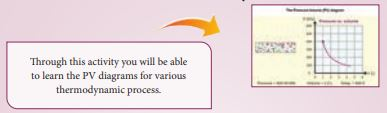
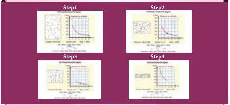

---
<<<<<<< HEAD
title: 'Books For Reference'
=======
title: 'books for reference'
>>>>>>> 9468d8de506ee3fe7a32ff32aec5f0ee5a849f86
weight: 14
---
1. Serway and Jewett, Physics for scientist and Engineers with modern physics, Brook/Coole 
publishers, Eighth edition

2. Paul Tipler and Gene Mosca, Physics for scientist and engineers with modern physics, 
Sixth edition, W.H.Freeman and Company

3. James Walker, Physics, Addison-Wesley publishers, 4th Edition

4. Douglas C Giancoli, Physics for scientist & Engineers with modern physics, Pearson 
Prentice Hall, 4th edition.

5. H.C.Verma, Concepts of physics volume 1 and Volume 2, Bharati Bhawan Publishers

6. Tarasov and Tarasova, Question and problems in school physics, Mir Publishers

**ICT CORNER**

**Heat and Thermodynamics**

STEPS:

• Use the URL or scan the QR code to open interactive simulation on ‘Pressure and Volume 
Diagram ”. 
• At selected temperature, change the “Volume” given below the graph and click play button.
• Now select a different temperature, change the ‘Volume’ again and find the change in the 
pressure both in the left image and graph.
• Repeat the same with different values and try drawing the graph accordingly. This also 
helps to understand isothermal process.

At selected temperature, change the “Volume” given below the graph and click play button.

URL:

http://physics.bu.edu/~duffy/HTML5/PV_diagram.html

* Pictures are indicative only.
* If browser requires, allow Flash Player or Java Script to load the page.