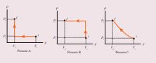
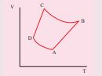
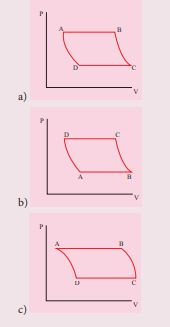
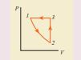
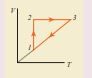
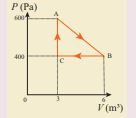
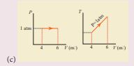

**I. Multiple choice questions:**

1. In hot summer after a bath, the body’s 
a) internal energy decreases
b) internal energy increases 
c) heat decreases 
d) no change in internal energy and 
heat

2. The graph between volume and temperature in Charles’ law is
a) an ellipse b) a circle
c) a straight line d) a parabola

3. When a cycle tyre suddenly bursts, the air inside the tyre expands. This process is
a) isothermal b) adiabatic
c) isobaric d) isochoric

4. An ideal gas passes from one 
equilibrium state (P1, V1, T1, N) to another equilibrium state (2P1, 3V1, T2, N). Then
a) T1= T2 
b) T1= T2/6
c) T1= 6T2
d) T1= 3T2

5. When a uniform rod is heated, which of the following quantity of the rod will increase
a) mass
b) weight
c) center of mass
d) moment of inertia

6. When food is cooked in a vessel by keeping the lid closed, after some time the steam pushes the lid outward. By considering the steam as a thermodynamic system, then in the 
cooking process
a) Q > 0, W > 0,
b) Q < 0, W > 0,
c) Q > 0, W < 0,
d) Q < 0, W < 0,

7. When you exercise in the morning, by considering your body as thermodynamic system, which of the following is true?
a) ΔU > 0, W > 0,
b) ΔU < 0, W > 0,
c) ΔU < 0, W < 0,
d) ΔU = 0, W > 0,

8. A hot cup of coffee is kept on the table. 
After some time it attains a thermal equilibrium with the surroundings. By considering the air molecules in the room as a thermodynamic system, which of the following is true
a) ΔU > 0, Q = 0
b) ΔU > 0, W < 0
c) ΔU > 0, Q > 0
d) ΔU = 0, Q > 0

9. An ideal gas is taken from (Pi,Vi) to 
(Pf,Vf) in three different ways. Identify the process in which the work done on the gas the most.

a) Process A
b) Process B
c) Process C
d) Equal work is done in Process A,B &C

10. The V-T diagram of an ideal gas which goes through a reversible cycle A→B→C→D is shown below. (Processes D→A and B→C are 
adiabatic)

The corresponding PV diagram for the process is (all figures are schematic)

11. A distant star emits radiation with 
maximum intensity at 350 nm. The temperature of the star is 
a) 8280 K b) 5000K
c) 7260 K d) 9044 K

12. Identify the state variables given here?
a) Q, T, W b) P, T, U
c) Q, W d) P, T, Q

13. In an isochoric process, we have
a) W = 0 b) Q = 0
c) ∆U = 0 d) ∆T = 0

14. The efficiency of a heat engine working 
between the freezing point and boiling point of water is
 (NEET 2018)
a) 6.25% b) 20%
c) 26.8% d) 12.5%

15. An ideal refrigerator has a freezer at 
temperature −12°C. The coefficient of 
performance of the engine is 5. The temperature of the air (to which the heat ejected) is
a) 50°C b) 45.2°C
c) 40.2°C d) 37.5°C

Answers:
1) a 2) c 3) b 4) b 5) d 6) a 7) b 8) c9) b 10)a 11) a 12) b 13) a 14) c 15) 

**II. Short answer questions:**
1. ‘An object contains more heat’- is it a right statement? If not why?

2. Obtain an ideal gas law from Boyle’s 
and Charles’ law.

3. Define one mole.

4. Define specific heat capacity and give its unit.

5. Define molar specific heat capacity.

6. What is a thermal expansion?

7. Give the expressions for linear, area and volume thermal expansions.

8. Define latent heat capacity. Give its unit.

9. State Stefan-Boltzmann law.

10. What is Wien’s law?

11. Define thermal conductivity. Give its unit.

12. What is a black body?

13. What is a thermodynamic system? Give
examples.
14. What are the different types of
thermodynamic systems?

15. What is meant by ‘thermal equilibrium’?

16. What is mean by state variable? Give 
example.
17. What are intensive and extensive variables? Give examples.

18. What is an equation of state? Give an 
example.

19. State Zeroth law of thermodynamics.

20. Define the internal energy of the 
system.

21. Are internal energy and heat energy 
the same? Explain.

22. Define one calorie.

23. Did joule converted mechanical energy 
to heat energy? Explain.

24. State the first law of thermodynamics.

25. Can we measure the temperature of the 
object by touching it? 

26. Give the sign convention for Q and W.

27. Define the quasi-static process.

28. Give the expression for work done by the gas. 

29. What is PV diagram?

30. Explain why the specific heat capacity at constant pressure is greater than the specific heat capacity at constant volume.

31. Give the equation of state for an 
isothermal process.

32. Give an expression for work done in an 
isothermal process.

33. Express the change in internal energy in terms of molar specific heat capacity.

34. Apply first law for (a) an isothermal (b) 
adiabatic (c) isobaric processes.

35. Give the equation of state for an 
adiabatic process.

36. Give an equation state for an isochoric 
process.

37. If the piston of a container is pushed fast inward. Will the ideal gas equation be valid in the intermediate stage? If not, why?

38. Draw the PV diagram for a. Isothermal process b. Adiabatic process c. Isobaric process d. Isochoric process

39. What is a cyclic process? 

40. What is meant by a reversible and 
irreversible processes?

41. State Clausius form of the second law of thermodynamics

42. State Kelvin-Planck statement of second law of thermodynamics.

43. Define heat engine.

44. What are processes involves in a Carnot 
engine?

45. Can the given heat energy be completely 
converted to work in a cyclic process? If not, when can the heat can completely converted to work?

46. State the second law of thermodynamics 
in terms of entropy.

47. Why does heat flow from a hot object 
to a cold object?

48. Define the coefficient of performance.

**III. Long answer Questions:**

1. Explain the meaning of heat and work with suitable examples.

2. Discuss the ideal gas laws.

3. Explain in detail the thermal expansion.

4. Describe the anomalous expansion of water. How is it helpful in our lives?

5. Explain Calorimetry and derive an expression for final temperature when two thermodynamic systems are mixed.

6. Discuss various modes of heat transfer.

7. Explain in detail Newton’s law of 
cooling.

8. Explain Wien’s law and why our eyes are sensitive only to visible rays?

9. Discuss the a. thermal equilibrium b. mechanical equilibrium c. Chemical equilibrium 
d. thermodynamic equilibrium.

10. Explain Joule’s Experiment of the 
mechanical equivalent of heat.

11. Derive the expression for the work done in a volume change in a thermodynamic system.

12. Derive Mayer’s relation for an ideal gas.

13. Explain in detail the isothermal process.

14. Derive the work done in an isothermal 
process 

15. Explain in detail an adiabatic process.

16. Derive the work done in an adiabatic 
process

17. Explain the isobaric process and derive the work done in this process

18. Explain in detail the isochoric process.

19. What are the limitations of the first law 
of thermodynamics?

20. Explain the heat engine and obtain its 
efficiency.

21. Explain in detail Carnot heat engine.

22. Derive the expression for Carnot engine efficiency.

23. Explain the second law of thermodynamics in terms of entropy.

24. Explain in detail the working of a 
refrigerator

**IV. Exercises**

1. Calculate the number of moles of air is in the inflated balloon at room temperature as shown in the figure.

The radius of the balloon is 10 cm, and 
pressure inside the balloon is 180 kPa.

Answer: μ ≅ 0.3 mol

2. In the planet Mars, the average temperature is around -53°C andatmospheric pressure is 0.9 kPa. Calculate the number of moles of the 
molecules in unit volume in the planet Mars? Is this greater than that in earth?

Answer: μMars = 0.49 mol
μEarth ≅ 40 mol

3. An insulated container of gas has two
chambers separated by an insulating partition. One of the chambers has volume V1 and contains ideal gas at pressure P1 and temperature T1. The other chamber has volume V2 and contains ideal gas at pressure P2 and temperature T2. If the partition is removed without doing any work on the gases, calculate the final equilibrium 
temperature of the container. 

Answer:  \frac{T_1T_2(P_1V_1 + P_2V_2)}{P_1V_1T_2 + P_2V_2T_1} 

4. The temperature of a uniform rod of length L having a coefficient of linear expansion αL is changed by ∆T. Calculate the new moment of inertia of the uniform rod about axis passing 
through its center and perpendicular to an axis of the rod.

Answer: I' = I(1 + \alpha L \Delta T)^2

5. Draw the TP diagram (P-x axis, T-y axis), VT(T-x axis, V-y axis) diagram for 

a. Isochoric process
b. Isothermal process
c. isobaric process

6. A man starts bicycling in the morning 
at a temperature around 25°C, he checked the pressure of tire which is equal to be 500 kPa. Afternoon he found that the absolute pressure in the tyre is increased to 520 kPa. By assuming the expansion of tyre is negligible, what is the temperature of tyre at afternoon?

Answer: T= 36.9°C

7. Normal human body of the temperature is 98.6°F. During high fever if the temperature increases to 104°F, what is the change in peak wavelength that emitted by our body? (Assume human body is a black body) 

Answer: (a) λmax ≈ 9348 nm at 98.6°F
(b) λmax ≈ 9258 nm at 104°F

8. In an adiabatic expansion of the air, the volume is increased by 4%, what is percentage change in pressure?(For air γ = 1.4)

Answer: 5.6%

9. In a petrol engine, (internal combustion 
engine) air at atmospheric pressure and 
temperature of 20°C is adiabatically 
compressed in the cylinder by the piston 
to 1/8 of its original volume. Calculate 
the temperature of the compressed air. 
(For air γ = 1.4) 

Answer: T ≅ 400°C

10. Consider the following cyclic process 
consist of isotherm, isochoric and 
isobar which is given in the figure

Draw the same cyclic process qualitatively in the V-T diagram where T is taken along x direction and V is taken along y-direction. Analyze the nature of heat exchange in each process.

Answer:

Process 1 to 2 = increase in volume. So 
heat must be added. 
Process 2 to 3 = Volume remains constant. Increase in temperature. 
The given heat is used to increase the 
internal energy.
Process 3 to 1 : Pressure remains constant. Volume and Temperature are 
reduced. Heat flows out of the system. It is an isobaric compression where the work is done on the system

11. An ideal gas is taken in a cyclic process 
as shown in the figure. Calculate 
(a) work done by the gas.
(b) work done on the gas
(c) Net work done in the process 
 Answer: (a) W = +1.5kJ
(b) W = −1.2kJ
(c) W = +300J.

12. For a given ideal gas 6 × 105
J heat energy is supplied and the volume of 
gas is increased from 4 m3 to 6 m3 at atmospheric pressure. Calculate (a) the work done by the gas (b) change in internal energy of the gas (c) graph this process in PV and TV diagram.

Answer: (a) W = +202.6 kJ 
(b) dU = 397.4 kJ

13. Suppose a person wants to increase the 
efficiency of the reversible heat engine 
that is operating between 100°C and 300°C. He had two ways to increase the efficiency. (a) By decreasing the cold reservoir temperature from 100°C to 50°C and keeping the hot reservoir 
temperature constant (b) by increasing