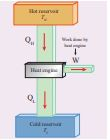
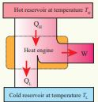
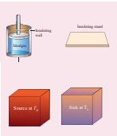
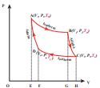
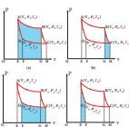
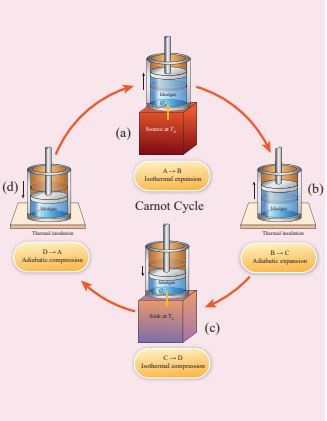
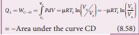
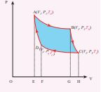
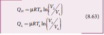
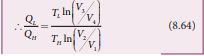

In the modern technological world, the role of automobile engines plays a vital role in for transportation. In motor bikes and cars there are engines which take in petrol or diesel as input, and do work by rotating wheels. Most of these automobile engines have efficiency not greater than 40%. The second law of thermodynamics puts a fundamental restriction on efficiency of engines. Therefore understanding heat engines is very important.

**Reservoir:** 
It is defined as a thermodynamic system which has very large heat capacity. By taking in heat from reservoir or giving heat to reservoir, the reservoir’s temperature does not change. 
**Example:** 
Pouring a tumbler of hot water in to lake will not increase the temperature of the lake. Here the lake can be treated as a reservoir. 
When a hot cup of coffee attains equilibrium with the open atmosphere, the temperature of the atmosphere will not appreciably change. The atmosphere can be taken as a reservoir. 
We can define heat engine as follows.

_Heat engine is a device which takes heat as input and converts this heat in to work by undergoing a cyclic process._ A heat engine has three parts:

(a) Hot reservoir 
(b) Working substance
(c) Cold reservoir

A Schematic diagram for heat engine is given below in the figure 8.42.

**Figure 8.42** Heat Engine

1.  Hot reservoir (or) Source: It supplies heat to the engine. It is always maintained at a high temperature _TH_

2.  Working substance: It is a substance like gas or water, which converts the heat supplied into work.

A simple example of a heat engine is a steam engine. In olden days steam engines were used to drive trains. The working substance in these is water which absorbs heat from the burning of coal. The heat converts the water into steam. This steam is does work by rotating the wheels of the train, thus making the train move.

3.  Cold reservoir (or) Sink: The heat engine ejects some amount of heat (_Q_L) in to cold reservoir after it doing work. It is always maintained at a low temperature _TL_.

For example, in the automobile engine, the cold reservoir is the surroundings at room temperature. The automobile ejects heat to these surroundings through a silencer.

The heat engine works in a cyclic process. After a cyclic process it returns to the same state. Since the heat engine returns to the same state after it ejects heat, the change in the internal energy of the heat engine is zero.

The efficiency of the heat engine is defined as the ratio of the work done (out put) to the heat absorbed (input) in one cylic process.

Let the working substance absorb heat _Q_H units from the source and reject _Q_L units to the sink after doing work W units, as shown in the Figure 8.43. 

**Figure 8.43** Heat engine

We can write Input heat = Work done + ejected heat

 Q_H = W + Q_L

  W = Q_H - Q_L

Then the efficiency of heat engine

  \eta = \frac{\text{output}}{\text{input}} = \frac{W}{Q_H} = \frac{Q_H - Q_L}{Q_H} 
  \eta = \frac{\text{output}}{\text{input}} = \frac{W}{Q_H} = 1 - \frac{Q_L}{Q_H} 

Note here that _QH_, _QL_ and _W_ all are taken as positive, a sign convention followed in this expression. 

Since QL < QH, the efficiency (η) always less than 1. This implies that heat absorbed is not completely converted into work. The second law of thermodynamics placed fundamental restrictions on converting heat completely into work.

We can state the heat engine statement of second law of thermodynamics. This is also called Kelvin-Planck’s statement.

**Kelvin-Planck statement:**
 _It is impossible to construct a heat engine that operates in a cycle, whose sole effect is to convert the heat completely into work. This implies that no heat engine in the universe can have 100% efficiency._

**Note**  According to first law of thermodynamics, in an isothermal process the given heat is completely converted into work (_Q = W_). Is it a violation of the second law of thermodynamics? No. For non-cyclic process like an isothermal expansion, the heat can be completely converted into work. But Second law of thermodynamics implies that ‘In a cyclic process only a portion of the heat absorbed is converted into work’. All heat engines operate in a cyclic process.

**EXAMPLE 8.24**

During a cyclic process, a heat engine absorbs 500 J of heat from a hot reservoir, does work and ejects an amount of heat 300 J into the surroundings (cold reservoir). Calculate the efficiency of the heat engine?

**_Solution_**

The efficiency of heat engine is given by

 \eta = 1 - \frac{Q_L}{Q_H} 
 \eta = 1 - \frac{300}{500} = 1 - \frac{3}{5} 
  \eta = 1 - 0.6 = 0.4  

The heat engine has 40% efficiency, implying that this heat engine converts only 40% of the input heat into work.  

## Carnot’s ideal heat engine

In the previous section we have seen that the heat engine cannot have 100% efficiency. What is the maximum possible efficiency can a heat engine have?. In the year 1824 a young French engineer Sadi Carnot proved that a certain reversible engine operated in cycle between hot and cold reservoir can have maximum efficiency. This engine is called Carnot engine.

_A reversible heat engine operating in a cycle between two temperatures in a particular way is called a Carnot Engine_.

The carnot engine has four parts which are given below. i. Source: It is the source of heat maintained at constant high temperature TH. Any amount of heat can be extracted from it, without changing its temperature.

ii. Sink: It is a cold body maintained at a constant low temperature TL. It can absorb any amount of heat.

iii. Insulating stand: It is made of perfectly non-conducting material. Heat is not conducted through this stand.

iv. Working substance: It is an ideal gas enclosed in a cylinder with perfectly non-conducting walls and perfectly conducting bottom. A non-conducting and frictionless piston is fitted in it.

The four parts are shown in the following Figure 8.44

**Figure 8.44** Carnot engine

**Carnot’s cycle:** 
The working substance is subjected to four successive reversible processes forming what is called Carnot’s cycle.

Let the initial pressure, volume of the working substance be _P1_,_V1_.

Step A to B: Quasi-static isothermal expansion from (_P1_,_V1_,_TH_) to (_P2_,_V2_,_TH_):

The cylinder is placed on the source. The heat (QH) flows from source to the working substance (ideal gas) through the bottom of the cylinder. Since the process is isothermal, the internal energy of the working substance will not change. The input heat increases the volume of the gas. The piston is allowed to move out very slowly(quasi-statically). It is shown in the figure 8.47(a).

W1 is the work done by the gas in expanding from volume _V1_ to volume _V2_ with a decrease of pressure from _P1_ to _P2_\. This is represented by the P-V diagram along the path AB as shown in the Figure 8.45.  

**Figure 8.45** PV diagram for Carnot cycle

Then the work done by the gas (working substance) is given by

 Q_H = W_{A \to B} = \int_{V_1}^{V_2} P \, dV 

Since the process occurs quasi-statically, the gas is in equilibrium with the source till it reaches the final state. The work done in the isothermal expansion is given by the equation (8.34)
 W_{A \to B} = \mu R T_H \ln\left(\frac{V_2}{V_1}\right)= \text {Area under the curve AB} 

This is shown in Figure 8.46 (a)

**Figure 8.46** Work done in Carnot cycle

**Figure 8.47** Carnot cycle  

Step B to C: Quasi-static adiabatic expansion from (_P2_,_V2_,_TH_) to (_P3_,_V3_,_TL_)

The cylinder is placed on the insulating stand and the piston is allowed to move out. As the gas expands adiabatically from volume _V2_ to volume _V3_ the pressure falls from P2 to P3. The temperature falls to TL. This adiabatic expansion is represented by curve BC in the PV diagram. This adiabatic process also occurs quasi-statically and implying that this process is reversible and the ideal gas is in equilibrium throughout the process. It is shown in the figure 8.47(b). From the equation (8.42) The work done by the gas in an adiabatic expansion is given by,
 W_{A \to B} = \mu R T_H \ln\left(\frac{V_2}{V_1}\right) =\text {Area under the curve AB}

This is shown in Figure 8.46
(b) Step C → D: Quasi-static isothermal compression from (_P3_,_V3_,_TL_) to (_P4_,_V4_,_TL_): It is shown in the figure 8.47(c)

The cylinder is placed on the sink and the gas is isothermally compressed until the pressure and volume become _P4_ and _V4_ respectively. This is represented by the curve _CD_ in the PV diagram as shown in Figure 8.45. Let  W_{C \to D} 
be the work done on the gas. According to first law of thermodynamics

This is shown in Figure 8.46 (c) Here V3 is greater than V4. So the work done is negative, implying work is done on the gas. Step D→A: Quasi-static adiabatic compression from (_P4_,_V4_,_TL_) to (_P1_,_V1_,_TH)_: It is shown in the figure 8.47(d)  

The cylinder is placed on the insulating stand again and the gas is compressed adiabatically till it attains the initial pressure P1, volume V1 and temperature TH. This is shown by the curve _DA_ in the P-V diagram.

 \therefore \frac{d}{dT} = -\frac{W}{P} \rightarrow \int \frac{dV}{V} =\text {- Area under the curve DA }

In the adiabatic compression also work is done on the gas so it is negative, as is shown in Figure 8.46 (d) 
Let ‘W’ be the net work done by the working substance in one cycle

 W_{A \to B} + W_{B \to C} + W_{C \to D} + W_{D \to A} 
\text{since } W_{D\rightarrow A} = -W_{B\rightarrow C}
= W_{A \to B} + W_{C \to D}


\text{The net work done by the Carnot engine in one cycle}   W = |W|_{A \to B} - |W|_{C \to D} 

Equation (8.60) shows that the net work done by the working substance in one cycle is equal to the area (enclosed by ABCD) of the P-V diagram (Figure 8.48)

**Figure 8.48** Net work done in Carnot cycle

It is very important to note that after one cycle the working substance returns to the initial temperature TH. This implies that the change in internal energy of the working substance after one cycle is zero.

## Efficiency of a Carnot engine
Efficiency is defined as the ratio of work done by the working substance in one cycle to the amount of heat extracted from the source.
 \eta =\frac{\text{work done}}{\text{Heat extracted}} =  \frac{W}{Q_H} 

From the first law of thermodynamics, W = _QH_ - _QL_

 \eta = \frac{Q_n - Q_t}{Q_n}1-\frac{Q_L}{Q_H} 

Applying isothermal conditions, we get,

Here we omit the negative sign. Since we are interested in only the amount of heat (QL) ejected into the sink, we have

By applying adiabatic conditions, we get,
 T_H V_2 \gamma^{-1}=T_H V_3 \gamma^{-1} 
 T_H V_1 \gamma^{-1}=T_H V_4 \gamma^{-1} 
By dividing the above two equations, we get

 
 [\frac{V_2}{V_1}]γ-1 = [\frac{V_3}{V_4}]γ-1 

Which implies that
  \frac{V_2}{V_1} = \frac{V_3}{V_4} 

Substituting equation (8.65) in (8.64), we get
  \frac{Q_t}{Q_n} = \frac{T_L}{T_H} 

∴The efficiency 
 ∴ \text{The efficiency }\eta = 1- \frac{T_L}{T_H} 

Note : TL and TH should be expressed in Kelvin scale.

**Important results:**
 
 1\. η is always less than 1 because TL is

less than TH. This implies the efficiency cannot be 100%. It can be 1 or 100% only when _T_L = _0K_ (absolute zero of temperature) which is impossible to attain practically.

2\. The efficiency of the Carnot’s engine is independent of the working substance. It depends only on the temperatures of the source and the sink. The greater the difference between the two temperatures, higher the efficiency.

3\. When TH=TL the efficiency η =0. No engine can work having source and sink at the same temperature.

4\. The entire process is reversible in the Carnot engine cycle. So Carnot engine is itself a reversible engine and has maximum efficiency. But all practical heat engines like diesel engine, petrol engine and steam engine have cycles which are not perfectly reversible. So their efficiency is always less than the Carnot efficiency. This can be stated in the form of the Carnot theorem. It is stated as follows ‘_Between two constant temperatures reservoirs, only Carnot engine can have maximum efficiency. All real heat engines will have efficiency less than the Carnot engine’_

(a) A steam engine boiler is maintained at 250°C and water is converted into steam. This steam is used to do work and heat is ejected to the surrounding air at temperature 300K. Calculate the maximum efficiency it can have?

**_Solution_**

The steam engine is not a Carnot engine, because all the process involved in the steam engine are not perfectly reversible. But we can calculate the maximum possible efficiency of the steam engine by considering it as a Carnot engine.
 \eta = 1 - \frac{T_L}{T_H} = 1 - \frac{300}{523} \, \text{K} = 0.43 

The steam engine can have maximum possible 43% of efficiency, implying this steam engine can convert 43% of input heat into useful work and remaining 57% is ejected as heat. In practice the efficiency is even less than 43%.

**EXAMPLE 8.26**

There are two Carnot engines A and B operating in two different temperature regions. For Engine A the temperatures of the two reservoirs are 150°C and 100°C. For engine B the temperatures of the reservoirs are 350°C and 300°C. Which engine has lesser efficiency?

**_Solution_**

The efficiency for engine
 A = 1 - \frac{373}{423} = 0.11 

Engine B has only 8% efficiency.  
B = 1 - \frac{573}{623} = 0.08 

Even though the differences between the temperature of hot and cold reservoirs in both engines is same, the efficiency is not same. The efficiency depends on the ratio of the two temperature and not on the difference in the temperature. The engine which operates in lower temperature has highest efficiency.

The efficiency of diesel engines has maximum up to 44% and the efficiency of petrol engines are maximum up to 30%. Since these engines are not ideal heat engines (Carnot engine), their efficiency is limited by the second law of thermodynamics. Now a days typical bikes give a mileage of 50 km per Liter of petrol. This implies only 30% of 1 Liter of petrol is converted into mechanical work and the remaining 70% goes out as wasted heat and ejected into the surrounding atmosphere!

## Entropy and second law of thermodynamics

We have seen in the equation (8.66) that the quantity  \frac{Q_u}{Q_u} \text{ is equal to }   \frac{Q_t}{T_2}

The quantity _Q/T_ is called entropy. It is a very important thermodynamic property of a system. It is also a state variable.
 \frac{Q_n}{T_u} 
is the entropy received by the Carnot engine from hot reservoir and  \frac{Q_L}{T_L} 
is entropy given out by the Carnot engine to the cold reservoir. For reversible engines (Carnot Engine) both entropies should be same, so that the change in entropy of the Carnot engine in one cycle is zero. This is proved in equation (8.66). But for all practical engines like diesel and petrol engines which are not reversible engines, they satisfy the relation  \frac{Q_t}{Q_L} >  \frac{Q_H}{T_H}

In fact we can reformulate the second law of thermodynamics as follows

“For all the processes that occur in nature (irreversible process), the entropy always increases. For reversible process entropy will not change”. Entropy determines the direction in which natural process should occur.

We now come back to the question: Why does heat always flows from a state of higher temperature to one of lower temperature and not in the opposite direction? Because entropy increases when heat flows from hot object to cold object. If heat were to flow from a cold to a hot object, entropy will decrease leading to violation of second law thermodynamics.

_Entropy is also called ‘measure of disorder’. All natural process occur such that the disorder should always increases._

Consider a bottle with a gas inside. When the gas molecules are inside the bottle it has less disorder. Once it spreads into the entire room it leads to more disorder. In other words when the gas is inside the bottle the entropy is less and once the gas spreads into entire room, the entropy increases. From the second law of thermodynamics, entropy always increases. If the air molecules go back in to the bottle, the entropy should decrease, which is not allowed by the second law of thermodynamics. The same explanation applies to a drop of ink diffusing into water. Once the drop of ink spreads, its entropy is increased. The diffused ink can never become a drop again. So the natural processes occur in such a way that entropy should increase for all irreversible process.