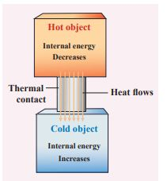
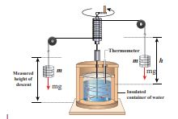
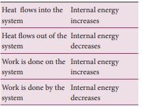
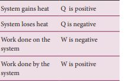
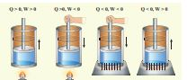
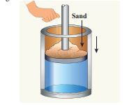
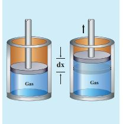
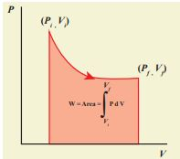

# INTERNAL ENERGY 

The internal energy of a thermodynamic system is the sum of kinetic and potential energies of all the molecules of the system with respect to the center of mass of the system.

The energy due to molecular motion including translational, rotational and vibrational motion is called internal kinetic energy E_K

The energy due to molecular interaction is called internal potential energy E_P. Example: Bond energy.

U = E_K + E_P

� Since ideal gas molecules are assumed to have no interaction with each other the internal energy consists of only kinetic energy part (EK) which depends on the temperature, number of particles and is independent of volume. However this is not true for real gases like Van der Waals gases.

� Internal energy is a state variable. It depends only on the initial and final states of the thermodynamic system. For example, if the temperature of water is raised from 30°C to 40°C either by heating or by stirring, the final internal energy depends only on the final temperature 40°C and not the way it is arrived at.

<blockquote style="background-color:pink; padding:10px; border-radius:5px;">

**Note** It is very important to note that the internal energy of a thermodynamic system is associated with only the kinetic energy of the individual molecule due to its random motion and the potential energy of molecules which depends on their chemical nature. The bulk kinetic energy of the entire system or gravitational potential energy of the system should not be mistaken as a part of internal energy. For example
(a) Consider two gas containers at the same temperature having the same internal energy, one is kept at rest on the ground and the other is kept in a moving train. Even though the gas container in the train is moving with the speed of the train, the internal energy of the gas in it will not increase. 
(b) Consider two gas containers at the same temperature having the same internal energy, one is kept on the ground and the other is kept at some height h. Even though the container at height h is having higher gravitational potential energy, this has no influence on internal energy of the gas molecules.</blockquote>

**EXAMPLE 8.10**

When you mix a tumbler of hot water with one bucket of normal water, what will be the direction of heat flow? Justify. 

The water in the tumbler is at a higher temperature than the bucket of normal water. But the bucket of normal water has larger internal energy than the hot water in the tumbler. This is because the internal energy is an extensive variable and it depends on the size or mass of the system.

Even though the bucket of normal water has larger internal energy than the tumbler of hot water, heat will flow from water in the tumbler to the water in the bucket. This is because heat flows from a body at higher temperature to the one at lower temperature and is independent of internal energy of the system. 

Once the heat is transferred to an object it becomes internal energy of the object. The right way to say is ‘object has certain amount of internal energy’. Heat is one of the ways to increase the internal energy of a system as shown in the Figure.  

<blockquote style="background-color:pink; padding:10px; border-radius:5px;">

 **Note**  It is to be noted that heat does not always increases the internal energy. Laterwe shall see that in ideal gases during isothermal process the internal energy will not increase even though heat flows in to the system.
</blockquote>

## Joule’s mechanical equivalent of heat

The temperature of an object can be increased by heating it or by doing some work on it. In the eighteenth century, James Prescott Joule showed that mechanical energy can be converted into internal energy and vice versa. In his experiment, two masses were attached with a rope and a paddle wheel as shown in Figure 8.19. When these masses fall through a distance h due to gravity, both the masses lose potential energy equal to 2mgh. When the masses fall, the paddle wheel turns. Due to the turning of wheel inside water, frictional force comes in between the water and the paddle wheel. This causes

**Figure.8.19** Joule’s experiment for determining the mechanical equivalent of heat energy.

a rise in temperature of the water. This implies that gravitational potential energy is converted to internal energy of water. The temperature of water increases due to the work done by the masses. In fact, Joule was able to show that the mechanical work has the same effect as giving heat. He found that to raise 1 g of an object by 1°C , 4.186 J of energy is required. In earlier days the heat was measured in calorie.

1 cal = 4.186 J

This is called Joule’s mechanical equivalent of heat.

<blockquote style="background-color:pink; padding:10px; border-radius:5px;">

**Note** Before James Prescott Joule, people thought that heat was a kind of fluid called caloric fluid which flows from an object at high temperature to that in low temperature. According to caloric fluid idea, the hot object contains more caloric fluid and the cold object contains less caloric fluid since heat was treated as a quantity. Now we understand that heat is not a quantity but it is an energy in transit. So the word ‘mechanical equivalent of heat’ is wrong terminology. Because mechanical energy is a quantity and any object can contain more or less</blockquote>

<!-- **Note**   -->

**EXAMPLE 8.11**

A student had a breakfast of 200 food calories. He thinks of burning this energy by drawing water from the well and watering the trees in his school. Depth of the well is about 25 m. The pot can hold 25L of water and each tree requires one pot of water. How many trees can he water? (Neglect the mass of the pot and the energy spent by walking. Take  g = 10 \, \text{ms}^2 )

<!--  -->

**_Solution_**

To draw 25 L of water from the well, the student has to do work against gravity by burning his energy.

Mass of the water = 25 L = 25 kg (1L=1kg )

The work required to draw 25 kg of water = gravitational potential energy gained by water.

W = mgh = 25 \times 10 \times 25 = 6250 \, \text{J}

<!-- mechanical energy, but this is not so with heat as it is not a quantity. However this terminology is retained for historical reasons. A correct name would be ‘Joule’s mechanical equivalence of internal energy’. Joule Essentially converted mechanical energy to internal energy. In his experiment potential energy is converted to rotational kinetic energy of paddle wheel and this rotational kinetic energy is converted to internal energy of water. -->

  

The total energy gained from the food = 200 food cal =200 kcal.

 200 \times 10^3 \times 4.186 \, \text{J} = 8.37 \times 10^5 \, \text{J} 

If we assume that by using this energy the student can drawn ‘n’ pots of water from the well, the total energy spent by him = 8.37 \times 10^5 \, \text{J} = \text{nmgh}

 n = \frac{8 \times 10^{37}}{6250} \times 5 \times 10^{12} \, J \approx 134 

This n is also equal to the number of trees that he can water.

Is it possible to draw 134 pots of water from the well just by having breakfast? No. Actually the human body does not convert entire food energy into work. It is only approximately 20% efficient. It implies that only 20% of 200 food calories is used to draw water from the well. So 20 % of the 134 is only 26 pots of water. It is quite meaningful. So he can water only 26 trees.

The remaining energy is used for blood circulation and other functions of the body. It is to be noted that some energy is always ‘wasted’. Why is it that the body cannot have 100% efficiency? You will find the answer in section 8.9

## First law of thermodynamics

The first law of thermodynamics is a statement of the law of conservation of energy. In Newtonian mechanics conservation of energy involves kinetic and potential energies of bulk objects. But the first law of thermodynamics includes heat also. This law states that ‘_Change in internal energy (ΔU) of the system is equal to heat supplied to the system (Q) minus the work done by the system (W) on the surroundings’._ Mathematically it is written as  

∆U=Q-W (8.13)

The internal energy of a thermodynamic system can be changed either by heating or by work as shown below.

Based on the above table the sign convention is introduced to use first law of thermodynamics appropriately. It is shown in the following table and the Figure 8.20.

**Figure 8.20** The Sign convention for heat and work
<blockquote style="background-color:pink; padding:10px; border-radius:5px;">

**Note**
Even though we often explain first law of thermodynamics using gases, this law is universal and applies to liquids and solids also.Some book presents the first law of thermodynamics as ∆U = Q + W. Here the work done by the system is taken as negative and work done on the system is positive. However both the conventions are correct and we can follow any one of the convention.</blockquote>

*

**EXAMPLE 8.12**

A person does 30 kJ work on 2 kg of water by stirring using a paddle wheel. While stirring, around 5 kcal of heat is released from water through its container to the surface and surroundings by thermal conduction and radiation. What is the change in internal energy of the system?

**_Solution_**

Work done on the system (by the person while stirring), W = -30 kJ = −30,000J Heat flowing out of the system, Q = −5 kcal = −5 × 4184 J = −20920 J 
Using First law of thermodynamics
 ∆U = Q-W 
 ∆U = -20,920 _J_\-(-30,000) _J_ 
 ∆U = -20,920 _J_+30,000 _J_ \= 9080 _J_ Here, the heat lost is less than the work done on the system, so the change in internal energy is positive.

**EXAMPLE 8.13**

Jogging every day is good for health. Assume that when you jog a work of 500 kJ is done and 230 kJ of heat is given off. What is the change in internal energy of your body?  

**_Solution_**

<!--  -->

Work done by the system (body), W = +500 kJ

Heat released from the system (body), Q = –230 kJ

The change in internal energy of a body = ΔU= – 230 _kJ_ – 500 _kJ_ = – 730 _kJ_

## Quasi-static process

Consider a system of an ideal gas kept in a cylinder of volume V at pressure P and temperature T. When the piston attached to the cylinder moves outward the volume of the gas will change. As a result the temperature and pressure will also change because all three variables P,T and V are related by the equation of state PV = NkT. If a block of some mass is kept on the piston, it will suddenly push the piston downward. The pressure near the piston will be larger than other parts of the system. It implies that the gas is in non-equilibrium state. We cannot determine pressure, temperature or internal energy of the system until it reaches another equilibrium state. But if the piston is pushed very slowly such that at every stage it is still in equilibrium with surroundings, we can use the equation of state to calculate the internal energy, pressure or temperature. This kind of process is called quasi-static process.

A quasi-static process is an infinitely slow process in which the system changes its variables (P,V,T) so slowly such that it remains in thermal, mechanical and chemical equilibrium with its surroundings throughout. By this infinite slow variation, the system is always almost close to equilibrium state.

**EXAMPLE 8.14**

Give an example of a quasi-static process. Consider a container of gas with volume V, pressure P and temperature T. If we add sand particles one by one slowly on the top of the piston, the piston will move inward very slowly. This can be taken as almost a quasi-static process. It is shown in the figure

<!-- **Sand** -->

Sand particles added slowly- quasi-static process

## Work done in volume changes

Consider a gas contained in the cylinder fitted with a movable piston. Suppose the gas is expanded quasi-statically by pushing the piston by a small distance dx as shown in Figure 8.21. Since the expansion occurs quasi-statically the pressure, temperature and internal energy will have unique values at every instant.  

The small work done by the gas on the piston

_dW_ = _Fdx_ (8.14)

The force exerted by the gas on the piston F = PA. Here A is area of the piston and P is pressure exerted by the gas on the piston.

Equation (8.14) can be rewritten as

_dW_ = _PA dx_ (8.15)

But Adx = dV= change in volume during this expansion process. So the small work done by the gas during the expansion is given by

_dW = PdV_ (8.16)

Note here that dV is positive since the volume is increased. So dW is positive. In general the work done by the gas by increasing the volume from 
\(Vi\) to \(Vf\)is given by

W = \int_{V_i}^{V_f} P \, dV

Suppose if the work is done on the system, then Vi > Vf . Then, W is negative. Note here the pressure P is inside the integral in equation (8.17). It implies that while the system is doing work, the pressure need not be constant. To evaluate the integration we need to first express the pressure as a function of volume and temperature using the equation of state.

## PV diagram

PV diagram is a graph between pressure P and volume V of the system. The P-V diagram is used to calculate the amount of work done by the gas during expansion or on the gas during compression. In Unit 2, we have seen that the area under the curve will give integration of the function from lower limit to upper limit. The area under the PV diagram will give the work done during expansion or compression which is shown in Figure 8.22

**Figure 8.22** Work done by the gas during expansion

The shape of PV diagram depends on the nature of the thermodynamic process.  

**EXAMPLE 8.15**

A gas expands from volume 1m3 to 2m3 at constant atmospheric pressure. 
(a) Calculate the work done by the gas. 
(b) Represent the work done in PV diagram.

**_Solution_**

(a) The pressure P = 1 atm = 101 kPa, 
V_f = 2 \, \text{m}^3 \quad \text{and} \quad V_i = 1 \, \text{m}^3

From equation (8.17)
  W = \int_{V_i}^{V_f} P \, dV = P \int_{V_i}^{V_f} dV  

Since P is constant. It is taken out of the integral.

 W = P(V_f - V_i) = 101 \times 10^3 \times (2 - 1) = 101 \, \text{kJ}  

(b) Since the pressure is kept constant, PV diagram is straight line as shown in the figure. The area is equal to work done by the gas.

Note the arrow mark in the curve. Suppose the work is done on the system, then volume will decreases and the arrow will point in the opposite direction.