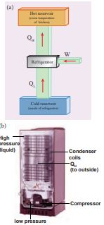
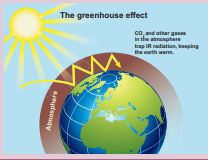

A refrigerator is a Carnot’s engine working in the reverse order. It is shown in the figure 8.49.

**Working Principle:**

**Fig 8.49**

The working substance (gas) absorbs a quantity of heat _Q_L from the cold body (sink) at a lower temperature _T_L. A certain amount of work W is done on the working substance by the compressor and a quantity of heat QH is rejected to the hot body (source) ie, the atmosphere at TH. When you stand beneath of refrigerator, you can feel warmth air. From the first law of thermodynamics , we have

QL +W = QH (8.68)

As a result the cold reservoir (refrigerator) further cools down and the surroundings (kitchen or atmosphere) gets hotter.

**Coefficient of performance (COP) (β):** COP is a measure of the efficiency of a refrigerator. It is defined as the ratio of heat extracted from the cold body (sink) to the external work done by the compressor W.

COP=β= _Q W_

_L_ (8.69)

From the equation (8.68)

β= −

_Q Q Q_

_L_

_H L_

β= −

1

1_Q Q_

_H_

_L_

(8.70)

But we know that _Q Q_

_T T_

_H_

_L_

_H_

_L_

\=  

Substituting this equation into equation (8.70) we get

β= − =

− 1

1_T T_

_T T TH_

_L_

_L_

_H L_

**Inferences:** 
1\. The greater the COP, the better is the

condition of the refrigerator. A typical refrigerator has COP around 5 to 6.

2\. Lesser the difference in the temperatures of the cooling chamber and the atmosphere, higher is the COP of a refrigerator.

3\. In the refrigerator the heat is taken from cold object to hot object by doing external work. Without external work heat cannot flow from cold object to hot object. It is not a violation of second law of thermodynamics, because the heat is ejected to surrounding air and total entropy of (refrigerator + surrounding) is always increased.

**EXAMPLE 8.27**

A refrigerator has COP of 3. How much work must be supplied to the refrigerator in order to remove 200 J of heat from its interion?

COP =β= _Q W_

_L_

_W Q_

_COP JL_\= = =

200 3

66 67.

<blockquote style="background-color:pink; padding:10px; border-radius:5px;">
width="500" >
**Green House Effect**
 The presence of atmosphere in the earth pla of the atmosphere is at -19°C and bottom of 33°C from top to bottom is due to some gases called Greenhouse gases and this effect is called Greenhouse Effect

The greenhouse gases are mainly CO2, wa and NH3. Except CO2 and water vapor, all ot in the atmosphere. The radiation from the spectrum. The earth absorbs these radiations dioxide and water Vapour are good absorbers vibrational degree of freedom compared to ni which keeps earth warmer as shown in Figure

The amount of CO2 present in the atmos human activities since 1900s. The major emi fuels. The increase in automobile usage worldw in the CO2 content in the atmosphere, the av 1°C. This effect is called global warming. It h ice glaciers on Arctic and Antarctic regions. In in ocean which is very dangerous to species in

In addition to CO2, another very imp carbon(CFC) which is used as coolant in re greenhouse gases CO2 is 55%, CFCs are 24%. CFCs also has made huge damage to ozone layer

Lot of efforts are taken internationally to various countries. Nowadays a lot of research the fossil-fuels in automobile industry. The m countries like USA and European countries. V to reduce the emission of CO2 to considerable is not taken seriously in various countries.

</blockquote>

In hot summer, we use earther The pot reduces the temperatu the earthern pot act as a refrig is the basic necessity for heat
<!--  -->

earthern pot, the cooling process is not due cooling occurs due to evaporation of water m through pores of the pot. Once the water m never come back to the pot. Even though the to open atmosphere, it is not a violation of inside the pot is an open thermodynamic sys always increases. 

  

