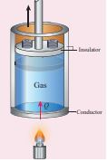
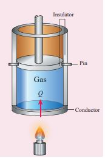

---
<<<<<<< HEAD
title: 'Specific Heat Capacity Of A Gas'
=======
title: 'specific heat capacity of a gas'
>>>>>>> 9468d8de506ee3fe7a32ff32aec5f0ee5a849f86
weight: 7
---

Specific heat capacity of a given system plays a very important role in determining the structure and molecular nature of the system. Unlike solids and liquids, gases have two specific heats: specific heat capacity at constant pressure (s_p)and specific heat capacity at constant volume (s_v).

**Specific heat capacity at constant pressure** (**_sp_**): 
The amount of heat energy required to raise the temperature of one kg of a substance by 1 K or 1°C by keeping the pressure constant is called specific heat capacity of at constant pressure. When the heat energy is supplied to the gas, it expands to keep the pressure constant as shown in Figure 8.23

**Figure 8.23** Specific heat capacity at constant pressure

In this process a part of the heat energy is used for doing work (expansion) and the remaining part is used to increase the internal energy of the gas. 

**Specific heat capacity at constant volume (sv):** 

The amount of heat energy required to raise the temperature of one kg of a substance by 1 K or 1°C by keeping the volume constant is called specific heat capacity at constant volume.

If the volume is kept constant, then the supplied heat is used to increase only the internal energy. No work is done by the gas as shown in Figure 8.24.

**Figure 8.24**  Specific heat capacity at constant volume

It implies that to increase the temperature of the gas at constant volume requires less heat than increasing the temperature of the gas at constant pressure. In other words (s_p)is always greater than (s_v).

**Molar Specific heat capacities** 

Sometimes it is useful to calculate the molar heat capacities Cp and Cv. The amount of heat required to raise the temperature of one mole of a substance by 1K or 1°C at constant volume is called molar specific heat capacity at constant volume (Cv). If pressure is kept constant, it is called molar specific heat capacity at constant pressure (Cp).

If Q is the heat supplied to mole of a gas at constant volume and if the temperature changes by an amount \Delta T , we have

Q = \mu C_v \Delta T 

By applying the first law of thermodynamics for this constant volume process (W=0, since dV=0), we have

  Q = \Delta U - 0 

By comparing the equations (8.18) and (8.19),

 \Delta U = \mu C_v \Delta T 

or

C_v = \frac{1}{\mu}\frac{\Delta U}{\Delta T} 

If the limit \Delta T goes to zero, we can write

 C_v = \frac{1}{\mu} \frac{dU}{dT} 

Since the temperature and internal energy are state variables, the above relation holds true for any process.

## Meyer’s relation

Consider µ mole of an ideal gas in a container with volume V, pressure P and temperature T.

When the gas is heated at constant volume the temperature increases by dT. As no work is done by the gas, the heat that flows into the system will increase only the internal energy. Let the change in internal energy be dU.

If Cv is the molar specific heat capacity at constant volume, from equation (8.20)

dU = \mu C_v \, dT

Suppose the gas is heated at constant pressure so that the temperature increases by dT. If ‘Q’ is the heat supplied in this process and ‘dV’ the change in volume of the gas.  

  Q = \mu C_p \Delta T 
If W is the workdone by the gas in this process, then
  W = P \, dV 

But from the first law of thermodynamics,

  Q = \Delta U + W 

Substituting equations (8.21), (8.22) and (8.23) in (8.24), we get,
  \mu C_p dT = \mu C_v dT + P dV 

For mole of ideal gas, the equation of state is given by

  PV = \mu RT 

  PdV + VdP = \mu RdT 

Since the pressure is constant, dP=0 ∴CpdT = CvdT +RdT

∴ C_p dT = C_v dT + R dT

 C_P = C_V + R 

or

  C_P - C_V = R 

This relation is called Meyer’s relation

It implies that the molar specific heat capacity of an ideal gas at constant pressure is greater than molar specific heat capacity at constant volume. The relation shows that specific heat at constant pressure (sp) is always greater that specific heat at constant volume (sv).