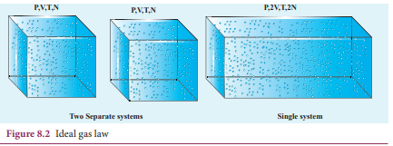
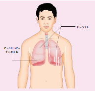
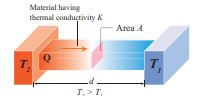
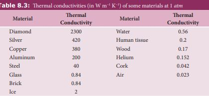
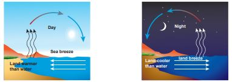
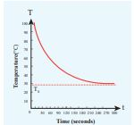
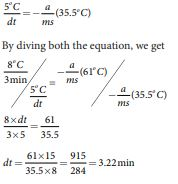

# THERMAL PROPERTIES OF MATTER
<!-- # THERMAL PROPERTIES OF MATTER -->

<!-- ## 8.2.1 Boyle’s law, Charles’ law and ideal gas law -->
 ## Boyle’s law, Charles’ law and ideal gas law

For a given gas at low pressure (density) kept in a container of volume V, experiments revealed the following information.

� When the gas is kept at constant temperature, the pressure of the gas is inversely proportional to the volume.

_P V_

µ 1 . It was discovered by Robert Boyle

(1627-1691) and is known as Boyle’s law. � When the gas is kept at constant

pressure, the volume of the gas is directly proportional to absolute temperature. _V T_µ . It was discovered by Jacques Charles (1743-1823) and is known as Charles’ law.

� By combining these two equations we have

_PV_ = _CT._ Here C is a positive constant. We can infer that C is proportional to the number of particles in the gas container by considering the following argument. If we take two containers of same type of gas with same volume V, same pressure P and same temperature T, then the gas in each container obeys the above equation. _PV_ = _CT._ If the two containers of gas is considered as a single system, then the pressure and temperature of this combined system will be same but volume will be twice and number of particles will also be double as shown in Figure 8.2

<!--  -->

  

For this combined system, V becomes 2V, so C should also double to match with the ideal gas equation  \frac{P(2V)}{T} = 2C . It implies that C must depend on the number of particles in the gas and also should have the dimension of 
\frac{PV}{T}  = -JK_1
  So we can write the constant C as k times the number of particles N. 
Here k is the Boltzmann constant (1.381×10−23 JK−1) and it is found to be a universal constant. So the ideal gas law can be stated as follows

_PV_ \= _NkT_ (8.1)

The equation (8.1) can also be expressed in terms of mole.

_Mole is the practical unit to express the amount of gas. One mole of any substance is the amount of that substance which contains Avogadro number (NA) of particles (such as atoms or molecules). The Avogadro’s number NA is defined as the number of carbon atoms contained in exactly 12 g of 12C ._

Suppose if a gas contains μ mole of particles then the total number of particles can be written as

<!-- **Figure 8.2** Ideal gas law -->

<!-- **P,V,T,N P,V,T,N**

**Two Separate systems**  

_N_ \= μ _N_A (8.2) -->
N = μ NA

where NA is Avogadro number (6.023 × 1023 mol-1)

Substituting for N from equation (8.2), the equation (8.1) becomes 
_PV = μ NA kT_. Here   _NAk =R_ called universal gas constant and its value is 8.314 J /mol. K. So the ideal gas law can be written for μ mole of gas asPV = \mu RT 

This is called the equation of state for an ideal gas. It relates the pressure, volume and temperature of thermodynamic system at equilibrium.

**E X A M P L E  8.2**

A student comes to school by a bicycle whose tire is filled with air at a pressure 240 kPa at 27°C. She travels 8 km to reach the school and the temperature of the bicycle tire increases to 39°C. What is the change in pressure in the tire when the student reaches school?

<!-- **P,2V,T,2N**

**Single system** -->

  

<!-- _N PV kT_

\= = × × × × ×

−

− −

1 01 10 5 5 10

1 38 10 310

5 3

23 1

. .

.

Pa

JK K -->

<!--  -->

**_Solution_**

We can take air molecules in the tire as an ideal gas. The number of molecules and the volume of tire remain constant. So the air molecules at 27°C satisfies the ideal gas equation  nP_1V_1 = NkT_1 nd at 39°C it satisfies  nP_2V_2 = NkT_2 

But we know

V₁ = V₂ = V

PV = NkT 
 
\frac{P_1V}{P_2V} = \frac{NkT}{NkT}   _
 \frac{P_1}{P_2} =\frac{T_1}{T_2}  

  P_2 = \frac{T_1}{T_2}P_1
 
 
  P_2 = \frac{312K}{300K}*240*10  Pa={249.6} kPa

<!-- 103 -->

**EXAMPLE 8.3**

When a person breaths, his lungs can hold up to 5.5 Litre of air at body temperature 37°C and atmospheric pressure (1 atm =101 kPa). This Air contains 21% oxygen. Calculate the number of oxygen molecules in the lungs.  

<!-- **_V_ \= 5.5 L**

**_P_ = 101 kPa _T_ = 310 K** -->

<!--  -->
**_Solution_**

We can treat the air inside the lungs as an ideal gas. To find the number of molecules, we can use the ideal gas law.

PV = NkT

Here volume is given in the Litre. 1 Litre is volume occupied by a cube of side 10 cm. 1Litre \= 10cm × 10cm × 10cm \= 10–3 m3


N =\frac{PV}{kT} = \frac{1.01 \times 10^5 Pa\times 5.5\times 10^{-23}\times m^{3}}{1.38 \times 10^{-23} JK^{-23}\times 310K}


Only 21% of N are oxygen. The total number of oxygen molecules
1.29 \times 10^{23} \times \frac{21}{100}

<!-- \= 1.29 × 1023 × 21 100 -->

Number of oxygen molecules = 2.7 × 1022 molecules

**EXAMPLE 8.4**

Calculate the volume of one mole of any gas at STP and at room temperature (300K) with the same pressure 1 atm.

  

**_Solution:_**

Here STP means standard temperature (T=273K or 0°C) and Pressure (P=1 atm or 101.3 kPa)

We can use ideal gas equation 
\frac{\mu{RT}}{P} = V


Here µ = 1 mol and R =8.314 J/mol.K.

By substituting the values

\=22.4 × 10–3 m3

We know that 1 Litre (L) = =10–3m3. So we can conclude that 1 mole of any ideal gas has volume 22.4 L.

By multiplying 22.4L by
\frac{300K}{273K}


we get

the volume of one mole of gas at room temperature. It is 24.6 L.

**EXAMPLE 8.5**

Estimate the mass of air in your class room at NTP. Here NTP implies normal temperature (room temperature) and 1 atmospheric pressure.

<!--  -->

**_Solution_**

The average size of a class is 6m length, 5 m breadth and 4 m height. The volume of the room V = 6 × 5 × 4 = 120\text{m}^{-3}. We can  

determine the number of mole. At room temperature 300K, the volume of a gas occupied by any gas is equal to 24.6L.

The number of mole 
\mu = \frac{120}{24} \times 10^{-3} \, \text{m}^{-3}=4878 mol


Air is the mixture of about 20% oxygen, 79% nitrogen and remaining one percent are argon, hydrogen, helium, and xenon. The molar mass of air is \[29 gmol^{-1}\]. So the total mass of air in the room \[ m = 4878 \times 29 \times 10^{-3} = 141.4 \, \text{kg} \]

<!-- ## Heat capacity and specific heat capacity -->
## Heat capacity and specific heat capacity

Take equal amount of water and oil at temperature 27°C and heat both of them till they reach the temperature 50°C. Note down the time taken by the water and oil to reach the temperature 50°C. Obviously these times are not same. We can see that water takes more time to reach 50°C than oil. It implies that water requires more heat energy to raise its temperature than oil. Now take twice the amount of water at 27°C and heat it up to 50°C , note the time taken for this rise in temperature. The time taken by the water is now twice compared to the previous case.

We can define ‘heat capacity’ as the amount of heat energy required to raise the temperature of the given body from T to T + ∆T .

Heat capacity S =
\frac{\Delta Q}{\Delta T}


_Specific heat capacity of a substance is defined as the amount of heat energy required to raise the temperature of 1kg of a substance by 1 Kelvin or 1°C_

  

∆Q = m s∆T

Therefore,

S =\frac{1}{m}[\frac{\Delta Q}{\Delta T}]


Where s is known as specific heat capacity of a substance and its value depends only on the nature of the substance not amount of substance

ΔQ = Amount of heat energy

ΔT = Change in temperature

m = Mass of the substance

The SI unit for specific heat capacity is J \, \text{kg}^{-1} \, \text{K}^{-1}. Heat capacity and specific heat capacity are always positive quantities.

<!--  -->

<!-- **Table 8.2 Specific heat capacity of** some common substances at 1 atm (20°C) -->

<!-- Material Specific heat

capacity (Jkg−lK−1)

Air 1005

Lead 130

Copper 390

Iron (steel) 450

Glass 840

Aluminium 900

Human body 3470

Water 4186 -->

From the table 8.2 it is clear that water has the highest value of specific heat capacity. For this reason it is used as a coolant in power stations and reactors.  

The term heat capacity or specific heat capacity does not mean that object

contains a certain amount of heat. Heat is energy transfer from the object at higher temperature to the object at lower temperature. The correct usage is ‘internal energy capacity’. But for historical reason the term ‘heat capacity’ or ‘specific heat capacity’ are retained.
<blockquote style="background-color:pink; padding:10px; border-radius:5px;">
<!--  -->

<!--  -->
**Note**
the term heat capacity or specific heat capacity does not mean that object contains a certain amount of heat.Heat is energy transfer from the object oat highe temperature to the object at lower temperature. The correct usage is 'internal enegy capacity'.But for historical reason the term heat capacity or specific heat capacity is retained.
</blockquote>
When two objects of same mass are _heated_ at equal rates, the object with smaller specific heat

_capacity_ will have a _faster temperature increase._ When two objects of same mass are left to cool down, the temperature of the object with smaller specific heat _capacity_ will _drop faster._

When we study properties of gases, it is more practical to use molar specific heat capacity. Molar specific heat capacity is defined as heat energy required to increase the temperature of one mole of substance by 1K or 1°C. It can be written as follows

<!-- C = 1 µ ∆ ∆



 



 

_Q T_ -->
C =\frac{1}{\mu}[\frac{\Delta Q}{\Delta T}]

Here C is known as molar specific heat _capacity_ of a substance and μ is number of moles in the substance.

The SI unit for molar specific heat capacity is J mol–1 K–1 . It is also a positive quantity.

  

<!-- ## Thermal expansion of solids, liquids and gases -->
## Thermal expansion of solids, liquids and gases

_Thermal expansion is the tendency of matter to change in shape, area, and volume due to a change in temperature._

All three states of matter (solid, liquid and gas) expand when heated. When a solid is heated, its atoms vibrate with higher amplitude about their fixed points. The relative change in the size of solids is small. Railway tracks are given small gaps so that in the summer, the tracks expand and do not buckle. Railroad tracks and bridges have expansion joints to allow them to expand and contract freely with temperature changes. It is shown in Figure 8.3

 
 
<!--  -->
<!--  -->
**Figure 8.3** Expansion joints for safety  

 

**Liquids**, have less intermolecular forces than solids and hence they expand more than solids. This is the principle behind the mercury thermometers.

In the case of **gas** molecules, the intermolecular forces are almost negligible and hence they expand much more than solids. For example in hot air balloons when gas particles get heated, they expand and take up more space.

The increase in dimension of a body due to the increase in its temperature is called thermal expansion.

The expansion in length is called linear **expansion**. Similarly the expansion in area is termed as **area expansion** and the

<!--  -->
**Figure 8.4 Thermal expansions**

  

expansion in volume is termed as **volume expansion**. It is shown in Figure 8.4

**Linear Expansion** 
In solids, for a small change in temperature

ΔT, the fractional change in length 
[\frac{\Delta L}{L_0}]
is directly proportional to ΔT.


\frac{\Delta L}{L_0} = \alpha L \Delta T



\alpha L = \frac{\Delta L}{L_0 \Delta T}

<!--  



 

_L L_0 -->

<!-- D_L L_0

\= αLΔT

Therefore, αL = D D

_L L T_0 -->

Where, αL = coefficient of linear expansion.

ΔL = Change in length

L0 = Original length

ΔT = Change in temperature.

•  When the lid of a glass bottle is tight, keep the lid near the hot water which makes it easier to open. It is because the lid has higher thermal expansion than glass.
•  When the hot boiled egg is dropped in cold water, the egg shell can be removed easily. It is because of the different thermal expansions of the shell and egg.

**EXAMPLE 8.6**

Eiffel tower is made up of iron and its height is roughly 300 m. During winter season (January) in France the temperature is 2°C and in hot summer its average temperature 25°C. Calculate the change in height of Eiffel tower between summer and winter. The linear thermal expansion coefficient for iron α = 10 ×10−6 per °C 

<!--  -->

**_Solution_**

\frac{\Delta L}{L_0} = \alpha L \Delta T



\Delta L = \alpha L {L_0}{\Delta T}

<!-- D_L L_0

\= αL ΔT

ΔL = αL L0∆T

ΔL = 10 × 10−6 × 300 × 23 = 0.069 m=69 mm -->
\Delta L = 10 \times 10^{-6} \times 300 \times 23 = 0.069 \, \text{m} = 69 \, \text{mm} 

**Area Expansion**
 For a small change in temperature ΔT

the fractional change in area 
[\frac{\Delta A}{A_0}]
of a substance is directly proportional to ΔT.


\frac{\Delta A}{A_0} = \alpha A \Delta T

Therefore,

\alpha A = \frac{\Delta A}{A_0 \Delta T}


Where, αA = coefficient of area expansion.

ΔA = Change in area

A0 = Original area

ΔT = Change in temperature

**Volume Expansion**
 For a small change in temperature ΔT the small change in volume
 
[\frac{\Delta V}{V_0}]
of a substance is directly proportional to ΔT.


\frac{\Delta V}{L_0} = \alpha V \Delta T


 
\alpha V = \frac{\Delta V}{V_0 \Delta T}


Where, αV = coefficient of volume expansion.

ΔV = Change in volume

V0 = Original volume

ΔT = Change in temperature

Unit of coefficient of linear, area and volumetric expansion of solids is ̊ C-1 or K-1

For a given specimen,

\= αL ΔT (Linear expansion)

≈ 2 αL ΔT (Area expansion ≈ 2 × Linear expansion)

≈ 3 αL ΔT (Volume expansion ≈ 3 × Linear expansion)

<blockquote style="background-color:pink; padding:10px; border-radius:5px;">

<!--  -->
**Note**For a given specimen,
\[
\frac{\Delta V}{L_0} = \alpha V \Delta T
\](Linear expansion)
\[
\frac{\Delta V}{L_0} = \alpha V \Delta T
\](Area expansion ≈ 2 × Linear expansion)
\[
\frac{\Delta V}{L_0} = \alpha V \Delta T
\](Volume expansion ≈ 3 × Linear expansion)
</blockquote>

<!-- ## Anomalous expansion of water -->
## Anomalous expansion of water

Liquids expand on heating and contract on cooling at moderate temperatures. But water exhibits an anomalous behavior. It contracts on heating between 0˚C and 4˚C. The volume of the given amount of water decreases as it is cooled from room temperature, until it reach 4˚C . Below 4˚C the volume increases and so the density decreases. This means that the water has a maximum density at 4˚C . This behavior of water is called anomalous expansion of water. It is shown in the Figure 8.5

In cold countries during the winter season, the surface of the lakes will be at lower temperature than the bottom as shown in the Figure 8.6. Since the solid water (ice) has lower density than its liquid form, below 4°C, the frozen water will be

<!--  -->
**Figure 8.5** Anomalous Expansion of water
<!-- Temperatureº C 0 1 2 3 4 5 6 7 8

<!-- 1000.35

1000.30

1000.25

1000.20

1000.15

1000.10

1000.05

1000.00

y

Vo lu

m e

of 1

kg o

f w at

er (c

m 3 )

peratureº C   --> 

on the top surface above the liquid water (ice floats). This is due to the anomalous expansion of water. As the water in lakes and ponds freeze only at the top the species living in the lakes will be safe at the bottom.

<!--  -->
**Figure 8.6** Anomalous expansion of water in lakes

<!-- 0°C 1 2 3 4

8°C 7 6 5 4

**Summer winter**

9 10 x

y

Temperatureº C 0 1 2 3 4 5 6 7 8 9 10

x

0.9999

1.0000

0.9998

0.9997

0.9996D en

si ty

o f w

at er

(g c

m -3 )

(b)

Temperatureº C 0 1 2 3 4 5 6 7 8 9 10

x

1000.35

1000.30

1000.25

1000.20

1000.15

1000.10

1000.05

1000.00

y y

Vo lu

m e

of 1

kg o

f w at

er (c

m 3 )

Temperaperatureº C 0 1 2 3 4 5

0.9999

1.0000

0.9998

0.9997

0.9996D en

si ty

o f w

at er

(g c

m -3 )

(a) -->

<!-- **Figure 8.5** Anomalous Expansion of water -->

  

## Change of state

All matter exists normally in three states as solids, liquids or gases. Matter can be changed from one state to another either by heating or cooling.

Examples:
 1\. Melting (solid to liquid) 
 2. Evaporation (liquid to gas) 
 3. Sublimation (solid to gas) 
 4. Freezing / Solidification (liquid to solid) 
 5. Condensation (gas to liquid)

<!--  -->
**Figure 8.7** Change of states of matter

**Latent heat capacity:**
 While boiling a pot of water, the temperature of the water increases until it reaches 100 ˚C which is the boiling point of water, and then the temperature remains constant until all the water changes from liquid to gas. During this process heat is continuously added to the water. But the temperature of water does not increase above its boiling point. This is the concept of latent heat capacity.

_Latent heat capacity of a substance is defined as the amount of heat energy required to change the state of a unit mass of the material._  

Q = m × L

Therefore,  L = \frac{Q}{m} 

Where L = Latent heat capacity of the substance
 Q = Amount of heat 
 m = mass of the substance The SI unit for Latent heat capacity is J kg–1

<!--  -->
**Figure 8.8** Temperature versus heat for water

<blockquote style="background-color:pink; padding:10px; border-radius:5px;">

**Note**
When heat is added or removed during a change of state, the temperatureremains constant.
</blockquote>

•  The latent heat for a solid - liquid state change is called the latent heat of fusion Lf

•  The latent heat for a liquid - gas state change is called the latent heat of vaporization Lv

•  The latent heat for a solid - gas state change is called the latent heat of sublimation Ls

**Triple point** _The triple point of a substance is the temperature and pressure at which the three phases (gas, liquid and solid) of that substance coexist in thermodynamic equilibrium._ The triple point of water is at 273.1 K and a partial vapour pressure of 611.657 Pascal.

  

## Calorimetry

Calorimetry means the measurement of the amount of heat released or absorbed by thermodynamic system during the heating process. When a body at higher temperature is brought in contact with another body at lower temperature, the heat lost by the hot body is equal to the heat gained by the cold body. No heat is allowed to escape to the surroundings. It can be mathematically expressed as

<!-- _Q_gain = −_Q_lost

_Q_gain + _Q_lost= 0 -->
 Q_{\text{gain}} = -Q_{\text{lost}}  
 Q_{\text{gain}} + -Q_{\text{lost}} = 0 

Heat gained or lost is measured with a calorimeter. Usually the calorimeter is an insulated container of water as shown in Figure 8.9.

<!--  -->
**Figure 8.9** Calorimeter

<!-- **ermometer Stirrer**

**Calorimeter cup**

**Water**

**Air (insulation)**

**Insulating wood** -->

A sample is heated at high temperature  (T_1)  and immersed into water at room temperature  (T_2)  in the calorimeter. After some time both sample and water reach a final equilibrium temperature Tf . Since the calorimeter is insulated, heat given by the hot sample is equal to heat gained by the water. It is shown in the Figure 8.10  

**Figure 8.10** Calorimeter with sample of block
<!-- 
**ermometer Stirrer**

**Calorimeter cup**

**Water**

**Air (insulation)**

**Insulating wood**

**Sample** -->

 Q_{\text{gain}} = -Q_{\text{lost}}  

Note the sign convention. The heat lost is denoted by negative sign and heat gained is denoted as positive. From the definition of specific heat capacity

<!-- _Q_gain =_m_2_s_2 (_T_f – _T_2) -->
 Q_{\text{gain}} = {m_2}{s_2}(T_f - T_2) 

 Q_{\text{gain}} = {m_1}{s_1}(T_f - T_1) 

Here s1 and s2 specific heat capacity of hot sample and water respectively. So we can write

m_2s_2(T_f - T_2) = -m_1s_1(T_f - T_1)

  {m_2}{s_2}T_f - {m_2}{s_2}T_2 = -{m_1}{s_1}T_f + {m_1}{s_1}T_1  

  {m_2}{s_2}T_f - {m_1}{s_1}T_1 = -{m_1}{s_1}T_f + {m_1}{s_1}T_1  

<!-- _m_2_s_2_T_f – _m_2_s_2_T_2= − _m_1_s_1_T_f + _m_1_s_1_T_1

_m_2_s_2_T_f + _m_1_s_1_T_f = _m_2_s_2_T_2 _\+ m_1_s_1_T_1 -->

The final temperature

<!-- _T_f = _m s T m s T m s m s_ 1 1 1 2 2 2

1 1 2 2

\+ + -->
 T_f = \frac{m_1s_1T_1 + m_2s_2T_2}{m_1s_1 + m_2s_2}

**EXAMPLE 8.7**

If 5 L of water at 50°C is mixed with 4L of water at 30°C, what will be the final temperature of water? Take the specific heat capacity of water as 4184  J kg⁻¹ K⁻¹.

  

**_Solution_**

We can use the equation

 T_f = \frac{m_1s_1T_1 + m_2s_2T_2}{m_1s_1 + m_2s_2}

m1 = 5L\= 5kg and m2= 4_L_ \= 4kg, s1 = s2 and T1=50°C =323K and T2 =30°C=303 K.

So

<!-- 
\frac{m_2}T_f - \frac{m_2}T_2 = -\frac{m_1}T_f + \frac{m_1}T_1
 -->

T_f = \frac{m_1T_1 + m_2T_2}{m_1 + m_2} = \frac{(5 \times 323) + (4 \times 303)}{5 + 4} = 314.11 \, \text{K}

Tf = 314.11 K-273K ≈ 41°C. Suppose if we mix equal amount of water (m1 = m2) with 50°C and 30°C, then the final temperature is average of two temperatures.

 T_f = \frac{T_1 + T_2}{2} = \frac{323 + 303}{2} = 313 \, \text{K} = 40 \, \text{°C} 

Suppose if both the water are at 30°C then the final temperature will also 30°C. It implies that they are at equilibrium and no heat exchange takes place between each other.

It is important to note that the final equilibrium temperature of mixing of

gas or liquid depends on mass of the substances, their specific heat capacities and their temperatures. Only if we mix the same substances at equal amount, the final temperature will be an average of the individual temperatures.

<blockquote style="background-color:pink; padding:10px; border-radius:5px;">

<!--  -->

**Note** It is important to note that final equilibrium temperature of mixing of gas and liquids depends upon the mass of substances, their specific heat capacities and their temperatures.Only if we mix the same substances at equal amoutn the fimal temperature will be the average of equivalent temperature</blockquote>

## Heat transfer

As we have seen already heat is a energy in transit which is transferred from one body to another body due to temperature difference. There are three modes of heat transfer: Conduction, Convection and Radiation.  

**Conduction** Conduction is the process of direct transfer of heat through matter due to temperature difference. When two objects are in direct contact with one another, heat will be transferred from the hotter object to the colder one. The objects which allow heat to travel easily through them are called conductors.

**Thermal conductivity** Thermal conductivity is the ability to conduct heat. _The quantity of heat transferred through a unit length of a material in a direction normal to unit surface area due to a unit temperature difference under steady state conditions is known as thermal conductivity of a material._

<!-- **Figure 8.11 Steady state heat flow by** conduction. -->

<!--  -->

**Figure 8.11**  Steady state heat flow byconduction.

In steady state, the rate of flow of heat Q is proportional to the temperature difference ΔT and the area of cross section A and is inversely proportional to the length L. So the rate of flow of heat is written as

 Q_t = \frac{{KA\Delta T}}{L} 

Where, K is known as the coefficient of **thermal conductivity.** (Not to be confused with Kelvin represented by upper case K)

The SI unit of thermal conductivity is
J s-1 m-1 K-1 or W m-1 K-1

<!--  -->

  

<blockquote style="background-color:pink; padding:10px; border-radius:5px;">

<!--  -->

**Note** Steady state: The state at which temperature attains constant value everywhere and there is no further transfer of heat anywhere is called steady state.</blockquote> 
<!-- It is important to note that the final equilibrium temperature of mixing of gas or liquid depends on mass of the substances, their specific heat capacities and their temperatures. Only if we mix the same substances at equal amount, the final temperature will be an average of the individual temperatures</blockquote> -->

Thermal conductivity depends on the nature of the material. For example silver and aluminium have high thermal conductivities. So they are used as cooking vessels

**Convection** 
Convection is the process in which heat transfer is by actual movement of molecules in fluids such as liquids and gases. In convection, molecules move freely from one place to another. It happens naturally or forcefully

<!--  -->
During the day, sun rays warm up the land more quickly than sea water. It is because land has less specific heat capacity than water. As a result the air above the land becomes less dense and rises. At the same time the cooler air above the sea flows to land and it is called ‘sea breeze’. During the night time the land gets cooled faster than sea due to the same reason (specific heat). The air molecules above sea are warmer than air molecules above the land. So air molecules above the sea are replaced by cooler air molecules from the land. It is called ‘land breeze’.

<!--  -->

Boiling water in a cooking pot is an example of convection. Water at the bottom of the pot receives more heat. Due to heating, the water expands and the density of water decreases at the bottom. Due to this decrease in density, molecules rise to the top. At the same time the molecules at the top receive less heat and become denser and come to the bottom of the pot. This process goes on continuously. The back and forth movement of molecules is called convection current.

To keep the room warm, we use room heater. The air molecules near the heater will heat up and expand. As they expand, the density of air molecules will decrease and rise up while the higher density cold air will come down. This circulation of air molecules is called convection current.

**Radiation:** 
When we keep our hands near the hot stove we feel the heat even though our hands are not touching the hot stove. Here heat transferred from the hot stove to our hands is in the form of radiation. We receive energy from the sun in the form of radiations. These radiations travel through vacuum and reach the Earth. It is the peculiar character of radiation which requires no medium to transfer energy from one object to another. The conduction or convection requires medium to transfer the heat.

Radiation is a form of energy transfer from one body to another by electromagnetic waves.

Example: 
1. Solar energy from the Sun. 
2. Radiation from room heater.  

<blockquote style="background-color:pink; padding:10px; border-radius:5px;">

<!--  -->

**Note**The parameter temperature is generally thought to be associated with matter (solid, liquid and gas). But radiation is also considered as a thermodynamic system which has well defined temperature and pressure. The visible radiation coming from the Sun is at the temperature of 5700 K and the Earth re emits the radiation in the infrared range into space which is at a temperature of around 300K</blockquote>

## Newton’s law of cooling

_Newton’s law of cooling states that the rate of loss of heat of a object is directly proportional to the difference in the temperature between that object and its surroundings .

 
\frac{dQ}{dt} \propto -(T - T_0)
 
The negative sign indicates that the quantity of heat lost by object goes on decreasing with time. Where, 
T = Temperature of the object
Ts = Temperature of the surrounding

<!--  -->

**Figure 8.12** Cooling of hot water with time

From the graph in Figure 8.12 it is clear that the rate of cooling is high initially and decreases with falling temperature.

Let us consider an object of mass m and specific heat capacity s at temperature T. Let _T_s be the temperature of the surroundings. If the temperature falls by a small amount dT in time dt, then the amount of heat lost is,
dQ = m \ s \ dT
Dividing both sides of equation (8.5) by dt

\frac{dQ}{dt} = \frac{m s dT}{dt}

From Newton’s law of cooling


\frac{dQ}{dt} \propto -\frac{T - T_s}{s}



\frac{dQ}{dt} = -a(T - T_s)


Where a is some positive constant. From equation (8.6) and (8.7)


-a(T - T_s) = ms\frac{dT}{dt}


\frac{dT}{T} = -\frac{a}{ms } \, dt

Integrating equation (8.8) on both sides, _dT_

\int \frac{dT}{T} = \int \frac{a}{ms} \, dt

\ln(T - T_s) = -\frac{a}{ms}t + b_1 

Where b_2   is the constant of integration. taking exponential both sides, we get

 T = T_s + b_2e^{-\frac{a}{ms}t} 

here  b_2 = e^{b_1}  constant

**EXAMPLE 8.8**

A hot water cools from 92°C to 84°C in 3 minutes when the room temperature is 27°C. How long will it take for it to cool from 65°C to 60°C? The hot water cools 8°C in 3 minutes. The average temperature of 92°C and 84°C is 88°C. This average temperature is 61°C  

**8.3**

above room temperature. Using equation (8.8)

 \frac{dT}{T} = -\frac{a}{ms} \, dt - s

or

 \frac{dT}{dt} = -\frac{a}{ms} \left(T - \frac{s}{2}\right) 

Similarly the average temperature of 65°C and 60°C is 62.5°C. The average temperature is 35.5°C above the room temperature. Then we can write

<!--  -->