---
<<<<<<< HEAD
title: 'Thermodynamic Processes'
=======
title: 'thermodynamic processes'
>>>>>>> 9468d8de506ee3fe7a32ff32aec5f0ee5a849f86
weight: 8
---

## Isothermal process

It is a process in which the temperature remains constant but the pressure and volume of a thermodynamic system will change. The ideal gas equation is
PV = \mu RT 
Here, T is constant for this process

So the equation of state for isothermal process is given by

_PV_ \= _constant_ 

This implies that if the gas goes from one equilibrium state  \frac{P_1}{V_1}  to another equilibrium state  \frac{P_2}{V_2} the following relation holds for this process
\frac{P_1}{V_1} = \frac{P_2}{V_2} 
Since _PV_ = constant, P is inversely proportional to  V(P \propto \frac{1}{V} )
This implies that PV graph is a hyperbola. The pressure- volume graph for constant temperature is also called isotherm.

Figure 8.25 shows the PV diagram for quasi-static isothermal expansion and quasi-static isothermal compression.

We know that for an ideal gas the internal energy is a function of temperature only. For an isothermal process since temperature is constant, the internal energy is also constant.   

**Figure 8.25** (a) Quasi-static isothermal expan compression (b) Quasi-static isothermal 
compression

For an isothermal process, the first law of thermodynamics can be written as follows,

_Q_ \= _W_ (8.30)

From equation (8.30), we infer that the heat supplied to a gas is used to do only external work. It is a common misconception that when there is flow of heat to the system, the temperature will increase. For isothermal process this is not true. The isothermal compression takes place when the piston of the cylinder is pushed. This will increase the internal energy which will flow out of the system through thermal contact. This is shown in Figure 8.26.

**Figure 8.26** Isothermal expansion and isothermal compression

**Examples:** (i) When water is heated, at the boilin point, even when heat flows to water, the temperature will not increase unless the water completely evaporates. Similarly, at the freezing point, when the ice melts to water, the temperature of ice will not increase even when heat is supplied to ice.

(ii) All biological processes occur at constant body temperature (37°C).

**Work done in an isothermal process:** 
Consider an ideal gas which is allowed to expand quasi-statically at constant temperature from initial state  (P_i, V_i)to the final state 
 (P_i, V_i). We can calculate the work done by the gas during this process. From equation (8.17) the work done by the gas,
  W = \int_{V_i}^{V_f} P \, dV 
As the process occurs quasi-statically, at every stage the gas is at equilibrium with the surroundings. Since it is in equilibrium at every stage the ideal gas law is valid. Writing pressure in terms of volume and temperature,

  P = \frac{\mu R T}{V} 

Substituting equation (8.32) in (8.31) we get

  W = \int_{V_i}^{V_f} \mu RT \frac{1}{V} \, dV 

  W = \mu R T \int_{V_i}^{V_f} \, dV 

In equation (8.33), we take µ_RT_ out of the integral, since it is constant throughout the isothermal process.

By performing the integration in equation (8.33), we get

  W = \mu R T \ln \left( \frac{V_f}{V_i} \right)  

Since we have an isothermal expansion,   \frac{V_f}{V_i} > 1 , so   \frac{V_f}{V_i} > 0  As a result the

work done by the gas during an isothermal

expansion is positive. The above result in equation (8.34) is true for isothermal compression also. But in an

isothermal compression    \frac{V_f}{V_i} < 1 So   {ln}[\frac{V_f}{V_i} < 0]  

As a result the work done on the gas in an isothermal compression is negative. 
In the PV diagram the work done during the isothermal expansion is equal to the area under the graph as shown in Figure 8.27

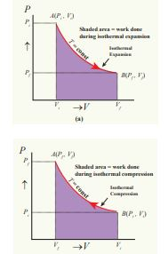

**Figure 8.27** Work done in an isothermal process.

work done on the gas which turns out to be the area with a negative sign.

**Note**
To calculate the work done in an isothermal process, we assume that the process is
quasi-static. If it is not quasi-static we cannot substitute P = \frac{\mu RT}{V}  in equation(8.31). It is because the ideal gas law is not valid for non equilibrium states. But equation (8.34) is valid even when the isothermal process is not quasi-static. This is because the state variables like pressure and volume depend on initial and final state alone of an ideal gas and do not depend on the way the final state is reached. The assumption of ‘quasi-static’ requires to do the integration.

**EXAMPLE 8.16**

A 0.5 mole of gas at temperature 300 K expands isothermally from an initial volume of 2 L to 6 L 
(a) What is the work done by the gas? 
(b) Estimate the heat added to the gas? 
(c) What is the final pressure of the gas? (The value of gas constant, R = 8.31 \, \text{J mol}^{-1} \text{K}^{-1} 

**_Solution_**

(a) We know that work done by the gas in an isothermal expansion

Since µ = 0.5

 W = 0.5 \, \text{mol} \times 8.31 \, \text{J/mol K} \times 300 \, \text{K} \times \ln\left(\frac{6L}{2L}\right) 

_W_ = 1.369 _kJ_ 

Note that W is positive since the work is done by the gas.
(b) From the First law of thermodynamics, in an isothermal process the heat supplied is spent to do work.  

Therefore, Q = W = 1.369 kJ. Thus Q is also positive which implies that heat flows in to the system. 
(c) For an isothermal process

 \frac{P_i}{V_i} = \frac{P_f}{V_f} = \mu RT 

P_f = \frac{\mu R T}{V_f} = \frac{0.5 \, \text{mol} \times 8.31 \, \text{J mol}^{-1} \cdot \text{K}^{-1} \times 300 \, \text{K}}{6 \times 10^{-3} \, \text{m}^3} = 207.75 \, \text{kPa} 

**EXAMPLE 8.17**

The following PV curve shows two isothermal processes for two different temperatures and. Identify the higher temperature of these two.

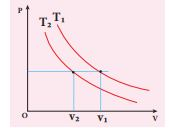

To determine the curve corresponding to higher temperature, draw a horizontal line parallel to x axis as shown in the figure. This is the constant pressure line. The volumes _V_1 and _V_2 belong to same pressure as the vertical lines from _V_1 and _V_2 meet the constant pressure line.

At constant pressure, higher the volume of the gas, higher will be the temperature. From the figure, as V1 > V2 we conclude T1 > T2. In general the isothermal curve closer to the origin, has lower temperature

## Adiabatic process

This is a process in which no heat flows into or out of the system (Q=0). But the gas can expand by spending its internal energy or gas can be compressed through some external work. So the pressure, volume and temperature of the system may change in an adiabatic process.

For an adiabatic process, the first law becomes ΔU = −W.

This implies that the work is done by the gas at the expense of internal energy or work is done on the system which increases its internal energy. 
The adiabatic process can be achieved by the following methods

(i) Thermally insulating the system from surroundings so that no heat flows into or out of the system; for example, when thermally insulated cylinder of gas is compressed (adiabatic compression) or expanded (adiabatic expansion) as shown in the Figure 8.28

**Figure 8.28** Adiabatic compression and expa

(ii) If the process occurs so quickly that there is no time to exchange heat with surroundings even though there is no thermal insulation. A few examples are shown in Figure 8.29.

**Examples:**

**Figure 8.29** (a) When the tyre bursts the air expands so quickly that there is no time to exchange heat with the surroundings.

**Figure 8.29** (b): When the gas is compressed or expanded so fast, the gas cannot exchange heat with surrounding even though there is no thermal insulation.

  

**Figure 8.29** (c): When the warm air rises from the surface of the Earth, it adiabatically expands. As a result the water vapor cools and condenses into water droplets forming a cloud.

The equation of state for an adiabatic process is given by

PV^{\gamma} = \text{constant}

Here γ is called adiabatic exponent (γ = _Cp_/_Cv_) which depends on the nature of the gas. The equation (8.35) implies that if the gas goes from an equilibrium state (_Pi,Vi_) to another equilibrium state (_Pf ,Vf_) adiabatically then it satisfies the relation

 \frac{P_i}{V_i^\gamma} = \frac{P_f}{V_f^\gamma} 

**Figure 8.30** PV diagram for adiabatic expans

The PV diagram of an adiabatic expansion and adiabatic compression process are shown in Figure 8.30. The PV diagram for an adiabatic process is also called _adiabat_ Note that the PV diagram for isothermal (Figure 8.25) and adiabatic (Figure 8.30) processes look similar. But actually the adiabatic curve is steeper than isothermal curve.

We can also rewrite the equation (8.35) in terms of T and V. From ideal gas equation,

P = \frac{\mu R T}{V} 

. Substituting this equation in the equation (8.35), we have


\frac{\mu RT}{V}\left(\frac{1}{V}\right)^\gamma = \text{constant} \quad \text{or} \quad \frac{T}{V}\left(\frac{1}{V}\right)^\gamma = \text{constant}


Note here that is another constant. So it can be written as

  T V^{\gamma-1} = \text{constant} 

The equation (8.37) implies that if the gas goes from an initial equilibrium state (_Ti_, _Vi_) to final equilibrium state (Tf, Vf) adiabatically then it satisfies the relation

  \frac{T_i}{V_i^{\gamma - 1}} = \frac{T_f}{V_f^{\gamma - 1}} 

The equation of state for adiabatic process can also be written in terms of T and P as

 T^{\gamma} P^{1-\gamma} = \text{constant}

(The proof of equation (8.39) left as an exercise).

**EXAMPLE 8.18**

We often have the experience of pumping air into bicycle tyre using hand pump. Consider the air inside the pump as a thermodynamic system having volume V at atmospheric pressure and room temperature, 27°C. Assume that the nozzle of the tyre is blocked and you push the pump to a volume 1/4 of V. Calculate the final temperature of air in the pump? (For air , since the nozzle is blocked air will not flow into tyre and it can be treated as an adiabatic compression). Take γ for air = 1.4

**_Solution_**

Here, the process is adiabatic compression. The volume is given and temperature is to be found. we can use the equation (8.38 )

\frac{T_i}{V_i^{\gamma - 1}} = \frac{T_f}{V_f^{\gamma - 1}}


 T_i = 300 \, \text{K} \, (273 + 27^\circ \text{C} = 300 \, \text{K}) 

 V_i = V \quad \text{and} \quad V_f = \frac{V}{4} 

 T_f = T_i \left(\frac{V_i}{V_f}\right)^{\gamma-1} = 300 \, \text{K} \times 41.4^{-1} = 300 \, \text{K} \times 1.741 

T_2 \approx 522 \, \text{K} \, \text{or} \, 249^\circ C 

This temperature is higher than the boiling point of water. So it is very dangerous to touch the nozzle of blocked pump when you pump air.  

When the piston is compressed so quickly that there is no time to exchange heat to the surrounding, the temperature of the gas increases rapidly. This is shown in the figure. This principle is used in the diesel engine. The air-gasoline mixer is compressed so quickly (adiabatic compression) that the temperature increases enormously, which is enough to produce a spark.

**Work done in an adiabatic process:**
 Consider μ moles of an ideal gas enclosed in a cylinder having perfectly non conducting walls and base. A frictionless and insulating piston of cross sectional area A is fitted in the cylinder as shown in Figure 8.31.

**Figure 8.31** Work done in an adiabatic process

Let W be the work done when the system goes from the initial state (_P_i,_V_i,_T_i) to the final state (Pf,Vf,Tf) adiabatically.
 W = \int_{V_i}^{V_f} P \, dV 

By assuming that the adiabatic process occurs quasi-statically, at every stage the ideal gas law is valid. Under this condition, the adiabatic equation of state is PV^\gamma = \text{constant} \quad \text{or} \quad P = \frac{\text{constant}}{V^\gamma}
can be substituted in the equation (8.40), we get

 

From ideal gas law,
 \frac{P_f}{V_f} = \frac{\mu R T_f}{\mu R} 

 \frac{P_i}{V_i} = \frac{\mu R T_i}{\mu R} 
Substituting in equation (8.41), we get

 W_{\text{adia}} = \mu \gamma R^{-1} (T_i - T_f) 

In adiabatic expansion, work is done by the gas. i.e.,  W_{\text{adia}} is positive. As  Ti>Tf , the gas cools during adiabatic expansion. In adiabatic compression, work is done on the gas. i.e., W_{\text{adia}}  is negative. As  Ti>Tf, the temperature of the gas increases during adiabatic compression.  

**Note** 
Even though we have derived equations (8.41) and (8.42) by assuming that the adiabatic process is quasi-static, both the equations are valid even if the process is not quasi- static. This is because P and V are state variables and are independent of how the state is arrived. 
In the adiabatic PV diagram shown in the Figure 8.32, the area under the adiabatic curve from initial state to final state will give the total work done in adiabatic process.

**Figure 8.32** PV diagram -Work done in the adiabatic process

To differentiate between isothermal and adiabatic curves in (Figure 8.32) the adiabatic curve is drawn along with isothermal curve for _T_f and _T_i. Note that adiabatic curve is steeper than isothermal curve. This is because γ > 1 always.

  

## Isobaric process

This is a thermodynamic process that occurs at constant pressure. Even though pressure is constant in this process, temperature, volume and internal energy are not constant. From the ideal gas equation, we have

V = \frac{\mu R}{P} T
Here, \frac{\mu R}{P} = \text{constant} 

In an isobaric process the temperature is directly proportional to volume.

_V_ ∝ _T_ (Isobaric process) 

This implies that for a isobaric process, the V-T graph is a straight line passing through the origin. 
If a gas goes from a state (_V_i ,_T_i) to (_V_f ,_T_f) at constant pressure, then the system satisfies the following equation
\frac{T_f}{V_f} = \frac{T_i}{V_i} 

Examples for Isobaric process: (i) When the gas is heated and pushes the piston so that it exerts a force equivalent to atmospheric pressure plus the force due to gravity then this process is isobaric. This is shown in Figure 8.33

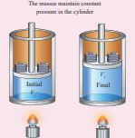

**Figure 8.33** Isobaric process

(ii) Most of the cooking processes in our kitchen are isobaric processes. When the food is cooked in an open vessel, the pressure above the food is always at atmospheric pressure. This is shown in Figure 8.34

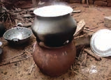

**Figure 8.34** Isobaric process

The PV diagram for an isobaric process is a horizontal line parallel to volume axis as shown in Figure 8.35. Figure 8.35 
(a) represents isobaric process where volume decreases Figure 8.35 
(b) represents isobaric process where volume increases

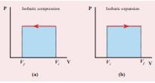

**Figure 8.35** PV diagram for an isobaric process

The work done in an isobaric process: Work done by the gas

 W = \int_{V_i}^{V_f} P \, dV 

In an isobaric process, the pressure is constant, so P comes out of the integral,

 W = \int_{V_i}^{V_f} P \, dV 
W = P(V_f - V_i) = P\Delta V 

Where Δ_V_ denotes change in the volume. If ΔV is negative, W is also negative. This implies that the work is done on the gas. If Δ_V_ is positive, W is also positive, implying that work is done by the gas. The equation (8.48) can also be rewritten using the ideal gas equation. From ideal gas equation

PV = \mu RT

V = \frac{\mu RT}{P}

Substituting this in equation (8.48) we get

 W = \mu R T_f \left(1 - \frac{T}{T_f}\right) 

In the PV diagram, area under the isobaric curve is equal to the work done in isobaric process. The shaded area in the following Figure8.36 is equal to the work done by the gas.

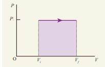

**Figure 8.36** Work done in an isobaric process

The first law of thermodynamics for isobaric process is given by  

 \Delta U = Q - P \Delta V 

**EXAMPLE 8.19**

The following graph shows a V-T graph for isobaric processes at two different pressures. Identify which one occurs at higher pressure.

**_Solution_** 
From the ideal gas equation V = \mu R \frac{P}{T} 
,V-T graph is a straight line passing the origin.  \text{slope} = \frac{\mu R}{P} 

_P_ The slope of V-T graph is inversely proportional to the pressure. If the slope is greater, lower is the pressure.

Here _P_1 has larger slope than _P2_. So _P2_ > _P1_.

Suppose the graph is drawn between T and V (Temperature along the x-axis and Volume along the y-axis) then will we still have _P2_ > _P1_?

**EXAMPLE 8.20**

One mole of an ideal gas initially kept in a cylinder at pressure 1 MPa and temperature 27°C is made to expand until its volume is doubled. 
(a) How much work is done if the expansion is (i) adiabatic (ii) isobaric (iii) isothermal?

(b) Identify the processes in which work done is least and is maximum.

(c) Show each process on a PV diagram. (d) Name the processes in which the heat transfer is maximum and minimum.

Take \gamma = \frac{5}{3} and R = 8.3 \, \text{J mol}^{-1} \, \text{K}^{-1}

**_Solution_**

(a) (i) In an adiabatic process the work done by the system is
W_{\text{adia}} = \mu \gamma R^{-1}(T_i - T_f)
To find the final temperature Tf , we can use adiabatic equation of state.
 {T_f}{V_f^{\gamma-1}} = {T_i}{V_i^{\gamma-1}} 

  T_f = T_i \left(\frac{V_i}{V_f}\right)^{\frac{\gamma - 1}{\gamma}} = 300 \times \left(\frac{1}{2}\right)^{\frac{2}{3}} 
0.63 \times 300 \, \text{K} = 189.8 \, \text{K}

 W = 1 \times 8.3 \times \frac{3}{2} (300 - 189.8) = 1.37 \, \text{kJ} 

(ii) In an isobaric process the work done by the system

 W = P\Delta V = P(V_f - V_i) 

and _Vf_ = _2Vi_ so _W_ = _2PVi_

To find Vi, we can use the ideal gas law for initial state.
  \frac{P_i}{V_i} = RT 
 V_i = \frac{RT}{P_i} = \frac{8.3 \times 300}{1 \times 10^{-6}} = 24.9 \times 10^{-4} \, \text{m}^3 

The work done during isobaric process, _W_ = 2 × 106 × 24.9 × 10−4 = 4.9 _kJ_

(iii) In an isothermal process the work done by the system,

 W = \mu RT \ln \left( \frac{V_f}{V_i} \right)  

In an isothermal process the initial room temperature is constant.

_W_ = 1 × 8.3 × 300 × _ln_(2) = 1.7_kJ_  

(b) Comparing all three processes, we see that the work done in the isobaric process is the greatest, and work done in the adiabatic process is the least.

(c) The PV diagram is shown in the Figure.

The area under the curve AB = Work done during the isobaric process The area under the curve AC = Work done during the isothermal process
 The area under the curve AD= Work done during the adiabatic process
 From the PV diagram the area under the curve AB is more, implying that the work done in isobaric process is highest and work done in adiabatic process is least. (d) In an adiabatic process no heat enters

into the system or leaves from the system. In an isobaric process the work done is more so heat supplied should be more compared to an isothermal process.

## Isochoric process

This is a thermodynamic process in which the volume of the system is kept constant. But pressure, temperature and internal energy continue to be variables.

  The pressure - volume graph for an isochoric process is a vertical line parallel to pressure axis as shown in Figure 8.37

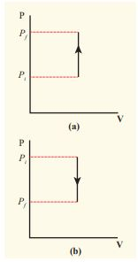

**Figure 8.37** Isochoric process with (a) increased pressure and (b) decreased pressure

The equation of state for an isochoric process is given by
 P = \frac{\mu R}{V} ({T})
where  P = {\mu R}{V} = constant 

We can infer that the pressure is directly proportional to temperature. This implies that the P-T graph for an isochoric process is a straight line passing through origin. If a gas goes from state (_Pi_,_Ti_) to (_Pf_ ,_Tf_) at constant volume, then the system satisfies the following equation  
 \frac{P_i}{T_i} = \frac{P_f}{T_f} 

For an isochoric processes, Δ_V_\=0 and _W_\=0. Then the first law becomes

 \Delta U = Q 

Implying that the heat supplied is used to increase only the internal energy. As a result the temperature increases and pressure also increases. This is shown in Figure 8.38

**Figure 8.38** Isochoric process

Suppose a system loses heat to the surroundings through conducting walls by keeping the volume constant, then its internal energy decreases. As a result the temperature decreases; the pressure also decreases.

**Examples:** 
1\. When food is cooked by closing with a

lid as shown in figure.

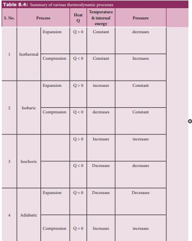

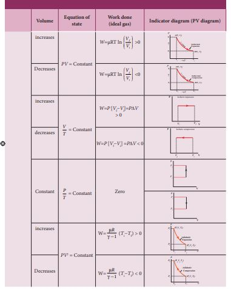

When food is being cooked in this closed position, after a certain time you can observe the lid is being pushed upwards by the water steam. This is because when the lid is closed, the volume is kept constant. As the heat continuously supplied, the pressure increases and water steam tries to push the lid upwards.

2\. In automobiles the petrol engine undergoes four processes. First the piston is adiabatically compressed to some volume as shown in the Figure (a). In the second process (Figure (b)), the volume of the air-fuel mixture is kept constant and heat is being added. As a result the temperature and pressure are increased. This is an isochoric process. For a third stroke (Figure (c)) there will be an adiabatic expansion, and fourth stroke again isochoric process by keeping the piston immoveable (Figure (d)).

The summary of various thermodynamic processes is give in the Table 8.4.

**EXAMPLE 8.21**

500 g of water is heated from 30°C to 60°C. Ignoring the slight expansion of water, calculate the change in internal energy of the water? (specific heat of water 4184 J/kg.K)  

**_Solution_**

When the water is heated from 30°C to 60°C,there is only a slight change in its volume. So we can treat this process as isochoric. In an isochoric process the work done by the system is zero. The given heat supplied is used to increase only the internal energy.

∆U = Q = msv ∆T

The mass of water = 500 g =0.5 kg

The change in temperature = 30K

The heat Q = 0.5×4184×30 = 62.76 kJ

## Cyclic processes

This is a thermodynamic process in which the thermodynamic system returns to its initial state after undergoing a series of changes. Since the system comes back to the initial state, the change in the internal energy is zero. In cyclic process, heat can flow in to system and heat flow out of the system. From the first law of thermodynamics, the net heat transferred to the system is equal to work done by the gas.

  Q_{\text{net}} = Q_{\text{in}} - Q_{\text{out}} = W \text{ (for a cyclic process)}  

## PV diagram for a cyclic process

In the PV diagram the cyclic process is represented by a closed curve. Let the gas undergo a cyclic process in which it returns to the initial stage after an expansion and compression as shown in Figure 8.39

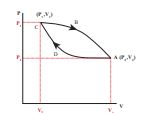

**Figure 8.39** PV diagram for cyclic process

Let W1 be the work done by the gas during expansion from volume V1 to volume V2. It is equal to area under the graph CBA as shown in Figure 8.40 (a) .

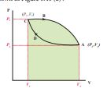

**Figure 8.40** (a) W for path CBA

**Figure 8.40** (b) W for path ADC

Let W2 be the work done on the gas during compression from volume V2 to volume V1. It is equal to the area under the graph ADC as shown in Figure 8.40 (b)

The total work done in this cyclic process = W1 - W2 = Green shaded area inside the loop, as shown in Figure 8.41.

**Figure 8.41** Net work done in a cyclic process

Thus the net work done during the cyclic process shown above is not zero. In general the net work done can be positive or negative. If the net work done is positive, then work done by the system is greater than the work done on the system. If the net work done is negative then the work done by the system is less than the work done on the system.

**Note** Further, in a cyclic process the net work done is positive if the process goes clockwise and net work done is negative if the process goes anti-clockwise. In Figure 8.41the process goes clockwise.

**EXAMPLE 8.22**

The PV diagrams for a thermodynamical system is given in the figure below. Calculate the total work done in each of the cyclic processes shown.

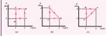

**Solution**
In the case (a) the closed curve is anticlockwise. So the net work done is negative, implying that the work done on the system is greater than the work done by the system. The area under the curve BC will give work done on the gas (isobaric compression) and area under the curve DA (work done by the system) will give the total work done by the system.

Area under the curve BC = Area of rectangle BC12 = 1 × 4= − 4_J_

Area under the curve DA = 1 × 2= + 2_J_

Net work done in cyclic process = −4 + 2= −2 J

In the case (b) the closed curve is clockwise. So the net work done is positive, implying that the work done on the system is less than the work done by the system. Area under the curve BC will give work done on the gas (isobaric compression) and area under the curve AB will give the total work done by the system.

Area under the curve AB = rectangle area+

triangle area =   (1 \times 2) + \frac{1}{2} \times 1 \times 2 = 3 \, \text{J} 

Area under the curve BC = rectangle area = 1 × 2 = − _2J_ Network done in the cyclic process = 1 J, which is positive.

In the case (c) the closed curve is anticlockwise. So the net work done is negative, implying that the work done on the system is greater than work done by the system. The area under the curve AB will give the work done on the gas (isobaric compression) and area under the curve CA (work done by the system) will give the total work done by the system. The area under the curve AB =Rectangle of area = 4 × 1 = - _4J_ The area under the curve CA = Rectangle

area + triangle area =  (1 \times 2) + \frac{1}{2} \times 1 \times 2 = 3 \, \text{J} The total work in the cyclic process = -1 J. It is negative

## Limitations of first law of thermodynamics

The first law of thermodynamics explains well the inter convertibility of heat and work. But it does not indicate the direction of change. For example, a. When a hot object is in contact with a cold object, heat always flows from the hot object to cold object but not in the reverse direction. According to first law, it is possible for the energy to flow from hot object to cold object or from cold object to hot object. But in nature the direction of heat flow is always from higher temperature to lower temperature.

b. When brakes are applied, a car stops due to friction and the work done against friction is converted into heat. But this heat is not reconverted to the kinetic energy of the car.

So the first law is not sufficient to explain many of natural phenomena.

## Reversible process

A thermodynamic process can be considered reversible only if it possible to retrace the path in the opposite direction in such a way that the system and surroundings pass through the same states as in the initial,direct process. Example: A quasi–static isothermal expansion of gas, slow compression and expansion of a spring. Conditions for reversible process:

1\. The process should proceed at an extremely slow rate.

2\. The system should remain in mechanical, thermal and chemical equilibrium state at all the times with the surroundings, during the process.

3\. No dissipative forces such as friction, viscosity, electrical resistance should be present.

**Note** All reversible processes are quasi-static but all quasi- static processes need not be reversible. For example when we push the piston very slowly, if there is friction between cylinder wall and piston some amount of energy is lost to surroundings, which cannot be retrieved back.

**Irreversible process:** All natural processes are irreversible. Irreversible process cannot be plotted in a PV diagram, because these processes cannot have unique values of pressure, temperature at every stage of the process.  

The first law of thermodynamics is the statement about conservation of energy in a thermodynamic process. For example, if a hotter object is placed on a colder object, heat flows from hotter to colder object. Why does heat not flow from the colder object to hotter object? Even if energy flows from colder object to hotter object, the first law of thermodynamics is not violated. For example, if 5 J of heat flows form hotter to colder or from colder to hotter objects the total internal energy of this combined system remains the same. But 5 J of heat never flows from the colder object to hotter object. In nature all such process occur only in one direction but not in the reverse direction, even if the energy is conserved in both the processes. Thus the first law of thermodynamics has no explanation for this irreversibility. When the scientists of the eighteenth century tried to explain this irreversibility, they discovered a new law of nature. This is called the second law of thermodynamics. According to second law of thermodynamics

“Heat always flows from hotter object to colder object spontaneously”. This is known as the Clausius form of second law of thermodynamics.

**EXAMPLE 8.23**

Give some examples of irreversible processes. All naturally occuring processes are irreversible. Here we give some interesting examples. 

(a) When we open a gas bottle, the gas molecules slowly spread into the entire room. These gas molecules can never get back in to the bottle.

(b) Suppose one drop of an ink is dropped in water, the ink droplet slowly spreads in the water. It is impossible to get the ink droplet back.

(c) When an object falls from some height, as soon as it hits the earth it comes to rest. All the kinetic energy of the object is converted to kinetic energy of molecules of the earth surface, molecules of the object and small amount goes as sound energy. The spreaded kinetic energy to the molecules never collected back and object never goes up by itself.

Note that according to first law of thermodynamics all the above processes are possible in both directions. But second law of thermodynamics forbids The processes to occur in the reverse direction. The second law of thermodynamics is one of the very important laws of nature. It controls the way the natural processes occur.