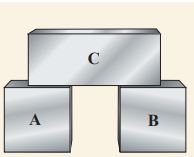

The zeroth law of thermodynamics states that if two systems, _A_ and _B_, are in thermal equilibrium with a third system, _C_,

**Figure 8.18** (a) Two systems A and B in therm systems A and B are in thermal contact, they a other.

then _A_ and _B_ are in thermal equilibrium with each other. Consider three systems A, B and C which are initially at different temperatures. Assume that A and B are not in thermal contact with each other as shown in Figure 8.18 (a) but each of them is in thermal contact with a third system C. After a lapse of time, system A will be in thermal equilibrium with C and B also will be in thermal equilibrium with C. In this condition, if the systems A and B are kept in thermal contact as shown in the Figure 8.18 (b), there is no flow of heat between the systems A and B. It implies that the system A and B are also in thermal equilibrium with each other. Once the three systems are at thermal equilibrium, there will be no heat flow between them as they are at the same temperature. This can be mathematically expressed as if, T_A = T_Cand T_B = T_C, it implies that T_A = T_C,where T_A = T_Band  T_C are the temperatures of the systems A, B, and C respectively.

Temperature is the property which determines whether the system is
in thermal equilibrium with other systems or not. Zeroth law enables us to determine the temperature. For example, when a thermometer is kept in contact with a human body, it reaches thermal equilibrium with the body. At this condition, the temperature of the thermometer will be same as the human body. This principle is used in finding the body temperature.

**Activity**  

We often associate the temperature as a measure of how hot or cold an object is while touching it. Can we use our sensory organs to determine the temperature of an object?

When you stand bare feet with one foot on the carpet and the other on the tiled floor, your foot on tiled floor feels cooler than the foot on the carpet even though both the tiled floor and carpet are at the same room temperature. It is because the tiled floor transfers the heat energy to your skin at higher rate than the carpet. So the skin is not measuring the actual temperature of the object; instead it measures the rate of heat energy transfer. But if we place a thermometer on the tiled floor or carpet it will show the same temperature.

