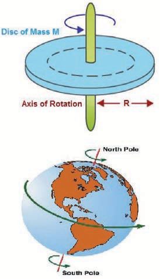

**Learning Objectives**

**In this unit, the student is exposed to** 
- different types of motions (linear, rotational and oscillatory)
-  the necessity for reference frames to explain the motion of objects
-  the meaning of vectors, scalars and their properties 
-  the role of scalar and vector products in physics 
-  the basics of differentiation and integration 
-  the notions of displacement and distance and their variation with time 
-  the notions of speed, velocity, acceleration and their graphs.
-  the notion of relative velocity 
-  kinematic equations of motion for constant acceleration 
-  analysis of various types of motion of objects under gravitational force
-  radians and degrees 
-  uniform circular motion, centripetal acceleration and centripetal force.
<!-- 
# 2.1 INTRODUCTION

Physics is basically an experimental science and rests on two pillars–Experiments and mathematics. Two thousand three hundred years ago the Greek librarian Eratosthenes measured the radius of the Earth. The size of the atom was measured much later, only in the beginning of the 20th century. The central aspect in physics is motion. Motion is found at all levels–from microscopic level (within the atom) to macroscopic and galactic level (planetary system and beyond). In short the entire Universe is governed by various types of motion. The study of various types of motion is expressed using the language of mathematics.

How do objects move? How fast or slow do they move? For example, when ten athletes run in a race, all of them do not run in the same manner. Their performance cannot be qualitatively recorded by usage of words like ‘fastest’, ‘faster’, ‘average’, ‘slower’ or ‘slowest’. It has to be quantified. Quantifying means assigning numbers to each athlete’s motion. Comparing these numbers, one can analyse how fast or slow each athlete runs when compared to others. In this unit, the basic mathematics needed for analyzing motion in terms of its direction and magnitude is covered.

Kinematics is the branch of mechanics which deals with the motion of objects without taking force into account. The Greek word “kinema” means “motion”. 

## CONCEPT OF REST AND MOTION

The concept of rest and motion can be well understood by the following elucidation (Figure 2.1). A person sitting in a moving bus is at rest with respect to a fellow passenger but is in motion with respect to a person outside the bus. The concepts of rest and motion have meaning only with respect to some reference frame. To understand rest or motion we need a convenient fixed reference frame.

**Figure 2.1** Frame of Reference

**Frame of Reference:** 

If we imagine a coordinate system and the position of an object is described relative to it, then such a coordinate system is called “Cartesian coordinate system” as shown in Figure 2.2
At any given instant of time, the frame of reference with respect to which the position of the object is described in terms of position coordinates (x, y, z) (i.e., distances of the given position of an object along the x, y, and z–axes.) is called **“Cartesian coordinate system”** as shown in Figure 2.2

**Figure 2.2** Cartesian coordinate system

It is to be noted that if the _x, y_ and _z_ axes are drawn in anticlockwise direction then the coordinate system is called as “right– handed Cartesian coordinate system”. Though other coordinate systems do exist, in physics we conventionally follow the right–handed coordinate system as shown in Figure 2.3.

**Figure 2.3** Right handed coordinate system

The following Figure 2.4 illustrates the difference between left and right handed coordinate systems.

**Figure 2.4 Right and left handed** coordinate systems

**Point mass** 

To explain the motion of an object which has finite mass, the concept of “point mass” is required and is very useful. Let the mass of any object be assumed to be concentrated at a point. Then this idealized mass is called “point mass”. It has no internal structure like shape and size. Mathematically a point mass has finite mass with zero dimension. Even though in reality a point mass does not exist, it often simplifies our calculations. It is to be noted that the term “point mass” is a relative term. It has meaning only with respect to a reference frame and with respect to the kind of motion that we analyse.

**Examples** 
- To analyse the motion of Earth with respect to Sun, Earth can be treated as a point mass. This is because the distance between the Sun and Earth is very large compared to the size of the Earth.

- If we throw an irregular object like a small stone in the air, to analyse its motion it is simpler to consider the stone as a point mass as it moves in space. The size of the stone is very much smaller than the distance through which it travels.

**Types of motion** 

In our day‒to‒day life the following kinds of motion are observed:
**a) Linear motion** An object is said to be in linear motion if it moves in a straight line.

**Examples** 
- An athlete running on a straight track 
- A particle falling vertically downwards to the Earth.

**b) Circular motion** 
Circular motion is defined as a motion described by an object traversing a circular path.

**Examples** 
- The whirling motion of a stone attached to a string
- The motion of a satellite around the Earth

These two circular motions are shown in Figure 2.5

**Figure 2.5** Examples of circular motion

**c) Rotational motion** If any object moves in a rotational motion about an axis, the motion is called ‘rotation’. During rotation every point in the object transverses a circular path about an axis, (except the points located on the axis).

**Examples** „ Rotation of a disc about an axis through

its centre „ Spinning of the Earth about its own axis.

These two rotational motions are shown in Figure 2.6.  

**Figure 2.6** Examples of Rotational motion

**d) Vibratory motion** If an object or particle executes a _to–and– fro motion about a fixed point, it is said to_ be in vibratory motion. This is sometimes also called oscillatory motion.

**Examples** „ 
- Vibration of a string on a guitar 
- Movement of a swing

These motions are shown in Figure 2.7

**Figure 2.7 Examples of Vibratory motion**

Other types of motion like elliptical motion and helical motion are also possible.

**Motion in One, Two and Three Dimensions** 

Let the position of a particle in space be expressed in terms of rectangular coordinates x, y and z. When these coordinates change with time, then the particle is said to be in motion. However, it is not necessary that all the three coordinates should together change with time. Even if one or two coordinates change with time, the particle is said to be in motion. Then we have the following classification.

**(i) Motion in one dimension**

_One dimensional motion is the motion of a particle moving along a straight line._

This motion is sometimes known as rectilinear or linear motion.

In this motion, only one of the three rectangular coordinates specifying the position of the object changes with time.

For example, if a car moves from position A to position B along _x_–direction, as shown in Figure 2.8, then a variation in x–coordinate alone is noticed.

**Figure 2.8 Motion of a particle along one dimension**

**Examples** 
- Motion of a train along a straight railway track. 
- An object falling freely under gravity close to Earth.

**(ii) Motion in two dimensions** 

_If a particle is moving along a curved_ _path in a plane, then it is said to be in two dimensional motion._

In this motion, two of the three rectangular coordinates specifying the position of object change with time.

For instance, when a particle is moving in the _y – z_ plane, x does not vary, but _y_ and _z_ vary as shown in Figure 2.9

**Figure 2.9 Motion of a particle along two dimensions**

**Examples** 
- Motion of a coin on a carrom board. 
- An insect crawling over the floor of a room. 

**(iii) Motion in three dimensions** 

_A particle moving in usual three_ _dimensional space has three dimensional motion._

In this motion, all the three coordinates specifying the position of an object change with respect to time. When a particle moves in three dimensions, all the three coordinates _x_, _y_ and _z_ will vary.

**Examples**  
- A bird flying in the sky. 
- Random motion of a gas molecule. 
- Flying of a kite on a windy day.

## ELEMENTARY CONCEPTS OF VECTOR ALGEBRA

In physics, some quantities possess only magnitude and some quantities possess both magnitude and direction. To understand these physical quantities, it is very important to know the properties of vectors and scalars.

**Scalar** 

It is a property which can be described only by magnitude. In physics a number of quantities can be described by scalars.

**Examples** 

Distance, mass, temperature, speed and energy.

**Vector** 

It is a quantity which is described by both magnitude and direction. Geometrically a vector is a directed line segment which is shown in Figure 2.10. In physics certain quantities can be described only by vectors.

**Figure 2.10 Geometrical representation of a vector**

**Examples** Force, velocity, displacement, position vector, acceleration, linear momentum and angular momentum.  

### Magnitude of a Vector

The length of a vector is called magnitude of the vector. It is always a positive quantity. Sometimes the magnitude of a vector is also called ‘norm’ of the vector. For a vector _A_, the magnitude or norm is denoted by
|_A_| or simply ‘_A_’ (Figure 2.11).

**Figure 2.11 Magnitude of a vector**

## Different types of Vectors

1. **Equal vectors:** Two vectors   _A_ and _B_ are said to be equal when they have equal magnitude and same direction and represent the same physical quantity (Figure 2.12.).

**Figure 2.12 Geometrical representation of equal vectors**

**(a)Collinear vectors**: Collinear vectors are those which act along the same line. The angle between them can be 0° or 180°.

**(i) Parallel Vectors**: 

If two vectors _A_ and _B_ act in the same direction along the same line or on parallel lines, then the angle between them is 00 (Figure 2.13).

**Figure 2.13 Geometrical representation of parallel vectors**

**(ii) Anti–parallel vectors:** 

Two vectors _A_ and _B_ are said to be anti–parallel when they are in opposite directions along the same line or on parallel lines. Then the angle between them is 1800 (Figure 2.14).

**Figure 2.14 Geometrical representation of anti– parallel vectors.**

2. **Unit vector**: A vector divided by its magnitude is a unit vector. The unit vector for ˆ_A is denoted by A_ is denoted by ˆ_A is denoted by A_ (read as A cap or A hat). It has a magnitude equal to unity or one.

FORMULA
Thus, we can say that the unit vector specifies only the direction of the vector quantity.

**3. Orthogonal unit vectors:** Let i, j and k be three unit vectors which specify the directions along positive _x_–axis, positive  _y–_axis and positive _z_–axis respectively. These three unit vectors are directed perpendicular to each other, the angle between any two of them is 90°. ˆ,̂ ˆ_i j and k_ a ˆ_j and k_ are examples of orthogonal vectors.Two vectors which are perpendicular to each other are called orthogonal vectors as is shown in the Figure 2.15

**Figure 2.15 Orthogonal unit vectors**

## Addition of Vectors

Since vectors have both magnitude and direction they cannot be added by the method of ordinary algebra. Thus, vectors can be added geometrically or analytically using certain rules called ‘vector algebra’. In order to find the sum (resultant) of two vectors, which are inclined to each other, we use (i) Triangular law of addition method or (ii) Parallelogram law of vectors.

**Triangular Law of addition method** 

Let us consider two vectors _A and B_ as shown in Figure 2.16. 

**figure 2.16 Head And Tail Of The Vectors**

To find the resultant of the two vectors we apply the triangular law of addition as follows:

Represent the vectors _A and B_ and by the two adjacent sides of a triangle taken in the same order. Then the resultant is given by the third side of the triangle taken in the reverse order as shown in Figure 2.17.

**Figure 2.17 Triangle law of addition**

To explain further, the head of the first vector _A_ is connected to the tail of the second vector _B_ . Let θ be the angle between _A B_ and . Then _R_ is the resultant vector connecting the tail of the first vector _A_ to the head of the second vector _B_. The magnitude of _R_ (resultant) is given geometrically by the length of _R_ (OQ) and the direction of the resultant vector is the angle between _R_ and _A_ . Thus we write R = A + B .

**(1) Magnitude of resultant vector** The magnitude and angle of the resultant vector are determined as follows.

From Figure 2.18, consider the triangle ABN, which is obtained by extending the side OA to ON. ABN is a right angled triangle.  

**Figure 2.18 Resultant vector and its direction by triangle law of addition.**

From Figure 2.18

FORMULAS

which is the magnitude of the resultant of _A and B_ 

**(2) Direction of resultant vectors:** If θ is the angle between A and  B, then

|_A+ B| A B AB_\+ = + +2 2 2 cosθ (2.1)

If 

_R_ makes an angle α with 

_A_ , then in ∆OBN,

tanα = _BN / ON_ = _BN / OA + AN_
tanα = Bsin / A+Bcos
⇒ α =  tan − 1 (B sin θ/ A + B cos θ )

**EXAMPLE 2.1**

Two vectors A and B of magnitude 5 units and 7 units respectively make an angle 60° with each other as shown below. Find the magnitude of the resultant vector and its direction with respect to the vector

**_Solution_**

By following the law of triangular addition, the resultant vector is given by

_R =  A + B_

as illustrated below

The magnitude of the resultant vector 

---
**Note**
Another method to determine the resultant and angle of resultant of two vectors is the Parallelogram Law of vector addition method. It is given in appendix 2.1

---
### Subtraction of vectors

Since vectors have both magnitude and direction two vectors cannot be subtracted from each other by the method of ordinary algebra. Thus, this subtraction can be done either geometrically or analytically. We shall now discuss subtraction of two vectors geometrically using the Figure 2.19

For two non-zero vectors _A_ and _B_ which are inclined to each other at an angle θ, the difference _A - B_ is obtained as follows. First obtain _A B_− as in Figure 2.19. The angle between _A and B_ is 180–θ.

**Figure 2.19 Subtraction of vectors**

The difference _A - B_− is the same as the resultant of _A_ and B_. We can write _A - B = A + (- B_) and using the equation (2.1), we have
FORMULa

Since, cos cos180 −( ) = −θ θ , we get

FORMULA

Again from the Figure 2.19, and using an equation similar to equation (2.2) we have

FORMULA

But sin sin cos180 180° −( ) = ° −( ) =θ θ θ and hence we get

FORMULA 

Thus the difference  

_A B_− is a vector with magnitude and direction given by equations 2.4 and 2.6 respectively.

**EXAMPLE 2.2**

Two vectors _A_ and _B_ of magnitude 5 units and 7 units make an angle 60° with each other. Find the magnitude of the difference vector _A - B_ and its direction with respect to the vector _A_.

**_Solution_**

Using the equation (2.4),

FORMULAS 

The angle that  

_A - B_− makes with the vector _A_ is given by

## COMPONENTS OF A VECTOR

In the Cartesian coordinate system any vector _A_ can be resolved into three components along x, y and z directions. This is shown in Figure 2.20.

Consider a 3–dimensional coordinate system. With respect to this a vector can be written in component form as

FORMULAS

**Figure 2.20** Components of a vector in 2 dimensions and 3 dimensions

Here _Ax_ is the _x_–component of _A_, _Ay_ is the _y_–component of _A_ and _Az_ is the _z_ component of _A_.

In a 2–dimensional Cartesian coordinate system (which is shown in the Figure 2.20) the vector _A_ is given by
FORMULAS 

If _A_ makes an angle θ with x axis, and Ax and Ay are the components of _A_ along _x_–axis and _y_–axis respectively, then as shown in Figure 2.21,

Ax = A cosθ , Ay_ = Asinθ

where ‘A’ is the magnitude (length) of the vector

**Figure 2.21 Resolution of a vector**

**EXAMPLE 2.3**

What are the unit vectors along the negative x–direction, negative y–direction, and negative z– direction?

**_Solution_**

The unit vectors along the negative directions can be shown as in the following figure.  

Then we have:The unit vector along the negative x direction = î The unit vector along the negative y direction = ĵ The unit vector along the negative z direction = _k̂_ .

### Vector addition using components

In the previous section we have learnt about addition and subtraction of two vectors using geometric methods. But once we choose a coordinate system, the addition and subtraction of vectors becomes much easier to perform.

The two vectors _A_ and _B_ in a Cartesian coordinate system can be expressed as

FORMULAS

Then the addition of two vectors is equivalent to adding their corresponding x, y and z components.

FORMULAS 

Similarly the subtraction of two vectors is equivalent to subtracting the corresponding x, y and z components.

FORMULAS 

The above rules form an analytical way of adding and subtracting two vectors.

**EXAMPLE 2.4**

Two vectors _A_ and _B_ are given in the component form as 5 7  _A i j k_ and

FORMULAS 

---
**Note**
The addition of two vectors using components depends on the choice of the coordinate system. But the geometric way of adding and subtracting two vectors is independent of the coordinate system used.

---

## MULTIPLICATION OF VECTOR BY A SCALAR

A vector _A_ multiplied by a scalar λ results in another vector, λ_A_. If λ is a positive number then λ_A_ is also in the direction of _A_. If λ is a negative number, λ_A_ is in the opposite direction to the vector _A_.

**EXAMPLE 2.5**

Given the vector _A = 2i + 3j_, what is 3 _A_?

**_Solution_**

FORMULAS 

The vector 3 _A_ is in the same direction as vector _A_.

**EXAMPLE 2.6**

A vector _A_ is given as in the following Figure. Find 4A  and − 4A 

**_Solution_**

FORMULAS 

In physics, certain vector quantities can be defined as a scalar times another vector quantity.

**For example** 

1) Force

F = ma . Here mass ‘m’ is a scalar, and _a_ is the acceleration. Since ‘m’ is always a positive scalar, the direction of force is always in the direction of acceleration.

2 Linear momentum P = m / v . Here _v_ is the velocity. The direction of linear momentum is also in the direction of velocity.

3) Force F = qE , Here the electric charge ‘q’ is a scalar, and _E_ is the electric field. Since charge can be positive or negative, the direction of force _F_ is correspondingly either in the direction of _E_ or opposite to the direction of _E_ .

### Scalar Product of Two Vectors

**Definition** 

The scalar product (or dot product) of two vectors is defined as the product of the magnitudes of both the vectors and the cosine of the angle between them.

Thus if there are two vectors _A and B_ having an angle θ between them, then their scalar product is defined as _A.B = AB_⋅cosθ. Here, _A B_ and are magnitudes of _A and B_ 

**Properties** 

(i) The product quantity _A . B_⋅ is always a scalar. It is positive if the angle between the vectors is acute (i.e., θ < 90°) and negative if the angle between them is obtuse (i.e. 90°<θ< 180°).

(ii) The scalar product is commutative, i.e._A.B= B.A_.  

(iii) The vectors obey distributive law i.e. _A (B+C) = (A + B)(A + C)

(iv) The angle between the vectors
θ = cos–1[A.B / AB]

(v) The scalar product of two vectors will be maximum when cos θ = 1, i.e. θ = 0°, i.e., when the vectors are parallel;
(A . B ) max = AB

(vi) The scalar product of two vectors will be minimum, when cos θ = –1, i.e. θ = 180°
(A . B) min = –AB, when the vectors are anti-parallel.

(vii) If two vectors _A_ and _B_ are perpendicular to each other then their scalar product _A . B_ = 0 , because cos 90°=0. Then the vectors _A_ and _B_ are said to be mutually orthogonal.

(viii) The scalar product of a vector with itself is termed as self–dot product and is given by
(A)^2 = A . A = AA cos θ = A2
Here angle θ = 0°
The magnitude or norm of the vector _A_ is 
FORMULAS 

(xi) In terms of components the scalar product of _A and B_ can be written as

The magnitude of vector |_A_| is given by
FORMULAS 

**EXAMPLE 2.7**

FORMULAS 

The angle between the two vectors is given by

FORMULAS 

**EXAMPLE 2.8**

Check whether the following vectors are orthogonal.

FORMULAS 

**_Solution_**

Hence _A B_ and are not orthogonal to each other. _C D_. = − =10 10 0  Hence, _C D_ and are orthogonal to each other.

It is also possible to geometrically show that the vectors _C and D_ are orthogonal to each other. This is shown in the following Figure.
FORMULAS 

In physics, the work done by a force _F_ to move an object through a small displacement _dr_ is defined as,

FORMULAS 

The work done is basically a scalar product between the force vector and the displacement vector. Apart from work done, there are other physical quantities which are also defined through scalar products.

---
**Note**
In uniform circular motion,the centripetal force is perpendicular to the displacement. Hence, work done by this force is zero.

---

## The Vector Product of Two Vectors

**Definition** 

_The vector product or cross product of two vectors is defined as another vector having a magnitude equal to the product of the magnitudes of two vectors and the sine of the angle between them. The direction of the product vector is perpendicular to the plane containing the two vectors, in accordance with the right hand screw rule or right hand thumb rule_ (Figure 2.22)_._

Thus, if A and B are two vectors, then their vector product is written as A × B which is a vector C defined by

C = A × B = (AB sin θ)n̂

The direction n̂ of A × B , i.e., C is perpendicular to the plane containing

**Figure 2.22 Vector product of two**

**_VECTOR PRODUCT (“CR_**

The vector product of _A_ and _B_ and is in the sense of advancement of a right handed screw rotated from A (first vector) to  B (second vector) through the smaller angle between them. Thus, if a right-handed screw whose axis is perpendicular to the plane formed by A and B,is rotated from A to B through the smaller angle between them, then the direction of advancement of the screw gives the direction of A × B i.e. C which is illustrated in Figure 2.22.

---
**Note**

According to Right Hand Rule, if the curvature of the fingers of the right hand represents the sense of rotation of the object, then the thumb, held perpendicular to the curvature of the fingers, represents the direction of the resultant _C_

---

**Properties of vector (cross) product.** 

(i) The vector product of any two vectors is always another vector whose direction is perpendicular to the plane containing these two vectors, i.e., orthogonal to both the vectors A and B, even though the vectors A and B may or may not be mutually orthogonal.

(ii) The vector product of two vectors is not commutative, i.e.,A × B ≠ B × A But., |A × B |= [B × A] 
Here it is worthwhile to note that |A × B| = |B × A| = ABsin θ i.e., in the case of the product vectors A B× and B × A, the magnitudes are equal but directions are opposite to each other.

(iii) The vector product of two vectors will have maximum magnitude when sin θ = 1, i.e., θ = 90° i.e., when the vectors _A_ and _B_ are orthogonal to each other.
_(A × B)max= ABn_

(iv) The vector product of two non–zero vectors will be minimum when sin|θ| = θ i.e or_0 = 00 180
i.e., the vector product of two non–zero vectors vanishes, if the vectors are either parallel or antiparallel.

(v) The self–cross product, i.e., product of a vector with itself is the null vector In physics the null vector 0 is simply denoted as zero.

(vi) The self–vector products of unit vectors are thus zero.

(vii) In the case of orthogonal unit vectors, ,̂ , ˆˆ_i j k_, in accordance with the right hand screw rule: Also, since the cross product is not commutative,

(viii) In terms of components, the vector product of two vectors 

FORMULAS 

Note that in the ĵ _th_ component the order of multiplication is different than ̂ _thi_ and _kth_ˆ components.

(ix) If two vectors _A and B_ form adjacent sides in a parallelogram, then the magnitude of _A × B_ will give the area of the parallelogram as represented graphically in Figure 2.23.

**Figure 2.23 Area of parallelogram**

(x) Since we can divide a parallelogram into two equal triangles as shown in the Figure 2.24, the area of a triangle with _A and B_ as sides is [1 / 2 ]_A × B_. This is shown in the Figure 2.24. (This fact will be used when we study Kepler’s laws in unit 6)

**Figure 2.24 Area of triangle**  

A number of quantities used in Physics are defined through vector products. Particularly physical quantities representing rotational effects like torque, angular momentum, are defined through vector products.

**Examples** 

(i) Torque τ = _r × F_ . where _F_ is Force and _r_ is position vector of a particle

(ii) Angular momentum _L = r × p_ where _p_ is the linear momentum 

(iii) Linear Velocity Formulas ×ω where ω is angular velocity

**EXAMPLE 2.9**

Two vectors are given as 2 3 

### Properties of the components of vectors

If two vectors _A_ and _B_ are equal, then their individual components are also equal.

Let _A = B_
Then 

| EXAMPLE 2.9Two  vectors  are g iven  as  ri 23ˆ ˆjk 5 ˆand Fi32ˆ ˆjk 4.ˆ  Fin d t he r esultant  vector τ =×rFSolutionijˆ ˆ kˆτ  = rF 23 5 3 24   (121 01ijˆ 58 ˆ 49 kˆ 22ijˆ 7 ˆ  13k |
|------|

| A × B2 |B |
  

**EXAMPLE 2.10**

Compare the components for the following vector equations a) 

_F_ \= _ma_ Here m is positive number b) _p_ \= 0

**_Solution_ Case (a):**



_F_ \= _ma_

ˆ ˆˆ ˆˆ ˆ    _x y z x y zF i F j F k ma i ma j ma k_

By comparing the components, we get

_F ma F max x y y_\= =, , _F maz z_\=

This implies that one vector equation is equivalent to three scalar equations.

**Case (b)**

_p_ \= 0

0 0ˆ 0ˆˆ ˆˆ ˆ    _x y zp i p j p k i j k_

By comparing the components, we get

_px =_ 0, py = 0, pz =0

**EXAMPLE 2.11**

Determine the value of the _T_ from the given vector equation.

5 6ˆ ˆ ˆ ˆ3  _j Tj j Tj_  

**2.6**

**_Solution_**

By comparing the components both sides, we can write

5 6 3− = +_T T_

− =1 4_T_

_T_ \= − 1 4

**EXAMPLE 2.12**

Compare the components of vector equation  FF++ FF=

Solution

We can resolve all the vectors in x, y and z components with respect to Cartesian coordinate system. Once we resolve the components we can separately equate the x components on both sides, y components on both sides, and z components on both the sides of the equation, we then get

## POSITION VECTOR

It is a vector which denotes the position of a particle at any instant of time, with respect to some reference frame or coordinate system.

The position vector r of the particle at a point P is given by

where x, y and z are components of _r_, Figure 2.25 shows the position vector _r_

**Figure 2.25 Position vector in Cartesian coordinate system**

**EXAMPLE 2.13**

Determine the position vectors for the following particles which are located at points P, Q, R, S.

**_Solution_**

The position vector for the point P is

The position vector for the point Q is

The position vector for the point R is

The position vector for the point S is

**EXAMPLE 2.14**

A person initially at rest starts to walk 2 m towards north, then 1 m towards east, then 5 m towards south and then 3 m towards west. What is the position vector of the person at the end of the trip?

**_Solution_**

As shown in the Figure, the positive x axis is taken as east direction, positive y direction is taken as north.

After the trip, the person reaches the point P whose position vector given by

Foumulas 

The displacement direction is south west.

## DISTANCE AND DISPLACEMENT

**Distance** is the actual path length travelled by an object in the given interval of time during the motion. It is a positive scalar quantity.

**Displacement is the difference between** the final and initial positions of the object in a given interval of time. It can also be defined as the shortest distance between these two positions of the object and its direction is from the initial to final position of the object, during the given interval of time**.** It is a vector quantity. Figure 2.26 illustrates the difference between displacement and distance.

**Figure 2.26 Distance and displacement**

**EXAMPLE 2.15**

Assume your school is located 2 km away from your home. In the morning you are going to school and in the evening you come back home. In this entire trip what is the distance travelled and the displacement covered?

**_Solution_**

The displacement covered is zero. It is because your initial and final positions are the same. But the distance travelled is 4 km.

**EXAMPLE 2.16**

An athlete covers 3 rounds on a circular track of radius 50 m. Calculate the total distance and displacement travelled by him.

**_Solution_**

The total distance the athlete covered =3x circumference of track

Distance = 3 × ×2 50π _m_ = 300× ×2 50π _m_ _m_ (or) Distance ≈ 300 x 3.14 ≈ 942 _m_

The displacement is zero, since the athlete reaches the same point A after three rounds from where he started.

### Displacement Vector in Cartesian Coordinate System

In terms of position vector, the displacement vector is given as follows. Let us consider a particle moving from a point P1 having position vector point P2 where its position vector is 

Formulas 

This displacement is also shown in Figure 2.27.

**Figure 2.27 Displacement vector**

**EXAMPLE 2.17**

Calculate the displacement vector for a particle moving from a point P to Q as shown below. Calculate the magnitude of displacement.

**_Solution_**

The magnitude of the displacement vector ∆ = + =_r_ 3 1 102 2 unit.

---
**Note**
(1) The Distance travelled by an object in motion in a given time is never negative or zero, it is always positive.

(2) The displacement of an object, in a given time can be positive, zero or negative.

(3) The displacement of an object can be equal or less than the distance travelled but never greater than distance travelled.

(4) The distance covered by an object between two positions can have many values, but the displacement between them has only one value (in magnitude).

---

## DIFFERENTIAL CALCULUS

**The Concept of a function** 

1) Any physical quantity is represented by a “function” in mathematics. Take the example of temperature T. We know that the temperature of the surroundings is changing throughout the day. It increases till noon and decreases in the evening. At any time “t” the temperature T has a unique value. Mathematically this variation can be represented by the notation ‘T (t)’ and it should be called “temperature as a function of time”. It implies that if the value of ‘t’ is given, then the function “T (t)” will give the value of the temperature at that time‘t’. Similarly, the position of a bus in motion along the x direction can be represented by x(t) and this is called ‘x' as a function of time’. Here ‘x’ denotes the x coordinate.

**_Example_**

Consider a function f(x) = x2. Sometimes it is also represented as y = x2. Here y is called the dependent variable and x is called independent variable. It means as x changes, y also changes. Once a physical quantity is represented by a function, one can study the variation of the function over time or over the independent variable on which the quantity depends. Calculus is the branch of mathematics used to analyse the change of any quantity.

If a function is represented by y = f(x), then dy/dx represents the derivative of y with respect to x. Mathematically this represents the variation of y with respect to change in x, for various continuous values of x.

Mathematically the derivative dy/dx is defined as follows

Formulas 

represents the limit that the quantity D D

**Figure 2.28 Derivative of a function**

**EXAMPLE 2.18**

Consider the function _y x_\= 2 . Calculate the derivative _dy_ _dx_ using the concept of

limit, at the point _x_ = 2.

**_Solution_**

Let us take two points given by

Formulas

If we take x1 = 2 and x2 = 2.5, then y1= 4 and y2 = (2.5)2 = 6.25
Formulas 

Graphically this is represented as shown in Figure 2.28.

If we take x1= 2 and x2 = 2.25, then y1= 4 and y2 = 5.0625

If we take x1= 2 and x2= 2.1, then y1= 4 and y2= 4.41

From the above table, the following inferences can be made.

- At a point x = 2, the derivative _dy / dx_= 4.

- It should also be mentioned here that D → D =_x does not mean that x_0 0 does not ean t at .  
- This is because, if we substitute ∆ =_x_ 0, D D

_y x_

becomes indeterminate.

In general, we can obtain the derivative of the function y = x2, as follows:

Formulas 

The table below shows the derivatives of some common functions used in physics

Function Derivative y = x dy/dx=1 y = x2 dy/dx=2x y = x3 dy/dx =3x2

Formulas

In physics, velocity, speed and acceleration are all derivatives with respect to time‘t’. This will be dealt with in the next section.

**EXAMPLE 2.19**

Find the derivative with respect to t, of the function x= A0 + A1t + A2 t2 where A0, A1 and A2 are constants.

**_Solution_**

Note **t**hat here the independent variable is ‘t’ and the dependent variable is ‘x’

## INTEGRAL CALCULUS

Integration is an area finding process. For certain geometric shapes we can directly find the area. But for irregular shapes the process of integration is used. Consider for example the areas of a rectangle and an irregularly shaped curve, as shown in Figure 2.29.

The area of the rectangle is simply given by A = length × breadth = (b–a) c

**Figure 2.29** Area of rectangular and irregular shape

But to find the area of the irregular shaped curve given by f(x), we divide the area into rectangular strips as shown in the Figure 2.30.
Formulas 

The area under the curve is approximately equal to sum of areas of each rectangular strip.

This is given by 
**Figure 2.30** Area under the curve using rectangular strip

Where _f a_( ) is the value of the function _f x_( ) at x = a, _f x_1( ) is the value of _f x_( ) for x = x1 and so on.

As we increase the number of strips, the area evaluated becomes more accurate. If the area under the curve is divided into N strips, the area under the curve is given by
(Note: As _N_ →∞, ∆ →_x_ 0)

The integration will give the total area under the curve f (x). This is shown in Figure 2.31.
formulas 

**Figure 2.31** Relation between su

**Examples** 

In physics the work done by a force F(_x_) on an object to move it from point _a_ to point _b_ in one dimension is given by

Formulas 

(No scalar products is required here, since motion here is in one dimension)

1) The work done is the area under the force displacement graph as shown in Figure 2.32

**Figure 2.32** Work done by the force

2) The impulse given by the force in an interval of time is calculated between  
Formulas 

the interval from time t = 0 to time t = t1 as

Formulas

The impulse is the area under the force function F (t) - t graph as shown in Figure 2.33.

**Figure 2.33** Impulse of a force

**Average velocity** 

Consider a particle located initially at point P having position vector _r_1\. In a time interval D_t_ the particle is moved to the point Q having position vector _r_2 . The displacement vector is This is shown in Figure 2.34.

The average velocity is defined as ratio of
the displacement vector to the corresponding
time interval

formulas

It is a vector quantity. The direction of average velocity is in the direction of the displacement vector  This is also shown in t Figure 2.34.

**Average speed**

The average speed is defined as the ratio of total path length travelled by the particle in a time interval. 

Average speed = total path length / total time

EXAMPLE 2.20
Consider an object travelling in a semi-circular path from point O to point P in 5 second, as shown in the Figure given below. Calculate the average velocity and average speed.

The average velocity is in the positive  direction. The average speed = total path length / time taken (the path is semi-circular)

formulas

Note that the average speed is greater than the magnitude of the average velocity.

**Instantaneous velocity or velocity**
The instantaneous velocity at an instant or simply ‘velocity’ at an instant t is defined as limiting value of the average velocity as ∆t → 0, evaluated at time t.
In other words, velocity is equal to rate
of change of position vector with respect to
time. Velocity is a vector quantity.

**EXAMPLE 2.21**
The position vector of a particle is given r = 2 t i ˆ + 3 t 2 j ˆ − 5 ˆ k . Speed of A = v A = a) Calculate the velocity and speed of the particle at any instant  b) Calculate the velocity and speed of the particle at time t = 2 s
Formulas 

Note that the particle has velocity components along x and y direction. Along the z direction the position has constant value (-5) which is independent of time. Hence there is no z-component for the velocity.

**EXAMPLE 2.22**
The velocity of three particles A, B, C are
given below. Which particle travels at the
greatest speed?

formulas

Solution

We know that speed is the magnitude of the velocity vector. Hence,

formulas 

**EXAMPLE 2.23**
Two cars are travelling with respective velocities v 1 = 10 m s -1 along east and v 2 = 10 m s -1 along west. What are the speeds of the cars?

_Solution_

Both cars have the same magnitude of velocity. This implies that both cars travel at the same speed even though they have velocities in different directions. Speed will not give the direction of motion.

**Momentum**
The linear momentum or simply momentum of a particle is defined as product of mass with velocity. It is denoted as ‘ p’. Momentum is also a vector quantity.

p = mv .

The direction of momentum is also in the direction of velocity, and the magnitude of momentum is equal to product of mass and speed of the particle.

p = mv

In component form the momentum can be written as 

Formulas 

Here p x = x component of momentum and is equal to mv x p y = y component of momentum and is equal to mv y p z = z component of momentum and is equal to mv z The momentum of the particle plays a very important role in Newton’s laws. 

Consider a butterfly and a stone, both moving towards you with the same velocity 5 m s -1 . If both hit your body, the effects will not be the same. The effects not only depend upon the velocity, but also on the mass. The stone has greater mass compared to the butterfly. The momentum of
the stone is thus greater than the momentum of the butterfly. It is the momentum which plays a major role in explaining the ‘state’ of motion of the object. The unit of the momentum is kg m s -1 

**EXAMPLE 2.24**
Consider two masses of 10 g and 1 kg moving with the same speed 10 m s -1 . Calculate the magnitude of the momentum.
_Solution_ 

We use p = mv

For the mass of 10 g, m = 0.01 kg 

p = 0.01 × 10 = 0.1 kg m s -1

For the mass of 1 kg
p = 1 × 10 = 10 kg m s -1

Thus even though both the masses have the same speed, the momentum of the heavier mass is 100 times greater than that of the lighter mass. 

## MOTION ALONG ONE DIMENSION 
### Average velocity

If a particle moves in one dimension, say for example along the x direction, then

formulas 

The average velocity is also a vector quantity. But in one dimension we have only two directions (positive and negative x direction), hence we use positive and negative signs to denote the direction. The instantaneous velocity or velocity is

formulas 

Graphically the slope of the position-time graph will give the velocity of the particle. At the same time, if velocity time graph is given, the distance and displacement are determined by calculating the area under the curve. This is explained below.Therefore, we can write 
dx = vdt x 2

By integrating both sides, we get As already seen, integration is equivalent to area under the given curve. So the term represents the area under the curve v t 1
as a function of time.

Since the left hand side of the integration represents the displacement travelled by the particle from time t 1 to t 2 , the area under the  velocity time graph will give the displacement of the particle. If the area is negative, it means that displacement is negative, so the particle has travelled in the negative direction. This is shown in the Figure 2.35 below. 

**Example 2.25**
A particle moves along the x-axis in such a way that its coordinates x varies with time 't' according to the equation x = 2 - 5t + 6t 2 . What is the initial velocity of the particle?

_Solution_

formulas 

The negative sign implies that at t = 0 the velocity of the particle is along negative x direction.

**Figure 2.35 Displacement in the velocity–time graph**

### Relative Velocity in One and Two Dimensional Motion

When two objects A and B are moving with different velocities, then the velocity of one object A with respect to another object B is called relative velocity of object A with respect to B.

**Case 1**

Consider two objects A and B moving with uniform velocities V A and V B, as shown, along straight tracks in the same direction V A , V B with respect to ground. The relative velocity of object A with respect to object B is V AB = V A _ V B The relative velocity of object B with respect to object A is V BA = V B _ V A Thus, if two objects are moving in the same direction, the magnitude of relative velocity of one object with respect to another is equal to the difference in magnitude of two velocities.

**EXAMPLE 2.26**

Suppose two cars A and B are moving with uniform velocities with respect to ground along parallel tracks and in the same direction. Let the velocities of A and B be 35 km h -1 due east and 40 km h -1 due east respectively. What is the relative velocity of car B with respect to A?

_Solution_
Similarly, the relative velocity of A with respect to B i.e., v AB = v A - v B = 5 km h -1 due west. To a passenger in the car A, the car B will appear to be moving east with a velocity 5 km h -1 . To a passenger in car B, the car A will appear to move westwards with a velocity of 5 km h -1

**Case 2** 
Consider two objects A and B moving with
uniform velocities V A and V B along the same
straight tracks but opposite in direction

formulas 

The relative velocity of object A with respect to object B is

The relative velocity of object B with respect to object A is

Thus, if two objects are moving in opposite directions, the magnitude of relative velocity of one object with respect to other is equal to the sum of magnitude of their velocities.
**Case 3**
Consider the velocities v A and v B at an angle θ between their directions. The relative velocity of A with respect to B
- When θ = 0°, the bodies move along parallel straight lines in the same direction,
- We have v AB = (v A - v B ) in the direction of v A . Obviously v BA = (v B - v A ) in the direction of v B .
- When θ = 180°, the bodies move along parallel straight lines in opposite directions, We have v AB = (v A + v B ) in the direction of v A .
- If the two bodies are moving at right angles to each other, then θ = 90°. The magnitude of the relative velocity of A
- Consider a person moving horizontally with velocity V M . Let rain fall vertically with velocity V R . An umbrella is held to avoid the rain. Then the relative velocity of the rain with respect to the person is, (Figure 2.36)

In order to save himself from the rain, he should hold an umbrella at an angle θ with the vertical.

**EXAMPLE 2.27**
Suppose two trains A and B are moving with uniform velocities along parallel tracks but in opposite directions. Let the velocity of train A be 40 km h -1 due east and that of train B be 40 km h -1 due west. Calculate the relative velocities of the trains

_Solution_

Relative velocity of A with respect to B,v AB = 80 km h -1 due east Thus to a passenger in train B, the train A will appear to move east with a velocity of 80 km h -1

The relative velocity of B with respect to A, V BA = 80 km h -1 due west To a passenger in train A, the train B will appear to move westwards with a velocity of 80 km h -1

**EXAMPLE 2.28**
Consider two trains A and B moving along parallel tracks with the same velocity in the same direction. Let the velocity of each train be 50 km h -1 due east. Calculate the relative velocities of the trains.

_Solution_

Relative velocity of B with respect to A,v BA = v B - v A = 50 km h -1 + (-50) km h -1 = 0 km h -1 Similarly, relative velocity of A with respect to B i.e., v AB is also zero. Thus each train will appear to be at rest with respect to the other.

**EXAMPLE 2.29**
How long will a boy sitting near the window of a train travelling at 36 km h -1 see a train passing by in the opposite direction with a speed of 18 km h -1 . The length of the slow- moving train is 90 m.

_Solution_
The relative velocity of the slow-moving train with respect to the boy is = (36 + 18) 5 m s -1 = km h -1 = 54 km h -1 = 54 × 18 15 m s -1

Since the boy will watch the full length of the other train, to find the time taken to watch the full train:

**EXAMPLE 2.30**
A swimmer’s speed in the direction of flow of a river is 12 km h -1 . Against the direction of flow of the river the swimmer’s speed is 6 km h -1 . Calculate the swimmer’s speed in still water and the velocity of the river flow.

_Solution_

Let v s and v r , represent the velocities of the swimmer and river respectively with respect to ground. and v s + v r = 12 (1) v s - v r = 6 (2) Adding the both equations (1) and (2) 2v s = 12 + 6 = 18 km h -1 or v s = 9 km h -1 From Equation (1), 9 + v r = 12 or v r = 3 km h -1 When the river flow and swimmer move in the same direction, the net velocity of swimmer is 12 km h -1 .

**Accelerated Motion**

During non-uniform motion of an object, the velocity of the object changes from instant to instant i.e., the velocity of the object is no more constant but changes with time. Such a motion is said to be an
accelerated motion.

i) In accelerated motion, if the change in velocity of an object per unit time is same (constant) then the object is said to be moving with uniformly accelerated motion.

ii) On the other hand, if the change in velocity per unit time is different at different times, then the object is said to be moving with non-uniform accelerated motion.

**Average acceleration**
If an object changes its velocity from v 1 to v 2 in a time interval ∆t = t 2 − t 1 , then the average acceleration is defined as the ratio of change in velocity over the time interval ∆t = t 2 − t 1
Formulas 

**Instantaneous acceleration**
Usually, the average acceleration will give the change in velocity only over the entire time interval. It will not give value of the acceleration at any instant time t. Instantaneous acceleration or acceleration of a particle at time ‘t’ is given by the ratio of change in velocity over Δt, as Δt approaches zero.

Formula
In other words, the acceleration of the particle at an instant t is equal to rate of change of velocity

(i) Acceleration is a vector quantity. Its SI unit is ms -2 and its dimensional formula is M 0 L 1 T -2
(ii) Acceleration is positive if its velocity is increasing, and is negative if the velocity is decreasing. The negative acceleration is called retardation or deceleration. In terms of components, we can write

Since each component of velocity is the derivative of the corresponding coordinate, we can express the components a x , a y , and a z , as

Thus acceleration is the second derivative of position vector with respect to time. Graphically the acceleration is the slope in the velocity-time graph. At the same time if the acceleration-time graph is given, then the velocity can be found from the area under the acceleration-time graph. 
dv = a , we have dv = a dt ; hence For an initial time t 1 and final time t 2

**EXAMPLE 2.31**
A velocity–time graph is given for a particle moving in x direction, as below

a) Describe the motion qualitatively in the interval 0 to 55 s .
b) Find the distance and displacement travelled from 0 s to 40 s .
c) Find the acceleration at t = 5 s and at t = 20 s

_Solution_ 

(a) From O to A: (0 s to 10 s ) At t = 0 s the particle has zero velocity. At t > 0, particle has positive velocity and moves in the positive x direction. From dv 0 s to 10 s the slope ( ) is positive, dt implying the particle is accelerating. Thus the velocity increases during this time interval. 

**From A to B: (10 s to 15 s )** 
From 10 s to 15 s the velocity stays constant at 60 m s -1 . The acceleration is 0 during this period. But the particle continues to travel in the positive x-direction. From B to C : (15 s to 30 s ) From the 15 s to 30 s the slope is negative, implying the velocity is decreasing. But the particle is moving in the positive x direction. At t = 30 s the velocity becomes zero, and the particle comes to rest momentarily at t = 30 s .

**From C to D: (30 s to 40 s )**
From 30 s to 40 s the velocity is negative.It implies that the particle starts to move in the negative x direction. The magnitude of velocity increases to a maximum 40 m s -1

**From D to E: (40 s to 55 s )**
From 40 s to 55 s the velocity is still negative, but starts increasing from –40 m s -1 At t = 55 s the velocity of the particle is zero and particle comes to rest.
(b) The total area under the curve from 0 s to 40 s will give the displacement. Here the area from O to C represents motion along positive x–direction and the area under the graph from C to D represents the particle's motion along
negative x–direction. The displacement travelled by the particle from 0 s to 10 s =
1 × 10 × 60 = 300 m 2 The displacement travelled from 10 s to 15 s = 60 × 5 = 300 m The displacement travelled from 15 s 1 to 30 s = × 15 × 60 = 450 m 2  The displacement travelled from 1 30 s to 40 s = × 10 × ( − 40 ) = − 200 m. Here the negative sign implies that the particle travels 200 m in the negative x direction.

Thus the particle's net displacement is along the positive x-direction. The total distance travelled by the particle from 0 s to 40 s = 300 + 300 + 450 + 200 = 1250 m.

**EXAMPLE 2.32**
If the position vector of the particle is given by , Find the
a) The velocity of the particle at t = 3 s y
b) Speed of the particle at t = 3 s
c) acceleration of the particle at time t = 3 s
_Solution_
We obtain, Formulas 
The velocity has only two components v x = 6 t , depending on time t and v y = 5 which is independent of time. 
The velocity at t = 3 s is Formulas 
(b) The speed at t = 3 s is v = Formulas 

The acceleration has only the 60 m s -1 . x-component. Note that acceleration here is independent of t, which means Even at t = 3 s it has t 2 - t 1 same value a 6 i ˆ . The velocity is 60 0 6 m s 2 non-uniform, but the acceleration is a = 10 0 uniform (constant) in this case.

**EXAMPLE 2.33**
An object is thrown vertically downward. What is the acceleration experienced by the object?
_Solution_
We know that when the object falls towards the Earth, it experiences acceleration due to gravity g = 9.8 m s -2 downward. We can choose the coordinate system as shown in the figure.

---
**Note**
For convenience, sometimes we take the downward direction as positive Y-axis. As a vertically falling body accelerates downwards, g is taken as positive in this direction. (a = g)

---
### Equations of Uniformly
Accelerated Motion by Calculus Method Consider an object moving in a straight line with uniform or constant acceleration ‘a’. Let u be the velocity of the object at time t = 0, and v be velocity of the body at a later time t.
**Velocity - time relation** 

(i)The acceleration of the body at any instant is given by the first derivative of
the velocity with respect to time,

formulas 

Integrating both sides with the condition that as time changes from 0 to t, the velocity changes from u to v. For the constant acceleration,

formulas 

---
**Note**
If a is dependent on time t, a cannot be brought outside the time integral.

---
**Displacement – time relation**
(ii) The velocity of the body is given by the first derivative of the displacement with respect to time.

formulas 
Assume that initially at time t = 0,the particle started from the origin. At a later time t, the particle displacement is s. Further assuming that acceleration is time- independent, we have

formulas 
velocity – displacement relation
(iii) The acceleration is given by the first
derivative of velocity with respect to time.

formulas 
integrating the above equation, using the fact when the velocity changes from u to v, displacement changes from 0 to s, we ge

formulas 
We can also derive the displacement s in terms of initial velocity u and final velocity v. From the equation (2.7) we can write,

formulas 

The equations (2.7), (2.8), (2.9) and (2.10) are called kinematic equations of motion, and have a wide variety of practical applications.

**Kinematic equations**

formulas  It is to be noted that all these kinematic equations are valid only if the motion is in a straight line with constant acceleration. For circular motion and oscillatory motion these equations are not applicable.

Equations of motion under gravity A practical example of a straight line motion with constant acceleration is the motion of an object near the surface of the Earth. We know that near the surface of the Earth, the acceleration due to gravity ‘g’ is constant. All straight line motions under this acceleration can be well understood using the kinematic equations given earlier.

**Case (i): A body falling from a height h**

Consider an object of mass m falling from a height h. Assume there is no air resistance. For convenience, let us choose the downward direction as positive y-axis as shown in the Figure 2.37. The object experiences acceleration ‘g’ due to gravity which is constant near the surface of the Earth. We can use kinematic equations to explain its motion. We have

The acceleration a = gj By comparing the components, we get

If the particle is thrown with initial velocity ‘u’ downward which is in negative y axis, then velocity and position at of the particle any time t is given by

formulas 
The square of the speed of the particle when it is at a distance y from the hill-top, is 

formulas 
Then the velocity v, the position of the particle and v 2 at any time t are given by (for a point y from the hill-top)

formulas 
The time (t = T) taken by the particle to reach the ground (for which y = h), is given by using equation (2.15),

The equation (2.18) implies that greater the height(h), particle takes more time(T) to reach the ground. For lesser height(h), it takes lesser time to reach the ground.

The speed of the particle when it reaches the ground (y = h) can be found using equation (2.16), we get

Formulas 
The above equation implies that the body falling from greater height(h) will have higher velocity when it reaches the ground. 

The motion of a body falling towards the Earth from a small altitude (h << R), purely under the force of gravity is called free fall. (Here R is radius of the Earth )

**EXAMPLE 2.34**
An iron ball and a feather are both falling from a height of 10 m. 
a) What are the time taken by the iron ball and feather to reach the ground?
b) What are the velocities of iron ball and feather when they reach the ground? (Ignore air resistance and take g = 10 m s -2 )
_Solution_
Since kinematic equations are independent of mass of the object, according to equation (2.8) the time taken by both iron ball and feather to reach the ground are the same. This is given by

formulas 
Thus, both feather and iron ball reach ground at the same time.By following equation (2.19) both iron ball and feather reach the Earth with the same speed. It is given by

Formulas 

**EXAMPLE 2.35**
Is it possible to measure the depth of a well using kinematic equations?

Consider a well without water, of some depth d. Take a small object (for example lemon) and a stopwatch. When you drop the emon, start the stop watch. As soon as the lemon touches the bottom of the well, stop the watch. Note the time taken by the lemon to reach the bottom and denote the time as t. 
Since the initial velocity of lemon u = 0 and the acceleration due to gravity g is constant over the well, we can use the equations of motion for constant acceleration.
Formula
Since u = 0,s = d , a = g (Since we choose the y axis downwards), Then
formulas 
Substituting g = 9 . 8 m s -2 we get the depth of the well.

To estimate the error in our calculation we can use another method to measure the depth of the well. Take a long rope and hang the rope inside the well till it touches the bottom. Measure the length of the rope which is the correct depth of the well (d correct ). Then

---
**Note**
If there is water in the well, this method can be used to measure depth of the well till the surface of the water.

---
**Case (ii): A body thrown vertically upwards**
Consider an object of mass m thrown vertically upwards with an initial velocity u. Let us neglect the air friction. In this case we choose the vertical direction as positive y axis as shown in the Figure 2.38, then the acceleration a = -g (neglect air friction) and g points towards the negative y axis. The kinematic equations for this motion are,

**Figure 2.38. An object thrown vertically**
The velocity and position of the object at any time t are,
Formulas 
The velocity of the object at any position y (from the point where the object is thrown) is
Formulas 

**EXAMPLE 2 .36**
A train was moving at the rate of 54 km h -1 when brakes were applied. It came to rest within a distance of 225 m. Calculate the retardation produced in the train. 
_Solution_ 
The final velocity of the particle v = 0 The initial velocity of the particle
Formulas 
Retardation is always against the velocity of the particle.
Formulas 

## PROJECTILE MOTION
### Introduction
When an object is thrown in the air with some initial velocity (NOT just upwards), and then allowed to move under the action of gravity alone, the object is known as a projectile. The path followed by the particle is called its trajectory.
Examples of projectile are 
1. An object dropped from window of a moving train
2. A bullet fired from a rifle.
3. A ball thrown in any direction.
4. A javelin or shot put thrown by an athlete.
5. A jet of water issuing from a hole near the bottom of a water tank.

It is found that a projectile moves under the combined effect of two velocities.
(i) A uniform velocity in the horizontal direction, which will not change provided there is no air resistance.
(ii) A uniformly changing velocity (i.e., increasing or decreasing) in the vertical direction.

There are two types of projectile motion:
(i) Projectile given an initial velocity in the horizontal direction (horizontal projection)
(ii) Projectile given an initial velocity at an angle to the horizontal (angular projection)

To study the motion of a projectile, let us assume that,
(i) Air resistance is neglected.
(ii) The effect due to rotation of Earth and curvature of Earth is negligible.
(iii) The acceleration due to gravity is constant in magnitude and direction at all points of the motion of the projectile.

### Projectile in horizontal projection
Consider a projectile, say a ball, thrown horizontally with an initial velocity u from the top of a tower of height h (Figure 2.39).
As the ball moves, it covers a horizontal distance due to its uniform horizontal

velocity u, and a vertical downward distance because of constant acceleration due to gravity g. Thus, under the combined effect the ball moves along the path OPA. The motion is in a 2-dimensional plane. Let the ball take time t to reach the ground at point A, Then the horizontal distance
travelled by the ball is x (t) = x, and the vertical distance travelled is y (t) = y

We can apply the kinematic equations along the x direction and y direction separately. Since this is two-dimensional motion, the velocity will have both horizontal component u x and vertical component u y .

**Motion along horizontal direction** 
The particle has zero acceleration along x direction. So, the initial velocity u x remains constant throughout the motion.

The distance traveled by the projectile at a time t is given by the equation x = u x t + at 2.2 Since a = 0 along x direction, we have

Formula 

**Motion along downward direction**
Here u y = 0 (initial velocity has no downward component), a = g (we choose the +ve y-axis in downward direction), and distance y at time t

Formulas 
Substituting the value of t from equation (2.23) in equation (2.24) we have
Formulas 

Equation (2.25) is the equation of a parabola. Thus, the path followed by the projectile is a parabola (curve OPA in the Figure 2.39).
**(1) Time of Flight:** The time taken for the projectile to complete its trajectory or time taken by the projectile to hit the ground is called time of flight.
Consider the example of a tower and projectile. Let h be the height of a tower. Let T be the time taken by the projectile to hit the ground, after being thrown horizontally from the tower.
We know that s y = u y t + at 2 for vertical 2 motion. Here s y = h, t = T, u y = 0 (i.e., no initial vertical velocity). Then
Formulas 

Thus, the time of flight for projectile motion depends on the height of the tower, but is independent of the horizontal velocity of projection. If one ball falls vertically and another ball is projected horizontally with some velocity, both the balls will reach the bottom at the same time. This is illustrated in the Figure 2.40.

**Figure 2.40 Vertical distance covered by the two particles is same in equal intervals.**
(2) Horizontal range: The horizontal distance covered by the projectile from the foot of the tower to the point where the projectile hits the ground is called horizontal range. For horizontal motion, we have Formulas  Here, s x = R (range), u x = u, a = 0 (no horizontal acceleration) T is time of flight. Then horizontal range = uT. 2 h , we 
Since the time of flight T = g substitute this and we get the horizontal range of the particle as R = u 2 h g 
The above equation implies that the range R is directly proportional to the initial velocity u and inversely proportional to acceleration due to gravity g.
**(3) Resultant Velocity (Velocity of projectile at any time):** At any instant t, the projectile has velocity components along both x-axis and y-axis. The resultant of these two components gives the velocity of the projectile at that instant t, as shown in Figure 2.41

**Figure 2.41. Velocity resolved into two components**
The velocity component at any t along horizontal (x-axis) is v x = u x + a x t Since, u x = u, a x = 0 , we get
Formulas  
e component of velocity along vertical The direction (y-axis) is v y = u y + a y t
Formulas 
Hence the velocity of the particle at any instant is
Formulas 
The speed of the particle at any instant t is given by
Formulas 
**(4) Speed of the projectile when it hits the ground:** When the projectile hits the ground after initially thrown horizontally from the top of tower of height h, the time of flight i
Formulas 

### Projectile under an angular projection
This projectile motion takes place when the initial velocity is not horizontal, but at some angle with the vertical, as shown in
Figure 2.42.(Oblique projectile)
Examples:
- Water ejected out of a hose pipe held obliquely.
- Cannon fired in a battle ground.
Consider an object thrown with initial velocity u at an angle θ with the horizontal. Refer Figures 2.42 and 2.43.

Formulas 

where u x = u cos θ is the horizontal component and u y = usinθ the vertical component of velocity.Since the acceleration due to gravity is in the direction opposite to the direction of vertical component u y , this component will gradually reduce to zero at the maximum height of the projectile. At this maximum height, the same gravitational force will push the projectile to move downward and fall to the ground. There is no acceleration along the
x direction throughout the motion. So, the horizontal component of the velocity (u x = u cosθ) remains the same till the object reaches the ground.

Hence after the time t, the velocity along horizontal motion v x = u x + a x t = u x = u cos θ

The horizontal distance travelled by 1 projectile in time t is s x = u x t + a x t 2 2 Here, s x = x, u x = u cosθ, a x = 0

Formulas 
Here u y = u sinθ, a y = - g (acceleration due to gravity acts opposite to the motion). Thus

FOrmulas 
The vertical distance travelled by the 1 projectile in the same time t is s y = u y t + a y t 2 2 Here, s y = y, u y = u sinθ, a y = -g. Then
Formulas 
Substitute the value of t from equation (2.28) in equation (2.30), we have
Formulas 
**maximum vertical**
The maximum vertical distance travelled by the projectile during its journey is called maximum height. This is determined as follows:

Formulas 
Time of flight (T f ) The total time taken by the projectile from the point of projection till it hits the horizontal plane is called time of flight. 
This time of flight is the time taken by the projectile to go from point O to B via point A (Figure 2.43)1 
We know that s y = u y t + a y t 2
Here, s y = y = 0 (net displacement in y-direction is zero), u y = u sinθ, a y = -g, t = T f Then

Formulas 
**Horizontal range (R)**
The maximum horizontal distance between the point of projection and the point on the horizontal plane where the projectile hits the ground is called horizontal range (R).This is found easily since the horizontal component of initial velocity remains the same. We can write

Formulas 
The horizontal range directly depends on the initial speed (u) and the sine of angle of projection ( q ). It inversely depends on acceleration due to gravity ‘g’ For a given initial speed u, the maximum possible range is reached when sin2 q is maximum, sin2 q = 1. This implies 2 θ = π / 2

Formulas 
This means that if the particle is projected at 45 degrees with respect to horizontal, it attains maximum range, given by.

Formulas 

---
**Projectile motion !**

In Tamil Nadu there is an interesting traditional game ‘kitti pull’. When the ‘pull’ is hit by the kitti, the path followed by the pull is ‘parabolic’.

---
**Example 2.37**
Suppose an object is thrown with initial speed 10 m s -1 at an angle π/4 with the horizontal, what is the range covered? Suppose the same object is thrown similarly in the Moon,will there be any change in the range? If yes, what is the change?
_Solution_
In projectile motion, the range of particle is given by,
Formulas 
If the same object is thrown in the Moon, the range will increase because in the Moon, the acceleration due to gravity is smaller than g on Earth,
Formulas 
The range attained on the Moon is approximately six times that on Earth.
**Example 2.38**
In the cricket game, a batsman strikes the ball such that it moves with the speed 30 m s -1 at an angle 30 0 with the horizontal as shown in the figure. The boundary line of the cricket ground is located at a distance of 75 m from the batsman? Will the ball go for a six? (Neglect the air resistance and take acceleration due to gravity g = 10 m s -2 ).

_Solutions_
The motion of the cricket ball in air is essentially a projectile motion. As we have already seen, the range (horizontal distance) of the projectile motion is given by
Formulas 
The initial speed u 30 m s 1
The projection angle θ = 30 °
The horizontal distance travelled by the cricket ball
FOrmulas 
This distance is greater than the distance of the boundary line. Hence the ball will cross this line and go for a six.

### Introduction to Degrees and Radians
In measuring angles, there are several possible units used, but the most common units are degrees and radians. Radians are used in measuring area, volume, and circumference of circles and surface area of spheres.

Radian describes the planar angle subtended by a circular arc at the centre of a circle. It is defined as the length of the arc divided by the radius of the arc. One radian is the angle subtended at the centre of a circle by an arc that is equal in length to the radius of the circle. This is shown in the Figure 2.44.

**Figure 2.44 One radian (shown in yellow color)**
Degree is the unit of measurement which is used to determine the size of an angle.When an angle goes all the way around in a circle, the total angle covered is equivalent to 360°. Thus, a circle has 360°. In terms of radians, the full circle has π radian.2π radian.

Formulas 

**Example 2.39**
Calculate the angle q subtended by the two adjacent wooden spokes of a bullock cart wheel is shown in the figure. Express the angle in both radian and degree.

_Solution_
The full wheel subtends 2π radians at the centre of the wheel. The wheel is divided into 12 parts (arcs). So one part subtends an angle 2 π π θ = = radian at the centre 12 6 π Since, π rad = 180 ° , radian is equal 6 to 30 degree.The angle subtended by two adjacent wooden spokes is 30 degree at the centre.
**Note**
The number π plays a very important role in both physics and mathematics. It is an irrational number which cannot be expressed in finite decimal form. However, we can approximate π as ≈ 3.14 or 22/7 But we should not forget that is only an approximation to π and not equal to π.
### Angular displacement
Consider a particle revolving around a point O in a circle of radius r (Figure 2.45). Let the position of the particle at time t = 0 be A and after time t, its position is B.

Then The angle described by the particle about the axis of rotation (or centre O) in a given time is called angular displacement.
The unit of angular displacement is radian
The angular displacement (θ) in radian is related to arc length S (AB) and radius r as

Formulas 

**Angular velocity ( ω )**
The rate of change of angular displacement is called angular velocity. 
If θ is the angular displacement in time t, then the angular velocity ω is

Formulas 
The unit of angular velocity is radian per second (rad s -1 ). The direction of angular velocity is along the axis of rotation following the right hand rule. This is shown in Figure 2.46.

**i) Angular acceleration (α)**
The rate of change of angular velocity is called angular acceleration.The angular acceleration is also a vector quantity which need not be in the same direction as angular velocity.
**Tangential acceleration**
Consider an object moving along a circle of radius r. In a time ∆t, the object travels an arc distance ∆s as shown in Figure 2.47. The corresponding angle subtended is Δθ

**Figure 2.47 Circular motion**
The Δs can be written in terms of Δθ as,
Formulas
In a time ∆ t , we have
Formulas 
In the limit ∆t → 0, the above equation becomes
Formulas 
tangential to the circle and ω is angular speed. So equation (2.37) becomes
Formulas 
which gives the relation between linear speed and angular speed. 

---
**Note**
The direction of linear velocity v is tangential to the circle, whereas the direction of angular velocity ω is along the axis of rotation. The radius is also representedas a vector r directed radially from the centre of the circle.

---
Equation (2.38) is true only for circular motion. In general the relation between linear and angular velocity is given by
Formulas 
For circular motion equation (2.39) reduces to equation (2.38) since ω and r are perpendicular to each other.
Differentiating the equation (2.38) with respect to time, we get (since r is constant)
Formulas 
s the tangential acceleration d and is denoted as a t is the angular dt acceleration α . Then eqn. (2.39) becomes
FOrmulas 

### Circular Motion
When a point object is moving on a circular path with a constant speed, it covers equal distances on the circumference of the circle in equal intervals of time. Then the object is said to be in uniform circular motion. This is shown in Figure 2.49.

**Figure 2.49 Uniform circular motion**
In uniform circular motion, the velocity is always changing but speed remains the same. Physically it implies that magnitude of velocity vector remains constant and only the direction changes continuously.

If the velocity changes in both speed and
direction during the circular motion, we get
non uniform circular motion.
**Centripetal acceleration**
As seen already, in uniform circular motion the velocity vector turns continuously without changing its magnitude (speed), as shown in Figure 2.50.

**Figure 2.50 Velocity in uniform circular motion**
Note that the length of the velocity vector (blue) is not changed during the motion, implying that the speed remains constant. Even though the velocity is tangential at every point in the circle, the acceleration is acting towards the centre of the circle. This is called centripetal acceleration. It always points towards the centre of the circle. This is shown in the Figure 2.51.

**Figure 2.51 Centripetal acceleration**
The centripetal acceleration is derived from a simple geometrical relationship between position and velocity vectors (Figure 2.48 or Figure 2.52)

**Figure 2.52 Geometrical relationship between the postion and velocity vectors**
Let the directions of position and velocity vectors shift through the same angle q in a small interval of time Dt, as shown in Figure r r = r 2 2.52. For uniform circular motion, = 1 and = v = v 2 . If the particle moves from 1 position vector r 1 to r 2 , the displacement is given by ∆ r = r 2 − r 1 and the change in velocity from v 1 to v 2 is given by ∆ v = v 2 − v 1 .
The magnitudes of the displacement Δr and of Δv satisfy the following relation
Formulas 
Here the negative sign implies that Δv points radially inward, towards the centre of the circle.
Formulas 
For uniform circular motion v = ω r ,where ω is the angular velocity of the particle about the centre. Then the centripetal
acceleration can be written as
a = −ω 2 r

---
**Note**
The magnitude of centripetal acceleration is constant for uniform circular motion. But centripetal acceleration is not constant, but takes different directions during the motion.

---
**Non uniform circular motion**
If the speed of the object in circular motion is not constant, then we have non-uniform circular motion. For example, when the bob attached to a string moves in vertical circle, the speed of the bob is not the same at all time. Whenever the speed is not same in circular motion, the particle will have both centripetal and tangential acceleration as shown in the Figure 2.53.

**Figure 2.53 Resultant acceleration (a R ) in non uniform circular motion**
The resultant acceleration is obtained by vector sum of centripetal and tangential acceleration.
Since centripetal acceleration is , the r magnitude of this resultant acceleration is 2 v 2 given by a R = a +   .r2t This resultant acceleration makes an angle q with the radius vector as shown in Figure 2.53. This angle is given by tan θ = t 2 .( v r )
**Example 2.40**
A particle moves in a circle of radius 10 m.Its linear speed is given by v = 3 t where t is in second and v is in m s -1 .(
a) Find the centripetal and tangential acceleration at t = 2 s.
(b) Calculate the angle between the resultant acceleration and the radius vector.
_Solution_
The linear speed at t = 2 s
Formulas 
The centripetal acceleration at t = 2 s is
Formulas 
The tangential acceleration is a t = dv = 3 m s − 2 dt The angle between the radius vector with resultant acceleration is given by
Formulas 

---
Are we moving with the same speed both day and night with respect to Sun? 

Earth orbits the Sun in an elliptical orbit. Let us specify the velocity of the centre of Earth with respect to Sun as v c . This v c is due to the elliptical motion of the Earth around the Sun. We know that at the same time Earth is also spinning on its own axis. Due to this spinning, all objects on the surface of the Earth undergoes circular motion with velocity ( v s ) with respect to the axis of rotation of the Earth. At night both v c and v s are either in the same direction or at an acute angle with each other. So, the velocity of an object on the surface of Earth with respect to Sun at night time is v night = v c + v s . 

During the day v c and v s are either in opposite directions or at an obtuse angle with each other. So, the velocity of the object with respect to Sun at day time v day = v c − v s . From this, we can conclude that any object on the surface of the Earth travels faster with respect to Sun during night than during day time. This happens due to the rotation of the Earth.

---

Kinematic Equations of circular motion If an object is in circular motion with constant angular acceleration α, we can derive kinematic equations for this motion, analogous to those for linear motion. 

Let us consider a particle executing circular motion with initial angular velocity ω 0 . After a time interval t it attains a final angular velocity ω . During this time, it covers an angular displacement q . Because of the change in angular velocity there is an angular acceleration α .

The kinematic equations for circular motion are easily written by following the kinematic equations for linear motion in section 2.4.3

The linear displacement (s) is replaced by the angular displacement ( θ ) .

The velocity (v) is replaced by angular velocity ( ω ).The acceleration (a) is replaced by
angular acceleration ( α ).
The initial velocity (u) is replaced by the initial angular velocity ( ω 0 ).
By following this convention, kinematic equations for circular motion are as in the table given below.

---
**Note**
Kinematic equations for linear motion are applicable for only constant acceleration. Similarly kinematic equations for angular
motion are applicable to only constant angular acceleration.

---
**Example 2.41**
A particle is in circular motion with an acceleration α = 0 . 2 rad s − 2
(a) What is the angular displacement made by the particle after 5 s?
(b) What is the angular velocity at t = 5 s?. Assume the initial angular velocity is zero.
_Solutions_
Since the initial angular velocity is zero ( ω 0 = 0 ).
The angular displacement made by the particle is given by
Formulas 

**Summary**
- A state of rest or of motion is defined with respect to a frame of reference.
- In Physics, we conventionally follow a right handed Cartesian coordinate system to explain the motion of objects
- To explain linear motion the concept of point mass is used.
- A vector is a quantity which has both magnitude and direction. A scalar has only magnitude.
-„ The length of a vector is called magnitude or norm of the vector
„- In a Cartesian coordinate system the unit vectors are orthogonal to each other.
„- Vectors can be added using either the triangular law of addition or the parallelogram law of addition.
- Any vector can be resolved into three components with respect to a Cartesian coordinate system
- The magnitude q is or the norm angle of a between vector A is and given B by A = A = A x 2 + A 2 y + A z 2
- If two vectors are equal, then their corresponding individual components should be separately equal.
„- The position vector of a particle with respect to a Cartesian coordinate system is given by r  xi ˆ  yj ˆ zk ˆ
- The vector product of two vectors is defined by . The direction of n ^ can be found using right hand thumb rule or right hand cork screw rule.„
- In physics, scalar and vector products are used to describe various concepts.
- Distance is the total path length travelled by the particle and displacement is the difference between final and initial positions. Distance is a scalar quantity and displacement is a vector ∆ r Average velocity is defined as v avg = and instantaneous velocity is defined as ∆ t∆ r dr = . Both average velocity and instantaneous velocity are vector v = lim ∆ t → 0 ∆ t dt quantities.- Momentum is defined as p = mv .
- For constant acceleration, kinematic equations can be used to analyse motion of a particle.
- In projectile motion for which acceleration is uniform, the path traced by the particle is a parabola.
- The maximum height and range of the particle in projectile motion depend inversely on acceleration due to gravity g.
- The relation between the linear velocity and angular velocity is given by v = ω × r v 2 2
- The centripetal acceleration is given by a c = - or - ω r and is always r directed towards the centre of the circle. -->