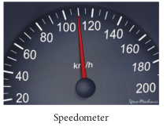

# INTEGRAL CALCULUS

Integration is an area finding process. For certain geometric shapes we can directly find the area. But for irregular shapes the process of integration is used. Consider for example the areas of a rectangle and an irregularly shaped curve, as shown in Figure 2.29.

The area of the rectangle is simply given by \mathrm{A}= length \times breadth =(\mathrm{b}-\mathrm{a}) \mathrm{c}

**Figure 2.29** Area of rectangular and irregular shape

But to find the area of the irregular shaped curve given by f(x), we divide the area into rectangular strips as shown in the Figure 2.30.
The area under the curve is approximately equal to sum of areas of each rectangular strip.

This is given by A \approx f(a) \Delta x+f\left(x_{1}\right) \Delta x +f\left(x_{2}\right) \Delta x+f\left(x_{3}\right) \Delta x.

**Figure 2.30** Area under the curve using rectangular strip

Where f(a) is the value of the function f(x) at \mathrm{x}=\mathrm{a}, f\left(x_{1}\right) is the value of f(x) for \mathrm{x}=\mathrm{x}_{1} and so on.

As we increase the number of strips, the area evaluated becomes more accurate. If the area under the curve is divided into \mathrm{N} strips, the area under the curve is given by \mathrm{A}=\sum_{n=1}^{N} f\left(x_{n}\right) \Delta x

As the number of strips goes to infinity, N \rightarrow \infty, the sum becomes an integral,


\mathrm{A}=\int_{a}^{b} f(x) d x


(Note: As N \rightarrow \infty, \Delta x \rightarrow 0 )

The integration will give the total area under the curve f(x). This is shown in Figure 2.31.

**Figure 2.31** Relation between su

**Examples** 

In physics the work done by a force \mathrm{F}(x) on an object to move it from point a to point b in one dimension is given by


W=\int_{a}^{b} F(x) d x


(No scalar products is required here, since motion here is in one dimension)

1) The work done is the area under the force displacement graph as shown in Figure 2.32

**Figure 2.32** Work done by the force

2) The impulse given by the force in an interval of time is calculated between the interval from time t=0 to time \mathrm{t}=\mathrm{t}_{1} as


\text { Impulse } I=\int_{0}^{t_{1}} F d t


The impulse is the area under the force function F(t) - t graph as shown in Figure 2.33.

**Figure 2.33** Impulse of a force

**Average velocity** 

Consider a particle located initially at point \mathrm{P} having position vector \vec{r}_{1}. In a time interval \Delta t the particle is moved to the point \mathrm{Q} having position vector \vec{r}_{2}. The displacement vector is \Delta \vec{r}=\vec{r}_{2}-\vec{r}_{1}. This is shown in Figure 2.34.

The average velocity is defined as ratio of the displacement vector to the corresponding time interval


\vec{v}_{a v g}=\frac{\Delta \vec{r}}{\Delta t}


It is a vector quantity. The direction of average velocity is in the direction of the displacement vector (\Delta \vec{r}).

This is also shown in Figure 2.34.

**Average speed**

The average speed is defined as the ratio of total path length travelled by the particle in a time interval. 

Average speed = total path length / total time

EXAMPLE 2.20
Consider an object travelling in a semi-circular path from point O to point P in 5 second, as shown in the Figure given below. Calculate the average velocity and average speed.


\begin{gathered}
\text { Average velocity } \vec{v}_{\text {avg }}=\frac{\vec{r}_{P}-\vec{r}_{O}}{\Delta t} \\
\text { Here } \Delta t=5 \mathrm{~s} \\
\vec{r}_{O}=0, \vec{r}_{P}=10 \hat{i} \\
\vec{v}_{\text {avg }}=\frac{10 \hat{i} \mathrm{~cm}}{5 \mathrm{~s}}=2 \hat{i} \mathrm{~cm} \mathrm{~s}^{-1} .
\end{gathered}


The average velocity is in the positive \mathrm{x} direction.

The average speed = total path length / time taken (the path is semi-circular)


=\frac{5 \pi c m}{5 s}=\pi c m ~ s^{-1} \approx 3.14 \mathrm{cms}^{-1}


Note that the average speed is greater than the magnitude of the average velocity.

**Instantaneous velocity or velocity**
The instantaneous velocity at an instant t or simply 'velocity' at an instant t is defined as limiting value of the average velocity as \Delta t \rightarrow 0, evaluated at time t.

In other words, velocity is equal to rate of change of position vector with respect to time. Velocity is a vector quantity.


\vec{v}=\lim _{\Delta t \rightarrow 0} \frac{\Delta \vec{r}}{\Delta t}=\frac{d \vec{r}}{d t}


In component form, this velocity is


\begin{aligned}
\vec{v} & =\frac{d \vec{r}}{d t}=\frac{d}{d t}(x \hat{i}+y \hat{j}+z \hat{k}) \\
& =\frac{d x}{d t} \hat{i}+\frac{d y}{d t} \hat{j}+\frac{d z}{d t} \hat{k}
\end{aligned}


Here \frac{d x}{d t}=v_{x}=x- component of velocity


\begin{aligned}
& \frac{d y}{d t}=v_{y}=y-\text { component of velocity } \\
& \frac{d z}{d t}=v_{z}=z-\text { component of velocity }
\end{aligned}


The magnitude of velocity v is called speed and is given by


v=\sqrt{v_{x}^{2}+v_{y}^{2}+v_{z}^{2}}


Speed is always a positive scalar. The unit of speed is also meter per second.

**EXAMPLE 2.21**
The position vector of a particle is given \vec{r}=2 t \hat{i}+3 t^{2} \hat{j}-5 \hat{k}.

a) Calculate the velocity and speed of the particle at any instant t

b) Calculate the velocity and speed of the particle at time t=2 \mathrm{~s}

**_Solution_** 

The velocity \vec{v}=\frac{d \vec{r}}{d t}=2 \hat{i}+6 \hat{j}

The speed v(t)=\sqrt{2^{2}+(6 t)^{2}} m s^{-1}

The velocity of the particle at t=2 \mathrm{~s}


\vec{v}(2 \sec )=2 \hat{i}+12 \hat{j}


The speed of the particle at t=2 \mathrm{~s}


\begin{aligned}
v(2 s) & =\sqrt{2^{2}+12^{2}}=\sqrt{4+144} \\
& =\sqrt{148} \approx 12.16 \mathrm{~ms}^{-1}
\end{aligned}


Note that the particle has velocity components along \mathrm{x} and \mathrm{y} direction. Along the z direction the position has constant value (-5) which is independent of time. Hence there is no z-component for the velocity.

**EXAMPLE 2.22**
The velocity of three particles A, B, C are given below. Which particle travels at the greatest speed?


\begin{aligned}
& \overrightarrow{v_{A}}=3 \hat{i}-5 \hat{j}+2 \hat{k} \\
& \overrightarrow{v_{B}}=\hat{i}+2 \hat{j}+3 \hat{k} \\
& \overrightarrow{v_{C}}=5 \hat{i}+3 \hat{j}+4 \hat{k}
\end{aligned}


**_Solution_** 

We know that speed is the magnitude of the velocity vector. Hence,


\begin{aligned}
\text { Speed of } A & =\left|\overrightarrow{v_{A}}\right|=\sqrt{(3)^{2}+(-5)^{2}+(2)^{2}} \\
& =\sqrt{9+25+4}=\sqrt{38} \mathrm{~m} \mathrm{~s}^{-1} \\
\text { Speed of } B & =\left|\overrightarrow{v_{B}}\right|=\sqrt{(1)^{2}+(2)^{2}+(3)^{2}} \\
& =\sqrt{1+4+9}=\sqrt{14} \mathrm{~m} \mathrm{~s}^{-1} \\
\text { Speed of } C & =\left|\overrightarrow{v_{C}}\right|=\sqrt{(5)^{2}+(3)^{2}+(4)^{2}} \\
& =\sqrt{25+9+16}=\sqrt{50} \mathrm{~m} \mathrm{~s}^{-1}
\end{aligned}


The particle \mathrm{C} has the greatest speed.


\sqrt{50}>\sqrt{38}>\sqrt{14}


**EXAMPLE 2.23**
Two cars are travelling with respective velocities \vec{v}_{1}=10 \mathrm{~m} \mathrm{~s}^{-1} along east and \vec{v}_{2}=10 \mathrm{~m} \mathrm{~s}^{-1} along west. What are the speeds of the cars?

**_Solution_** 

Both cars have the same magnitude of velocity. This implies that both cars travel at the same speed even though they have velocities in different directions. Speed will not give the direction of motion.

**Momentum**
The linear momentum or simply momentum of a particle is defined as product of mass with velocity. It is denoted as ' \vec{p} '. Momentum is also a vector quantity.


\vec{p}=m \vec{v}


The direction of momentum is also in the direction of velocity, and the magnitude of momentum is equal to product of mass and speed of the particle.


p=m v


In component form the momentum can be written as


p_{x} \hat{i}+p_{y} \hat{j}+p_{z} \hat{k}=m v_{x} \hat{i}+m v_{y} \hat{j}+m v_{z} \hat{k}


Here p_{x}=x component of momentum and is equal to m v_{x}

p_{y}=y component of momentum and is equal to m v_{y}

p_{z}=z component of momentum and is equal to m v_{z}

The momentum of the particle plays a very important role in Newton's laws. The physical significance of momentum can be well understood by the following example.
Consider a butterfly and a stone, both moving towards you with the same velocity 5 \mathrm{~m} \mathrm{~s}^{-1}. If both hit your body, the effects will not be the same. The effects not only depend upon the velocity, but also on the mass. The stone has greater mass compared to the butterfly. The momentum of the stone is thus greater than the momentum of the butterfly. It is the momentum which plays a major role in explaining the 'state' of motion of the object.

The unit of the momentum is \mathrm{kg} \mathrm{m} \mathrm{s}^{-1}

**EXAMPLE 2.24**
Consider two masses of 10 \mathrm{~g} and 1 \mathrm{~kg} moving with the same speed 10 \mathrm{~m} \mathrm{~s}^{-1}. Calculate the magnitude of the momentum.

**_Solution_** 

We use p=m v

For the mass of 10 \mathrm{~g}, \mathrm{~m}=0.01 \mathrm{~kg}


p=0.01 \times 10=0.1 \mathrm{~kg} \mathrm{~m} \mathrm{~s}^{-1}


For the mass of 1 \mathrm{~kg}


p=1 \times 10=10 \mathrm{~kg} \mathrm{~m} \mathrm{~s}^{-1}


Thus even though both the masses have the same speed, the momentum of the heavier mass is 100 times greater than that of the lighter mass.