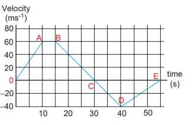

# MOTION ALONG ONE  DIMENSION

## Average velocity

If a particle moves in one dimension, say for example along the \mathrm{x} direction, then


\text { The average velocity }=\frac{\Delta x}{\Delta t}=\frac{x_{2}-x_{1}}{t_{2}-t_{1}} \text {. }


The average velocity is also a vector quantity. But in one dimension we have only two directions (positive and negative \mathrm{x} direction), hence we use positive and negative signs to denote the direction.

The instantaneous velocity or velocity is

defined as \quad v=\lim _{\Delta t \rightarrow 0} \frac{\Delta x}{\Delta t}=\frac{d x}{d t}

Graphically the slope of the position-time graph will give the velocity of the particle. At the same time, if velocity time graph is given, the distance and displacement are determined by calculating the area under the curve. This is explained below.

We know that velocity is given by \frac{d x}{d t}=v.

Therefore, we can write d x=v d t

By integrating both sides, we get \int_{x_{1}}^{x_{2}} d x=\int_{t_{1}}^{t_{2}} v d t

As already seen, integration is equivalent to area under the given curve. So the term \int_{t_{1}}^{t_{2}} v d t represents the area under the curve v as a function of time.

Since the left hand side of the integration represents the displacement travelled by the particle from time t_{1} to t_{2}, the area under the velocity time graph will give the displacement of the particle. If the area is negative, it means that displacement is negative, so the particle has travelled in the negative direction. This is shown in the Figure 2.35 below.

**Example 2.25**
A particle moves along the x-axis in such a way that its coordinates x varies with time ' \mathrm{t} ' according to the equation x=2-5 \mathrm{t}+6 \mathrm{t}^{2}. What is the initial velocity of the particle?

**_Solution_** 


\begin{gathered}
x=2-5 t+6 t^{2} \\
\text { Velocity, } v=\frac{d x}{d t}=\frac{d}{d t}\left(2-5 t+6 t^{2}\right) \\
\text { or } v=-5+12 t
\end{gathered}


For initial velocity, t=0


\therefore \text { Initial velocity }=-5 \mathrm{~ms}^{-1}


The negative sign implies that at \mathrm{t}=0 the velocity of the particle is along negative \mathrm{x} direction.

Average speed = total path length / total time period

**Figure 2.35 Displacement in the velocity–time graph**

## Relative Velocity in One and Two Dimensional Motion

When two objects A and B are moving with different velocities, then the velocity of one object A with respect to another object B is called relative velocity of object A with respect to B.

**Case 1**

Consider two objects \mathrm{A} and \mathrm{B} moving with uniform velocities V_{A} and V_{B} as shown, along straight tracks in the same direction \overrightarrow{\mathrm{V}}_{\mathrm{A}}, \vec{V}_{B} with respect to ground.

The relative velocity of object A with respect to object B is \vec{V}_{A B}=\overrightarrow{\mathrm{V}}_{\mathrm{A}}-\overrightarrow{\mathrm{V}}_{\mathrm{B}}

The relative velocity of object B with respect to object A is \vec{V}_{B A}=\vec{V}_{B}-\vec{V}_{A}

Thus, if two objects are moving in the same direction, the magnitude of relative velocity of one object with respect to another is equal to the difference in magnitude of two velocities.

**EXAMPLE 2.26**

Suppose two cars A and B are moving with uniform velocities with respect to ground along parallel tracks and in the same direction. Let the velocities of A and B be 35 \mathrm{~km} \mathrm{~h}^{-1} due east and 40 \mathrm{~km} \mathrm{~h}^{-1} due east respectively. What is the relative velocity of car \mathrm{B} with respect to \mathrm{A} ?

**_Solution_** 
The relative velocity of \mathrm{B} with respect to \mathrm{A}, \vec{v}_{B A}=\vec{v}_{B}-\vec{v}_{A}=5 \mathrm{~km} \mathrm{~h}^{-1} due east

Similarly, the relative velocity of A with respect to B i.e., \vec{v}_{A B}=\vec{v}_{A}-\vec{v}_{B}=5 \mathrm{~km} \mathrm{~h}^{-1} due west.

To a passenger in the car \mathrm{A}, the car B will appear to be moving east with a velocity 5 \mathrm{~km} \mathrm{~h}^{-1}. To a passenger in car B, the car A will appear to move westwards with a velocity of 5 \mathrm{~km} \mathrm{~h}^{-1}

**Case 2** 
Consider two objects A and B moving with uniform velocities V_{A} and V_{B} along the same straight tracks but opposite in direction

The relative velocity of object A with respect to object B is


\vec{V}_{A B}=\vec{V}_{A}-\left(-\vec{V}_{B}\right)=\vec{V}_{A}+\vec{V}_{B}


The relative velocity of object B with respect to object \mathrm{A} is


\vec{V}_{B A}=-\vec{V}_{B}-\vec{V}_{A}=-\left(\vec{V}_{A}+\vec{V}_{B}\right)


Thus, if two objects are moving in opposite directions, the magnitude of relative velocity of one object with respect to other is equal to the sum of magnitude of their velocities.

**Case 3**

Consider the velocities \overrightarrow{\mathrm{v}}_{A} and \overrightarrow{\mathrm{v}}_{\mathrm{B}} at an angle \theta between their directions.

The relative velocity of \mathrm{A} with respect to \mathrm{B}, \vec{v}_{A B}=\vec{v}_{A}-\vec{v}_{B}

Then, the magnitude and direction of \overrightarrow{\mathrm{v}}_{A B} is given by \mathrm{v}_{\mathrm{AB}}=\sqrt{\mathrm{v}_{\mathrm{A}}^{2}+\mathrm{v}_{\mathrm{B}}^{2}-2 \mathrm{v}_{\mathrm{A}} \mathrm{v}_{\mathrm{B}} \cos \theta} and \tan \beta=\frac{\mathrm{v}_{\mathrm{B}} \sin \theta}{\mathrm{v}_{\mathrm{A}}-\mathrm{v}_{\mathrm{B}} \cos \theta} (Here \beta is angle between \overrightarrow{\mathrm{v}}_{A B} and \vec{v}_{B} )

(i) When \theta=0^{\circ}, the bodies move along parallel straight lines in the same direction,

We have \mathrm{v}_{\mathrm{AB}}=\left(\mathrm{v}_{\mathrm{A}}-\mathrm{v}_{\mathrm{B}}\right) in the direction of \vec{v}_{A}. Obviously v_{B A}=\left(v_{B}-v_{A}\right) in the direction of \overrightarrow{\mathrm{v}}_{\mathrm{B}}.

(ii) When \theta=180^{\circ}, the bodies move along parallel straight lines in opposite directions,

We have \mathrm{v}_{\mathrm{AB}}=\left(\mathrm{v}_{\mathrm{A}}+\mathrm{v}_{\mathrm{B}}\right) in the direction of \overrightarrow{\mathrm{v}}_{A}.

Similarly, \mathrm{v}_{\mathrm{BA}}=\left(\mathrm{v}_{\mathrm{B}}+\mathrm{v}_{\mathrm{A}}\right) in the direction of \overrightarrow{\mathrm{v}}_{\mathrm{B}}.

(iii) If the two bodies are moving at right angles to each other, then \theta=90^{\circ}. The magnitude of the relative velocity of A with respect to B=v_{A B}=\sqrt{v_{A}^{2}+v_{B}^{2}}.

(iv) Consider a person moving horizontally with velocity \vec{V}_{M}. Let rain fall vertically with velocity \vec{V}_{R}. An umbrella is held to avoid the rain. Then the relative velocity of the rain with respect to the person is,


\vec{V}_{R M}=\vec{V}_{R}-\vec{V}_{M}


which has magnitude


V_{R M}=\sqrt{V_{R}^{2}+V_{M}^{2}}


and direction \theta=\tan ^{-1}\left(\frac{V_{M}}{V_{R}}\right) with the vertical as shown in Figure. 2.36

In order to save himself from the rain, he should hold an umbrella at an angle \theta with the vertical.

**EXAMPLE 2.27**
Suppose two trains A and B are moving with uniform velocities along parallel tracks but in opposite directions. Let the velocity of train A be 40 \mathrm{~km} \mathrm{~h}^{-1} due east and that of train B be 40 \mathrm{~km} \mathrm{~h}^{-1} due west. Calculate the relative velocities of the trains

**_Solution_** 

Relative velocity of A with respect to B, v_{\mathrm{AB}}=80 \mathrm{~km} \mathrm{~h}^{-1} due east

Thus to a passenger in train \mathrm{B}, the train A will appear to move east with a velocity of 80 \mathrm{~km} \mathrm{~h}^{-1}

**Figure 2.35 Angle of umbrella with respect to train**

The relative velocity of \mathrm{B} with respect to A, V_{B A}=80 \mathrm{~km} \mathrm{~h}^{-1} due west

To a passenger in train A, the train B will appear to move westwards with a velocity of 80 \mathrm{~km} \mathrm{~h}^{-1}

**EXAMPLE 2.28**
Consider two trains A and B moving along parallel tracks with the same velocity in the same direction. Let the velocity of each train be 50 \mathrm{~km} \mathrm{~h}^{-1} due east. Calculate the relative velocities of the trains.

**_Solution_** 

Relative velocity of \mathrm{B} with respect to \mathrm{A}, v_{\mathrm{BA}}=v_{B}-v_{\mathrm{A}}

=50 \mathrm{~km} \mathrm{~h}^{-1}+(-50) \mathrm{km} \mathrm{h}^{-1}

=0 \mathrm{~km} \mathrm{~h}^{-1}

Similarly, relative velocity of A with respect to \mathrm{B} i.e., v_{\mathrm{AB}} is also zero.

Thus each train will appear to be at rest with respect to the other.

**EXAMPLE 2.29**
How long will a boy sitting near the window of a train travelling at 36 \mathrm{~km} \mathrm{~h}^{-1} see a train passing by in the opposite direction with a speed of 18 \mathrm{~km} \mathrm{~h}^{-1}. The length of the slowmoving train is 90 \mathrm{~m}.

**_Solution_** 
The relative velocity of the slow-moving train with respect to the boy is =(36+18) \mathrm{km} \mathrm{h}^{-1}=54 \mathrm{~km} \mathrm{~h}^{-1}=54 \times \frac{5}{18} \mathrm{~m} \mathrm{~s}^{-1}=
15 \mathrm{~m} \mathrm{~s}^{-1}
Since the boy will watch the full length of the other train, to find the time taken to watch the full train:

We have, 15=\frac{90}{t}


\text { or } t=\frac{90}{15}=6 \mathrm{~s}


**EXAMPLE 2.30**
A swimmer's speed in the direction of flow of a river is 12 \mathrm{~km} \mathrm{~h}^{-1}. Against the direction of flow of the river the swimmer's speed is 6 \mathrm{~km} \mathrm{~h}^{-1}. Calculate the swimmer's speed in still water and the velocity of the river flow.

**_Solution_** 

Let v_{s} and v_{r}, represent the velocities of the swimmer and river respectively with respect to ground.


\text { and } \quad \begin{aligned}
& v_{\mathrm{s}}+v_{\mathrm{r}}=12 \\
& v_{\mathrm{s}}-v_{\mathrm{r}}=6
\end{aligned}


Adding the both equations (1) and (2) 2 v_{s}=12+6=18 \mathrm{~km} \mathrm{~h}^{-1} or v_{s}=9 \mathrm{~km} \mathrm{~h}^{-1}

From Equation (1),

9+v_{\mathrm{r}}=12 or

v_{r}=3 \mathrm{~km} \mathrm{~h}^{-1}

When the river flow and swimmer move in the same direction, the net velocity of swimmer is 12 \mathrm{~km} \mathrm{~h}^{-1}.

**Accelerated Motion**

During non-uniform motion of an object, the velocity of the object changes from instant to instant i.e., the velocity of the object is no more constant but changes with time. Such a motion is said to be an
accelerated motion.

i) In accelerated motion, if the change in velocity of an object per unit time is same (constant) then the object is said to be moving with uniformly accelerated motion.

ii) On the other hand, if the change in velocity per unit time is different at different times, then the object is said to be moving with non-uniform accelerated motion.

**Average acceleration**
If an object changes its velocity from \vec{v}_{1} to \vec{v}_{2} in a time interval \Delta t=t_{2}-t_{1}, then the average acceleration is defined as the ratio of change in velocity over the time interval \Delta t=t_{2}-t_{1}


\vec{a}_{\text {avg }}=\frac{\vec{v}_{2}-\vec{v}_{1}}{t_{2}-t_{1}}=\frac{\Delta \vec{v}}{\Delta t}


Average acceleration is a vector quantity in the same direction as the vector \Delta v.

**Instantaneous acceleration**
Usually, the average acceleration will give the change in velocity only over the entire time interval. It will not give value of the acceleration at any instant time t.

Instantaneous acceleration or acceleration of a particle at time ' \mathrm{t} ' is given by the ratio of change in velocity over \Delta \mathrm{t}, as \Delta \mathrm{t} approaches zero.


\text { Acceleration } \vec{a}=\lim _{\Delta t \rightarrow 0} \frac{\Delta \vec{v}}{\Delta t}=\frac{d \vec{v}}{d t}


In other words, the acceleration of the particle at an instant t is equal to rate of change of velocity. 

(i) Acceleration is a vector quantity. Its SI unit is \mathrm{ms}^{-2} and its dimensional formula is \mathrm{M}^{0} \mathrm{~L}^{1} \mathrm{~T}^{-2}

(ii) Acceleration is positive if its velocity is increasing, and is negative if the velocity is decreasing. The negative acceleration is called retardation or deceleration.

In terms of components, we can write


\vec{a}=\frac{d v_{x}}{d t} \hat{i}+\frac{d v_{y}}{d t} \hat{j}+\frac{d v_{z}}{d t} \hat{k}=\frac{d \vec{v}}{d t}


Thus a_{x}=\frac{d v_{x}}{d t}, a_{y}=\frac{d v_{y}}{d t}, a_{z}=\frac{d v_{z}}{d t} are the components of instantaneous acceleration.

Since each component of velocity is the derivative of the corresponding coordinate, we can express the components \mathrm{a}_{\mathrm{x}}, \mathrm{a}_{\mathrm{y}} and \mathrm{a}_{\mathrm{z}}, as


a_{x}=\frac{d^{2} x}{d t^{2}}, \quad a_{y}=\frac{d^{2} y}{d t^{2}}, \quad a_{z}=\frac{d^{2} z}{d t^{2}}


Then the acceleration vector \vec{a} itself is


\vec{a}=\frac{d^{2} x}{d t^{2}} \hat{i}+\frac{d^{2} y}{d t^{2}} \hat{j}+\frac{d^{2} z}{d t^{2}} \hat{k}=\frac{d^{2} \vec{r}}{d t^{2}}


Thus acceleration is the second derivative of position vector with respect to time.

Graphically the acceleration is the slope in the velocity-time graph. At the same time if the acceleration-time graph is given, then the velocity can be found from the area under the acceleration-time graph.

From \frac{d v}{d t}=a, we have d v=a d t; hence


v=\int_{t_{1}}^{t_{2}} a d t


For an initial time t_{1} and final time t_{2}

**EXAMPLE 2.31**
A velocity-time graph is given for a particle moving in \mathrm{x} direction, as below


\begin{gathered}
\text { Velocity } \\
\left(\mathrm{ms}^{-1}\right)
\end{gathered}


**_Solution_** 

**(a) From O to A: (0 s to 10 s )** 
At \mathrm{t}=0 \mathrm{~s} the particle has zero velocity. At t>0, particle has positive velocity and moves in the positive \mathrm{x} direction. From 0 \mathrm{~s} to 10 \mathrm{~s} the slope \left(\frac{d v}{d t}\right) is positive, implying the particle is accelerating. Thus the velocity increases during this time interval.

**From A to B: (10 s to 15 s )** 
From 10 \mathrm{~s} to 15 \mathrm{~s} the velocity stays constant at 60 \mathrm{~m} \mathrm{~s}^{-1}. The acceleration is 0 during this period. But the particle continues to travel in the positive x-direction.

**From B to C: (15 s to 30 s )** 
From the 15 \mathrm{~s} to 30 \mathrm{~s} the slope is negative, implying the velocity is decreasing. But the particle is moving in the positive \mathrm{x} direction. At \mathrm{t}=30 s the velocity becomes zero, and the particle comes to rest momentarily at \mathrm{t}=30 \mathrm{~s}.

**From C to D: (30 s to 40 s )**
From 30 \mathrm{~s} to 40 \mathrm{~s} the velocity is negative. It implies that the particle starts to move in the negative \mathrm{x} direction. The magnitude of velocity increases to a maximum 40 \mathrm{~m} \mathrm{~s}^{-1}

**From D to E: (40 s to 55 s )**
From 40 \mathrm{~s} to 55 \mathrm{~s} the velocity is still negative, but starts increasing from -40 \mathrm{~m} \mathrm{~s}^{-1} At \mathrm{t}=55 \mathrm{~s} the velocity of the particle is zero and particle comes to rest.

(b) The total area under the curve from 0 \mathrm{~s} to 40 \mathrm{~s} will give the displacement. Here the area from \mathrm{O} to \mathrm{C} represents motion along positive \mathrm{x}-direction and the area under the graph from \mathrm{C} to \mathrm{D} represents the particle's motion along negative \mathrm{x}-direction.

The displacement travelled by the particle from 0 \mathrm{~s} to 10 \mathrm{~s}= \frac{1}{2} \times 10 \times 60=300 \mathrm{~m}

The displacement travelled from 10 \mathrm{~s} to 15 \mathrm{~s}=60 \times 5=300 \mathrm{~m}

The displacement travelled from 15 \mathrm{~s} to 30 \mathrm{~s}=\frac{1}{2} \times 15 \times 60=450 \mathrm{~m}

The displacement travelled from 30 \mathrm{~s} to 40 \mathrm{~s}=\frac{1}{2} \times 10 \times(-40)=-200 \mathrm{~m}. Here the negative sign implies that the particle travels 200 \mathrm{~m} in the negative \mathrm{x} direction.

The total displacement from 0 \mathrm{~s} to 40 \mathrm{~s} is given by


\begin{gathered}
300 \mathrm{~m}+300 \mathrm{~m}+450 \mathrm{~m}-200 \mathrm{~m} \\
=+850 \mathrm{~m} .
\end{gathered}


Thus the particle's net displacement is along the positive \mathrm{x}-direction.

The total distance travelled by the particle from 0 \mathrm{~s} to 40 \mathrm{~s}=300+300+ 450+200=1250 \mathrm{~m}

(c) The acceleration is given by the slope in the velocity-time graph. In the first 10 seconds the velocity has constant slope (constant acceleration). It implies that the acceleration a is from v_{1}=0 to v_{2}= 60 \mathrm{~m} \mathrm{~s}^{-1}.


\begin{aligned}
\text { Hence } \mathrm{a} & =\frac{v_{2}-v_{1}}{t_{2}-t_{1}} \text { gives } \\
\mathrm{a} & =\frac{60-0}{10-0}=6 \mathrm{~m} \mathrm{~s}^{-2}
\end{aligned}


Next, the particle has constant negative slope from 15 \mathrm{~s} to 30 \mathrm{~s}. In this case v_{2}=0 and v_{1}=60 \mathrm{~m} \mathrm{~s}^{-1}. Thus the acceleration at \mathrm{t}=20 \mathrm{~s} is given by a=\frac{0-60}{30-15}=-4 m s^{-2}. Here the negative sign implies that the particle has negative acceleration.

**EXAMPLE 2.32**
If the position vector of the particle is given by \vec{r}=3 t^{2} \hat{i}+5 \hat{j}+4 \hat{k}, Find the

a) The velocity of the particle at t=3 \mathrm{~s}

b) Speed of the particle at t=3 \mathrm{~s}

c) acceleration of the particle at time \mathrm{t}=3 \mathrm{~s}

**_Solution_** 

(a) The velocity \vec{v}=\frac{d \vec{r}}{d t}=\frac{d x}{d t} \hat{i}+\frac{d y}{d t} \hat{j}+\frac{d z}{d t} \hat{k}

We obtain, \vec{v}(t)=6 t \hat{i}+5 \hat{j}

The velocity has only two components v_{x}=6 t, depending on time \mathrm{t} and v_{y}=5 which is independent of time.

The velocity at \mathrm{t}=3 \mathrm{~s} is \vec{v}(3)=18 \hat{i}+5 \hat{j}

(b) The speed at \mathrm{t}=3 \mathrm{~s} is v=\sqrt{18^{2}+5^{2}}= \sqrt{349} \approx 18.68 \mathrm{~ms}^{-1}

(c) The acceleration \vec{a} is, \vec{a}=\frac{d^{2} \vec{r}}{d t^{2}}=6 \hat{i}

The acceleration has only the x-component. Note that acceleration here is independent of t, which means \vec{a} is constant. Even at \mathrm{t}=3 \mathrm{~s} it has same value \vec{a}=6 \hat{i}. The velocity is non-uniform, but the acceleration is uniform (constant) in this case.

**EXAMPLE 2.33**
An object is thrown vertically downward. What is the acceleration experienced by the object?

**_Solution_** 

We know that when the object falls towards the Earth, it experiences acceleration due to gravity \mathrm{g}=9.8 \mathrm{~m} \mathrm{~s}^{-2} downward. We can choose the coordinate system as shown in the figure.

The acceleration is along the negative y direction.


\vec{a}=g(-\hat{j})=-g \hat{j}


---
**Note**
For convenience, sometimes we take the downward direction as positive Y-axis. As a vertically falling body accelerates downwards, g is taken as positive in this direction. (a = g)

---
## Equations of Uniformly
Accelerated Motion by Calculus Method Consider an object moving in a straight line with uniform or constant acceleration ‘a’. Let u be the velocity of the object at time t = 0, and v be velocity of the body at a later time t.

**Velocity - time relation** 

(i) The acceleration of the body at any instant is given by the first derivative of the velocity with respect to time,


a=\frac{d v}{d t} \text { or } \mathrm{dv}=\mathrm{adt}


Integrating both sides with the condition that as time changes from 0 to t, the velocity changes from u to v. For the constant acceleration,


\begin{aligned}
& \int_{\mathrm{u}}^{\mathrm{v}} \mathrm{dv}=\int_{0}^{\mathrm{t}} \mathrm{adt}=\mathrm{a} \int_{0}^{\mathrm{t}} \mathrm{dt} \Rightarrow[v]_{u}^{v}=a[t]_{0}^{\mathrm{t}} \\
& v-u=a t \quad(\text { or }) \quad v=u+a t \quad \rightarrow(2.7)
\end{aligned}


---
**Note**
If a is dependent on time t, a cannot be brought outside the time integral.

---

**Displacement – time relation**

(ii) The velocity of the body is given by the first derivative of the displacement with respect to time.


v=\frac{d s}{d t} \text { or } d s=v d t


and since v=u+a t,


\text { We get } d s=(u+a t) d t


Assume that initially at time t=0, the particle started from the origin. At a later time t, the particle displacement is s. Further assuming that acceleration is timeindependent, we have


\int_{0}^{s} d s=\int_{0}^{t} u d t+\int_{0}^{t} a t d t(\text { or }) s=u t+\frac{1}{2} a t^{2}
 

**Velocity – displacement relation**

(iii) The acceleration is given by the first derivative of velocity with respect to time.

a=\frac{d v}{d t}=\frac{d v}{d s} \frac{d s}{d t}=\frac{d v}{d s} v

[since \mathrm{ds} / \mathrm{dt}=\mathrm{v} ] where \mathrm{s} is displacement traversed.

This is rewritten as a=\frac{1}{2} \frac{d}{d s}\left(v^{2}\right)


\text { or } d s=\frac{1}{2 a} d\left(v^{2}\right)


Integrating the above equation, using the fact when the velocity changes from u to v, displacement changes from 0 to s, we get


\int_{0}^{s} d s=\int_{u}^{v} \frac{1}{2 a} d\left(v^{2}\right)



\begin{aligned}
\therefore s & =\frac{1}{2 a}\left(v^{2}-u^{2}\right) \\
\therefore v^{2} & =u^{2}+2 a s
\end{aligned}


We can also derive the displacement s in terms of initial velocity u and final velocity \mathrm{v}.

From the equation (2.7) we can write,


a t=v-u


Substitute this in equation (2.8), we get


\begin{aligned}
& s=u t+\frac{1}{2}(v-u) t \\
& s=\frac{(u+v) t}{2}
\end{aligned}


The equations (2.7), (2.8), (2.9) and (2.10) are called kinematic equations of motion, and have a wide variety of practical applications.

**Kinematic equations**


\begin{aligned}
v & =u+a t \\
s & =u t+\frac{1}{2} a t^{2} \\
v^{2} & =u^{2}+2 a s \\
s & =\frac{(u+v) t}{2}
\end{aligned}


It is to be noted that all these kinematic equations are valid only if the motion is in a straight line with constant acceleration. For circular motion and oscillatory motion these equations are not applicable.

**Equations of motion under gravity**

A practical example of a straight line motion with constant acceleration is the motion of an object near the surface of the Earth. We know that near the surface of the Earth, the acceleration due to gravity 'g' is constant. All straight line motions under this acceleration can be well understood using the kinematic equations given earlier.

**Case (i): A body falling from a height h**

Consider an object of mass mathrm{m} falling from a height h. Assume there is no air resistance. For convenience, let us choose the downward direction as positive mathrm{y}-axis as shown in the Figure 2.37. The object experiences acceleration ' mathrm{g} ' due to gravity which is constant near the surface of the Earth. We can use kinematic equations to explain its motion. We have

The acceleration vec{a}=g \hat{j}

By comparing the components, we get


a_{x}=0, a_{z}=0, a_{y}=g


Let us take for simplicity, a_{y}=a=g

If the particle is thrown with initial velocity ' u ' downward which is in negative y axis, then velocity and position at of the particle any time t is given by


\begin{aligned}
& v=u+g t \\
& y=u t+\frac{1}{2} g t^{2}
\end{aligned}


The square of the speed of the particle when it is at a distance y from the hill-top, is


v^{2}=u^{2}+2 g y


Suppose the particle starts from rest.

Then mathrm{u}=0

Then the velocity mathrm{v}, the position of the particle and v^{2} at any time t are given by (for a point y from the hill-top)


\begin{gathered}
v=g t \\
y=\frac{1}{2} g t^{2} \\
v^{2}=2 g y
\end{gathered}


The time (\mathrm{t}=\mathrm{T}) taken by the particle to reach the ground (for which y=h ), is given by using equation (2.15),


\begin{aligned}
& h=\frac{1}{2} g T^{2} \\
& T=\sqrt{\frac{2 h}{g}}
\end{aligned}


The equation (2.18) implies that greater the height (h), particle takes more time (T) to reach the ground. For lesser height (h), it takes lesser time to reach the ground.
The speed of the particle when it reaches the ground (\mathrm{y}=\mathrm{h}) can be found using equation (2.16), we get


v_{\text {ground }}=\sqrt{2 g h}


The above equation implies that the body falling from greater height (h) will have higher velocity when it reaches the ground.

The motion of a body falling towards the Earth from a small altitude (h<<R), purely under the force of gravity is called free fall. (Here \mathrm{R} is radius of the Earth )

**EXAMPLE 2.34**
An iron ball and a feather are both falling from a height of 10 \mathrm{~m}.

a) What are the time taken by the iron ball and feather to reach the ground?

b) What are the velocities of iron ball and feather when they reach the ground? (Ignore air resistance and take \mathrm{g}=10 \mathrm{~m} \mathrm{~s}^{-2} )

**_Solution_** 

Since kinematic equations are independent of mass of the object, according to equation (2.8) the time taken by both iron ball and feather to reach the ground are the same. This is given by


T=\sqrt{\frac{2 h}{g}}=\sqrt{\frac{2 \times 10}{10}}=\sqrt{2} s \approx 1.414 s


Thus, both feather and iron ball reach ground at the same time.

By following equation (2.19) both iron ball and feather reach the Earth with the same speed. It is given by


\begin{aligned}
v & =\sqrt{2 g h}=\sqrt{2 \times 10 \times 10} \\
& =\sqrt{200} m^{-1} \approx 14.14 m^{-1}
\end{aligned}


**EXAMPLE 2.35**
Is it possible to measure the depth of a well using kinematic equations?

Consider a well without water, of some depth d. Take a small object (for example lemon) and a stopwatch. When you drop the emon, start the stop watch. As soon as the lemon touches the bottom of the well, stop the watch. Note the time taken by the lemon to reach the bottom and denote the time as t. 
Since the initial velocity of lemon u=0 and the acceleration due to gravity g is constant over the well, we can use the equations of motion for constant acceleration.


s=u t+\frac{1}{2} a t^{2}


Since u=0, s=d, a=g (Since we choose the y axis downwards), Then


d=\frac{1}{2} g t^{2}


Substituting g=9.8 \mathrm{~m} \mathrm{~s}^{-2} we get the depth of the well.

To estimate the error in our calculation we can use another method to measure the depth of the well. Take a long rope and hang the rope inside the well till it touches the bottom. Measure the length of the rope which is the correct depth of the well \left(d_{\text {correct }}\right). Then


\begin{array}{r}
\text { error }=d_{\text {correct }}-d \\
\text { relative error }=\frac{d_{\text {correct }}-d}{d_{\text {correct }}}
\end{array}


percentage of relative error


=\frac{d_{\text {correct }}-d}{d_{\text {correct }}} \times 100


What would be the reason for an error, if any?

Repeat the experiment for different masses and compare the result with d_{\text {correct }} every time.

---
**Note**
If there is water in the well, this method can be used to measure depth of the well till the surface of the water.

---
**Case (ii): A body thrown vertically upwards**
Consider an object of mass m thrown vertically upwards with an initial velocity u. Let us neglect the air friction. In this case we choose the vertical direction as positive y axis as shown in the Figure 2.38, then the acceleration \mathrm{a}=-\mathrm{g} (neglect air friction) and g points towards the negative y axis. The kinematic equations for this motion are,

**Figure 2.38. An object thrown vertically**
The velocity and position of the object at any time t are,


\begin{gathered}
v=u-g t \\
s=u t-\frac{1}{2} g t^{2}
\end{gathered}


The velocity of the object at any position y (from the point where the object is thrown) is


v^{2}=u^{2}-2 g y


**EXAMPLE 2 .36**
A train was moving at the rate of 54 \mathrm{~km} \mathrm{~h}^{-1} when brakes were applied. It came to rest within a distance of 225 \mathrm{~m}. Calculate the retardation produced in the train.

**_Solution_**
The final velocity of the particle \quad v=0 The initial velocity of the particle


\begin{gathered}
u=54 \times \frac{5}{18} m s^{-1}=15 m^{-1} \\
S=225 m
\end{gathered}


Retardation is always against the velocity of the particle.


\begin{aligned}
v^{2} & =u^{2}-2 a S \\
0 & =(15)^{2}-2 \mathrm{a}(225) \\
450 \mathrm{a} & =225 \\
a=\frac{225}{450} m s^{-2} & =0.5 m s^{-2}
\end{aligned}


Hence, retardation =0.5 \mathrm{~m} \mathrm{~s}^{-2}

