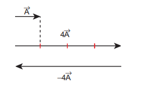
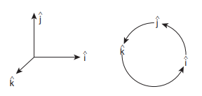

# MULTIPLICATION OF VECTOR BY A SCALAR

A vector \vec{A} multiplied by a scalar \lambda results in another vector, \lambda \vec{A}. If \lambda is a positive number then \lambda \vec{A} is also in the direction of \vec{A}. If \lambda is a negative number, \lambda \vec{A} is in the opposite direction to the vector \vec{A}.

**EXAMPLE 2.5**

Given the vector \vec{A}=2 \hat{i}+3 \hat{j}, what is 3 \vec{A} ?

**_Solution_**


3 \vec{A}=3(2 \hat{i}+3 \hat{j})=6 \hat{i}+9 \hat{j}
 

The vector 3 \vec{A} is in the same direction as vector \vec{A}.

**EXAMPLE 2.6**

A vector \vec{A} is given as in the following Figure. Find 4 \vec{A} and -4 \vec{A}

**_Solution_**

In physics, certain vector quantities can be defined as a scalar times another vector quantity.

**For example** 
1) Force \vec{F}=m \vec{a}. Here mass ' m ' is a scalar, and \vec{a} is the acceleration. Since ' m ' is always a positive scalar, the direction
of force is always in the direction of acceleration.
2) Linear momentum \vec{P}=m \vec{v}. Here \vec{v} is the velocity. The direction of linear momentum is also in the direction of velocity.
3) Force \vec{F}=q \vec{E}, Here the electric charge ' \mathrm{q} ' is a scalar, and \vec{E} is the electric field. Since charge can be positive or negative, the direction of force \vec{F} is correspondingly either in the direction of \vec{E} or opposite to the direction of \vec{E}. 

## Scalar Product of Two Vectors

**Definition** 

The scalar product (or dot product) of two vectors is defined as the product of the magnitudes of both the vectors and the cosine of the angle between them.

Thus if there are two vectors \vec{A} and \vec{B} having an angle \theta between them, then their scalar product is defined as \vec{A} \cdot \vec{B}=A B \cos \theta. Here, A and B are magnitudes of \vec{A} and \vec{B}.

**Properties** 

(i) The product quantity \vec{A} \cdot \vec{B} is always a scalar. It is positive if the angle between the vectors is acute (i.e., \theta<90^{\circ} ) and negative if the angle between them is obtuse (i.e. 90^{\circ}<\theta<180^{\circ} ).

(ii) The scalar product is commutative, i.e. \vec{A} \cdot \vec{B}=\vec{B} \cdot \vec{A}

(iii) The vectors obey distributive law i.e. \vec{A} \cdot(\vec{B}+\vec{C})=\vec{A} \cdot \vec{B}+\vec{A} \cdot \vec{C}

(iv) The angle between the vectors \theta=\cos ^{-1}\left[\frac{\overrightarrow{\mathrm{A}} \cdot \overrightarrow{\mathrm{B}}}{\mathrm{AB}}\right] 

(v) The scalar product of two vectors will be maximum when \cos \theta=1, i.e. \theta= 0^{\circ}, i.e., when the vectors are parallel;


(\overrightarrow{\mathrm{A}} \cdot \overrightarrow{\mathrm{B}})_{\max }=\mathrm{AB}


(vi) The scalar product of two vectors will be minimum, when \cos \theta=-1, i.e. \theta=180^{\circ}

(\vec{A} \cdot \vec{B})_{\text {min }}=-A B, when the vectors are anti-parallel.

(vii) If two vectors \vec{A} and \vec{B} are perpendicular to each other then their scalar product \vec{A} \cdot \vec{B}=0, because \cos 90^{\circ}=0. Then the vectors \vec{A} and \vec{B} are said to be mutually orthogonal.

(viii) The scalar product of a vector with itself is termed as self-dot product and is given by (\overrightarrow{\mathrm{A}})^{2}=\overrightarrow{\mathrm{A}} \cdot \overrightarrow{\mathrm{A}}=\mathrm{AA} \cos \theta=\mathrm{A}^{2}.

Here angle \theta=0^{\circ}

The magnitude or norm of the vector \vec{A} is |\vec{A}|=\mathrm{A}=\sqrt{\vec{A} \cdot \vec{A}}

(ix) In case of a unit vector \hat{n}

\hat{n} \cdot \hat{n}=1 \times 1 \times \cos 0=1. For example, \hat{i} \cdot \hat{i}= \hat{j} \cdot \hat{j}=\hat{k} \cdot \hat{k}=1

(x) In the case of orthogonal unit vectors \hat{i}, \hat{\mathrm{j}} and \hat{\mathrm{k}},


\hat{\mathrm{i}} \cdot \hat{\mathrm{j}}=\hat{\mathrm{j}} \cdot \hat{\mathrm{k}}=\hat{\mathrm{k}} \cdot \hat{\mathrm{i}}=1 \cdot 1 \cos 90^{\circ}=0


(xi) In terms of components the scalar product of \vec{A} and \vec{B} can be written as


\begin{aligned}
\overrightarrow{\mathrm{A}} \cdot \overrightarrow{\mathrm{B}} & =\left(A_{x} \hat{i}+A_{y} \hat{j}+A_{z} \hat{k}\right) \cdot\left(B_{x} \hat{i}+B_{y} \hat{j}+B_{z} \hat{k}\right) \\
& =A_{x} B_{x}+A_{y} B_{y}+A_{z} B_{z}, \text { with all other } \\
& \text { terms zero. }
\end{aligned}


The magnitude of vector |\vec{A}| is given by


|\vec{A}|=A=\sqrt{A_{x}^{2}+A_{y}^{2}+A_{z}^{2}}


**EXAMPLE 2.7**

Given two vectors \vec{A}=2 \hat{i}+4 \hat{j}+5 \hat{k} and \vec{B}= \hat{i}+3 \hat{j}+6 \hat{k}, Find the product \vec{A} \cdot \vec{B}, and the magnitudes of \vec{A} and \vec{B}. What is the angle between them?

\vec{A} \cdot \vec{B}=2+12+30=44
Magnitude A=\sqrt{4+16+25}=\sqrt{45} units
Magnitude B=\sqrt{1+9+36}=\sqrt{46} units

The angle between the two vectors is given by


\begin{aligned}
\theta & =\cos ^{-1}\left(\frac{\vec{A} \cdot \vec{B}}{A B}\right) \\
& =\cos ^{-1}\left(\frac{44}{\sqrt{45 \times 46}}\right)=\cos ^{-1}\left(\frac{44}{45.49}\right) \\
& =\cos ^{-1}(0.967)
\end{aligned}



\therefore \theta \cong 15^{\circ}
 

**EXAMPLE 2.8**

Check whether the following vectors are orthogonal.

i) \vec{A}=2 \hat{i}+3 \hat{j} and \vec{B}=4 \hat{i}-5 \hat{j}

ii) \vec{C}=5 \hat{i}+2 \hat{j} and \vec{D}=2 \hat{i}-5 \hat{j}

**_Solution_**


\vec{A} \cdot \vec{B}=8-15=-7 \neq 0


Hence \vec{A} and \vec{B} are not orthogonal to each other.


\vec{C} \cdot \vec{D}=10-10=0

 
Hence, \vec{C} and \vec{D} are orthogonal to each other.

It is also possible to geometrically show that the vectors \vec{C} and \vec{D} are orthogonal to each other. This is shown in the following Figure.

In physics, the work done by a force \vec{F} to move an object through a small displacement d \vec{r} is defined as,


\begin{aligned}
& W=\vec{F} \cdot d \vec{r} \\
& W=F d r \cos \theta
\end{aligned}


The work done is basically a scalar product between the force vector and the displacement vector. Apart from work done, there are other physical quantities which are also defined through scalar products.

---
**Note**
In uniform circular motion,the centripetal force is perpendicular to the displacement. Hence, work done by this force is zero.

---

## The Vector Product of Two Vectors

**Definition** 

The vector product or cross product of two vectors is defined as another vector having a magnitude equal to the product of the magnitudes of two vectors and the sine of the angle between them. The direction of the product vector is perpendicular to the plane containing the two vectors, in accordance with the right hand screw rule or right hand thumb rule (Figure 2.22).

Thus, if \vec{A} and \vec{B} are two vectors, then their vector product is written as \overrightarrow{\mathrm{A}} \times \overrightarrow{\mathrm{B}} which is a vector \overrightarrow{\mathrm{C}} defined by


\overrightarrow{\mathrm{C}}=\overrightarrow{\mathrm{A}} \times \overrightarrow{\mathrm{B}}=(\mathrm{AB} \sin \theta) \hat{\mathrm{n}}


The direction \hat{n} of \vec{A} \times \vec{B}, i.e., \vec{C} is perpendicular to the plane containing the vectors \vec{A} and \vec{B} and is in the sense of advancement of a right handed screw rotated from \vec{A} (first vector) to \vec{B} (second vector) through the smaller angle between them. Thus, if a right-handed screw whose axis is perpendicular to the plane formed by \vec{A} and \vec{B}, is rotated from \vec{A} to \vec{B} through the smaller angle between them, then the direction of advancement of the screw gives the direction of \vec{A} \times \vec{B} i.e. \vec{C} which is illustrated in Figure 2.22.

---
**Note**
According to Right Hand Rule, 
if the curvature of the fingers 
of the right hand represents 
the sense of rotation of the object, then 
the thumb, held perpendicular to the 
curvature of the fingers, represents the 
direction of the resultant \vec{C}

---

**VECTOR PRODUCT (“CROSS" PRODUCT)**

The vector product of \vec{A} and \vec{B}, written as \vec{A} \times \vec{B}, produces a third vector \vec{C}


\vec{C}=\vec{A} \times \vec{B}=|\vec{A} \| \vec{B}| \sin \theta \hat{\mathrm{n}} \quad-\vec{C}=\vec{B} \times \vec{A}


**Figure 2.22 Vector product of two**

**Properties of vector (cross) product.** 

(i) The vector product of any two vectors is always another vector whose direction is perpendicular to the plane containing these two vectors, i.e., orthogonal to both the vectors \vec{A} and \vec{B}, even though the vectors \vec{A} and \vec{B} may or may not be mutually orthogonal.

(ii) The vector product of two vectors is not commutative, i.e., \vec{A} \times \vec{B} \neq \vec{B} \times \vec{A} But., \vec{A} \times \vec{B}= -[\overrightarrow{\mathrm{B}} \times \overrightarrow{\mathrm{A}}]

Here it is worthwhile to note that |\overrightarrow{\mathrm{A}} \times \overrightarrow{\mathrm{B}}|=|\overrightarrow{\mathrm{B}} \times \overrightarrow{\mathrm{A}}|=\mathrm{AB} \sin \theta i.e., in the case of the product vectors \overrightarrow{\mathrm{A}} \times \overrightarrow{\mathrm{B}} and \overrightarrow{\mathrm{B}} \times \overrightarrow{\mathrm{A}}, the magnitudes are equal but directions are opposite to each other.

(iii) The vector product of two vectors will have maximum magnitude when \sin \theta=1, i.e., \theta=90^{\circ} i.e., when the vectors \vec{A} and \vec{B} are orthogonal to each other.


(\vec{A} \times \vec{B})_{\max }=A B \hat{n}


(iv) The vector product of two non-zero vectors will be minimum when |\sin \theta|=0, i.e., \theta=0^{\circ} or 180^{\circ}


(\vec{A} \times \vec{B})_{\text {min }}=0


i.e., the vector product of two non-zero vectors vanishes, if the vectors are either parallel or antiparallel.

(v) The self-cross product, i.e., product of a vector with itself is the null vector


\vec{A} \times \vec{A}=A A \sin 0^{\circ} \hat{n}=\overrightarrow{0}


In physics the null vector \overrightarrow{0} is simply denoted as zero.

(vi) The self-vector products of unit vectors are thus zero.


\hat{i} \times \hat{i}=\hat{j} \times \hat{j}=\hat{k} \times \hat{k}=\overrightarrow{0}


(vii) In the case of orthogonal unit vectors, \hat{i}, \hat{j}, \hat{k}, in accordance with the right hand screw rule:


\hat{i} \times \hat{j}=\hat{k}, \hat{j} \times \hat{k}=\hat{i} \text { and } \hat{k} \times \hat{i}=\hat{j}


Also, since the cross product is not commutative,


\begin{aligned}
& \hat{j} \times \hat{i}=-\hat{k}, \hat{k} \times \hat{j}=-\hat{i} \\& \text { and } \hat{i} \times \hat{k}=-\hat{j}
\end{aligned}


(viii) In terms of components, the vector product of two vectors \vec{A} and \vec{B} is


\vec{A} \times \vec{B}=\left|\begin{array}{ccc}
\hat{i} & \hat{j} & \hat{k} \\
A_{x} & A_{y} & A_{z} \\
B_{x} & B_{y} & B_{z}
\end{array}\right|


---


\begin{aligned}
= & \hat{i}\left(A_{y} B_{z}-A_{z} B_{y}\right) \\
& +\hat{j}\left(A_{z} B_{x}-A_{x} B_{z}\right) \\
& +\hat{k}\left(A_{x} B_{y}-A_{y} B_{x}\right)
\end{aligned}


Note that in the \hat{j}^{\text {th }} component the order of multiplication is different than \hat{i}^{\text {th }} and \hat{k}^{\text {th }} components.

(ix) If two vectors \vec{A} and \vec{B} form adjacent sides in a parallelogram, then the magnitude of \vec{A} \times \vec{B} will give the area of the parallelogram as represented graphically in Figure 2.23.

**Figure 2.23 Area of parallelogram**

(x) Since we can divide a parallelogram into two equal triangles as shown in the Figure 2.24, the area of a triangle with \vec{A} and \vec{B} as sides is \frac{1}{2}|\vec{A} \times \vec{B}|. This is shown in the Figure 2.24. (This fact will be used when we study Kepler's laws in unit 6)

**Figure 2.24 Area of triangle**  

A number of quantities used in Physics are defined through vector products. Particularly physical quantities representing rotational effects like torque, angular momentum, are defined through vector products.

**Examples** 

(i) Torque \vec{\tau}=\vec{r} \times \vec{F}. where \vec{F} is Force and \vec{r} is position vector of a particle

(ii) Angular momentum \vec{L}=\vec{r} \times \vec{p} where \vec{p} is the linear momentum

(iii) Linear Velocity \vec{v}=\vec{\omega} \times \vec{r} where \vec{\omega} is angular velocity

**EXAMPLE 2.9**

Two vectors are given as \vec{r}=2 \hat{i}+3 \hat{j}+5 \hat{k} and \vec{F}=3 \hat{i}-2 \hat{j}+4 \hat{k}. Find the resultant vector \vec{\tau}=\vec{r} \times \vec{F}

**_Solution_**


\begin{aligned}
& \vec{\tau}=\vec{r} \times \vec{F}=\left|\begin{array}{ccc}
\hat{i} & \hat{j} & \hat{k} \\
2 & 3 & 5 \\
3 & -2 & 4
\end{array}\right| \\
& \vec{\tau}=(12-(-10) \hat{i}+(15-8) \hat{j}+(-4-9) \hat{k} \\
& \vec{\tau}=22 \hat{i}+7 \hat{j}-13 \hat{k}
\end{aligned}


## Properties of the components of vectors

If two vectors \vec{A} and \vec{B} are equal, then their individual components are also equal.


\begin{aligned}
& \text { Let } \vec{A}=\vec{B} \\
& \text { Then } A_{x} \hat{i}+A_{y} \hat{j}+A_{z} \hat{k}=B_{x} \hat{i}+B_{y} \hat{j}+B_{z} \hat{k} \\
& \text { i.e., } A_{x}=B_{x}, A_{y}=B_{y}, A_{z}=B_{z}
\end{aligned}


**EXAMPLE 2.10**

Compare the components for the following vector equations

a) \vec{F}=m \vec{a} \quad Here m is positive number

b) \vec{p}=0

**_Solution_ Case (a):**


\begin{gathered}
\vec{F}=m \vec{a} \\
F_{x} \hat{i}+F_{y} \hat{j}+F_{z} \hat{k}=m a_{x} \hat{i}+m a_{y} \hat{j}+m a_{z} \hat{k}
\end{gathered}


By comparing the components, we get


F_{x}=m a_{x}, F_{y}=m a_{y}, F_{z}=m a_{z}


This implies that one vector equation is equivalent to three scalar equations.

**Case (b)**


\begin{gathered}
\vec{p}=0 \\
p_{x} \hat{i}+p_{y} \hat{j}+p_{z} \hat{k}=0 \hat{i}+0 \hat{j}+0 \hat{k}
\end{gathered}


By comparing the components, we get


p_{x}=0, p_{y}=0, p_{z}=0


**EXAMPLE 2.11**

Determine the value of the T from the given vector equation.


5 \hat{j}-T \hat{j}=6 \hat{j}+3 T \hat{j}


**_Solution_**

By comparing the components both sides, we can write


\begin{array}{r}
5-6=3 T+T \\
-1=4 T \\
T=-\frac{1}{4}
\end{array}
 

**EXAMPLE 2.12**

Compare the components of vector equation \vec{F}_{1}+\vec{F}_{2}+\vec{F}_{3}=\vec{F}_{4}

**_Solution_**

We can resolve all the vectors in x, y and z components with respect to Cartesian coordinate system.

Once we resolve the components we can separately equate the x components on both sides, y components on both sides, and z components on both the sides of the equation, we then get


\begin{aligned}
& F_{1 x}+F_{2 x}+F_{3 x}=F_{4 x} \\
& F_{1 y}+F_{2 y}+F_{3 y}=F_{4 y} \\
& F_{1 z}+F_{2 z}+F_{3 z}=F_{4 z}
\end{aligned}

