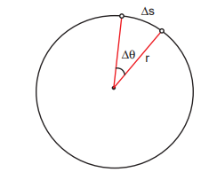
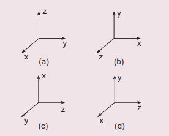
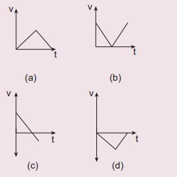
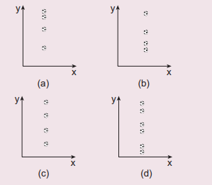
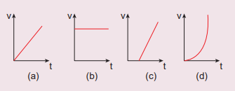
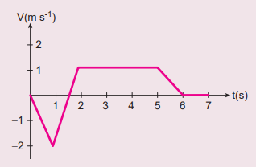
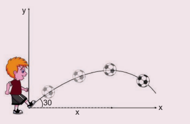
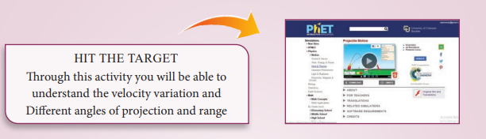
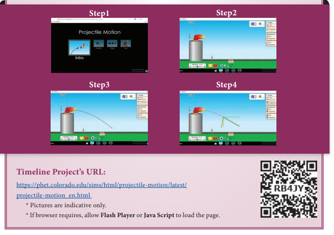

# PROJECTILE MOTION

## Introduction
When an object is thrown in the air with some initial velocity (NOT just upwards), and then allowed to move under the action of gravity alone, the object is known as a projectile. The path followed by the particle is called its trajectory.

**Examples of projectile are**
1. An object dropped from window of a moving train
2. A bullet fired from a rifle.
3. A ball thrown in any direction.
4. A javelin or shot put thrown by an athlete.
5. A jet of water issuing from a hole near the bottom of a water tank.

It is found that a projectile moves under the combined effect of two velocities.

(i) A uniform velocity in the horizontal direction, which will not change provided there is no air resistance.

(ii) A uniformly changing velocity (i.e., increasing or decreasing) in the vertical direction.

There are two types of projectile motion:

(i) Projectile given an initial velocity in the horizontal direction (horizontal projection)

(ii) Projectile given an initial velocity at an angle to the horizontal (angular projection)

To study the motion of a projectile, let us assume that,

(i) Air resistance is neglected.

(ii) The effect due to rotation of Earth and curvature of Earth is negligible.

(iii) The acceleration due to gravity is constant in magnitude and direction at all points of the motion of the projectile.

## Projectile in horizontal projection
Consider a projectile, say a ball, thrown horizontally with an initial velocity u from the top of a tower of height h (Figure 2.39).
As the ball moves, it covers a horizontal distance due to its uniform horizontal

velocity u, and a vertical downward distance because of constant acceleration due to gravity g. Thus, under the combined effect the ball moves along the path OPA. The motion is in a 2-dimensional plane. Let the ball take time t to reach the ground at point A, Then the horizontal distance travelled by the ball is x(\mathrm{t})=x, and the vertical distance travelled is \mathrm{y}(\mathrm{t})=\mathrm{y}

We can apply the kinematic equations along the x direction and y direction separately. Since this is two-dimensional motion, the velocity will have both horizontal component u_{x} and vertical component u_{y}.

**Motion along horizontal direction** 
The particle has zero acceleration along x direction. So, the initial velocity u_{x} remains constant throughout the motion.
The distance traveled by the projectile at a time t is given by the equation x=u_{x} t+\frac{1}{2} a t^{2}. Since \mathrm{a}=0 along x direction, we have


x=u_{x} t


**Motion along downward direction**

Here u_{y}=0 (initial velocity has no downward component), \mathrm{a}=\mathrm{g} (we choose the +ve \mathrm{y}-axis in downward direction), and distance y at time t


\begin{aligned}
\therefore \text { From equation, } y & =u_{y} t+\frac{1}{2} a t^{2} \text {, we get } \\
y & =\frac{1}{2} g t^{2}
\end{aligned}


Substituting the value of t from equation (2.23) in equation (2.24) we have


\begin{aligned}
& y=\frac{1}{2} g \frac{x^{2}}{u_{x}^{2}}=\left(\frac{g}{2 u_{x}^{2}}\right) x^{2} \\
& y=K x^{2}
\end{aligned}


where K=\frac{g}{2 u_{x}^{2}} is constant

Equation (2.25) is the equation of a parabola. Thus, the path followed by the projectile is a parabola (curve OPA in the Figure 2.39).

**(1) Time of Flight:** The time taken for the projectile to complete its trajectory or time taken by the projectile to hit the ground is called time of flight.

Consider the example of a tower and projectile. Let h be the height of a tower. Let \mathrm{T} be the time taken by the projectile to hit the ground, after being thrown horizontally from the tower.

We know that s_{y}=u_{y} t+\frac{1}{2} a t^{2} for vertical motion. Here s_{y}=h, t=T, u_{y}=0 (i.e., no initial vertical velocity). Then


h=\frac{1}{2} g T^{2} \quad \text { or } \quad \mathrm{T}=\sqrt{\frac{2 \mathrm{~h}}{\mathrm{~g}}}


Thus, the time of flight for projectile motion depends on the height of the tower, but is independent of the horizontal velocity of projection. If one ball falls vertically and another ball is projected horizontally with some velocity, both the balls will reach the bottom at the same time. This is illustrated in the Figure 2.40.

**Figure 2.40 Vertical distance covered by the two particles is same in equal intervals.**

**(2) Horizontal range:** The horizontal distance covered by the projectile from the foot of the tower to the point where the projectile hits the ground is called horizontal range.

For horizontal motion, we have


s_{x}=u_{x} t+\frac{1}{2} a t^{2}


Here, s_{x}=\mathrm{R} (range), u_{x}=u, \mathrm{a}=0 (no horizontal acceleration) T is time of flight. Then horizontal range =u T.

Since the time of flight T=\sqrt{\frac{2 h}{g}}, we substitute this and we get the horizontal range of the particle as R=u \sqrt{\frac{2 h}{g}}

The above equation implies that the range \mathrm{R} is directly proportional to the initial velocity u and inversely proportional to acceleration due to gravity g.

**(3) Resultant Velocity (Velocity of projectile at any time):** At any instant t, the projectile has velocity components along both x-axis and y-axis. The resultant of these two components gives the velocity of the projectile at that instant t, as shown in Figure 2.41

**Figure 2.41. Velocity resolved into two components**
The velocity component at any t along horizontal ( x-axis) is v_{x}=u_{x}+a_{x} t

Since, \mathrm{u}_{\mathrm{x}}=\mathrm{u}, \mathrm{a}_{\mathrm{x}}=0, we get


\mathrm{v}_{x}=\mathrm{u}


The component of velocity along vertical direction ( y-axis) is v_{y}=u_{y}+a_{y} t

Since, \mathrm{u}_{\mathrm{y}}=0, \mathrm{a}_{\mathrm{y}}=\mathrm{g}, we get


v_{y}=\mathrm{gt} \quad \rightarrow(2.27)


Hence the velocity of the particle at any instant is


\vec{v}=u \hat{i}+g t \hat{j}


The speed of the particle at any instant t is given by


\begin{aligned}
\therefore \quad v & =\sqrt{v_{x}^{2}+v_{y}^{2}} \\
v & =\sqrt{u^{2}+g^{2} t^{2}}
\end{aligned}


**(4) Speed of the projectile when it hits the ground:** When the projectile hits the ground after initially thrown horizontally from the top of tower of height h, the time of flight is


T=\sqrt{\frac{2 \mathrm{~h}}{\mathrm{~g}}}


The horizontal component velocity of the projectile remains the same i.e v_{x}=u

The vertical component velocity of the projectile at time T is


v_{y}=g T=g \sqrt{\frac{2 h}{g}}=\sqrt{2 g h}


The speed of the particle when it reaches the ground is


v=\sqrt{u^{2}+2 g h}


**Figure 2.42. Projectile motion**

## Projectile under an angular projection
This projectile motion takes place when the initial velocity is not horizontal, but at some angle with the vertical, as shown in
Figure 2.42.

**(Oblique projectile)**

**Examples:**
- Water ejected out of a hose pipe held obliquely.
- Cannon fired in a battle ground.

Consider an object thrown with initial velocity \vec{u} at an angle \theta with the horizontal. Refer Figures 2.42 and 2.43.

Then,


\vec{u}=u_{x} \hat{i}+u_{y} \hat{j}


where u_{x}=u \cos \theta is the horizontal component and u_{y}=u \sin \theta the vertical component of velocity.

Since the acceleration due to gravity is in the direction opposite to the direction of vertical component u_{y}, this component will gradually reduce to zero at the maximum height of the projectile. At this maximum height, the same gravitational force will push the projectile to move downward and fall to the ground. There is no acceleration along the \mathrm{x} direction throughout the motion. So, the horizontal component of the velocity \left(u_{x}=u\right. \cos \theta) remains the same till the object reaches the ground.

Hence after the time \mathrm{t}, the velocity along horizontal motion v_{x}=u_{x}+a_{x} t=u_{x}=u \cos \theta

The horizontal distance travelled by projectile in time t is s_{x}=u_{x} t+\frac{1}{2} a_{x} t^{2}

Here, s_{x}=x, u_{x}=u \cos \theta, a_{x}=0

**Figure 2.43. Initial velocity resolved into components**


\text { Thus, } \mathrm{x}=\mathrm{u} \cos \theta . \mathrm{t} \text { or } \mathrm{t}=\frac{\mathrm{x}}{\mathrm{u} \cos \theta}


Next, for the vertical motion v_{y}=u_{y}+a_{y} t Here u_{y}=u \sin \theta, a_{y}=-g (acceleration due to gravity acts opposite to the motion). Thus


\text { Thus, } v_{y}=u \sin \theta-g t


The vertical distance travelled by the projectile in the same time t is s_{y}=u_{y} t+\frac{1}{2} a_{y} t^{2}

Here, s_{y}=y, u_{y}=u \sin \theta, a_{y}=-\mathrm{g}. Then


y=u \sin \theta t-\frac{1}{2} g t^{2}


Substitute the value of t from equation (2.28) in equation (2.30), we have


\begin{aligned}
& y=u \sin \theta \frac{x}{u \cos \theta}-\frac{1}{2} g \frac{x^{2}}{u^{2} \cos ^{2} \theta} \\
& y=x \tan \theta-\frac{1}{2} g \frac{x^{2}}{u^{2} \cos ^{2} \theta}
\end{aligned}


Thus the path followed by the projectile is an inverted parabola.

**Maximum height \left(h_{\max }\right)**

The maximum vertical distance travelled by the projectile during its journey is called maximum height. This is determined as follows:

For the vertical part of the motion,


v_{y}^{2}=u_{y}^{2}+2 a_{y} s


Here, u_{y}=u \sin \theta, a_{y}=-g, s=h_{\max }, and at the maximum height v_{y}=0

Hence,


\begin{aligned}
& 0=u^{2} \sin ^{2} \theta-2 g h_{\max } \\
& \text { Or } h_{\max }=\frac{u^{2} \sin ^{2} \theta}{2 g}
\end{aligned}


**Time of flight \left(T_{f}\right)**

The total time taken by the projectile from the point of projection till it hits the horizontal plane is called time of flight.

This time of flight is the time taken by the projectile to go from point \mathrm{O} to \mathrm{B} via point A (Figure 2.43)

We know that s_{y}=u_{y} t+\frac{1}{2} a_{y} t^{2}

Here, s_{y}=y=0 (net displacement in y-direction is zero), u_{y}=u \sin \theta, a_{y}=-g, t=\mathrm{T}_{\mathrm{f}} Then


\begin{gathered}
0=u \sin \theta T_{f}-\frac{1}{2} g T_{f}^{2} \\
T_{f}=2 u \frac{\sin \theta}{g}
\end{gathered}


**Horizontal range ( \mathrm{R} )**

The maximum horizontal distance between the point of projection and the point on the horizontal plane where the projectile hits the ground is called horizontal range (R). This is found easily since the horizontal component of initial velocity remains the same. We can write

Range \mathrm{R}= Horizontal component of velocity \mathrm{x} time of flight =u \cos \theta \times T_{f}


\begin{aligned}
& R=u \cos \theta \times \frac{2 u \sin \theta}{g}=\frac{2 u^{2} \sin \theta \cos \theta}{g} \\
& \therefore R=\frac{u^{2} \sin 2 \theta}{g}
\end{aligned}


The horizontal range directly depends on the initial speed (\mathrm{u}) and the sine of angle of projection (\theta). It inversely depends on acceleration due to gravity ' \mathrm{g} ' For a given initial speed \mathrm{u}, the maximum possible range is reached when \sin 2 \theta is maximum, \sin 2 \theta=1. This implies 2 \theta=\pi / 2

This means that if the particle is projected at 45 degrees with respect to horizontal, it attains maximum range, given by.


R_{\max }=\frac{u^{2}}{g}


---
**Projectile motion !**

In Tamil Nadu there is an interesting traditional game ‘kitti pull’. When the ‘pull’ is hit by the kitti, the path followed by the pull is ‘parabolic’.

---

**Example 2.37**
Suppose an object is thrown with initial speed 10 \mathrm{~m} \mathrm{~s}^{-1} at an angle \pi / 4 with the horizontal, what is the range covered? Suppose the same object is thrown similarly in the Moon, will there be any change in the range? If yes, what is the change? (The acceleration due to gravity in the Moon g_{\text {moon }}=\frac{1}{6} g )

**_Solution_**

In projectile motion, the range of particle is given by,


\begin{gathered}
R=\frac{u^{2} \sin 2 \theta}{g} \\
\theta=\pi / 4 \quad u=v_{0}=10 \mathrm{~m} \mathrm{~s}^{-1} \\
\therefore R_{\text {earth }}=\frac{(10)^{2} \sin \pi / 2}{9.8}=100 / 9.8 \\
R_{\text {earth }}=10.20 \mathrm{~m} \text { (Approximately } 10 \mathrm{~m} \text { ) }
\end{gathered}


If the same object is thrown in the Moon, the range will increase because in the Moon, the acceleration due to gravity is smaller than g on Earth,


\begin{gathered}
g_{\text {moon }}=\frac{g}{6} \\
R_{\text {moon }}=\frac{u^{2} \sin 2 \theta}{g_{\text {moon }}}=\frac{v_{0}^{2} \sin 2 \theta}{g / 6} \\
\therefore R_{\text {moon }}=6 R_{\text {earth }} \\
R_{\text {moon }}=6 \times 10.20=61.20 \mathrm{~m} \\
\text { (Approximately } 60 \mathrm{~m})
\end{gathered}


The range attained on the Moon is approximately six times that on Earth.

**Example 2.38**
In the cricket game, a batsman strikes the ball such that it moves with the speed 30 \mathrm{m} \mathrm{s}^{-1} at an angle 30^{\circ} with the horizontal as shown in the figure. The boundary line of the cricket ground is located at a distance of 75 \mathrm{~m} from the batsman? Will the ball go for a six? (Neglect the air resistance and take acceleration due to gravity \mathrm{g}=10 \mathrm{~m} \mathrm{~s}^{-2} ).

**_Solutions_**

The motion of the cricket ball in air is essentially a projectile motion. As we have already seen, the range (horizontal distance) of the projectile motion is given by


R=\frac{u^{2} \sin 2 \theta}{g}


The initial speed u=30 \mathrm{~m} \mathrm{~s}^{-1}

The projection angle \theta=30^{\circ}

The horizontal distance travelled by the cricket ball


R=\frac{(30)^{2} \times \sin 60^{\circ}}{10}=\frac{900 \times \frac{\sqrt{3}}{2}}{10}=77.94 \mathrm{~m}


This distance is greater than the distance of the boundary line. Hence the ball will cross this line and go for a six.

## Introduction to Degrees and Radians
In measuring angles, there are several possible units used, but the most common units are degrees and radians. Radians are used in measuring area, volume, and circumference of circles and surface area of spheres.

Radian describes the planar angle subtended by a circular arc at the centre of a circle. It is defined as the length of the arc divided by the radius of the arc. One radian is the angle subtended at the centre of a circle by an arc that is equal in length to the radius of the circle. This is shown in the Figure 2.44.


\theta=1 \text { radian }(\mathrm{rad})


**Figure 2.44 One radian (shown in yellow color)**

Degree is the unit of measurement which is used to determine the size of an angle. When an angle goes all the way around in a circle, the total angle covered is equivalent to 360^{\circ}. Thus, a circle has 360^{\circ}. In terms of radians, the full circle has 2 \pi radian.

Hence we write 360^{\circ}=2 \pi radians


\text { or } 1 \text { radians }=\frac{180}{\pi} \text { degrees }


which means 1 \mathrm{rad} \cong 57.27^{\circ}

**Example 2.39**

Calculate the angle \theta subtended by the two adjacent wooden spokes of a bullock cart wheel is shown in the figure. Express the angle in both radian and degree.

**_Solution_**

The full wheel subtends 2 \pi radians at the centre of the wheel. The wheel is divided into 12 parts (arcs).

So one part subtends an angle \theta=\frac{2 \pi}{12}=\frac{\pi}{6} radian at the centre

Since, \pi \mathrm{rad}=180^{\circ}, \frac{\pi}{6} radian is equal to 30 degree.

\therefore The angle subtended by two adjacent wooden spokes is 30 degree at the centre.

**Note**
The number π plays a very important role in both physics and mathematics. It is an irrational number which cannot be expressed in finite decimal form. However, we can approximate π as ≈ 3.14 or 22/7 But we should not forget that is only an approximation to π and not equal to π.

## Angular displacement
Consider a particle revolving around a point \mathrm{O} in a circle of radius \mathrm{r} (Figure 2.45). Let the position of the particle at time t=0 be A and after time t, its position is B.

**Figure 2.47 Angular displacement**

Then,

The angle described by the particle about the axis of rotation (or centre O ) in a given time is called angular displacement.

i.e., angular displacement =\angle A O B=\theta

The unit of angular displacement is radian.

The angular displacement (\theta) in radian is related to arc length S(A B) and radius r as


\theta=\frac{S}{r}, \quad \text { or } \quad S=r \theta


**Angular velocity ( ω )**

The rate of change of angular displacement is called angular velocity.

If \theta is the angular displacement in time t, then the angular velocity \omega is


\omega=\lim _{\Delta t \rightarrow 0} \frac{\Delta \theta}{\Delta t}=\frac{d \theta}{d t}


The unit of angular velocity is radian per second \left(\mathrm{rad} \mathrm{s}^{-1}\right). The direction of angular velocity is along the axis of rotation following the right hand rule. This is shown in Figure 2.46.

**Figure 2.47 Direction of angular velocity**

**i) Angular acceleration (α)**
The rate of change of angular velocity is called angular acceleration.


\vec{\alpha}=\frac{d \vec{\omega}}{d t}


The angular acceleration is also a vector quantity which need not be in the same direction as angular velocity.

**Tangential acceleration**
Consider an object moving along a circle of radius \mathrm{r}. In a time \Delta t, the object travels an arc distance \Delta s as shown in Figure 2.47. The corresponding angle subtended is \Delta \theta

**Figure 2.47 Circular motion**

The \Delta \mathrm{s} can be written in terms of \Delta \theta as,


\Delta s=r \Delta \theta


In a time \Delta t, we have


\frac{\Delta s}{\Delta t}=r \frac{\Delta \theta}{\Delta t}


In the limit \Delta t \rightarrow 0, the above equation becomes


\frac{d s}{d t}=r \omega


Here \frac{d s}{d t} is linear speed (v) which is tangential to the circle and \omega is angular speed. So equation (2.37) becomes


v=r \omega


which gives the relation between linear speed and angular speed.

---
**Note**
The direction of linear velocity v is tangential to the circle, whereas the direction of angular velocity ω is along the axis of rotation. The radius is also representedas a vector r directed radially from the centre of the circle.

---
Equation (2.38) is true only for circular motion. In general the relation between linear and angular velocity is given by


\vec{v}=\vec{\omega} \times \vec{r}


For circular motion equation (2.39) reduces to equation (2.38) since \vec{\omega} and \vec{r} are perpendicular to each other.

Differentiating the equation (2.38) with respect to time, we get (since r is constant)


\frac{d v}{d t}=\frac{r d \omega}{d t}=r \alpha


Here \frac{d v}{d t} is the tangential acceleration and is denoted as a_{t} \cdot \frac{d \omega}{d t} is the angular acceleration \alpha. Then eqn. (2.39) becomes


a_{t}=r \alpha


The tangential acceleration a_{t} experienced by an object in circular motion is shown in Figure 2.48.

**Figure 2.49 Tangential motion**

## Circular Motion
When a point object is moving on a circular path with a constant speed, it covers equal distances on the circumference of the circle in equal intervals of time. Then the object is said to be in uniform circular motion. This is shown in Figure 2.49.

**Figure 2.49 Uniform circular motion**

In uniform circular motion, the velocity is always changing but speed remains the same. Physically it implies that magnitude of velocity vector remains constant and only the direction changes continuously.

If the velocity changes in both speed and
direction during the circular motion, we get
non uniform circular motion.
**Centripetal acceleration**
As seen already, in uniform circular motion the velocity vector turns continuously without changing its magnitude (speed), as shown in Figure 2.50.

**Figure 2.50 Velocity in uniform circular motion**

Note that the length of the velocity vector (blue) is not changed during the motion, implying that the speed remains constant. Even though the velocity is tangential at every point in the circle, the acceleration is acting towards the centre of the circle. This is called centripetal acceleration. It always points towards the centre of the circle. This is shown in the Figure 2.51.

**Figure 2.51 Centripetal acceleration**

The centripetal acceleration is derived from a simple geometrical relationship between position and velocity vectors (Figure 2.48 or Figure 2.52)

**Figure 2.52 Geometrical relationship between the postion and velocity vectors**

Let the directions of position and velocity vectors shift through the same angle \theta in a small interval of time \Delta \mathrm{t}, as shown in Figure 2.52. For uniform circularmotion, r=\left|\vec{r}_{1}\right|=\left|\vec{r}_{2}\right| and v=\left|\vec{v}_{1}\right|=\left|\vec{v}_{2}\right|. If the particle moves from position vector \vec{r}_{1} to \vec{r}_{2}, the displacement is given by \Delta \vec{r}=\vec{r}_{2}-\vec{r}_{1} and the change in velocity from \vec{v}_{1} to \vec{v}_{2} is given by \Delta \vec{v}=\vec{v}_{2}-\vec{v}_{1}. The magnitudes of the displacement \Delta \mathrm{r} and of \Delta v satisfy the following relation


\frac{\Delta r}{r}=-\frac{\Delta v}{v}=\theta


Here the negative sign implies that \Delta v points radially inward, towards the centre of the circle.
For uniform circular motion v=\omega r, where \omega is the angular velocity of the particle about the centre. Then the centripetal acceleration can be written as


a=-\omega^{2} r


---
**Note**
The magnitude of centripetal acceleration is constant for uniform circular motion. But centripetal acceleration is not constant, but takes different directions during the motion.

---
**Non uniform circular motion**
If the speed of the object in circular motion is not constant, then we have non-uniform circular motion. For example, when the bob attached to a string moves in vertical circle, the speed of the bob is not the same at all time. Whenever the speed is not same in circular motion, the particle will have both centripetal and tangential acceleration as shown in the Figure 2.53.

**Figure 2.53 Resultant acceleration (a R ) in non uniform circular motion**

The resultant acceleration is obtained by vector sum of centripetal and tangential acceleration.

Since centripetal acceleration is \frac{v^{2}}{r}, the magnitude of this resultant acceleration is given by a_{R}=\sqrt{a_{t}^{2}+\left(\frac{v^{2}}{r}\right)^{2}}.

This resultant acceleration makes an angle \theta with the radius vector as shown in Figure 2.53.

This angle is given by \tan \theta=\frac{a_{t}}{\left(v^{2} / r\right)}.

**Example 2.40**

A particle moves in a circle of radius 10 \mathrm{~m}. Its linear speed is given by v=3 t where t is in second and \mathrm{v} is in \mathrm{m} \mathrm{s}^{-1}.

(a) Find the centripetal and tangential acceleration at \mathrm{t}=2 \mathrm{~s}.

(b) Calculate the angle between the resultant acceleration and the radius vector.

**_Solution_**

The linear speed at \mathrm{t}=2 \mathrm{~s}


v=3 t=6 m s^{-1}


The centripetal acceleration at \mathrm{t}=2 \mathrm{~s} is


a_{c}=\frac{v^{2}}{r}=\frac{(6)^{2}}{10}=3.6 \mathrm{~m} \mathrm{~s}^{-2}


The tangential acceleration is a_{t}=\frac{d v}{d t}=3 m \bar{s}^{-2} The angle between the radius vector with resultant acceleration is given by


\begin{gathered}
\tan \theta=\frac{a_{t}}{a_{c}}=\frac{3}{3.6}=0.833 \\
\theta=\tan ^{-1}(0.833)=0.69 \text { radian }
\end{gathered}


In terms of degree \theta=0.69 \times 57.27^{\circ} \approx 40^{\circ}

---
Are we moving with the same speed both day and night with respect to Sun? 

Earth orbits the Sun in an elliptical orbit. Let us specify the velocity of the centre of Earth with respect to Sun as \vec{v}_{c}. This \vec{v}_{c} is due to the elliptical motion of the Earth around the Sun. We know that at the same time Earth is also spinning on its own axis. Due to this spinning, all objects on the surface of the Earth undergo circular motion with velocity \left(\vec{v}_{s}\right) with respect to the axis of rotation of the Earth. At night both \vec{v}_{c} and \vec{v}_{s} are either in the same direction or at an acute angle with each other. So, the velocity of an object on the surface of Earth with respect to Sun at night time is \vec{v}_{\text {night }}=\vec{v}_{c}+\vec{v}_{s}. 

During the day \vec{v}_{c} and \vec{v}_{s} are either in opposite directions or at an obtuse angle with each other. So, the velocity of the object with respect to Sun at day time \vec{v}_{d a y}=\vec{v}_{c}-\vec{v}_{s}. From this, we can conclude that any object on the surface of the Earth travels faster with respect to Sun during night than during day time. This happens due to the rotation of the Earth.

---

**Kinematic Equations of circular motion**

 If an object is in circular motion with constant angular acceleration \alpha, we can derive kinematic equations for this motion, analogous to those for linear motion.Let us consider a particle executing circular motion with initial angular velocity \omega_{0}. After a time interval t it attains a final angular velocity \omega. During this time, it covers an angular displacement \theta. Because of the change in angular velocity there is an angular acceleration \alpha.

The kinematic equations for circular motion are easily written by following the kinematic equations for linear motion in section 2.4 .3

The linear displacement (s) is replaced by the angular displacement (\theta).

The velocity (v) is replaced by angular velocity (\omega).

The acceleration (a) is replaced by angular acceleration (\alpha).

The initial velocity (\mathrm{u}) is replaced by the initial angular velocity \left(\omega_{0}\right).

By following this convention, kinematic equations for circular motion are as in the table given below.

| Kinematic   equations for linear   motion | Kinematic   equations for   angular motion |
| :--- | :--- |
| v=u+a t | \omega=\omega_{0}+\alpha t |
| s=u t+\frac{1}{2} a t^{2} | \theta=\omega_{0} t+\frac{1}{2} \alpha t^{2} |
| v^{2}=u^{2}+2 a s | \omega^{2}=\omega_{0}^{2}+2 \alpha \theta |
| s=\frac{(v+u) t}{2} | \theta=\frac{\left(\omega_{0}+\omega\right) t}{2} |

---
**Note**
Kinematic equations for linear motion are applicable for only constant acceleration. Similarly kinematic equations for angular
motion are applicable to only constant angular acceleration.

---
**Example 2.41**
A particle is in circular motion with an acceleration \alpha=0.2 \mathrm{rad} \mathrm{s}^{-2}.

(a) What is the angular displacement made by the particle after 5 \mathrm{~s} ?

(b) What is the angular velocity at t=5 \mathrm{~s} ?. Assume the initial angular velocity is zero.

**_Solutions_**

Since the initial angular velocity is zero \left(\omega_{0}=0\right).

The angular displacement made by the particle is given by


\begin{aligned}
& \theta=\omega_{0} t+\frac{1}{2} \alpha t^{2} \\
& \quad \theta=\frac{1}{2} \times 2 \times 10^{-1} \times 25=2.5 \mathrm{rad}
\end{aligned}


In terms of degree


\theta=2.5 \times 57.27^{\circ} \approx 143^{\circ}


**Summary**
- A state of rest or of motion is defined with respect to a frame of reference.
- In Physics, we conventionally follow a right handed Cartesian coordinate system to explain the motion of objects
- To explain linear motion the concept of point mass is used.
- A vector is a quantity which has both magnitude and direction. A scalar has only magnitude.
- The length of a vector is called magnitude or norm of the vector
- In a Cartesian coordinate system the unit vectors are orthogonal to each other.
- Vectors can be added using either the triangular law of addition or the parallelogram law of addition.
- Any vector can be resolved into three components with respect to a Cartesian coordinate system
- The magnitude or norm of a vector \vec{A} is given by |\vec{A}|=A=\sqrt{A_{x}^{2}+A_{y}^{2}+A_{z}^{2}}
- If two vectors are equal, then their corresponding individual components should be separately equal.
- The position vector of a particle with respect to a Cartesian coordinate system is given by \vec{r}=x \hat{i}+y \hat{j}+z \hat{k}
- The scalar product of two vectors is defined by \vec{A} \cdot \vec{B}=A B \cos \theta ( \theta is the angle between \vec{A} and \vec{B} )
- The vector product of two vectors is defined by \vec{A} \times \vec{B}=(A B \sin \theta) \hat{n}. The direction of \hat{n} can be found using right hand thumb rule or right hand cork screw rule.
- In physics, scalar and vector products are used to describe various concepts.
- Distance is the total path length travelled by the particle and displacement is the difference between final and initial positions. Distance is a scalar quantity and displacement is a vector
- Average velocity is defined as \vec{v}_{a v g}=\frac{\Delta \vec{r}}{\Delta t} and instantaneous velocity is defined as \vec{v}=\lim _{\Delta t \rightarrow 0} \frac{\Delta \vec{r}}{\Delta t}=\frac{d \vec{r}}{d t}. Both average velocity and instantaneous velocity are vector quantities.
- Momentum is defined as \vec{p}=m \vec{v}.
- The average acceleration is defined as \vec{a}_{\text {avg }}=\frac{\vec{v}_{2}-\vec{v}_{1}}{t_{2}-t_{1}}=\frac{\Delta \vec{v}}{\Delta t} and instantaneous acceleration is defined as \vec{a}=\lim _{\Delta t \rightarrow 0} \frac{\Delta \vec{v}}{\Delta t}=\frac{d \vec{v}}{d t}
- For constant acceleration, kinematic equations can be used to analyse motion of a particle.
- In projectile motion for which acceleration is uniform, the path traced by the particle is a parabola.
- The maximum height and range of the particle in projectile motion depend inversely on acceleration due to gravity g.
- The angular displacement of the particle is defined by \theta=\frac{s}{r} and angular velocity \vec{\omega}=\frac{d \vec{\theta}}{d t}
- The relation between the linear velocity and angular velocity is given by \vec{v}=\vec{\omega} \times \vec{r}
- The centripetal acceleration is given by a_{c}=-\frac{v^{2}}{r} or -\omega^{2} r and is always directed towards the centre of the circle.

**EVALUATION**

 **I. Multi Choice Question**

 1. Which one of the following Cartesian coordinate systems is not followed in physics?

 

 2. Identify the unit vector in the following.

(a) \hat{i}+\hat{j}
(b) \frac{\hat{i}}{\sqrt{2}}
(c) \hat{k}-\frac{\hat{j}}{\sqrt{2}}
(d) \frac{\hat{i}+\hat{j}}{\sqrt{2}}

3. Which one of the following physical quantities cannot be represented by a scalar?

(a) Mass

(b) length

(c) momentum

(d) magnitude of acceleration

4. Two objects of masses m_{1} and m_{2} fall from the heights h_{1} and h_{2} respectively. The ratio of the magnitude of their momenta when they hit the ground is (AIPMT 2012)

(a) \sqrt{\frac{h_{1}}{h_{2}}}

(b) \sqrt{\frac{m_{1} h_{1}}{m_{2} h_{2}}}

(c) \frac{m_{1}}{m_{2}} \sqrt{\frac{h_{1}}{h_{2}}}

(d) \frac{m_{1}}{m_{2}}

5. If a particle has negative velocity and negative acceleration, its speed

(a) increases

(b) decreases

(c) remains same

(d) zero

6. If the velocity is \vec{v}=2 \hat{i}+t^{2} \hat{j}-9 \vec{k}, then the magnitude of acceleration at \mathrm{t}=0.5 s is

(a) 1 \mathrm{~m} \mathrm{~s}^{-2}

(b) 2 \mathrm{~m} \mathrm{~s}^{-2}

(c) zero

(d) -1 \mathrm{~m} \mathrm{~s}^{-2}

7. If an object is dropped from the top of a building and it reaches the ground at t =4 \mathrm{~s}, then the height of the building is (ignoring air resistance) \left(\mathrm{g}=9.8 \mathrm{~ms}^{-2}\right)

(a) 77.3 \mathrm{~m}

(b) 78.4 \mathrm{~m}

(c) 80.5 \mathrm{~m}

(d) 79.2 \mathrm{~m}

8. A ball is projected vertically upwards with a velocity v. It comes back to ground in time \mathrm{t}. Which \mathrm{v}-t graph shows the motion correctly?

9. If one object is dropped vertically downward and another object is thrown horizontally from the same height, then the ratio of vertical distance covered by both objects at any instant t is

(a) 1

(b) 2

(c) 4

(d) 0.5

10. A ball is dropped from some height towards the ground. Which one of the following represents the correct motion of the ball?

11. If a particle executes uniform circular motion in the xy plane in clock wise direction, then the angular velocity is in

(a) +y direction

(b) +z direction

(c) -z direction

(d) -\mathrm{x} direction

12. If a particle executes uniform circular motion, choose the correct statement

(NEET 2016)

(a) The velocity and speed are constant.

(b) The acceleration and speed are constant.

(c) The velocity and acceleration are constant.

(d) The speed and magnitude of acceleration are constant.

13. If an object is thrown vertically up with the initial speed u from the ground, then the time taken by the object to return back to ground is

(a) \frac{u^{2}}{2 g}

(b) \frac{u^{2}}{g}

(c) \frac{u}{2 g}

(d) \frac{2 u}{g}

14. Two objects are projected at angles 30^{\circ} and 60^{\circ} respectively with respect to the horizontal direction. The range of two objects are denoted as R_{30^{\circ}} and R_{60^{\circ}}. Choose the correct relation from the following

(a) R_{30^{\circ}}=R_{60^{0}}

(b) R_{30^{0}}=4 R_{60^{0}}

(c) R_{30^{\circ}}=\frac{R_{60^{0}}}{2}

(d) R_{30^{0}}=2 R_{60^{\circ}}

15. An object is dropped in an unknown planet from height 50 \mathrm{~m}, it reaches the ground in 2 \mathrm{~s}. The acceleration due to gravity in this unknown planet is

(a) \mathrm{g}=20 \mathrm{~m} \mathrm{~s}^{-2}

(b) g=25 \mathrm{~m} \mathrm{~s}^{-2}

(c) g=15 \mathrm{~m} \mathrm{~s}^{-2}

(d) g=30 \mathrm{~m} \mathrm{~s}^{-2}

**Answers**

| 1) \mathrm{d} | 2) \mathrm{d} | 3) c | 4) \mathrm{c} | 5) \mathrm{a} |
| ---: | ---: | ---: | ---: | ---: |
| 6) \mathrm{a} | 7) \mathrm{b} | \mathbf{8}) \mathrm{c} | 9) \mathrm{a} | \mathbf{1 0} \mathrm{a} |
| 11) \mathrm{c} | \mathbf{1 2} \mathrm{d} \mathrm{d} | \mathbf{1 3} \mathrm{d} \mathrm{d} | \mathbf{1 4} \mathrm{a} \mathrm{a} | \mathbf{1 5} \mathrm{b} \mathrm{b} |

**II. Short Answer Questions**

1. Explain what is meant by Cartesian coordinate system?
2. Define a vector. Give examples
3. Define a scalar. Give examples
4. Write a short note on the scalar product between two vectors.
5. Write a short note on vector product between two vectors.
6. How do you deduce that two vectors are perpendicular?
7. Define displacement and distance.
8. Define velocity and speed.
9. Define acceleration.
10. What is the difference between velocity and average velocity.
11. Define a radian.
12. Define angular displacement and angular velocity.
13. What is non uniform circular motion?
14. Write down the kinematic equations for angular motion.
15. Write down the expression for angle made by resultant acceleration and radius vector in the non uniform circular motion.

**I I I . Long Answer Questions**

1. Explain in detail the triangle law of addition.
2. Discuss the properties of scalar and vector products.
3. Derive the kinematic equations of motion for constant acceleration.
4. Derive the equations of motion for a particle (a) falling vertically (b) projected vertically
5. Derive the equation of motion, range and maximum height reached by the particle thrown at an oblique angle \theta with respect to the horizontal direction.
6. Derive the expression for centripetal acceleration.
7. Derive the expression for total acceleration in the non uniform circular motion.

**IV. Exercises**

1. The position vectors particle has length 1 \mathrm{~m} and makes 30^{\circ} with the x-axis. What are the lengths of the \mathrm{x} and \mathrm{y} components of the position vector?


\left[\text { Ans: } l_{x}=\frac{\sqrt{3}}{2}, l_{y}=0.5\right]


2. A particle has its position moved from \vec{r}_{1}=3 \hat{i}+4 \hat{j} to \vec{r}_{2}=\hat{i}+2 \hat{j}. Calculate the displacement vector (\Delta \vec{r}) and draw the \vec{r}_{1}, \vec{r}_{2} and \Delta \vec{r} vector in a two dimensional Cartesian coordinate system.


[\text { Ans: } \Delta \vec{r}=-2 \hat{i}-2 \hat{j}]


3. Calculate the average velocity of the particle whose position vector changes from \vec{r}_{1}=5 \hat{i}+6 \hat{j} to \vec{r}_{2}=2 \hat{i}+3 \hat{j} in a time 5 second.


\left[\text { Ans: } \vec{v}_{\text {avg }}=-\frac{3}{5}(\hat{i}+\hat{j})\right]


4. Convert the vector \vec{r}=3 \hat{i}+2 \hat{j} into a unit vector.


\left[\text { Ans: } \hat{r}=\frac{(3 \hat{i}+2 \hat{j})}{\sqrt{13}}\right]


5. What are the resultants of the vector product of two given vectors given by


\vec{A}=4 \hat{i}-2 \hat{j}+\hat{k} \text { and } \vec{B}=5 \hat{i}+3 \hat{j}-4 \hat{k} ?


[ Ans: 5 \hat{i}+21 \hat{j}+22 \hat{k}

6. An object at an angle such that the horizontal range is 4 times of the
maximum height. What is the angle of projection of the object?

[Ans: \theta=45^{\circ} ]

7. The following graphs represent velocity - time graph. Identify what kind of motion a particle undergoes in each graph.

[Ans: (a) \vec{a}= constant (b) \vec{v}= constant (c) \vec{a}= constant but greater than first graph (d) \vec{a} is variable]

8. The following velocity-time graph represents a particle moving in the positive \mathrm{x}-direction. Analyse its motion from 0 to 7 \mathrm{~s}. Calculate the displacement covered and distance travelled by the particle from 0 to 2 \mathrm{~s}.

[Ans: distance =1.75 \mathrm{~m}, displacement =-1.25 \mathrm{~m} ]

9. A particle is projected at an angle of \theta with respect to the horizontal direction. Match the following for the above motion.

(a) v_{x} \quad- decreases and increases

(b) v_{y} \quad - remains constant

(c) Acceleration - varies (d) Position vector - remains downward

[Ans: v_{x}= remains constant, v_{y}= decreases and increases, a= remains downward, r= varies ]

10. A water fountain on the ground sprinkles water all around it. If the speed of the water coming out of the fountain is v. Calculate the total area around the fountain that gets wet.


\left[\text { Ans: Area }=\frac{\pi v^{4}}{g^{2}}\right]


11. The following table gives the range of a particle when thrown on different planets. All the particles are thrown at the same angle with the horizontal and with the same initial speed. Arrange the planets in ascending order according to their acceleration due to gravity, (g value).

| Planet | Range |
| :--- | :--- |
| Jupiter | 50 \mathrm{~m} |
| Earth | 75 \mathrm{~m} |
| Mars | 90 \mathrm{~m} |
| Mercury | 95 \mathrm{~m} |

[Ans: g_{\text {jupiter }} is greater, g_{\text {mercury }} is
smaller]

12. The resultant of two vectors A and B is perpendicular to vector A and its magnitude is equal to half of the magnitude of vector \mathrm{B}. Then the angle between \mathrm{A} and \mathrm{B} is

a) 30^{\circ}

b) 45^{\circ}

c) 150^{\circ}

d) 120^{\circ}

[Ans: \theta=150^{\circ} ]

13. Compare the components for the following vector equations

a) T \hat{j}-m a \hat{j}=m a \hat{j}

b) \vec{T}+\vec{F}=\vec{A}+\vec{B}

c) \vec{T}-\vec{F}=\vec{A}-\vec{B}

d) T \hat{j}+m g \hat{j}=m a \hat{j}

[Ans: (a) T-m g=m a

(b) T_{x}+F_{x}=A_{x}+B_{x} etc. ]

14. Calculate the area of the triangle for which two of its sides are given by the vectors \vec{A}=5 \hat{i}-3 \hat{j}, \vec{B}=4 \hat{i}+6 \hat{j}

[Ans: Area =21 squared units]

15. If Earth completes one revolution in 24hours, what is the angulardisplacement made by Earth in one hour. Express your answer in both radian and degree.


\text { [Ans: } \theta=15^{\circ} \text { or } \frac{\pi}{12} \text { ] }


16. A object is thrown with initial speed 5 \mathrm{~m} \mathrm{~s}^{-1} with an angle of projection 30^{\circ}. What is the height and range reached by the particle?

[Ans: height =0.318 \mathrm{~m} Range =2.21 \mathrm{~m} ]

17. A foot-ball player hits the ball with speed 20 \mathrm{~m} \mathrm{~s}^{-1} with angle 30^{\circ} with respect to horizontal direction as shown in the figure. The goal post is at distance of 40 \mathrm{~m} from him. Find out whether ball reaches the goal post?

[Ans: Ball will not reach the goal post. The range =35.3 \mathrm{~m} ]

18. If an object is thrown horizontally with an initial speed 10 \mathrm{~m} \mathrm{~s}^{-1} from the top of a building of height 100 \mathrm{~m}. what is the horizontal distance covered by the particle?

[Ans: \mathrm{R}=45 \mathrm{~m} ]

19. An object is executing uniform circular motion with an angular speed of \frac{\pi}{12} radian per second. At \mathrm{t}=0 the object starts at an angle \theta=0 What is the angular displacement of the particle after 4 \mathrm{~s} ?

[Ans: \left.60^{\circ}\right]

20. Consider the \mathrm{x}-axis as representing east, the \mathrm{y}-axis as north and \mathrm{z}-axis as vertically upwards. Give the vector representing each of the following points.

a) 5 \mathrm{~m} north east and 2 \mathrm{~m} up

b) 4 \mathrm{~m} south east and 3 \mathrm{~m} up

c) 2 \mathrm{~m} north west and 4 \mathrm{~m} up


\begin{aligned}
& {\left[\text { Ans: }(\mathrm{a}) \frac{5(\hat{i}+\hat{j})}{\sqrt{2}}+2 \hat{k}(\mathrm{~b}) \frac{4(\hat{i}-\hat{j})}{\sqrt{2}}+3 \hat{k}\right.} \\
& \text { (c) }(-\hat{i}+\hat{j}) \sqrt{2}+4 \hat{k}]
\end{aligned}


21. The Moon is orbiting the Earth approximately once in 27 days, what is the angle transversed by the Moon per day?

[Ans: 13^{\circ} 3^{\prime} ]

22. An object of mass m has angular acceleration \alpha=0.2 \mathrm{rad} \mathrm{s}^{-2}. What is the angular displacement covered by the object after 3 second? (Assume that the object started with angle zero with zero angular velocity).

[Ans: 0.9 \operatorname{rad} or 51^{\circ} ]

**BOOKS FOR REFERENCE**

1. Charles Kittel, Walter Knight, Malvin Ruderman, Carl Helmholtz and Moyer, Mechanics, 2^{\text {nd }} edition, Mc Graw Hill Pvt Ltd,
2. A.P.French, Newtonian Mechanics, Viva-Norton Student edition
3. SomnathDatta, Mechanics, Pearson Publication
4. H.C.Verma, Concepts of physics volume 1 and Volume 2, Bharati Bhawan Publishers
5. Serway and Jewett, Physics for scientist and Engineers with modern physics, Brook/Coole publishers, Eighth edition
6. Halliday, Resnick \& Walker, Fundamentals of Physics, Wiley Publishers, 10^{\text {th }} edition

**ICT CORNER**

**Projectile motion**

**STEPS:**

- Type the given URL (or) Scan the QR Code. You can see "Projectile Motion" PhET simulation page. Click 'Intro' to initiate the activity.
- Click the red coloured shoot button. Blast a ball out of a cannon, and challenge yourself to hit the target.
- Drag 'up \& down' button to change the height of the cylinder. Click left and right button to change the speed of the cannon ball.
- Drag the target box and fix the target to measure time, range and height. Drag the Meter tape to measure the length from cannon. On the right side top, mark in the corresponding boxes to know the velocity vectors and acceleration vectors.

