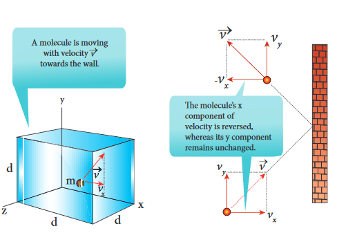

  

**9.1**

**Learning Objectives**

**In this unit, the student is exposed to** • necessity of kinetic theory of gases • the microscopic origin of pressure and temper • correlate the internal energy of the gas and tran • meaning of degrees of freedom • calculate the total degrees of freedom for mono • law of equipartition of energy • calculation of the ratio of CP and CV • mean free path and its dependence with pressu • Brownian motion and its microscopic origin

**KINETIC THEORY**

## Introduction

Thermodynamics is basically a macroscopic science. We discussed macroscopic parameters like pressure, temperature and volume of thermodynamical systems in unit 8. In this unit we discuss the microscopic origin of pressure and temperature by considering a thermodynamic system as collection of particles or molecules. Kinetic theory relates pressure and temperature to molecular motion of sample of a gas and it is a bridge between Newtonian mechanics and thermodynamics. The present chapter introduces the kinetic nature of gas molecules.

_“With thermodynamics one can calculate alm calculate fe_  

ature slational kinetic energy of gas molecules

atomic, diatomic and triatomic molecules

re, temperature and number density

C THEORY OF GASES

_ost everything crudely; with kinetic theory, one can wer things, but more accurately.”_ \- Eugene Wigner

## Postulates of kinetic theory of gases

Kinetic theory is based on certain assumptions which makes the mathematical treatment simple. None of these assumptions are strictly true yet the model based on these assumptions can be applied to all gases.

1\. All the molecules of a gas are identical, elastic spheres.

2\. The molecules of different gases are different.

3\. The number of molecules in a gas is very large and the average separation between them is larger than size of the gas molecules.

4\. The molecules of a gas are in a state of continuous random motion.

5\. The molecules collide with one another and also with the walls of the container.

  

**9.2**

6\. These collisions are perfectly elastic so that there is no loss of kinetic energy during collisions.

7\. Between two successive collisions, a molecule moves with uniform velocity.

8\. The molecules do not exert any force of attraction or repulsion on each other except during collision. The molecules do not possess any potential energy and the energy is wholly kinetic.

9\. The collisions are instantaneous. The time spent by a molecule in each collision is very small compared to the time elapsed between two consecutive collisions.

10\. These molecules obey Newton’s laws of motion even though they move randomly.

**PRESSURE EXERTED BY A GAS**

## Expression for pressure exerted by a gas

Consider a monoatomic gas of N molecules each having a mass m inside a cubical container of side _l_ as shown in the Figure 9.1 (a).

**Figure 9.1** (a) Container of gas molecules  

The molecules of the gas are in random motion. They collide with each other and also with the walls of the container. As the collisions are elastic in nature, there is no loss of kinetic energy, but a change in momentum occurs.

The molecules of the gas exert pressure on the walls of the container due to collision on it. During each collision, the molecules impart certain momentum to the wall. Due to transfer of momentum, the walls experience a continuous force. The force experienced per unit area of the walls of the container determines the pressure exerted by the gas. It is essential to determine the total momentum transferred by the molecules in a short interval of time.

A molecule of mass m moving with a velocity \(\vec{v}\)
having components(\(v_x, v_y, v_z\))
 hits the right side wall. Since we have assumed that the collision is elastic, the particle rebounds with same speed and its x-component is reversed. This is shown in the Figure 9.1 (b). The components of velocity of the molecule after collision are (\(-v_x, v_y, v_z\))
.

The x-component of momentum of the molecule before collision = \(m \cdot v_x\)

**Figure 9.1** (b) Collision of a molecule with the wall

  

The x-component of momentum of the molecule after collision = \(-mv_x\)

The change in momentum of the molecule in x direction =Final momentum – initial momentum = \(-mv_x\)
\(-mv_x = -2mv_x\)

According to law of conservation of linear momentum, the change in momentum of the wall = \(2mv_x\)

In x direction, the total momentum of the system before collision is equal to momentum of the molecule

\((mv_x\))since the momentum of the wall is zero. According to the law of conservation of momentum the total momentum of system after the collision must be equal to total momentum of system before collision. The momentum of the molecule (in x direction) after the collision is \(-mv_x\)
 and the momentum of the wall after the collision is \(2mv_x\). So total momentum of the system after the collision is \((2mv_x - mv_x) = mv_x\)
 which is same as the total momentum of the system before collision.

**Note**

The number of molecules hitting the right side wall in a small interval of time \(\Delta t\)is calculated as follows.

The molecules within the distance of \(v_x \Delta t\)
 from the right side wall and moving towards the right will hit the wall in the time interval \(\Delta t\). This is shown in the Figure 9.2. The number of molecules that will hit the right side wall in a time interval \(\Delta t\) is equal to the product of volume \((A v_x \Delta t\))and number density of the molecules (_n_). Here _A_ is area of the wall and _n_ is number of molecules per unit volume \([\frac{N}{V}]\)

 .

We have assumed that the number density is the same throughout the cube.  

Not all the n molecules will move to the right, therefore on an average only half of the n molecules move to the right and the other half moves towards left side.

The number of molecules that hit the right side wall in a time interval 

\= \(\frac{n}{2Av_x \Delta t}\)     (9.1)

In the same interval of time \(\Delta t\), the total momentum transferred by the molecules
\(\Delta p = \frac{n}{2} A v_x \Delta t \times 2m v_x = \frac{A v_x^2}{mn \Delta t}\)    (9.2)

From Newton’s second law, the change in momentum in a small interval of time gives rise to force.

The force exerted by the molecules on the wall (in magnitude)

\[ F = \frac{\Delta p}{\Delta t} = \frac{nmAv_x^2}{\Delta t} \]  (9.3)

Pressure, P = force divided by the area of the wall

\[ P = \frac{F}{A} = \frac{nmv_x^2}{x} \]
 (9.4)

Since all the molecules are moving completely in random manner, they do not have same speed. So we can replace the term \(v_x^2\)by the average\(\overline{v_x^2}\) in equation (9.4)

**Figure 9.2** Number of molecules hitting the wall

  

\[ p = nm\overline{v^2x} \]
(9.5)

Since the gas is assumed to move in random direction, it has no preferred direction of motion (the effect of gravity on the molecules is neglected). It implies that the molecule has same average speed in all the

three direction. So, \[ \overline{v_x^2} = \overline{v_y^2} = \overline{v_z^2} \]
. The mean square speed is written as

\[ \overline{v^2} = \overline{v_x^2} +\overline{v_y^2} +\overline{v_z^2} =\overline{3v_x^2} \]

\[\overline{v_x^2}=\frac{1}{3} \overline{v^2}  \]

Using this in equation (9.5), we get

\[ P = \frac{1}{3}nm \overline{v^2} \]

or 

\[ P = \frac{1}{3} \frac{Nm\overline{v^2}}{V} \] (9.6)

as [\(n = \frac{N}{V}\)]

The following inference can be made from the above equation. The pressure exerted by the molecules depends on

(i) **Number density** \(n = \frac{N}{V}\)

\= . It implies that if the number density increases then pressure will increase. For example when we pump air inside the cycle tyre or car tyre essentially the number density increases and as a result the pressure increases.

(ii) **Mass of the molecule** Since the pressure arises due to momentum transfer to the wall, larger mass will have larger momentum for a fixed speed. As a result the pressure will increase.

(iii) Mean square speed For a fixed mass if we increase the speed, the average speed will also increase. As a result the pressure will increase.

For simplicity the cubical container is taken into consideration. The above result is true for any shape of the container as the area A does not appear in the final expression (9.6). Hence the pressure exerted by gas  

molecules on the wall is independent of area of the wall (A).

## Kinetic interpretation of temperature

To understand the microscopic origin of temperature in the same way,

Rewrite the equation (9.6)
\[ P = \frac{1}{3}nm \overline{v^2} \]

\[ P = \frac{1}{3} {Nm\overline{v^2} }\]

(9.7)

Comparing the equation (9.7) with ideal gas equation _PV=NkT_,

\[ NkT=\frac{1}{3} {Nm\overline{v^2}} \]

\[ kT=\frac{1}{3} {m\overline{v^2}} \]

 (9.8)

Multiply the above equation by 3/2 on both sides,

3

2

1

2

2_kT mv_\= (9.9)

R.H.S of the equation (9.9) is called average kinetic energy of a single molecule (_KE_).

The average kinetic energy per molecule

_KE_ = ∈ = 3

2 _kT_ (9.10)

Equation (9.9 ) implies that the temperature of a gas is a measure of the average translational kinetic energy per molecule of the gas.

Compare this with the definition of temperature studied in lower classes:

Temperature is the degree of hotness or coldness!

**Note**

Equation 9.10 is a very important result from kinetic theory of gas. We can infer the following from this equation.

| Pn=as  n |12 |
|------|------|
| mv3N = V  |
  

(i) The average kinetic energy of the molecule is directly proportional to absolute temperature of the gas. The equation (9.9) gives the connection between the macroscopic world (temperature) to microscopic world (motion of molecules).

(ii) The average kinetic energy of each molecule depends only on temperature of the gas not on mass of the molecule. In other words, if the temperature of an ideal gas is measured using thermometer, the average kinetic energy of each molecule can be calculated without seeing the molecule through naked eye.

By multiplying the total number of gas molecules with average kinetic energy of each molecule, the internal energy of the gas is obtained.

Internal energy of ideal gas _U N mv_\=  

 

1

2

2

By using equation (9.9)

_U NkT_\= 3

2 (9.11)

From equation (9.11), we understand that the internal energy of an ideal gas depends only on absolute temperature and is independent of pressure and volume.

**EXAMPLE 9.1**

A football at 27°C has 0.5 mole of air molecules. Calculate the internal energy of air in the ball.

**_Solution_**

The internal energy of ideal gas = 3

2 _NkT_.

The number of air molecules is given in terms of number of moles so, rewrite the expression as follows  

_U RT_\= 3 2

µ

Since _Nk = μR_. Here _μ_ is number of moles.

Gas constant _R_ = 8.31 _J mol k_

Temperature T =273+27=300K

U = 3

2 × 0.5 × 8.31 × 300 = 1869.75_J_

This is approximately equivalent to the kinetic energy of a man of 57 kg running with a speed of 8 m s-1.

## Relation between pressure and mean kinetic energy

From earlier section, the internal energy of the gas is given by

_U NkT_\= 3

2

The above equation can also be written as

_U_ = 3

2 _PV_

since _PV_ = _NkT_

_P_ = 2

3

2

3

_U V_

_u_\= (9.12)

From the equation (9.12), we can state that the pressure of the gas is equal to two thirds of internal energy per unit volume or internal energy density (_u = U_

_V_ ).

Writing pressure in terms of mean kinetic energy density using equation (9.6)

_P nmv v_\= = 1 3

1 3

2 2ρ (9.13)

where ρ = _nm_ = _mass density_ (Note n is number density)

Multiply and divide R.H.S of equation (9.13) by 2, we get

_P v_\= 

 



 

2 3 2

2ρ (9.14)

_P KE_\= 2 3

  

From the equation (9.14), pressure is equal to 2/3 of mean kinetic energy per unit volume.

## Some elementary deductions from kinetic theory of gases

**Boyle’s law:**

From equation (9.12), we know that _PV U_\= 2

3

But the internal energy of an ideal gas is equal to N times the average kinetic energy (∈) of each molecule.

_U_ \= _N_∈

For a fixed temperature, the average translational kinetic energy ∈ will remain constant. It implies that

_PV_ \= 2

3 N∈ Thus PV = constant

Therefore, pressure of a given gas is inversely _proportional to its volume provided the temperature remains constant. This is Boyle’s law_.

**Charles’ law:**

From the equation (9.12), we get _PV U_\= 2

3

_For a fixed pressure, the volume of the gas is proportional to internal energy of the gas or average kinetic energy of the gas and the average kinetic energy is directly proportional to absolute temperature. It implies that_

_V_ α _T or V T_

\= _constant_

This is Charles’ law.

**Avogadro’s law:**

This law states that at constant temperature and pressure, equal volumes of all gases contain the same number of molecules. For two different gases at the same temperature and pressure, according to kinetic theory of gases,  

From equation (9.6)

_P N V m v N_

_V m v_\= =1

3

1

3

1

1 1

2 2

2 2

2 (9.15)

where _v_ 1

2 and _v_2 2 are the mean square speed

for two gases and _N_1 and _N_2 are the number of gas molecules in two different gases.

At the same temperature, average kinetic energy per molecule is the same for two gases.

1

2

1

2 1 1

2

2 2

2_m v m v_\= (9.16)

Dividing the equation (9.15) by (9.16) we get _N_1 _\= N_2

This is Avogadro’s law. It is sometimes referred to as Avogadro’s hypothesis or Avogadro’s Principle.

## Root mean square speed (_vrms_)

Root mean square speed (vrms) is defined as the square root of the mean of the square of speeds

of all molecules. It is denoted by _v_rms = _v_2

Equation (9.8) can be re-written as,

mean square speed _v kT m_

2 3= (9.17)

root mean square speed,

_v_rms = 3 1 73

_kT m_

_kT m_

\= . (9.18)

From the equation (9.18) we infer the following (i) rms speed is directly proportional to

square root of the temperature and inversely proportional to square root of mass of the molecule. At a given temperature the molecules of lighter mass move faster on an average than the molecules with heavier masses.

  

3_R M_

3

Example: Lighter molecules like hydrogen and helium have high ‘_vrms_’ than heavier molecules such as oxygen and nitrogen at the same temperature. (ii) Increasing the temperature will

increase the r.m.s speed of molecules

We can also write the _v_rms in terms of gas constant R. Equation (9.18) can be rewritten as follows

_v_rms = 3_N kT N m A_

_A_

Where _N_A is Avogadro number.

Since _N_A_k = R_ and _N_A_m = M_ (molar mass)

The root mean square speed or r.m.s speed

_v_rms = 3_RT M_

(9.19)

The equation (9.6) can also be written in terms of rms speed _P nmv rms_\= 1

3

2

since _v vrms_ 2 2=

Root mean square speed is not the same as average speed. Average speed is 0.92 times of r.m.s speed.

**Note**

Impact of _vrms_ in nature:

1\. **Moon has no atmosphere.** The escape speed of gases on the surface of Moon is much less than the root mean square speeds of gases due to low gravity. Due to this all the gases escape from the surface of the Moon.

2\. **No hydrogen in Earth’s atmosphere**. As the root mean square speed of hydrogen is much greater than that of nitrogen, it easily escapes from the earth’s atmosphere.

In fact, the presence of nonreactive nitrogen instead of highly combustible hydrogen deters many disastrous consequences.  

**EXAMPLE 9.2**

A room contains oxygen and hydrogen molecules in the ratio 3:1. The temperature of the room is 27°C. The molar mass of 02 is 32 g mol-1 and of H2 is 2 g mol-1. The value of gas constant R is 8.32 J mol-1 K-1

**_Calculate_**

(a) rms speed of oxygen and hydrogen molecule

(b) Average kinetic energy per oxygen molecule and per hydrogen molecule

(c) Ratio of average kinetic energy of oxygen molecules and hydrogen molecules

**_Solution_**

(a) Absolute Temperature T=27°C =27+273=300 K.

Gas constant R=8.32 J mol-1 k-1

For Oxygen molecule: Molar mass M=32 g =32 x 10-3 kg mol-1

rms speed _vrms_\= 3 3 8 32 300

32 10 483 73 48

3

1_RT M_

_m s_\= × × ×

\= ≈− −.

.

3 8 32 300

32 10 483 73 484

3

1 1_T m s m s_\= × × ×

\= ≈− − −.

.

For Hydrogen molecule:

Molar mass M = 2 × 10-3 kg mol-1

rms speed _vrms_\= 3 3 8 32 300

2 10 1934 1 93

3

1_RT M_

_ms k_\= × × ×

\= =− −.

.

3 8 32 300

2 10 1934 1 93

3

1 1_RT M_

_ms k m s_\= × × ×

\= =− − −.

.

Note that the rms speed is inversely proportional to M and the molar mass of oxygen is 16 times higher than molar mass of hydrogen. It implies that the rms speed of hydrogen is 4 times greater than rms speed of oxygen at the same temperature. 1934 ≈ 4 .

  

_v_2

2 2 2 2 2 2 2 2 2 2 3 4 5 5 5 6 6 7

10 = + + + + + + + + +

(b) The average kinetic energy per

molecule is 3

2 _kT_ . It depends

only on absolute temperature of the gas and is independent of the nature of molecules. Since both the gas molecules are at the same temperature, they have the same average kinetic energy per molecule. _k_ is Boltzmaan constant.

3 2

3 2

1 38 10 300 6 21 1023 21_kT J_\= =× × × ×− −. .

(c) Average kinetic energy of total oxygen molecules =

3

O

2 _N kT_ where

_N_o- number of oxygen molecules in the room Average kinetic energy of total hydrogen molecules = 3

2 _N kTH_

where _NH_\- number of hydrogen molecules in the room. It is given that the number of oxygen molecules is 3 times more than number of hydrogen molecules in the room. So the ratio of average kinetic energy of oxygen molecules with average kinetic energy of hydrogen molecules is 3:1.

## Mean (or) average speed (_v_)

It is defined as the mean (or) average of all the speeds of molecules

If _v_1_, v_2_, v_3_…..v_N are the individual speeds of molecules then

_v_

_v v v v N_

_RT M_

_kT m_

_n_\= + + +

\= =1 2 3 8 8........ π π

(9.20)

Here M- Molar Mass and m – mass of the molecule.

_v kT m_

\= 1 60. (9.21)  

**9.2.7. Most probable speed (_Vmp_)**

It is defined as the speed acquired by most of the molecules of the gas.

_v RT M_

_kT mmp_ \= =2 2 (9.22)

_v kT mmp_ \= 1 41. (9.23)

The derivation of equations (9.20), (9.22) is beyond the scope of the book

**Comparison of _vrms, v and vmp_**

Among the speeds _v_rms is the largest and _v_mp is the least

_v_rms > _v > v_mp Ratio-wise,

_v_rms: _v_ :_v_mp \= 3 8 2 1 732 1 6 1 414: : . : . : .π =

**EXAMPLE 9.3**

Ten particles are moving at the speed of 2, 3, 4, 5, 5, 5, 6, 6, 7 and 9 m s-1. Calculate rms speed, average speed and most probable speed.

**_Solution_**

The average speed _v m s_\= + + + + + + + + + = −2 3 4 5 5 5 6 6 7 9

10 5 2

1 .

To find the rms speed, first calculate the mean square speed _v_2

_v m s_2

2 2 2 2 2 2 2 2 2 2

2 22 3 4 5 5 5 6 6 7 9 30 6

10 = + + + + + + + + + = −

.

_m s_ 2

2 29 30 6= −

.

The rms speed

_v v m srms_ \= = = −2 1 30 6 5 53. .

The most probable speed is 5 m s-1 because three of the particles have that speed.

|------|------|
| kT |
| v = 16. 0 |m |
  

**EXAMPLE 9.4**

Calculate the rms speed, average speed and the most probable speed of 1 mole of hydrogen molecules at 300 K. Neglect the mass of electron.

**_Solution_**

The hydrogen atom has one proton and one electron. The mass of electron is negligible compared to the mass of proton. Mass of one proton = 1.67 × 10−27_kg_. One hydrogen molecule = 2 hydrogen atoms = 2 × 1.67 × 10−27_kg_. The average speed

_v kT_

_m kT m_

\= = = × ×

−8 1 60 1 60 1 38 10 2 1 67 1

23

π . . ( .

( .

_kT m_

_kT m_

\= = = × × ×

× −

−1 60 1 60 1 38 10 300 2 1 67 10

1 78 1 23

27π . . ( . ) )

( . ) .( 03 1_ms_−

(Boltzmann Constant k = 1.38 × 10−23 _J K_\-1)

The rms speed _v kT m_

_kT mrms_ \= = =3

1 73 1. .

_kT m_

_kT m_

\= = =× × ×

−

−

3 1 73 1 73

1 38 10 300

2 1 67 10 1 93

23

27 . .

( . ) ( )

( . ) . × −

10 3 1_ms_

Most probable speed _v kT m_

_kT mmp_ \= = =2

1 41 1. .

_kT m_

_kT m_

\= = =× × ×

× −

−

2 1 41 1 41

1 38 10 300

2 1 67 10 1 57

23

27 . .

( . ) ( )

( . ) . 10

3 1_ms_−

Note that _v_rms > _v > v_mp

## Maxwell-Boltzmann speed distribution function

In a classroom, the air molecules are moving in random directions. The speed of each molecule is not the same even though macroscopic parameters like temperature and pressure are fixed. Each molecule collides with every other molecule and they exchange their speed. In the previous section  

we calculated the rms speed of each molecule and not the speed of each molecule which is rather difficult. In this scenario we can find the number of gas molecules that move with the speed of 5 m s−1 to 10 m s−1 or 10 m s−1to 15 m s−1 etc. In general our interest is to find how many gas molecules have the range of speed from v to v + dv. This is given by Maxwell’s speed distribution function.

_N N m kT_

_v ev_

_mv kT_\=



 



 

− 4

2

3 2 2 2

2

π π

(9.24)

The above expression is graphically shown as follows

_Nv_

_v_ mp _v_ avg

_v_ rms

_dv v_

_Nv_

The number of molecules having speeds ranging from _v_ to _v_+ _dv_equals the area of the rectangle, _Nv__dv_

**Figure 9.3** Maxwell’s molecular speed distribution

From the Figure 9.3, it is clear that, for a given temperature the number of molecules having lower speed increases parabolically

(_v_2) but decreases exponentially (_e mv_

_kT_ \-

2

2 ) after reaching most probable speed. The rms speed, average speed and most probable speed are indicated in the Figure 9.3. It can be seen that the rms speed is greatest among the three.

\= ×

×−

300 0

1 78 127

) ) )

.( 03 1_ms_−

\=× × ×

−

−73 1 38 10 300

2 1 67 10 1 93

23

27

( . ) ( )

( . ) . × −

10 3 1_ms_

\=× × ×

× −

−41 1 38 10 300

2 1 67 10 1 57

23

27

( . ) ( )

( . ) . 10

3 1_ms_−

| EXAMPLE 9 . 4Calculate t he r ms s peed, a verage s peed and t he m ost p robable s peed o f 1 m ole o f hydrogen m olecules a t 300 K. N eglect t he mass of electron.Solutione hydrogen atom has one proton and one electron. e mass of electron is negligible compared to the mass of proton. Mass of one proton = 1.67 × 10 kg. One  hydrogen  molecule  = 2  hydrogen atoms = 2 × 1.67 × 10 kg.The average speed −278kT −27kT (.13 81××0v == 16.. 01 60πm m 216(. 71(.13 81××0 )) (300==60 17. 81× 00 ms216(. 71× 0 ) × 10(B oltzmann Constant k = 1.38  J K )−2331 −The rms speed −27 3kT kTv == 17.. 31m −23 -1m(.13 81××0 )( 300)== 73 19. 3 ×× 10 ms216(. 71× 0 rms )2kT kTMost probable speed −23 v == 14.. 11m 31 m−−27(.13 81××0 )( 300)== 41 15.17 × 10 ms216(. 71× 0 )mpv  > v > vNote that −2331 −−27rms mp |
|------|

  

To know the number of molecules in the range of speed between 50 m s−1 and 60 m s−1, we

need to integrate 4 250

60 3 2 2 2

2

π π

_N m kT_

_v e dv N mv_

_kT_∫ 

 



  =

− (

50 60 3 2 2 2 1

2

_kT v e dv N to ms_

_mv kT_



  =

− −( ) . In general the

number of molecules within the range of speed v and v+dv is given by

4 2

3 2 2 2

2

π π

_N m kT_

_v e dv N v to v dv v_

_v dv mv kT_

\+ −

∫ 

 



  = +( ) .

The exact integration is beyond the scope of the book. But we can infer the behavior of gas molecules from the graph.

(i) The area under the graph will give the total number of gas molecules in the system

(ii) Figure 9.4 shows the speed distribution graph for two different temperatures. As temperature increases, the peak of the curve is shifted to the right. It implies that the average speed of each molecule will increase. But the area under each graph is same since it represents the total number of gas molecules.

**Figure 9.4** Maxwell distribution graph for tw  

**9.3**

Interestingly once the gas molecule attains equilibrium, the number of molecules in the given range

of speeds are fixed. For example if a molecule initially moving with speed 12 m s-1, collides with some other molecule and changes its speed to 9 m s-1, then the other molecule initially moving with different speed reaches the speed 12 m s-1 due to another collision. So in general once the gas molecules attain equilibrium, the number of molecules that lie in the range of v to v+dv is always fixed.

**Note**

**DEGREES OF FREEDOM**

## Definition

_The minimum number of independent coordinates needed to specify the position and configuration of a thermo-dynamical system in space is called the degree of freedom of the system._

50 60 1_to ms_− )

o different temperatures

  

**Example:** 1\. A free particle moving along x-axis

needs only one coordinate to specify it completely. So its degree of freedom is one.

2\. Similarly a particle moving over a plane has two degrees of freedom.

3\. A particle moving in space has three degrees of freedom.

Suppose if we have N number of gas molecules in the container, then the total number of degrees of freedom is f = 3N.

But, if the system has _q_ number of constraints (restrictions in motion) then the degrees of freedom decreases and it is equal to _f = 3N-q_ where N is the number of particles.

## Monoatomic molecule

A monoatomic molecule by virtue of its nature has only three translational degrees of freedom.

Therefore f = 3

**Example:** Helium, Neon, Argon

## Diatomic molecule

There are two cases.

**1\. At Normal temperature**

A molecule of a diatomic gas consists of two atoms bound to each other by a force of attraction. Physically the molecule can be regarded as a system of two point masses fixed at the ends of a massless elastic spring.

The center of mass lies in the center of the diatomic molecule. So, the motion of the center of mass requires three translational degrees of freedom (figure 9.5 a). In addition, the diatomic molecule can rotate  

about three mutually perpendicular axes (figure 9.5 b). But the moment of inertia about its own axis of rotation is negligible (about y axis in the figure 9.5). Therefore, it has only two rotational degrees of freedom (one rotation is about Z axis and another rotation is about X axis). Therefore totally there are five degrees of freedom.

_f_ \= 5

**2\. At High Temperature**

At a very high temperature such as 5000 K, the diatomic molecules possess additional

**Figure 9.5** Degree of freedom of diatomic molecule

**y**

**z**

**x**

**CM**

**Translational motion of the center of mass**

**y**

**z**

**x**

**Rotational motion about the z axis**

**Rotational motio the x axis**

**z**

**x**

**Vibrational motion along the molecular axis**

**Molecular Axis**

a

b

c

|------|------|------|

  

two degrees of freedom due to vibrational motion\[one due to kinetic energy of vibration and the other is due to potential energy\] (Figure 9.5c). So totally there are seven degrees of freedom.

_f_ \= 7

**Examples:** Hydrogen, Nitrogen, Oxygen.

## Triatomic molecules

There are two cases.

**Linear triatomic molecule**

In this type, two atoms lie on either side of the central atom as shown in the Figure 9.6

**Figure 9.6** A linear triatomic molecule.

OO C

Linear triatomic molecule has three translational degrees of freedom. It has two rotational degrees of freedom because it is similar to diatomic molecule except there is an additional atom at the center. At normal temperature, linear triatomic molecule will have five degrees of freedom. At high temperature it has two additional vibrational degrees of freedom. So a linear triatomic molecule has seven degrees of freedom.

**Example:** Carbon dioxide.  

**9.4**

**Non-linear triatomic molecule**

In this case, the three atoms lie at the vertices of a triangle as shown in the Figure 9.7

**Figure 9.7** A non-linear triatomic molecule

H H

O

It has three translational degrees of freedom and three rotational degrees of freedom about three mutually orthogonal axes. The total degrees of freedom, f = 6

**Example:** Water, Sulphurdioxide.

**LAW OF EQUIPARTITION OF ENERGY**

We have seen in Section 9.2.1 that the average kinetic energy of a molecule moving

in x direction is 1

2

1

2

2_mv kTx_ \= .

Similarly, when the motion is in y direction, 1

2

1

2

2_mv kTy_ \= and for the motion along

z direction, 1

2

1

2

2_mv kTz_ \= .

_According to kinetic theory, the average kinetic energy of system of molecules in thermal equilibrium at temperature T is uniformly distributed to all degrees of freedom (x or y or_

  

_z directions of motion) so that each degree of freedom will get_ 1

2 _kT of energy. This is called_

_law of equipartition of energy._

Average kinetic energy of a monatomic

molecule (with f=3) = 3 1

2

3

2 × =_kT kT_

Average kinetic energy of diatomic molecule at low temperature (with f = 5)

\= 5 1

2

5

2 × =_kT kT_

Average kinetic energy of a diatomic molecule at high temperature (with f =7)

\= 7 1

2

7

2 × =_kT kT_

Average kinetic energy of linear triatomic

molecule (with f = 7) = 7 1

2

7

2 × =_kT kT_

Average kinetic energy of non linear triatomic

molecule (with f = 6) = 6 1

2 3× =_kT kT_

## Application of law of equipartition energy in specific heat of a gas

Meyer’s relation _CP_ − _CV_ \= _R_ connects the two specific heats for one mole of an ideal gas.

Equipartition law of energy is used to calculate the value of _CP_ − _CV_ and the ratio

between them γ = _C C P_

_V_

. Here γ is called

adiabatic exponent.

**i) Monatomic molecule**

Average kinetic energy of a molecule

\= 3

2 _kT_

  

Total energy of a mole of gas

\= 3

2

3

2 _kT N RTA_× =  

For one mole, the molar specific heat at

constant volume _C dU dT_

_d dT_

_RTV_ \= =  

 

3

2

_C RV_ \=  

 

3

2

_C C R R R RP V_\= + = + =3

2

5

2

The ratio of specific heats,

γ = = = = _C C_

_R_

_R_

_P_

_V_

5 2 3 2

5 3

1 67.

**ii) Diatomic molecule**

Average kinetic energy of a diatomic molecule at low temperature = 5

2 _kT_

Total energy of one mole of gas

\= 5

2

5

2 _kT N RTA_× =

(Here, the total energy is purely kinetic)

For one mole Specific heat at constant volume

_C dU_

_dT RT RV_ \= = 

  

\=5

2

5

2

But _C C R R R RP V_\= + = + =5

2

7

2

∴ = = = =γ _C C_

_R_

_R_

_P_

_V_

7 2 5 2

7 5 1 40.

Energy of a diatomic molecule at high temperature is equal to 7

2 _RT_

_C dU dT_

_RT RV_ \= =  

 

\=7

2

7

2

∴ = + = +_C C R R RP V_ 7

2

_C RP_ \= 9 2

Note that the _CV_ and _CP_ are higher for diatomic molecules than the mono atomic molecules. It implies that to increase the temperature of

| 2 |
|------|
| 3 |

| 2 |
|------|
| 5 |
  

diatomic gas molecules by 1°C it require more heat energy than monoatomic molecules.

∴ = = = =γ _C_

_C_

_R_

_R P_

_V_

9 2

7 2

9 7 1 28.

**iii) Triatomic molecule**

**a) Linear molecule**

Energy of one mole= 7

2

7

2 _kT N RTA_× =

_C dU dT_

_d dT_

_RT_

_C R_

_C C R R R R_

_C C_

_R_

_V_

_V_

_P V_

_P_

_V_

\= = 

  



  

\=

\= + = + =

∴ = =

7 2

7 2

7 2

9 2

9 2 7

γ

2

9 7

1 28 _R_ \= = .

**b) Non-linear molecule**

Energy of a mole = 6

2

6

2 3_kT N RT RTA_× = =

_C dU dT_

_R_

_C C R R R R C C_

_R R_

_V_

_P V_

_P_

_V_

\= =

\= + = + =

∴ = = = =

3

3 4 4 3

4 3

1 33γ .

Note that according to kinetic theory model of gases the specific heat capacity at constant volume and constant pressure are independent of temperature. But in reality it is not sure. The specific heat capacity varies with the temperature.

**EXAMPLE 9.5**

Find the adiabatic exponent γ for mixture of μ1 moles of monoatomic gas and μ2 moles of a diatomic gas at normal temperature (27°C) .  

**9.5**

**_Solution_** The specific heat of one mole of a monoatomic

gas _CV_ = 3

2 _R_

For μ1 mole, _CV_ = 3

2 μ1 _R_ _CP_ = 5

2 μ1 _R_

The specific heat of one mole of a diatomic gas

_CV_ = 5

2 _R_

For μ2 mole, _CV_ = 5

2 μ2 _R_ _CP_ = 7

2 μ2 _R_

The specific heat of the mixture at constant

volume _CV_ = 3

2 μ1 _R_ + 5

2 μ2 _R_

The specific heat of the mixture at constant

pressure _CP_ = 5

2 μ1 _R_\+ 7

2 μ2 _R_

The adiabatic exponent γ = _C C_

_P_

_V_

\= + +

5 7 3 5

1 2

1 2

µ µ µ µ

**MEAN FREE PATH**

Usually the average speed of gas molecules is several hundred meters per second even at room temperature (27°C). Odour from an open perfume bottle takes some time to reach us even if we are closer to the room. The time delay is because the odour of the molecules cannot travel straight to us as it undergoes a lot of collisions with the nearby air molecules and moves in a zigzag path. This average distance _travelled by the molecule between two successive collisions is called mean free path (_λ_). We can calculate the mean free path based on kinetic theory._

**Expression for mean free path** We know from postulates of kinetic theory that the molecules of a gas are in random motion and they collide with each other. Between two successive collisions, a molecule

  

moves along a straight path with uniform velocity. This path is called mean free path.

Consider a system of molecules each with diameter d. Let n be the number of molecules per unit volume.

Assume that only one molecule is in motion and all others are at rest as shown in the Figure 9.8

**hit**

**hit**

**hit**

**miss hit**

**_vt_**

**miss**

**miss**

**_d_**

**Collision Diameter**

**Figure 9.8** Mean free path

If a molecule moves with average speed _v_ in a time t, the distance travelled is _vt_. In this time t, consider the molecule to move in an imaginary cylinder of volume π_d_2_vt._ It collides with any molecule whose center is within this cylinder. Therefore, the number of collisions is equal to the number of molecules in the volume of the imaginary cylinder. It is equal to π_d_2_vtn._ The total path length divided by the number of collisions in time t is the mean free path.

Mean free path, λ = _distance travelled_

_Number of collisions_

λ π π

\= = _vt_

_n d vt n d_2 2

1 (9.25)

Though we have assumed that only one molecule is moving at a time and other molecules are at rest, in actual practice all the molecules are in random motion. So the average relative speed of one molecule with respect to other molecules has to be taken into account. After some detailed calculations (you will learn in higher classes) the correct expression for mean free path  

∴ =λ π

1 2 2_n d_ (9.26)

The equation (9.26) implies that the mean free path is inversely proportional to number density. When the number density increases the molecular collisions increases so it decreases the distance travelled by the molecule before collisions.

Case1: Rearranging the equation (9.26) using ‘m’ (mass of the molecule)

∴ =λ

π _m d mn_2 2

But mn=mass per unit volume = _ρ_ (density of the gas)

∴ =λ π ρ _m_

_d_2 2 (9.27)

Also we know that PV = NkT

P = =_N V kT nkT_

∴ =_n P_

_kT_

Substituting n= ∴ _P kT_

in equation (9.26), we get

λ π

\= _kT_

_d P_2 2 (9.28)

The equation (9.28) implies the following

1\. Mean free path increases with increasing temperature. As the temperature increases, the average speed of each molecule will increase. It is the reason why the smell of hot sizzling food reaches several meter away than smell of cold food.

2\. Mean free path increases with decreasing pressure of the gas and diameter of the gas molecules.

  

**9.6**

**EXAMPLE 9.6**

An oxygen molecule is travelling in air at 300 K and 1 atm, and the diameter of oxygen molecule is 1.2 × 10−10_m_. Calculate the mean free path of oxygen molecule.

**_Solution_**

From (9.26) λ π

\= 1

2 2_nd_ We have to find the number density n By using ideal gas law

_n N_

_V P kT_

\= = = × × ×−

101 3 10

1 381 10 300

3

23

.

.

\=2.449× 1025 _molecues_/_m_3

λ

π =

× × × × × −

1 2 2 449 10 1 2 1025 10 2. ( . )

\=

× 1

15 65 10 5

.

λ = 0.63 × 10−6_m_

**BROWNIAN MOTION**

In 1827, Robert Brown, a botanist reported that grains of pollen suspended in a liquid moves randomly from one place to other. The random (Zig - Zag path) motion of pollen suspended in a liquid is called Brownian motion. In fact we can observe the dust particle in water moving in random directions. This discovery puzzled scientists for long time. There were a lot of explanations for pollen or dust to move in random directions but none of these explanations were found adequate. After a systematic study, Wiener and Gouy  

proposed that Brownian motion is due to the bombardment of suspended particles by molecules of the surrounding fluid. But during 19th century people did not accept that every matter is made up of small atoms or molecules. In the year 1905, Einstein gave systematic theory of Brownian motion based on kinetic theory and he deduced the average size of molecules.

According to kinetic theory, any particle suspended in a liquid or gas is continuously bombarded from all the directions so that the mean free path is almost negligible. This leads to the motion of the particles in a random and zig–zag manner as shown in Figure 9.9. But when we put our hand in water it causes no random motion because the mass of our hand is so large that the momentum transferred by the molecular collision is not enough to move our hand.

**Figure 9.9** Particles in Brownian motion

**1 2**

**3**

**4**

**5**

**6 10**

**8**

**7 9**

**14**

**12**

**13**

**11**

**Brownian motion**

**Factors affecting Brownian Motion**

1\. Brownian motion increases with increasing temperature.

2\. Brownian motion decreases with bigger particle size, high viscosity and density of the liquid (or) gas.

| EXAMPLE 9 . 6An o xygen m olecule i s t ravelling in a ir at 300 K a nd 1 a tm, a nd t he di ameter o f oxygen  molecule  is  1.2  ×  10 m.  Calculate the mean free path of oxygen molecule.Solution −10From (9.26) 1λ =2πndWe have to nd the number density nBy using ideal gas law2N P 101.31× 0n == =V kT 1.381 ××10 300=2.449× 10 molecues/m31 −23λ =22××π 25 .(449××10 312.) ×101=15.65 × 1025 −10 2λ = 0.63 × 10 m 5−6 |
|------|

|------|------|------|
| Figure 9.9 Particles in Brownian motion |
  

„ Kinetic theory explains the microscopi temperature, pressure.

„ The pressure exerted on the walls of gas co by the gas molecules on the walls.

„ The pressure _P nmv_\= 1

3

2 . The pressure is mass of molecule and mean square speed.

„ The temperature of a gas is a measure of t molecule of the gas. The average kinetic e to absolute temperature of gas and indep

„ The pressure is also equal to 2/3 of intern

„ The rms speed of gas molecules = vrms =

„ The average speed of gas molecules _v_ \= 8 π

„ The most probable speed of gas molecules _v_

„ Among the speeds _vrms_ is the largest and _v vrms > v_

„ The number of gas molecules in the rang Boltzmann distribution

_N dv N m_

_kT v e dvv_

_mv kT_\=



 



 

− 4

2

3 2 2 2

2

π π

„ The minimum number of independent c and configuration of a thermodynamica freedom of the system. If a sample of gas freedom f = 3N. If there are q number of f = 3N-q.

„ For a monoatomic molecule, f = 3 For a diatomic molecule (at normal temp

**S U M M A R Y**

The experimental verification on Ein motion was done by Jean Perrin in t Brownian motion and Perrin exper

because it provided direct evidence of reality

**Note**  

c origin of macroscopic parameters like

ntainer is due to the momentum imparted

directly proportional to the number density,

he average translational kinetic energy per nergy per molecule is directly proportional endent of nature of molecules. al energy per unit volume. 3_kT m_

_kT m_

\=1.73

_kT m_

_kT m_

\=1.60

_mp_ = 2_kT m_

_kT m_

\=1.41

_mp_ is the least

_\>vmp_ e of speed v to v+dv is given by Maxwell-

oordinates needed to specify the position l system in space is called the degrees of has N molecules, then the total degrees of constraints then total degrees of freedom

erature), f = 5

stein’s theoretical explanation of Brownian he year 1908. The Einstein’s explanation on iment was of great importance in physics of atoms and molecules.

  

For a diatomic molecule (at high temper

For a triatomic molecule (linear type), f

For a triatomic molecule (non-linear typ

„ The average kinetic energy of sample of g

freedom. It is called law of equipartition of energy.

„ The ratio of molar specific heat at consta

γ = 

  



  

_C C_

_p_

_v_

For

Monoatomic molecule: 1.67

Diatomic molecule (Normal temperature

Diatomic molecule (High temperature):

Triatomic molecule (Linear type): 1.28.

Triatomic molecule (Non-linear type): 1.

„ The mean free path λ π

\= _kT_

_d P_2 2 . The

temperature and inversely proportional t molecule

„ The Brownian motion explained by Alb proves the reality of atoms and molecule  

ature), f = 7

\= 7

e), f = 6

as is equally distributed to all the degrees of

energy. Each degree of freedom will get 1

2 _kT_

nt pressure and constant volume of a gas

) : 1.40

1.28

33

mean free path is directly proportional to

o size of the molecule and pressure of the

ert Einstein is based on kinetic theory. It s**.**

  

Kinetic theory

Origin of pressure Average Kinetic

Maxwell - Boltz distribution fun

Degree of freedo

Law of equipartiti of energy

Specic heat of g

**C O N C E P**  

of gases

energy

mann ction

m Mean free path

Brownian motionon

as

Origin of temperature

RMS speed

Most probable speed

Mean speed

**T M A P**

  

**I. Multiple choice questions**

**1\.** A particle of mass m is moving with speed _u_ in a direction which makes 60° with respect to x axis. It undergoes elastic collision with the wall. What is the change in momentum in x and y direction?

60º

v

(a) ∆_px_ = −_mu_, ∆_py_ = 0 (b) ∆_px_ = −2_mu_, ∆_py_ = 0 (c) ∆_px_ = 0, ∆_py_ = _mu_ (d) ∆_px_ = _mu_, ∆_py_ = 0

**2\.** A sample of ideal gas is at equilibrium. Which of the following quantity is zero? (a) rms speed (b) average speed (c) average velocity (d) most probable speed

**3\.** An ideal gas is maintained at constant pressure. If the temperature of an ideal gas increases from 100K to 10000K then the rms speed of the gas molecules (a) increases by 5 times (b) increases by 10 times (c) remains same (d) increases by 7 times  

**EVALUATION**

**4\.** Two identically sized rooms A and B are connected by an open door. If the room A is air conditioned such that its temperature is 4°C lesser than room B, which room has more air in it?

(a) Room A (b) Room B (c) Both room has same air (d) Cannot be determined

5\. The average translational kinetic energy of gas molecules depends on

(a) number of moles and T (b) only on T (c) P and T (d) P only

**6\.** If the internal energy of an ideal gas U and volume V are doubled then the pressure (a) doubles (b) remains same (c) halves (d) quadruples

**7\.** The ratio γ = _C C p_

_v_ for a gas mixture

consisting of 8 g of helium and 16 g of oxygen is (Physics Olympiad -2005) (a) 23/15 (b) 15/23 (c) 27/17 (d) 17/27

8\. A container has one mole of monoatomic ideal gas. Each molecule has f degrees of

freedom. What is the ratio of γ = _C C p_

_v_

| v |
|------|------|
| 60º |
  

(a) _f_ (b) _f_ 2

(c) _f f_ \+ 2

(d) _f f_ \+ 2

**9\.** If the temperature and pressure of a gas is doubled the mean free path of the gas molecules (a) remains same (b) doubled (c) tripled (d) quadrapoled

**10\.** Which of the following shows the correct relationship between the pressure and density of an ideal gas at constant temperature?

**P P P P**

**(b) (c) (d)(a)**

ρ ρ ρ ρ

**11\.** A sample of gas consists of _μ_1 moles of monoatomic molecules, _μ_2 moles of diatomic molecules and _μ_3 moles of linear triatomic molecules. The gas is kept at high temperature. What is the total number of degrees of freedom?

(a) \[3_μ_1 + 7( _μ_2 + _μ_3)\] _NA_

(b) \[3_μ_1 + 7 _μ_2 + 6_μ_3\] _NA_

(c) \[7_μ_1 + 3( _μ_2 + _μ_3)\] _NA_

(d) \[3_μ_1 + 6( _μ_2 + _μ_3)\] _NA_

12\. If sP and sV denote the specific heats of nitrogen gas per unit mass at constant pressure and constant volume respectively, then (JEE 2007)

(a) sP - sV = 28R (b) sP - sV = R/28 (c) sP - sV = R/14 (d) sP - sV = R

**13\.** Which of the following gases will have least rms speed at a given temperature? (a) Hydrogen  

(b) Nitrogen (c) Oxygen (d) Carbon dioxide

14\. For a given gas molecule at a fixed temperature, the area under the Maxwell-Boltzmann distribution curve is equal to

(a) _PV kT_

(b) _kT PV_

(c) _P NkT_

(d) _PV_

**15\.** The following graph represents the pressure versus number density for ideal gas at two different temperatures T1 and _T_2\. The graph implies

P

n

T1

T2

(a) _T_1 = _T_2

(b) _T_1 > _T_2

(c) _T_1 < _T_2

d) Cannot be determined

**Answers:**

1) a 2) c 3) b 4) a 5) a 6) b 7) c 8) d 9) a 10) d 11) a 12) b 13) d 14) a 15) b

  

**II. Short answer questions**

**1\.** What is the microscopic origin of pressure?

**2\.** What is the microscopic origin of temperature?

**3\.** Why moon has no atmosphere? **4\.** Write the expression for rms speed,

average speed and most probable speed of a gas molecule.

**5\.** What is the relation between the average kinetic energy and pressure?

6\. Define the term degrees of freedom. **7\.** State the law of equipartition of energy. 8. Define mean free path and write down

its expression. **9\.** Deduce Charles’ law based on kinetic

theory. **10\.** Deduce Boyle’s law based on kinetic

theory. **11\.** Deduce Avogadro’s law based on

kinetic theory. **12\. List the factors affecting the mean free**

path. **13\.** What is the reason for Brownian

motion?

**III. Long answer questions**

**1\.** Write down the postulates of kinetic theory of gases.

**2\.** Derive the expression of pressure exerted by the gas on the walls of the container.

**3\.** Explain in detail the kinetic interpretation of temperature.

**4\.** Describe the total degrees of freedom for monoatomic molecule, diatomic molecule and triatomic molecule.  

5\. Derive the ratio of two specific heat capacities of monoatomic, diatomic and triatomic molecules

**6\.** Explain in detail the Maxwell Boltzmann distribution function.

**7\.** Derive the expression for mean free path of the gas.

**8\.** Describe the Brownian motion.

**IV Numerical Problems**

**1\.** A fresh air is composed of nitrogen _N_2(78%) and oxygen _O_2(21%). Find the rms speed of _N_2 and _O_2 at 20°C.

Ans: For _N_2, _v_rms = 511 _m s_\-1

For _O_2,_v_rms = 478 _m s_\-1

**2\.** If the rms speed of methane gas in the Jupiter’s atmosphere is 471.8 m s-1, show that the surface temperature of Jupiter is sub-zero.

Ans: -130°C **3\.** Calculate the temperature at which the

rms velocity of a gas triples its value at S.T.P. (standard temperature T1 = 273 K)

Ans: T2 = 2457 K **4\.** A gas is at temperature 80°C and pressure

5 × 10−10_N m_−2. What is the number of molecules per m3 if Boltzmann’s constant is 1.38 × 10−23 _J K_−1

Ans: 1.02 × 1011

**5\.** If 1020 oxygen molecules per second strike 4 cm2 of wall at an angle of 30° with the normal when moving at a speed of 2 × 103 m s-1, find the pressure exerted on the wall. (mass of one oxygen atom = 2.67 × 10−26 kg)

Ans: 46.2 N m-2

**6\.** During an adiabatic process, the pressure of a mixture of monatomic and diatomic gases is found to be

  

**BOOKS FOR REFERENCE** 1\. Serway and Jewett, Physics for scientist and

publishers, Eighth edition 2. Paul Tipler and Gene Mosca, Physics for sci

Sixth edition, W.H.Freeman and Company 3. H.C.Verma, Concepts of physics -Volume 2, 4. Douglas C. Giancoli, Physics for scientist &

Edition 5. James Walker, Physics, Addison Wesley, Fou

proportional to the cube of the temperature. Find the value of _γ_ = (_Cp_/_CV_)

Ans: 3/2 **7\.** Calculate the mean free path of air

molecules at STP. The diameter of N2 and _O_2 is about 3 × 10−10 _m_

Ans: λ≈9.3 × 10−8 _m_ **8\.** A gas made of a mixture of 2 moles

of oxygen and 4 moles of argon at temperature T. Calculate the energy of the gas in terms of RT. Neglect the vibrational modes.

Ans: 11RT  

Engineers with modern physics, Brook/Coole

entist and engineers with modern physics,

Bharati Bhawan Publishers Engineers, Pearson Publications, Fourth

rth Edition

**9\.** Estimate the total number of air molecules in a room of capacity of 25 m3 at a temperature of 27°C with 1atm pressure.

Ans: 6.1 × 1026 molecules

  

**Kinetic Theo**

Through this activity you will be able to learn about the Brownian motion of the

particles.

**STEPS:** • Use the URL or scan the QR code to open ‘in

• Observe the movement of particles (Big bal Observe the molecules in the gas by draggin going on’

• Find the variants such as “Energy”, “Size Ra These variants can be lowered or increased.

• By dragging to the appropriate values of the shall be observed.

**URL:** http://labs.minutelabs.io/Brownian-Motion/

\* Pictures are indicative only. \* If browser requires, allow **Flash Player** or **Java Scr**

**ICT CORNER**

**Step1**

**Step3**  

**ry of Gases**

teractive’ simulation on “Brownian motion”.

ls) suspended in the gas at the initial stage. g the first slider. ‘Drag to see what’s actually

tio” and “Mass Ratio” below the first slider.

variants, Brownian motion of the particles

**ipt** to load the page.

**Step4**

**Step2**

