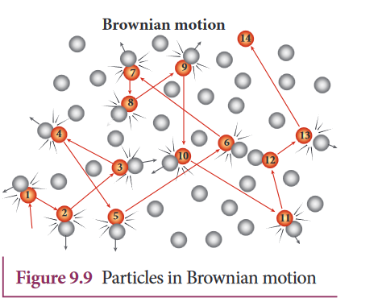

[comment]: <> (katex Header)

 
 
In 1827, Robert Brown, a botanist reported that grains of pollen suspended in a liquid move randomly from one place to other. The random (Zig - Zag path) motion of pollen suspended in a liquid is called Brownian motion. In fact, we can observe the dust particle in water moving in random directions. This discovery puzzled scientists for a long time. There were a lot of explanations for pollen or dust to move in random directions but none of these explanations were found adequate. After a systematic study, Wiener and Gouy proposed that Brownian motion is due to the bombardment of suspended particles by molecules of the surrounding fluid. But during the 19th century, people did not accept that every matter is made up of small atoms or molecules. In the year 1905, Einstein gave a systematic theory of Brownian motion based on kinetic theory and he deduced the average size of molecules.
 
According to kinetic theory, any particle suspended in a liquid or gas is continuously bombarded from all the directions so that the mean free path is almost negligible. This leads to the motion of the particles in a random and zig–zag manner as shown in Figure 9.9. But when we put our hand in water it causes no random motion because the mass of our hand is so large that the momentum transferred by the molecular collision is not enough to move our hand.

 
**Brownian motion**
 
**Factors affecting Brownian Motion**
 
1. Brownian motion increases with increasing temperature.
 
2. Brownian motion decreases with bigger particle size, high viscosity, and density of the liquid (or) gas.
 
**EXAMPLE 9.6**
 
An oxygen molecule is traveling in air at 300 K and 1 atm, and the diameter of the oxygen molecule $$ (1.2 \times 10^{-10}) m. $$ Calculate the mean free path of the oxygen molecule.
 
**Solution:**
From equation (9.26), $$(lambda = \frac{2\pi d}{N})$$.
 
We have to find the number density \(n\). By using the ideal gas law,
 
$$
n = \frac{N}{V} = \frac{P}{kT}
$$
 
$$
n = \frac{101.31 \times 10^3}{1.381 \times 10^{-23} \times 300}
$$
 
$$
n \approx 2.449 \times 10^{25} \text{ molecules/m}^3
$$
 
$$
\lambda = \frac{2 \times \pi \times 1.2 \times 10^{-10}}{2.449 \times 10^{25}}
$$
 
$$
\lambda \approx 0.63 \times 10^{-6} \, \text{m}
$$
 
---
 
| Figure 9.9 Particles in Brownian motion |
 
- Kinetic theory explains the microscopic behavior of gases in terms of temperature, pressure.
 
- The pressure exerted on the walls of a gas container is due to the collisions of gas molecules on the walls.
 
$$
P = \frac{1}{3} \cdot n \cdot m \cdot \overline{v^2}
$$
 
The pressure is related to the mass of the molecule and the mean square speed.
 
- The temperature of a gas is a measure of the average kinetic energy of a molecule of the gas. The average kinetic energy is directly proportional to absolute temperature of gas and independent of the nature of molecules.
 
- The pressure is also equal to $$( \frac{2}{3} )$$ of the internal kinetic energy per unit volume.
 
- The rms speed of gas molecules: $$(v_{\text{rms}} = \sqrt{\frac{3kT}{m}})$$
 
- The average speed of gas molecules: $$( \overline{v} = \frac{8}{\pi} \sqrt{\frac{kT}{m}} )$$
 
- The most probable speed of gas molecules: $$(v_{\text{mp}} = \sqrt{\frac{2kT}{m}})$$
 
- Among the speeds, $$(v_{\text{rms}}) $$is the largest and $$(v_{\text{mp}})$$is the least.
 
- The number of gas molecules in the range $$(v)$$ to $$(v + dv)$$ follows the Boltzmann distribution:
 
$$
N(v) \, dv = 4 \pi \left( \frac{m}{2 \pi kT} \right)^{3/2} v^2 e^{-\frac{mv^2}{2kT}} \, dv
$$
 
- The minimum number of independent coordinates needed to specify the state and configuration of a thermodynamic system is known as the degrees of freedom of the system. If a sample of gas has $$(N)$$ molecules, then the total number of degrees of freedom $$(f)$$ is given by $$(f = 3N)$$. If there are $$(q)$$ number of constraints, then $$(f = 3N-q)$$.
 
- For a monoatomic molecule, $$(f = 3)$$. For a diatomic molecule (at normal temperatures), $$(f = 5)$$.
 
 
 
**S U M M A R Y**
 
The experimental verification of Brownian motion was conducted by Jean Perrin in the year 1908. This motion provided direct evidence of the existence of atoms and molecules.
 
**Note:**
The microscopic origin of macroscopic parameters like pressure and temperature is explained by kinetic theory.
 
- The pressure in a gas container is due to the momentum imparted by gas molecules on the walls, directly proportional to the number density, average translational kinetic energy per molecule, and independent of the nature of molecules.
 
- The temperature of a gas is a measure of the average kinetic energy of gas molecules, directly proportional to absolute temperature and independent of the nature of molecules.
 
- The pressure is also equal to $$( \frac{2}{3} )$$ of the internal kinetic energy per unit volume.
 
- Important formulas:
  - RMS speed of gas molecules: $$( v_{\text{rms}} = \sqrt{\frac{3kT}{m}} )$$
  - Average speed of gas molecules: $$( \overline{v} = \frac{8}{\pi} \sqrt{\frac{kT}{m}} )$$
  - Most probable speed of gas molecules: $$( v_{\text{mp}} = \sqrt{\frac{2kT}{m}} )$$
 
- The number of gas molecules in a range of speed $$(v)$$ to $$(v+dv)$$ follows the Boltzmann distribution.
 
- Degrees of freedom: The minimum number of independent coordinates needed to specify the state and configuration of a thermodynamic system. For a monoatomic molecule, $$(f = 3)$$, and for a diatomic molecule at normal temperature, $$(f = 5)$$.
 
- The mean free path ($$(lambda)$$) is directly proportional to temperature and inversely proportional to the size of the molecule and pressure of the gas.
 
- Brownian motion, explained by Albert Einstein, proves the reality of atoms and molecules.
 
---
 
**C O N C E P T S**
 
**I. Multiple Choice Questions**
 
1. $$( \Delta_{px} = -mu, \Delta_{py} = 0 )$$
2. rms speed
3. Increases by 7 times
4. Room A
5. $$( P \propto nT )$$
6. Remains the same
7. $$( \frac{27}{17} )$$
8. $$( f(f + 2) )$$
9. Remains the same
10. $$( P \propto \rho )$$
11. $$( 3\mu_1 + 7(\mu_2 + \mu_3) )$$
12. $$( sP - sV = R/28 )$$
13. Carbon dioxide
14. $$( PV = kT )$$
15. $$( T_1 > T_2 )$$
 
**II. Short Answer Questions**
 
1. The microscopic origin of pressure is the momentum imparted by gas molecules on the walls.
2. The microscopic origin of temperature is the average kinetic energy of gas molecules.
3. The Moon has no atmosphere due to its low gravitational pull, allowing gases to escape into space.
4. Formulas:
   - $$(v_{\text{rms}}, \overline{v}, v_{\text{mp}})$$
   - $$(P = \frac{1}{3} n m \overline{v^2})$$
   - $$(f = 3N - q)$$
   - $$(\Lambda \propto \frac{kT}{\pi d^2 P})$$
5. The average kinetic energy is directly proportional to pressure.
6. Degrees of freedom represent the minimum number of independent coordinates needed to specify the state and configuration of a thermodynamic system.
7. Law of equipartition of energy states that each degree of freedom gets $$( \frac{1}{2} kT )$$ energy.
8. Mean free path is the average distance traveled by a gas molecule between collisions.
9. Charles' Law is deduced based on kinetic theory, stating that at constant pressure, the volume of a gas is directly proportional to its temperature.
10. Boyle's Law is deduced based on kinetic theory, stating that at constant temperature, the volume of a gas is inversely proportional to its pressure.
11. Avogadro's Law is deduced based on kinetic theory, stating that equal volumes of gases at the same temperature and pressure contain an equal number of molecules.
12. Factors affecting mean free path include temperature, pressure, and size of the molecule.
13. Brownian motion is caused by the collision of gas molecules with smaller particles.
 
**III. Long Answer Questions**
 
1. Kinetic theory postulates include the concept of gas molecules as point particles, random motion, elastic collisions, and molecular chaos.
2. The expression for pressure is derived from the kinetic theory of gases, relating it to the momentum change during collisions.
3. The kinetic interpretation of temperature explains how the average kinetic energy of gas molecules is related to temperature.
4. Degrees of freedom for monoatomic, diatomic, and triatomic molecules are described, emphasizing their influence on the specific heat ratio.
5. The ratio of specific heat capacities for different types of molecules is derived based on kinetic theory.
6. The Maxwell-Boltzmann distribution function is explained in detail, describing the distribution of speeds among gas molecules.
7. The expression for the mean free path of a gas is derived, considering factors like temperature, pressure, and molecule size.
8. Brownian motion is detailed, explaining the erratic movement of particles suspended in a fluid due to collisions with gas molecules.
 
**IV. Numerical Problems**
 
1. Rms speed of N2 and O2 at 20°C.
2. Surface temperature of Jupiter.
3. Temperature at which the rms velocity triples at S.T.P.
4. Number of molecules per m3 at 80°C and 5 × 10−10 N m−2.
5. Pressure exerted on a wall by oxygen molecules.
6. Total energy of a gas mixture of oxygen and argon.
7. Number of air molecules in a room at 27°C and 1 atm.
 
**BOOKS FOR REFERENCE**
1. Serway and Jewett, Physics for Scientists and Engineers, Eighth edition
2. Paul Tipler and Gene Mosca, Physics for Scientists and Engineers, Sixth edition, W.H. Freeman and Company
3. H.C. Verma, Concepts of Physics - Volume 2
4. Douglas C. Giancoli, Physics for Scientists & Engineers, Pearson Publications, Fourth Edition
5. James Walker, Physics, Addison Wesley, Fourth Edition
 
**ICT CORNER**
 
- [Brownian Motion Simulation](http://labs.minutelabs.io/Brownian-Motion/)
  - Observe the movement of particles and explore variants like energy, size ratio.
  - Understand Brownian motion's microscopic behavior.
 
\* Pictures are indicative only.
\* If the browser requires, allow Flash Player or Java Script.
 