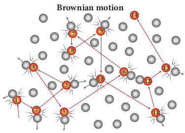
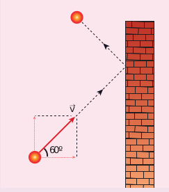
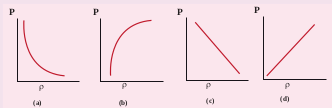

**BROWNIAN MOTION**

In 1827, Robert Brown, a botanist reported that grains of pollen suspended in a liquid moves randomly from one place to other. The random (Zig - Zag path) motion of pollen suspended in a liquid is called Brownian motion. In fact we can observe the dust particle in water moving in random directions. This discovery puzzled scientists for long time. There were a lot of explanations for pollen or dust to move in random directions but none of these explanations were found adequate. After a systematic study, Wiener and Gouy  

proposed that Brownian motion is due to the bombardment of suspended particles by molecules of the surrounding fluid. But during 19th century people did not accept that every matter is made up of small atoms or molecules. In the year 1905, Einstein gave systematic theory of Brownian motion based on kinetic theory and he deduced the average size of molecules.

According to kinetic theory, any particle suspended in a liquid or gas is continuously bombarded from all the directions so that the mean free path is almost negligible. This leads to the motion of the particles in a random and zig–zag manner as shown in Figure 9.9. But when we put our hand in water it causes no random motion because the mass of our hand is so large that the momentum transferred by the molecular collision is not enough to move our hand.

**Figure 9.9** Particles in Brownian motion

**1 2**

**3**

**4**

**5**

**6 10**

**8**

**7 9**

**14**

**12**

**13**

**11**

**Brownian motion**

**Factors affecting Brownian Motion**

1\. Brownian motion increases with increasing temperature.

2\. Brownian motion decreases with bigger particle size, high viscosity and density of the liquid (or) gas.

| EXAMPLE 9 . 6An o xygen m olecule i s t ravelling in a ir at 300 K a nd 1 a tm, a nd t he di ameter o f oxygen  molecule  is  1.2  ×  10 m.  Calculate the mean free path of oxygen molecule.Solution −10From (9.26) 1λ =2πndWe have to nd the number density nBy using ideal gas law2N P 101.31× 0n == =V kT 1.381 ××10 300=2.449× 10 molecues/m31 −23λ =22××π 25 .(449××10 312.) ×101=15.65 × 1025 −10 2λ = 0.63 × 10 m 5−6 |
|------|

|------|------|------|
| Figure 9.9 Particles in Brownian motion |
  

„ Kinetic theory explains the microscopi temperature, pressure.

„ The pressure exerted on the walls of gas co by the gas molecules on the walls.

„ The pressure _P nmv_\= 1

3

2 . The pressure is mass of molecule and mean square speed.

„ The temperature of a gas is a measure of t molecule of the gas. The average kinetic e to absolute temperature of gas and indep

„ The pressure is also equal to 2/3 of intern

„ The rms speed of gas molecules = vrms =

„ The average speed of gas molecules _v_ \= 8 π

„ The most probable speed of gas molecules _v_

„ Among the speeds _vrms_ is the largest and _v vrms > v_

„ The number of gas molecules in the rang Boltzmann distribution

_N dv N m_

_kT v e dvv_

_mv kT_\=



 



 

− 4

2

3 2 2 2

2

π π

„ The minimum number of independent c and configuration of a thermodynamica freedom of the system. If a sample of gas freedom f = 3N. If there are q number of f = 3N-q.

„ For a monoatomic molecule, f = 3 For a diatomic molecule (at normal temp

**S U M M A R Y**

The experimental verification on Ein motion was done by Jean Perrin in t Brownian motion and Perrin exper

because it provided direct evidence of reality

**Note**  

c origin of macroscopic parameters like

ntainer is due to the momentum imparted

directly proportional to the number density,

he average translational kinetic energy per nergy per molecule is directly proportional endent of nature of molecules. al energy per unit volume. 3_kT m_

_kT m_

\=1.73

_kT m_

_kT m_

\=1.60

_mp_ = 2_kT m_

_kT m_

\=1.41

_mp_ is the least

_\>vmp_ e of speed v to v+dv is given by Maxwell-

oordinates needed to specify the position l system in space is called the degrees of has N molecules, then the total degrees of constraints then total degrees of freedom

erature), f = 5

stein’s theoretical explanation of Brownian he year 1908. The Einstein’s explanation on iment was of great importance in physics of atoms and molecules.

  

For a diatomic molecule (at high temper

For a triatomic molecule (linear type), f

For a triatomic molecule (non-linear typ

„ The average kinetic energy of sample of g

freedom. It is called law of equipartition of energy.

„ The ratio of molar specific heat at consta

γ = 

  



  

_C C_

_p_

_v_

For

Monoatomic molecule: 1.67

Diatomic molecule (Normal temperature

Diatomic molecule (High temperature):

Triatomic molecule (Linear type): 1.28.

Triatomic molecule (Non-linear type): 1.

„ The mean free path λ π

\= _kT_

_d P_2 2 . The

temperature and inversely proportional t molecule

„ The Brownian motion explained by Alb proves the reality of atoms and molecule  

ature), f = 7

\= 7

e), f = 6

as is equally distributed to all the degrees of

energy. Each degree of freedom will get 1

2 _kT_

nt pressure and constant volume of a gas

) : 1.40

1.28

33

mean free path is directly proportional to

o size of the molecule and pressure of the

ert Einstein is based on kinetic theory. It s**.**

  

Kinetic theory

Origin of pressure Average Kinetic

Maxwell - Boltz distribution fun

Degree of freedo

Law of equipartiti of energy

Specic heat of g

**C O N C E P**  

of gases

energy

mann ction

m Mean free path

Brownian motionon

as

Origin of temperature

RMS speed

Most probable speed

Mean speed

**T M A P**

  

**I. Multiple choice questions**

**1\.** A particle of mass m is moving with speed _u_ in a direction which makes 60° with respect to x axis. It undergoes elastic collision with the wall. What is the change in momentum in x and y direction?

60º

v

(a) ∆_px_ = −_mu_, ∆_py_ = 0 (b) ∆_px_ = −2_mu_, ∆_py_ = 0 (c) ∆_px_ = 0, ∆_py_ = _mu_ (d) ∆_px_ = _mu_, ∆_py_ = 0

**2\.** A sample of ideal gas is at equilibrium. Which of the following quantity is zero? (a) rms speed (b) average speed (c) average velocity (d) most probable speed

**3\.** An ideal gas is maintained at constant pressure. If the temperature of an ideal gas increases from 100K to 10000K then the rms speed of the gas molecules (a) increases by 5 times (b) increases by 10 times (c) remains same (d) increases by 7 times  

**EVALUATION**

**4\.** Two identically sized rooms A and B are connected by an open door. If the room A is air conditioned such that its temperature is 4°C lesser than room B, which room has more air in it?

(a) Room A (b) Room B (c) Both room has same air (d) Cannot be determined

5\. The average translational kinetic energy of gas molecules depends on

(a) number of moles and T (b) only on T (c) P and T (d) P only

**6\.** If the internal energy of an ideal gas U and volume V are doubled then the pressure (a) doubles (b) remains same (c) halves (d) quadruples

**7\.** The ratio γ = _C C p_

_v_ for a gas mixture

consisting of 8 g of helium and 16 g of oxygen is (Physics Olympiad -2005) 

(a) 23/15 (b) 15/23 (c) 27/17 (d) 17/27

8\. A container has one mole of monoatomic ideal gas. Each molecule has f degrees of

freedom. What is the ratio of γ = _C C p_

_v_

| v |
|------|------|
| 60º |
  

(a) _f_ (b) _f_ 2

(c) _f f_ \+ 2

(d) _f f_ \+ 2

**9\.** If the temperature and pressure of a gas is doubled the mean free path of the gas molecules (a) remains same (b) doubled (c) tripled (d) quadrapoled

**10\.** Which of the following shows the correct relationship between the pressure and density of an ideal gas at constant temperature?

**11\.** A sample of gas consists of _μ_1 moles of monoatomic molecules, _μ_2 moles of diatomic molecules and _μ_3 moles of linear triatomic molecules. The gas is kept at high temperature. What is the total number of degrees of freedom?

(a) [3_μ_1 + 7( _μ_2 + _μ_3)] _NA_

(b) [3_μ_1 + 7 _μ_2 + 6_μ_3] _NA_

(c) [7_μ_1 + 3( _μ_2 + _μ_3)] _NA_

(d) [3_μ_1 + 6( _μ_2 + _μ_3)] _NA_

12\. If sP and sV denote the specific heats of nitrogen gas per unit mass at constant pressure and constant volume respectively, then (JEE 2007)

(a) sP - sV = 28R (b) sP - sV = R/28 (c) sP - sV = R/14 (d) sP - sV = R

**13\.** Which of the following gases will have least rms speed at a given temperature? (a) Hydrogen  

(b) Nitrogen (c) Oxygen (d) Carbon dioxide

14\. For a given gas molecule at a fixed temperature, the area under the Maxwell-Boltzmann distribution curve is equal to

(a) _PV kT_

(b) _kT PV_

(c) _P NkT_

(d) _PV_

**15\.** The following graph represents the pressure versus number density for ideal gas at two different temperatures T1 and _T_2\. The graph implies

(a) _T_1 = _T_2

(b) _T_1 > _T_2

(c) _T_1 < _T_2

d) Cannot be determined

**Answers:**

1) a 2) c 3) b 4) a 5) a 6) b 7) c 8) d 9) a 10) d 11) a 12) b 13) d 14) a 15) b

  

**II. Short answer questions**

**1\.** What is the microscopic origin of pressure?

**2\.** What is the microscopic origin of temperature?

**3\.** Why moon has no atmosphere? **4\.** Write the expression for rms speed,

average speed and most probable speed of a gas molecule.

**5\.** What is the relation between the average kinetic energy and pressure?

6\. Define the term degrees of freedom. **7\.** State the law of equipartition of energy. 8. Define mean free path and write down

its expression. **9\.** Deduce Charles’ law based on kinetic

theory. **10\.** Deduce Boyle’s law based on kinetic

theory. **11\.** Deduce Avogadro’s law based on

kinetic theory. **12\. List the factors affecting the mean free**

path. **13\.** What is the reason for Brownian

motion?

**III. Long answer questions**

**1\.** Write down the postulates of kinetic theory of gases.

**2\.** Derive the expression of pressure exerted by the gas on the walls of the container.

**3\.** Explain in detail the kinetic interpretation of temperature.

**4\.** Describe the total degrees of freedom for monoatomic molecule, diatomic molecule and triatomic molecule.  

5\. Derive the ratio of two specific heat capacities of monoatomic, diatomic and triatomic molecules

**6\.** Explain in detail the Maxwell Boltzmann distribution function.

**7\.** Derive the expression for mean free path of the gas.

**8\.** Describe the Brownian motion.

**IV Numerical Problems**

**1\.** A fresh air is composed of nitrogen _N_2(78%) and oxygen _O_2(21%). Find the rms speed of _N_2 and _O_2 at 20°C.

Ans: For _N_2, _v_rms = 511 _m s_\-1

For _O_2,_v_rms = 478 _m s_\-1

**2\.** If the rms speed of methane gas in the Jupiter’s atmosphere is 471.8 m s-1, show that the surface temperature of Jupiter is sub-zero.

Ans: -130°C **3\.** Calculate the temperature at which the

rms velocity of a gas triples its value at S.T.P. (standard temperature T1 = 273 K)

Ans: T2 = 2457 K **4\.** A gas is at temperature 80°C and pressure

5 × 10−10_N m_−2. What is the number of molecules per m3 if Boltzmann’s constant is 1.38 × 10−23 _J K_−1

Ans: 1.02 × 1011

**5\.** If 1020 oxygen molecules per second strike 4 cm2 of wall at an angle of 30° with the normal when moving at a speed of 2 × 103 m s-1, find the pressure exerted on the wall. (mass of one oxygen atom = 2.67 × 10−26 kg)

Ans: 46.2 N m-2

**6\.** During an adiabatic process, the pressure of a mixture of monatomic and diatomic gases is found to be

  

**BOOKS FOR REFERENCE** 1\. Serway and Jewett, Physics for scientist and

publishers, Eighth edition 2. Paul Tipler and Gene Mosca, Physics for sci

Sixth edition, W.H.Freeman and Company 3. H.C.Verma, Concepts of physics -Volume 2, 4. Douglas C. Giancoli, Physics for scientist &

Edition 5. James Walker, Physics, Addison Wesley, Fou

proportional to the cube of the temperature. Find the value of _γ_ = (_Cp_/_CV_)

Ans: 3/2 **7\.** Calculate the mean free path of air

molecules at STP. The diameter of N2 and _O_2 is about 3 × 10−10 _m_

Ans: λ≈9.3 × 10−8 _m_ **8\.** A gas made of a mixture of 2 moles

of oxygen and 4 moles of argon at temperature T. Calculate the energy of the gas in terms of RT. Neglect the vibrational modes.

Ans: 11RT  

Engineers with modern physics, Brook/Coole

entist and engineers with modern physics,

Bharati Bhawan Publishers Engineers, Pearson Publications, Fourth

rth Edition

**9\.** Estimate the total number of air molecules in a room of capacity of 25 m3 at a temperature of 27°C with 1atm pressure.

Ans: 6.1 × 1026 molecules

  

**Kinetic Theory of Gases**

Through this activity you will be able to learn about the Brownian motion of the
particles.

**STEPS:** • Use the URL or scan the QR code to open ‘in

• Observe the movement of particles (Big bal Observe the molecules in the gas by draggin going on’

• Find the variants such as “Energy”, “Size Ra These variants can be lowered or increased.

• By dragging to the appropriate values of the shall be observed.

**URL:** http://labs.minutelabs.io/Brownian-Motion/

\* Pictures are indicative only. \* If browser requires, allow **Flash Player** or **Java Scr**

**ICT CORNER**

**Step1**

**Step3**  

**ry of Gases**

teractive’ simulation on “Brownian motion”.

ls) suspended in the gas at the initial stage. g the first slider. ‘Drag to see what’s actually

tio” and “Mass Ratio” below the first slider.

variants, Brownian motion of the particles

**ipt** to load the page.

**Step4**

**Step2**

