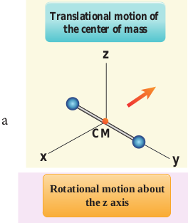
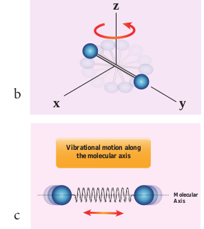
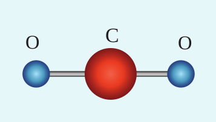

**DEGREES OF FREEDOM**

## Definition

_The minimum number of independent coordinates needed to specify the position and configuration of a thermo-dynamical system in space is called the degree of freedom of the system._

50 60 1_to ms_− )

o different temperatures

  

**Example:** 1\. A free particle moving along x-axis

needs only one coordinate to specify it completely. So its degree of freedom is one.

2\. Similarly a particle moving over a plane has two degrees of freedom.

3\. A particle moving in space has three degrees of freedom.

Suppose if we have N number of gas molecules in the container, then the total number of degrees of freedom is f = 3N.

But, if the system has _q_ number of constraints (restrictions in motion) then the degrees of freedom decreases and it is equal to _f = 3N-q_ where N is the number of particles.

## Monoatomic molecule

A monoatomic molecule by virtue of its nature has only three translational degrees of freedom.

Therefore f = 3

**Example:** Helium, Neon, Argon

## Diatomic molecule

There are two cases.

**1\. At Normal temperature**

A molecule of a diatomic gas consists of two atoms bound to each other by a force of attraction. Physically the molecule can be regarded as a system of two point masses fixed at the ends of a massless elastic spring.

The center of mass lies in the center of the diatomic molecule. So, the motion of the center of mass requires three translational degrees of freedom (figure 9.5 a). In addition, the diatomic molecule can rotate  

**Figure 9.5** Degree of freedom of diatomic molecule

about three mutually perpendicular axes (figure 9.5 b). But the moment of inertia about its own axis of rotation is negligible (about y axis in the figure 9.5). Therefore, it has only two rotational degrees of freedom (one rotation is about Z axis and another rotation is about X axis). Therefore totally there are five degrees of freedom.

_f_ \= 5

**2\. At High Temperature**

At a very high temperature such as 5000 K, the diatomic molecules possess additional

**y**

**z**

**x**

**CM**

**Translational motion of the center of mass**

**y**

**z**

**x**

**Rotational motion about the z axis**

**Rotational motio the x axis**

**z**

**x**

**Vibrational motion along the molecular axis**

**Molecular Axis**

a

b

c

|------|------|------|

  

two degrees of freedom due to vibrational motion\[one due to kinetic energy of vibration and the other is due to potential energy\] (Figure 9.5c). So totally there are seven degrees of freedom.

_f_ \= 7

**Examples:** Hydrogen, Nitrogen, Oxygen.

## Triatomic molecules

There are two cases.

**Linear triatomic molecule**

In this type, two atoms lie on either side of the central atom as shown in the Figure 9.6

**Figure 9.6** A linear triatomic molecule.

OO C

Linear triatomic molecule has three translational degrees of freedom. It has two rotational degrees of freedom because it is similar to diatomic molecule except there is an additional atom at the center. At normal temperature, linear triatomic molecule will have five degrees of freedom. At high temperature it has two additional vibrational degrees of freedom. So a linear triatomic molecule has seven degrees of freedom.

**Example:** Carbon dioxide.  

**9.4**

**Non-linear triatomic molecule**

In this case, the three atoms lie at the vertices of a triangle as shown in the Figure 9.7

**Figure 9.7** A non-linear triatomic molecule

H H

O

It has three translational degrees of freedom and three rotational degrees of freedom about three mutually orthogonal axes. The total degrees of freedom, f = 6

**Example:** Water, Sulphurdioxide.

