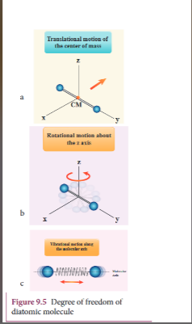
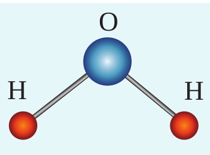

[comment]: <> (katex Header)


**DEGREES OF FREEDOM**

## Definition

_The minimum number of independent coordinates needed to specify the position and configuration of a thermodynamic system in space is called the degree of freedom of the system._

**Examples:**

1. A free particle moving along the x-axis needs only one coordinate to specify it completely. So its degree of freedom is one.

2. A particle moving over a plane has two degrees of freedom.

3. A particle moving in space has three degrees of freedom.

If there are $$(N)$$ number of gas molecules in the container, then the total number of degrees of freedom is $$(f = 3N)$$. However, if the system has $$(q)$$ number of constraints (restrictions in motion), then the degrees of freedom decrease, and it is equal to $$(f = 3N-q)$$, where $$(N)$$ is the number of particles.

## Monoatomic molecule

A monoatomic molecule, by virtue of its nature, has only three translational degrees of freedom. Therefore, $$(f = 3)$$.

**Examples:** Helium, Neon, Argon

## Diatomic molecule

There are two cases.

**1. At Normal Temperature**

A diatomic gas molecule consists of two atoms bound by a force of attraction. Physically, the molecule can be regarded as a system of two point masses fixed at the ends of a massless elastic spring. The center of mass lies in the center of the diatomic molecule. So, the motion of the center of mass requires three translational degrees of freedom (Figure 9.5a). In addition, the diatomic molecule can rotate about three mutually perpendicular axes (Figure 9.5b). But the moment of inertia about its own axis of rotation is negligible (about the y-axis in Figure 9.5). Therefore, it has only two rotational degrees of freedom (one rotation is about the Z-axis, and another rotation is about the X-axis). Therefore, there are five degrees of freedom.

$$[ f = 5 ]$$

**2. At High Temperature**

At a very high temperature, such as 5000 K, diatomic molecules possess additional two degrees of freedom due to vibrational motion (one due to kinetic energy of vibration, and the other is due to potential energy) (Figure 9.5c). So, there are seven degrees of freedom.

$$[ f = 7 ]$$

**Examples:** Hydrogen, Nitrogen, Oxygen.

## Triatomic molecules

There are two cases.

**Linear Triatomic Molecule**

In this type, two atoms lie on either side of the central atom. A linear triatomic molecule has three translational degrees of freedom. It has two rotational degrees of freedom because it is similar to a diatomic molecule, except there is an additional atom at the center. At normal temperature, a linear triatomic molecule will have five degrees of freedom. At high temperature, it has two additional vibrational degrees of freedom. So, a linear triatomic molecule has seven degrees of freedom.

**Example:** Carbon dioxide.

**Non-linear Triatomic Molecule**

In this case, the three atoms lie at the vertices of a triangle. A non-linear triatomic molecule has three translational degrees of freedom and three rotational degrees of freedom about three mutually orthogonal axes. The total degrees of freedom, $$( f = 6 )$$.

**Example:** Water, Sulphur dioxide.

