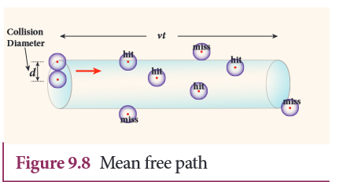

[comment]: <> (katex Header)

 
# MEAN FREE PATH
 
Usually, the average speed of gas molecules is several hundred meters per second even at room temperature (27°C). The odor from an open perfume bottle takes some time to reach us even if we are closer to the room. The time delay is because the odor molecules cannot travel straight to us as they undergo many collisions with nearby air molecules and move in a zigzag path. This average distance traveled by the molecule between two successive collisions is called the mean free path ($\lambda$). We can calculate the mean free path based on kinetic theory.
 
**Expression for Mean Free Path:**
We know from the postulates of kinetic theory that gas molecules are in random motion and collide with each other. Between two successive collisions, a molecule moves along a straight path with uniform velocity. This path is called the mean free path.
 
Consider a system of molecules, each with diameter ($$d$$). Let $n$ be the number of molecules per unit volume.
 
Assume that only one molecule is in motion and all others are at rest as shown in Figure 9.8.
 

 
If a molecule moves with an average speed ($$v$$) in a time ($$t$$), the distance traveled is $vt$. In this time $$t$$, consider the molecule to move in an imaginary cylinder of volume $$\pi d^2vt$$. It collides with any molecule whose center is within this cylinder. Therefore, the number of collisions is equal to the number of molecules in the volume of the imaginary cylinder. It is equal to $$\pi \frac{d^2vtn}{2}$$. The total path length divided by the number of collisions in time $t$ is the mean free path.
 
Mean free path, $$\lambda = \frac{vt}{\frac{\pi d^2 n}{2}}$$ (Equation 9.25)
 
Though we have assumed that only one molecule is moving at a time and other molecules are at rest, in actual practice, all the molecules are in random motion. So the average relative speed of one molecule with respect to other molecules has to be taken into account. After some detailed calculations (you will learn in higher classes), the correct expression for mean free path is:
 
$$
\lambda = \frac{1}{\sqrt{2} \pi n d^2}
$$ (Equation 9.26)
 
The equation (9.26) implies that the mean free path is inversely proportional to the number density. When the number density increases, the molecular collisions increase, decreasing the distance traveled by the molecule before collisions.
 
**Case 1:**
Rearranging the equation (9.26) using 'm' (mass of the molecule):
 
$$
\lambda = \frac{1}{\sqrt{2} \pi \rho \frac{m}{d^2}}
$$ (Equation 9.27)
 
Also, we know that $$PV = NkT$$:
 
$$
P = \frac{n}{V}kT
$$
 
Substituting &$$n = \frac{P}{kT}$$ into equation (9.26), we get:
 
$$
\lambda = \frac{\pi kT}{\sqrt{2} P d^2}
$$ (Equation 9.28)
 
The equation (9.28) implies the following:
1. Mean free path increases with increasing temperature. As the temperature increases, the average speed of each molecule will increase. It is the reason why the smell of hot sizzling food reaches several meters away than the smell of cold food.
2. Mean free path increases with decreasing pressure of the gas and diameter of the gas molecules.
 
**EXAMPLE 9.6:**
An oxygen molecule is traveling in air at 300 K and 1 atm, and the diameter of an oxygen molecule is 1.2 $$times 10^{-10} m.$$ Calculate the mean free path of an oxygen molecule.
 
**Solution:**
From Equation (9.26):
 
$$
\lambda = \frac{1}{\sqrt{2} \pi n d^2}
$$
 
We have to find the number density ($$n$$). By using the ideal gas law:
 
$$
n = \frac{N}{V} = \frac{P}{kT}
$$
 
Substituting $$n = \frac{P}{kT}$$ into Equation (9.26), we get:
 
$$
\lambda = \frac{\pi kT}{\sqrt{2} P d^2}
$$
 
$$
\lambda = \frac{\pi \times 1.38 \times 10^{-23} \times 300}{\sqrt{2} \times 1 \times (1.2 \times 10^{-10})^2}
$$
 
$$
\lambda = 0.63 \times 10^{-6} m
$$
 

 
