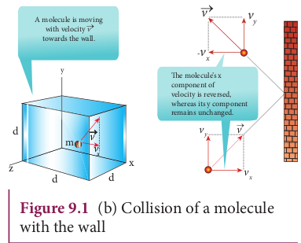

**PRESSURE EXERTED BY A GAS**

## Expression for pressure exerted by a gas

Consider a monoatomic gas of N molecules each having a mass m inside a cubical container of side _l_ as shown in the Figure 9.1 (a).

 

The molecules of the gas are in random motion. They collide with each other and also with the walls of the container. As the collisions are elastic in nature, there is no loss of kinetic energy, but a change in momentum occurs.

The molecules of the gas exert pressure on the walls of the container due to collision on it. During each collision, the molecules impart certain momentum to the wall. Due to transfer of momentum, the walls experience a continuous force. The force experienced per unit area of the walls of the container determines the pressure exerted by the gas. It is essential to determine the total momentum transferred by the molecules in a short interval of time.

A molecule of mass m moving with a velocity \vec{v} having components (v_x, v_y, v_z) hits the right side wall. Since we have assumed that the collision is elastic, the particle rebounds with same speed and its x-component is reversed. This is shown in the Figure 9.1 (b). The components of velocity of the molecule after collision are (—v_x, v_y, v_z).

The x-component of momentum of the molecule before collision = (mv_x)

The x-component of momentum of the molecule after collision = −mvx

The change in momentum of the molecule in x direction =Final momentum – initial momentum = −mvx −mvx= −2mvx

According to law of conservation of linear momentum, the change in momentum of the wall = 2mvx

**Note**

In x direction, the total momentum of the system before collision is equal to momentum of the molecule mvx since the momentum of the wall is zero. According to the law of conservation of momentum the total momentum of system after the collision must be equal to total momentum of system before collision. The momentum of the molecule (in x direction) after the collision is −mvx and the momentum of the wall after the collision is 2mvx. So total momentum of the system after the collision is (2mvx−mvx) = (mvx) which is same as the total momentum of the system before collision.

The number of molecules hitting the right side wall in a small interval of time ∆t is calculated as follows.

The molecules within the distance of v_x∆t from the right side wall and moving towards the right will hit the wall in the time interval ∆t. This is shown in the Figure 9.2. The number of molecules that will hit the right side wall in a time interval ∆t is equal to the product of volume (Av_x∆t) and number density of the molecules (n). Here A is area of the wall and n is number of molecules per unit volume  \lgroup\frac{N}{V}\rgroup. We have assumed that the number density is the same throughout the cube. 

Not all the n molecules will move to the right, therefore on an average only half of the n molecules move to the right and the other half moves towards left side.
The number of molecules that hit the right side wall in a time interval 
∆t= \frac{n}{2}Av_x ∆t (9.1)

In the same interval of time ∆t, the total momentum transferred by the molecules ∆p = \frac{n}{2}Av_x ∆t × 2mv_x = Av_x^2 mn∆t (9.2)
From Newton’s second law, the change in momentum in a small interval of time gives rise to force.

The force exerted by the molecules on the wall (in magnitude)

F = \frac{\Delta p}{\Delta t} = {nmAv_x^2} (9.3)

Pressure, P = force divided by the area of the wall

P = \frac{F}{A}= {nmv_x^2} (9.4)

Since all the molecules are moving completely in random manner, they do not have same speed. So we can replace the term v_x^2 by the average \vec{v_x^2} in equation (9.4)

P = nm \vec{v_x^2} (9.5)

Since the gas is assumed to move in random direction, it has no preferred direction of motion (the effect of gravity on the molecules is neglected). It implies that the molecule has same average speed in all the three direction. So,\vec{v_x^2}=\vec{v_y^2}=\vec{v_z^2}.The mean square speed is written as

\vec{v^2}=\vec{v_x^2}+\vec{v_y^2}+\vec{v_z^2}=3\vec{v_x^2}

\vec{v_x^2}=1/3 \vec{v^2}

Using this in equation (9.5), we get

P=1/3 nm\vec{v^2} or P=1/3 \frac{N}{V} {m\vec{v^2}} (9.6)

as n=\frac{N}{V}

The following inference can be made from the above equation. The pressure exerted by the molecules depends on

1. **Number density** n=\frac{N}{V} It implies that if the number density increases then pressure will increase. For example when we pump air inside the cycle tyre or car tyre essentially the number density increases and as a result the pressure increases.

2. **Mass of the molecule** Since the pressure arises due to momentum transfer to the wall, larger mass will have larger momentum for a fixed speed. As a result the pressure will increase.

3. **Mean square speed** For a fixed mass if we increase the speed, the average speed will also increase. As a result the pressure will increase.

For simplicity the cubical container is taken into consideration. The above result is true for any shape of the container as the area A does not appear in the final expression (9.6). Hence the pressure exerted by gas  

molecules on the wall is independent of area of the wall (A).

### Kinetic interpretation of temperature

To understand the microscopic origin of temperature in the same way,

Rewrite the equation (9.6)

P=\frac{1}{3} \frac{N}{V} m\vec{v^2}

PV=\frac{1}{3} Nm\vec{v^2} (9.7)

Comparing the equation (9.7) with ideal gas equation PV=NkT,

NkT=\frac{1}{3} Nm\vec{v^2}

kT=\frac{1}{3} m\vec{v^2} (9.8)

Multiply the above equation by 3/2 on both sides,

\frac{3}{2} kT=\frac{1}{2} m\vec{v^2} (9.9)

R.H.S of the equation (9.9) is called average kinetic energy of a single molecule (KE).

The average kinetic energy per molecule

\vec{KE}= ∈ = \frac{3}{2} kT (9.10)

Equation (9.9 ) implies that the temperature of a gas is a measure of the average translational kinetic energy per molecule of the gas.

**Note**
Compare this with the definition of temperature studied in lower classes:
Temperature is the degree of hotness or coldness!

Equation 9.10 is a very important result from kinetic theory of gas. We can infer the following from this equation.

1. The average kinetic energy of the molecule is directly proportional to absolute temperature of the gas. The equation (9.9) gives the connection between the macroscopic world (temperature) to microscopic world (motion of molecules).

2. The average kinetic energy of each molecule depends only on temperature of the gas not on mass of the molecule. In other words, if the temperature of an ideal gas is measured using thermometer, the average kinetic energy of each molecule can be calculated without seeing the molecule through naked eye.

By multiplying the total number of gas molecules with average kinetic energy of each molecule, the internal energy of the gas is obtained.

Internal energy of ideal gas U=N\lgroup \frac{1}{2} m \vec{v^2}\rgroup

By using equation (9.9)

U=\frac{3}{2} NkT (9.11)

From equation (9.11), we understand that the internal energy of an ideal gas depends only on absolute temperature and is independent of pressure and volume.

**EXAMPLE 9.1**

A football at 27°C has 0.5 mole of air molecules. Calculate the internal energy of air in the ball.

**_Solution_**

The internal energy of ideal gas =\frac{3}{2} NkT

The number of air molecules is given in terms of number of moles so, rewrite the expression as follows  

U=\frac{3}{2}\mu RT

Since Nk = μR. Here μ is number of moles.

Gas constant R = 8.31 \frac{J}{mol k}

Temperature T =273+27=300K

U = \frac{3}{2} × 0.5 × 8.31 × 300 = 1869.75J

This is approximately equivalent to the kinetic energy of a man of 57 kg running with a speed of 8 m s^-1.

### Relation between pressure and mean kinetic energy

From earlier section, the internal energy of the gas is given by

U=\frac{3}{2} NkT

The above equation can also be written as

U=\frac{3}{2} PV

since PV = NkT

P=\frac{2}{3} \frac{U}{V}=\frac{2}{3}u (9.12)

From the equation (9.12), we can state that the pressure of the gas is equal to two thirds of internal energy per unit volume or internal energy density (u=\frac{U}{V}).

Writing pressure in terms of mean kinetic energy density using equation (9.6)

P=\frac{1}{3} Nm\vec{v^2}=\frac{1}{3}\rho \vec{v^2} (9.13)

where ρ = nm = mass density (Note n is number density)

Multiply and divide R.H.S of equation (9.13) by 2, we get

P=\frac{2}{3} \lgroup\frac{\rho}{2}\vec{v^2}\rgroup (9.14)

P=\frac{2}{3}\vec{KE}

From the equation (9.14), pressure is equal to 2/3 of mean kinetic energy per unit volume.

### Some elementary deductions from kinetic theory of gases

**Boyle’s law:**

From equation (9.12), we know that P V=\frac{2}{3} U

But the internal energy of an ideal gas is equal to \mathrm{N} times the average kinetic energy (\epsilon)  of each molecule.


U=N \in


For a fixed temperature, the average translational kinetic energy $\in$ will remain constant. It implies that


P V=\frac{2}{3} N \in \quad \text { Thus } \quad P V=\text { constant }


Therefore, pressure of a given gas is inversely _proportional to its volume provided the temperature remains constant. This is Boyle’s law_.

**Charles’ law:**

From the equation (9.12), we get P V=\frac{2}{3} U For a fixed pressure, the volume of the gas is proportional to internal energy of the gas or average kinetic energy of the gas and the average kinetic energy is directly proportional to absolute temperature. It implies that


V \alpha T \text { or } \frac{V}{T}=\text { constant }


This is Charles’ law.

**Avogadro’s law:**

This law states that at constant temperature and pressure, equal volumes of all gases contain the same number of molecules. For two different gases at the same temperature and pressure, according to kinetic theory of gases,  

From equation (9.6)


P=\frac{1}{3} \frac{N_{1}}{V} m_{1} \overline{v_{1}^{2}}=\frac{1}{3} \frac{N_{2}}{V} m_{2} \overline{v_{2}^{2}}
 (9.15)

where \overline{v_{1}^{2}} and \overline{v_{2}^{2}} are the mean square speed for two gases and N_{1} and N_{2} are the number of gas molecules in two different gases.

At the same temperature, average kinetic energy per molecule is the same for two gases.


\frac{1}{2} m_{1} \overline{v_{1}^{2}}=\frac{1}{2} m_{2} \overline{v_{2}^{2}}
 (9.16)

Dividing the equation (9.15) by (9.16) we get N_{1}=N_{2}

This is Avogadro’s law. It is sometimes referred to as Avogadro’s hypothesis or Avogadro’s Principle.

### Root mean square speed \left(v_{r m s}\right)

Root mean square speed \left(v_{r m s}\right) is defined as the square root of the mean of the square of speeds of all molecules. It is denoted by v_{\mathrm{rms}}=\sqrt{\overline{v^{2}}}
Equation (9.8) can be re-written as,
mean square speed \overline{v^{2}}=\frac{3 k T}{m} (9.17)
root mean square speed,

v_{\mathrm{rms}}=\sqrt{\frac{3 k T}{m}}=1.73 \sqrt{\frac{k T}{m}}
 (9.18)
From the equation (9.18) we infer the following 
1. rms speed is directly proportional to square root of the temperature and inversely proportional to square root of mass of the molecule. At a given temperature the molecules of lighter mass move faster on an average than the molecules with heavier masses.
Example: Lighter molecules like hydrogen and helium have high ' v_{r m s} ' than heavier molecules such as oxygen and nitrogen at the same temperature.
2. Increasing the temperature will increase the r.m.s speed of molecules
We can also write the v_{\text {rms }} in terms of gas constant R. Equation (9.18) can be rewritten as follows
v_{r m s}=\sqrt{\frac{3 N_A k T}{N_A m}} Where {N_A} is Avogadro number.
Since N_{\mathrm{A}} k=R and N_{\mathrm{A}} m=M(molar mass)

The root mean square speed or r.m.s speed

v_{\mathrm{rms}}=\sqrt{\frac{3 R T}{M}}
(9.19)

The equation (9.6) can also be written in terms of rms speed P=\frac{1}{3} n m v^{2}{ }_{r m s}
since v_{r m s}^{2}=\overline{v^{2}}

**Note**

Root mean square speed is not the same as average speed. Average speed is 0.92 times of r.m.s speed.

Impact of v_{r m s} in nature:

1\. **Moon has no atmosphere.** 
The escape speed of gases on the surface of Moon is much less than the root mean square speeds of gases due to low gravity. Due to this all the gases escape from the surface of the Moon.

2\. **No hydrogen in Earth’s atmosphere**. As the root mean square speed of hydrogen is much greater than that of nitrogen, it easily escapes from the earth’s atmosphere.

In fact, the presence of nonreactive nitrogen instead of highly combustible hydrogen deters many disastrous consequences.  

## **EXAMPLE 9.2**

A room contains oxygen and hydrogen molecules in the ratio 3: 1. The temperature of the room is 27^{\circ} \mathrm{C}. The molar mass of \mathrm{O}_{2} is 32 \mathrm{~g} \mathrm{~mol}^{-1} and of \mathrm{H}_{2} is 2 \mathrm{~g} \mathrm{~mol}^{-1}. The value of gas constant \mathrm{R} is 8.32 \mathrm{~J} \mathrm{~mol}^{-1} \mathrm{~K}^{-1}

## **_Calculate_**

(a) rms speed of oxygen and hydrogen molecule

(b) Average kinetic energy per oxygen molecule and per hydrogen molecule

(c) Ratio of average kinetic energy of oxygen molecules and hydrogen molecules

## **_Solution_**

(a) Absolute Temperature \mathrm{T}=27^{\circ} \mathrm{C}=27+273=300 \mathrm{~K}.

Gas constant \mathrm{R}=8.32 \mathrm{~J} \mathrm{~mol}^{-1} \mathrm{k}^{-1}

For Oxygen molecule: Molar mass \mathrm{M}=32 \mathrm{~g}=32 \times 10^{-3} \mathrm{~kg} \mathrm{~mol}^{-1}

rms speed v_{r m s}=\sqrt{\frac{3 R T}{M}}=\sqrt{\frac{3 \times 8.32 \times 300}{32 \times 10^{-3}}}

=483.73 \mathrm{~m} \mathrm{~s}^{-1} \approx 484 \mathrm{~m} \mathrm{~s}^{-1}


For Hydrogen molecule:
Molar mass \mathrm{M}=2 \times 10^{-3} \mathrm{~kg} \mathrm{~mol}^{-1}

rms speed v_{r m s}=\sqrt{\frac{3 R T}{M}}=\sqrt{\frac{3 \times 8.32 \times 300}{2 \times 10^{-3}}}

=1934 \mathrm{~ms}^{-1}=1.93 \mathrm{~km} \mathrm{~s}^{-1}


Note that the rms speed is inversely proportional to \sqrt{\mathrm{M}} and the molar mass of oxygen is 16 times higher than molar mass of hydrogen. It implies that the rms speed of hydrogen is 4 times greater than \mathrm{rms} speed of oxygen at the same temperature. \frac{1934}{484} \approx 4.

(b) The average kinetic energy per molecule is \frac{3}{2} k T. It depends only on absolute temperature of the gas and is independent of the nature of molecules. Since both the gas molecules are at the same temperature, they have the same average kinetic energy per molecule. $k$ is Boltzmaan constant. \frac{3}{2} k T=\frac{3}{2} \times 1.38 \times 10^{-23} \times 300=6.21 \times 10^{-21} J

(c) Average kinetic enęrgy of total oxygen molecules =\frac{3}{2} N_{\mathrm{o}} k T where N_{\mathrm{o}} - number of oxygen molecules in the room

Average kinetic energy of total hydrogen molecules =\frac{3}{2} N_{H} k T where N_{H^{-}}number of hydrogen molecules in the room.

It is given that the number of oxygen molecules is 3 times more than number of hydrogen molecules in the room. So the ratio of average kinetic energy of oxygen molecules with average kinetic energy of hydrogen molecules is 3: 1.

### Mean (or) average speed ( \overline{\mathbf{v}} )

It is defined as the mean (or) average of all the speeds of molecules

If v_{1}, v_{2}, v_{3} \ldots . . v_{\mathrm{N}} are the individual speeds of molecules then

\bar{v}=\frac{v_{1}+v_{2}+v_{3} \ldots \ldots .+v_{n}}{N}=\sqrt{\frac{8 R T}{\pi M}}=\sqrt{\frac{8 k T}{\pi m}}

Here M- Molar Mass and \mathrm{m} - mass of the molecule.

\bar{v}=1.60 \sqrt{\frac{k T}{m}}

**9.2.7. Most probable speed \left(\mathbf{V}_{\mathrm{mp}}\right)**

It is defined as the speed acquired by most of the molecules of the gas.


 v_{m p}=\sqrt{\frac{2 R T}{M}}=\sqrt{\frac{2 k T}{m}}  (9.22)



v_{m p}=1.41 \sqrt{\frac{k T}{m}}
 (9.23)

The derivation of equations (9.20), (9.22) is beyond the scope of the book

## **Comparison of \boldsymbol{v}_{r m s}, \bar{v} and v_{m p}**

Among the speeds v_{\text {rms }} is the largest and v_{\mathrm{mp}} is the least

v_{\mathrm{rms}}>\bar{v}>v_{\mathrm{mp}}


Ratio-wise,

v_{\mathrm{rms}}: \bar{v}: v_{\mathrm{mp}}=\sqrt{3}: \sqrt{8 / \pi}: \sqrt{2}=1.732: 1.6: 1.414

## **EXAMPLE 9.3**
Ten particles are moving at the speed of 2,3,4,5,5,5,6,6,7 and 9 \mathrm{~m} \mathrm{~s}^{-1}. Calculate rms speed, average speed and most probable speed.
## **_Solution_**
The average speed \bar{v}=\frac{2+3+4+5+5+5+6+6+7+9}{10}=5.2 \mathrm{~ms}^{-1}.

To find the rms speed, first calculate the mean square speed \overline{v^{2}}

\overline{v^{2}}=\frac{2^{2}+3^{2}+4^{2}+5^{2}+5^{2}+5^{2}+6^{2}+6^{2}+7^{2}+9^{2}}{10}

=30.6 \mathrm{~m}^{2} \mathrm{~s}^{-2}.

The rms speed

v_{r m s}=\sqrt{\overline{v^{2}}}=\sqrt{30.6}=5.53 \mathrm{~ms}^{-1}.

The most probable speed is 5 \mathrm{~m} \mathrm{~s}^{-1} because three of the particles have that speed.

## **EXAMPLE 9.4**

Calculate the rms speed, average speed and the most probable speed of 1 mole of hydrogen molecules at 300 \mathrm{~K}. Neglect the mass of electron.

## **_Solution_**

The hydrogen atom has one proton and one electron. The mass of electron is negligible compared to the mass of proton. Mass of one proton =1.67 \times 10^{-27} \mathrm{~kg}. One hydrogen molecule = 2 hydrogen atoms =2 \times 1.67 \times 10^{-27} \mathrm{~kg}. The average speed

\bar{v}=\sqrt{\frac{8 k T}{\pi m}}=1.60 \sqrt{\frac{k T}{m}}=
=1.60 \sqrt{\frac{\left(1.38 \times 10^{-23}\right) \times(300)}{2\left(1.67 \times 10^{-27}\right)}}=1.78 \times 10^{3} \mathrm{~ms}^{-1}

(Boltzmann Constant \mathrm{k}=1.38 \times 10^{-23} \mathrm{JK}^{-1})

The rms speed \quad v_{r m s}=\sqrt{\frac{3 k T}{m}}=1.73 \sqrt{\frac{k T}{m}}

=1.73 \sqrt{\frac{\left(1.38 \times 10^{-23}\right) \times(300)}{2\left(1.67 \times 10^{-27}\right)}}=1.93 \times 10^{3} \mathrm{~ms}^{-1}

Most probable speed v_{m p}=\sqrt{\frac{2 k T}{m}}=1.41 \sqrt{\frac{k T}{m}}

=1.41 \sqrt{\frac{\left(1.38 \times 10^{-23}\right) \times(300)}{2\left(1.67 \times 10^{-27}\right)}}=1.57 \times 10^{3} \mathrm{~ms}^{-1}

Note that \quad v_{\text {rms }}>\bar{v}>v_{\mathrm{mp}}

## Maxwell-Boltzmann speed distribution function

In a classroom, the air molecules are moving in random directions. The speed of each molecule is not the same even though macroscopic parameters like temperature and pressure are fixed. Each molecule collides with every other molecule and they exchange their speed. In the previous section  

we calculated the rms speed of each molecule and not the speed of each molecule which is rather difficult. In this scenario we can find the number of gas molecules that move with the speed of 5 \mathrm{~m} \mathrm{~s}^{-1}  to 10 \mathrm{~m} \mathrm{~s}^{-1} or 10 \mathrm{~m} \mathrm{~s}^{-1} to 15 \mathrm{~m} \mathrm{~s}^{-1} etc. In general our interest is to find how many gas molecules have the range of speed from v to v+d v. This is given by Maxwell’s speed distribution function.


N_{v}=4 \pi N\left(\frac{m}{2 \pi k T}\right)^{\frac{3}{2}} v^{2} e^{-\frac{m v^{2}}{2 k T}}
     (9.24)

The above expression is graphically shown as follows

**Figure 9.3** Maxwell’s molecular speed distribution

From the Figure 9.3, it is clear that, for a given temperature the number of molecules having lower speed increases parabolically \left(v^{2}\right) but decreases exponentially \left(e^{-\frac{m v^{2}}{2 k T}}\right) after reaching most probable speed. The rms speed, average speed and most probable speed are indicated in the Figure 9.3. It can be seen that the rms speed is greatest among the three.

To know thenumber of molecules in the range of speed between 50 \mathrm{~m} \mathrm{~s}^{-1} and 60 \mathrm{~m} \mathrm{~s}^{-1}, we need to integrate \int_{50}^{60} 4 \pi N\left(\frac{m}{2 \pi k T}\right)^{\frac{3}{2}} v^{2} e^{-\frac{m v^{2}}{2 k T}} d v= =N\left(50\right. to \left.60 \mathrm{~ms}^{-1}\right). In general the number of molecules within the range of speed \mathrm{v} and \mathrm{v}+\mathrm{dv} is given by \int_{v}^{v+d v} 4 \pi N\left(\frac{m}{2 \pi k T}\right)^{\frac{3}{2}} v^{2} e^{-\frac{m v^{2}}{2 k T}} d v=N(v to v+d v). The exact integration is beyond the scope of the book. But we can infer the behavior of gas molecules from the graph.

1. The area under the graph will give the total number of gas molecules in the system

2. Figure 9.4 shows the speed distribution graph for two different temperatures. As temperature increases, the peak of the curve is shifted to the right. It implies that the average speed of each molecule will increase. But the area under each graph is same since it represents the total number of gas molecules.

**Note**

Interestingly once the gas molecules attains equilibrium, the number of molecules in the given range of speeds are fixed. For example if a molecule initially moving with speed 12 m s^-1, collides with some other molecule and changes its speed to 9 m s^-1, then the other molecule initially moving with different speed reaches the speed 12 m s^-1 due to another collision. So in general once the gas molecules attain equilibrium, the number of molecules that lie in the range of v to v+dv is always fixed.

