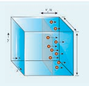
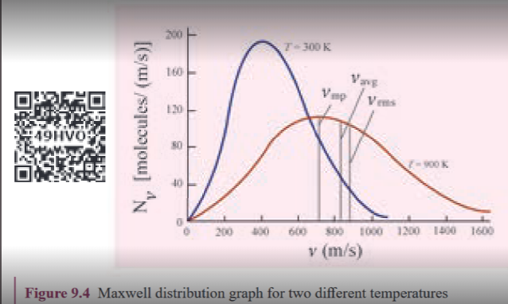

[comment]: <> (katex Header)

 
## Expression for pressure exerted by a gas
 
 
Consider a monoatomic gas of N molecules each having a mass m inside a cubical container of side _l_ as shown in the Figure 9.1 (a).

 
**Figure 9.1** (a) Container of gas molecules  
 

 
The molecules of the gas are in random motion. They collide with each other and also with the walls of the container. As the collisions are elastic in nature, there is no loss of kinetic energy, but a change in momentum occurs.
 
The molecules of the gas exert pressure on the walls of the container due to collision on it. During each collision, the molecules impart certain momentum to the wall. Due to transfer of momentum, the walls experience a continuous force. The force experienced per unit area of the walls of the container determines the pressure exerted by the gas. It is essential to determine the total momentum transferred by the molecules in a short interval of time.
 
A molecule of mass m moving with a velocity \\(\vec{v}\\) having components\\(v_x, v_y, v_z\\)
 hits the right side wall. Since we have assumed that the collision is elastic, the particle rebounds with same speed and its x-component is reversed. This is shown in the Figure 9.1 (b). The components of velocity of the molecule after collision are \\(-v_x, v_y, v_z\\).
 
The x-component of momentum of the molecule before collision = \\(mv_x\\)
 
The x-component of momentum of the molecule after collision =\\(-mv_x\\)
 
The change in momentum of the molecule in x direction 

=Final momentum - initial momentum = \\(-mv_x\\)\\(-mv_x\\)=\\(-2mv_x\\)
 
According to law of conservation of linear momentum, the change in momentum of the wall = \\(-mv_x\\)
 
 **Note**

In x direction, the total momentum of the system before collision is equal to momentum of the molecule
\\(mv_x\\) since the momentum of the wall is zero. According to the law of conservation of momentum the total momentum of system after the collision must be equal to total momentum of system before collision. The momentum of the molecule (in x direction) after the collision is \\(-mv_x\\) and the momentum of the wall after the collision is \\(2mv_x\\). So total momentum of the system after the collision is \\(2mv_x - mv_x\\) = \\(mv_x\\) which is same as the total momentum of the system before collision.
 
The number of molecules hitting the right side wall in a small interval of time \\(\Delta t\\) is calculated as follows.
 
The molecules within the distance of \\(v_x \Delta t\\) from the right side wall and moving towards the right will hit the wall in the time interval \\(\Delta t\\). This is shown in the Figure 9.2. The number of molecules that will hit the right side wall in a time interval \\(\Delta t\\) is equal to the product of volume (\\(A v_x \\) \\(\Delta  t\\) )and number density of the molecules (_n_). Here _A_ is area of the wall and _n_ is number of molecules per unit volume \\([\frac{N}{V}]\\). We have assumed that the number density is the same throughout the cube.
 

**Figure 9.2** Number of molecules hitting
the wall

Not all the n molecules will move to the
right, therefore on an average only half of
the n molecules move to the right and the
other half moves towards left side.

The number of molecules that hit the right side wall in a time interval  \\(\Delta t\\)

\\(n/2  Av_x * Δt\\)        (9.1)
 
In the same interval of time ∆_t_, the total momentum transferred by the molecules
 
$$\Delta p $$ = _n_/2
 
$$ =A_{\text{vx}} \Delta t \times 2m_{\text{vx}} = A_{v}^2 x_{\text{mn}} \Delta t \quad (9.2) $$
 
From Newton's second law, the change in momentum in a small interval of time gives rise to force.
 
The force exerted by the molecules on the wall (in magnitude)
 
$$[ F = \frac{\Delta p}{\Delta t} = \frac{nmAv_x^2}{\Delta t} ] $$
(9.3)
 
Pressure, P = force divided by the area of the wall
 
$$[ P = \frac{F}{A} = \frac{nmv_x^2}{x} ]$$
 (9.4)
 
Since all the molecules are moving completely in random manner, they do not have same speed. So we can replace the term \\(v_x^2\\) by the average \\(\overline{v_x^2}\\) in equation (9.4) 
 
$$[ P = nm\overline{v^2x} ]$$
(9.5)
 
Since the gas is assumed to move in random direction, it has no preferred direction of motion (the effect of gravity on the molecules is neglected). It implies that the molecule has same average speed in all the three direction. So, \\( \overline{v_x^2} = \overline{v_y^2} = \overline{v_z^2} \\)
. The mean square speed is written as
 
$$[ \overline{v^2} = \overline{v_x^2} +\overline{v_y^2} +\overline{v_z^2} =\overline{3v_x^2} ]$$
 
$$[\overline{v_x^2}=\frac{1}{3} \overline{v^2}  ]$$
 
 
Using this in equation (9.5), we get
 
$$[ P = \frac{1}{3}nm \overline{v^2} ]$$

or
 
$$[ P = \frac{1}{3} \frac{Nm\overline{v^2}}{V} ]$$ (9.6)
 
as [$$[n = \frac{N}{V}]$$]
 
The following inference can be made from the above equation. The pressure exerted by the molecules depends on
 
1. **Number density** \\(n =\frac{N}{V}\\)
. It implies that if the number density increases then pressure will increase. For example when we pump air inside the cycle tyre or car tyre essentially the number density increases and as a result the pressure increases.
 
2. **Mass of the molecule** Since the pressure arises due to momentum transfer to the wall, larger mass will have larger momentum for a fixed speed. As a result the pressure will increase.
 
3. **Mean square speed** For a fixed mass if we increase the speed, the average speed will also increase. As a result the pressure will increase.
 
For simplicity the cubical container is taken into consideration. The above result is true for any shape of the container as the area A does not appear in the final expression (9.6). Hence the pressure exerted by gas molecules on the wall is independent of area of the wall (A).
 
## Kinetic interpretation of temperature

To understand the microscopic origin of temperature in the same way,
 
Rewrite the equation (9.6)
$$[ P = \frac{1}{3}nm \overline{v^2} ]$$
 
 
$$[ P = \frac{1}{3} {Nm\overline{v^2} }]$$
(9.7)
 
Comparing the equation (9.7) with ideal gas equation _PV=NkT_,
 
$$[ NkT=\frac{1}{3} {Nm\overline{v^2}} ]$$
 
$$[ kT=\frac{1}{3} {m\overline{v^2}} ]$$
(9.8)
 
Multiply the above equation by 3/2 on both sides,
 
$$[\frac{3}{2}kT=\frac{1}{2} {m\overline{v^2}} ]$$
 
R.H.S of the equation (9.9) is called average kinetic energy of a single molecule (_KE_).
 
The average kinetic energy per molecule
 
\\(KE = ε = \frac{3}{2} kT\\) (9.10)
 
Equation (9.9 ) implies that the temperature of a gas is a measure of the average translational kinetic energy per molecule of the gas.
 
**Note**

Compare this with the definition of temperature studied in lower classes:Temperature is the degree of hotness or coldness!
 
Equation 9.10 is a very important result from kinetic theory of gas. We can infer the following from this equation.

1. The average kinetic energy of the molecule is directly proportional to the absolute temperature of the gas. The equation (9.9) gives the connection between the macroscopic world (temperature) to microscopic world (motion of molecules).
 
2. The average kinetic energy of each molecule depends only on the temperature of the gas, not on the mass of the molecule. In other words, if the temperature of an ideal gas is measured using a thermometer, the average kinetic energy of each molecule can be calculated without seeing the molecule through the naked eye.
 
By multiplying the total number of gas molecules with the average kinetic energy of each molecule, the internal energy of the gas is obtained.
 
Internal energy of an ideal gas \\(U = N \frac{mv^2}{2}\\) By using equation (9.9):
 
$$[U = \frac{3}{2}NkT]$$ 
(9.11)
 
From equation (9.11), we understand that the internal energy of an ideal gas depends only on the absolute temperature and is independent of pressure and volume.
 
**EXAMPLE 9.1**
 
A football at 27°C has 0.5 moles of air molecules. Calculate the internal energy of air in the ball.
 
**Solution:**
 
The internal energy of an ideal gas \\(\frac{3}{2}NkT\\).
 
The number of air molecules is given in terms of the number of moles, so rewrite the expression as follows:
 
$$[U = \frac{3}{2}\mu RT]$$
 
Since \\(Nk = \mu R\\), where \\(\mu R\\) is the number of moles.
 
Gas constant R = 8.31\\(\frac{J}{molk}\\)

Temperature \\(T = 273 + 27 = 300K\\)
 
$$U = \frac{3}{2} \times 0.5 \times 8.31 \times 300 = 1869.75 \, J$$
 
This is approximately equivalent to the kinetic energy of a man of 57 kg running with a speed of 8 m s\\(^{-1}\\)
## Relation between pressure and mean kinetic energy
 
From earlier section, the internal energy of the gas is given by
 
$$[U = NkT = \frac{3}{2}PV]$$
 
The above equation can also be written as
 
$$[U = \frac{3}{2}PV]$$
 
since \\(PV = NkT\\)
 
$$P = \frac{2}{3}\frac{U}{V} = \frac{2}{3}u$$ 9.12
 
From Equation (9.12), we can state that the pressure of the gas is equal to two-thirds of internal energy per unit volume or internal energy density \\(u = \frac{U}{V}\\)
 
Writing pressure in terms of mean kinetic energy density using Equation (9.6):
 
$$P = \frac{1}{3} nm \overline{v^2} = \frac{1}{3} \rho \overline{v^2}
$$
 
where \\(\rho = nm\\)  = mass density (Note \\(n\\) is number density).
 
Multiply and divide the right-hand side of Equation (9.13) by 2, we get
 
$$P = \frac{2}{3} \left( \frac{\rho \overline{v^2}}{2} \right)$$ (9.14)
 
$$[P = \frac{2}{3}\overline{KE}]$$
 
From Equation (9.14), pressure is equal to 2/3 of mean kinetic energy per unit volume.
 
## Some elementary deductions from kinetic theory of gases
 
 
**Boyle's law:**

From equation (9.12), we know that \\(PV = \frac{2}{3}U\\).
 
But the internal energy of an ideal gas is equal to N times the average kinetic energy ∈ of each molecule.
 
$$ U = N∈ $$
 
For a fixed temperature, the average translational kinetic energy ∈ will remain constant. It implies that
 
$$[ PV = \frac{2}{3} N∈ ]$$

Thus,PV = is constant.
 
  Therefore, the pressure of a given gas is inversely proportional to its volume provided the temperature remains constant. This is Boyle's Law.
 
**Charles' law:**
 
From the equation (9.12), we get PV = \\(\frac{2}{3}\\)U.
 
For a fixed pressure, the volume of the gas is proportional to the internal energy of the gas or the average kinetic energy of the gas, and the average kinetic energy is directly proportional to the absolute temperature. It implies that
 
$$ V \propto T \text{ or } \frac{V}{T} = constant$$
 
This is Charles' Law.
 
**Avogadro's law:**
 
This law states that at constant temperature and pressure, equal volumes of all gases contain the same number of molecules. For two different gases at the same temperature and pressure, according to kinetic theory of gases,  

From equation (9.6),
 
$$P = \frac{1}{3} \frac{N_1}{V} m_1 \overline{v_1^2} = \frac{1}{3} \frac{N_2}{V} m_2 \overline{v_2^2}
$$
 
where \\( v_1^2 \\) and \\( v_2^2 \\) are the mean square speeds for two gases, and \\( N_1 \\) and \\( N_2 \\) are the number of gas molecules in two different gases.
 
At the same temperature, the average kinetic energy per molecule is the same for two gases,
 
$$\frac{1}{2}m_1v_1^2 = \frac{1}{2}m_2\overline{v_2^2} $$
 
(9.16)

Dividing equation (9.15) by equation (9.16), we get \\( {N_1}{N_2}\\).
 
This is Avogadro's Law. It is sometimes referred to as Avogadro's Hypothesis or Avogadro's Principle.
 
 
## Root mean square speed \\(v_{rms}\\)
 
Root mean square speed \\(v_{rms}\\) is defined as the square root of the mean of the square of all molecules. It is denoted by \\(v_rms = √v^2)\\.

Equation (9.8) can be rewritten as,
 
Mean square speed \\(\overline{v^{2}}=\frac{3kT}{m}\\) (9.17) 
root mean square speed,

 
$$v_{rms} = \sqrt{\frac{3kT}{m}} = 1.73\sqrt{\frac{kT}{m}} $$ (9.18)
 
From equation (9.18), we infer the following:

(i) rms is directly proportional to the square root of the temperature and inversely proportional to the square root of the mass of the molecule. At a given temperature, molecules of lighter mass move faster on average than molecules with heavier masses.
 
Example: Lighter molecules like hydrogen and helium have higher \\((v_{\text{rms}})\\) than heavier molecules such as oxygen and nitrogen at the same temperature.

(ii) Increasing the temperature will increase the root mean square speed of molecules.
 
We can also write \\((v_{\text{rms}})\\) in terms of the gas constant R. Equation (9.18) can be rewritten as follows:
 
\\(v_{rms} = \sqrt{\frac{3NkT}{Nm}}\\) Where \\(N_A\\) is Avogadro
number.

Since \\(N_Ak\\) = R and \\(N_Am\\) = M (molar mass)

The root mean square speed or r.m.s speed:
 
$$v_{rms} = \sqrt{\frac{3RT}{M}}$$

(9.19)
 
The equation (9.6) can also be written in
terms of rms speed \\(P = \frac{1}{3}nmv_{rms}^2\\) since \\(v_{rms}^2 = \overline{v^2}\\)

**Note**

Root mean square speed is not the same as average speed. Average speed is 0.92 times the root mean square speed.
 
Impact of \\(v_{rms}\\) in nature:
 
1\. **Moon has no atmosphere.** 

The escape speed of gases on the surface of Moon is much less than the root mean square speeds of gases due to low gravity. Due to this all the gases escape from the surface of the Moon.
 
2\. **No hydrogen in Earth's atmosphere**.

As the root mean square speed of hydrogen is much greater than that of nitrogen, it easily escapes from the earth's atmosphere.
 
In fact, the presence of nonreactive nitrogen instead of highly combustible hydrogen deters many disastrous consequences.  
 
**EXAMPLE 9.2**
 
A room contains oxygen and hydrogenmolecules in the ratio 3:1. The temperatureof the room is 27°C. The molar mass of \\(0_2\\) is 32 g \\(mol^{-1}\\) and of \\(H_2\\) is 2 g \\(mol^{-1}\\). The valueof gas constant R is 8.32 J \\(mol^{-1}\\) \\(K^{-1}\\)
 
**_Calculate_**
 
(a) rms speed of oxygen and hydrogen
molecule

(b) Average kinetic energy per oxygen
molecule and per hydrogen
molecule

(c) Ratio of average kinetic energy of
oxygen molecules and hydrogen
molecules
 
**_Solution_**
 
(a) Absolute Temperature $$T=27°C =27+273=300 K.$$
 
Gas constant R=8.32 J \\(mol^{-1}\\) \\(k^{-1}\\)
 
For Oxygen molecule: Molar mass
M=32 g =32 x \\(10^{-3}\\) kg \\(mol^{-1}\\)
 
rms speed \\(v_{rms} = \sqrt{\frac{3RT}{M}} = \sqrt{\frac{3 \times 8.32 \times 300}{32 \times 10^{-3}}}\\)

$$=483.73 m s^{-1} =484 m s^{-1} $$
 
For Hydrogen molecule:

Molar mass M = 2 × \\(10_{-3}\\) kg \\(mol^{-1}\\)

 
rms speed \\(v_{rms} = \sqrt{\frac{3RT}{M}} = \sqrt{\frac{3 \times 8.32 \times 300}{2 \times 10^{-3}}}\\)

$$=1934 m s^{-1} = 1.93 m s^{-1} $$
 
Note that the rms speed is inversely
proportional to M and the molar mass of
oxygen is 16 times higher than molar mass
of hydrogen. It implies that the rms speed
of hydrogen is 4 times greater than rms
speed of oxygen at the same temperature.
\\(\frac{1934}{484} \approx 4\\)
 
(b) The average kinetic energy per molecule is \\((\frac{3}{2}kT)\\). It depends
only on absolute temperature
of the gas and is independent of
the nature of molecules. Since
both the gas molecules are at the
same temperature, they have the
same average kinetic energy per
molecule. k is Boltzmaan constant.
 
$$\frac{3}{2}kT = \frac{3}{2} \times 1.38 \times 10^{-23} \times 300 = 6.21 \times 10^{-21} J$$
 
(c) Average kinetic energy of total oxygen molecules = \\(( \frac{3}{2}NkT )\\) where \\(N_o\\) - is the number of oxygen molecules in the room.
 
Average kinetic energy of total hydrogen molecules = \\(( \frac{3}{2}NkT )\\) where \\((N_H)\\) number of hydrogen
molecules in the room. 
 
It is given that the number of oxygen molecules is 3 times more than the number of hydrogen molecules in the room. So the ratio of average kinetic energy of oxygen molecules to the average kinetic energy of hydrogen molecules is 3:1.
 
---
 
## Mean (or) average speed \\(\overline v\\)
 
It is defined as the mean (or) average of all the speeds of molecules.
 
If \\(v_1\\),\\(v_2\\),\\(v_3\\)......\\(v_N\\) are the individual speeds of molecules then

$$\overline{v} = \frac{v_1 + v_2 + v_3 + ... + v_n}{N} = \sqrt{\frac{8RT}{\pi M}} = \sqrt{\frac{8kT}{\pi m}} \quad (9.20) $$
 
Here M- Molar Mass and m – mass of the
molecule.
 
$$ \bar{v} = \frac{1}{60} \sqrt{\frac{kT}{m}} \quad (9.21) $$
 
**9.2.7. Most probable speed \\((v_{\text{mp}}\\))**
 
It is defined as the speed acquired by most of the molecules of the gas.
 
$$v_{mp} = \sqrt{\frac{2RT}{M}} = \sqrt{\frac{2kT}{m}} \quad (9.22)$$
 
$$v_{mp} = 1.41\sqrt{\frac{kT}{m}} \quad (9.23)$$
 
The derivation of equations (9.20), (9.22) is beyond the scope of this book.
 
**\\(\text{Comparison of } v_{rms}, \overline{v}, \text{ and } v_{mp}\\)**
 
Among the speeds, \\((v_{\text{rms}})\\) is the largest and \\((v_{\text{mp}})\\) is the least.

$$v_{rms} > \overline{v} > v_{mp}$$

Ratio-wise,
 
$$v_{rms} : \overline{v} : v_{mp} = \sqrt{3} : \sqrt{\frac{8}{\pi}} : \sqrt{2} = 1.732 : 1.6 : 1.414$$
 
**EXAMPLE 9.3**
 
Ten particles are moving at speeds of 2, 3, 4, 5, 5, 5, 6, 6, 7, and 9 m/s. Calculate the rms speed, average speed, and most probable speed.
 
**_Solution_**
 
The average speed:
 
$$\overline{v} = \frac{2 + 3 + 4 + 5 + 5 + 5 + 6 + 6 + 7 + 9}{10} = 5.2 \, ms^{-1}$$
 
To find the rms speed, first calculate the mean square speed \\(\overline{v^2}\\)
 
$$\overline{v^{2}} = \frac{2^2 + 3^2 + 4^2 + 5^2 + 5^2 + 5^2 + 6^2 + 6^2 + 7^2 + 9^2}{10}$$

$$= 30.6 \, m^2 s^{-2}$$
 
The rms speed:
 
$$v_{rms} = \sqrt{\overline{v^2}} = \sqrt{30.6} = 5.53 \, ms^{-1}$$
 
The most probable speed is 5 m/s because three of the particles have that speed.
 
**EXAMPLE 9.4**
 
Calculate the rms speed, average speed, and the most probable speed of 1 mole of hydrogen molecules at 300 K. Neglect the mass of the electron.
 
**_Solution_**
 
The hydrogen atom has one proton and one electron. The mass of the electron is negligible compared to the mass of the proton. 

Mass of one proton = \\((1.67 \times 10^{-27} \, kg)\\). 

One hydrogen molecule = 2 hydrogen atoms = \\(2 \times 1.67 \times 10^{-27} \ kg.\\) The average speed:
 
$$\overline{v} = \sqrt{\frac{8kT}{\pi m}} = 1.60\sqrt{\frac{kT}{m}} =$$
 
$$= 1.60\sqrt{\frac{(1.38 \times 10^{-23}) \times (300)}{2(1.67 \times 10^{-27})}} = 1.78 \times 10^3 \, ms^{-1}$$

(Boltzmann Constant k = 1.38 × \\(10_{-23}\\) J \\(K_{-1}\\))

The rms speed \\(v_{rms} = \sqrt{\frac{3kT}{m}} = 1.73\sqrt{\frac{kT}{m}}\\)

$$= 1.73\sqrt{\frac{(1.38 \times 10^{-23}) \times (300)}{2(1.67 \times 10^{-27})}} = 1.93 \times 10^{3} \, ms^{-1}$$

Most probable speed \\(v_{mp} = \sqrt{\frac{2kT}{m}} = 1.41\sqrt{\frac{kT}{m}}\\)

$$= 1.41 \sqrt{\frac{(1.38 \times 10^{-23}) \times (300)}{2(1.67 \times 10^{-27})}} = 1.57 \times 10^3 \, ms^{-1}$$

Note that \\(v_{rms} > \overline{v} > v_{mp}\\)

---
 
## Maxwell-Boltzmann Speed Distribution Function
 
In a classroom, the air molecules are movingin random directions. The speed of eachmolecule is not the same even thoughmacroscopic parameters like temperatureand pressure are fixed. Each moleculecollides with every other molecule and theyexchange their speed. In the previous section we calculated the rms speed of each molecule
and not the speed of each molecule which is
rather difficult. In this scenario we can find
the number of gas molecules that move with
the speed of \\(5m s^{-1}\\) to \\(10m s^{-1}\\) or \\(10m s^{-1}\\) to
\\(15m s^{-1}\\) etc. In general our interest is to find
how many gas molecules have the range
of speed from v to v + \\(d^v\\). This is given by
Maxwell’s speed distribution function.
 
$$N_v = 4\pi N \left(\frac{m}{2\pi kT}\right)^{\frac{3}{2}} v^2 e^{-\frac{mv^2}{2kT}}$$
 
The above expression is graphically shown as follows:
 
 **Figure 9.4** Maxwell distribution graph for two different temperatures.
 
From the Figure 9.3, it is clear that, for a
given temperature the number of molecules
having lower speed increases parabolically \\(v^2\\) but decreases exponentially \\(\left(e^{-\frac{mv^2}{2kT}}\right)\\) after reaching most probable speed. The rms
speed, average speed and most probable
speed are indicated in the Figure 9.3. It can
be seen that the rms speed is greatest among
the three. To know the number of molecules in the range
of speed between \\(50 m s^{-1}\\) and \\(60 m s^{-1}\\) we
need to integrate \\(\int_{50}^{60} 4\pi N \left(\frac{m}{2\pi kT}\right)^{\frac{3}{2}} v^2 e^{-\frac{mv^2}{2kT}} dv = N(50 \text{ to } 60 \, ms^{-1})\\) In general the
number of molecules within the
range of speed v and v+dv is given by
$$\int_{v}^{v+dv} 4\pi N \left(\frac{m}{2\pi kT}\right)^{\frac{3}{2}} v^2 e^{-\frac{mv^2}{2kT}} dv = N(v \text{ to } v + dv)$$
The exact integration is beyond the scope of
the book. But we can infer the behavior of
gas molecules from the graph.

(i)		The area under the graph will give the totalnumber of gas molecules in the system

(ii)    Figure 9.4 shows the speed distribution graph for two different temperatures. As temperature increases, the peak of the curve is shifted to the right. It implies that the average speed of each molecule will increase. But the area under each graph is same since it represents the total number of gas molecules.

**Note**

Interestingly once the gas molecule attains equilibrium, the number of molecules in the given range of speeds are fixed. For example if a molecule initially moving with speed 12 m s-1, collides with some other molecule and changes its speed to 9 m s-1, then the other molecule initially moving with different speed reaches the speed 12 m s-1 due to another collision. So in general once the gas molecules attain equilibrium, the number of molecules that lie in the range of v to v+dv is always fixed. 