**Learning Objectives**

**In this unit, the student is exposed to** 

• Newton’s laws 
• logical connection between laws of Newton 
• free body diagram and related problems 
• law of conservation of momentum 
• role of frictional forces 
• centripetal and centrifugal forces • origin of centrifugal force

## INTRODUCTION

Each and every object in the universe interacts with every other object. The cool breeze interacts with the tree. The tree interacts with the Earth. In fact, all species interact with nature. But, what is the difference between a human’s interaction with nature and that of an animal’s. Human’s interaction has one extra quality. We not only interact with nature but also try to understand and explain natural phenomena scientifically.

In the history of mankind, the most curiosity driven scientific question asked was about motion of objects–‘How things move?’ and ‘Why things move?’ Surprisingly, these simple questions have paved the way for development from early civilization to the modern technological era of the 21st century.

Objects move because something pushes or pulls them. For example, if a book is at rest, it will not move unless a force is applied on it. In other words, to move an object a force must be applied on it. About 2500 years ago, the famous philosopher, Aristotle, said that ‘Force causes motion’. This statement is based on common sense. But any scientific answer cannot be based on common sense. It must be endorsed with quantitative experimental proof.

In the 15th century, Galileo challenged Aristotle’s idea by doing a series of experiments. He said force is not required to maintain motion.

Galileo demonstrated his own idea using the following simple experiment. When a ball rolls from the top of an inclined plane to its bottom, after reaching the ground it moves some distance and continues

to move on to another inclined plane of same angle of inclination as shown in the Figure 3.1(a). By increasing the smoothness of both the inclined planes, the ball reach almost the same height(h) from where it was released (L1) in the second plane (L2) (Figure 3.1(b)). The motion of the ball is then observed by varying the angle of inclination of the second plane keeping the same smoothness. If the angle of inclination is reduced, the ball travels longer distance in the second plane to reach the same height (Figure 3.1 (c)). When the angle of inclination is made zero, the ball moves forever in the horizontal direction (Figure 3.1(d)). If the Aristotelian idea were true, the ball would not have moved in the second plane even if its smoothness is made maximum since no

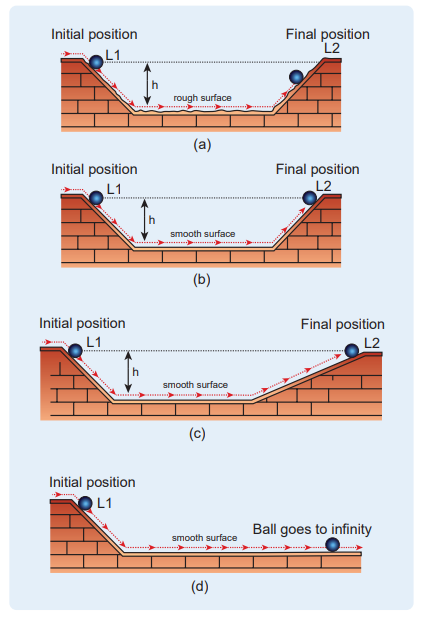

**Figure 3.1** Galileo’s experiment with the second plane (a) at same inclination angle as the first (b) with increased smoothness (c) with reduced angle of inclination (d) with zero angle of inclination

force acted on it in the horizontal direction. From this simple experiment, Galileo proved that force is not required to maintain motion. An object can be in motion even without a force acting on it.

In essence, Aristotle coupled the motion with force while Galileo decoupled the motion and force.

## NEWTON’S LAWS

Newton analysed the views of Galileo, and other scientist like Kepler and Copernicus on motion and provided much deeper insights in the form of three laws.

## Newton’s First Law

**Every object continues to be in the state of rest or of uniform motion (constant velocity) unless there is external force acting on it.**

This inability of objects to move on its own or change its state of motion is called inertia. Inertia means resistance to change its state. Depending on the circumstances, there can be three types of inertia.

1\. **Inertia of rest:** When a stationary bus starts to move, the passengers experience a sudden backward push. Due to inertia, the body (of a passenger) will try to

**Figure 3.3** Passengers experience a forward push due to inertia of motion
  

continue in the state of rest, while the bus moves forward. This appears as a backward push as shown in Figure 3.2. _The inability of an object to change its state of rest is called inertia of rest_.

2\. **Inertia of motion:** When the bus is in motion, and if the brake is applied suddenly, passengers move forward and hit against the front seat. In this case, the bus comes to a stop, while the body (of a passenger) continues to move forward due to the property of inertia as shown in Figure 3.3. The inability of _an object to change its state of uniform speed (constant speed) on its own is called_ _inertia of motion_.

3\. **Inertia of direction:** When a stone attached to a string is in whirling

**Figure 3.2** Passengers experience a backward push due to inertia of rest  

motion, and if the string is cut suddenly, the stone will not continue to move in circular motion but moves tangential to the circle as illustrated in Figure 3.4. This is because the body cannot change its direction of motion without any force acting on it. The inability of an object to _change its direction of motion on its own is called_ _inertia of direction_.

When we say that an object is at rest or in motion with constant velocity, it has a meaning only if it is specified with respect to some reference frames. In physics, any motion has to be stated with respect to a reference frame. It is to be noted that Newton’s first law is valid only in certain special reference frames called inertial frames. In fact, Newton’s first law defines an inertial frame.

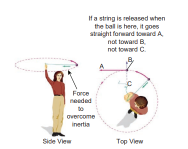

**Figure 3.4** A stone moves tangential to circle due to inertia of direction

**Inertial Frames**

If an object is free from all forces, then it moves with constant velocity or remains at rest when seen from inertial frames. Thus, there exists some special set of frames in which, if an object experiences no force, it moves with constant velocity or remains at rest. But how do we know whether an object is experiencing a force or not? All the objects in the Earth experience Earth’s gravitational force. In the ideal case, if an object is in deep space (very far away from any other object), then Newton’s first law will be certainly valid. Such deep space can be treated as an inertial frame. But practically it is not possible to reach such deep space and verify Newton’s first law.

For all practical purposes, we can treat Earth as an inertial frame because an object on the table in the laboratory appears to be at rest always. This object never picks up acceleration in the horizontal direction since no force acts on it in the horizontal direction. So the laboratory can be taken as an inertial frame for all physics experiments and calculations. For making these conclusions, we analyse only the horizontal motion of the object as there is no horizontal force that acts on it. We should not analyse the motion in vertical direction as the two forces (gravitational force in the downward direction and normal force in upward direction) that act on it makes the net force is zero in vertical direction. Newton’s first law deals with the motion of objects in the absence of any force and not the motion under zero net force. Suppose a train is moving with constant velocity with respect to an inertial frame, then an object at rest in the inertial frame (outside the train) appears to move with constant velocity with respect to the train (viewed from within the train). So the train can be treated as an inertial frame. All inertial frames are moving  

with constant velocity relative to each other. If an object appears to be at rest in one inertial frame, it may appear to move with constant velocity with respect to another inertial frame. For example, in Figure 3.5, the car is moving with uniform velocity _v_ with respect to a person standing (at rest) on the ground. As the car is moving with constant velocity with respect to the person at rest on the ground, both frames (with respect to the car and to the ground) are inertial frames.

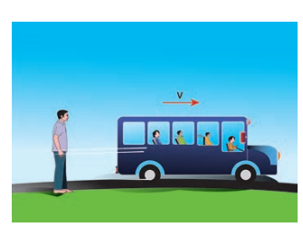

**Figure 3.5 The person and** vehicle are inertial frames

Suppose an object remains at rest on a smooth table kept inside the train, and if the train suddenly accelerates (which we may not sense), the object appears to accelerate backwards even without any force acting on it. It is a clear violation of Newton’s first law as the object gets accelerated without being acted upon by a force. It implies that the train is not an inertial frame when it is accelerated. For example, Figure 3.6 shows that car 2 is a non-inertial frame since it moves with acceleration _a_ with respect to the ground.

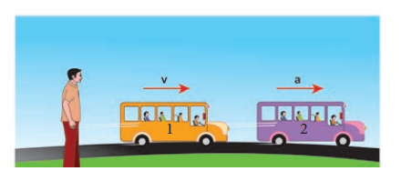
**Figure 3.6** Car 2 is a non-inertial frame

These kinds of accelerated frames are called non-inertial frames. A rotating frame is also a non inertial frame since rotation requires acceleration. In this sense, Earth is not really an inertial frame since it has self-rotation and orbital motion. But these rotational effects of Earth can be ignored for the motion involved in our day-to-day life. For example, when an object is thrown, or the time period of a simple pendulum is measured in the physics laboratory, the Earth’s self- rotation has very negligible effect on it. In this sense, Earth can be treated as an inertial frame. But at the same time, to analyse the motion of satellites and wind patterns around the Earth, we cannot treat Earth as an inertial frame since its self-rotation has a strong influence on wind patterns and satellite motion.

### Newton’s Second Law

This law states that

_The force acting on an object is equal to the rate of change of its momentum_





_F dp dt_

\= (3.1)

In simple words, whenever the momentum of the body changes, there must be a force acting on it. The momentum of the object is defined as

 _p mv_\= . In most cases, the mass

of the object remains constant during the motion. In such cases, the above equation gets modified into a simpler form







_F d mv_

_dt m dv_

_dt ma_

    .



_F ma_\= . (3.2)  

The above equation conveys the fact that if there is an acceleration _a_ on the body, then there must be a force acting on it. This implies that if there is a change in velocity, then there must be a force acting on the body. The force and acceleration are always in the same direction. Newton’s second law was a paradigm shift from Aristotle’s idea of motion. According to Newton, the force need not cause the motion but only a change in motion. It is to be noted that _Newton’s second law is valid only in inertial frames_. In non-inertial frames Newton’s second law cannot be used in this form. It requires some modification.

In the SI system of units, the unit of force is measured in newtons and it is denoted by symbol ‘N’.

_One Newton is defined as the force which acts on 1 kg of mass to give an acceleration 1 m s_-2 _in the direction of the force_.

**Aristotle vs. Newton’s approach on sliding object** 

Newton’s second law gives the correct explanation for the experiment on the inclined plane that was discussed in section 3.1. In normal cases, where friction is not negligible, once the object reaches the bottom of the inclined plane (Figure 3.1), it travels some distance and stops. Note that it stops because there is a frictional force acting in the direction opposite to its velocity. It is this frictional force that reduces the velocity of the object to zero and brings it to rest. As per Aristotle’s idea, as soon as the body reaches the bottom of the plane, it can travel only a small distance and stops because there is no force acting on the object. Essentially, he did not consider the frictional force acting on the object.

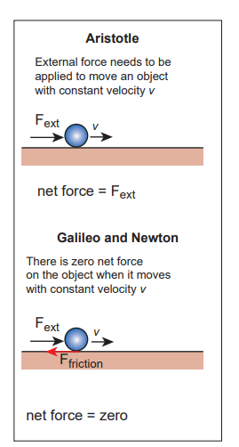
**Figure 3.7** Aristotle, Galileo and Newton’s approach  

  

### Newton’s Third Law

Consider Figure 3.8(a) whenever an object 1 exerts a force on the object 2 (_F_21), then object 2 must also exert equal and opposite force on the object 1 (_F12). These_ forces must lie along the line joining the two objects.

_F F_12 21 

Newton’s third law assures that the forces occur as equal and opposite pairs. An isolated force or a single force cannot exist in nature. _Newton’s third law states that for every action there is an equal and opposite reaction_. Here, action and reaction pair of forces do not act on the same body but on two different bodies. Any one of the forces can be called as an action force and the other the reaction force. Newton’s third law is valid in both inertial and non-inertial frames.

These action-reaction forces are not cause and effect forces. It means that when the object 1 exerts force on the object 2, the object 2 exerts equal and opposite force on the body 1 at the same instant.
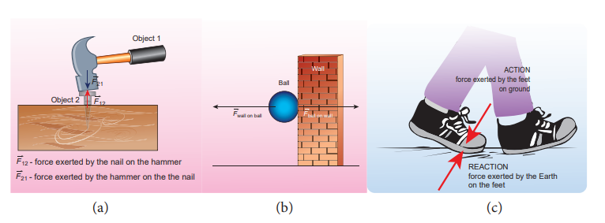

**Figure 3.8** Demonstration of Newton’s third law (a) Hammer and the nail (b) Ball 
bouncing off the wall (c) Walking on the floor with friction

---
**Note**

The reading in the spring balance A is due to the force given by spring balance B. The reading in the spring balance B is due to the reaction force given by spring balance A. Note that according to Newton’s third law, both readings (force) are equal.

---

## Discussion on Newton’s Laws

1\. Newton’s laws are vector laws. The equatio _F ma_\= is a vector equation and essentially it is equivalent to three scalar equations. In Cartesian coordinates, this equation can be written

  

as ˆ ˆˆ ˆˆ ˆ _x y z x y zF i F j F k ma i ma j ma k_     .

By comparing both sides, the three scalar equations are

_F max x_\= The acceleration along the x direction depends only on the component of force acting along the x-direction.

_F may y_\= The acceleration along the y direction depends only on the component of force acting along the y-direction.

_F maz z_\= The acceleration along the z direction depends only on the component of force acting along the z-direction.

From the above equations, we can infer that the force acting along y direction cannot alter the acceleration along x direction. In the same way, _Fz_ cannot affect ay and ax . This understanding is essential for solving problems.

2\. The acceleration experienced by the body at time t depends on the force which acts on the body at that instant of time. It does not depend on the force which acted on the body before the time t. This can be expressed as

figure. Fix one end with rigid support and with the hand.

**ITY**

**A B**

05101520 N

2015105

  



_F t ma t_    

Acceleration of the object does not depend on the previous history of the force. For example, when a spin bowler or a fast bowler throws the ball to the batsman, once the ball leaves the hand of the bowler, it experiences only gravitational force and air frictional force. The acceleration of the ball is independent of how the ball was bowled (with a lower or a higher speed).

3\. In general, the direction of a force may be different from the direction of motion. Though in some cases, the object may move in the same direction as the direction of the force, it is not always true. A few examples are given below.

**Case 1: Force and motion in the same direction**

When an apple falls towards the Earth, the direction of motion (direction of velocity) of the apple and that of force are in the same downward direction as shown in the Figure 3.9 (a).

**Figure 3.9** (a) Force and motion in the same direction

**F v**  

**Case 2: Force and motion not in the same direction**

The Moon experiences a force towards the Earth. But it actually moves in elliptical orbit. In this case, the direction of the force is different from the direction of motion as shown in Figure 3.9 (b).
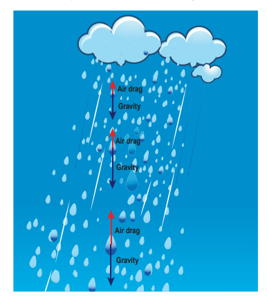
**Figure 3.9** (b) Moon orbiting in elliptical orbit around the Earth

**Case 3: Force and motion in opposite direction**

If an object is thrown vertically upward, the direction of motion is upward, but gravitational force is downward as shown in the Figure 3.9 (c).

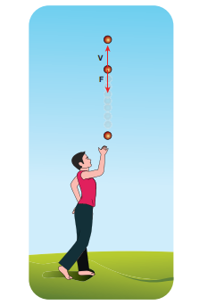
**Figure 3.9** (c) Force and direction of motion are in opposite directions

**Case 4: Zero net force, but there is motion**

When a raindrop gets detached from the cloud it experiences both downward gravitational force and upward air drag force. As it descends towards the Earth, the upward air drag force increases and after a certain time, the upward air drag force cancels the downward gravity. From then on the raindrop moves at constant velocity till it touches the surface of the Earth. Hence the raindrop comes with zero net force, therefore with zero acceleration but with non-zero terminal velocity. It is shown in the Figure 3.9 (d).

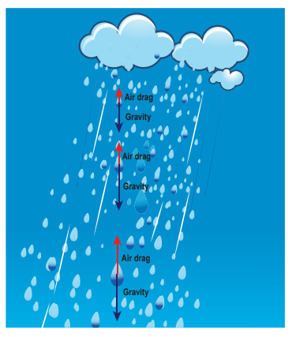

**Figure 3.9** (d) Zero net force and non zero terminal velocity

4\. If multiple forces    _F F F Fn_1 2 3, , …. act on the same body, then the total force ( _Fnet_ ) is equivalent to the vectorial sum of the individual forces. Their net force provides the acceleration.

    

_F F F F Fnet n_   1 2 3

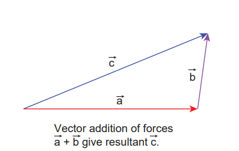

**Figure 3.10** Vector addition of forces

Newton’s second law for this case is



_F manet_ \=

In this case the direction of acceleration is in the direction of net force.

**Example** 

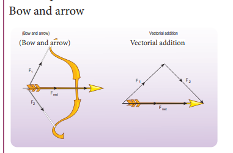
**Figure 3.11** Bow and arrow – Net force 
is on the arrow

5\. Newton’s second law can also be written in the following form.

Since the acceleration is the second derivative of position vector of the body 



_a d r dt_

 

 



 

2

2 , the force on the body is





_F m d r dt_

\= 2

2 .

From this expression, we can infer that Newton’s second law is basically a second order ordinary differential equation and whenever the second derivative of position vector is not zero, there must be a force acting on the body.

6\. If no force acts on the body then Newton’s

second law, _m dv dt_



\= 0.

It implies that _v constant_\= . It is essentially Newton’s first law. It implies that the second law is consistent with the first law. However, it should not be thought of as the reduction of second law to the first when no force acts on the object. Newton’s first and second laws are independent laws. They can internally be consistent with each other but cannot be derived from each other.

7\. Newton’s second law is cause and effect relation. Force is the cause and acceleration is the effect. Conventionally, the effect should be written on the left and cause on the right hand side of the equation. So the correct way of writing

Newton’s second law is _ma F_



\= or _dp dt_

_F_ 



\=

## APPLICATION OF NEWTON’S LAWS**

### Free Body Diagram

Free body diagram is a simple tool to analyse the motion of the object using Newton’s laws.

The following systematic steps are followed for developing the free body diagram:

1\. Identify the forces acting on the object. 2. Represent the object as a point.  

3\. Draw the vectors representing the forces acting on the object.

When we draw the free body diagram for an object or a system, the forces exerted by the object should not be included in the free body diagram.

**EXAMPLE 3.1**

A book of mass m is at rest on the table. (1) What are the forces acting on the book? (2) What are the forces exerted by the book? (3) Draw the free body diagram for the book.

**_Solution_**

(1) There are two forces acting on the book.

(i) Gravitational force (mg) acting downwards on the book

(ii) Normal contact force (N) exerted by the surface of the table on the book. It acts upwards as shown in the figure.

---

**Note**
In the free body diagram, as the magnitudes of the normal force and the gravitational force are same, the lengths of both these vectors are also same.

---

(2) According to Newton’s third law, there are two reaction forces exerted by the book.

(i) The book exerts an equal and opposite force (mg) on the Earth which acts upwards.

(ii) The book exerts a force which is equal and opposite to normal force on the surface of the table (N) acting downwards.

---

**Note**

It is to be emphasized that while applying Newton’s third law it is wrong to conclude that the book on

the table is at rest due to the downward gravitational force exerted by the Earth and the equal and opposite reacting normal force exerted by the table on the book. A**ction and reaction forces never act on the same body.**

---

(3) The free body diagram of the book is shown in the figure.

---
**Note**

Even though the force applied on both the objects is the same, acceleration experienced by each object differs. The acceleration is inversely proportional to mass. For the same force, the heavier mass experiences lesser acceleration and the lighter mass experiences greater acceleration.

---

When an apple falls, it experiences Earth’s gravitational force. According to Newton’s third law, the apple exerts equal and opposite force on the Earth. Even though both the apple and Earth experience the same force, their acceleration is different. The mass of Earth is enormous compared to that of an apple. So an apple experiences larger acceleration and the Earth experiences almost negligible acceleration. Due to the negligible acceleration, Earth appears to be stationary when an apple falls.

**EXAMPLE 3.2**

If two objects of masses 2.5 kg and 100 kg experience the same force 5 N, what is the acceleration experienced by each of them?

**_Solution_**

From Newton’s second law (in magnitude form), F = ma

For the object of mass 2.5 kg, the

acceleration is _a F m_

_m s_\= = = -5 2 5

2 2

.

For the object of mass 100 kg, the

acceleration is _a F m_

_m s_\= = = -5 100

0 05 2.  

**EXAMPLE 3.3**

Which is the greatest force among the three force

  

_F F F_1 2 3, , shown below

F1

→

F2

→

F3

→

**_Solution_** Force is a vector and magnitude of the vector is represented by the length of the vector. Here



_F_1 has greater length compared to other two. So



_F_1 is largest of the three.

**EXAMPLE 3.3**

Which is the greatest force among the three  force  FF,, F  shown below
12F→F→F1

Solution 

Force i s a v ector a nd m agnitude o f t he3vector i s r epres ented b y  the  lengt h  of  thevector. Here F  has greater lengt h comparedto other t wo. S o  F  is l argest of t he t hree. 

**EXAMPLE 3.4**

Apply Newton’s second law to a mango hanging from a tree. (Mass of the mango is 400 gm)

**_Solution_** 

Note: Before applying Newton’s laws,
the following steps have to be followed:

1) Choose a suitable inertial coordinate system to analyse the problem. For most of the cases we can take Earth as an inertial coordinate system.

2) Identify the system to which Newton’s laws need to be applied. The system can be a single object or more than one object.

3) Draw the free body diagram. 4) Once the forces acting on the system are

identified, and the free body diagram is drawn, apply Newton’s second law. In the left hand side of the equation, write the forces acting on the system in vector notation and equate it to the right hand side of equation which is the product of mass and acceleration. Here, acceleration should also be in vector notation.

5) If acceleration is given, the force can be calculated. If the force is given, acceleration can be calculated.

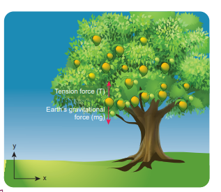
By following the above steps:

We fix the inertial coordinate system on the ground as shown in the figure.

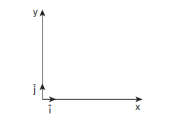
The forces acting on the mango are

i) Gravitational force exerted by the Earth on the mango acting downward along negative y axis

ii) Tension (in the cord attached to the mango) acts upward along positive y axis.

The free body diagram for the mango is shown in the figure

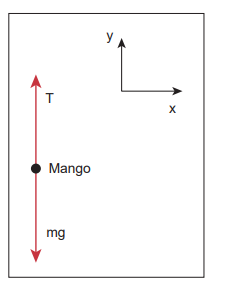

 ˆ ˆ _gF mg j mgj_   



Here, mg is the magnitude of the gravitational force and  ĵ represents the unit vector in negative y direction

ˆ_T Tj_



  

Here T is the magnitude of the tension force and  ĵ represents the unit vector in positive y direction

 



_F F Tnet g_  =  ˆ ˆ ˆ_mgj Tj T mg j_   

From Newton’s second law 

_F manet_ \= Since the mango is at rest with respect

to us (inertial coordinate system) the acceleration is zero (_a_ \= 0).

So 

_F manet_ \= = 0

  ˆ 0 _T mg j_

By comparing the components on both sides of the above equation, we get _T mg_  0

So the tension force acting on the mango is given by _T mg_\=

Mass of the mango _m_ = 400_g_ and _g_ = 9.8 _m s_–2

Tension acting on the mango is _T_ = 0.4 × 9.8 = 3.92 N

**EXAMPLE 3.5**

A person rides a bike with a constant velocity _v_ with respect to ground and another biker accelerates with acceleration _a_ with respect to ground. Who can apply Newton’s second law with respect to a stationary observer on the ground?

**_Solution_**

Second biker cannot apply Newton’s second law, because he is moving with acceleration _a_ with respect to Earth (he is not in inertial frame). But the first biker can apply Newton’s second law because he is moving at constant velocity with respect to Earth (he is in inertial frame).  

**EXAMPLE 3.6**

The position vector of a particle is given by 23 5 7 .ˆˆˆ   _r ti t j k_ Find the direction in which the particle experiences net force?

**_Solution_** Velocity of the particle,

_v_ \=      2 ˆˆˆ3 5 7_dr d d dt i t j k dt dt dt dt_

   

ˆˆ3 10  _dr i tj_

_dt_ Acceleration of the particle

2

2 0ˆ1     _dv d ra j_

_dt dt_

Here, the particle has acceleration only along positive y direction. According to Newton’s second law, net force must also act along positive y direction. In addition, the particle has constant velocity in positive x direction and no velocity in z direction. Hence, there are no net force along x or z direction.

**EXAMPLE 3.7**

Consider a bob attached to a string, hanging from a stand. It oscillates as shown in the figure.

a) Identify the forces that act on the bob? b) What is the acceleration experienced by the bob?

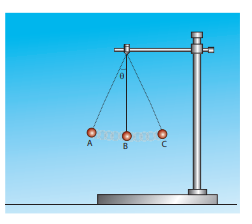

**_Solution_** Two forces act on the bob. (i) Gravitational force (mg) acting

downwards (ii) Tension (T) exerted by the string on

the bob, whose position determines the direction of T as shown in figure.

mg mg mg

T

A B

C

T T



The bob is moving in a circular arc as shown in the above figure. Hence it has centripetal acceleration. At a point A and C, the bob comes to rest momentarily and then its velocity increases when it moves towards point B. Hence, there is a tangential acceleration along the arc. The gravitational force can be resolved into two components (mg cosθ, mg sinθ) as shown below
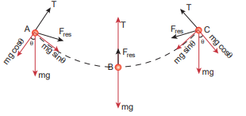

---
**Note**

Note that the bob does not 
move in the direction of 
the resultant force. At the 
points A and C, tension T = mg cosθ. 
At all other points, tension T is greater than mg cosθ, since it has non zero centripetal 
acceleration. At point B, thresultant 
force acts upward along the string. It is an example of a non uniform circular motion because the bob has both the centripetal and tangential accelerations.

---

**EXAMPLE 3.8**

The velocity of a particle moving in a plane is given by the following diagram. Find out the direction of force acting on the particl
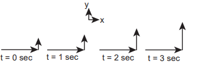

**_Solution_** The velocity of the particle is ˆ .ˆˆ  

 _x y zv v i v j v k_

ˆ .ˆˆ _y zi v j v k_ As shown in the figure, the particle is moving in the xy plane, there is no motion in the z direction. So velocity in the z direction is zero (_vz_ \= 0). The velocity of the particle has x component (_vx_) and y component (_vy_). From figure, as time increases from t = 0 sec to t = 3 sec, the length of the vector in y direction is changing (increasing). It means y component of velocity _vy_  is increasing with respect to time. According to Newton’s second law, if velocity changes with respect to time then there must be acceleration. In this case, the particle has acceleration in the y direction since the y component of velocity changes. So the particle experiences force in the y direction. The length of the vector in x direction does not change. It means that the particle has constant velocity in the x direction. So no force or zero net force acts in the x direction.

**EXAMPLE 3.9**

Apply Newton’s second law for an object at rest on Earth and analyse the result.

**_Solution_**

The object is at rest with respect to Earth (inertial coordinate system). There are two forces that act on the object.

i) Gravity acting downward (negative y-direction)

ii) Normal force by the surface of the Earth acting upward (positive y-direction)

The free body diagram for this object is

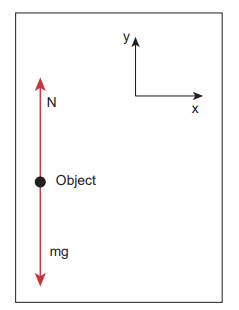

ˆ  

_gF mgj_

ˆ 

_N Nj_

Net force ˆ ˆ  

_netF mgj Nj_ But there is no acceleration on the ball.

So _a_ \= 0. By applying Newton’s second law ( 

_F manet_ \= )

Since ˆ ˆ0,    

_neta F mgj Nj_

( )ˆ 0  _mg N j_  

By comparing the components on both sides of the equation, we get

  _mg N_ 0 _N mg_\=

We can conclude that if the object is at rest, the magnitude of normal force is exactly equal to the magnitude of gravity.

**EXAMPLE 3.10**

A particle of mass 2 kg experiences two forces,

1 8 ˆˆ5ˆ 7    _F i j k_ and

2 4 ˆˆ3ˆ 3    _F i j k_ .

What is the acceleration of the particle?

**_Solution_** We use Newton’s second law,



_F manet_ \= where

  

_F F Fnet_  1 2 . From the above

equations the acceleration is  

_a F m net_\= , where

      ˆˆ 7 3ˆ5 3 8 4      

_netF i j k_

4 ˆ10ˆˆ8   

_netF i j k_

ˆˆˆ8 4 10 2 2 2                   

_a i j k_

4 2 ˆˆˆ 5   _a i j k_

**EXAMPLE 3.11**

Identify the forces acting on blocks A, B and C shown in the figure.

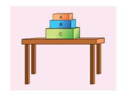

**_Solution_**

**Forces on block A:**

(i) Downward gravitational force exerted by the Earth (mAg)

(ii) Upward normal force exerted by block B (NB)

The free body diagram for block A is as shown in the following picture.

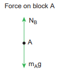

**Forces on block B :**

(i) Downward gravitational force exerted by Earth (mBg)

(ii) Downward force exerted by block A (NA) 

(iii) Upward normal force exerted by block C (NC)

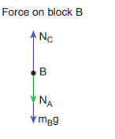

**Forces onblock C:** 

(i) Downward gravitational force exerted by Earth (mCg) 

(ii) Downward force exerted by block B (NB) 

(iii) Upward force exerted by the table (Ntable) 

**EXAMPLE 3.12**

Consider a horse attached to the cart which is initially at rest. If the horse starts walking forward, the cart also accelerates in the forward direction. If the horse pulls the cart with force _Fh_ in forward direction, then according to Newton’s third law, the cart also pulls the horse by equivalent opposite force _F Fc h_\= in backward direction. Then total force on ‘cart+horse’ is zero. Why is it then the ‘cart+horse’ accelerates and moves forward?

**_Solution_**

This paradox arises due to wrong application of Newton’s second and third laws. Before applying Newton’s laws, we should decide ‘what is the system?’. Once we identify the ‘system’, then it is possible to identify all the forces acting on the system. We should not consider the force exerted by the system. If there is an unbalanced force acting on the system, then it should have acceleration in the direction of the resultant force. By following these steps we will analyse the horse and cart motion.

If we decide on the cart+horse as a ‘system’, then we should not consider the force exerted by the horse on the cart or the force exerted by cart on the horse. Both are internal forces acting on each other. According to Newton’s third law, total internal force acting on the system is zero and it cannot accelerate the system. The acceleration of the system is caused by some external force. In this case, the force exerted by the road on the system is the external force acting on the system. It is wrong to conclude that the total force acting on the system (cart+horse) is zero without including all the forces acting on the system. The road is pushing the horse

and cart forward with acceleration. As there is an external force acting on the system, Newton’s second law has to be applied and not Newton’s third law.

The following figures illustrates this.

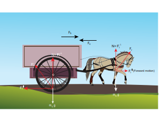

If we consider the horse as the ‘system’, then there are three forces acting on the horse.

(i) Downward gravitational force (_m gh_ ) 

(ii) Force exerted by the road (_Fr_)

(iii) Backward force exerted by the cart (_Fc_)

It is shown in the following figure.

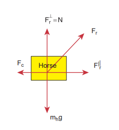

Fr – Force exerted by the road on the horse

Fc – Force exerted by the cart on the horse

Fr ⊥ – Perpendicular component of Fr = N

F|| r – Parallel component of Fr which is reason

for forward movement

Fc

mhg

Fr

F|| rHorse  

The force exerted by the road can be resolved into parallel and perpendicular components. The perpendicular component balances the downward gravitational force. There is parallel component along the forward direction. It is greater than the backward force (_Fc_). So there is net force along the forward direction which causes the forward movement of the horse.

If we take the cart as the system, then there are three forces acting on the cart.

(i) Downward gravitational force (_m gc_ ) (ii) Force exerted by the road ( )_Fr_

’

(iii) Force exerted by the horse (_Fh_ )

It is shown in the figure

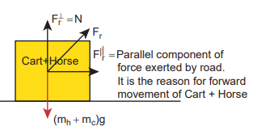
The force exerted by the road (Fr ’) can be resolved into parallel and perpendicular components. The perpendicular component cancels the downward gravity (_m gc_ ). Parallel component acts backwards and the force exerted by the horse (_Fh_

 )

acts forward. Force (_Fh_

 ) is greater than the

parallel component acting in the opposite direction. So there is an overall unbalanced force in the forward direction which causes the cart to accelerate forward.

  

If we take the cart+horse as a system, then there are two forces acting on the system.

(i) Downward gravitational force (_m mh c_\+ )g

(ii) The force exerted by the road (Fr) on the system.

It is shown in the following figure.

(mh mc)g

Fr

F|| r Parallel component of

force exerted by road. It is the reason for forward movement of Cart + Horse

Fr N

Cart+Horse

(iii) In this case the force exerted by the road (_Fr_) on the system (cart+horse) is resolved in to parallel and perpendicular components. The perpendicular component is the normal force which cancels the downward gravitational force (_m mh c_\+ )g. The parallel component of the force is not balanced, hence the system (cart+horse) accelerates and moves forward due to this force.

**EXAMPLE 3.13**

The position of the particle is represented

by _y ut gt_  1 2

2.

a) What is the force acting on the particle? 

b) What is the momentum of the particle?

**_Solution_** To find the force, we need to find the acceleration experienced by the particle.  

The acceleration is given by a _d y dt_

\= 2

2

(or) _a dv dt_

\=

Here

_v_ \=velocity of the particle in y direction

_v dy dt_

\= = _u gt_\-

The momentum of the particle = mv = m (u-gt).

_a dv dt_

_g_  

The force acting on the object is given by _F ma mg_  

The negative sign implies that the force is acting on the negative y direction. This is exactly the force that acts on the object in projectile motion.

### Particle Moving in an Inclined Plane

When an object of mass m slides on a frictionless surface inclined at an angle θ as shown in the Figure 3.12, the forces acting on it decides the

a) acceleration of the object 

b) speed of the object when it reaches the

bottom

The force acting on the object is

(i) Downward gravitational force (mg) (ii) Normal force perpendicular to inclined

surface (N)

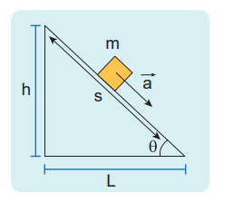
  

**Figure 3.12** Object moving in an inclined plane

To draw the free body diagram, the block is assumed to be a point mass (Figure 3.13 (a)). Since the motion is on the inclined surface, we have to choose the coordinate system parallel to the inclined surface as shown in Figure 3.13 (b).

The gravitational force mg is resolved in to parallel component _mg_ sinθ along the inclined plane and perpendicular component _mg_ cosθ perpendicular to the inclined surface (Figure 3.13 (b)).

Note that the angle made by the gravitational force (mg) with the perpendicular to the surface is equal to the angle of inclination θ ’ as shown in Figure 3.13 (c).

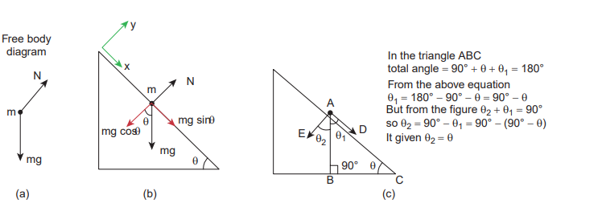

**Figure 3.13** (a) Free body diagram, (b) mg res components (c) The angle θ2 is equal to θ2

m

N

Free body diagram

mg

(a) (b)

mg

m

x

y

N

mg cos mg sin

  

There is no motion(acceleration) along the y axis. Applying Newton’s second law in the y direction

 cos 0 ˆ ˆ_mg j Nj No acceleration_  

By comparing the components on both sides, _N mg_ cos 0

_N mg_ cos

The magnitude of normal force (N) exerted by the surface is equivalent to _mg cos_θ .

The object slides (with an acceleration) along the x direction. Applying Newton’s second law in the x direction

ˆ ˆsin_mg i mai_ 

By comparing the components on both sides, we can equate

_mg ma_sin 

The acceleration of the sliding object is

_a g sin_\= θ

olved into parallel and perpendicular

(c)

DE

90° B C

A

2 1



In the triangle ABC total angle  90°   1  180° From the above equation 1  180°  90°   90°   But from the figure 2 1  90° so 2  90° 1  90° (90°  ) It given 2 

|------|------|

| m |
|------|------|

|  |

| y |
|------|------|
| Nm mg sinmg |
| xmg cos |

| total angle From the abA But from the figure so E  D It giv12 |
|------|------|------|------|

|  |190° |
  

Note that the acceleration depends on the angle of inclination  .. If the angle  is 90 degree, the block will move vertically with acceleration _a_ = _g_.

Newton’s kinematic equation is used to find the speed of the object when it reaches the bottom. The acceleration is constant throughout the motion.

_v u as_2 2 2  along the x direction (3.3)

The acceleration a is equal to g sinθ. The initial speed (u) is equal to zero as it starts from rest. Here s is the length of the inclined surface.

The speed (v) when it reaches the bottom is (using equation (3.3))

_v sg sin_\= 2 θ (3.4)

---
**Note**
Here we choose the coordinate system along the inclined plane. Even if we

choose the coordinate system parallel to the horizontal surface, we will get the same result. But the mathematics will be quite complicated. Choosing a suitable inertial coordinate system for the given problem is very important.

---

### Two Bodies in Contact on a Horizontal Surface

Consider two blocks of masses m1 and m2

(m1> m2) kept in contact with each other on a smooth, horizontal frictionless surface as shown in Figure 3.14.  
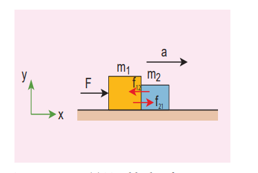
**Figure 3.14** (a) Two blocks of masses m1 and m2 (m1> m2**)** kept in contact with each other on a smooth, horizontal frictionless surface

y

x

a

F m1 m2

f21

f12

By the application of a horizontal force F, both the blocks are set into motion with acceleration ‘a’ simultaneously in the direction of the force F.

To find the acceleration a, Newton’s second law has to be applied to the system (combined mass m = m1 + m2)



_F ma_\=

If we choose the motion of the two masses along the positive x direction,

ˆ ˆ_Fi mai_

By comparing components on both sides of the above equation

_F_ \= ma where m = m1 + m2

The acceleration of the system is given by

  

_a F_ m m1 2

(3.5)

The force exerted by the block m1 on m2 due to its motion is called force of contact ( 

_f_21). According to Newton’s third law, the block m2 will exert an equivalent opposite reaction force (



_f_12 ) on block m1.

Figure 3.14 (b) shows the free body diagram of block m1.
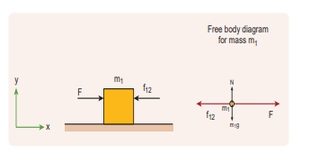
**Figure 3.14** (b) Free body diagram of block of mass m1

m1

m1f12 F

F f12

Free body diagram for mass m1

y

x m1g

N

12 1 ˆ ˆ ˆ  _Fi f i m ai_

By comparing the components on both sides of the above equation, we get

_F f m a_ 12 1

_f F m a_12 1  (3.6)

Substituting the value of acceleration from equation (3.5) in (3.6) we get

_f F m F m m_12 1

1 2

  



 



 

_f F m m m_12

1

1 2

1  



 



 

_f Fm m m_12

2

1 2

 

(3.7)  

Equation (3.7) shows that the magnitude of contact force depends on mass m2 which provides the reaction force. Note that this force is acting along the negative x direction.

In vector notation, the reaction force on

mass m1 is given by 2 12

1 2

ˆ  

 _Fmf i m m_

For mass m2 there is only one force acting on it in the x direction and it is denoted by 

_f21. This force is exerted by mass m1. The_ free body diagram for mass m2 is shown in Figure 3.14 (c).
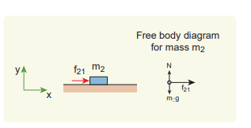
**Figure 3.14** (c) Free body diagram of block of mass m2

mg

N

f21

f21 m2y

x

Free body diagram for mass m2

Applying Newton’s second law for mass m2

By comparing the components on both sides of the above equation

_f m a_21 2= (3.8)

Substituting for acceleration from equation

(3.5) in equation (3.8), we get _f Fm m m_21

2

1 2

 

In this case the magnitude of the contact force is

_f Fm m m_21

2

1 2

 

The direction of this force

is along the positive x direction.

21 2 ˆ ˆ_f i m ai_

  

In vector notation, the force acting on

mass m2exerted by mass m1is 2 21

1 2

ˆ_Fmf i m m_

 



Note  

_f f_12 21  which confirms Newton’s third law.

### Motion of Connected Bodies

When objects are connected by strings and a force F is applied either vertically or horizontally or along an inclined plane, it produces a tension T in the string, which affects the acceleration to an extent. Let us discuss various cases for the same.

**Case 1:** Vertical motion Consider two blocks of masses m1 and m2 (m1> m2) connected by a light and inextensible string that passes over a pulley as shown in Figure 3.15.

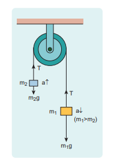
**Figure 3.15** Two blocks connected by a string over a pulley

Let the tension in the string be _T_ and acceleration _a_. When the system is released, both the blocks start moving, m2 vertically upward and m1 downward with same acceleration a. The gravitational force m1g on mass m1 is used in lifting the mass m2.  

The upward direction is chosen as y direction. The free body diagrams of both masses are shown in Figure 3.16.
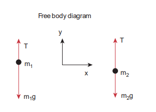
**Figure 3.16** Free body diagrams of masses m1 and m2

m2

T T

m1

m2gm1g

x

y

Free body diagram

Applying Newton’s second law for mass m2

2 2 ˆ ˆ ˆ _Tj m gj m aj_

The left hand side of the above equation is the total force that acts on _m_2 and the right hand side is the product of mass and acceleration of _m_2 in y direction.

By comparing the components on both sides, we get

_T m g m a_ 2 2 (3.9)

Similarly, applying Newton’s second law for mass m1

1 1 ˆ ˆ ˆ  _Tj m gj m aj_

As mass m1 moves downward ( ˆ _j_), its acceleration is along ( ˆ _j_)

  

By comparing the components on both sides, we get

_T m g m a_  1 1

_m g T m a_1 1  (3.10)

Adding equations (3.9) and (3.10), we get

_m g m g m a m a_1 2 1 2  

_m m g_1 2  = ( )_m m a_1 2+ (3.11)

From equation (3.11), the acceleration of both the masses is

_a m m m m_

_g_  



 



 1 2

1 2

(3.12)

If both the masses are equal (m1=m2), from equation (3.12)

_a_ \= 0

This shows that if the masses are equal, there is no acceleration and the system as a whole will be at rest.

To find the tension acting on the string, substitute the acceleration from the equation (3.12) into the equation (3.9).

_T m g m m m m m_

_g_\- = - +

 

 2 2

1 2

1 2

_T m g m m m m m_

_g_   



 



 2 2

1 2

1 2

(3.13)

By taking m2g common in the RHS of equation (3.13)  

_T m g m m m m_

   



 



 2

1 2

1 2

1

_T m g m m m m m m_

   

 

 



 2

1 2 1 2

1 2

_T m m m m_

_g_ 



 



 

2 1 2

1 2

Equation (3.12) gives only magnitude of acceleration.

For mass m1 , the acceleration vector is

given by 1 2

1 2

ˆ     

 _m ma g j m m_

For mass m2 , the acceleration vector is

given by 1 2

1 2

ˆ     

 _m ma g j m m_

**Case 2:** Horizontal motion In this case, mass m2 is kept on a horizontal table and mass m1 is hanging through a small pulley as shown in Figure 3.17. Assume that there is no friction on the surface.
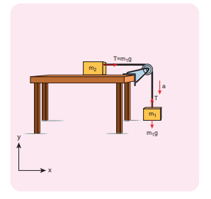
**Figure 3.17** Blocks in horizontal motion

As both the blocks are connected to the unstretchable string, if m1 moves with an acceleration _a_ downward then _m_2 also moves with the same acceleration _a_ horizontally.

The forces acting on mass m2 are

(i) Downward gravitational force (_m2g_) 

(ii) Upward normal force (N) exerted by the surface 

(iii) Horizontal tension (T) exerted by the string

The forces acting on mass m1 are

(i) Downward gravitational force (_m1g_) (ii) Tension (T) acting upwards

The free body diagrams for both the masses is shown in Figure 3.18.
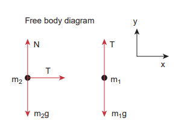
**Figure 3.18** Free body diagrams of masses m1 and m2

m1

T

T

N

m2

m1gm2g

x

yFree body diagram

Applying Newton’s second law for m1

1 1 ˆ ˆ ˆ  _Tj m gj m aj_ (along y direction)

By comparing the components on both sides of the above equation,

_T m g m a_  1 1 (3.14)

Applying Newton’s second law for m2

2 ˆ ˆ_Ti m ai_ (along x direction)  

By comparing the components on both sides of above equation,

_T m a_\= 2 (3.15)

There is no acceleration along y direction for _m_2.

2 ˆ ˆ 0 _Nj m gj_

By comparing the components on both sides of the above equation

_N m g_ 2 0

_N m g_\= 2 (3.16)

By substituting equation (3.15) in equation (3.14), we can find the tension T

_m a m g m a_2 1 1  

_m a m a m g_2 1 1 

_a_ = _m m m_

_g_1

1 2+ (3.17)

Tension in the string can be obtained by substituting equation (3.17) in equation (3.15)

_T m m m m_

_g_  1 2

1 2

(3.18)

Comparing motion in both cases, it is clear that the tension in the string for horizontal motion is half of the tension for vertical motion for same set of masses and strings.

This result has an important application in industries. The ropes used in conveyor belts (horizontal motion) work for longer duration than those of cranes and lifts (vertical motion).

  

### Concurrent Forces and Lami’s Theorem

A collection of forces is said to be concurrent, if the lines of forces act at a common point. Figure 3.19 illustrates concurrent forces.

Concurrent forces need not be in the same plane. If they are in the same plane, they are concurrent as well as coplanar forces.
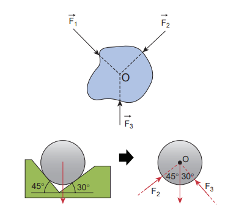
**Figure 3.19** Concurrent forces

## LAMI’S THEOREM

If a system of three concurrent and coplanar forces is in equilibrium, then Lami’s theorem states that the magnitude of each force of the system is proportional to sine of the angle between the other two forces. The constant of proportionality is same for all three forces.

Let us consider three coplanar and concurrent forces

  

_F F F_1 2 3, and which act at  

a common point O as shown in Figure 3.20. If the point is at equilibrium, then according to Lami’s theorem
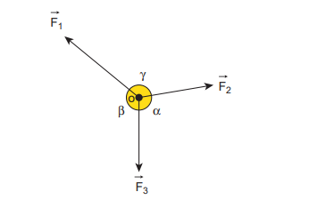

**Figure 3.20 Three** coplanar and concurrent forces

  

_F F F_1 2 3, and acting at O

F1

F3

F2

β o

α

γ



_F_1  sin



_F_2  sin

_F_3 sin

Therefore, _F F F_1 2 3

sin sin sin (3.19)

Lami’s theorem is useful to analyse the forces acting on objects which are in static equilibrium.

**Application of Lami’s Theorem**

**EXAMPLE 3.14**

A baby is playing in a swing which is hanging with the help of two identical chains is at rest. Identify the forces acting on the baby. Apply Lami’s theorem and find out the tension acting on the chain.

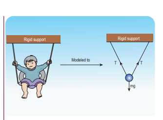

**_Solution_** The baby and the chains are modeled as a particle hung by two strings as shown in the figure. There are three forces acting on the baby.

i) Downward gravitational force along negative _y_ direction (_mg_)

ii) Tension (T) along the two strings

These three forces are coplanar as well as concurrent as shown in the following figure.
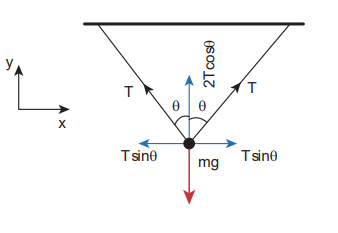
By using Lami’s theorem

_T T mg_ sin sin sin180 180 2 

  

    

Since sin sin180     and sin sin2 2   sin sin cos2 2    

We get _T mg_

sin sin cos   

2

T

mg

T

x

y

T sinθ

θθ

T sinθ

2T c

os θ

T

Rigid supportRigid support

mg

Modeled to T  

From this, the tension on each string is

_T mg_ 

2cos .

cos 

---

When   0 , the strings are vertical and the tension on

each string is _T mg_ \=

2

---
## LAW OF CONSERVATION OF TOTAL LINEAR MOMENTUM

In nature, conservation laws play a very important role. The dynamics of motion of bodies can be analysed very effectively using conservation laws. There are three conservation laws in mechanics. Conservation of total energy, conservation of total linear momentum, and conservation of angular momentum. By combining Newton’s second and third laws, we can derive the law of conservation of total linear momentum.

When two particles interact with each other, they exert equal and opposite forces on each other. The particle 1 exerts force



_F_21 on particle 2 and particle 2 exerts an exactly equal and opposite force



_F_12 on particle 1, according to Newton’s third law.

 

_F F_21 12  (3.20)

In terms of momentum of particles, the force on each particle (Newton’s second law) can be written as





_F dp dt_12

1= and 



_F dp dt_21

2= . (3.21)

  

Here 

_p_1 is the momentum of particle 1 which changes due to the force



_F_12 exerted by particle 2. Further



_p_2 is the momentum of particle 2. This changes due to



_F_21 exerted by particle 1.

Substitute equation (3.21) in equation (3.20)

_dp dt_

_dp dt_

 

1 2  (3.22)

_dp dt_

_dp dt_

 

1 2 0  (3.23)

_d dt_

_p p_  

1 2 0  

It implies that  

_p p_1 2  constant vector (always).  

_p p_1 2+ is the total linear momentum of the two particles (

  

_p p ptot_  1 2). It is also called as total linear momentum of the system. Here, the two particles constitute the system. From this result, the law of conservation of linear momentum can be stated as follows.

_If there are no external forces acting on the system, then the total linear momentum of the system (_



_ptot ) is always a constant vector. In otherwords, the total linear momentum of the system is conserved in time. Here the word ‘conserve’ means that_



_p_1 _and_ 

_p_2 _can vary,in such a way that_

 

_p p_1 2+ is a constant vector. The forces



_F_12 and 

_F_21 are called the internal forces of the system, because they act only between the two particles. There is no external force acting on the two particles from outside. In such a case the total linear momentum of the system is a constant vector or is conserved.  

**EXAMPLE 3.15**

Identify the internal and external forces acting on the following systems.

a) Earth alone as a system b) Earth and Sun as a system c) Our body as a system while walking d) Our body + Earth as a system

**_Solution_ a) Earth alone as a system**
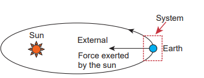
Earth orbits the Sun due to gravitational attraction of the Sun. If we consider Earth as a system, then Sun’s gravitational force is an external force. If we take the Moon into account, it also exerts an external force on Earth.

**b) (Earth + Sun) as a system** In this case, there are two internal forces which form an action and reaction pair- the gravitational force exerted by the Sun on Earth and gravitational force exerted by the Earth on the Sun.

Sun Internal forceInternal force

exerted by the sunexerted by the earth Earth

System
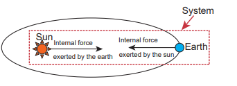

**c) Our body as a system** While walking, we exert a force on the Earth and Earth exerts an equal and opposite force on our body. If our body alone is considered as a system, then

the force exerted by the Earth on our body is external.
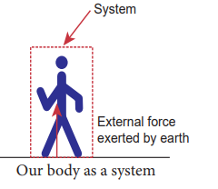

**d) (Our body + Earth) as a system** In this case, there are two internal forces present in the system. One is the force exerted by our body on the Earth and the other is the equal and opposite force exerted by the Earth on our body.
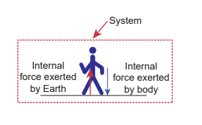
Our body + Earth as a system

Meaning of law of conservation of momentum

1) The Law of conservation of linear momentum is a vector law. It implies that both the magnitude and direction of total linear momentum are constant. In some cases, this total momentum can also be zero.

2) To analyse the motion of a particle, we can either use Newton’s second law or the law of conservation of linear momentum. Newton’s second law requires us to specify  

the forces involved in the process. This is difficult to specify in real situations. But conservation of linear momentum does not require any force involved in the process. It is covenient and hence important.

For example, when two particles collide, the forces exerted by these two particles on each other is difficult to specify. But it is easier to apply conservation of linear momentum during the collision process.

**Examples** • Consider the firing of a gun. Here the system is Gun+bullet. Initially the gun and bullet are at rest, hence the total linear momentum of the system is zero. Let

 _p_1

be the momentum of the bullet and  _p_2 the

momentum of the gun before firing. Since initially both are at rest,

Accelerating force on the bullet

Recoil force on the gun M

m v

 _p_1 0 ,

 _p_2 0 .

Total momentum before firing the gun is zero,

  _p p_1 2 0.

According to the law of conservation of linear momentum, total linear momemtum has to be zero after the firing also.

When the gun is fired, a force is exerted by the gun on the bullet in forward direction. Now the momentum of the bullet changes from

  _p p_1 1 to . To conserve

the total linear momentum of the system, the momentum of the gun must also change from

  _p p_2 2to ′ . Due to the conservation of

linear momentum,   _p p_1 2 0. It implies

that   _p p_1 2

, the momentum of the gun is exactly equal, but in the opposite direction to the momentum of the bullet. This is the reason after firing, the gun suddenly moves backward with the momentum

 _p_2

’ . It is called ‘recoil momemtum’. This is an example of conservation of total linear momentum.

• Consider two particles. One is at rest and the other moves towards the first particle (which is at rest). They collide and after collison move in some arbitrary directions. In this case, before collision, the total linear momentum of the system is equal to the initial linear momentum of the moving particle. According to conservation of momentum, the total linear momentum  

after collision also has to be in the forward direction. The following figure explains this.

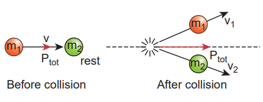
A more accurate calculation is covered in section 4.4. It is to be noted that the total momentum vector before and after collison points in the same direction. This simply means that the total linear momentum is constant before and after the collision. At the time of collision, each particle exerts a force on the other. As the two particles are considered as a system, these forces are only internal, and the total linear momentum cannot be altered by internal forces.

## Impulse

_If a very large force acts on an object for a very short duration, then the force is called impulsive force or impulse._

If a force (F) acts on the object in a very short interval of time (D_t_), from Newton’s second law in magnitude form

_Fdt dp_\=

Integrating over time from an initial time _ti_ to a final time t _f_ , we get

 _f_

_i_

_dp_ =  _f_

_i_

_t_

_t_

_F dt_

_p p F dtf i t_

_t_

_i_

_f_

  

_p ti i_\= initial momentum of the object at time

_p tf f_\= final momentum of the object at time

  

_p p pf i_   change in momentum of the object during the time interval _t t tf i_   .

The integral _t_

_t_

_i_

_f_

_F dt J_  is called the impulse

and it is equal to change in momentum of the object.

If the force is constant over the time interval, then

_t_

_t_

_t_

_t_

_f i_

_i_

_f_

_i_

_f_

_F dt F dt F t t_     = _F t_

_F t p_  (3.24)

Equation (3.24) is called the ‘impulse- momentum equation’.

For a constant force, the impulse is denoted as _J F t_  and it is also equal to change in momentum (_p_) of the object over the time interval _t_.

Impulse is a vector quantity and its unit is Ns.

The average force acted on the object over the short interval of time is defined by

_F p tavg_ 

 

(3.25)

From equation (3.25), the average force that act on the object is greater if _t_ is smaller. Whenever the momentum of the body changes very quickly, the average force becomes larger.

The impulse can also be written in terms of the average force. Since _p_ is change in momentum of the object and is equal to impulse (J), we have  

_J F tavg_  (3.26)

The graphical representation of constant force impulse and variable force impulse is given in Figure 3.21.

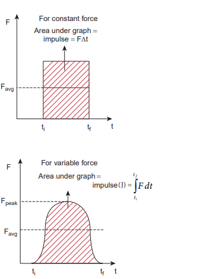
**Figure 3.21** Constant force impulse and variable force impulse

ti

Favg

Area under graph = impulse = F∆t

For constant forceF

Illustration

1\. When a cricket player catches the ball, he pulls his hands gradually in the direction of the ball’s motion. Why?

If he stops his hands soon after catching the ball, the ball comes to rest very quickly. It means that the momentum of the ball is brought to rest very quickly. So the average force acting

on the body will be very large. Due to this large average force, the hands will get hurt. To avoid getting hurt, the player brings the ball to rest slowly.
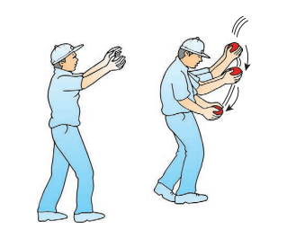

2\. When a car meets with an accident, its momentum reduces drastically in a very short time. This is very dangerous for the passengers inside the car since they will experience a large force. To prevent this fatal shock, cars are designed with air bags in such a way that when the car meets with an accident, the momentum of the passengers will reduce slowly so that the average force acting on them will be s

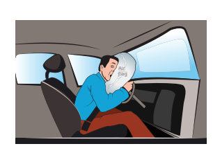maller.

3\. The shock absorbers in two wheelers play the same role as airbags in the car. When  

there is a bump on the road, a sudden force is transferred to the vehicle. The shock absorber prolongs the period of transfer of force on to the body of the rider. Vehicles without shock absorbers will harm the body due to this reason.

4\. Jumping on a concrete cemented floor is more dangerous than jumping on the sand. Sand brings the body to rest slowly than the concrete floor, so that the average force experienced by the body will be lesser.
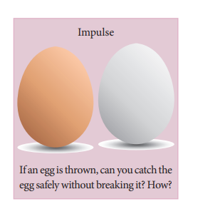

**EXAMPLE 3.16**

An object of mass 10 kg moving with a speed of 15 _m s_−1 hits the wall and comes to rest within

a) 0.03 second 

b) 10 second

Calculate the impulse and average force acting on the object in both the cases.

**_Solution_**

Initial momentum of the object _pi_ \=10 × 15 =150 _k gm s_−1

Final momentum of the object _pf_ \= 0

D_p kg ms_\= - = -150 0 150 1

(a) Impulse _J p N s_\= =D 150 .

(b) Impulse _J p N s_\= =D 150

(a) Average force _F p tavg_ 

 

\= 150 0 03

5000 .

\= _N_

(b) Average force _F Navg_ \= = 150 10

15

We see that, impulse is the same in both cases, but the average force is different.

## FRICTION

### Introduction

If a very gentle force in the horizontal direction is given to an object at rest on the table, it does not move. It is because of the opposing force exerted by the surface on the object which resists its motion. This force is called the _frictional force which always opposes the relative motion between an object and the surface where it is placed._ If the force applied is increased, the object moves after a certain limit.

_Relative motion_: when a force parallel to the surface is applied on the object, the force tries to move the object with respect to the surface. This ‘relative motion’ is opposed  

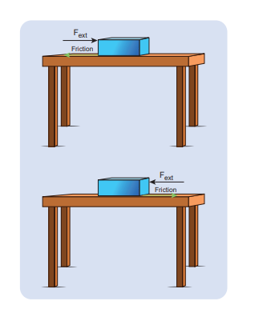
by the surface by exerting a frictional force on the object in a direction opposite to applied force. Frictional force always acts on the object parallel to the surface on which the object is placed. There are two kinds of friction namely 1) Static friction and 2) Kinetic friction.

## Static Friction ()

Static friction is the force which opposes the initiation of motion of an object on the surface. When the object is at rest on the surface, only two forces act on it. They are the downward gravitational force and upward normal force. The resultant of these two forces on the object is zero. As a result the object is at rest as shown in Figure 3.23.

If some external force _Fext_ is applied on the object parallel to the surface on which the object is at rest, the surface exerts

| Calculate t he im pulse a nd a verage f orce acting on the object in both the cases.SolutionInitial m omentum o f t he o bject p =10 × 15 =150 k gm sFinal momentum of the object  p =−1i Dpk=-150 0 = 150 gm sf(a)  Impulse Jp==D 150 Ns .-1(b)  Impulse Jp==D 150 Nsp 150(a)  Average force F  = = 5000 Nt 00. 3150(b)  Average force  FN = = 1510avgWe s ee t hat, im pulse i s t he s ame in b oth cases, but the averagave fg orce is dierent. |
|------|

  

exactly an equal and opposite force on the object to resist its motion and tries to keep the object at rest. It implies that external force and frictional force are exactly equal and opposite. Therefore, no motion parallel to the surface takes place. But if the external force is increased above a particular limit, the surface cannot provide sufficient opposing frictional force to balance the external force on the object. Then the object starts to slide. This is the maximal static friction that can be exerted by the surface. Experimentally, it is found that the magnitude of static frictional force _fs satisfies the following empirical_ relation.

0  _f Ns s_ , (3.27)

where µs is the coefficient of static friction. It depends on the nature of the surfaces in contact. N is normal force exerted by the surface on the body and sometimes it is equal to mg. But it need not be equal to _mg_ always.

Equation (3.27) implies that the force of static friction can take any value from zero to _µ_s_N._

If the object is at rest and no external force is applied on the object, the static friction acting on the object is zero ( _fs_ \= 0).

If the object is at rest, and there is an external force applied parallel to the surface, then the force of static friction acting on the object is exactly equal to the external force applied on the object ( _f Fs ext_\= ). But still the static friction _fs_ is less than _µ_s_N._

When object begins to slide, the static friction ( _fs_) acting on the object attains maximum,  

The static and kinetic frictions (which we discuss later) depend on the normal force acting on the object. If the object is pressed hard on the surface then the normal force acting on the object will increase. As a consequence it is more difficult to move the object. This is shown in Figure 3.23 (a) and (b). The static friction does not depend upon the area of contact.

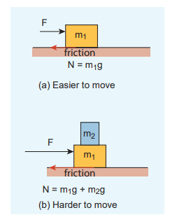

**Fig 3.23** Static friction and kinetic friction (a) Easier to move (b) Harder to move

**EXAMPLE 3.17**

Consider an object of mass 2 kg resting on the floor. The coefficient of static friction between the object and the floor is s  0.8. What force must be applied on the object to move it?

**_Solution_**

Since the object is at rest, the gravitational force experienced by an object is balanced by normal force exerted by floor.

N = mg the maximum static frictional force _fs max_ \=

 _s sN mg_

_f Ns max_    0 8 2 9 8 15 68. . .

Therefore to move the object the external force should be greater than maximum static friction.

_F Next_ \> 15 68.

**EXAMPLE 3.18**

Consider an object of mass 50 kg at rest on the floor. A Force of 5 N is applied on the object but it does not move. What is the frictional force that acts on the object?

**_Solution_**

When the object is at rest, the external force and the static frictional force are equal and opposite.

The magnitudes of these two forces are equal, _f Fs ext_\=

Therefore, the static frictional force acting on the object is

_f Ns_ \= 5 .

The direction of this frictional force is opposite to the direction of F_ext_ .

**EXAMPLE 3.19**

Two bodies of masses 7 kg and 5 kg are connected by a light string passing over a smooth pulley at the edge of the table as shown in the figure. The coefficient of static friction between the surfaces (body and table) is 0.9. Will the mass m1 = 7 kg on the surface move? If not what value of  

m2 should be used so that mass 7 kg begins to slide on the table? **_Solution_**

As shown in the figure, there are four forces acting on the mass m1

a) Downward gravitational force along the negative y-axis (m1g)

b) Upward normal force along the positive y axis (N)

c) Tension force due to mass m2 along the positive x axis

d) Frictional force along the negative x axis

Since the mass m1 has no vertical motion, m1g = N
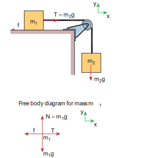
To determine whether the mass m1 moves on the surface, calculate the maximum static friction exerted by the table on the mass m1. If the tension on the mass m1 is equal to or greater than this maximum static friction, the object will move.

_f N m gs max_

_s s_   1

_f Ns max_ \= × × =0 9 7 9 8 61 74. . .
e m aximum static f rictional force f =Nm gmaxfN 0..829  81 56. 8 ssserefore to move the object the external forcemaxshould be gs reater than maximum static friction.FN > 15.68ext |

Consider an object of mass 50 kg at rest on the o or. A F orce o f 5 N i s a pplied o n t he object b ut i t do es n ot m ove. W hat i s t he frictional force that acts on the object?SolutionWhen t he o bject i s a t r est, t he ext ernal force a nd t he s tatic f rictional f orce a re equal and opposite. e m agnitudes o f t hese t wo f orces a re equal, fF =erefore, t he s tatic f rictional f orce acting on the object is se xtfN= 5.e dir ection o f t his f rictional f orce i s opposite to the direction of  F .sext |

The tension T _m g N_\= = × =2 5 9 8 49.

_T fs max_<

The tension acting on the mass m1 is less than the maximum static friction. So the mass m1 will not move.

To move the mass m1, _T fs max_\> where

T = m2g

_m m g g_

_ms s_2

1 1 

 

_m kg_2 0 9 7 6 3= × =. .

If the mass m2 is greater than 6.3 kg then the mass m1 will begin to slide. Note that if there is no friction on the surface, the mass m1 will move even when m2 is just 1 kg.

The values of coefficient of static friction for pairs of materials are presented in Table 3.1. Note that the ice and ice pair have very low coefficient of static friction. This means a block of ice can move easily over another block of ice.

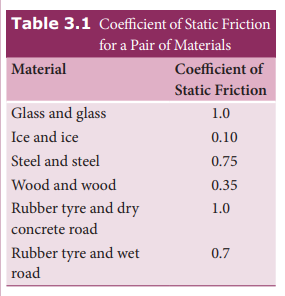

## Kinetic Friction

If the external force acting on the object is greater than maximum static friction, the objects begin to slide. When an object slides, the surface exerts a frictional force called **kinetic friction**



**_fk_ (**also called sliding friction or dynamic friction). To move an object at constant velocity we must apply a force which is equal in magnitude and opposite to the direction of kinetic friction.

**Figure 3.24** Kinetic friction

Experimentally it was found that the magnitude of kinetic friction satisfies the relation

_f Nk k_  (3.28)

where µk is the coefficient of kinetic friction and N the normal force exerted by the surface on the object,

and  _k s_

This implies that starting of a motion is more difficult than maintaining it. The salient features of static and kinetic friction are given in Table 3.2.

The variation of both static and kinetic frictional forces with external applied force is graphically shown in Figure 3.25.

**Figure 3.25** Variation of static and kinetic frictional forces with external applied force

---
**Note**
The relation _f Ns s_  is not a vector relation. This is because the normal force N

and _fs_ are not in the same direction even though _fs_ is equal to µ_s_ times the normal force. This is also true in the case of kinetic friction.

---

## To Move an Object - Push or pull? Which is easier?

When a body is pushed at an arbitrary angle θ

0 2

to   

  , the applied force _F_ can be resolved

into two components as F sin_θ_ parallel to the surface and F cos_θ_ perpendicular to the surface as shown in Figure 3.26. The total downward force acting on the body is mg _+_ Fcosθ_._ It implies that the normal force acting on the body increases. Since there is no acceleration along the vertical direction the normal force N is equal to

etic Friction Kinetic friction It opposes the relative motion of the object with respect to the surface Independent of surface area of contact _mk_ depends on nature of materials and temperature of the surface

Independent of magnitude of applied force

It can never be zero and always equals to _mkN_ whatever be the speed (true _v_ <10 ms-1) It is less than maximum value of static friction

Coefficient of kinetic friction is less than coefficient of static friction

| f   Nk k |
|------|------|

| f  Fs |ext |
  

_N mg Fcospush_    (3.29)

As a result the maximal static friction also increases and is equal to

_f N mg F coss max_

_s push s_      (3.30)

Equation (3.30) shows that a greater force needs to be applied to push the object into motion.

**Figure 3.26** An object is pushed at an angle θ

When an object is pulled at an angle θ, the applied force is resolved into two components as shown in Figure 3.27. The total downward force acting on the object is

Npull = _mg Fcos_  (3.31)

**Figure 3.27** An object is pulled at an angle θ

Equation (3.31) shows that the normal force is less than Npush. From equations (3.29) and (3.31), it is easier to pull an object than to push to make it move.

## Angle of Friction

The angle of friction is defined as the angle between the normal force (N) and the resultant force (R) of normal force and maximum friction force ( _

θ

**Figure 3.28** Angle of Friction

In Figure 3.28 the resultant force is

_R f Ns max_   2 2

tan  _f N s max_

(3.32)

But from the frictional relation, the object begins to slide when _f Ns_

_max s_ 

or when _f N s max_

_s_  (3.33)

From equations (3.32) and (3.33) the coefficient of static friction is

 _s tan_ (3.34)

**_The coefficient of static friction is equal to tangent of the angle of friction_**

### Angle of Repose

Consider an inclined plane on which an object is placed, as shown in Figure 3.29. Let the angle which this plane makes with the horizontal be θ . For small angles of θ , the object may not slide down. As θ is increased, for a particular value of θ , the object begins to slide down. This value is called angle of repose. Hence, the angle of repose is the angle of inclined plane with the horizontal such that an object placed on it begins to slide.

**Figure 3.29** Angle of repose

Let us consider the various forces in action here. The gravitational force mg is resolved into components parallel (_mg_ sinθ) and perpendicular (_mg_ cosθ) to the inclined plane.  

The component of force parallel to the inclined plane (mg sinθ) tries to move the object down.

The component of force perpendicular to the inclined plane (mg cosθ) is balanced by the Normal force (N).

N = mg cosθ

When the object just begins to move, the static friction attains its maximum value

_f f N mgs s max_

_s s_\= = =  cosθ (3.35)

This friction also satisfies the relation

_f mgs max_ \= sinθ (3.36)

Dividing equations (3.35) and (3.36), we get

  _s = sin cos_/

From the definition of angle of friction, we also know that

tan  _s_, (3.37)

in which θ is the angle of friction.

_Thus the angle of repose is the same as angle of friction. But the difference is that the_ angle of repose refers to inclined surfaces and the angle of friction is applicable to any type of surface**.**

**EXAMPLE 3.20**

A block of mass _m_ slides down the plane inclined at an angle 60° with an acceleration _g_ 2

. Find the coefficient of kinetic friction?

**_Solution_** Kinetic friction comes to play as the

block is moving on the surface.

The forces acting on the mass are the normal force perpendicular to surface, downward gravitational force and kinetic friction _fk_ along the surface.

Along the x-direction

_mg fk_sin  = ma

But a = g/2

_mg fk_sin60  = mg/2

– _fk_ = mg/2

_f mgk_   

 



 

3 2

1 2

_fK_  

 



 

3 1 2

mg

There is no motion along the y-direction as normal force is exactly balanced by the mg cosθ .

2 3 mg  

mg cosθ = N = mg/2

_fK_ \= _mK_ N = _mK_ mg/2

_K_

_mg_

_mg_ 



 



 

3 1 2

2

_K_  3 1

### Application of Angle of Repose

1\. Antlions make sand traps in such a way that when an insect enters the edge of the trap, it starts to slide towards the bottom where the antilon hide itself. The angle of inclination of sand trap is made to be equal to angle of repose. It is shown in the Figure 3.30.

**Figure 3.30** Sand trap of antlions

2\. Children are fond of playing on sliding board (Figure 3.31). Sliding will be easier

when the angle of inclination of the board is greater than the angle of repose. At the same time if inclination angle is much larger than the angle of repose, the slider will reach the bottom at greater speed and get hurt.

**Figure 3.31** Sliding board

---
**note**
At the point of sliding tanθ_s_ = _ms_

To measure the coefficient of kinetic friction, reduce the inclination of the book after it starts sliding, such that the coin/ eraser moves with uniform velocity. Now measure the angle from which coefficient of kinetic friction can be calculated as

_mK_ = tanθ_k_

Observe that  _K S_

---

### Rolling Friction

The invention of the wheel plays a crucial role in human civilization. One of the important applications is suitcases with rolling on coasters. Rolling wheels makes it easier than carrying luggage. When an object moves on a surface, essentially it is sliding on it. But wheels move on the surface through rolling motion. In rolling motion when a wheel moves on a surface, the point of contact with surface is always at rest. Since the point of contact is at rest, there is no relative motion between the wheel and surface. Hence the frictional force is very less. At the same time if an object moves

order to observe that the coefficient of static friction differs from case to case without a wheel, there is a relative motion between the object and the surface. As a result frictional force is larger. This makes it difficult to move the object. The Figure 3.32 shows the difference between rolling and kinetic friction.

**Figure 3.32** Rolling and kinetic friction

Ideally in pure rolling, motion of the point of contact with the surface should be at rest, but in practice it is not so. Due to the elastic nature of the surface at the point of contact there will be some deformation on the object at this point on the wheel or surface as shown in Figure 3.33. Due to this deformation, there will be minimal friction between wheel and surface. It is called ‘rolling friction’. In fact, ‘rolling friction’ is much smaller than kinetic friction.

**Figure 3.33** Rolling friction  

### Methods to Reduce Friction

Frictional force has both positive and negative effects. In some cases it is absolutely necessary. Walking is possible because of frictional force. Vehicles (bicycle, car) can move because of the frictional force between the tyre and the road. In the braking system, kinetic friction plays a major role. As we have already seen, the frictional force comes into effect whenever there is relative motion between two surfaces. In big machines used in industries, relative motion between different parts of the machine produce unwanted heat which reduces its efficiency. To reduce this kinetic friction lubricants are used as shown in Figure 3.34.

**Figure 3.34** Reducing kinetic friction using lubricant

Ball bearings provides another effective way to reduce the kinetic friction (Figure 3.35) in machines. If ball bearings are fixed between two surfaces, during the relative motion only the rolling friction comes to effect and not kinetic friction. As we have seen earlier, the rolling friction is much smaller than kinetic

friction; hence the machines are protected from wear and tear over the years.

**Figure 3.35** Reducing kinetic friction using ball bearing

During the time of Newton and Galileo, frictional force was considered as one of the natural forces like gravitational force. But

**Figure 3.36** Irregularities on the 
in the twentieth century, the understanding on atoms, electron and protons has changed the perspective. The frictional force is actually the electromagnetic force between the atoms on the two surfaces. Even well polished surfaces have irregularities on the surface at the microscopic level as seen in the Figure 3.36.

---
**Points to Ponder**

**When you walk on the tiled floor where water is spilled, you are likely to slip. Why?**

**Frictional force in the motion of a bicycle**
When a bicycle moves in the forward 
direction, what is the direction of frictional force in the rear and front wheels?Front wheel Rear wheel

When we pedal a bicycle, we try to push the surface backward and the velocity of point of contact in the rear wheel is backwards. So, the frictional force pushes 
the rear wheel to move forward. But as the front wheel is connected with a rigid support to the back wheel, the forward motion of back wheel pushes the front wheel in the forward direction. So, the frictional forces act backward. Remember both frictional forces correspond to only 
static friction and not kinetic friction. If the wheel slips then kinetic friction comes 
into effect. In addition to static friction, the rolling friction also acts on both wheels in the backward direction

**EXAMPLE 3.21**

Consider an object moving on a horizontal surface with a constant velocity. Some external force is applied on the object to keep the object moving with a constant velocity. What is the net force acting on the object?

 
**_Solution_**

If an object moves with constant velocity, then it has no acceleration. According to Newton’s second law there is no net force acting on the object. The external force is balanced by the kinetic friction.

---
**Note**

It is not that ‘no force acts on the object’. In fact there are two forces acting on the object. Only the net force acting on the object is zero.

---

# DYNAMICS OF CIRCULAR MOTION

In the previous sections we have studied how to analyse linear motion using Newton’s laws. It is also important to know how to apply Newton’s laws to circular motion, since circular motion is one of the very common types of motion that we come across in our daily life. A particle can be in linear motion with or without any external force. But when circular motion occurs there must necessarily be some force acting on the object. There is no Newton’s first law for circular motion. In other words without a force, circular motion cannot occur in nature. A force can change the velocity of a particle in three different ways.

1\. The magnitude of the velocity can be changed without changing the direction of the velocity. In this case the particle will move in the same direction but with acceleration.

Frictional force in the motion of a bicycleWhen a b icycle m oves in t he f orwarddirection, what is the direction of frictionalforce in the rear and front wheels?Front wheel Rear wheelNRN mg N mgF R

When we p edal a b icycle, we try to pushthe s urface b f ackward a nd t fhe v elocityF Rof p oint o f co ntact in t he r ear w heel i sbackwards. So, the frictional force pushesthe  rear w heel  to  move f orward. B ut  asthe f ront w heel is connected with a r igidsupport t o t he b ack w heel, t he f orwardmotion o f b ack w heel p ushes t he f rontwheel in t he f orward dir ection. S o, t hefrictional forces act backward. Rememberboth f rictional forces correspond t o onlystatic  friction  and  not  kinetic  friction.  Ifthe wheel slips then kinetic friction comesinto e ect. I n addi tion t o s tatic f riction,the r olling f riction a lso ac ts o n b othwheels in the backward direction. |
  

**Examples** Particle falling down vertically,

bike moving in a straight road with acceleration.

2\. The direction of motion alone can be changed without changing the magnitude (speed). If this happens continuously then we call it ‘uniform circular motion’.

3\. Both the direction and magnitude (speed) of velocity can be changed. If this happens non circular motion occurs. For example oscillation of a swing or simple pendulum, elliptical motion of planets around the Sun.

In this section we will deal with uniform circular motion and non-uniform circular motion.

### Centripetal force

If a particle is in uniform circular motion, there must be centripetal acceleration towards the centre of the circle. If there is acceleration then there must be some force acting on it with respect to an inertial frame. This force is called centripetal force.

As we have seen in chapter 2, the centripetal acceleration of a particle in the

circular motion is given by _a v r_

\= 2

and it acts

towards centre of the circle. According to Newton’s second law, the centripetal force is given by

_F ma mv rcp cp_\= =

2

The word Centripetal force means centre seeking force.

In vector notation 2

ˆ_cp mvF r_

_r_  

  

For uniform circular motion 2 ˆ_cpF m r r_  

The direction –r̂ points towards the centre of the circle which is the direction of centripetal force as shown in Figure 3.38.

**Figure 3.38** Centripetal force

It should be noted that ‘centripetal force’ is not other forces like gravitational force or spring force. It can be said as ‘force towards centre’. The origin of the centripetal force can be gravitational force, tension in the string, frictional force, Coulomb force etc. Any of these forces can act as a centripetal force.

1\. In the case of whirling motion of a stone tied to a string, the centripetal force on the particle is provided by the tensional force on the string. In circular motion in an amusement park, the centripetal force is provided by the tension in the iron ropes.

2\. In motion of satellites around the Earth, the centripetal force is given by Earth’s gravitational force on the satellites. Newton’s second law for satellite motion is

_F mv r_

 earth s gravitational force 2

Where _r_\- distance of the planet from the centre of the Earth.

**Figure 3.39** Whirling motion of objects  

m-mass of the satellite v-speed of the satellite

3\. When a car is moving on a circular track the centripetal force is given by the frictional force between the road and the tyres.

**Figure 3.40** Car in the circular track

_F_

Newton’s second law for this case is

Frictional force = _mv r_

2

m-mass of the car v-speed of the car r-radius of curvature of track

Even when the car moves on a curved track, the car experiences the centripetal force which is provided by frictional force between the surface and the tyre of the car. This is shown in the Figure 3.41.

**Figure 3.41** Centripetal force due to frictional force between the road and tyre

4\. When the planets orbit around the Sun, they experience centripetal force towards the centre of the Sun. Here gravitational force of the Sun acts as centripetal force on the planets as shown in Figure 3.42

**Figure 3.42** Centripetal force on the orbiting planet due Sun’s gravity
Newton’s second law for this motion Gravitational force of Sun on the

planet = _mv r_2

**EXAMPLE 3.22**

If a stone of mass 0.25 kg tied to a string executes uniform circular motion with a speed of 2 m s-1 of radius 3 m, what is the magnitude of tensional force acting on the stone?

**_Solution:_** _Fcp_ \= _mv r_

2

_F_ ×

_cp_ \= ( )1

4 2

3

2

\= 0.333 N.

**EXAMPLE 3.23**

The Moon orbits the Earth once in 27.3 days in an almost circular orbit. Calculate the centripetal acceleration experienced by the Moon? (Radius of the Earth is 6.4 × 106 m)

**_Solution_** The centripetal acceleration is given by

_a v r_

\= 2

. This expression explicitly depends

on Moon’s speed which is non trivial. We can work with the formula

2_R am m_

_am_ is centripetal acceleration of the Moon due to Earth’s gravity.

ω is angular velocity.

_Rm_ is the distance between Earth and the Moon, which is 60 times the radius of the Earth.  

_R R mm_      60 60 6 4 10 384 106 6.

As we know the angular velocity   

2 _T_

and T = 27.3 days = 27.3 × 24 × 60 × 60

second = 2.358 × 106 sec By substituting these values in the formula for acceleration

_am_     

  

4 384 10

2 358 10

2 6

6 2



. 0.00272 m s-2

The centripetal acceleration of Moon towards the Earth is 0.00272 m s-2

---
**Note**

This result was calculated by Newton himself. In unit 6 we will use this result.

---

## Vehicle on a leveled circular road

When a vehicle travels in a curved path, there must be a centripetal force acting on it. This centripetal force is provided by the frictional force between tyre and surface of the road. Consider a vehicle of mass ‘m’ moving at a speed ‘v’ in the circular track of radius ‘r’. There are three forces acting on the vehicle when it moves as shown in the Figure 3.43

1\. Gravitational force (mg) acting downwards

2\. Normal force (N) acting upwards 3. Frictional force (Fs) acting horizontally inwards along the road

Suppose the road is horizontal then the normal force and gravitational force are exactly equal and opposite. The centripetal force is provided by the force of static friction Fs between the tyre and surface of the road which acts towards the centre of the circular track,

_mv r_

_Fs_

2

\=

As we have already seen in the previous section, the static friction can increase from zero to a maximum value

_F mgs s_  .

There are two conditions possible:

a) If _mv r_

_mgs_

2

  , or _s v rg_

 2

or _srg v_

(Safe turn)

The static friction would be able to provide necessary centripetal force to bend the

mg

N

straight road

**Figure 3.43** Forces acting on the vehicle  car on the road. So the coefficient of static friction between the tyre and the surface of the road determines what maximum speed the car can have for safe turn.

b) If _mv r_

_mgs_

2

  , or _s v rg_

 2

(skid)

If the static friction is not able to provide enough centripetal force to turn, the vehicle will start to skid.

**EXAMPLE 3.24**

Consider a circular leveled road of radius 10 m having coefficient of static friction 0.81. Three cars (A, B and C) are travelling with speed 7 m s-1, 8 m s-1 and 10 ms-1 respectively. Which car will skid when it moves in the circular level road? (g =10 m s-2)

**_Solution_**

From the safe turn condition the speed of the vehicle (_v_) must be less than or equal to _srg v_

mg

N

Fs

curved road

on a leveled circular road

| mg |Fsmg |
|------|------|
| Figure 3.43 Forces acting on the vehicle on a leveled circular road |

|------|

|  rg  vs |
  

_v rgs_ 

_v rgs_  = 0 81 10 10 9 1.    _ms_

For Car C, _v rgs_  is less than _v_

The speed of car A, B and C are 7 m s-1, 8 m s-1 and 10 m s-1 respectively. The cars A and B will have safe turns. But the car C has speed 10 m s-1 while it turns which exceeds the safe turning speed. Hence, the car C will skid.

### Banking of Tracks

In a leveled circular road, skidding mainly depends on the coefficient of static friction _ms The coefficient of static friction depends_ on the nature of the surface which has a maximum limiting value. To avoid this problem, usually the outer edge of the road is slightly raised compared to inner edge as shown in the Figure 3.44. This is called banking of roads or tracks. This introduces an inclination, and the angle is called banking angle.

**Figure 3.44** Outer edge of the road is slightly raised to avoid skidding  

Let the surface of the road make angle θ with horizontal surface. Then the normal force makes the same angle θ with the vertical. When the car takes a turn, there are two forces acting on the car:

a) Gravitational force mg (downwards)

b) Normal force N (perpendicular to surface)

We can resolve the normal force into two components. _N_ cosθ and _N_ sinθ as shown in Figure 3.46. The component N cosθ balances the downward gravitational force ‘mg’ and component _N_ sinθ will provide the necessary centripetal acceleration. By using Newton second law

_N_ cosθ = _mg_

_N_ sinθ = _mv r_

2

By dividing the equations we get tan  _v rg_

2

_v rg_ tan

The banking angle θ and radius of curvature of the road or track determines the safe speed of the car at the turning. If the speed of car exceeds this safe speed, then it starts to skid outward but frictional force comes into effect and provides an additional centripetal force to prevent the outward skidding. At the same time, if the speed of the car is little lesser than safe speed, it starts to skid inward and frictional force comes into effect, which reduces centripetal force to prevent inward skidding. However if the speed of the vehicle is sufficiently greater than the correct speed, then frictional force cannot stop the car from skidding.

**EXAMPLE 3.25**

Consider a circular road of radius 20 meter banked at an angle of 15 degree. With what speed a car has to move on the turn so that it will have safe turn?

**_Solution_**

_v rg_  tan = 20 9 8 15  . tan

\= 20 9 8 0 26 7 1  . . . m s-1

The safe speed for the car on this road is 7.1 m s-1

### Centrifugal Force

Circular motion can be analysed from two different frames of reference. One is the inertial frame (which is either at rest or in uniform motion) where Newton’s laws are obeyed. The other is the rotating frame of reference which is a non-inertial frame of reference as it is accelerating. When we examine the circular motion from these frames of reference the situations are entirely different. To use Newton’s first and second laws in the rotational frame of reference, we need to include a pseudo force called ‘centrifugal force’. This ‘centrifugal force’ appears to act on the object with respect to rotating frames. To understand the concept of centrifugal force, we can take a specific case and discuss as done below.

Consider the case of a whirling motion of a stone tied to a string. Assume that the stone has angular velocity ω in the inertial frame (at rest). If the motion of the stone is observed from a frame which is also rotating along with the stone with same angular velocity ω then, the stone appears to be at rest. This implies that in addition to the  

inward centripetal force _m r_2 there must be an equal and opposite force that acts on the stone outward with value +_m r_2 . So the total force acting on the stone in a rotating frame is equal to zero ( _m r m r_ 2 2 = 0). This outward force +m _r_ω2 is called the centrifugal force. The word ‘centrifugal’ means ‘flee from centre’. Note that the ‘centrifugal force’ appears to act on the particle, only when we analyse the motion from a rotating frame. With respect to an inertial frame there is only centripetal force which is given by the tension in the string. For this reason centrifugal force is called as a ‘pseudo force’. A pseudo force has no origin. It arises due to the non inertial nature of the frame considered. When circular motion problems are solved from a rotating frame of reference, while drawing free body diagram of a particle, the centrifugal force should necessarily be included as shown in the Figure 3.45.

### Effects of Centrifugal Force

Although centrifugal force is a pseudo force, its effects are real. When a car takes a turn in a curved road, person inside the car feels an outward force which pushes the person away. This outward force is also called centrifugal force. If there is sufficient friction between the person and the seat, it will prevent the person from moving outwards. When a car moving in a straight line suddenly takes a turn, the objects not fixed to the car try to continue in linear motion due to their inertia of direction. While observing this motion from an inertial frame, it appears as a straight line as shown in Figure 3.46. But, when it is observed from the rotating frame it appears to move outwards.

**Figure 3.45** Free body diagram of a particle including the centrifugal force

**Figure 3.46** Effects of centrifugal force 

A person standing on a rotating platform feels an outward centrifugal force and is likely to be pushed away from the platform. Many a time the frictional force between the platform and the person is not sufficient to overcome outward push. To avoid this, usually the outer edge of the platform is little inclined upwards which exerts a normal force on the person which prevents the person from falling as illustrated in Figures 3.47.

---
**Caution!**

It is dangerous to stand near the open door (or) steps while travelling in the bus. When the bus takes a sudden turn in a curved road, due to centrifugal force the person is pushed away from the bus. Even though centrifugal force is a pseudo force, its effects are real.

---

**Figure 3.47**  Outward centrifugal force in rotating platform

## Centrifugal Force due to Rotation of the Earth

Even though Earth is treated as an inertial frame, it is actually not so. Earth spins about its own axis with an angular velocity ω. Any object on the surface of Earth (rotational frame) experiences a centrifugal force. The centrifugal force appears to act exactly in opposite direction from the axis of rotation. It is shown in the Figure 3.48.

The centrifugal force on a man standing on the surface of the Earth is _F m rcf_ \= w2

where r is perpendicular distance of the man from the axis of rotation. By using right angle triangle as shown in the Figure 3.48, the distance r R= cos θ

**Figure 3. 48** Centrifugal force 
acting on a man on the surface of 
Earth

**EXAMPLE 3.26**

Calculate the centrifugal force experienced by a man of 60 kg standing at Chennai? (Given: Latitude of Chennai is 13°

**_Solution_** The centrifugal force is given by

_F m Rc_   2 cos

The angular velocity (ω) of Earth = 2 _T_ 

,

where T is time period of the Earth (24 hours)

   

  

   

2 24 60 60

2 86400

7 268 10 5 1. _radsec_

The radius of the Earth R = 6400 Km = 6400 × 103 m  

Latitude of Chennai = 13°

_F_

_N cf_      

   

60 7 268 10 6400 10

13 1 9678

5 2 3.

cos .

A 60 kg man experiences centrifugal force of approximately 2 Newton. But due to Earth’s gravity a man of 60 kg experiences a force = mg = 60 × 9.8 = 588N. This force is very much larger than the centrifugal force.

## Centripetal Force Versus Centrifugal Force

Salient features of centripetal and centrifugal forces are compared in Table 3.4.

