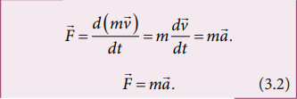

**UNIT 3**
**LAWS OF MOTION**

*“In the beginning there was a mechanics”* – Von Laue

**Learning Objectives**

<table style="background-color: #FF9999">
<colgroup>
<col style="width: 100%" />
</colgroup>
<thead>
<tr class="header">
<th><blockquote>

<strong>In this unit, the student is exposed to</strong>

</blockquote>
<ul>

<li>
Newton’s laws
</li>
<li>
logical connection between laws of Newton
</li>
<li>
free body diagram and related problems
</li>
<li>
law of conservation of momentum
</li>
<li>
role of frictional forces
</li>
<li>
centripetal and centrifugal forces
</li>
<li>
origin of centrifugal force
</li>
</ul></th>
</tr>
</thead>
<tbody>
</tbody>
</table>

>
> **3.1**
> **INTRODUCTION**

  

Each and every object in the universe interacts 
with every other object. The cool breeze 
interacts with the tree. The tree interacts with 
the Earth. In fact, all species interact with 
nature. But, what is the difference between 
a human’s interaction with nature and that 
of an animal’s. Human’s interaction has 
one extra quality. We not only interact with 
nature but also try to understand and explain 
natural phenomena scientifically. 

&nbsp; &nbsp; In the history of mankind, the most 
curiosity driven scientific question asked was 
about motion of objects–‘How things move?’ 
and ‘Why things move?’ Surprisingly, these 
simple questions have paved the way for 
development from early civilization to the 
modern technological era of the 21st century.

  

  

 &nbsp; &nbsp; Objects move because something pushes 
or pulls them. For example, if a book is at rest, 
it will not move unless a force is applied on 
it. In other words, to move an object a force 
must be applied on it. About 2500 years ago, 
the famous philosopher, Aristotle, said that 
‘Force causes motion’. This statement is based 
on common sense. But any scientific answer 
cannot be based on common sense. It must 
be endorsed with quantitative experimental 
proof. 

&nbsp; &nbsp; In the 15th century, Galileo challenged 
Aristotle’s idea by doing a series of 
experiments. He said force is not required 
to maintain motion.

&nbsp; &nbsp; Galileo demonstrated his own idea using 
the following simple experiment. When a 
ball rolls from the top of an inclined plane 
to its bottom, after reaching the ground 
it moves some distance and continues

  

 
 
                                                    <!--page 105 -->

  

to move on to another inclined plane of 
same angle of inclination as shown in the 
Figure 3.1(a). By increasing the smoothness 
of both the inclined planes, the ball reach 
almost the same height(h) from where it 
was released (L1) in the second plane (L2) 
(Figure 3.1(b)). The motion of the ball 
is then observed by varying the angle of 
inclination of the second plane keeping the 
same smoothness. If the angle of inclination 
is reduced, the ball travels longer distance in 
the second plane to reach the same height 
(Figure 3.1 (c)). When the angle of inclination 
is made zero, the ball moves forever in the 
horizontal direction (Figure 3.1(d)). If the 
Aristotelian idea were true, the ball would 
not have moved in the second plane even if 
its smoothness is made maximum since no

<b>Figure 3.1</b> Galileo’s experiment with the 
second plane (a) at same inclination angle 
as the first (b) with increased smoothness 
(c) with reduced angle of inclination 
(d) with zero angle of inclination

  

  

  

  force acted on it in the horizontal direction. 
From this simple experiment, Galileo 
proved that force is not required to maintain 
motion. An object can be in motion even 
without a force acting on it.

&nbsp; &nbsp;In essence, Aristotle coupled the motion 
with force while Galileo decoupled the 
motion and force.

 
 

<b>3.2
 
NEWTON’S LAWS
</b>
 
Newton analysed the views of Galileo, and 
other scientist like Kepler and Copernicus 
on motion and provided much deeper 
insights in the form of three laws.

<b>3.2.1   Newton’s First Law
</b>
 
<b><i>Every object continues to be in the state 
of rest or of uniform motion (constant 
velocity) unless there is external force acting 
on it.
</b></i>
 
&nbsp; &nbsp; This inability of objects to move on its 
own or change its state of motion is called 
inertia. Inertia means resistance to change 
its state. Depending on the circumstances, 
there can be three types of inertia.

1. <b>Inertia of rest:</b> When a stationary bus 
starts to move, the passengers experience 
a sudden backward push. Due to inertia, 
the body (of a passenger) will try to 

  

 
 
                                            <!--page 106 -->

  

 
<b>Figure 3.2</b> Passengers experience a 
backward push due to inertia of rest

continue in the state of rest, while the 
bus moves forward. This appears as a 
backward push as shown in Figure 3.2.<i> 
The inability of an object to change its 
state of rest is called inertia of rest.</i>

2.<b> Inertia of motion:</b> When the bus is 
in motion, and if the brake is applied 
suddenly, passengers move forward 
and hit against the front seat. In this 
case, the bus comes to a stop, while the 
body (of a passenger) continues to move 
forward due to the property of inertia 
as shown in Figure 3.3.<i> The inability of 
an object to change its state of uniform 
speed (constant speed) on its own is called
inertia of motion.</i>

3.<b> Inertia of direction:</b> When a stone 
attached to a string is in whirling

<b>Figure 3.3</b> Passengers experience a 
forward push due to inertia of motion 

  

  

motion, and if the string is cut suddenly, 
the stone will not continue to move in 
circular motion but moves tangential 
to the circle as illustrated in Figure 3.4. 
This is because the body cannot change 
its direction of motion without any force 
acting on it.<i> The inability of an object to 
change its direction of motion on its own 
is called inertia of direction.</i> 

When we say that an object is at rest or 
in motion with constant velocity, it has a 
meaning only if it is specified with respect to 
some reference frames. In physics, any motion 
has to be stated with respect to a reference 
frame. It is to be noted that Newton’s first law is 
valid only in certain special reference frames 
called inertial frames. In fact, Newton’s first 
law defines an inertial frame.

 

 

 
<b>Figure 3.4</b> A stone moves tangential to 
circle due to inertia of direction

  

 
 
                                        <!--page 107 -->

  

<b><i>Inertial Frames</b></i>

If an object is free from all forces, then it 
moves with constant velocity or remains at 
rest when seen from inertial frames. Thus, 
there exists some special set of frames in 
which, if an object experiences no force, it 
moves with constant velocity or remains at 
rest. But how do we know whether an object 
is experiencing a force or not? All the objects 
in the Earth experience Earth’s gravitational 
force. In the ideal case, if an object is in deep 
space (very far away from any other object), 
then Newton’s first law will be certainly valid. 
Such deep space can be treated as an inertial 
frame. But practically it is not possible to reach 
such deep space and verify Newton’s first law.

&nbsp; &nbsp; For all practical purposes, we can treat 
Earth as an inertial frame because an object on 
the table in the laboratory appears to be at rest 
always. This object never picks up acceleration 
in the horizontal direction since no force 
acts on it in the horizontal direction. So the 
laboratory can be taken as an inertial frame for 
all physics experiments and calculations. For 
making these conclusions, we analyse only the 
horizontal motion of the object as there is no 
horizontal force that acts on it. We should not 
analyse the motion in vertical direction as the 
two forces (gravitational force in the downward 
direction and normal force in upward 
direction) that act on it makes the net force is 
zero in vertical direction. Newton’s first law 
deals with the motion of objects in the absence 
of any force and not the motion under zero net 
force. Suppose a train is moving with constant 
velocity with respect to an inertial frame, then 
an object at rest in the inertial frame (outside 
the train) appears to move with constant 
velocity with respect to the train (viewed from 
within the train). So the train can be treated as 
an inertial frame. All inertial frames are moving

  

  

with constant velocity relative to each other. If 
an object appears to be at rest in one inertial 
frame, it may appear to move with constant 
velocity with respect to another inertial frame. 
For example, in Figure 3.5, the car is moving 
with uniform velocity v with respect to a person 
standing (at rest) on the ground. As the car is 
moving with constant velocity with respect to 
the person at rest on the ground, both frames 
(with respect to the car and to the ground) are 
inertial frames.

 

<b>Figure 3.5</b> The person and 
vehicle are inertial frames

&nbsp; &nbsp; Suppose an object remains at rest on a 
smooth table kept inside the train, and if the 
train suddenly accelerates (which we may 
not sense), the object appears to accelerate 
backwards even without any force acting on 
it. It is a clear violation of Newton’s first law 
as the object gets accelerated without being 
acted upon by a force. It implies that the train 
is not an inertial frame when it is accelerated. 
For example, Figure 3.6 shows that car 2 is 
a non-inertial frame since it moves with 
acceleration 
a with respect to the ground.

 

<b>Figure 3.6</b> Car 2 is a non-inertial 
frame

  

 
 
                                        <!--page 108 -->     

  

These kinds of accelerated frames are called 
non-inertial frames. A rotating frame is also 
a non inertial frame since rotation requires 
acceleration. In this sense, Earth is not really 
an inertial frame since it has self-rotation 
and orbital motion. But these rotational 
effects of Earth can be ignored for the motion 
involved in our day-to-day life. For example, 
when an object is thrown, or the time 
period of a simple pendulum is measured 
in the physics laboratory, the Earth’s selfrotation has very negligible effect on it. In 
this sense, Earth can be treated as an inertial 
frame. But at the same time, to analyse 
the motion of satellites and wind patterns 
around the Earth, we cannot treat Earth as 
an inertial frame since its self-rotation has 
a strong influence on wind patterns and 
satellite motion.

<b>3.2.2  Newton’s Second Law</b>
 
This law states that

<i>The force acting on an object is equal to 
the rate of change of its momentum</i>

In simple words, whenever the momentum 
of the body changes, there must be a force 
acting on it. The momentum of the object is 
defined as   p m= v. In most cases, the mass 
of the object remains constant during the 
motion. In such cases, the above equation 
gets modified into a simpler form

  

  

The above equation conveys the fact that 
if there is an acceleration 
a on the body, 
then there must be a force acting on it. This 
implies that if there is a change in velocity, 
then there must be a force acting on the 
body. The force and acceleration are always 
in the same direction. Newton’s second law 
was a paradigm shift from Aristotle’s idea 
of motion. According to Newton, the force 
need not cause the motion but only a change 
in motion. It is to be noted that <i>Newton’s 
second law is valid only in inertial frames. </i>
In non-inertial frames Newton’s second law 
cannot be used in this form. It requires some 
modification.

&nbsp; &nbsp; In the SI system of units, the unit of force 
is measured in newtons and it is denoted by 
symbol ‘N’

<i>One Newton is defined as the force which 
acts on 1 kg of mass to give an acceleration 
1 ms -2 in the direction of the force.</i>

<b>Aristotle vs. Newton’s approach on 
sliding object</b>

Newton’s second law gives the correct 
explanation for the experiment on the 
inclined plane that was discussed in 
section 3.1. In normal cases, where friction 
is not negligible, once the object reaches the 
bottom of the inclined plane (Figure 3.1), 
it travels some distance and stops. Note 
that it stops because there is a frictional 
force acting in the direction opposite to 
its velocity. It is this frictional force that 
reduces the velocity of the object to zero and 
brings it to rest. As per Aristotle’s idea, as 
soon as the body reaches the bottom of the 
plane, it can travel only a small distance and 
stops because there is no force acting on the 
object. Essentially, he did not consider the 
frictional force acting on the object.

  

 
 
                                        <!--page 109 -->                                   

  

 

<b>Figure 3.7</b> Aristotle, Galileo and 
Newton’s approach

  

  

<b> 3.2.3 Newton’s Third Law</b>

Consider Figure 3.8(a) whenever an 
object 1 exerts a force on the object 2 (F21), 
then object 2 must also exert equal and 
opposite force on the object 1 (F21). These 
forces must lie along the line joining the 
two objects.

 

&nbsp; &nbsp; Newton’s third law assures that the 
forces occur as equal and opposite pairs. 
An isolated force or a single force cannot 
exist in nature.<i> Newton’s third law states 
that for every action there is an equal and 
opposite reaction.</i> Here, action and reaction 
pair of forces do not act on the same body 
but on two different bodies. Any one of the 
forces can be called as an action force and 
the other the reaction force. Newton’s third 
law is valid in both inertial and non-inertial 
frames.

&nbsp; &nbsp; These action-reaction forces are not 
cause and effect forces. It means that when 
the object 1 exerts force on the object 2, the 
object 2 exerts equal and opposite force on 
the body 1 at the same instant.

  

&nbsp; &nbsp;&nbsp; &nbsp;&nbsp; &nbsp;&nbsp; &nbsp;&nbsp; &nbsp;&nbsp; &nbsp;&nbsp; &nbsp;&nbsp; &nbsp;&nbsp;&nbsp; &nbsp;&nbsp; &nbsp;(a) 
&nbsp; &nbsp;&nbsp; &nbsp;&nbsp; &nbsp;&nbsp; &nbsp;&nbsp; &nbsp;&nbsp; &nbsp;&nbsp; &nbsp;&nbsp; &nbsp;&nbsp;&nbsp; &nbsp;&nbsp; &nbsp;&nbsp; &nbsp;&nbsp; &nbsp;&nbsp;&nbsp; &nbsp;&nbsp; &nbsp;(b)
&nbsp; &nbsp;&nbsp; &nbsp;&nbsp; &nbsp;&nbsp; &nbsp;&nbsp; &nbsp;&nbsp; &nbsp;&nbsp; &nbsp;&nbsp; &nbsp;&nbsp;&nbsp; &nbsp;&nbsp; &nbsp;&nbsp; &nbsp;&nbsp; &nbsp;&nbsp;&nbsp; &nbsp;&nbsp;&nbsp; &nbsp;&nbsp;(c)

<b>Figure 3.8</b> Demonstration of Newton’s third law (a) Hammer and the nail (b) Ball 
bouncing off the wall (c) Walking on the floor with friction

 
 
                                        <!--page 110 -->       

<h4 style="text-align:center;">ACTIVITY</h4>

<b>Verification of Newton’s third law</b>
 
Attach two spring balances as shown in the figure. Fix one end with rigid support and 
leave the other end free, which can be pulled with the hand.

&nbsp;&nbsp; Pull one end with some 
force and note the reading 
on both the balances.

&nbsp;&nbsp; Repeat the exercise a 
number of times.

      

  

<b>Note</b>
The reading in the spring 
balance A is due to the force 
given by spring balance B. The 
reading in the spring balance 
B is due to the reaction force given by 
spring balance A. Note that according to 
Newton’s third law, both readings (force) 
are equal.

 

  
<b>3.2.4 Discussion on Newton’s Laws</b>

1. Newton’s laws are vector laws. The 
equation F=ma is a vector equation 
and essentially it is equivalent to 
three scalar equations. In Cartesian 
coordinates, this equation can be written 

  

  

as<i> Fxi+Fyj+Fzk=maxi+mayj+mazk. </i>
By comparing both sides, the three scalar 
equations are

<i>Fx =max </i>The acceleration along the x 
direction depends only on the component 
of force acting along the x-direction.

<i>Fy =may </i> The acceleration along the y 
direction depends only on the component 
of force acting along the y-direction.

<i>Fz =maz </i> The acceleration along the z 
direction depends only on the component 
of force acting along the z-direction.

From the above equations, we can infer 
that the force acting along y direction 
cannot alter the acceleration along x 
direction. In the same way,<i> Fz </i>cannot 
affect <i> ay </i> and <i> ax </i> . This understanding is 
essential for solving problems.

2. The acceleration experienced by the 
body at time t depends on the force 
which acts on the body at that instant 
of time. It does not depend on the force 
which acted on the body before the time 
t. This can be expressed as

  

 
 
                                        <!--page 111 --> 

  

 

Acceleration of the object does not 
depend on the previous history of 
the force. For example, when a spin 
bowler or a fast bowler throws the ball 
to the batsman, once the ball leaves 
the hand of the bowler, it experiences 
only gravitational force and air 
frictional force. The acceleration of 
the ball is independent of how the ball 
was bowled (with a lower or a higher 
speed).

3. In general, the direction of a force 
may be different from the direction 
of motion. Though in some cases, the 
object may move in the same direction 
as the direction of the force, it is not 
always true. A few examples are given 
below.

<b>Case 1: Force and motion in the same 
direction
</b>

When an apple falls towards the Earth, 
the direction of motion (direction of 
velocity) of the apple and that of force 
are in the same downward direction as 
shown in the Figure 3.9 (a).

 

<b>Figure 3.9</b> (a) Force and motion in the 
same direction

  

  

<b>Case 2: Force and motion not in the 
same direction
</b>

The Moon experiences a force towards 
the Earth. But it actually moves in 
elliptical orbit. In this case, the direction 
of the force is different from the direction 
of motion as shown in Figure 3.9 (b).

 
<b>Figure 3.9</b> (b) Moon orbiting in elliptical 
orbit around the Earth

If an object is thrown vertically upward, 
the direction of motion is upward, 
but gravitational force is downward as 
shown in the Figure 3.9 (c).

 
<b>Figure 3.9 </b>(c) Force and 
direction of motion are in 
opposite directions

  

 
 
                                        <!--page 112 -->  