# APPLICATION OF NEWTON’S LAWS

## Free Body Diagram

>Free body diagram is a simple tool to analyse 
the motion of the object using Newton’s 
laws. 

>The following systematic steps are followed 
for developing the free body diagram:

>1. Identify the forces acting on the object. 
>2. Represent the object as a point.
>3. Draw the vectors representing the forces 
acting on the object. 

>When we draw the free body diagram for 
an object or a system, the forces exerted by 
the object should not be included in the free 
body diagram.

>**EXAMPLE 3.1**

>A book of mass m is at rest on the table. 
(1) What are the forces acting on the book? 
(2) What are the forces exerted by the 
book? (3) Draw the free body diagram for 
the book.

>*Solution*

>(1) There are two forces acting on the book.

>>(i) Gravitational force (mg) acting 
downwards on the book

>>(ii) Normal contact force (N) exerted by 
the surface of the table on the book. It 
acts upwards as shown in the figure.

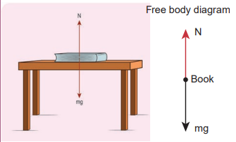

>**Note**

>In the free body diagram, 
as the magnitudes of the 
normal force and the 
gravitational force are 
same, the lengths of both these vectors 
are also same.

>(2) According to Newton’s third law, there 
are two reaction forces exerted by the 
book.

>> (i) The book exerts an equal and 
opposite force (mg) on the Earth 
which acts upwards.

>>(ii) The book exerts a force which 
is equal and opposite to normal 
force on the surface of the table 
(N) acting downwards.

>**Note**

>It is to be emphasized that 
while applying Newton’s 
third law it is wrong to 
conclude that the book on 
the table is at rest due to the downward 
gravitational force exerted by the 
Earth and the equal and opposite 
reacting normal force exerted by the 
table on the book. Action and reaction 
forces never act on the same body.

>(3) The free body diagram of the book is 
shown in the figure.

>**EXAMPLE 3.2**

>If two objects of masses 2.5 kg and 100 kg 
experience the same force 5 N, what is the 
acceleration experienced by each of them?

>*Solution*

>From Newton’s second law (in 
magnitude form), F = ma

>For the object of mass 2.5 kg, the 
acceleration is a
F
m= = = m s
5 -
2 5
2 2

>For the object of mass 100 kg, the 
acceleration is a
F
m= = = m s
5 -
100
0 05 2

>**Note**

>Even though the force 
applied on both the objects 
is the same, acceleration 
experienced by each object 
differs. The acceleration is inversely 
proportional to mass. For the same 
force, the heavier mass experiences 
lesser acceleration and the lighter mass 
experiences greater acceleration.

>When an apple falls, it experiences 
Earth’s gravitational force. According 
to Newton’s third law, the apple exerts 
equal and opposite force on the Earth. 
Even though both the apple and 
Earth experience the same force, their 
acceleration is different. The mass of 
Earth is enormous compared to that of 
an apple. So an apple experiences larger 
acceleration and the Earth experiences 
almost negligible acceleration. Due to the 
negligible acceleration, Earth appears to be 
stationary when an apple falls.

>**EXAMPLE 3.3**

>Which is the greatest force among the three 
force    F F F 1 2 3 , , shown below

>*Solution*

>Force is a vector and magnitude of the 
vector is represented by the length of the 
vector. Here 
F1
 has greater length compared 
to other two. So 
F1
 is largest of the three.

 >**EXAMPLE 3.4**

 >Apply Newton’s second law to a mango 
hanging from a tree. (Mass of the mango 
is 400 gm)

>*Solution*

>Note: Before applying Newton’s laws, 
the following steps have to be followed:

1) Choose a suitable inertial coordinate 
system to analyse the problem. For 
most of the cases we can take Earth as 
an inertial coordinate system.
2) Identify the system to which Newton’s 
laws need to be applied. The system can 
be a single object or more than one object.
3) Draw the free body diagram. 
4) Once the forces acting on the system are 
identified, and the free body diagram 
is drawn, apply Newton’s second law. 
In the left hand side of the equation, 
write the forces acting on the system 
in vector notation and equate it to the 
right hand side of equation which is 
the product of mass and acceleration. 
Here, acceleration should also be in 
vector notation. 
5) If acceleration is given, the force can be 
calculated. If the force is given, 
acceleration can be calculated.

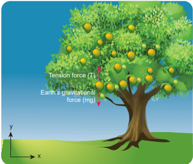

By following the above steps:
>We fix the inertial coordinate system on 
the ground as shown in the figure.

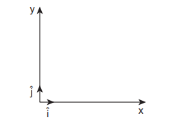

>The forces acting on the mango are

>i) Gravitational force exerted by 
the Earth on the mango acting 
downward along negative y axis

>ii) Tension (in the cord attached to the 
mango) acts upward along positive 
y axis.

>The free body diagram for the mango is 
shown in the figure

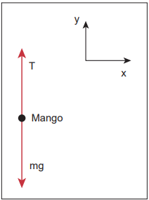

>F m  g j  mgj

>Here, mg is the magnitude of the gravitational 
force and   ˆ  j represents the unit vector in 
negative y direction

>T Tˆ  j

>Here T is the magnitude of the tension 
force and   ˆj represents the unit vector in 
positive y direction

>F F net g  T =   mgˆ ˆ ˆ  j Tj T  mg j

>From Newton’s second law  

>Since the mango is at rest with respect 
to us (inertial coordinate system) the 
acceleration is zero ( 
a = 0).

>So   F ma net = = 0

>  ˆ T m  g j 0

>By comparing the components on both sides 
of the above equation, we get T m  g 0

>So the tension force acting on the 
mango is given by T m= g

>Mass of the mango m = 400g and 
g = 9.8 m s–2

>Tension acting on the mango is 
T = 0.4 × 9.8 = 3.92 N

>**EXAMPLE 3.5**

>A person rides a bike with a constant 
velocity 
v with respect to ground and 
another biker accelerates with acceleration 

a with respect to ground. Who can apply 
Newton’s second law with respect to a 
stationary observer on the ground?

>*Solution*

>Second biker cannot apply Newton’s 
second law, because he is moving with 
acceleration 
a with respect to Earth (he is 
not in inertial frame). But the first biker 
can apply Newton’s second law because he 
is moving at constant velocity with respect 
to Earth (he is in inertial frame). 

>**EXAMPLE 3.6**

>The position vector of a particle is given 
by 2 3 5 7 . ˆ ˆ ˆ    
r ti t j k Find the direction in 
which the particle experiences net force?

>*Solution*

>Velocity of the particle,

v =       ˆ 2 ˆ ˆ 3 5 7 dr d d d t i t j k
dt dt dt dt
  

ˆ ˆ   3 10

dr i tj dt
Acceleration of the particle 
2
2 0ˆ   1
   dv d r a j d

>Here, the particle has acceleration only along 
positive y direction. According to Newton’s 
second law, net force must also act along 
positive y direction. In addition, the particle 
has constant velocity in positive x direction 
and no velocity in z direction. Hence, there 
are no net force along x or z direction.

>**EXAMPLE 3.7**

>Consider a bob attached to a string, 
hanging from a stand. It oscillates as 
shown in the figure. 

a) Identify the forces that act on the bob? 

b) What is the acceleration experienced by 
the bob?

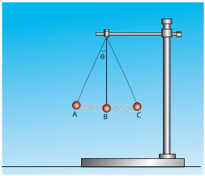

>*Solution*

>Two forces act on the bob.

(i) Gravitational force (mg) acting 
downwards

(ii) Tension (T) exerted by the string on 
the bob, whose position determines 
the direction of T as shown in figure. 

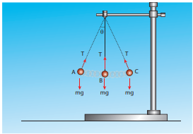

>The bob is moving in a circular arc as 
shown in the above figure. Hence it has 
centripetal acceleration. At a point A and 
C, the bob comes to rest momentarily and 
then its velocity increases when it moves 
towards point B. Hence, there is a tangential 
acceleration along the arc. The gravitational 
force can be resolved into two components 
(mg cosθ, mg sinθ) as shown below

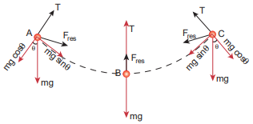

>**Note**

>Note that the bob does not 
move in the direction of 
the resultant force. At the 
points A and C, tension T = mg cosθ. 
At all other points, tension T is greater than 
mg cosθ, since it has non zero centripetal 
acceleration. At point B, the resultant 
force acts upward along the string. It is an 
example of a non uniform circular motion 
because the bob has both the centripetal 
and tangential accelerations.

>**EXAMPLE 3.8**

>The velocity of a particle moving in a plane 
is given by the following diagram. Find out 
the direction of force acting on the particle?

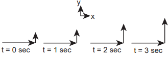

>*Solution*

The velocity of the particle is ˆ . ˆ ˆ     x y z v v i v j v k
ˆ . ˆ ˆ     x y z v v i v j v k As shown in the figure, the particle 
is moving in the xy plane, there is no motion 
in the z direction. So velocity in the z direction 
is zero (vz = 0). The velocity of the particle 
has x component (vx) and y component (v
y). 
From figure, as time increases from t = 0 
sec to t = 3 sec, the length of the vector in y 
direction is changing (increasing). It means 
y component of velocity v  y is increasing 
with respect to time. According to Newton’s 
second law, if velocity changes with respect 
to time then there must be acceleration. In 
this case, the particle has acceleration in the 
y direction since the y component of velocity 
changes. So the particle experiences force in 
the y direction. The length of the vector in 
x direction does not change. It means that 
the particle has constant velocity in the x 
direction. So no force or zero net force acts 
in the x direction.

>**EXAMPLE 3.9**

>Apply Newton’s second law for an object at 
rest on Earth and analyse the result.

>*Solution*

>The object is at rest with respect to 
Earth (inertial coordinate system). There 
are two forces that act on the object. 

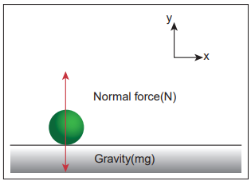

i) Gravity acting downward (negative 
y-direction)

ii) Normal force by the surface of the Earth 
acting upward (positive y-direction)

The free body diagram for this object is 

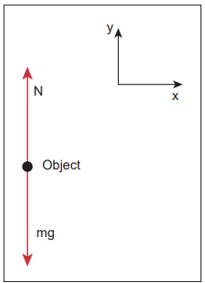

>
g
F mgj
ˆ 

N Nj

>Net force ˆ ˆ    
net F mgj Nj

>But there is no acceleration on the ball. 
So 
a = 0. By applying Newton’s second law 
(
  F ma net = )

>Since ˆ ˆ 

>( )ˆ   mg N j  0

>By comparing the components on both 
sides of the equation, we get

>  mg N  0
N m= g

>We can conclude that if the object is at rest, 
the magnitude of normal force is exactly 
equal to the magnitude of gravity.

>**EXAMPLE 3.10**

>A particle of mass 2 kg experiences two 
forces, 1 8ˆ ˆ 5ˆ    7 
F i j k and 
2 4ˆ ˆ 3ˆ    3 
F i j k. 
What is the acceleration of the particle?

>*Solution*

>We use Newton’s second law,   F ma net =
where    F F F net  1 2 . From the above 
equations the acceleration is  
a
F
m
net = , where

>F i j k
4 ˆ 10 ˆ ˆ   8  
net F i j k
ˆ ˆ ˆ 8 4 10
2 2 2
                    

a i j k
4 2 ˆ ˆ ˆ    5 

>**EXAMPLE 3.11**

>Identify the forces acting on blocks A, B 
and C shown in the figure. 

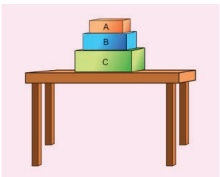

>*Solution*

>Forces on block A:

(i) Downward gravitational force exerted 
by the Earth (mAg)

(ii) Upward normal force exerted by block 
B (NB) 

>The free body diagram for block A is as 
shown in the following picture.

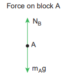

>Forces on block B :

(i) Downward gravitational force exerted 
by Earth (mBg)

(ii) Downward force exerted by block A (NA)

(iii) Upward normal force exerted by 
block C (NC)

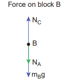

>Forces onblock C:

(i) Downward gravitational force exerted 
by Earth (mCg)

(ii) Downward force exerted by block B (NB)

(iii) Upward force exerted by the table (Ntable)

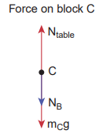

>**EXAMPLE 3.12**

>Consider a horse attached to the cart which 
is initially at rest. If the horse starts walking 
forward, the cart also accelerates in the 
forward direction. If the horse pulls the 
cart with force Fh in forward direction, then 
according to Newton’s third law, the cart also 
pulls the horse by equivalent opposite force 
F F c h = in backward direction. Then total 
force on ‘cart+horse’ is zero. Why is it then the 
‘cart+horse’ accelerates and moves forward?

>*Solution*

>This paradox arises due to wrong 
application of Newton’s second and third 
laws. Before applying Newton’s laws, we 
should decide ‘what is the system?’. Once 
we identify the ‘system’, then it is possible to 
identify all the forces acting on the system. 
We should not consider the force exerted 
by the system. If there is an unbalanced 
force acting on the system, then it should 
have acceleration in the direction of the 
resultant force. By following these steps we 
will analyse the horse and cart motion.

>If we decide on the cart+horse as a 
‘system’, then we should not consider the 
force exerted by the horse on the cart or 
the force exerted by cart on the horse. 
Both are internal forces acting on each 
other. According to Newton’s third law, 
total internal force acting on the system is 
zero and it cannot accelerate the system. 
The acceleration of the system is caused 
by some external force. In this case, the 
force exerted by the road on the system is 
the external force acting on the system. It 
is wrong to conclude that the total force 
acting on the system (cart+horse) is zero 
without including all the forces acting on 
the system. The road is pushing the horse 
and cart forward with acceleration. As there 
is an external force acting on the system, 
Newton’s second law has to be applied and 
not Newton’s third law

>The following figures illustrates this.

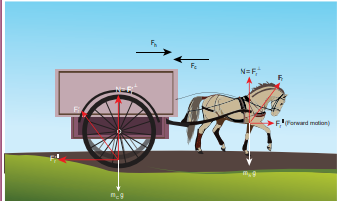

>If we consider the horse as the ‘system’, 
then there are three forces acting on the 
horse.

(i) Downward gravitational force (m gh )

(ii) Force exerted by the road (Fr)

(iii) Backward force exerted by the cart (Fc)

>It is shown in the following figure.

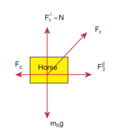

Fr
 – Force exerted by the road on the horse

Fc – Force exerted by the cart on the horse

Fr
⊥ – Perpendicular component of Fr
 =N

F||
r – Parallel component of Fr
 which is reason
 for forward movement

>The force exerted by the road can be 
resolved into parallel and perpendicular 
components. The perpendicular 
component balances the downward 
gravitational force. There is parallel 
component along the forward direction. It 
is greater than the backward force (Fc). So 
there is net force along the forward direction 
which causes the forward movement of the 
horse.

>If we take the cart as the system, then 
there are three forces acting on the cart.

(i) Downward gravitational force (m gc )

(ii) Force exerted by the road ( ) Fr’

(iii) Force exerted by the horse (Fh )

>It is shown in the figure

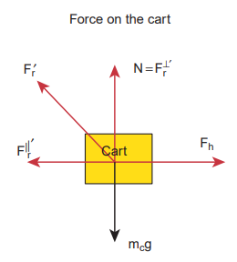

>The force exerted by the road (Fr
’
) can 
be resolved into parallel and perpendicular 
components. The perpendicular 
component cancels the downward gravity 
(m gc ). Parallel component acts backwards 
and the force exerted by the horse (Fh

) 
acts forward. Force (Fh

) is greater than the 
parallel component acting in the opposite 
direction. So there is an overall unbalanced 
force in the forward direction which causes 
the cart to accelerate forward.

>If we take the cart+horse as a system, 
then there are two forces acting on the 
system.

(i) Downward gravitational force 
(m m h c + )g

(ii) The force exerted by the road (Fr) on 
the system.

It is shown in the following figure.

(iii) In this case the force exerted 
by the road (Fr) on the system 
(cart+horse) is resolved in to parallel 
and perpendicular components. 
The perpendicular component is 
the normal force which cancels 
the downward gravitational force 
(m m h c + )g. The parallel component 
of the force is not balanced, hence the 
system (cart+horse) accelerates and 
moves forward due to this force.

>**EXAMPLE 3.13**

>The position of the particle is represented 
by y u  t gt
1
2
2

a) What is the force acting on the particle? 

b) What is the momentum of the particle?

>*Solution*

>To find the force, we need to find the 
acceleration experienced by the particle.

>The acceleration is given by a d y
dt =
2
The acceleration is given by a d y
dt =
2

>Here

>v =velocity of the particle in y direction
v dy
dt = = u g - t

>The momentum of the particle = mv = m 
(u-gt).

>a
dv
dt   g

>The force acting on the object is given by 
F m  a m g

>The negative sign implies that the force 
is acting on the negative y direction. This is 
exactly the force that acts on the object in 
projectile motion.

##  Particle Moving in an Inclined Plane

When an object of mass m slides on a 
frictionless surface inclined at an angle θ as 
shown in the Figure 3.12, the forces acting 
on it decides the

a) acceleration of the object

b) speed of the object when it reaches the 
bottom

The force acting on the object is 

(i) Downward gravitational force (mg)

(ii) Normal force perpendicular to inclined 
surface (N)

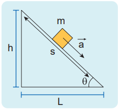

Figure 3.12 Object moving 
in an inclined plane

>To draw the free body diagram, the block is 
assumed to be a point mass (Figure 3.13 (a)). 
Since the motion is on the inclined surface, 
we have to choose the coordinate system 
parallel to the inclined surface as shown in 
Figure 3.13 (b).

>The gravitational force mg is resolved 
in to parallel component mg sinθ along 
the inclined plane and perpendicular 
component mg cosθ perpendicular to the 
inclined surface (Figure 3.13 (b)). 

>Note that the angle made by the 
gravitational force (mg) with the 
perpendicular to the surface is equal to the 
angle of inclination θ as shown in Figure ’
3.13 (c).

>There is no motion(acceleration) along 
the y axis. Applying Newton’s second law in 
the y direction

> mg ˆ ˆ 

By comparing the components on both 
sides, N m  g cos 0

>N m g cos

>The magnitude of normal force (N) exerted 
by the surface is equivalent to mg cosθ .

>The object slides (with an acceleration) 
along the x direction. Applying Newton’s 
second law in the x direction

>mg sini m ai

>By comparing the components on both 
sides, we can equate

>mg sinθ = ma

>The acceleration of the sliding object is

>a = g sinθ

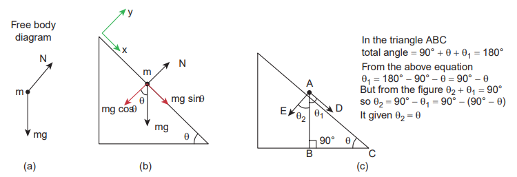

**Figure 3.13** (a) Free body diagram, (b) mg resolved into parallel and perpendicular 
components (c) The angle θ2 is equal to θ2

>Note that the acceleration depends on the 
angle of inclination . If the angle .  is 90 
degree, the block will move vertically with 
acceleration a = g.

>Newton’s kinematic equation is used to 
find the speed of the object when it reaches 
the bottom. The acceleration is constant 
throughout the motion.

>v u as
2 2   2 along the x direction (3.3)

>The acceleration a is equal to g sinθ. The 
initial speed (u) is equal to zero as it starts 
from rest. Here s is the length of the inclined 
surface.

>The speed (v) when it reaches the bottom 
is (using equation (3.3))

>v s = 2 g sinθ (3.4)

>**Note**

>Here we choose the 
coordinate system along the 
inclined plane. Even if we 
choose the coordinate system parallel 
to the horizontal surface, we will get 
the same result. But the mathematics 
will be quite complicated. Choosing a 
suitable inertial coordinate system for 
the given problem is very important.

## Two Bodies in Contact 
on a Horizontal Surface

>Consider two blocks of masses m1
 and m2 
(m1 > m2) kept in contact with each other on 
a smooth, horizontal frictionless surface as 
shown in Figure 3.14.

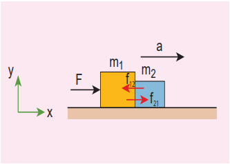

>Figure 3.14 (a) Two blocks of masses 
m1
 and m2 (m1 > m2) kept in contact 
with each other on a smooth, horizontal 
frictionless surface

>By the application of a horizontal force 
F, both the blocks are set into motion 
with acceleration ‘a’ simultaneously in the 
direction of the force F.

>To find the acceleration 
a, Newton’s 
second law has to be applied to the system 
(combined mass m = m1 + m2)

>F m= a

>If we choose the motion of the two masses 
along the positive x direction,

>Fiˆ = maiˆ

>F = ma where m = m1 + m2

>The acceleration of the system is given by

> 

a
F
m m 1 2
(3.5)

>The force exerted by the block m1
 on m2
due to its motion is called force of contact 
(

f21). According to Newton’s third law, the 
block m2
 will exert an equivalent opposite 
reaction force ( 
f
12 ) on block m1.

>Figure 3.14 (b) shows the free body 
diagram of block m1.

Figure 3.14 (b) Free body diagram of 
block of mass m1

> ˆ ˆ  ˆ Fi f i m a

>By comparing the components on both sides 
of the above equation, we get

>F f   m a 12 1 
f F m a 12 1   (3.6)

>Substituting the value of acceleration from 
equation (3.5) in (3.6) we get

>f F m
F
m m
12 1
1 2
  


 

 
f F m
m m
12
1
1 2
 1



 


f Fm
m m
12
2
1 2
 
(3.7)

>Equation (3.7) shows that the magnitude 
of contact force depends on mass m2 which 
provides the reaction force. Note that 
this force is acting along the negative 
x direction.

>In vector notation, the reaction force on 
mass m1
 is given by 2
12
1 2
  ˆ

 Fm f i

>For mass m2
 there is only one force acting 
on it in the x direction and it is denoted by 

f21. This force is exerted by mass m1
. The 
free body diagram for mass m2
 is shown in 
Figure 3.14 (c).

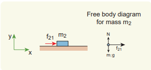

Figure 3.14 (c) Free body diagram of 
block of mass m2

>Applying Newton’s second law for mass 
m2

>f i m ˆ ˆ  a

>By comparing the components on both 
sides of the above equation

>f m a 21 2 = (3.8)

>Substituting for acceleration from equation 
(3.5) in equation (3.8), we get f Fm
m m
21
2
1 2

>In this case the magnitude of the contact 
force is

>f Fm
m m
21
2
1 2
 
The direction of this force is along the positive x direction.

>In vector notation, the force acting on 
mass m2
exerted by mass m1
is 2
21
1 2
ˆ Fm f i
m m  

## Motion of Connected Bodies

>When objects are connected by strings 
and a force F is applied either vertically or 
horizontally or along an inclined plane, it 
produces a tension T in the string, which 
affects the acceleration to an extent. Let us 
discuss various cases for the same.

>**Case 1:** Vertical motion
Consider two blocks of masses m1 and 
m2
 (m1 > m2) connected by a light and 
inextensible string that passes over a pulley 
as shown in Figure 3.15.

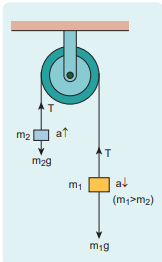

>Figure 3.15 Two blocks 
connected by a string 
over a pulley

>Let the tension in the string be T and 
acceleration a. When the system is released, 
both the blocks start moving, m2 vertically 
upward and m1 downward with same 
acceleration a. The gravitational force m1
g 
on mass m1
 is used in lifting the mass m2.

>The upward direction is chosen as y 
direction. The free body diagrams of both 
masses are shown in Figure 3.16.

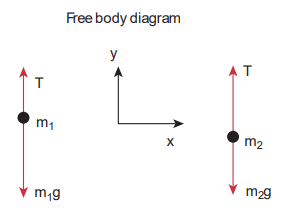

**Figure 3.16** Free body 
diagrams of masses m1
 and m2

>Applying Newton’s second law for 
mass m2

>The left hand side of the above equation 
is the total force that acts on m2 and the 
right hand side is the product of mass and 
acceleration of m2 in y direction.

>By comparing the components on both 
sides, we get

>Similarly, applying Newton’s second law for 
mass m1

>As mass m1
 moves downward (-j), its 
acceleration is along (-j)

>By comparing the components on both 
sides, we get

>Adding equations (3.9) and (3.10), we get

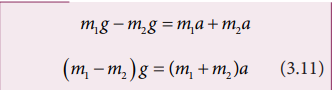

>From equation (3.11), the acceleration of 
both the masses is

>If both the masses are equal (m1
=m2
), from 
equation (3.12)

>$$ a=0 $$

>This shows that if the masses are equal, there 
is no acceleration and the system as a whole 
will be at rest.

>To find the tension acting on the string, 
substitute the acceleration from the equation 
(3.12) into the equation (3.9).

>By taking m2
g common in the RHS of 
equation (3.13)

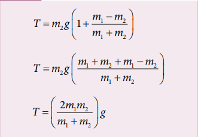

>Equation (3.12) gives only magnitude of 
acceleration.

>For mass m1 , the acceleration vector is 
given by 1 2
1 2
ˆ         

>For mass m2 , the acceleration vector is 
given by 1 2
1 2
ˆ         
 m m
a g

>**Case 2:** Horizontal motion

>In this case, mass m2
 is kept on a horizontal 
table and mass m1
 is hanging through 
a small pulley as shown in Figure 3.17. 
Assume that there is no friction on the 
surface.

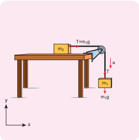

**Figure 3.17** Blocks in horizontal 
motion

>As both the blocks are connected to the 
unstretchable string, if m1
 moves with an 
acceleration a downward then m2
 also moves 
with the same acceleration a horizontally. 

>The forces acting on mass m2
 are

(i) Downward gravitational force (m2 g)

(ii) Upward normal force (N) exerted by 
the surface

(iii) Horizontal tension (T) exerted by the 
string

>The forces acting on mass m1 are

(i) Downward gravitational force (m1 g)

(ii) Tension (T) acting upwards 

>The free body diagrams for both the masses 
is shown in Figure 3.18.

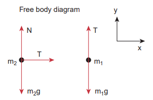

**Figure 3.18** Free body diagrams of 
masses m1
 and m2

>Applying Newton’s second law for m1

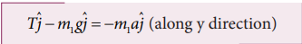

>By comparing the components on both sides 
of the above equation,

>Applying Newton’s second law for m2

>By comparing the components on both sides 
of above equation,

>There is no acceleration along y direction 
for m2.

>By comparing the components on both sides 
of the above equation 

>By substituting equation (3.15) in equation 
(3.14), we can find the tension T

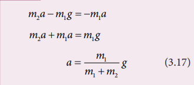

>Tension in the string can be obtained by 
substituting equation  (3.17) in equation 
(3.15)

>Comparing motion in both cases, it is clear 
that the tension in the string for horizontal 
motion is half of the tension for vertical 
motion for same set of masses and strings.

>This result has an important application 
in industries. The ropes used in conveyor 
belts (horizontal motion) work for longer 
duration than those of cranes and lifts 
(vertical motion).

## Concurrent Forces and Lami’s Theorem

>A collection of forces is said to be 
concurrent, if the lines of forces act at 
a common point. Figure 3.19 illustrates 
concurrent forces.

>Concurrent forces need not be in the 
same plane. If they are in the same plane, 
they are concurrent as well as coplanar 
forces.

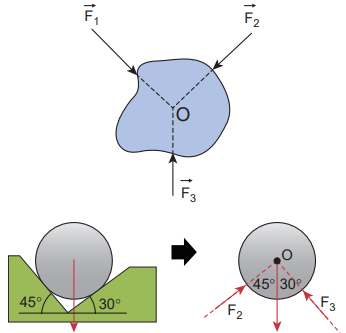

**Figure 3.19** Concurrent forces