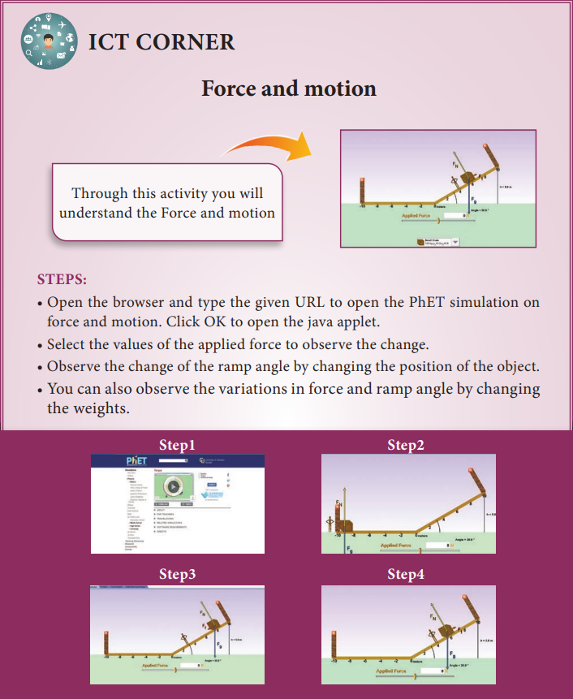

---
<<<<<<< HEAD:content.en/laws-of-motion/books for Reference/imdex.md
title: 'Books For Reference'
weight: 11
---

# BOOKS FOR REFERENCE

1. Charles Kittel, Walter Knight, Malvin Ruderman, Carl Helmholtz and Moyer, *Mechanics*,
2nd edition, Mc Graw Hill Pvt Ltd,
2. A.P.French, *Newtonian Mechanics*, Viva-Norton Student edition
3. SomnathDatta, *Mechanics*, Pearson Publication
4. H.C.Verma, Concepts of physics volume 1 and Volume 2, Bharati Bhawan Publishers
5. Serway and Jewett, *Physics for scientist and Engineers with modern physics*, Brook/Coole 
publishers, Eighth edition
6. Halliday, Resnick & Walker, *Fundamentals of Physics*, Wiley Publishers, 10th edition

**PhET simulation’s URL:**

https://phet.colorado.edu/en/simulations/ramp-forces-and-motion

* Pictures are indicative only.
* If browser requires, allow Flash Player or Java Script to load the page.