---
<<<<<<< HEAD
title: 'Dynamics Of Circular Motion'
=======
title: 'dynamics of circular motion'
>>>>>>> 9468d8de506ee3fe7a32ff32aec5f0ee5a849f86
weight: 7
---

# DYNAMICS OF CIRCULAR MOTION

In the previous sections we have studied 
how to analyse linear motion using 
Newton’s laws. It is also important to know 
how to apply Newton’s laws to circular 
motion, since circular motion is one of 
the very common types of motion that we 
come across in our daily life. A particle 
can be in linear motion with or without 
any external force. But when circular 
motion occurs there must necessarily be 
some force acting on the object. There is 
no Newton’s first law for circular motion. 
In other words without a force, circular 
motion cannot occur in nature. A force 
can change the velocity of a particle in 
three different ways.

1. The magnitude of the velocity can be 
changed without changing the direction 
of the velocity. In this case the particle 
will move in the same direction but with 
acceleration. 

**Examples**

Particle falling down vertically, 
bike moving in a straight road with 
acceleration.

2. The direction of motion alone can be 
changed without changing the magnitude 
(speed). If this happens continuously 
then we call it ‘uniform circular motion’.

3. Both the direction and magnitude 
(speed) of velocity can be changed. If this 
happens non circular motion occurs. For 
example oscillation of a swing or simple 
pendulum, elliptical motion of planets 
around the Sun.

In this section we will deal with uniform 
circular motion and non-uniform circular 
motion.

## Centripetal force

If a particle is in uniform circular motion, 
there must be centripetal acceleration 
towards the centre of the circle. If there is 
acceleration then there must be some force 
acting on it with respect to an inertial frame. 
This force is called centripetal force. 

As we have seen in chapter 2, the 
centripetal acceleration of a particle in the 
circular motion is given by a
v
r =
2
 and it acts 
towards centre of the circle. According to 
Newton’s second law, the centripetal force is 
given by

The word Centripetal force means centre 
seeking force. 

In vector notation 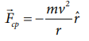

For uniform circular motion 2 ˆ cp F m    r r 

The direction –rˆ points towards the centre 
of the circle which is the direction of 
centripetal force as shown in Figure 3.38.

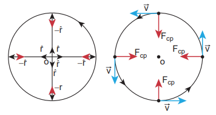

**Figure 3.38** Centripetal force

It should be noted that ‘centripetal force’ is 
not other forces like gravitational force or 
spring force. It can be said as ‘force towards 
centre’. The origin of the centripetal force 
can be gravitational force, tension in the 
string, frictional force, Coulomb force etc. 
Any of these forces can act as a centripetal 
force.

1. In the case of whirling motion of a stone 
tied to a string, the centripetal force 
on the particle is provided by the 
tensional force on the string. In circular 
motion in an amusement park, the 
centripetal force is provided by the 
tension in the iron ropes.

2. In motion of satellites around the Earth, 
the centripetal force is given by Earth’s 
gravitational force on the satellites. 
Newton’s second law for satellite motion is 

Where r- distance of the planet from the 
centre of the Earth.

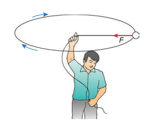

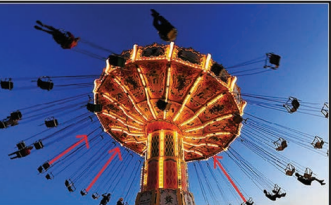

**Figure 3.39** Whirling motion of objects

>$$ m-mass of the satellite $$
>$$ v-speed of the satellite $$

3. When a car is moving on a circular 
track the centripetal force is given by the 
frictional force between the road and the 
tyres.

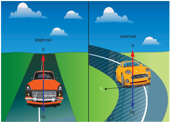

**Figure 3.40** Car in the circular track

Newton’s second law for this case is

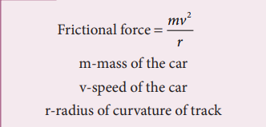

Even when the car moves on a curved 
track, the car experiences the centripetal 
force which is provided by frictional 
force between the surface and the tyre of 
the car. This is shown in the Figure 3.41.

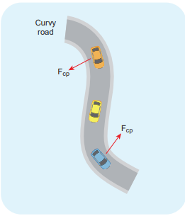

**Figure 3.41** Centripetal force 
due to frictional force between 
the road and tyre 

4. When the planets orbit around the Sun, 
they experience centripetal force towards 
the centre of the Sun. Here gravitational 
force of the Sun acts as centripetal force 
on the planets as shown in Figure 3.42

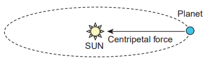

**Figure 3.42** Centripetal force on the 
orbiting planet due Sun’s gravity

Newton’s second law for this motion 
Gravitational force of Sun on the 
planet = mv
r
2

>**EXAMPLE 3.22**

If a stone of mass 0.25 kg tied to a string 
executes uniform circular motion with a speed 
of 2 m s-1
 of radius 3 m, what is the magnitude 
of tensional force acting on the stone?

>*Solution:* F
cp = mv
r
2

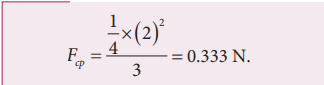

>**EXAMPLE 3.23**

The Moon orbits the Earth once in 
27.3 days in an almost circular orbit. 
Calculate the centripetal acceleration 
experienced by the Moon? (Radius of 
the Earth is 6.4 × 106
 m)

>*Solution*

The centripetal acceleration is given by 
a
v
r =
2
. This expression explicitly depends 
on Moon’s speed which is non trivial. We 
can work with the formula

ω is angular velocity.

Rm is the distance between Earth and 
the Moon, which is 60 times the radius of 
the Earth. 

As we know the angular velocity 
  2
T
and T = 27.3 days = 27.3 × 24 × 60 × 60 
second = 2.358 × 106
 sec

By substituting these values in the formula 
for acceleration

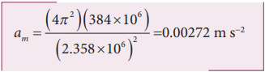

The centripetal acceleration of Moon 
towards the Earth is 0.00272 m s-2

>**Note**

This result was calculated 
by Newton himself. In 
unit 6 we will use this 
result.

##  Vehicle on a leveled circular road

When a vehicle travels in a curved path, 
there must be a centripetal force acting on 
it. This centripetal force is provided by the 
frictional force between tyre and surface 
of the road. Consider a vehicle of mass ‘m’ 
moving at a speed ‘v’ in the circular track 
of radius ‘r’. There are three forces acting on 
the vehicle when it moves as shown in the 
Figure 3.43

1. Gravitational force (mg) acting 
downwards

2. Normal force (N) acting upwards

3. Frictional force (Fs
) acting horizontally 
inwards along the road

**Figure 3.43** Forces acting on the vehicle on a leveled circular road

Suppose the road is horizontal then the 
normal force and gravitational force are 
exactly equal and opposite. The centripetal 
force is provided by the force of static 
friction Fs between the tyre and surface of 
the road which acts towards the centre of 
the circular track,

As we have already seen in the previous 
section, the static friction can increase from 
zero to a maximum value

There are two conditions possible:

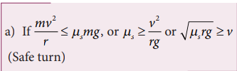

The static friction would be able to provide 
necessary centripetal force to bend the
car on the road. So the coefficient of static 
friction between the tyre and the surface of 
the road determines what maximum speed 
the car can have for safe turn.

If the static friction is not able to provide 
enough centripetal force to turn, the vehicle 
will start to skid.

>**EXAMPLE 3.24**

Consider a circular leveled road of 
radius 10 m having coefficient of static 
friction 0.81. Three cars (A, B and C) are 
travelling with speed 7 m s-1
, 8 m s-1
 and 
10 ms-1
 respectively. Which car will skid 
when it moves in the circular level road? 
(g =10 m s-2
)

>*Solution*

From the safe turn condition the speed 
of the vehicle (v) must be less than or equal 
to s
rg

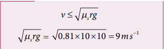

For Car C, v rg s   is less than v

The speed of car A, B and C are 7 m s-1
, 
8 m s-1 and 10 m s-1
 respectively. The cars 
A and B will have safe turns. But the car 
C has speed 10 m s-1
 while it turns which 
exceeds the safe turning speed. Hence, the 
car C will skid.

## Banking of Tracks

In a leveled circular road, skidding mainly 
depends on the coefficient of static friction 
ms
 The coefficient of static friction depends 
on the nature of the surface which has a 
maximum limiting value. To avoid this 
problem, usually the outer edge of the road 
is slightly raised compared to inner edge 
as shown in the Figure 3.44. This is called 
banking of roads or tracks. This introduces 
an inclination, and the angle is called 
banking angle.

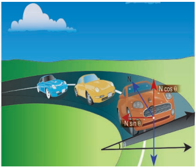

**Figure 3.44** Outer edge of the road is 
slightly raised to avoid skidding

Let the surface of the road make angle θ
with horizontal surface. Then the normal 
force makes the same angle θ with the 
vertical. When the car takes a turn, there are 
two forces acting on the car:

a) Gravitational force mg (downwards)

b) Normal force N (perpendicular to 
surface)

We can resolve the normal force into two 
components. N cosθ and N sinθ as shown 
in Figure 3.46. The component N cosθ
balances the downward gravitational force 
‘mg’ and component N sinθ will provide the 
necessary centripetal acceleration. By using 
Newton second law

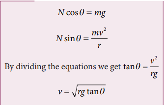

The banking angle θ and radius of curvature 
of the road or track determines the safe 
speed of the car at the turning. If the speed 
of car exceeds this safe speed, then it starts to 
skid outward but frictional force comes into 
effect and provides an additional centripetal 
force to prevent the outward skidding. At 
the same time, if the speed of the car is little 
lesser than safe speed, it starts to skid inward 
and frictional force comes into effect, which 
reduces centripetal force to prevent inward 
skidding. However if the speed of the vehicle 
is sufficiently greater than the correct speed, 
then frictional force cannot stop the car 
from skidding.

>**EXAMPLE 3.25**

Consider a circular road of radius 20 meter 
banked at an angle of 15 degree. With what 
speed a car has to move on the turn so that 
it will have safe turn?

>*Solution*

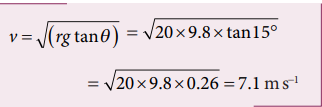

The safe speed for the car on this road is 7.1 m s-1

## Centrifugal Force

Circular motion can be analysed from two 
different frames of reference. One is the 
inertial frame (which is either at rest or in 
uniform motion) where Newton’s laws are 
obeyed. The other is the rotating frame of 
reference which is a non-inertial frame 
of reference as it is accelerating. When we 
examine the circular motion from these 
frames of reference the situations are entirely 
different. To use Newton’s first and second 
laws in the rotational frame of reference, 
we need to include a pseudo force called 
‘centrifugal force’. This ‘centrifugal force’ 
appears to act on the object with respect to 
rotating frames. To understand the concept 
of centrifugal force, we can take a specific 
case and discuss as done below.

Consider the case of a whirling motion 
of a stone tied to a string. Assume that the 
stone has angular velocity ω in the inertial 
frame (at rest). If the motion of the stone is 
observed from a frame which is also rotating 
along with the stone with same angular 
velocity ω then, the stone appears to be 
at rest. This implies that in addition to the
inward centripetal force m r 2 there must 
be an equal and opposite force that acts on 
the stone outward with value +m r 2 . So the 
total force acting on the stone in a rotating 
frame is equal to zero (  mrmr   2 2
= 0). 
This outward force +m r ω2 is called the 
centrifugal force. The word ‘centrifugal’ 
means ‘flee from centre’. Note that the 
‘centrifugal force’ appears to act on the 
particle, only when we analyse the motion 
from a rotating frame. With respect to an 
inertial frame there is only centripetal force 
which is given by the tension in the string. 
For this reason centrifugal force is called as a 
‘pseudo force’. A pseudo force has no origin. 
It arises due to the non inertial nature of the 
frame considered. When circular motion 
problems are solved from a rotating frame 
of reference, while drawing free body 
diagram of a particle, the centrifugal force 
should necessarily be included as shown in 
the Figure 3.45.

## Effects of Centrifugal Force

Although centrifugal force is a pseudo force, 
its effects are real. When a car takes a turn in 
a curved road, person inside the car feels an 
outward force which pushes the person away. 
This outward force is also called centrifugal 
force. If there is sufficient friction between 
the person and the seat, it will prevent the 
person from moving outwards. When a car 
moving in a straight line suddenly takes 
a turn, the objects not fixed to the car try 
to continue in linear motion due to their 
inertia of direction. While observing this 
motion from an inertial frame, it appears as 
a straight line as shown in Figure 3.46. But, 
when it is observed from the rotating frame 
it appears to move outwards.

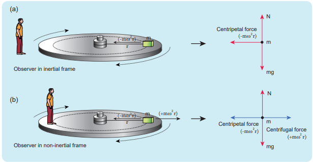

Figure 3.45 Free body diagram of a particle including the centrifugal force

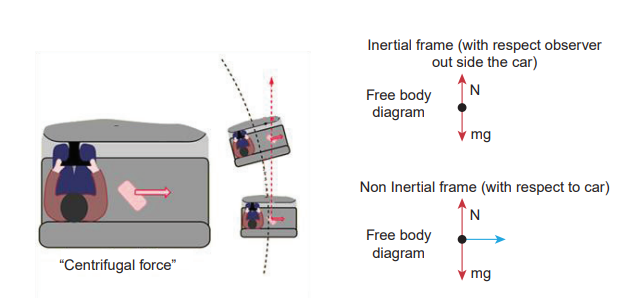

**Figure 3.46** Effects of centrifugal force

A person standing on a rotating platform 
feels an outward centrifugal force and is 
likely to be pushed away from the platform. 
Many a time the frictional force between 
the platform and the person is not sufficient 
to overcome outward push. To avoid this, 
usually the outer edge of the platform 
is little inclined upwards which exerts a 
normal force on the person which prevents 
the person from falling as illustrated in 
Figures 3.47.

>**Caution!**

It is dangerous to stand near the open 
door (or) steps while travelling in the 
bus. When the bus takes a sudden turn 
in a curved road, due to centrifugal 
force the person is pushed away from 
the bus. Even though centrifugal force is 
a pseudo force, its effects are real. 

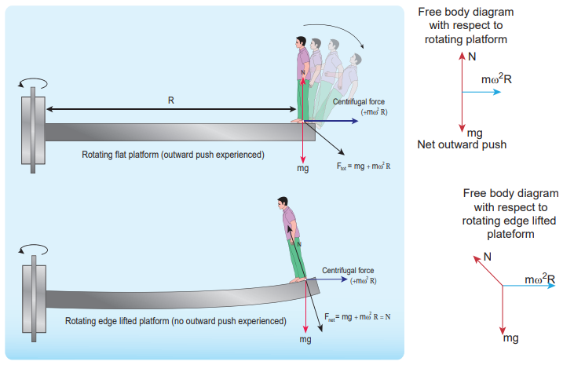

## Centrifugal Force due to Rotation of the Earth

Even though Earth is treated as an 
inertial frame, it is actually not so. Earth 
spins about its own axis with an angular 
velocity ω. Any object on the surface of 
Earth (rotational frame) experiences a 
centrifugal force. The centrifugal force 
appears to act exactly in opposite direction 
from the axis of rotation. It is shown in the 
Figure 3.48.

The centrifugal force on a man standing 
on the surface of the Earth is F m r

where r is perpendicular distance of the 
man from the axis of rotation. By using right 
angle triangle as shown in the Figure 3.48, 
the distance r R= cos θ

Here R = radius of the Earth 
and   latitude of the Earth where the 
man is standing.

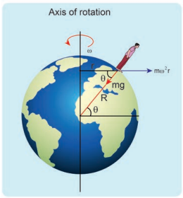

Figure 3. 48 Centrifugal force 
acting on a man on the surface of 
Earth

>**EXAMPLE 3.26**

Calculate the centrifugal force experienced 
by a man of 60 kg standing at Chennai? 
(Given: Latitude of Chennai is 13°

>*Solution*
The centrifugal force is given by 
F m c    R
2
cos
The angular velocity (ω) of Earth = 2
T
 , 
where T is time period of the Earth (24 hours)

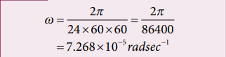

The radius of the Earth R = 6400 
Km = 6400 × 103
 m

Latitude of Chennai =13°

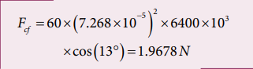

A 60 kg man experiences centrifugal force 
of approximately 2 Newton. But due to 
Earth’s gravity a man of 60 kg experiences a 
force = mg = 60 × 9.8 = 588N. This force is 
very much larger than the centrifugal force.

##  Centripetal Force Versus Centrifugal Force

Salient features of centripetal and centrifugal 
forces are compared in Table 3.4.

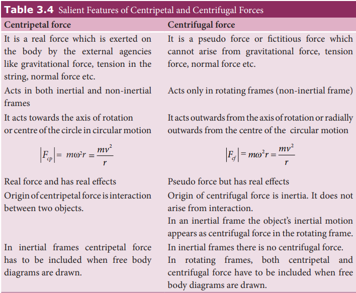
