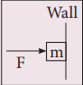
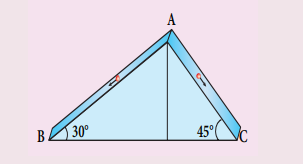
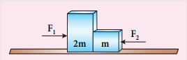
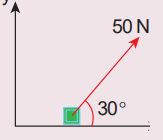
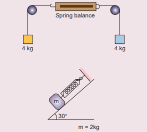
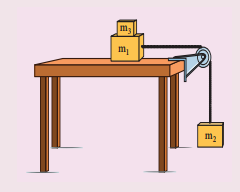
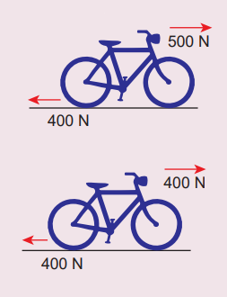
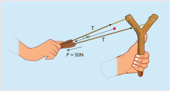
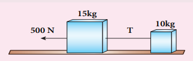

# EVALUATION

**I. Multiple Choice Questions**

1. When a car takes a sudden left turn in 
the curved road, passengers are pushed 
towards the right due to 

(a) inertia of direction

(b) inertia of motion

(c) inertia of rest

(d) absence of inertia

2. An object of mass m held against a 
vertical wall by applying horizontal 
force F as shown in the figure. The 
minimum value of the force F is

(IIT JEE 1994)

(a) Less than mg

(b) Equal to mg

(c) Greater than mg

(d) Cannot determine

3. A vehicle is moving along the positive 
x direction, if sudden brake is applied, 
then

(a) frictional force acting on the 
vehicle is along negative x 
direction

(b) frictional force acting on the 
vehicle is along positive x direction

(c) no frictional force acts on the 
vehicle

(d) frictional force acts in downward 
direction

4. A book is at rest on the table which 
exerts a normal force on the book. If 
this force is considered as reaction 
force, what is the action force according 
to Newton’s third law?

(a) Gravitational force exerted by 
Earth on the book

(b) Gravitational force exerted by the 
book on Earth

(c) Normal force exerted by the book 
on the table

(d) None of the above

5. Two masses m1
 and m2 are experiencing 
the same force where m m 1 2 < . The ratio 
of their acceleration a
a
1
2
 is 
(a) 1

(b) less than 1

(c) greater than 1

(d) all the three cases

6. Choose appropriate free body diagram 
for the particle experiencing net 
acceleration along negative y direction. 
(Each arrow mark represents the force 
acting on the system).

7. A particle of mass m sliding on the 
smooth double inclined plane (shown 
in figure) will experience

(a) greater acceleration along the 
path AB

(b) greater acceleration along the 
path AC

(c) same acceleration in both the paths 

(d) no acceleration in both the paths.

8. Two blocks of masses m and 2m are 
placed on a smooth horizontal surface 
as shown. In the first case only a force 
F1
 is applied from the left. Later only a 
force F2 is applied from the right. If the 
force acting at the interface of the two 
blocks in the two cases is same, then 
F F 1 2 : is

(Physics Olympiad 2016)

(a) 1:1 (b) 1:2

(c) 2:1 (d) 1:3

9. Force acting on the particle moving 
with constant speed is

(a) always zero

(b) need not be zero

(c) always non zero

(d) cannot be concluded

10. An object of mass m begins to move 
on the plane inclined at an angle θ . 
The coefficient of static friction of 
inclined surface is ms
. The maximum 
static friction experienced by the 
mass is

(a) mg 

(b) ms
mg
(c) ms
mg sinθ

(d) ms mg cos θ

11. When the object is moving at constant 
velocity on the rough surface, 

(a) net force on the object is zero

(b) no force acts on the object

(c) only external force acts on the 
object

(d) only kinetic friction acts on the 
object

12. When an object is at rest on the inclined 
rough surface,

(a) static and kinetic frictions acting 
on the object is zero

(b) static friction is zero but kinetic 
friction is not zero

(c) static friction is not zero and 
kinetic friction is zero

(d) static and kinetic frictions are not 
zero

13. The centrifugal force appears to 
exist 

(a) only in inertial frames

(b) only in rotating frames

(c) in any accelerated frame

(d) both in inertial and non-inertial 
frames

14. Choose the correct statement from the 
following
(a) Centrifugal and centripetal forces 
are action reaction pairs

(b) Centripetal forces is a natural force

(c) Centrifugal force arises from 
gravitational force

(d) Centripetal force acts towards 
the centre and centrifugal force 
appears to act away from the centre 
in a circular motion

15. If a person moving from pole to 
equator, the centrifugal force acting on 
him
(a) increases

(b) decreases

(c) remains the same

(d) increases and then decreases

**Answers**

1) a 2) c 3) a 4) c 5) c
6) c 7) b 8) c 9) b 10) d
11) a 12) c 13) b 14) d 15) a

**II. Short Answer Questions**

1. Explain the concept of inertia. Write 
two examples each for inertia of 
motion, inertia of rest and inertia of 
direction.

2. State Newton’s second law.

3. Define one newton.

4. Show that impulse is the change of 
momentum.

5. Using free body diagram, show that it 
is easy to pull an object than to push it.

6. Explain various types of friction. 
Suggest a few methods to reduce 
friction.

7. What is the meaning by ‘pseudo force’?

8. State the empirical laws of static and 
kinetic friction.

9. State Newton’s third law.

10. What are inertial frames?

11. Under what condition will a car skid 
on a leveled circular road?

**III. Long Answer Questions**

1. Prove the law of conservation of linear 
momentum. Use it to find the recoil 
velocity of a gun when a bullet is fired 
from it.

2. What are concurrent forces? State 
Lami’s theorem.

3. Explain the motion of blocks connected 
by a string in i) Vertical motion ii) 
Horizontal motion.

4. Briefly explain the origin of friction. 
Show that in an inclined plane, angle 
of friction is equal to angle of repose.

5. State Newton’s three laws and discuss 
their significance. 

6. Explain the similarities and differences 
of centripetal and centrifugal forces.

7. Briefly explain ‘centrifugal force’ with 
suitable examples.

8. Briefly explain ‘rolling friction’.

9. Describe the method of measuring 
angle of repose.

10. Explain the need for banking of tracks.

11. Calculate the centripetal acceleration 
of Moon towards the Earth.

**IV. Numerical Problems**

1. A force of 50N act on the object of mass 
20 kg. shown in the figure. Calculate 
the acceleration of the object in x and y 
directions.

Ans: ax
=2.165 ms-2
; a
y
=1.25 ms-2

2. A spider of mass 50 g is hanging on 
a string of a cob web as shown in the 
figure. What is the tension in the string?

Ans: T=0.49N

3. What is the reading shown in spring 
balance?

Ans: Zero, 9.8 N

4. The physics books are stacked on each 
other in the sequence: +1 volumes 1 
and 2; +2 volumes 1 and 2 on a table.

 a) Identify the forces acting on each 
book and draw the free body 
diagram.

 b) Identify the forces exerted by each 
book on the other.

5. A bob attached to the string oscillates 
back and forth. Resolve the forces 
acting on the bob in to components. 
What is the acceleration experience by 
the bob at an angle θ.

Ans: Tangential acceleration = g sinθ ; 
centripetal acceleration = 
m
(T−mg cosθ)
.

6. Two masses m1
 and m2
 are connected 
with a string passing over a 
frictionless pulley fixed at the corner 
of the table as shown in the figure. 
The coefficient of static friction 
of mass m1
 with the table is μs
. 
Calculate the minimum mass m3
that may be placed on m1to prevent 
it from sliding. Check if m1
=15 kg, 
m2
=10 kg, m3
=25 kg and μs
 =0.2

 Ans: m
m
m
s
3
2
1   
, the combined masses 
m1
+m3
 will slide.

7. Calculate the acceleration of the bicycle 
of mass 25 kg as shown in Figures 1 
and 2.

Ans: a=4 ms-2
, zero

8. Apply Lami’s theorem on sling shot and 
calculate the tension in each string ?

Ans: T= 28.868N.

9. A football player kicks a 0.8 kg ball 
and imparts it a velocity 12 ms-1
. The 
contact between the foot and ball is 
only for one- sixtieth of a second. Find 
the average kicking force.

Ans: 576N.

10. A stone of mass 2 kg is attached to a 
string of length 1 meter. The string can 
withstand maximum tension 200 N. 
What is the maximum speed that stone 
can have during the whirling motion?

Ans: vmax=10ms-1

11. Imagine that the gravitational force 
between Earth and Moon is provided 
by an invisible string that exists

between the Moon and Earth. What is 
the tension that exists in this invisible 
string due to Earth’s centripetal force? 
(Mass of the Moon = 7.34 × 1022 kg, 
Distance between Moon and Earth = 
3.84 × 108
 m)

 Ans: T~ 2x10^20 N.

 12. Two bodies of masses 15 kg and 10 kg 
are connected with light string kept on 
a smooth surface. A horizontal force 
F=500 N is applied to a 15 kg as shown 
in the figure. Calculate the tension 
acting in the string

Ans: T N = 200 .

13. People often say “For every action there 
is an equivalent opposite reaction”. 
Here they meant ‘action of a human’. Is 
it correct to apply Newton’s third law 
to human actions? What is mean by 
‘action’ in Newton third law? Give your 
arguments based on Newton’s laws.
 Ans: Newton’s third law is applicable 
to only human’s actions which involves 
physical force. Third law is not 
applicable to human’s psychological 
actions or thoughts

14. A car takes a turn with velocity 
50  ms-1 on the circular road of 
radius of curvature 10 m. calculate 
the centrifugal force experienced 
by a person of mass 60kg inside the 
car?

Ans: 15,000 N

15. A long stick rests on the surface. A 
person standing 10 m away from the 
stick. With what minimum speed an 
object of mass 0.5 kg should he thrown 
so that it hits the stick. (Assume the 
coefficient of kinetic friction is 0.7).

Ans: 11.71 ms-1