# FRICTION

## Introduction

If a very gentle force in the horizontal 
direction is given to an object at rest on the 
table, it does not move. It is because of the 
opposing force exerted by the surface on the 
object which resists its motion. This force 
is called the frictional force which always 
opposes the relative motion between an object 
and the surface where it is placed. If the force 
applied is increased, the object moves after a 
certain limit.

*Relative motion:* when a force parallel 
to the surface is applied on the object, the 
force tries to move the object with respect to 
the surface. This ‘relative motion’ is opposed

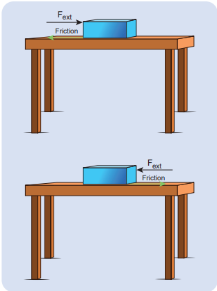

**Figure 3.22** Frictional force

by the surface by exerting a frictional force 
on the object in a direction opposite to 
applied force. Frictional force always acts on 
the object parallel to the surface on which 
the object is placed. There are two kinds 
of friction namely 1) Static friction and 2) 
Kinetic friction.

##  Static Friction ( fs)

Static friction is the force which opposes 
the initiation of motion of an object on the 
surface. When the object is at rest on the 
surface, only two forces act on it. They are the 
downward gravitational force and upward 
normal force. The resultant of these two 
forces on the object is zero. As a result the 
object is at rest as shown in Figure 3.23.

If some external force Fext is applied on 
the object parallel to the surface on which 
the object is at rest, the surface exerts 
exactly an equal and opposite force on the 
object to resist its motion and tries to keep 
the object at rest. It implies that external 
force and frictional force are exactly equal 
and opposite. Therefore, no motion parallel 
to the surface takes place. But if the external 
force is increased above a particular limit, the 
surface cannot provide sufficient opposing 
frictional force to balance the external force 
on the object. Then the object starts to slide. 
This is the maximal static friction that can be 
exerted by the surface. Experimentally, it is 
found that the magnitude of static frictional 
force fs
 satisfies the following empirical 
relation.

where µs
 is the coefficient of static friction. 
It depends on the nature of the surfaces in 
contact. N is normal force exerted by the 
surface on the body and sometimes it is 
equal to mg. But it need not be equal to mg
always.

Equation (3.27) implies that the force of 
static friction can take any value from zero 
to µs
N.

If the object is at rest and no external 
force is applied on the object, the static 
friction acting on the object is zero ( fs = 0).

If the object is at rest, and there is 
an external force applied parallel to the 
surface, then the force of static friction 
acting on the object is exactly equal to 
the external force applied on the object 
( f F s ext = ). But still the static friction fs
 is 
less than µs
N.

When object begins to slide, the static 
friction ( fs
) acting on the object attains 
maximum,

The static and kinetic frictions (which 
we discuss later) depend on the normal 
force acting on the object. If the object is 
pressed hard on the surface then the normal 
force acting on the object will increase. As 
a consequence it is more difficult to move 
the object. This is shown in Figure 3.23 (a) 
and (b). The static friction does not depend 
upon the area of contact.

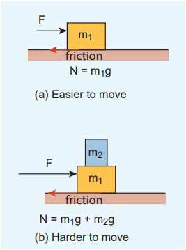

**Fig 3.23** Static friction and 
kinetic friction (a) Easier to 
move (b) Harder to move

>**EXAMPLE 3.17**

Consider an object of mass 2 kg resting on 
the floor. The coefficient of static friction 
between the object and the floor is s  0.8. 
What force must be applied on the object 
to move it? 

>*Solution*

Since the object is at rest, the gravitational 
force experienced by an object is balanced 
by normal force exerted by floor.

>$$ N = mg $$

The maximum static frictional force fs
max =
  s s
N m  g

Therefore to move the object the external force 
should be greater than maximum static friction.

>**EXAMPLE 3.18**

Consider an object of mass 50 kg at rest on 
the floor. A Force of 5 N is applied on the 
object but it does not move. What is the 
frictional force that acts on the object?

>*Solution*

When the object is at rest, the external 
force and the static frictional force are 
equal and opposite. 

The magnitudes of these two forces are 
equal, f F s ext

Therefore, the static frictional force 
acting on the object is 

The direction of this frictional force is 
opposite to the direction of Fext.

>**EXAMPLE 3.19**

Two bodies of masses 7 kg and 5 kg are 
connected by a light string passing over 
a smooth pulley at the edge of the table 
as shown in the figure. The coefficient of 
static friction between the surfaces (body 
and table) is 0.9. Will the mass m1 = 7 kg 
on the surface move? If not what value of
m2
 should be used so that mass 7 kg begins 
to slide on the table?

>*Solution*

As shown in the figure, there are four 
forces acting on the mass m1

a) Downward gravitational force along the 
negative y-axis (m1 g)

b) Upward normal force along the positive 
y axis (N)

c) Tension force due to mass m2
 along the 
positive x axis

d) Frictional force along the negative x axis
Since the mass m1 has no vertical motion, 
m1
g = N

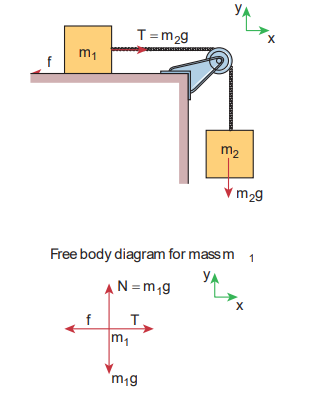

To determine whether the mass m1
moves on the surface, calculate the 
maximum static friction exerted by the table 
on the mass m1
. If the tension on the mass 
m1
 is equal to or greater than this maximum 
static friction, the object will move.

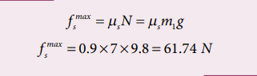

The tension T m2 g = 5 x 9.8 = 49 N

The tension acting on the mass m1
 is less 
than the maximum static friction. So the 
mass m1
 will not move.

 To move the mass m1
, T fs
max > where 
T = m2
g

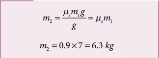

If the mass m2
 is greater than 6.3 kg then 
the mass m1
 will begin to slide. Note that if 
there is no friction on the surface, the mass 
m1
 will move even when m2
 is just 1 kg.

 The values of coefficient of static 
friction for pairs of materials are presented 
in Table 3.1. Note that the ice and ice pair 
have very low coefficient of static friction. 
This means a block of ice can move easily 
over another block of ice.

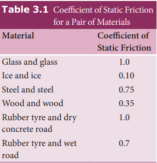

## Kinetic Friction

If the external force acting on the object 
is greater than maximum static friction, 
the objects begin to slide. When an object 
slides, the surface exerts a frictional force 
called **kinetic friction 
fk** (also called 
sliding friction or dynamic friction). To 
move an object at constant velocity we must 
apply a force which is equal in magnitude 
and opposite to the direction of kinetic 
friction.

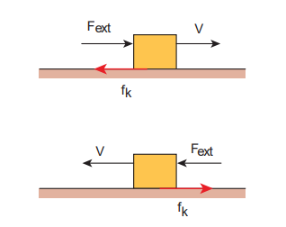

**Figure 3.24** Kinetic 
friction

Experimentally it was found that the 
magnitude of kinetic friction satisfies the 
relation

where µk is the coefficient of kinetic friction 
and N the normal force exerted by the 
surface on the object,

This implies that starting of a motion is 
more difficult than maintaining it. The 
salient features of static and kinetic friction 
are given in Table 3.2.

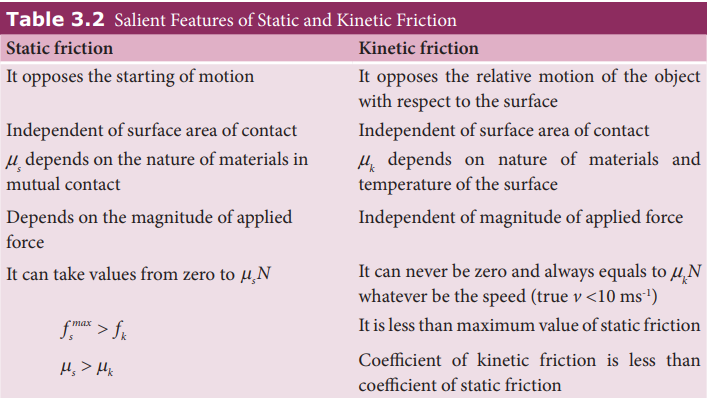

The variation of both static and kinetic 
frictional forces with external applied force 
is graphically shown in Figure 3.25.

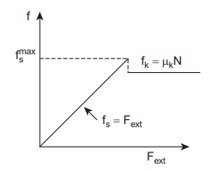

**Figure 3.25** Variation of 
static and kinetic frictional 
forces with external applied 
force

The Figure 3.25 shows that static friction 
increases linearly with external applied 
force till it reaches the maximum. If the 
object begins to move then the kinetic 
friction is slightly lesser than the maximum 
static friction. Note that the kinetic friction 
is constant and it is independent of applied 
force.

>**Note**

The relation f N s s   is not 
a vector relation. This is 
because the normal force N 
and fs
 are not in the same direction 
even though fs
 is equal to µs
 times the 
normal force. This is also true in the 
case of kinetic friction.

##  To Move an Object - Push or pull? Which is easier?

When a body is pushed at an arbitrary angle θ 
0
2
 to  

 

, the applied force F can be resolved 
into two components as F sinθ parallel to the 
surface and F cosθ perpendicular to the surface 
as shown in Figure 3.26. The total downward 
force acting on the body is mg + Fcosθ. It 
implies that the normal force acting on the 
body increases. Since there is no acceleration 
along the vertical direction the normal force 
N is equal to

As a result the maximal static friction also 
increases and is equal to

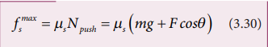

Equation (3.30) shows that a greater force 
needs to be applied to push the object into 
motion.

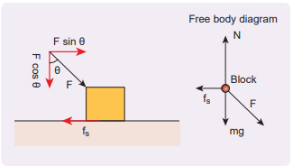

**Figure 3.26** An object is pushed at an 
angle θ

When an object is pulled at an angle 
θ, the applied force is resolved into two 
components as shown in Figure 3.27. 
The total downward force acting on the 
object is

**Figure 3.27** An object is pulled at an 
angle θ

Equation (3.31) shows that the normal force 
is less than Npush. From equations (3.29) and 
(3.31), it is easier to pull an object than to 
push to make it move.

## Angle of Friction

The angle of friction is defined as the 
angle between the normal force (N) and 
the resultant force (R) of normal force and 
maximum friction force ( fs
max
)

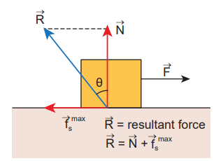

**Figure 3.28** Angle of Friction

In Figure 3.28 the resultant force is
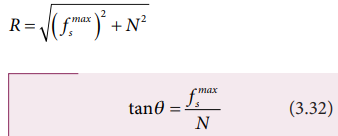

But from the frictional relation, the object 
begins to slide when f N

From equations (3.32) and (3.33) the 
coefficient of static friction is

*The coefficient of static friction is equal to 
tangent of the angle of friction*

##  Angle of Repose

Consider an inclined plane on which an 
object is placed, as shown in Figure 3.29. 
Let the angle which this plane makes with 
the horizontal be θ . For small angles of θ , 
the object may not slide down. As θ is 
increased, for a particular value of θ , the 
object begins to slide down. This value is 
called angle of repose. Hence, the angle of 
repose is the angle of inclined plane with the 
horizontal such that an object placed on it 
begins to slide.

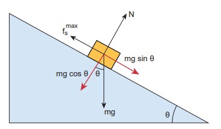

**Figure 3.29** Angle of repose

Let us consider the various forces in action 
here. The gravitational force mg is resolved 
into components parallel (mg sinθ) and 
perpendicular (mg cosθ) to the inclined 
plane.

The component of force parallel to the 
inclined plane (mg sinθ) tries to move the 
object down.

The component of force perpendicular 
to the inclined plane (mg cosθ) is balanced 
by the Normal force (N).

When the object just begins to move, 
the static friction attains its maximum 
value

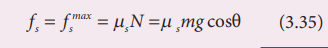

his friction also satisfies the relation

Dividing equations (3.35) and (3.36), 
we get

From the definition of angle of friction, we 
also know that

in which θ is the angle of friction.

*Thus the angle of repose is the same as 
angle of friction.* But the difference is that the 
angle of repose refers to inclined surfaces 
and the angle of friction is applicable to any 
type of surface.

>**EXAMPLE 3.20**

A block of mass m slides down the plane 
inclined at an angle 60° with an acceleration 
g
2
. Find the coefficient of kinetic friction? 

>*Solution*

Kinetic friction comes to play as the 
block is moving on the surface.

The forces acting on the mass are the 
normal force perpendicular to surface, 
downward gravitational force and kinetic 
friction fk along the surface.

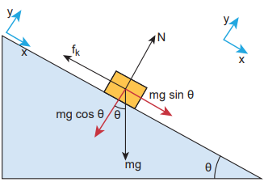

Along the x-direction

But a = g/2

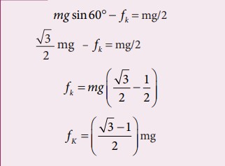

There is no motion along the y-direction 
as normal force is exactly balanced by the 
mg cosθ.

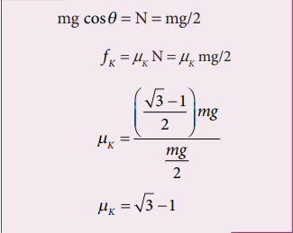

## Application of Angle of Repose

1. Antlions make sand traps in such a way that 
when an insect enters the edge of the trap, it 
starts to slide towards the bottom where the 
antilon hide itself. The angle of inclination 
of sand trap is made to be equal to angle of 
repose. It is shown in the Figure 3.30.

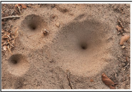

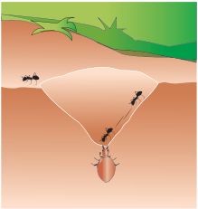

**Figure 3.30** Sand trap of antlions

2. Children are fond of playing on sliding 
board (Figure 3.31). Sliding will be easier
when the angle of inclination of the board is 
greater than the angle of repose. At the same 
time if inclination angle is much larger than 
the angle of repose, the slider will reach the 
bottom at greater speed and get hurt.

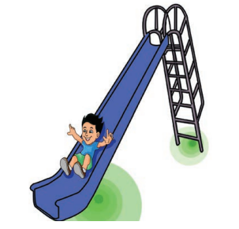

**Figure 3.31** Sliding board

>**ACTIVITY**

**Measuring the coefficients 
of friction**

Take a hard bound note book and a 
coin. Keep the coin on the note book. 
The note book cover has to be in an 
inclined position as shown in the 
figure. Slowly increase the angle of 
inclination of the cover with respect 
to rest of the pages. When the angle 
of inclination reaches the angle of 
repose, the parallel component of 
gravitational force (mg sinθ ) to book 
surface becomes equal to the frictional 
force and the coin begins to slide 
down. Measure the angle of inclination 
and take the tangent of this angle. It 
gives the coefficient of static friction 
between the surface of the cover and 
coin. The same can be repeated with 
other objects such as an eraser in 

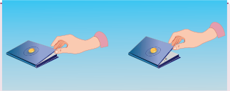

order to observe that the coefficient 
of static friction differs from case 
to case. 

>**Note**

At the point of sliding 
tanθs = ms
 To measure the 
coefficient of kinetic friction, reduce 
the inclination of the book after it 
starts sliding, such that the coin/
eraser moves with uniform velocity. 
Now measure the angle from which 
coefficient of kinetic friction can be 
calculated as
mK = tanθk
Observe that   K S

## Rolling Friction

The invention of the wheel plays a crucial 
role in human civilization. One of the 
important applications is suitcases with 
rolling on coasters. Rolling wheels makes 
it easier than carrying luggage. When an 
object moves on a surface, essentially it is 
sliding on it. But wheels move on the surface 
through rolling motion. In rolling motion 
when a wheel moves on a surface, the point 
of contact with surface is always at rest. 
Since the point of contact is at rest, there is 
no relative motion between the wheel and 
surface. Hence the frictional force is very 
less. At the same time if an object moves
without a wheel, there is a relative motion 
between the object and the surface. As a 
result frictional force is larger. This makes 
it difficult to move the object. The Figure 
3.32 shows the difference between rolling 
and kinetic friction. 

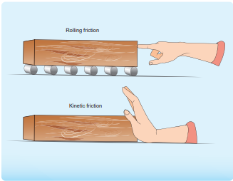

**Figure 3.32** Rolling and kinetic friction

Ideally in pure rolling, motion of the 
point of contact with the surface should be 
at rest, but in practice it is not so. Due to 
the elastic nature of the surface at the point 
of contact there will be some deformation 
on the object at this point on the wheel or 
surface as shown in Figure 3.33. Due to this 
deformation, there will be minimal friction 
between wheel and surface. It is called 
‘rolling friction’. In fact, ‘rolling friction’ is 
much smaller than kinetic friction.

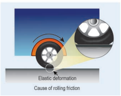

**Figure 3.33** Rolling friction

## Methods to Reduce Friction

Frictional force has both positive and 
negative effects. In some cases it is absolutely 
necessary. Walking is possible because of 
frictional force. Vehicles (bicycle, car) can 
move because of the frictional force between 
the tyre and the road. In the braking system, 
kinetic friction plays a major role. As we 
have already seen, the frictional force comes 
into effect whenever there is relative motion 
between two surfaces. In big machines 
used in industries, relative motion between 
different parts of the machine produce 
unwanted heat which reduces its efficiency. 
To reduce this kinetic friction lubricants are 
used as shown in Figure 3.34.

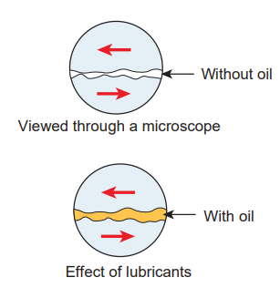

**Figure 3.34** Reducing kinetic 
friction using lubricant

Ball bearings provides another effective 
way to reduce the kinetic friction (Figure 3.35) 
in machines. If ball bearings are fixed between 
two surfaces, during the relative motion only 
the rolling friction comes to effect and not 
kinetic friction. As we have seen earlier, the 
rolling friction is much smaller than kinetic
friction; hence the machines are protected 
from wear and tear over the years.

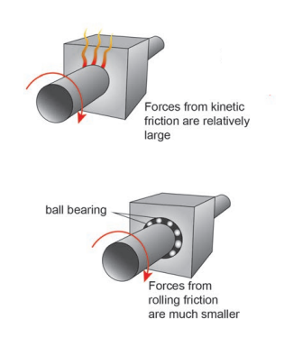

**Figure 3.35** Reducing kinetic 
friction using ball bearing

During the time of Newton and Galileo, 
frictional force was considered as one of the 
natural forces like gravitational force. But 
in the twentieth century, the understanding 
on atoms, electron and protons has changed 
the perspective. The frictional force is 
actually the electromagnetic force between 
the atoms on the two surfaces. Even well 
polished surfaces have irregularities on the 
surface at the microscopic level as seen in 
the Figure 3.36.

>**Points to Ponder**

>When you walk on the tiled floor 
where water is spilled, you are likely to slip. Why?

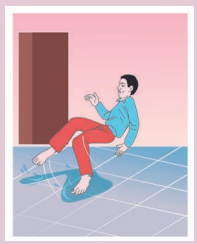

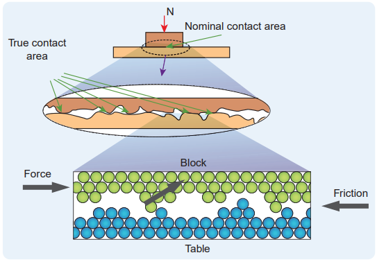

**Figure 3.36** Irregularities on the surface at the microscopic level

**Frictional force in the motion of a bicycle**

When a bicycle moves in the forward 
direction, what is the direction of frictional 
force in the rear and front wheels?

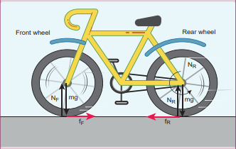

When we pedal a bicycle, we try to push 
the surface backward and the velocity 
of point of contact in the rear wheel is 
backwards. So, the frictional force pushes 
the rear wheel to move forward. But as 
the front wheel is connected with a rigid 
support to the back wheel, the forward 
motion of back wheel pushes the front 
wheel in the forward direction. So, the 
frictional forces act backward. Remember 
both frictional forces correspond to only 
static friction and not kinetic friction. If 
the wheel slips then kinetic friction comes 
into effect. In addition to static friction, 
the rolling friction also acts on both 
wheels in the backward direction.

>**EXAMPLE 3.21**

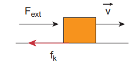

>*Solution*

If an object moves with constant velocity, 
then it has no acceleration. According to 
Newton’s second law there is no net force 
acting on the object. The external force is 
balanced by the kinetic friction.

>**Note**

It is not that ‘no force acts 
on the object’. In fact there 
are two forces acting on the 
object. Only the net force acting on 
the object is zero.