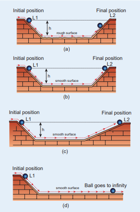

# INTRODUCTION

>Each and every object in the universe interacts 
with every other object. The cool breeze 
interacts with the tree. The tree interacts with 
the Earth. In fact, all species interact with 
nature. But, what is the difference between 
a human’s interaction with nature and that 
of an animal’s. Human’s interaction has 
one extra quality. We not only interact with 
nature but also try to understand and explain 
natural phenomena scientifically. 

>In the history of mankind, the most 
curiosity driven scientific question asked was 
about motion of objects–‘How things move?’ 
and ‘Why things move?’ Surprisingly, these 
simple questions have paved the way for 
development from early civilization to the 
modern technological era of the 21st century.

>Objects move because something pushes 
or pulls them. For example, if a book is at rest, 
it will not move unless a force is applied on 
it. In other words, to move an object a force 
must be applied on it. About 2500 years ago, 
the famous philosopher, Aristotle, said that 
‘Force causes motion’. This statement is based 
on common sense. But any scientific answer 
cannot be based on common sense. It must 
be endorsed with quantitative experimental 
proof.

>In the 15th century, Galileo challenged 
Aristotle’s idea by doing a series of 
experiments. He said force is not required 
to maintain motion.

> Galileo demonstrated his own idea using 
the following simple experiment. When a 
ball rolls from the top of an inclined plane 
to its bottom, after reaching the ground 
it moves some distance and continues
to move on to another inclined plane of 
same angle of inclination as shown in the 
Figure 3.1(a). By increasing the smoothness 
of both the inclined planes, the ball reach 
almost the same height(h) from where it 
was released (L1) in the second plane (L2) 
(Figure 3.1(b)). The motion of the ball 
is then observed by varying the angle of 
inclination of the second plane keeping the 
same smoothness. If the angle of inclination 
is reduced, the ball travels longer distance in 
the second plane to reach the same height 
(Figure 3.1 (c)). When the angle of inclination 
is made zero, the ball moves forever in the 
horizontal direction (Figure 3.1(d)). If the 
Aristotelian idea were true, the ball would 
not have moved in the second plane even if 
its smoothness is made maximum since no

> **Figure 3.1 Galileo’s**
experiment with the 
second plane (a) at same inclination angle 
as the first (b) with increased smoothness 
(c) with reduced angle of inclination 
(d) with zero angle of inclination

>force acted on it in the horizontal direction. 
From this simple experiment, Galileo 
proved that force is not required to maintain 
motion. An object can be in motion even 
without a force acting on it.

>In essence, Aristotle coupled the motion 
with force while Galileo decoupled the 
motion and force. 

