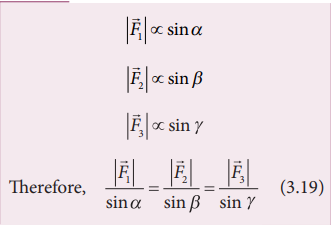
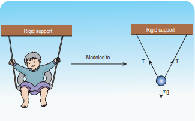
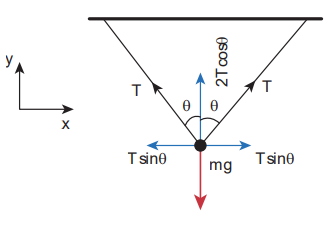
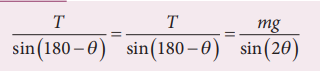

# LAMI’S THEOREM 

>If a system of three concurrent and coplanar 
forces is in equilibrium, then Lami’s theorem 
states that the magnitude of each force of the 
system is proportional to sine of the angle 
between the other two forces. The constant 
of proportionality is same for all three forces. 

>Let us consider three coplanar and 
concurrent forces    F F F 1 2 3 , and which act at
a common point O as shown in Figure 3.20. 
If the point is at equilibrium, then according 
to Lami’s theorem

**Figure 3.20** Three 
coplanar and concurrent 
forces    F F F 1 2 3 , and 
acting at O

>Lami’s theorem is useful to analyse the 
forces acting on objects which are in static 
equilibrium.

**Application of Lami’s Theorem**

>**EXAMPLE 3.14**

>A baby is playing in a swing which is hanging 
with the help of two identical chains is at rest. 
Identify the forces acting on the baby. Apply 
Lami’s theorem and find out the tension 
acting on the chain.

*Solution*

>The baby and the chains are modeled as a 
particle hung by two strings as shown in the 
figure. There are three forces acting on the 
baby.

i) Downward gravitational force along 
negative y direction (mg)

ii) Tension (T) along the two strings

>These three forces are coplanar as well as 
concurrent as shown in the following figure.

By using Lami’s theorem 

>Since sin(180-θ) = sin θ and sin (2θ) = 2 sinθ cosθ

>From this, the tension on each string is 
T mg  2cos
.

>**Note**

>When   0 , the strings are 
vertical and the tension on 
each string is T mg = 2