# LAW OF CONSERVATION OF TOTAL LINEAR MOMENTUM

>In nature, conservation laws play a very 
important role. The dynamics of motion 
of bodies can be analysed very effectively 
using conservation laws. There are 
three conservation laws in mechanics. 
Conservation of total energy, conservation of 
total linear momentum, and conservation of 
angular momentum. By combining Newton’s 
second and third laws, we can derive the law 
of conservation of total linear momentum.

>When two particles interact with each 
other, they exert equal and opposite forces 
on each other. The particle 1 exerts force 
F21
on particle 2 and particle 2 exerts an exactly 
equal and opposite force 
F12 on particle 1, 
according to Newton’s third law.

>In terms of momentum of particles, the 
force on each particle (Newton’s second law) 
can be written as

>Here 
p1 is the momentum of particle 1 
which changes due to the force 
F12 exerted 
by particle 2. Further 
p2 is the momentum 
of particle 2. This changes due to 
F21 exerted 
by particle 1.

>Substitute equation (3.21) in equation 
(3.20)

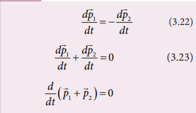

>It implies that  
p p 1 2   constant vector 
(always).

> 
p p 1 2 + is the total linear momentum of 
the two particles (
   p p p tot  1 2). It is also 
called as total linear momentum of the 
system. Here, the two particles constitute 
the system. From this result, the law of 
conservation of linear momentum can be 
stated as follows.

>*If there are no external forces acting on the 
system, then the total linear momentum of 
the system ( 
ptot) is always a constant vector. 
In otherwords, the total linear momentum of 
the system is conserved in time. Here the word 
‘conserve’ means that 
p1 and 
p2 can vary,in 
such a way that*  
p p 1 2 + is a constant vector.

>The forces 
F12 and 
F21 are called the 
internal forces of the system, because they 
act only between the two particles. There is 
no external force acting on the two particles 
from outside. In such a case the total linear 
momentum of the system is a constant 
vector or is conserved.

>**EXAMPLE 3.15**

>Identify the internal and external forces 
acting on the following systems.

a) Earth alone as a system

b) Earth and Sun as a system 

c) Our body as a system while walking

d) Our body + Earth as a system

>*Solution*

**a) Earth alone as a system**

>Earth orbits the Sun due to gravitational 
attraction of the Sun. If we consider 
Earth as a system, then Sun’s 
gravitational force is an external force. 
If we take the Moon into account, it 
also exerts an external force on Earth.

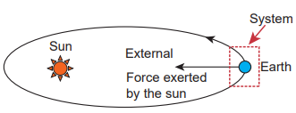

**b) (Earth + Sun) as a system**

>In this case, there are two internal forces 
which form an action and reaction pairthe gravitational force exerted by the 
Sun on Earth and gravitational force 
exerted by the Earth on the Sun.

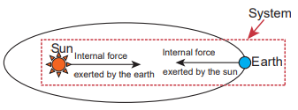

**c) Our body as a system**

>While walking, we exert a force on the 
Earth and Earth exerts an equal and 
opposite force on our body. If our body 
alone is considered as a system, then the force exerted by the Earth on our 
body is external.

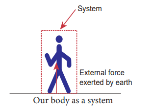

**d) (Our body + Earth) as a system**

>In this case, there are two internal 
forces present in the system. One is the 
force exerted by our body on the Earth 
and the other is the equal and opposite 
force exerted by the Earth on our body.

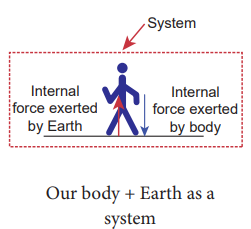

>Meaning of law of conservation of 
momentum

1) The Law of conservation of linear 
momentum is a vector law. It 
implies that both the magnitude and 
direction of total linear momentum 
are constant. In some cases, this 
total momentum can also be zero.

2) To analyse the motion of a particle, 
we can either use Newton’s second 
law or the law of conservation 
of linear momentum. Newton’s 
second law requires us to specify 
the forces involved in the process. 
This is difficult to specify in real 
situations. But conservation of 
linear momentum does not require 
any force involved in the process. It 
is covenient and hence important.

>For example, when two particles collide, 
the forces exerted by these two particles 
on each other is difficult to specify. But it 
is easier to apply conservation of linear 
momentum during the collision process.

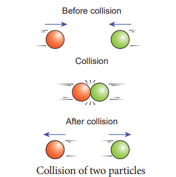

>**Examples**

>• Consider the firing of a gun. Here the 
system is Gun+bullet. Initially the gun 
and bullet are at rest, hence the total linear 
momentum of the system is zero. Let 
p1
be the momentum of the bullet and 
p2 the 
momentum of the gun before firing. Since 
initially both are at rest,

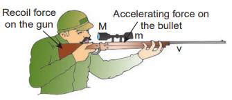

>Total momentum before firing the gun is 
zero,  
p p 1 2 0. 

>According to the law of conservation of 
linear momentum, total linear momemtum 
has to be zero after the firing also.

>When the gun is fired, a force is exerted 
by the gun on the bullet in forward 
direction. Now the momentum of the 
bullet changes from  
p p 1 1 to . To conserve 
the total linear momentum of the system, 
the momentum of the gun must also change 
from   p p 2 2 to ′ . Due to the conservation of 
linear momentum,  
p p 1 2 0. It implies 
that  
p p 1 2 , the momentum of the gun is 
exactly equal, but in the opposite direction 
to the momentum of the bullet. This is the 
reason after firing, the gun suddenly moves 
backward with the momentum 
p2
’ . It 
is called ‘recoil momemtum’. This is an 
example of conservation of total linear 
momentum.

>• Consider two particles. One is at rest and 
the other moves towards the first particle 
(which is at rest). They collide and after 
collison move in some arbitrary directions. 
In this case, before collision, the total linear 
momentum of the system is equal to the 
initial linear momentum of the moving 
particle. According to conservation of 
momentum, the total linear momentum 
after collision also has to be in the forward 
direction. The following figure explains this.

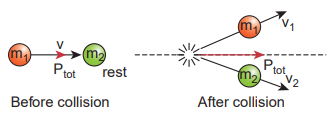

>A more accurate calculation is covered in 
section 4.4. It is to be noted that the total 
momentum vector before and after collison 
points in the same direction. This simply 
means that the total linear momentum is 
constant before and after the collision. At 
the time of collision, each particle exerts a 
force on the other. As the two particles are 
considered as a system, these forces are only 
internal, and the total linear momentum 
cannot be altered by internal forces.

##  Impulse

>*If a very large force acts on an object for a 
very short duration, then the force is called 
impulsive force or impulse.*

>If a force (F) acts on the object in a very 
short interval of time (Dt), from Newton’s 
second law in magnitude form

>$$ Fdt = dp $$

>Integrating over time from an initial time ti
to a final time tf , we get

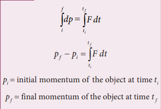

>p p p f i    change in momentum 
of the object during the time interval 
t t t f i    .

>The integral 
t
t
i
f
F dt J   is called the impulse 
and it is equal to change in momentum of 
the object.

>If the force is constant over the time 
interval, then

>Equation (3.24) is called the ‘impulse-momentum equation’

>For a constant force, the impulse is 
denoted as J F  t and it is also equal to 
change in momentum (p) of the object 
over the time interval t.

>Impulse is a vector quantity and its unit is Ns.

From equation (3.25), the average force 
that act on the object is greater if t is 
smaller. Whenever the momentum of the 
body changes very quickly, the average force 
becomes larger.

The impulse can also be written in terms 
of the average force. Since p is change in 
momentum of the object and is equal to 
impulse (J), we have

The graphical representation of constant 
force impulse and variable force impulse is 
given in Figure 3.21.

**Figure 3.21** Constant force impulse 
and variable force impulse

>Illustration

1. When a cricket player catches the ball, he 
pulls his hands gradually in the direction 
of the ball’s motion. Why? 

If he stops his hands soon after 
catching the ball, the ball comes to 
rest very quickly. It means that the 
momentum of the ball is brought to rest 
very quickly. So the average force acting 
on the body will be very large. Due to 
this large average force, the hands will 
get hurt. To avoid getting hurt, the player 
brings the ball to rest slowly.

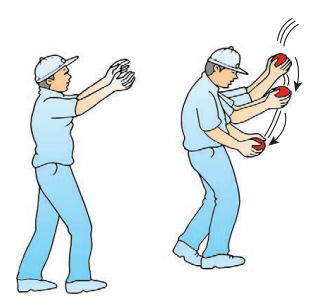

2. When a car meets with an accident, its 
momentum reduces drastically in a very 
short time. This is very dangerous for the 
passengers inside the car since they will 
experience a large force. To prevent this 
fatal shock, cars are designed with air 
bags in such a way that when the car 
meets with an accident, the momentum 
of the passengers will reduce slowly so 
that the average force acting on them 
will be smaller.

3. The shock absorbers in two wheelers play 
the same role as airbags in the car. When 
there is a bump on the road, a sudden 
force is transferred to the vehicle. The 
shock absorber prolongs the period of 
transfer of force on to the body of the 
rider. Vehicles without shock absorbers 
will harm the body due to this reason.

4. Jumping on a concrete cemented floor 
is more dangerous than jumping on the 
sand. Sand brings the body to rest slowly 
than the concrete floor, so that the 
average force experienced by the body 
will be lesser.

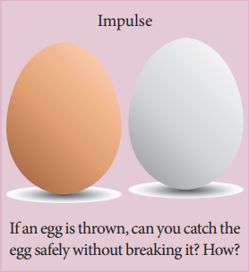

>**EXAMPLE 3.16**

An object of mass 10 kg moving with a 
speed of 15 m s−1 hits the wall and comes 
to rest within

a) 0.03 second

b) 10 second

Calculate the impulse and average force 
acting on the object in both the cases.

>*Solution*

Initial momentum of the object 
pi =10 × 15 =150 k gm s−1

Final momentum of the object pf = 0

(a) Impulse J p = = D 150N s.

(b) Impulse J p = = D 150N s

(a) Average force F p
t avg  
 = 150
0 03
5000 . = N

(b) Average force F N avg = = 150
10
15

We see that, impulse is the same in both 
cases, but the average force is different.